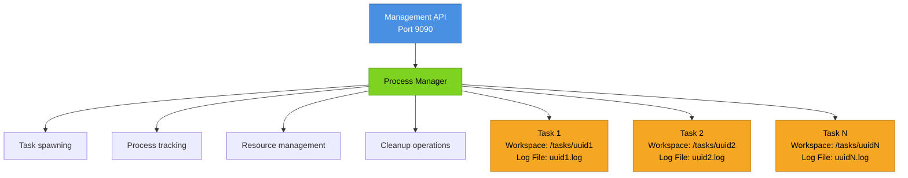
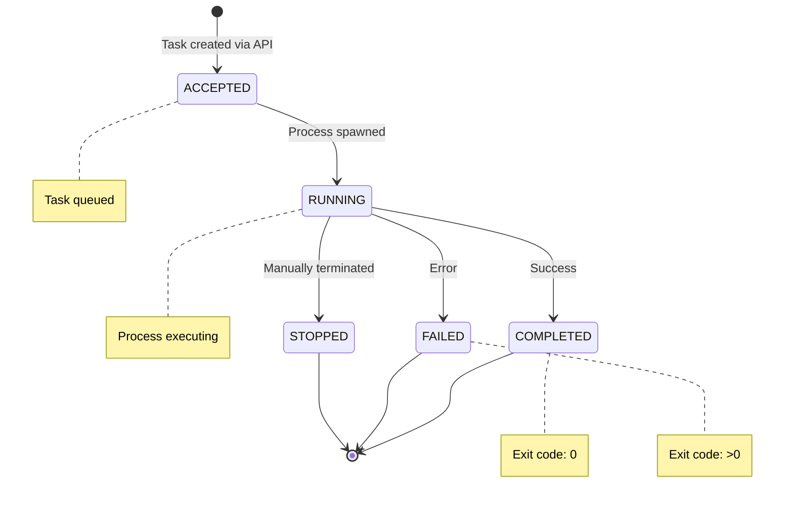

# Task Management Guide

---
**Version:** 1.0.0
**Last Updated:** 2025-10-12
**Status:** Active
**Category:** Guide
**Tags:** [tasks, api, management, monitoring, cli]
---

## Overview

This guide covers comprehensive task management in the Agentic Flow system using both the Management API and CLI tools. Tasks represent isolated agent workflows that execute in dedicated workspaces with their own resources, logs, and lifecycle management.

## Table of Contents

1. [Task Architecture](#task-architecture)
2. [Creating Tasks](#creating-tasks)
3. [Task Lifecycle and States](#task-lifecycle-and-states)
4. [Monitoring Task Progress](#monitoring-task-progress)
5. [Task Isolation and Workspaces](#task-isolation-and-workspaces)
6. [Accessing Task Logs](#accessing-task-logs)
7. [Task Timeout and Resource Limits](#task-timeout-and-resource-limits)
8. [Canceling Tasks](#canceling-tasks)
9. [Best Practices](#best-practices)

---

## Task Architecture

### Isolation Model

Each task runs in complete isolation with:

- **Dedicated Workspace**: `/home/devuser/workspace/tasks/{taskId}/`
- **Dedicated Log File**: `/home/devuser/logs/tasks/{taskId}.log`
- **Separate Process**: Detached child process with unique PID
- **Environment Variables**: Task-specific environment including `TASK_ID`



### Key Benefits

1. **No Database Locking**: Each task has isolated database instances
2. **No File Conflicts**: Separate working directories prevent collisions
3. **Independent Monitoring**: Per-task logs and metrics
4. **Resource Control**: Individual process management and limits
5. **Clean Termination**: No impact on other running tasks

---

## Creating Tasks

### Via API

#### Endpoint

**`POST /v1/tasks`**

#### Request Schema

```json
{
  "agent": "string",      // Required: Agent type (e.g., "coder", "researcher")
  "task": "string",       // Required: Task description/objective
  "provider": "string"    // Optional: AI provider (default: "gemini")
}
```

#### Response Schema

**Status:** `202 Accepted`

```json
{
  "taskId": "uuid",               // Unique task identifier
  "status": "accepted",            // Initial status
  "message": "string",             // Confirmation message
  "taskDir": "string",             // Task workspace directory
  "logFile": "string"              // Task log file path
}
```

#### Examples

**cURL:**
```bash
curl -X POST http://localhost:9090/v1/tasks \
  -H "Authorization: Bearer your-api-key" \
  -H "Content-Type: application/json" \
  -d '{
    "agent": "coder",
    "task": "Implement JWT authentication with refresh tokens",
    "provider": "claude"
  }'
```

**Response:**
```json
{
  "taskId": "f47ac10b-58cc-4372-a567-0e02b2c3d479",
  "status": "accepted",
  "message": "Task started successfully",
  "taskDir": "/home/devuser/workspace/tasks/f47ac10b-58cc-4372-a567-0e02b2c3d479",
  "logFile": "/home/devuser/logs/tasks/f47ac10b-58cc-4372-a567-0e02b2c3d479.log"
}
```

**JavaScript:**
```javascript
const axios = require('axios');

const client = axios.create({
  baseURL: 'http://localhost:9090',
  headers: {
    'Authorization': `Bearer ${process.env.MANAGEMENT_API_KEY}`,
    'Content-Type': 'application/json'
  }
});

async function createTask(agent, task, provider = 'gemini') {
  try {
    const response = await client.post('/v1/tasks', {
      agent,
      task,
      provider
    });

    console.log(`Task created: ${response.data.taskId}`);
    return response.data;
  } catch (error) {
    console.error('Failed to create task:', error.response?.data || error.message);
    throw error;
  }
}

// Usage
const taskInfo = await createTask('coder', 'Build REST API with Express', 'claude');
```

**Python:**
```python
import requests
import os

class TaskClient:
    def __init__(self, base_url='http://localhost:9090'):
        self.base_url = base_url
        self.headers = {
            'Authorization': f"Bearer {os.getenv('MANAGEMENT_API_KEY')}",
            'Content-Type': 'application/json'
        }

    def create_task(self, agent, task, provider='gemini'):
        response = requests.post(
            f'{self.base_url}/v1/tasks',
            headers=self.headers,
            json={'agent': agent, 'task': task, 'provider': provider}
        )
        response.raise_for_status()

        data = response.json()
        print(f"Task created: {data['taskId']}")
        return data

# Usage
client = TaskClient()
task_info = client.create_task('researcher', 'Analyze quantum computing trends')
```

### Via CLI (Inside Container)

While the primary interface is the Management API, you can also execute tasks directly inside the container:

```bash
# Enter the container
docker exec -it agentic-flow-cachyos bash

# Execute a task using the agentic-flow CLI
agentic-flow router --agent coder --task "Build authentication system" --provider claude

# Or using the start script
/scripts/start-agentic-flow.sh
```

**Note:** Direct CLI execution is useful for development and debugging, but production systems should use the Management API for task orchestration.

---

## Task Lifecycle and States

### State Machine



### State Definitions

| State | Description | Exit Code | Retriable |
|-------|-------------|-----------|-----------|
| `accepted` | Task created, process starting | N/A | N/A |
| `running` | Process executing, actively working | N/A | No |
| `completed` | Successfully finished | `0` | No |
| `failed` | Terminated with error | `> 0` | Yes |
| `stopped` | Manually terminated via API | `null` | Yes |

### State Transitions

**Valid Transitions:**
- `accepted` → `running`
- `running` → `completed`
- `running` → `failed`
- `running` → `stopped`

**Invalid Transitions:**
- Cannot restart `completed` tasks
- Cannot transition from `stopped` to `running` (must create new task)
- Cannot change state of non-existent tasks

---

## Monitoring Task Progress

### Get Task Status

#### Endpoint

**`GET /v1/tasks/:taskId`**

#### Response Schema

```json
{
  "taskId": "uuid",
  "agent": "string",
  "task": "string",
  "provider": "string",
  "status": "running|completed|failed|stopped",
  "startTime": 1704110400000,      // Unix timestamp (ms)
  "exitTime": 1704110500000,       // Unix timestamp (ms) or null
  "exitCode": 0,                   // Process exit code or null
  "duration": 100000,              // Duration in milliseconds
  "logTail": "string",             // Last 50 lines of log
  "error": "string"                // Error message if failed (optional)
}
```

#### Examples

**cURL:**
```bash
curl -H "Authorization: Bearer your-api-key" \
     http://localhost:9090/v1/tasks/f47ac10b-58cc-4372-a567-0e02b2c3d479
```

**JavaScript - Polling:**
```javascript
async function pollTaskUntilComplete(taskId, interval = 5000) {
  return new Promise((resolve, reject) => {
    const poll = setInterval(async () => {
      try {
        const response = await client.get(`/v1/tasks/${taskId}`);
        const { status, duration, exitCode, error } = response.data;

        console.log(`Task ${taskId}: ${status} (${duration}ms)`);

        if (status !== 'running') {
          clearInterval(poll);

          if (status === 'completed') {
            resolve(response.data);
          } else {
            reject(new Error(`Task ${status}: ${error || 'Unknown error'}`));
          }
        }
      } catch (error) {
        clearInterval(poll);
        reject(error);
      }
    }, interval);
  });
}

// Usage
try {
  const result = await pollTaskUntilComplete(taskId);
  console.log('Task completed successfully');
  console.log('Log excerpt:', result.logTail);
} catch (error) {
  console.error('Task failed:', error.message);
}
```

**Python - Polling:**
```python
import time

def poll_until_complete(client, task_id, interval=5):
    while True:
        response = requests.get(
            f'{client.base_url}/v1/tasks/{task_id}',
            headers=client.headers
        )
        response.raise_for_status()

        data = response.json()
        status = data['status']
        duration = data['duration']

        print(f"Task {task_id}: {status} ({duration}ms)")

        if status != 'running':
            if status == 'completed':
                return data
            else:
                error = data.get('error', 'Unknown error')
                raise Exception(f"Task {status}: {error}")

        time.sleep(interval)

# Usage
try:
    result = poll_until_complete(client, task_id)
    print("Task completed successfully")
    print(f"Log excerpt: {result['logTail']}")
except Exception as e:
    print(f"Task failed: {e}")
```

### List Active Tasks

#### Endpoint

**`GET /v1/tasks`**

#### Response Schema

```json
{
  "activeTasks": [
    {
      "taskId": "uuid",
      "agent": "string",
      "startTime": 1704110400000,
      "duration": 125000
    }
  ],
  "count": 2
}
```

#### Example

```bash
curl -H "Authorization: Bearer your-api-key" \
     http://localhost:9090/v1/tasks
```

**Response:**
```json
{
  "activeTasks": [
    {
      "taskId": "f47ac10b-58cc-4372-a567-0e02b2c3d479",
      "agent": "coder",
      "startTime": 1704110400000,
      "duration": 125000
    },
    {
      "taskId": "a1b2c3d4-e5f6-7890-1234-567890abcdef",
      "agent": "researcher",
      "startTime": 1704110500000,
      "duration": 25000
    }
  ],
  "count": 2
}
```

---

## Task Isolation and Workspaces

### Workspace Structure

Each task receives an isolated workspace directory:

```
/home/devuser/workspace/tasks/{taskId}/
├── .agentic-flow/          # Task-specific agent data
│   ├── memory.db           # Isolated agent memory
│   └── session.json        # Task session state
├── output/                 # Generated files
├── temp/                   # Temporary files
└── [task working files]    # Task artifacts
```

### Log Files

Logs are stored separately:

```
/home/devuser/logs/tasks/{taskId}.log
```

### Advantages of Isolation

1. **No Database Locking**
   - Each task has its own `memory.db`
   - No SQLite lock contention between tasks
   - Concurrent task execution without conflicts

2. **No File Conflicts**
   - Separate working directories
   - No overwriting of output files
   - Clean artifact organization

3. **Easy Cleanup**
   - Remove task directory to clean up
   - No impact on other tasks
   - Simplified debugging

4. **Resource Attribution**
   - Clear disk usage per task
   - Log files directly correlate to tasks
   - Audit trail for each execution

### Accessing Task Workspaces

```bash
# Enter container
docker exec -it agentic-flow-cachyos bash

# Navigate to task workspace
cd /home/devuser/workspace/tasks/f47ac10b-58cc-4372-a567-0e02b2c3d479

# View task artifacts
ls -la

# Check task logs
tail -f /home/devuser/logs/tasks/f47ac10b-58cc-4372-a567-0e02b2c3d479.log
```

---

## Accessing Task Logs

### Static Log Access (Last 50 Lines)

Included in task status response via `GET /v1/tasks/:taskId`:

```json
{
  "taskId": "...",
  "logTail": "Last 50 lines of log output..."
}
```

### Real-Time Log Streaming

#### Endpoint

**`GET /v1/tasks/:taskId/logs/stream`**

#### Protocol

Server-Sent Events (SSE)

#### Event Types

| Event | Data | Description |
|-------|------|-------------|
| `message` | `{ line: string, timestamp: number }` | Log line |
| `task-complete` | `{ status: string, exitCode: number, timestamp: number }` | Task finished |
| `error` | `{ message: string }` | Stream error |
| `heartbeat` | N/A | Keep-alive (every 30s) |

#### Examples

**JavaScript (Node.js):**
```javascript
const EventSource = require('eventsource');

function streamLogs(taskId) {
  const url = `http://localhost:9090/v1/tasks/${taskId}/logs/stream`;
  const eventSource = new EventSource(url, {
    headers: {
      'Authorization': `Bearer ${process.env.MANAGEMENT_API_KEY}`
    }
  });

  eventSource.on('message', (event) => {
    const { line, timestamp } = JSON.parse(event.data);
    console.log(`[${new Date(timestamp).toISOString()}] ${line}`);
  });

  eventSource.addEventListener('task-complete', (event) => {
    const { status, exitCode } = JSON.parse(event.data);
    console.log(`\nTask completed: ${status} (exit code: ${exitCode})`);
    eventSource.close();
  });

  eventSource.addEventListener('error', (event) => {
    if (event.data) {
      const { message } = JSON.parse(event.data);
      console.error(`Stream error: ${message}`);
    }
    eventSource.close();
  });

  eventSource.onerror = (error) => {
    console.error('Connection error:', error);
    eventSource.close();
  };

  return eventSource;
}

// Usage
const stream = streamLogs('f47ac10b-58cc-4372-a567-0e02b2c3d479');

// Stop streaming manually if needed
// stream.close();
```

**Python:**
```python
import sseclient
import requests
import json
import os

def stream_logs(task_id):
    url = f'http://localhost:9090/v1/tasks/{task_id}/logs/stream'
    headers = {
        'Authorization': f"Bearer {os.getenv('MANAGEMENT_API_KEY')}",
        'Accept': 'text/event-stream'
    }

    response = requests.get(url, headers=headers, stream=True)
    client = sseclient.SSEClient(response)

    try:
        for event in client.events():
            if event.event == 'message' or event.event == '':
                data = json.loads(event.data)
                timestamp = data['timestamp']
                line = data['line']
                print(f"[{timestamp}] {line}")

            elif event.event == 'task-complete':
                data = json.loads(event.data)
                print(f"\nTask completed: {data['status']} (exit code: {data['exitCode']})")
                break

            elif event.event == 'error':
                data = json.loads(event.data)
                print(f"Stream error: {data['message']}")
                break

    except Exception as e:
        print(f"Connection error: {e}")
    finally:
        response.close()

# Usage
stream_logs('f47ac10b-58cc-4372-a567-0e02b2c3d479')
```

**Browser JavaScript:**
```html
<!DOCTYPE html>
<html>
<head>
  <title>Task Log Viewer</title>
  <style>
    #logs {
      font-family: monospace;
      background: #1e1e1e;
      color: #d4d4d4;
      padding: 20px;
      height: 80vh;
      overflow-y: auto;
    }
    .log-line {
      margin: 2px 0;
    }
    .timestamp {
      color: #569cd6;
    }
  </style>
</head>
<body>
  <h1>Task Logs</h1>
  <div id="logs"></div>

  <script>
    const taskId = 'f47ac10b-58cc-4372-a567-0e02b2c3d479';
    const logsDiv = document.getElementById('logs');

    const eventSource = new EventSource(
      `http://localhost:9090/v1/tasks/${taskId}/logs/stream`
    );

    eventSource.onmessage = (event) => {
      const { line, timestamp } = JSON.parse(event.data);
      const time = new Date(timestamp).toISOString();

      const logLine = document.createElement('div');
      logLine.className = 'log-line';
      logLine.innerHTML = `<span class="timestamp">[${time}]</span> ${line}`;

      logsDiv.appendChild(logLine);
      logsDiv.scrollTop = logsDiv.scrollHeight;
    };

    eventSource.addEventListener('task-complete', (event) => {
      const { status, exitCode } = JSON.parse(event.data);

      const completionLine = document.createElement('div');
      completionLine.style.color = status === 'completed' ? '#4ec9b0' : '#f48771';
      completionLine.textContent = `\nTask ${status} (exit code: ${exitCode})`;

      logsDiv.appendChild(completionLine);
      eventSource.close();
    });

    eventSource.onerror = (error) => {
      console.error('Stream error:', error);
      eventSource.close();
    };
  </script>
</body>
</html>
```

### Direct File Access (Inside Container)

```bash
# View full log
cat /home/devuser/logs/tasks/{taskId}.log

# Follow log in real-time
tail -f /home/devuser/logs/tasks/{taskId}.log

# Search logs
grep "error" /home/devuser/logs/tasks/{taskId}.log

# Last 100 lines
tail -n 100 /home/devuser/logs/tasks/{taskId}.log
```

---

## Task Timeout and Resource Limits

### Docker Resource Limits

Configured in `docker-compose.yml`:

```yaml
services:
  agentic-flow-cachyos:
    deploy:
      resources:
        limits:
          memory: 64G          # Maximum memory
          cpus: '32'           # Maximum CPU cores
        reservations:
          memory: 16G          # Guaranteed memory
          cpus: '8'            # Guaranteed CPU cores
```

### Per-Task Process Limits

Tasks inherit container limits but run as isolated processes:

```javascript
// In process-manager.js
const childProcess = spawn('agentic-flow', args, {
  cwd: taskDir,              // Isolated working directory
  env: {
    ...process.env,
    TASK_ID: taskId
  },
  detached: true,            // Independent process group
  stdio: ['ignore', 'pipe', 'pipe']
});
```

### Memory Cleanup

Old completed tasks are automatically cleaned from memory:

```javascript
// Automatic cleanup every 10 minutes
setInterval(() => {
  processManager.cleanup(3600000); // Remove tasks older than 1 hour
}, 600000);
```

**Cleanup removes tasks from memory tracking only. Workspace and log files are preserved.**

### Implementing Timeouts

The API doesn't enforce hard timeouts, but you can implement them client-side:

**JavaScript:**
```javascript
async function executeTaskWithTimeout(taskId, timeoutMs = 300000) {
  const timeoutPromise = new Promise((_, reject) => {
    setTimeout(() => {
      reject(new Error(`Task timeout after ${timeoutMs}ms`));
    }, timeoutMs);
  });

  const taskPromise = pollTaskUntilComplete(taskId);

  try {
    const result = await Promise.race([taskPromise, timeoutPromise]);
    return result;
  } catch (error) {
    // Timeout occurred, stop the task
    if (error.message.includes('timeout')) {
      await client.delete(`/v1/tasks/${taskId}`);
    }
    throw error;
  }
}
```

**Python:**
```python
import signal

class TimeoutError(Exception):
    pass

def timeout_handler(signum, frame):
    raise TimeoutError("Task timeout")

def execute_with_timeout(client, task_id, timeout_seconds=300):
    signal.signal(signal.SIGALRM, timeout_handler)
    signal.alarm(timeout_seconds)

    try:
        result = poll_until_complete(client, task_id)
        signal.alarm(0)  # Cancel alarm
        return result
    except TimeoutError:
        # Stop the task
        client.request('DELETE', f'/v1/tasks/{task_id}')
        raise
    except Exception as e:
        signal.alarm(0)  # Cancel alarm
        raise
```

### Monitoring Resource Usage

Check system status via Management API:

```bash
curl -H "Authorization: Bearer your-api-key" \
     http://localhost:9090/v1/status
```

**Response:**
```json
{
  "status": "healthy",
  "uptime": 3600000,
  "system": {
    "cpuUsage": 45.2,
    "memoryUsage": 62.8,
    "diskUsage": 35.1
  },
  "tasks": {
    "active": 3,
    "total": 127
  }
}
```

---

## Canceling Tasks

### Stop Running Task

#### Endpoint

**`DELETE /v1/tasks/:taskId`**

#### Behavior

1. Sends `SIGTERM` to task process (graceful shutdown)
2. Updates task status to `stopped`
3. If process doesn't exit within 10 seconds, sends `SIGKILL` (forced termination)

#### Response Schema

**Status:** `200 OK`

```json
{
  "taskId": "uuid",
  "status": "stopped",
  "message": "Task stop signal sent successfully"
}
```

**Status:** `404 Not Found` - Task doesn't exist

**Status:** `409 Conflict` - Task already in terminal state

#### Examples

**cURL:**
```bash
curl -X DELETE \
  -H "Authorization: Bearer your-api-key" \
  http://localhost:9090/v1/tasks/f47ac10b-58cc-4372-a567-0e02b2c3d479
```

**JavaScript:**
```javascript
async function stopTask(taskId) {
  try {
    const response = await client.delete(`/v1/tasks/${taskId}`);
    console.log(`Task stopped: ${response.data.message}`);
    return true;
  } catch (error) {
    if (error.response?.status === 404) {
      console.error('Task not found');
    } else if (error.response?.status === 409) {
      console.error('Task already stopped');
    } else {
      console.error('Failed to stop task:', error.message);
    }
    return false;
  }
}

// Usage
await stopTask('f47ac10b-58cc-4372-a567-0e02b2c3d479');
```

**Python:**
```python
def stop_task(client, task_id):
    try:
        response = requests.delete(
            f'{client.base_url}/v1/tasks/{task_id}',
            headers=client.headers
        )
        response.raise_for_status()

        data = response.json()
        print(f"Task stopped: {data['message']}")
        return True
    except requests.HTTPError as e:
        if e.response.status_code == 404:
            print("Task not found")
        elif e.response.status_code == 409:
            print("Task already stopped")
        else:
            print(f"Failed to stop task: {e}")
        return False

# Usage
stop_task(client, 'f47ac10b-58cc-4372-a567-0e02b2c3d479')
```

### Cleanup After Cancellation

Task workspaces and logs remain after cancellation for forensics:

```bash
# Manual cleanup (inside container)
rm -rf /home/devuser/workspace/tasks/{taskId}
rm /home/devuser/logs/tasks/{taskId}.log
```

**Recommended:** Keep logs for auditing; implement automated retention policies.

---

## Best Practices

### 1. Task Design

**Do:**
- Create atomic, single-purpose tasks
- Provide clear, specific task descriptions
- Use appropriate agent types for the work
- Break complex workflows into multiple tasks

**Don't:**
- Create monolithic, multi-hour tasks
- Use vague or ambiguous task descriptions
- Mix unrelated work in one task
- Chain dependent tasks without coordination

### 2. Resource Management

**Do:**
- Monitor active task count (`GET /v1/tasks`)
- Set client-side timeouts for long-running tasks
- Implement task queuing for high loads
- Clean up old task artifacts regularly

**Don't:**
- Spawn unlimited concurrent tasks
- Let tasks run indefinitely without monitoring
- Ignore resource usage warnings
- Keep unnecessary task data forever

### 3. Error Handling

**Do:**
- Check task status regularly
- Implement retry logic with exponential backoff
- Log task failures for debugging
- Handle all HTTP error codes gracefully

**Don't:**
- Assume tasks always succeed
- Retry immediately on failure
- Ignore error messages in responses
- Leave failed tasks without investigation

### 4. Monitoring and Logging

**Do:**
- Stream logs for critical tasks
- Store task IDs for reference
- Monitor system health (`GET /v1/status`)
- Implement alerting for task failures

**Don't:**
- Poll status too frequently (use SSE for real-time)
- Discard task IDs prematurely
- Ignore system resource warnings
- Run tasks without monitoring

### 5. Security

**Do:**
- Protect API keys securely
- Use environment variables for credentials
- Validate task inputs before submission
- Implement authentication on API endpoints

**Don't:**
- Hardcode API keys in code
- Expose API ports publicly without auth
- Accept untrusted task descriptions
- Run tasks with elevated privileges unnecessarily

### 6. Performance Optimization

**Do:**
- Use appropriate AI providers for task complexity
- Batch-create tasks when possible
- Use SSE for log streaming (not polling)
- Select optimal agent types

**Don't:**
- Use expensive providers for simple tasks
- Create tasks sequentially in loops
- Poll logs repeatedly
- Use generic agents when specialized ones exist

### 7. Production Deployment

**Do:**
- Configure proper resource limits in `docker-compose.yml`
- Implement health checks and monitoring
- Set up log aggregation
- Use load balancing for high availability

**Don't:**
- Use default API keys in production
- Skip health check endpoints
- Store logs only in containers
- Run single instances without failover

---

## Example: Complete Task Workflow

```javascript
const axios = require('axios');
const EventSource = require('eventsource');

class TaskOrchestrator {
  constructor(baseURL, apiKey) {
    this.client = axios.create({
      baseURL,
      headers: {
        'Authorization': `Bearer ${apiKey}`,
        'Content-Type': 'application/json'
      }
    });
    this.apiKey = apiKey;
  }

  async createTask(agent, task, provider = 'gemini') {
    const response = await this.client.post('/v1/tasks', {
      agent,
      task,
      provider
    });
    return response.data;
  }

  async getStatus(taskId) {
    const response = await this.client.get(`/v1/tasks/${taskId}`);
    return response.data;
  }

  async stopTask(taskId) {
    const response = await this.client.delete(`/v1/tasks/${taskId}`);
    return response.data;
  }

  streamLogs(taskId, onLog, onComplete, onError) {
    const url = `${this.client.defaults.baseURL}/v1/tasks/${taskId}/logs/stream`;
    const eventSource = new EventSource(url, {
      headers: { 'Authorization': `Bearer ${this.apiKey}` }
    });

    eventSource.on('message', (event) => {
      const { line, timestamp } = JSON.parse(event.data);
      onLog(line, timestamp);
    });

    eventSource.addEventListener('task-complete', (event) => {
      const data = JSON.parse(event.data);
      eventSource.close();
      onComplete(data);
    });

    eventSource.addEventListener('error', (event) => {
      const data = event.data ? JSON.parse(event.data) : { message: 'Unknown error' };
      eventSource.close();
      onError(data);
    });

    eventSource.onerror = (error) => {
      eventSource.close();
      onError({ message: error.message || 'Connection error' });
    };

    return eventSource;
  }

  async executeWithTimeout(taskId, timeoutMs = 300000) {
    const timeoutPromise = new Promise((_, reject) => {
      setTimeout(() => reject(new Error('Task timeout')), timeoutMs);
    });

    const pollPromise = new Promise(async (resolve, reject) => {
      const interval = setInterval(async () => {
        try {
          const status = await this.getStatus(taskId);

          if (status.status !== 'running') {
            clearInterval(interval);

            if (status.status === 'completed') {
              resolve(status);
            } else {
              reject(new Error(`Task ${status.status}: ${status.error || 'Unknown error'}`));
            }
          }
        } catch (error) {
          clearInterval(interval);
          reject(error);
        }
      }, 5000);
    });

    try {
      return await Promise.race([pollPromise, timeoutPromise]);
    } catch (error) {
      if (error.message === 'Task timeout') {
        await this.stopTask(taskId);
      }
      throw error;
    }
  }
}

// Usage Example
async function main() {
  const orchestrator = new TaskOrchestrator(
    'http://localhost:9090',
    process.env.MANAGEMENT_API_KEY
  );

  try {
    // Create task
    console.log('Creating task...');
    const taskInfo = await orchestrator.createTask(
      'coder',
      'Implement OAuth2 authentication with Google and GitHub',
      'claude'
    );
    console.log(`Task created: ${taskInfo.taskId}`);

    // Stream logs
    console.log('\nStreaming logs:');
    const stream = orchestrator.streamLogs(
      taskInfo.taskId,
      (line, timestamp) => {
        console.log(`[${new Date(timestamp).toISOString()}] ${line}`);
      },
      (result) => {
        console.log(`\nTask completed: ${result.status}`);
      },
      (error) => {
        console.error(`\nStream error: ${error.message}`);
      }
    );

    // Wait for completion with timeout
    const result = await orchestrator.executeWithTimeout(taskInfo.taskId, 300000);

    console.log('\n=== Task Result ===');
    console.log(`Status: ${result.status}`);
    console.log(`Duration: ${result.duration}ms`);
    console.log(`Exit Code: ${result.exitCode}`);
    console.log('\nLog Excerpt:');
    console.log(result.logTail);

  } catch (error) {
    console.error('Task execution failed:', error.message);
    process.exit(1);
  }
}

main();
```

---

## Related Documentation

- [Programmatic Control Guide](programmatic-control.md) - Complete API integration guide
- [Architecture Documentation](../architecture/FINAL-ARCHITECTURE.md) - System architecture
- [Deployment Guide](../DEPLOYMENT.md) - Production deployment
- [API Reference](http://localhost:9090/docs) - OpenAPI documentation

---

**Questions or Issues?**
- GitHub Issues: https://github.com/ruvnet/agentic-flow/issues
- API Documentation: http://localhost:9090/docs
- Health Check: http://localhost:9090/health
