# Multi-Agent Docker Environment

[](https://www.docker.com/)
[](https://github.com/claude-flow/claude-flow)
[](https://modelcontextprotocol.io/)
[](https://www.python.org/)
[](https://nodejs.org/)

This project provides a sophisticated, multi-container Docker environment designed for AI agents. It orchestrates both local CLI tools and external GUI applications using the Model Context Protocol (MCP), enabling advanced AI-driven development workflows.

## ✨ Key Features

- **Dual-Container Architecture**: Separates core AI logic and CLI tools from resource-intensive GUI applications.
- **Rich Development Environment**: A polyglot environment with runtimes for Python, Node.js, Rust, and Deno, equipped with extensive tooling for AI/ML, 3D graphics, EDA, document processing, and network analysis.
- **Flexible MCP Connectivity**: Supports both WebSocket (port 3002) and high-performance TCP (port 9500) for MCP communication.
- **Enterprise-Grade Security**: Comprehensive security features including authentication, rate limiting, SSL/TLS encryption, CORS protection, and audit logging.
- **Comprehensive AI Tooling**: Includes a full suite of AI/ML libraries (PyTorch, TensorFlow), GPU acceleration with the CUDA Toolkit, and CLIs for major AI models (Gemini, OpenAI Codex, Anthropic Claude).
- **Advanced Hardware Acceleration**: Supports GPU-accelerated computing with CUDA and AI inference with the WasmEdge runtime and its OpenVINO backend.
- **MCP-based Orchestration**: Utilises the Model Context Protocol for seamless interaction between AI agents and a wide array of specialised tools.
- **External Application Bridges**: Employs TCP-based bridges for robust communication with external GUI applications (Blender, QGIS) running in a dedicated container.
- **Automated & Customisable Setup**: Features helper scripts for easy workspace initialisation and a user-centric configuration that aligns container permissions with the host system.

## 🎬 Demonstration

Here is a demonstration of the Blender MCP tool in action, creating a complex 3D scene programmatically.

**Screenshot:**


**Demonstration:**


## 🚀 Quick Start Guide

Get up and running with the Multi-Agent Docker Environment in under 5 minutes!

### 🚀 TL;DR

```bash
# 1. Clone & enter directory
git clone <repository-url> && cd multi-agent-docker

# 2. Build and start the environment
./multi-agent.sh build
./multi-agent.sh start

# 3. Inside the container shell, initialize the workspace
/app/setup-workspace.sh

# 4. Verify the setup
./mcp-helper.sh test-all
```

### 📋 Prerequisites Checklist

- [ ] Docker Engine installed
- [ ] Docker Compose installed
- [ ] Git installed
- [ ] 16GB+ RAM recommended (configurable)
- [ ] 20GB+ disk space
- [ ] (Optional) NVIDIA GPU with drivers for acceleration

### 🎯 Step-by-Step Guide

#### Step 1: Get the Code

```bash
git clone <repository-url>
cd multi-agent-docker
```

#### Step 2: Build and Start

The `multi-agent.sh` script simplifies the setup process.

First, build the Docker images:
```bash
./multi-agent.sh build
```

Then, start the services. This command will start the containers in the background and automatically open a shell into the `multi-agent-container`:
```bash
./multi-agent.sh start
```

You will see output indicating the containers are starting, followed by the container's command prompt:
```
Starting multi-agent container...
...
Container started! Waiting for health checks...
...
Multi-Agent Container Status:
=============================
NAME                      IMAGE                             STATUS              PORTS
gui-tools-container       multi-agent-docker-gui-tools      Up About a minute   0.0.0.0:5901->5901/tcp, 0.0.0.0:9876-9878->9876-9878/tcp
multi-agent-container     multi-agent-docker-multi-agent    Up About a minute   0.0.0.0:3000->3000/tcp, 0.0.0.0:3002->3002/tcp

Entering multi-agent container as 'dev' user...
dev@multi-agent-container:/workspace$
```

#### Step 3: Initialize Your Workspace

Once inside the container, run the setup script. This only needs to be done the first time you start the environment.
```bash
/app/setup-workspace.sh
```
This script prepares your environment by:
- ✅ Copying the latest MCP tools and helper scripts into your workspace.
- ✅ Setting the correct executable permissions.
- ✅ Installing the `claude-flow` orchestrator via `npm`.
- ✅ Verifying that all configured MCP tools are responsive.

#### Step 4: Test MCP Tools

```bash
# List all available tools
./mcp-helper.sh list-tools

# Test all tools automatically
./mcp-helper.sh test-all

# Test a specific tool (ImageMagick example)
./mcp-helper.sh test-imagemagick
```

### 🎉 Success Indicators

You'll know the environment is fully operational when you can confirm the following:

1.  **Both Containers are Running**: Open a new terminal on your host machine and run `./multi-agent.sh status`. You should see both `multi-agent-container` and `gui-tools-container` with a `Up` status.

2.  **VNC Access to GUI Tools**:
    *   Open your favorite VNC client (e.g., RealVNC, TigerVNC).
    *   Connect to `localhost:5901`.
    *   You should see the XFCE desktop environment of the `gui-tools-container`, with applications like Blender and QGIS running.

3.  **All MCP Tools Pass Tests**:
    *   Inside the `multi-agent-container` shell, run the test script:
        ```bash
        ./mcp-helper.sh test-all
        ```
    *   All tests should pass, indicating that the bridges to the external GUI applications are working correctly.

### 🔥 Common First Tasks

#### Test ImageMagick Tool

```bash
# Quick test using helper
./mcp-helper.sh test-imagemagick

# Manual test - create a golden square
./mcp-helper.sh run-tool imagemagick-mcp '{"method": "create", "params": {"width": 200, "height": 200, "colour": "gold", "output": "gold-square.png"}}'
```

#### Test PBR Generator

```bash
# Generate a metal PBR texture set
./mcp-helper.sh run-tool pbr-generator-mcp '{"tool": "generate-material", "params": {"material": "brushed-metal", "resolution": "1024x1024", "output": "./pbr-textures"}}'
```

#### Test 3D Tools

The 3D tools run in the `gui-tools-container` and are accessed via a bridge.

```bash
# Create a simple cube in Blender
./mcp-helper.sh run-tool blender-mcp '{"tool": "execute-code", "params": {"code": "import bpy; bpy.ops.mesh.primitive-cube-add()"}}'

# Check the QGIS version
./mcp-helper.sh run-tool qgis-mcp '{"tool": "get-qgis-version"}'
```
You can verify the cube was created by checking the VNC session at `localhost:5901`.

### ⚡ Quick Commands Reference

These commands are run from your **host machine's terminal**.

| Command | Description |
|---|---|
| `./multi-agent.sh build` | Builds or rebuilds the Docker images. |
| `./multi-agent.sh start` | Starts both containers and enters the `multi-agent-container` shell. |
| `./multi-agent.sh stop` | Stops and removes the containers. |
| `./multi-agent.sh restart` | Restarts the containers. |
| `./multi-agent.sh status` | Shows the status of the running containers. |
| `./multi-agent.sh logs` | Tails the logs from both containers. Use `logs -f` to follow. All logs now stream to `docker logs` for easy monitoring. |
| `./multi-agent.sh shell` | Enters the shell of an already running `multi-agent-container`. |
| `./multi-agent.sh cleanup` | Stops containers and removes all associated volumes (deletes all data). |

### 🆘 Quick Fixes

#### "Tool not available" error
```bash
# Re-run setup with force flag
/app/setup-workspace.sh --force
```

#### "Permission denied" error
```bash
# Fix ownership (should be automatic now)
sudo chown -R dev:dev /workspace
```

#### "Helper script not found"
```bash
# Copy helper script manually
cp /app/mcp-helper.sh ./
chmod +x ./mcp-helper.sh
```

#### GUI-dependent MCP servers timeout warnings
**Expected Behavior**: Blender, QGIS, KiCad, and ImageMagick MCP servers will show timeout warnings until the GUI container services are started. This is normal and will not affect core functionality. Services will become available once the `gui-tools-container` is fully initialized.

```bash
# Check GUI container status
docker ps | grep gui-tools-container

# View GUI container logs
docker logs gui-tools-container
```

### 🎯 Working with Claude

The setup automatically provides Claude with MCP tool knowledge. To use tools with Claude:

```bash
# Get instructions for Claude
./mcp-helper.sh claude-instructions

# Example task for Claude:
# "Using the imagemagick-mcp tool, create a 300x300 blue gradient image"
# "Using the pbr-generator-mcp tool, create realistic wood textures"
```

### 📚 Next Steps

- Read the 
- Explore the  for Claude
- Check out available [MCP Tools](#available-mcp-tools)
- Start building with the multi-agent environment!

### 🛠️ Available MCP Tools

| Tool | Status | Purpose | Container |
|------|--------|---------|-----------|
| **claude-flow** | ✅ Working | AI orchestration with memory | multi-agent |
| **ruv-swarm** | ✅ Working | Multi-agent coordination | multi-agent |
| **flow-nexus** | ✅ Working | Workflow orchestration | multi-agent |
| **playwright-mcp** | ✅ Working | Browser automation | gui-tools |
| **blender-mcp** | ⏳ GUI-dependent | 3D modeling & rendering | gui-tools |
| **qgis-mcp** | ⏳ GUI-dependent | Geospatial analysis | gui-tools |
| **kicad-mcp** | ⏳ GUI-dependent | Electronic design | gui-tools |
| **imagemagick-mcp** | ⏳ GUI-dependent | Image manipulation | gui-tools |

**Note**: GUI-dependent tools will show soft-fail timeout warnings until the GUI container services fully initialize. This is expected behaviour and does not affect core MCP functionality.

---

**Need help?** Use `./mcp-helper.sh claude-instructions` or check the !

## ⚙️ Resource Configuration

### Default Resource Allocation

Both containers default to **16GB RAM** and **4 CPUs** for optimal performance with AI workloads.

**Customization**: Override defaults via environment variables in `.env`:

```bash
# .env file
DOCKER-MEMORY=8g      # Adjust memory allocation
DOCKER-CPUS=2         # Adjust CPU cores
```

**Requirements**:
- Minimum: 8GB RAM, 2 CPUs
- Recommended: 16GB RAM, 4 CPUs
- Optimal: 32GB+ RAM, 8+ CPUs with NVIDIA GPU

## 🔌 MCP Connectivity

This environment offers two primary ways to connect to the Model Context Protocol (MCP) server, catering to different needs for performance and accessibility.

### MCP TCP Server (Port 9500)

For high-performance, low-latency connections, a direct TCP server is available. This is the recommended method for inter-container communication or performance-critical applications.

-   **Port**: `9500` (configurable via `MCP-TCP-PORT`)
-   **Benefits**:
    -   **Performance**: Direct TCP is significantly faster than WebSocket, with lower overhead.
    -   **Simplicity**: No WebSocket protocol layer, making it easier to use with standard TCP clients.
    -   **Compatibility**: Works with any standard TCP client library in any language.

#### Usage (from another container)

```rust
use tokio::net::TcpStream;
use tokio::io::{AsyncBufReadExt, AsyncWriteExt, BufReader};

let mut stream = TcpStream::connect("multi-agent-container:9500").await?;
let mut reader = BufReader::new(stream.try-clone().await?);

// Send request
let request = r#"{"jsonrpc":"2.0","id":"1","method":"initialize","params":{}}"#;
stream.write-all(request.as-bytes()).await?;
stream.write-all(b"\n").await?;

// Read response
let mut response = String::new();
reader.read-line(&mut response).await?;
```

#### Management Commands (inside `multi-agent-container`)

-   `mcp-tcp-start`: Start the TCP server.
-   `mcp-tcp-stop`: Stop the TCP server.
-   `mcp-tcp-status`: Check the server status.
-   `mcp-tcp-restart`: Restart the server.
-   `mcp-tcp-test`: Run a simple connection test.

#### Logging

All MCP services now log to **stdout/stderr** for unified monitoring:

```bash
# View all logs from host
docker logs multi-agent-container

# Follow logs in real-time
docker logs -f multi-agent-container

# View timestamped logs
docker logs -t multi-agent-container

# Last 100 lines
docker logs --tail 100 multi-agent-container
```

### MCP WebSocket Bridge (Port 3002)

The existing WebSocket bridge remains available for clients that require or prefer a WebSocket connection.

-   **Port**: `3002`
-   **Use Cases**: Ideal for web-based clients or systems where TCP connections are restricted.

## 📊 Services Overview

| Service Name | Container Name | Purpose | Access |
| :--- | :--- | :--- | :--- |
| `multi-agent` | `multi-agent-container` | Orchestration, AI logic, CLI tools | `docker exec` |
| `gui-tools-service` | `gui-tools-container` | Runs heavy GUI apps (Blender, QGIS, PBR Generator) | VNC on `localhost:5901` |

## 🔧 Core Development Environment

Beyond the specialised MCP tools, this environment provides a rich, general-purpose development ecosystem. For a complete list of all available command-line tools, libraries, and runtimes, please see the **[Available Tooling Reference](./tools.md)**.

Key components of the core environment include:

- **AI & Machine Learning**: PyTorch, TensorFlow, CUDA Toolkit, WasmEdge with OpenVINO.
- **3D, Graphics & Media**: FFmpeg, ImageMagick, Inkscape, Colmap.
- **Document Processing**: A full TeX Live installation with `latexmk`.
- **Runtimes**: Python 3.12, Node.js 22+, Rust, and Deno.
- **Build & Dev Tools**: Git, Docker, ShellCheck, Hadolint, Tmux.
- **Networking**: `nmap`, `tcpdump`, `traceroute`, and other essential utilities.

## 📚 Detailed Documentation

Explore the following documents for a deeper understanding of the project:

| Document | Description |
|---|---|
| 🚀 **** | Step-by-step instructions to get the environment running. |
| 🛠️ **[Available Tooling Reference](./tools.md)** | A complete reference for all integrated tools, libraries, and runtimes. |
| 🏗️ **** | Detailed explanation of the system's dual-container architecture and MCP tool layers. |
| 🌐 **** | Comprehensive guide to the Docker networking model and service communication. |
| 🤖 **** | Documentation specifically for AI agents, detailing their capabilities and interaction patterns. |
| 🔍 **[Troubleshooting Guide](./troubleshooting.md)** | Solutions for common issues related to networking, VNC, and tool connectivity. |
| 📜 **** | The CC0 1.0 Universal license for this project. |

## 🖼️ Architecture Diagram

```mermaid
graph TD
    subgraph "Host Machine"
        User-WS[User/External System] -- WebSocket --> WS-Bridge(mcp-ws-relay.js:3002)
        User-TCP[User/External System] -- TCP --> TCP-Server(mcp-tcp-server.js:9500)
        User-VNC[User/External System] -- VNC --> VNC-Access(localhost:5901)
    end

    subgraph "Docker Network: docker-ragflow"
        subgraph "multi-agent-container"
            MA-Container(Multi-Agent Container)
            TCP-Server -- Stdio --> ClaudeFlow-TCP(claude-flow)
            WS-Bridge -- Stdio --> ClaudeFlow-WS(claude-flow)
            
            MA-Container -- TCP --> Blender-Client(mcp-blender-client.js)
            MA-Container -- TCP --> QGIS-Client(qgis-mcp.py)
            MA-Container -- TCP --> PBR-Client(pbr-mcp-client.py)
            MA-Container -- Stdio --> ImageMagick(imagemagick-mcp.py)
            MA-Container -- Stdio --> KiCad(kicad-mcp.py)
            MA-Container -- Stdio --> NGSpice(ngspice-mcp.py)
            MA-Container -- Stdio --> RuvSwarm(ruv-swarm)
            MA-Container -- Stdio --> GeminiCLI(gemini-cli)
            MA-Container -- Stdio --> OpenAI-Codex(openai-codex)
            MA-Container -- Stdio --> Anthropic-Claude(anthropic-claude)
        end

        subgraph "gui-tools-container"
            GUI-Container(GUI Tools Container)
            GUI-Container -- TCP --> Blender-Server(addon.py:9876)
            GUI-Container -- TCP --> QGIS-Server(QGIS MCP Plugin:9877)
            GUI-Container -- TCP --> PBR-Server(pbr-mcp-server.py:9878)
            GUI-Container -- VNC --> XFCE-Desktop(XFCE Desktop)
            GUI-Container -- VNC --> Blender-App(Blender)
            GUI-Container -- VNC --> QGIS-App(QGIS)
            GUI-Container -- VNC --> PBR-Generator(Tessellating PBR Generator)
        end

        MA-Container -- Network --> GUI-Container
        GUI-Container -- Network --> MA-Container
    end

    style MA-Container fill:#f9f,stroke:#333,stroke-width:2px
    style GUI-Container fill:#ccf,stroke:#333,stroke-width:2px
    style WS-Bridge fill:#afa,stroke:#333,stroke-width:2px
    style TCP-Server fill:#afa,stroke:#333,stroke-width:2px
    style VNC-Access fill:#afa,stroke:#333,stroke-width:2px
```



## 🔒 Security Features

The Multi-Agent Docker Environment includes comprehensive enterprise-grade security features to protect against common threats and ensure secure operation in production environments.

### 🛡️ Authentication & Authorization

- **Token-based Authentication**: Secure authentication for both WebSocket and TCP connections
- **JWT Support**: Industry-standard JSON Web Tokens for session management
- **Configurable Security**: Enable/disable security features based on deployment needs

### 🚦 Rate Limiting & DDoS Protection

- **Per-client Rate Limiting**: Prevents abuse with configurable request limits
- **Automatic IP Blocking**: Blocks malicious IPs after failed attempts
- **Connection Limits**: Controls maximum concurrent connections
- **Circuit Breaker Pattern**: Prevents cascade failures

### 🔍 Input Validation & Sanitization

- **Message Validation**: Validates all JSON-RPC messages
- **Size Limits**: Prevents memory exhaustion attacks
- **Content Sanitization**: Filters malicious content and prevents injection attacks
- **Protocol Validation**: Ensures proper MCP protocol compliance

### 🌐 Network Security

- **CORS Protection**: Configurable Cross-Origin Resource Sharing policies
- **SSL/TLS Support**: Full encryption support for production deployments
- **Security Headers**: Implements security headers for web-based connections
- **Firewall-ready**: Designed to work with standard firewall configurations

### 📊 Monitoring & Auditing

- **Security Event Logging**: Comprehensive audit trails for all security events
- **Health Check Endpoints**: Real-time service health monitoring
- **Performance Monitoring**: Resource usage and connection monitoring
- **Alert Integration**: Ready for integration with monitoring systems

### ⚙️ Security Configuration

Copy the example environment file and customize security settings:

```bash
# Copy example configuration
cp .env.example .env

# Edit security settings
nano .env
```

**Important Security Settings:**

```bash
# Authentication (CHANGE THESE!)
WS-AUTH-TOKEN=your-secure-websocket-token
TCP-AUTH-TOKEN=your-secure-tcp-token
JWT-SECRET=your-super-secret-jwt-key-minimum-32-chars

# Rate Limiting
RATE-LIMIT-ENABLED=true
RATE-LIMIT-MAX-REQUESTS=100
RATE-LIMIT-WINDOW-MS=60000

# Connection Limits
WS-MAX-CONNECTIONS=100
TCP-MAX-CONNECTIONS=50

# SSL/TLS (for production)
SSL-ENABLED=false
SSL-CERT-PATH=/app/certs/server.crt
SSL-KEY-PATH=/app/certs/server.key
```

### 🔧 Security Testing

Validate your security configuration with the included test script:

```bash
# Run comprehensive security validation
./scripts/validate-security.sh

# Test secure client connections
docker exec multi-agent-container node /app/core-assets/scripts/secure-client-example.js ws
docker exec multi-agent-container node /app/core-assets/scripts/secure-client-example.js tcp
```

### 📖 Security Documentation

For detailed security information, see:
- [Security Guide](../guides/security.md) - Comprehensive security guide
-  - Complete configuration reference

### 🚨 Security Best Practices

1. **Change Default Credentials**: Always update default tokens before deployment
2. **Enable SSL/TLS**: Use encryption for production deployments
3. **Regular Updates**: Keep dependencies and security patches current
4. **Monitor Logs**: Implement log monitoring and alerting
5. **Network Isolation**: Use firewalls and network segmentation
6. **Backup & Recovery**: Implement regular backups with encryption

**⚠️ Security Warning**: The default configuration includes development-friendly settings. Always review and harden security settings before production deployment.

## 📜 License

This project is released into the public domain under the .