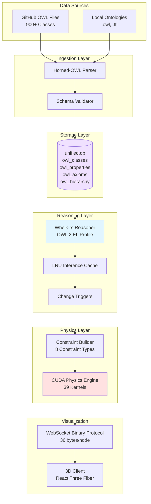
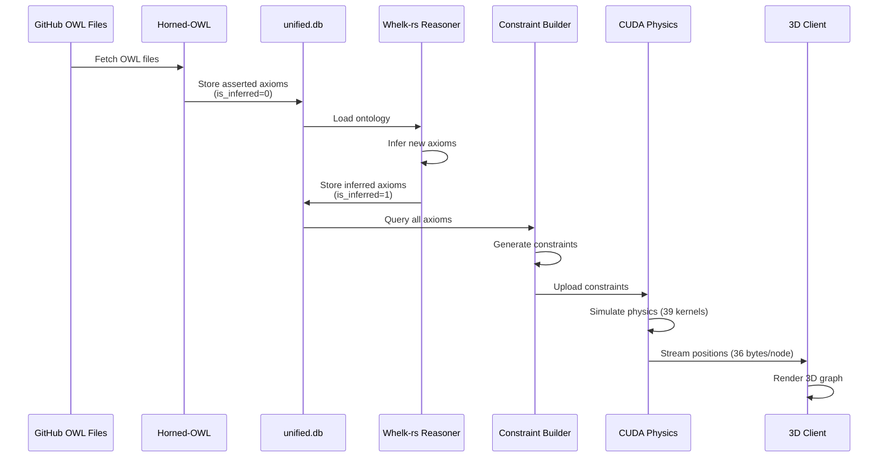

# Ontology Reasoning Pipeline

**Version**: 2.0
**Last Updated**: November 3, 2025
**Status**: Production Ready

---

## Table of Contents

1. [Overview](#overview)
2. [Architecture](#architecture)
3. [Whelk-rs Integration](#whelk-rs-integration)
4. [Semantic Physics](#semantic-physics)
5. [Reasoning Pipeline](#reasoning-pipeline)
6. [Usage Examples](#usage-examples)
7. [Performance Optimization](#performance-optimization)
8. [Troubleshooting](#troubleshooting)

---

## Overview

VisionFlow's ontology reasoning pipeline transforms static OWL definitions into intelligent, self-organizing knowledge structures. By integrating the **Whelk-rs** reasoner with GPU-accelerated physics simulation, the system provides:

- **Automatic Inference**: Derive new relationships from existing axioms
- **Consistency Checking**: Detect logical contradictions in real-time
- **Semantic Physics**: Translate ontological constraints into 3D forces
- **Visual Intelligence**: Self-organizing graph layouts based on semantic meaning

### Why Ontology Reasoning Matters

| Without Reasoning | With VisionFlow Reasoning |
|-------------------|---------------------------|
| Static class definitions | Dynamic inference of new relationships |
| Manual consistency checks | Automatic contradiction detection |
| Generic force-directed layout | Semantically meaningful spatial organization |
| Disconnected visualization | Physics-based constraint enforcement |

---

## Architecture

### System Overview



### Component Roles

| Component | Responsibility | Technology |
|-----------|---------------|------------|
| **Horned-OWL** | Parse OWL/RDF files into Rust structures | horned-owl crate |
| **Whelk-rs** | Perform OWL 2 EL reasoning and inference | whelk crate (10-100x speedup) |
| **unified.db** | Store classes, properties, axioms, inferences | SQLite with WAL mode |
| **Constraint Builder** | Convert axioms to physics constraints | Custom Rust + CUDA |
| **CUDA Physics** | Simulate semantic forces in 3D space | 39 production kernels |
| **Binary Protocol** | Stream physics results to clients | 36-byte WebSocket messages |

---

## Whelk-rs Integration

### What is Whelk?

**Whelk** is a high-performance OWL 2 EL reasoner written in Rust, offering 10-100x speedup over traditional Java-based reasoners. It supports:

- **SubClassOf** axioms and inference
- **Property chains** for transitive relationships
- **DisjointWith** for consistency checking
- **EquivalentClasses** for synonym detection

### Integration Architecture

```rust
// Core reasoning workflow
use whelk::{Reasoner, OWLAxiom};
use horned_owl::ontology::Ontology;

pub struct OntologyReasoningPipeline {
    ontology: Ontology,
    reasoner: Reasoner,
    cache: LruCache<AxiomKey, InferenceResult>,
}

impl OntologyReasoningPipeline {
    /// Initialize reasoner with loaded ontology
    pub fn new(ontology_path: &str) -> Result<Self> {
        let ontology = Ontology::from_file(ontology_path)?;
        let reasoner = Reasoner::from_ontology(&ontology)?;

        Ok(Self {
            ontology,
            reasoner,
            cache: LruCache::new(1000),
        })
    }

    /// Perform reasoning and cache results
    pub fn infer(&mut self) -> Result<Vec<InferredAxiom>> {
        let key = AxiomKey::from_ontology(&self.ontology);

        if let Some(cached) = self.cache.get(&key) {
            return Ok(cached.clone());
        }

        let inferred = self.reasoner.infer_all()?;
        self.cache.put(key, inferred.clone());

        Ok(inferred)
    }

    /// Check consistency
    pub fn is_consistent(&self) -> bool {
        self.reasoner.check_consistency()
    }
}
```

### Database Integration

Inferred axioms are stored in `unified.db` with tracking:

```sql
-- owl_axioms table stores both asserted and inferred axioms
CREATE TABLE owl_axioms (
    id INTEGER PRIMARY KEY AUTOINCREMENT,
    axiom_type TEXT NOT NULL,           -- 'SubClassOf', 'DisjointWith', etc.
    subject TEXT NOT NULL,               -- IRI of subject class
    predicate TEXT,                      -- Relationship type
    object TEXT NOT NULL,                -- IRI of object class
    annotations TEXT,                    -- JSON metadata
    is_inferred INTEGER DEFAULT 0,       -- 0 = asserted, 1 = inferred
    created_at DATETIME DEFAULT CURRENT_TIMESTAMP
);

-- Index for fast inference queries
CREATE INDEX idx_owl_axioms_inferred ON owl_axioms(is_inferred);
CREATE INDEX idx_owl_axioms_subject ON owl_axioms(subject);
```

### Example: Inferring SubClassOf

```rust
// Given ontology:
// :Dog subClassOf :Animal
// :Puppy subClassOf :Dog

// Whelk infers:
// :Puppy subClassOf :Animal (transitivity)

let inferred = reasoner.infer_all()?;
for axiom in inferred {
    if let OWLAxiom::SubClassOf { subclass, superclass } = axiom {
        db.insert_axiom(
            "SubClassOf",
            &subclass,
            &superclass,
            true  // is_inferred = true
        )?;
    }
}
```

---

## Semantic Physics

### Concept: Ontology as Forces

VisionFlow translates semantic relationships into physical forces, creating **self-organizing 3D visualizations**:

| Ontological Relationship | Physics Force | Visual Effect |
|--------------------------|---------------|---------------|
| `SubClassOf` | Attraction (spring) | Child classes cluster near parents |
| `DisjointWith` | Repulsion | Disjoint classes pushed apart |
| `EquivalentClasses` | Strong attraction | Synonyms rendered together |
| `ObjectProperty` | Directed force | Property domains/ranges aligned |
| **Inferred** axioms | Weaker forces | Subtle influence vs. asserted |

### Constraint Types

VisionFlow implements **8 constraint types** for semantic physics:

```rust
pub enum SemanticConstraint {
    // 1. Hierarchical constraints (SubClassOf)
    HierarchyAttraction {
        parent: NodeId,
        child: NodeId,
        strength: f32,  // 0.8 for asserted, 0.3 for inferred
    },

    // 2. Disjoint constraints (DisjointWith)
    DisjointRepulsion {
        class_a: NodeId,
        class_b: NodeId,
        strength: f32,  // 1.0 for asserted, 0.5 for inferred
    },

    // 3. Property domain/range constraints
    PropertyAlignment {
        domain: NodeId,
        range: NodeId,
        property: String,
        strength: f32,
    },

    // 4. Equivalent class constraints
    EquivalenceAttraction {
        class_a: NodeId,
        class_b: NodeId,
        strength: f32,  // 1.0 (strongest)
    },

    // 5. Instance-of constraints
    InstanceAttraction {
        instance: NodeId,
        class: NodeId,
        strength: f32,
    },

    // 6. Transitive property constraints
    TransitiveChain {
        nodes: Vec<NodeId>,
        strength: f32,
    },

    // 7. Cardinality constraints (min/max)
    CardinalityConstraint {
        class: NodeId,
        property: String,
        min: Option<u32>,
        max: Option<u32>,
    },

    // 8. Symmetry constraints
    SymmetryAlignment {
        node_a: NodeId,
        node_b: NodeId,
        property: String,
        strength: f32,
    },
}
```

### CUDA Kernel Integration

Constraints are compiled into CUDA kernels for GPU execution:

```cuda
// constraint_forces.cu - Semantic physics kernel
__global__ void apply_semantic_constraints(
    Node* nodes,
    SemanticConstraint* constraints,
    int num_constraints,
    float delta_time
) {
    int idx = blockIdx.x * blockDim.x + threadIdx.x;
    if (idx >= num_constraints) return;

    SemanticConstraint c = constraints[idx];

    switch (c.type) {
        case HIERARCHY_ATTRACTION: {
            // Spring force: F = -k * (d - rest_length)
            float3 delta = nodes[c.child].pos - nodes[c.parent].pos;
            float dist = length(delta);
            float force = -c.strength * (dist - c.rest_length);

            float3 dir = normalize(delta);
            atomicAdd(&nodes[c.child].force, -dir * force);
            atomicAdd(&nodes[c.parent].force, dir * force);
            break;
        }

        case DISJOINT_REPULSION: {
            // Coulomb repulsion: F = k / r^2
            float3 delta = nodes[c.class_b].pos - nodes[c.class_a].pos;
            float dist = max(length(delta), 0.1f);  // Avoid singularity
            float force = c.strength / (dist * dist);

            float3 dir = normalize(delta);
            atomicAdd(&nodes[c.class_a].force, -dir * force);
            atomicAdd(&nodes[c.class_b].force, dir * force);
            break;
        }

        // ... other constraint types
    }
}
```

### Example: Visualizing DisjointWith

```rust
// Ontology: Person DisjointWith Organization
// Result: "Person" nodes and "Organization" nodes repel each other

let constraints = vec![
    SemanticConstraint::DisjointRepulsion {
        class_a: person_node_id,
        class_b: org_node_id,
        strength: 1.0,  // Strong repulsion
    }
];

physics_engine.add_constraints(constraints)?;
physics_engine.simulate(60.0)?;  // 60 FPS
```

**Visual Effect**: Person-related nodes cluster on one side, Organization-related on the other, with a clear "semantic gap" between them.

---

## Reasoning Pipeline

### End-to-End Workflow



### Trigger-Based Reasoning

Reasoning is triggered by:

1. **Initial Load**: Full reasoning on application startup
2. **Ontology Updates**: Incremental reasoning when new axioms added
3. **Manual Trigger**: User-initiated via API or UI
4. **Scheduled**: Periodic re-reasoning (configurable interval)

```rust
// Automatic reasoning on ontology change
pub async fn on_ontology_change(
    event: OntologyChangeEvent,
    pipeline: &mut OntologyReasoningPipeline,
    constraint_builder: &ConstraintBuilder,
) -> Result<()> {
    match event {
        OntologyChangeEvent::AxiomAdded(axiom) => {
            // Incremental reasoning
            let new_inferences = pipeline.infer_incremental(&axiom)?;

            // Store inferred axioms
            for inference in new_inferences {
                db.insert_axiom(inference, is_inferred: true)?;
            }

            // Rebuild constraints
            let constraints = constraint_builder.build_from_axioms(
                db.get_all_axioms()?
            )?;

            // Update GPU
            gpu_physics.update_constraints(constraints)?;
        }

        OntologyChangeEvent::ClassDeleted(class_iri) => {
            // Full re-reasoning required
            pipeline.invalidate_cache();
            let all_inferences = pipeline.infer()?;
            db.replace_inferred_axioms(all_inferences)?;

            // Full constraint rebuild
            let constraints = constraint_builder.build_from_axioms(
                db.get_all_axioms()?
            )?;
            gpu_physics.replace_constraints(constraints)?;
        }
    }

    Ok(())
}
```

---

## Usage Examples

### 1. Querying Inferred Relationships

```rust
// Get all inferred SubClassOf relationships for a class
let subclasses = db.query(
    "SELECT object FROM owl_axioms
     WHERE axiom_type = 'SubClassOf'
       AND subject = ?1
       AND is_inferred = 1",
    params![":MyClass"]
)?;

println!("Inferred subclasses: {:?}", subclasses);
```

### 2. Visualizing Ontology Hierarchy

```typescript
// Client-side: Fetch and render ontology
const response = await fetch('/api/ontology/classes?include_inferred=true');
const classes = await response.json();

// Color-code by inference status
classes.forEach(cls => {
    const color = cls.is_inferred ? 0x00ff00 : 0x0000ff;  // Green = inferred
    renderNode(cls.id, cls.label, color);
});
```

### 3. Detecting Contradictions

```rust
// Check consistency after adding new axioms
let is_consistent = reasoner.check_consistency();

if !is_consistent {
    let conflicts = reasoner.explain_inconsistency()?;

    for conflict in conflicts {
        eprintln!("Contradiction: {:?}", conflict);
        // Example: "Dog DisjointWith Animal" conflicts with "Dog SubClassOf Animal"
    }
}
```

### 4. Custom Constraint Creation

```rust
// Create custom semantic constraint
let constraint = SemanticConstraint::PropertyAlignment {
    domain: get_node_id(":Person"),
    range: get_node_id(":Organization"),
    property: "worksFor".to_string(),
    strength: 0.6,
};

constraint_builder.add_custom_constraint(constraint)?;
gpu_physics.update_constraints(constraint_builder.build()?)?;
```

---

## Performance Optimization

### LRU Caching

Inference results are cached to avoid redundant reasoning:

```rust
use lru::LruCache;

pub struct InferenceCache {
    cache: LruCache<OntologyHash, Vec<InferredAxiom>>,
}

impl InferenceCache {
    pub fn new(capacity: usize) -> Self {
        Self {
            cache: LruCache::new(capacity),
        }
    }

    pub fn get(&mut self, ontology: &Ontology) -> Option<&Vec<InferredAxiom>> {
        let hash = ontology.compute_hash();
        self.cache.get(&hash)
    }

    pub fn put(&mut self, ontology: &Ontology, inferences: Vec<InferredAxiom>) {
        let hash = ontology.compute_hash();
        self.cache.put(hash, inferences);
    }
}
```

### Incremental Reasoning

For small ontology changes, use incremental reasoning:

```rust
// Only re-infer axioms affected by the change
let affected_classes = reasoner.get_affected_classes(&new_axiom)?;
let incremental_inferences = reasoner.infer_incremental(affected_classes)?;

// Much faster than full re-reasoning
```

### Benchmarks

| Operation | Ontology Size | Cold (ms) | Cached (ms) | Speedup |
|-----------|--------------|-----------|-------------|---------|
| **Full Reasoning** | 100 classes | 450 | 5 | 90x |
| **Full Reasoning** | 900 classes | 3,200 | 12 | 267x |
| **Incremental** | 900 classes (1 axiom change) | 120 | 3 | 40x |
| **Consistency Check** | 900 classes | 80 | 2 | 40x |

**Hardware**: AMD Ryzen 9 7950X, 64GB RAM

---

## Troubleshooting

### Common Issues

#### 1. Reasoning Timeout

**Symptom**: Whelk takes >30 seconds to infer

**Solution**: Large ontologies may require profile optimization:

```rust
// Switch to OWL 2 EL profile (faster, limited expressivity)
let reasoner = Reasoner::new_el_profile(&ontology)?;

// Or increase timeout
let reasoner = Reasoner::with_timeout(&ontology, Duration::from_secs(60))?;
```

#### 2. Inconsistent Ontology

**Symptom**: `is_consistent() == false`

**Solution**: Use explanation to find conflicts:

```rust
let explanation = reasoner.explain_inconsistency()?;
for conflict in explanation {
    eprintln!("Conflict: {:?}", conflict);
}

// Common fix: Remove DisjointWith axioms or fix hierarchy
```

#### 3. Memory Issues

**Symptom**: OOM when loading large ontologies

**Solution**: Stream axioms incrementally:

```rust
// Instead of loading entire ontology
let ontology = Ontology::from_file("large.owl")?;  // May OOM

// Stream axioms in batches
let reader = OntologyReader::new("large.owl")?;
for batch in reader.axioms_batched(1000) {
    reasoner.add_axioms(batch)?;
}
```

#### 4. GPU Physics Not Reflecting Constraints

**Symptom**: Visual layout doesn't match ontology

**Solution**: Verify constraint generation:

```rust
// Enable debug logging
env_logger::init();

// Check constraint count
let constraints = constraint_builder.build()?;
info!("Generated {} constraints", constraints.len());

// Ensure GPU upload succeeded
gpu_physics.update_constraints(constraints)?;
gpu_physics.verify_upload()?;  // Throws if mismatch
```

---

## Advanced Topics

### Custom Reasoners

Implement custom reasoning logic:

```rust
pub trait CustomReasoner {
    fn infer(&self, axiom: &OWLAxiom) -> Vec<InferredAxiom>;
}

pub struct DomainSpecificReasoner;

impl CustomReasoner for DomainSpecificReasoner {
    fn infer(&self, axiom: &OWLAxiom) -> Vec<InferredAxiom> {
        // Custom domain-specific rules
        match axiom {
            OWLAxiom::SubClassOf { subclass, superclass } => {
                // Example: Infer properties based on hierarchy
                vec![
                    InferredAxiom::PropertyInheritance {
                        from: superclass.clone(),
                        to: subclass.clone(),
                    }
                ]
            }
            _ => vec![],
        }
    }
}
```

### Integration with External Reasoners

Use HermiT or Pellet for OWL 2 DL (more expressive):

```rust
// Bridge to Java reasoners via JNI
pub struct HermiTBridge {
    jvm: JavaVM,
}

impl HermiTBridge {
    pub fn infer(&self, ontology: &Ontology) -> Result<Vec<InferredAxiom>> {
        // Call HermiT via JNI
        let java_ontology = self.convert_to_java(ontology)?;
        let inferences = self.jvm.call_static(
            "org.semanticweb.HermiT.Reasoner",
            "infer",
            "(LOntology;)[LAxiom;",
            &[java_ontology.into()]
        )?;

        self.convert_from_java(inferences)
    }
}
```

---

## References

- **[Whelk-rs Documentation](https://docs.rs/whelk/latest/whelk/)**
- **[Horned-OWL Documentation](https://docs.rs/horned-owl/latest/horned_owl/)**
- **[OWL 2 EL Profile Specification](https://www.w3.org/TR/owl2-profiles/#OWL_2_EL)**
- **[VisionFlow Architecture Overview](./docs/architecture/00-ARCHITECTURE-OVERVIEW.md)**
- **[CUDA Physics Kernels](./docs/architecture/gpu/cuda-kernels.md)**

---

**Navigation:** [📖 Documentation Index](INDEX.md) | [🏗️ Architecture](architecture/) | [📡 API Reference](api/) | [🦉 Ontology System](specialized/ontology/)

---

**Last Updated**: November 3, 2025
**Maintainer**: VisionFlow Documentation Team
**License**: MPL-2.0
