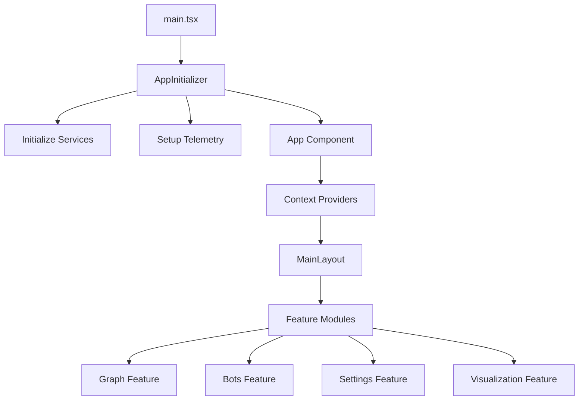
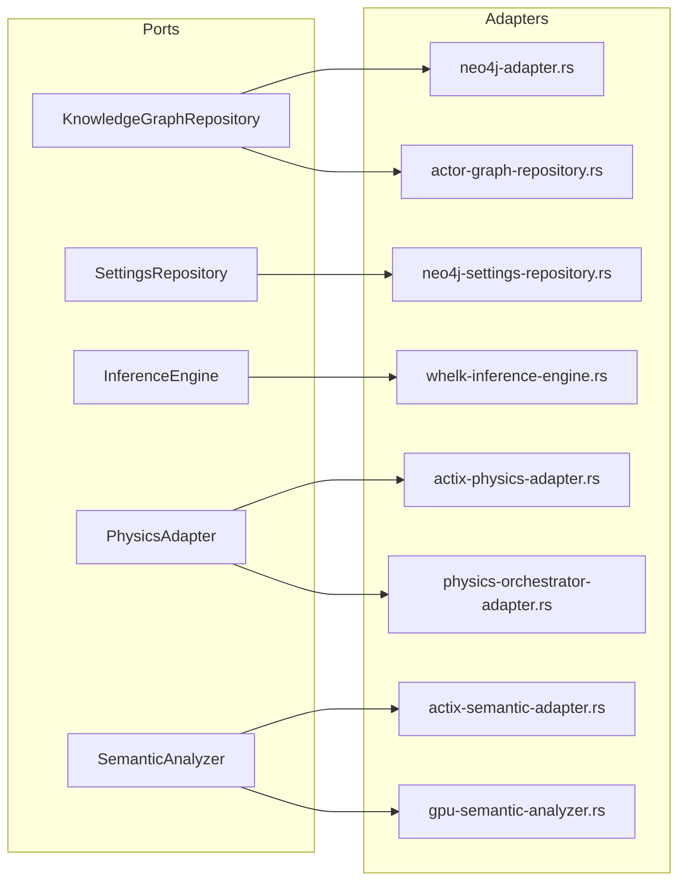

# Phase 3-5 Documentation Scope & Implementation Plan

**Date**: November 4, 2025
**Status**: PLANNING - Detailed Scope for Missing Documentation
**Based on**: Documentation Audit Completion Report (Phases 1-2)
**Target**: Achieve 90%+ codebase-documentation alignment

---

## Executive Summary

This document establishes the complete scope for Phases 3-5 of the documentation improvement initiative. Based on the comprehensive audit, we identified **4 critical documentation gaps** requiring immediate attention:

1. **Services Architecture Guide** - 1 unified document (12-16 hours)
2. **Client TypeScript Architecture Guide** - Comprehensive mapping of 306 files (10-12 hours)
3. **Missing Adapter Documentation** - 6 adapter implementations (8-10 hours)
4. **Reference Directory Structure** - Establish missing reference files (4-6 hours)

**Total Estimated Effort**: 34-44 hours
**Target Completion**: Phases 3-5 (Next 3-4 weeks)
**Expected Alignment Score**: 73% → 92%+

---

## 📊 Documentation Gap Analysis

### Current Status (from Audit)
| Category | Files Analyzed | Coverage | Priority Issues |
|----------|---------------|----------|-----------------|
| Services | 28 service files | 🟡 50-69% | No unified architecture guide |
| Client Architecture | 306 TS/TSX files | 🟡 50-69% | Missing component hierarchy |
| Adapters | 12 adapter files | 🔴 30-49% | 6 adapters undocumented |
| Reference Files | N/A | ❌ 0-29% | Missing directory structure |

### Gap Impact
- **Services**: Developers struggle to understand service layer organization
- **Client**: React component patterns and state management unclear
- **Adapters**: Port-adapter mapping incomplete, hexagonal architecture partially documented
- **Reference**: API documentation scattered, no single source of truth

---

## 🎯 Priority 1: Services Architecture Guide

### Document Overview
**File**: `/docs/concepts/architecture/services-layer-complete.md`
**Estimated Length**: 1,800-2,400 lines
**Estimated Effort**: 12-16 hours
**Dependencies**: None (foundational document)

### Purpose
Create a unified services architecture guide documenting all 28+ services in the system, their responsibilities, dependencies, and integration patterns.

### Required Sections

#### 1. Services Layer Overview (200 lines, 1-2 hours)
**Content**:
- Architecture diagram showing all services
- Service layer positioning in hexagonal architecture
- Service discovery and dependency injection patterns
- Service lifecycle management

**Code References**:
```
/src/services/mod.rs
/src/main.rs (lines 49-240 - service initialization)
/src/app-state.rs (service registration)
```

**Example Sections**:
- Service Layer Principles
- Dependency Injection with Actix
- Service Registration Pattern
- Inter-Service Communication

---

#### 2. Core Services Documentation (600 lines, 4-5 hours)

##### 2.1 Ontology Pipeline Service (120 lines)
**File**: `/src/services/ontology-pipeline-service.rs` (20,506 bytes)

**Documentation Structure**:
```markdown
#### Ontology Pipeline Service
**Purpose**: Orchestrates multi-stage ontology processing pipeline
**Actor**: `OntologyPipelineServiceActor`
**Dependencies**:
- CustomReasoner (whelk integration)
- OntologyEnrichmentService
- Event bus

**Responsibilities**:
- Stage 1: Entity extraction
- Stage 2: Ontology enrichment
- Stage 3: Inference with CustomReasoner
- Stage 4: Event publishing

**API**:
- `process-ontology(ontology-id) -> Result<ProcessedOntology>`
- `get-pipeline-status(pipeline-id) -> PipelineStatus`

**Configuration**:
```rust
pub struct OntologyPipelineConfig {
    pub enable-inference: bool,
    pub cache-ttl: Duration,
    pub max-concurrent-pipelines: usize,
}
```

**Example Usage**:
```rust
let pipeline = OntologyPipelineService::new(config);
let result = pipeline.process-ontology(ontology-id).await?;
```

**Integration Points**:
- Triggered by: OntologyActor
- Events published: OntologyProcessed, InferenceComplete
- Performance: LRU cache provides 90x speedup
```

**Code References**:
- `/src/services/ontology-pipeline-service.rs` (lines 1-500+)
- `/docs/concepts/ontology-reasoning.md` (existing documentation)
- `/src/ontology/services/` (3 service files)

##### 2.2 GitHub Sync Service (100 lines)
**File**: `/src/services/github-sync-service.rs` (23,390 bytes)

**Documentation Structure**:
```markdown
#### GitHub Sync Service
**Purpose**: Bi-directional synchronization with GitHub repositories
**Actor**: `GitHubSyncServiceActor`

**Features**:
- Differential sync with SHA1 hashing
- Webhook-based updates
- FORCE-FULL-SYNC capability
- Conflict resolution

**Configuration**:
```rust
pub struct GitHubSyncConfig {
    pub token: String,
    pub sync-interval: Duration,
    pub webhook-secret: String,
}
```

**Modules**:
- `github/client.rs` - API client
- `github/webhook-handler.rs` - Webhook processing
- `github/sync-strategy.rs` - Sync algorithms
```

**Code References**:
- `/src/services/github-sync-service.rs`
- `/src/services/github/` (3 modules)
- `/docs/concepts/architecture/github-sync-service-design.md` (existing)

##### 2.3 RAGflow Service (80 lines)
**File**: `/src/services/ragflow-service.rs` (18,633 bytes)

**Documentation Structure**:
```markdown
#### RAGflow Service
**Purpose**: Retrieval-Augmented Generation flow orchestration
**Integration**: RAGflow API for document processing

**Capabilities**:
- Document ingestion
- Vector search
- Context retrieval for LLM prompts

**API Endpoints**:
- POST `/api/ragflow/ingest` - Document ingestion
- POST `/api/ragflow/query` - RAG query
```

##### 2.4 Nostr Service (80 lines)
**File**: `/src/services/nostr-service.rs` (9,123 bytes)

**Documentation Structure**:
```markdown
#### Nostr Service
**Purpose**: Nostr protocol integration for decentralized communication
**Last Modified**: November 4, 2025

**Capabilities**:
- Nostr relay connections
- Event publishing/subscription
- Identity management

**Integration Points**:
- WebSocket protocol for real-time events
- Public key authentication
```

##### 2.5 Speech Service (80 lines)
**File**: `/src/services/speech-service.rs`

**Documentation Structure**:
```markdown
#### Speech Service
**Purpose**: Speech-to-text and text-to-speech processing

**Capabilities**:
- Real-time audio streaming
- WebSocket-based voice communication
- Multi-language support

**Related Components**:
- `/client/src/services/VoiceWebSocketService.ts`
- `/client/src/services/AudioInputService.ts`
```

##### 2.6 Settings Services (120 lines)
**Files**:
- `/src/services/settings-watcher.rs`
- `/src/services/settings-broadcast.rs`

**Documentation Structure**:
```markdown
#### Settings Management Services

**Settings Watcher Service**:
**Purpose**: Monitor Neo4j settings repository for changes
**Pattern**: Observer pattern with event-driven updates

**Settings Broadcast Service**:
**Purpose**: Broadcast settings changes to connected clients
**Protocol**: Binary WebSocket protocol (36 bytes/update)

**Integration**:
- Neo4j settings repository subscription
- WebSocket broadcast to all clients
- Selective updates (only changed settings)

**Performance**:
- Binary protocol: 36 bytes vs 500+ bytes JSON
- Batch updates: 10ms latency
```

---

#### 3. Specialized Services (400 lines, 3-4 hours)

##### 3.1 Agent Visualization Services (150 lines)
**Files**:
- `/src/services/agent-visualization-processor.rs` (19,367 bytes)
- `/src/services/agent-visualization-protocol.rs` (44,043 bytes)

**Documentation Structure**:
```markdown
#### Agent Visualization Services

**Agent Visualization Processor**:
**Purpose**: Process agent state for 3D visualization
**Output**: Agent position, metadata, connection lines

**Agent Visualization Protocol**:
**Purpose**: Binary protocol for efficient agent rendering
**Performance**: 44KB codebase optimized for real-time updates

**Data Flow**:
1. Agent state update → Processor
2. Protocol serialization → Binary format
3. WebSocket broadcast → Connected clients
4. Client-side rendering → Three.js

**Protocol Structure**:
```rust
struct AgentVisualizationUpdate {
    agent-id: u64,
    position: Vec3,
    state: AgentState,
    connections: Vec<AgentLink>,
}
```
```

##### 3.2 Graph Serialization Service (100 lines)
**File**: `/src/services/graph-serialization.rs` (13,573 bytes)

**Documentation Structure**:
```markdown
#### Graph Serialization Service
**Purpose**: Efficient graph serialization/deserialization

**Formats Supported**:
- Binary (internal format)
- JSON (API compatibility)
- MessagePack (performance)

**Use Cases**:
- Graph import/export
- Snapshot creation
- Network transfer optimization
```

##### 3.3 File Service (100 lines)
**File**: `/src/services/file-service.rs` (32,612 bytes)

**Documentation Structure**:
```markdown
#### File Service
**Purpose**: File upload, storage, and management

**Capabilities**:
- Multi-part file upload
- File type validation
- Storage abstraction (local/S3)
- Metadata management

**Supported Formats**:
- Ontologies: .owl, .ttl, .rdf
- Graphs: .json, .graphml
- Documents: .md, .txt
```

##### 3.4 Edge Services (50 lines)
**Files**:
- `/src/services/edge-classifier.rs` (10,011 bytes)
- `/src/services/edge-generation.rs` (23,677 bytes)

**Documentation Structure**:
```markdown
#### Edge Management Services

**Edge Classifier**:
**Purpose**: Classify edge types using semantic analysis
**ML Integration**: Neural network for edge classification

**Edge Generation**:
**Purpose**: Automatic edge creation based on semantic similarity
**Algorithms**:
- Semantic distance calculation
- Threshold-based edge creation
- Community detection integration
```

---

#### 4. Client Services (200 lines, 2 hours)

##### 4.1 MCP & Bot Services (100 lines)
**Files**:
- `/src/services/bots-client.rs` (9,146 bytes)
- `/src/services/mcp-relay-manager.rs` (10,162 bytes)
- `/src/services/multi-mcp-agent-discovery.rs` (24,757 bytes)
- `/src/services/management-api-client.rs` (10,729 bytes)

**Documentation Structure**:
```markdown
#### Multi-Agent & MCP Services

**Bots Client Service**:
**Purpose**: Interface for bot agent management
**API**: CRUD operations for bot lifecycle

**MCP Relay Manager**:
**Purpose**: Model Context Protocol relay management
**Capability**: Multi-MCP server coordination

**Multi-MCP Agent Discovery**:
**Purpose**: Automatic agent discovery across MCP servers
**Features**:
- Dynamic agent registration
- Capability matching
- Load balancing

**Management API Client**:
**Purpose**: Internal management API client
**Base URL**: http://localhost:9090
```

##### 4.2 Utility Services (100 lines)
**Files**:
- `/src/services/empty-graph-check.rs` (633 bytes)
- `/src/services/local-markdown-sync.rs` (5,873 bytes)
- `/src/services/ontology-converter.rs` (6,589 bytes)

**Documentation Structure**:
```markdown
#### Utility Services

**Empty Graph Check**:
**Purpose**: Validation service for graph completeness

**Local Markdown Sync**:
**Purpose**: Synchronize local markdown files with graph
**Use Case**: Documentation-as-graph

**Ontology Converter**:
**Purpose**: Convert between ontology formats
**Supported**: OWL ↔ RDF/XML ↔ Turtle
```

---

#### 5. Service Integration Patterns (400 lines, 3-4 hours)

**Content**:
- Service dependency graph (Mermaid diagram)
- Actix actor communication patterns
- Message passing examples
- Event bus integration
- Error handling across services
- Performance monitoring
- Testing strategies for services

**Code References**:
```
/src/main.rs (service initialization)
/src/app-state.rs (service registration)
/src/events/bus.rs (event integration)
/src/actors/*.rs (actor communication)
```

**Diagrams**:
1. Service dependency graph (all 28 services)
2. Service initialization sequence
3. Inter-service communication patterns
4. Event-driven service coordination

---

### Deliverables Checklist
- [ ] Services layer overview with architecture diagram
- [ ] All 28+ services documented with code examples
- [ ] Service dependency graph (Mermaid)
- [ ] Integration patterns documented
- [ ] API reference for each service
- [ ] Configuration guide
- [ ] Testing examples
- [ ] Performance considerations

---

## 🎯 Priority 2: Client TypeScript Architecture Guide

### Document Overview
**File**: `/docs/concepts/architecture/client-architecture-complete.md`
**Estimated Length**: 2,000-2,800 lines
**Estimated Effort**: 10-12 hours
**Dependencies**: Existing `/docs/concepts/architecture/core/client.md` (update)

### Purpose
Create comprehensive client-side architecture documentation covering all 306 TypeScript files, React component patterns, state management, and feature organization.

### File Structure Analysis
```
/client/src/
├── app/ (3 files)
│   ├── App.tsx - Root application component
│   ├── AppInitializer.tsx - Application initialization
│   └── MainLayout.tsx - Main layout wrapper
│
├── features/ (16 feature modules, ~250 files)
│   ├── analytics/ - Analytics store & components
│   ├── bots/ - Agent/bot management UI
│   ├── command-palette/ - Command palette feature
│   ├── graph/ - Graph visualization & interaction
│   ├── help/ - Help system & tooltips
│   ├── onboarding/ - User onboarding flows
│   ├── physics/ - Physics engine controls
│   ├── settings/ - Settings management UI
│   ├── visualisation/ - 3D visualization components
│   └── workspace/ - Workspace management
│
├── services/ (20+ service files)
│   ├── WebSocketService.ts - WebSocket client
│   ├── BinaryWebSocketProtocol.ts - Binary protocol
│   ├── nostrAuthService.ts - Nostr authentication
│   ├── bridges/ - Vircadia XR bridges
│   └── ...
│
├── utils/ (20+ utility files)
│   ├── BatchQueue.ts - Batch processing
│   ├── loggerConfig.ts - Logging configuration
│   └── ...
│
└── telemetry/ (4 files)
    ├── AgentTelemetry.ts - Agent telemetry
    └── DebugOverlay.tsx - Debug UI
```

### Required Sections

#### 1. Client Architecture Overview (300 lines, 2 hours)

**Content**:
```markdown
# Client Architecture Overview

## Technology Stack
- **Framework**: React 18 with TypeScript
- **State Management**: Zustand (feature stores)
- **3D Rendering**: Three.js + React Three Fiber
- **WebSocket**: Native WebSocket with binary protocol
- **Build**: Vite with SWC

## Application Entry Point
**File**: `/client/src/app/main.tsx`

```typescript
import { App } from './App';
import { AppInitializer } from './AppInitializer';

// Application initialization
const root = ReactDOM.createRoot(
  document.getElementById('root')!
);

root.render(
  <StrictMode>
    <AppInitializer>
      <App />
    </AppInitializer>
  </StrictMode>
);
```

## Application Initialization Sequence
1. **AppInitializer** - Initialize services, logging, telemetry
2. **App** - Root component with providers
3. **MainLayout** - Main UI structure
4. **Feature modules** - Lazy-loaded features

## Architecture Diagram

```

**Code References**:
- `/client/src/app/main.tsx`
- `/client/src/app/App.tsx`
- `/client/src/app/AppInitializer.tsx`
- `/client/src/app/MainLayout.tsx`

---

#### 2. Feature Module Documentation (1,200 lines, 5-6 hours)

##### 2.1 Graph Feature (200 lines)
**Directory**: `/client/src/features/graph/`
**Files**: ~40 files

**Documentation Structure**:
```markdown
### Graph Feature Module

**Purpose**: Graph visualization, interaction, and data management

**Structure**:
```
features/graph/
├── components/           # UI components
│   ├── GraphCanvas.tsx
│   ├── NodeEditor.tsx
│   └── EdgeControls.tsx
├── services/            # Business logic
│   ├── graphSynchronization.ts
│   ├── graphComparison.ts
│   ├── aiInsights.ts
│   └── graphAnimations.ts
├── store/               # State management
│   └── graphStore.ts
├── hooks/               # Custom React hooks
│   └── useGraph.ts
└── types/               # TypeScript types
    └── graph.types.ts
```

**State Management (Zustand)**:
```typescript
interface GraphState {
  nodes: Node[];
  edges: Edge[];
  selectedNode: Node | null;
  viewport: Viewport;

  // Actions
  addNode: (node: Node) => void;
  updateNode: (id: string, updates: Partial<Node>) => void;
  deleteNode: (id: string) => void;
}
```

**Key Services**:

**Graph Synchronization Service**:
**File**: `/client/src/features/graph/services/graphSynchronization.ts`
**Purpose**: Synchronize graph state with backend
**Pattern**: Optimistic updates with WebSocket sync

```typescript
class GraphSynchronizationService {
  async syncGraph(graphId: string): Promise<void> {
    // Optimistic UI update
    // WebSocket message to backend
    // Conflict resolution
  }
}
```

**AI Insights Service**:
**File**: `/client/src/features/graph/services/aiInsights.ts`
**Purpose**: AI-powered graph insights and suggestions

**Graph Comparison Service**:
**File**: `/client/src/features/graph/services/graphComparison.ts`
**Purpose**: Compare graph versions, detect changes
```

**Code References**:
- All files in `/client/src/features/graph/`
- Related backend: `/src/handlers/graph-handler.rs`
- WebSocket: `/src/handlers/graph-websocket-handler.rs`

##### 2.2 Visualization Feature (250 lines)
**Directory**: `/client/src/features/visualisation/`
**Files**: ~60 files (largest feature)

**Documentation Structure**:
```markdown
### Visualization Feature Module

**Purpose**: 3D graph visualization with Three.js

**Structure**:
```
features/visualisation/
├── components/
│   ├── IntegratedControlPanel.tsx
│   ├── MetadataVisualizer.tsx
│   ├── HolographicDataSphere.tsx
│   ├── AgentNodesLayer.tsx
│   ├── WireframeCloudMesh.tsx
│   ├── CameraController.tsx
│   ├── SpacePilot*.tsx (6 files)
│   ├── ControlPanel/ (10+ files)
│   ├── dialogs/ (4 dialog components)
│   └── tabs/ (5 tab components)
├── controls/
│   └── SpacePilotController.ts
├── effects/
│   └── AtmosphericGlow.tsx
└── hooks/
    ├── useGraphInteraction.ts
    ├── useNodeInteraction.ts
    ├── useSpacePilot.ts
    └── bloomRegistry.ts
```

**Control Panel System**:
```markdown
#### Control Panel Architecture
**Main Component**: `IntegratedControlPanel.tsx`

**Tab System**:
- `GraphVisualisationTab` - Visual settings
- `GraphInteractionTab` - Interaction modes
- `GraphOptimisationTab` - Performance tuning
- `GraphAnalysisTab` - Analytics controls
- `GraphExportTab` - Export options

**Configuration**:
**File**: `ControlPanel/config.ts`
```typescript
export const controlPanelConfig = {
  tabs: ['visualisation', 'interaction', 'optimisation', 'analysis', 'export'],
  defaultTab: 'visualisation',
  position: 'right',
  width: 320,
};
```

**Settings System**:
**File**: `ControlPanel/settingsConfig.ts`
- Settings schema definition
- Validation rules
- Preset configurations
```

**3D Rendering Components**:
```markdown
#### HolographicDataSphere
**Purpose**: Holographic visualization of data clusters

#### WireframeCloudMesh
**Purpose**: Point cloud visualization with wireframe overlay

#### AgentNodesLayer
**Purpose**: Render agent nodes in 3D space
**Integration**: Agent Visualization Protocol (backend)

#### AtmosphericGlow (Effect)
**Purpose**: Post-processing glow effect for nodes
**Technology**: Three.js post-processing
```

**SpacePilot Integration**:
```markdown
#### SpacePilot 3D Controller Integration
**Files**:
- `SpacePilotController.ts` - Controller interface
- `SpacePilotConnectButton.tsx` - UI for connection
- `SpacePilotOrbitControlsIntegration.tsx` - Camera integration
- `SpacePilotSimpleIntegration.tsx` - Simplified integration
- `SpacePilotButtonPanel.tsx` - Control panel
- `BotsStatusPanel.tsx` - Status display

**Purpose**: Hardware 3D controller support for graph navigation
**Device**: 3Dconnexion SpacePilot
**Capabilities**: 6DOF navigation, custom button mapping
```

**XR Support**:
```markdown
#### HeadTrackedParallaxController
**File**: `HeadTrackedParallaxController.tsx`
**Purpose**: Head-tracked parallax for XR/VR
**Integration**: Quest 3 auto-detection, Vircadia bridges
```

##### 2.3 Settings Feature (150 lines)
**Directory**: `/client/src/features/settings/`
**Files**: ~25 files

**Documentation Structure**:
```markdown
### Settings Feature Module

**Purpose**: User settings management with real-time sync

**Structure**:
```
features/settings/
├── components/
│   ├── FloatingSettingsPanel.tsx
│   ├── VirtualizedSettingsGroup.tsx
│   ├── SettingsSection.tsx
│   ├── UndoRedoControls.tsx
│   ├── PresetSelector.tsx
│   ├── BackendUrlSetting.tsx
│   ├── GraphSelector.tsx
│   └── LazySettingsSections.tsx
├── presets/
│   └── qualityPresets.ts
└── store/
    └── settingsStore.ts
```

**Settings Store (Zustand)**:
```typescript
interface SettingsState {
  settings: UserSettings;
  presets: QualityPreset[];
  undoStack: SettingsSnapshot[];
  redoStack: SettingsSnapshot[];

  // Actions
  updateSetting: (key: string, value: any) => void;
  applyPreset: (presetId: string) => void;
  undo: () => void;
  redo: () => void;
  syncWithBackend: () => Promise<void>;
}
```

**Real-Time Sync**:
```typescript
// WebSocket subscription for settings updates
const settingsWs = new WebSocketService('/ws/settings');

settingsWs.on('settings-updated', (update) => {
  settingsStore.setState({ settings: update });
});
```

**Quality Presets**:
**File**: `presets/qualityPresets.ts`
```typescript
export const qualityPresets = {
  low: { renderDistance: 500, particleCount: 1000 },
  medium: { renderDistance: 1000, particleCount: 5000 },
  high: { renderDistance: 2000, particleCount: 10000 },
  ultra: { renderDistance: 5000, particleCount: 50000 },
};
```

**Virtualized Settings Panel**:
**Component**: `VirtualizedSettingsGroup.tsx`
**Purpose**: Efficiently render large settings lists
**Technology**: react-window for virtualization
```

##### 2.4 Bots Feature (120 lines)
**Directory**: `/client/src/features/bots/`
**Files**: ~15 files

**Documentation Structure**:
```markdown
### Bots/Agents Feature Module

**Purpose**: Multi-agent orchestration UI

**Structure**:
```
features/bots/
├── components/
│   ├── BotList.tsx
│   ├── BotCreator.tsx
│   └── BotStatusIndicator.tsx
├── services/
│   ├── AgentPollingService.ts
│   ├── ConfigurationMapper.ts
│   └── BotsWebSocketIntegration.ts
└── store/
    └── botsStore.ts
```

**Agent Polling Service**:
**File**: `services/AgentPollingService.ts`
**Purpose**: Poll agent status at intervals
**Pattern**: Optimized polling with exponential backoff

```typescript
class AgentPollingService {
  private interval: number = 5000;

  async pollAgents(): Promise<Agent[]> {
    const response = await fetch('/api/agents');
    return response.json();
  }

  startPolling(): void {
    setInterval(() => this.pollAgents(), this.interval);
  }
}
```

**WebSocket Integration**:
**File**: `services/BotsWebSocketIntegration.ts`
**Purpose**: Real-time agent updates via WebSocket
**Protocol**: Binary protocol for agent state
```

##### 2.5 Analytics Feature (80 lines)
**Directory**: `/client/src/features/analytics/`
**Files**: ~8 files

**Documentation Structure**:
```markdown
### Analytics Feature Module

**Purpose**: Graph analytics and visualization controls

**Store**: `/store/analyticsStore.ts`
```typescript
interface AnalyticsState {
  clustering: ClusteringConfig;
  shortestPath: PathConfig;
  communityDetection: CommunityConfig;

  // Actions
  runClustering: (config: ClusteringConfig) => Promise<Clusters>;
  findShortestPath: (start: string, end: string) => Promise<Path>;
}
```

**Components**:
- `SemanticClusteringControls.tsx` - UI for clustering
- `ShortestPathControls.tsx` - Path finding UI

**Backend Integration**:
- Calls GPU-accelerated clustering (backend)
- Real-time cluster visualization
```

##### 2.6 Physics Feature (60 lines)
**Directory**: `/client/src/features/physics/`
**Files**: ~5 files

**Documentation Structure**:
```markdown
### Physics Feature Module

**Purpose**: Physics engine configuration UI

**Components**:
- `PhysicsEngineControls.tsx` - Physics parameter controls
- `PhysicsPresets.tsx` - Preset configurations
- `ConstraintBuilderDialog.tsx` - Custom constraint UI

**Integration**:
- Backend: GPU physics actors
- WebSocket: Real-time physics updates
```

##### 2.7 Command Palette Feature (80 lines)
##### 2.8 Help Feature (60 lines)
##### 2.9 Onboarding Feature (80 lines)
##### 2.10 Workspace Feature (60 lines)

---

#### 3. Services Layer Documentation (300 lines, 2 hours)

**Content**:
```markdown
## Client Services Layer

**Purpose**: Business logic and backend communication

### WebSocket Services

#### WebSocketService
**File**: `/client/src/services/WebSocketService.ts`
**Purpose**: Core WebSocket client

```typescript
class WebSocketService {
  private ws: WebSocket;

  connect(url: string): void {
    this.ws = new WebSocket(url);
    this.setupHandlers();
  }

  send(message: any): void {
    if (this.ws.readyState === WebSocket.OPEN) {
      this.ws.send(JSON.stringify(message));
    }
  }

  on(event: string, handler: (data: any) => void): void {
    // Event subscription
  }
}
```

**Usage**:
```typescript
const ws = new WebSocketService();
ws.connect('ws://localhost:8080/ws/graph');
ws.on('graph-updated', (data) => {
  graphStore.updateGraph(data);
});
```

#### BinaryWebSocketProtocol
**File**: `/client/src/services/BinaryWebSocketProtocol.ts`
**Purpose**: Binary protocol implementation (client-side)

**Protocol Specification**:
- 36 bytes per node update
- 24 bytes per edge update
- Supports: ADD, UPDATE, DELETE operations

**Decoding**:
```typescript
class BinaryWebSocketProtocol {
  decodeNodeUpdate(buffer: ArrayBuffer): NodeUpdate {
    const view = new DataView(buffer);
    return {
      id: view.getBigUint64(0),
      x: view.getFloat32(8),
      y: view.getFloat32(12),
      z: view.getFloat32(16),
      // ... more fields
    };
  }
}
```

#### VoiceWebSocketService
**File**: `/client/src/services/VoiceWebSocketService.ts`
**Purpose**: Voice communication WebSocket

**Capabilities**:
- Audio streaming
- Speech-to-text integration
- Real-time transcription

### Bridge Services

#### Vircadia XR Bridges
**Files**:
- `bridges/GraphVircadiaBridge.ts`
- `bridges/BotsVircadiaBridge.ts`

**Purpose**: Bridge VisionFlow with Vircadia XR environment
**Integration**: Quest 3 auto-detection, multi-user XR

### Platform Services

#### SpaceDriverService
**File**: `/client/src/services/SpaceDriverService.ts`
**Purpose**: 3Dconnexion SpacePilot driver interface

#### PlatformManager
**File**: `/client/src/services/platformManager.ts`
**Purpose**: Platform-specific adaptations (desktop, mobile, XR)

### Authentication Services

#### NostrAuthService
**File**: `/client/src/services/nostrAuthService.ts`
**Purpose**: Nostr protocol authentication

**Usage**:
```typescript
const nostrAuth = new NostrAuthService();
await nostrAuth.login(publicKey, privateKey);
const isAuthenticated = nostrAuth.isAuthenticated();
```

### Audio Services

#### AudioContextManager
**File**: `/client/src/services/AudioContextManager.ts`
**Purpose**: Web Audio API management

#### AudioInputService
**File**: `/client/src/services/AudioInputService.ts`
**Purpose**: Microphone input handling
```

---

#### 4. Utilities & Shared Code (200 lines, 1 hour)

**Content**:
```markdown
## Utility Modules

### Performance Utilities

#### BatchQueue
**File**: `/client/src/utils/BatchQueue.ts`
**Purpose**: Batch multiple operations for performance

```typescript
class BatchQueue<T> {
  private queue: T[] = [];
  private batchSize = 100;

  add(item: T): void {
    this.queue.push(item);
    if (this.queue.length >= this.batchSize) {
      this.flush();
    }
  }

  flush(): void {
    // Process all queued items
    this.processBatch(this.queue);
    this.queue = [];
  }
}
```

**Use Cases**:
- Batch graph updates
- Batch WebSocket messages
- Batch rendering operations

#### DualGraphOptimizations
**File**: `/client/src/utils/dualGraphOptimizations.ts`
**Purpose**: Dual-graph rendering optimizations

#### DualGraphPerformanceMonitor
**File**: `/client/src/utils/dualGraphPerformanceMonitor.ts`
**Purpose**: Monitor dual-graph rendering performance

### Logging Utilities

#### LoggerConfig
**File**: `/client/src/utils/loggerConfig.ts`
**Purpose**: Configure client-side logging

#### BaseLogger
**File**: `/client/src/utils/baseLogger.ts`
**Purpose**: Base logger implementation

**Usage**:
```typescript
import { logger } from './utils/baseLogger';

logger.info('Graph loaded', { nodeCount: 1000 });
logger.error('Failed to connect', { error });
```

### Debug Utilities

#### ClientDebugState
**File**: `/client/src/utils/clientDebugState.ts`
**Purpose**: Global debug state management

#### DebugConfig
**File**: `/client/src/utils/debugConfig.ts`
**Purpose**: Debug configuration

### Validation Utilities

#### Validation
**File**: `/client/src/utils/validation.ts`
**Purpose**: Input validation utilities

**Functions**:
```typescript
export const validateUrl = (url: string): boolean => { ... };
export const validateEmail = (email: string): boolean => { ... };
export const validateNodeId = (id: string): boolean => { ... };
```

### Helper Utilities

#### DownloadHelpers
**File**: `/client/src/utils/downloadHelpers.ts`
**Purpose**: File download utilities

**Functions**:
```typescript
export const downloadJSON = (data: any, filename: string) => { ... };
export const downloadSVG = (svg: string, filename: string) => { ... };
export const downloadImage = (canvas: HTMLCanvasElement, filename: string) => { ... };
```

#### ClassName Utils
**File**: `/client/src/utils/classNameUtils.ts`
**Purpose**: CSS class name utilities (similar to `classnames` library)

#### Accessibility Utils
**File**: `/client/src/utils/accessibility.ts`
**Purpose**: Accessibility helper functions

#### Settings Search
**File**: `/client/src/utils/settingsSearch.ts`
**Purpose**: Fuzzy search for settings

#### Console Utils
**File**: `/client/src/utils/console.ts`
**Purpose**: Enhanced console utilities

#### Three.js Geometries
**File**: `/client/src/utils/three-geometries.ts`
**Purpose**: Custom Three.js geometry utilities
```

---

#### 5. Telemetry & Monitoring (100 lines, 1 hour)

**Content**:
```markdown
## Telemetry System

**Directory**: `/client/src/telemetry/`

### AgentTelemetry
**File**: `AgentTelemetry.ts`
**Purpose**: Track agent interactions and performance

```typescript
class AgentTelemetry {
  trackAgentAction(agentId: string, action: string): void {
    // Send telemetry to backend
  }

  trackPerformance(metric: string, value: number): void {
    // Track performance metrics
  }
}
```

### useTelemetry Hook
**File**: `useTelemetry.ts`
**Purpose**: React hook for telemetry

```typescript
export const useTelemetry = () => {
  const trackEvent = (event: string, data: any) => {
    telemetry.track(event, data);
  };

  return { trackEvent };
};
```

### DebugOverlay Component
**File**: `DebugOverlay.tsx`
**Purpose**: On-screen debug information

**Features**:
- FPS counter
- WebSocket status
- Agent count
- Memory usage
- Network latency
```

---

#### 6. State Management Patterns (200 lines, 1 hour)

**Content**:
```markdown
## State Management Architecture

**Library**: Zustand
**Pattern**: Feature-based stores

### Store Organization
```
client/src/
├── features/
│   ├── graph/store/graphStore.ts
│   ├── settings/store/settingsStore.ts
│   ├── bots/store/botsStore.ts
│   └── analytics/store/analyticsStore.ts
└── ...
```

### Store Pattern
```typescript
import create from 'zustand';

interface GraphState {
  // State
  nodes: Node[];
  edges: Edge[];

  // Actions
  addNode: (node: Node) => void;
  updateNode: (id: string, updates: Partial<Node>) => void;
}

export const useGraphStore = create<GraphState>((set) => ({
  nodes: [],
  edges: [],

  addNode: (node) => set((state) => ({
    nodes: [...state.nodes, node]
  })),

  updateNode: (id, updates) => set((state) => ({
    nodes: state.nodes.map(n =>
      n.id === id ? { ...n, ...updates } : n
    )
  })),
}));
```

### Store Best Practices
1. **Feature isolation**: One store per feature
2. **Selectors**: Use Zustand selectors for derived state
3. **Middleware**: Use Zustand middleware for persistence, dev tools
4. **Actions**: All state updates through actions
5. **Subscriptions**: Subscribe to specific state slices

### Example Usage
```typescript
// Component
import { useGraphStore } from '../store/graphStore';

const GraphComponent = () => {
  // Subscribe to specific state
  const nodes = useGraphStore(state => state.nodes);
  const addNode = useGraphStore(state => state.addNode);

  // Use state and actions
  const handleAddNode = () => {
    addNode({ id: '1', label: 'Node' });
  };

  return <div>{nodes.length} nodes</div>;
};
```

### Persistence
```typescript
import { persist } from 'zustand/middleware';

export const useSettingsStore = create(
  persist<SettingsState>(
    (set) => ({ ... }),
    { name: 'settings-storage' }
  )
);
```
```

---

#### 7. Component Patterns & Best Practices (200 lines, 1 hour)

**Content**:
```markdown
## React Component Patterns

### Component Organization
```typescript
// Feature component structure
features/graph/components/
├── GraphCanvas.tsx          // Main container
├── NodeEditor.tsx           // Node editing
├── EdgeControls.tsx         // Edge controls
├── dialogs/
│   ├── NodeDialog.tsx
│   └── EdgeDialog.tsx
└── utils/
    └── graphHelpers.ts
```

### Component Patterns

#### Container/Presenter Pattern
```typescript
// Container (logic)
const GraphCanvasContainer = () => {
  const nodes = useGraphStore(state => state.nodes);
  const edges = useGraphStore(state => state.edges);

  return <GraphCanvasPresenter nodes={nodes} edges={edges} />;
};

// Presenter (UI)
interface GraphCanvasPresenterProps {
  nodes: Node[];
  edges: Edge[];
}

const GraphCanvasPresenter: React.FC<GraphCanvasPresenterProps> = ({
  nodes,
  edges
}) => {
  return (
    <Canvas>
      {nodes.map(node => <NodeMesh key={node.id} node={node} />)}
      {edges.map(edge => <EdgeLine key={edge.id} edge={edge} />)}
    </Canvas>
  );
};
```

#### Custom Hooks Pattern
```typescript
// useGraphInteraction.ts
export const useGraphInteraction = () => {
  const [hoveredNode, setHoveredNode] = useState<Node | null>(null);
  const [selectedNode, setSelectedNode] = useState<Node | null>(null);

  const handleNodeClick = (node: Node) => {
    setSelectedNode(node);
    // Additional logic
  };

  const handleNodeHover = (node: Node | null) => {
    setHoveredNode(node);
  };

  return {
    hoveredNode,
    selectedNode,
    handleNodeClick,
    handleNodeHover,
  };
};

// Usage in component
const GraphCanvas = () => {
  const { hoveredNode, handleNodeClick, handleNodeHover } = useGraphInteraction();

  return <Canvas onNodeClick={handleNodeClick} />;
};
```

#### Render Props Pattern
```typescript
interface VirtualizedListProps<T> {
  items: T[];
  render: (item: T, index: number) => React.ReactNode;
}

const VirtualizedList = <T,>({ items, render }: VirtualizedListProps<T>) => {
  return (
    <div>
      {items.map((item, index) => (
        <div key={index}>{render(item, index)}</div>
      ))}
    </div>
  );
};

// Usage
<VirtualizedList
  items={nodes}
  render={(node) => <NodeItem node={node} />}
/>
```

### Performance Patterns

#### Memoization
```typescript
import { memo, useMemo, useCallback } from 'react';

// Memoized component
const NodeItem = memo<{ node: Node }>(({ node }) => {
  return <div>{node.label}</div>;
});

// Memoized computation
const expensiveComputation = useMemo(() => {
  return nodes.filter(n => n.type === 'important');
}, [nodes]);

// Memoized callback
const handleClick = useCallback(() => {
  console.log('Clicked');
}, []);
```

#### Code Splitting
```typescript
import { lazy, Suspense } from 'react';

// Lazy load components
const GraphCanvas = lazy(() => import('./GraphCanvas'));
const SettingsPanel = lazy(() => import('./SettingsPanel'));

// Usage
<Suspense fallback={<Loading />}>
  <GraphCanvas />
</Suspense>
```

### TypeScript Patterns

#### Type-Safe Props
```typescript
interface NodeProps {
  node: Node;
  onClick?: (node: Node) => void;
  style?: React.CSSProperties;
}

const NodeComponent: React.FC<NodeProps> = ({ node, onClick, style }) => {
  return <div style={style} onClick={() => onClick?.(node)}>{node.label}</div>;
};
```

#### Generic Components
```typescript
interface ListProps<T> {
  items: T[];
  renderItem: (item: T) => React.ReactNode;
}

function List<T>({ items, renderItem }: ListProps<T>) {
  return <div>{items.map(renderItem)}</div>;
}
```
```

---

### Deliverables Checklist
- [ ] Client architecture overview with diagrams
- [ ] All 16 feature modules documented
- [ ] Services layer documentation
- [ ] Utilities & shared code documented
- [ ] Telemetry system documented
- [ ] State management patterns
- [ ] Component patterns & best practices
- [ ] TypeScript patterns & conventions
- [ ] Performance optimization guide
- [ ] Testing strategies

---

## 🎯 Priority 3: Missing Adapter Documentation

### Document Overview
**File**: `/docs/concepts/architecture/adapters-layer-complete.md`
**Estimated Length**: 800-1,200 lines
**Estimated Effort**: 8-10 hours
**Dependencies**: `/docs/concepts/architecture/hexagonal-cqrs-architecture.md` (existing)

### Purpose
Document all 6 undocumented adapter implementations, complete the hexagonal architecture port-adapter mapping, and provide implementation examples.

### Missing Adapters (from Audit)
1. `actix-physics-adapter.rs` (18,905 bytes)
2. `actix-semantic-adapter.rs` (13,023 bytes)
3. `actor-graph-repository.rs` (7,291 bytes)
4. `gpu-semantic-analyzer.rs` (15,255 bytes)
5. `physics-orchestrator-adapter.rs` (11,344 bytes)
6. `whelk-inference-engine.rs` (15,674 bytes)

### Required Sections

#### 1. Adapters Layer Overview (150 lines, 1-2 hours)

**Content**:
```markdown
# Adapters Layer Complete Reference

## Overview
The adapters layer implements the port interfaces defined in the hexagonal architecture, providing concrete implementations for infrastructure concerns.

## Adapter Categories

### Repository Adapters
- **Neo4j Adapter** (`neo4j-adapter.rs`) - Graph database adapter ✅ DOCUMENTED
- **Neo4j Settings Repository** (`neo4j-settings-repository.rs`) - Settings storage ✅ DOCUMENTED
- **Actor Graph Repository** (`actor-graph-repository.rs`) - Actor-based graph access ❌ NEEDS DOCS

### Physics Adapters
- **Actix Physics Adapter** (`actix-physics-adapter.rs`) - Physics engine integration ❌ NEEDS DOCS
- **Physics Orchestrator Adapter** (`physics-orchestrator-adapter.rs`) - Physics coordination ❌ NEEDS DOCS

### Semantic Analysis Adapters
- **Actix Semantic Adapter** (`actix-semantic-adapter.rs`) - Semantic analysis integration ❌ NEEDS DOCS
- **GPU Semantic Analyzer** (`gpu-semantic-analyzer.rs`) - GPU-accelerated semantic analysis ❌ NEEDS DOCS

### Inference Adapters
- **Whelk Inference Engine** (`whelk-inference-engine.rs`) - OWL 2 EL reasoning ❌ NEEDS DOCS
- **Whelk Inference Stub** (`whelk-inference-stub.rs`) - Testing stub ✅ DOCUMENTED

## Port-Adapter Mapping


```

**Code References**:
- `/src/ports/` (all port traits)
- `/src/adapters/mod.rs`
- `/docs/concepts/architecture/hexagonal-cqrs-architecture.md`

---

#### 2. Actor Graph Repository Adapter (100 lines, 1-1.5 hours)

**Content**:
```markdown
## Actor Graph Repository Adapter

**File**: `/src/adapters/actor-graph-repository.rs` (7,291 bytes)
**Port**: `KnowledgeGraphRepository`
**Purpose**: Actix actor-based implementation of graph repository

### Architecture

This adapter wraps the GraphActor to provide a repository interface, enabling:
- Async/await interface for graph operations
- Message-based communication with GraphActor
- Timeout handling and error recovery

### Implementation

```rust
pub struct ActorGraphRepository {
    graph-actor: Addr<GraphActor>,
    timeout: Duration,
}

impl ActorGraphRepository {
    pub fn new(graph-actor: Addr<GraphActor>) -> Self {
        Self {
            graph-actor,
            timeout: Duration::from-secs(30),
        }
    }
}

#[async-trait]
impl KnowledgeGraphRepository for ActorGraphRepository {
    async fn get-nodes(&self) -> Result<Vec<Node>> {
        self.graph-actor
            .send(GetNodesMessage)
            .await
            .map-err(|e| RepositoryError::ActorTimeout(e))?
    }

    async fn add-node(&self, node: Node) -> Result<NodeId> {
        self.graph-actor
            .send(AddNodeMessage { node })
            .await
            .map-err(|e| RepositoryError::ActorTimeout(e))?
    }

    // ... more methods
}
```

### Message Types

**GetNodesMessage**:
```rust
#[derive(Message)]
#[rtype(result = "Result<Vec<Node>>")]
struct GetNodesMessage;
```

**AddNodeMessage**:
```rust
#[derive(Message)]
#[rtype(result = "Result<NodeId>")]
struct AddNodeMessage {
    node: Node,
}
```

### Error Handling

```rust
pub enum RepositoryError {
    ActorTimeout(MailboxError),
    ActorDisconnected,
    OperationFailed(String),
}
```

### Configuration

```rust
pub struct ActorGraphRepositoryConfig {
    pub timeout: Duration,
    pub retry-attempts: u32,
    pub retry-delay: Duration,
}
```

### Usage Example

```rust
// Initialize
let graph-actor = GraphActor::new().start();
let repository = ActorGraphRepository::new(graph-actor);

// Use as repository
let nodes = repository.get-nodes().await?;
let node-id = repository.add-node(new-node).await?;
```

### Performance Considerations
- Mailbox size: Default 1000 messages
- Timeout: 30 seconds default
- Actor mailbox pressure: Monitor with telemetry

### Testing
```rust
#[cfg(test)]
mod tests {
    use super::*;

    #[actix-rt::test]
    async fn test-add-node() {
        let graph-actor = GraphActor::new().start();
        let repo = ActorGraphRepository::new(graph-actor);

        let node = Node::new("test");
        let result = repo.add-node(node).await;

        assert!(result.is-ok());
    }
}
```
```

**Code References**:
- `/src/adapters/actor-graph-repository.rs` (all lines)
- `/src/actors/graph-actor.rs` (GraphActor implementation)
- `/src/ports/knowledge-graph-repository.rs` (port trait)

---

#### 3. Actix Physics Adapter (120 lines, 1.5-2 hours)

**Content**:
```markdown
## Actix Physics Adapter

**File**: `/src/adapters/actix-physics-adapter.rs` (18,905 bytes)
**Port**: `PhysicsAdapter`
**Purpose**: Actix-based GPU physics integration

### Architecture

Bridges the application layer with GPU physics actors, providing:
- Force computation delegation to GPU
- Physics parameter management
- Collision detection
- Constraint enforcement

### Implementation

```rust
pub struct ActixPhysicsAdapter {
    force-compute-actor: Addr<ForceComputeActor>,
    stress-majorization-actor: Addr<StressMajorizationActor>,
    config: PhysicsConfig,
}

impl ActixPhysicsAdapter {
    pub fn new(
        force-compute-actor: Addr<ForceComputeActor>,
        stress-majorization-actor: Addr<StressMajorizationActor>,
        config: PhysicsConfig,
    ) -> Self {
        Self {
            force-compute-actor,
            stress-majorization-actor,
            config,
        }
    }
}

#[async-trait]
impl PhysicsAdapter for ActixPhysicsAdapter {
    async fn compute-forces(
        &self,
        nodes: &[Node],
        edges: &[Edge],
    ) -> Result<Vec<Force>> {
        let message = ComputeForcesMessage {
            nodes: nodes.to-vec(),
            edges: edges.to-vec(),
            config: self.config.clone(),
        };

        self.force-compute-actor
            .send(message)
            .await
            .map-err(|e| PhysicsError::ComputationFailed(e))?
    }

    async fn apply-stress-majorization(
        &self,
        graph: &Graph,
    ) -> Result<Vec<Position>> {
        let message = StressMajorizationMessage {
            graph: graph.clone(),
            iterations: self.config.max-iterations,
        };

        self.stress-majorization-actor
            .send(message)
            .await
            .map-err(|e| PhysicsError::StressMajorizationFailed(e))?
    }
}
```

### GPU Integration

**Force Computation**:
- Delegates to GPU via `ForceComputeActor`
- CUDA kernel: `compute-forces-kernel`
- Performance: 10,000 nodes/frame at 60 FPS

**Stress Majorization**:
- Delegates to GPU via `StressMajorizationActor`
- CUDA kernel: `stress-majorization-kernel`
- Convergence: Typically 50-100 iterations

### Configuration

```rust
pub struct PhysicsConfig {
    pub repulsion-strength: f32,
    pub attraction-strength: f32,
    pub damping: f32,
    pub max-iterations: u32,
    pub convergence-threshold: f32,
}

impl Default for PhysicsConfig {
    fn default() -> Self {
        Self {
            repulsion-strength: 1000.0,
            attraction-strength: 0.1,
            damping: 0.9,
            max-iterations: 100,
            convergence-threshold: 0.01,
        }
    }
}
```

### Message Types

**ComputeForcesMessage**:
```rust
#[derive(Message)]
#[rtype(result = "Result<Vec<Force>>")]
pub struct ComputeForcesMessage {
    pub nodes: Vec<Node>,
    pub edges: Vec<Edge>,
    pub config: PhysicsConfig,
}
```

**StressMajorizationMessage**:
```rust
#[derive(Message)]
#[rtype(result = "Result<Vec<Position>>")]
pub struct StressMajorizationMessage {
    pub graph: Graph,
    pub iterations: u32,
}
```

### Error Handling

```rust
pub enum PhysicsError {
    ComputationFailed(String),
    GPUUnavailable,
    StressMajorizationFailed(String),
    InvalidConfiguration(String),
}
```

### Performance Monitoring

```rust
impl ActixPhysicsAdapter {
    pub async fn get-performance-metrics(&self) -> PhysicsMetrics {
        PhysicsMetrics {
            gpu-utilization: self.query-gpu-utilization().await,
            computation-time-ms: self.last-computation-time,
            nodes-processed: self.nodes-count,
        }
    }
}
```

### Usage Example

```rust
// Initialize
let force-actor = ForceComputeActor::new(gpu-context).start();
let stress-actor = StressMajorizationActor::new(gpu-context).start();
let physics-adapter = ActixPhysicsAdapter::new(force-actor, stress-actor, config);

// Compute forces
let forces = physics-adapter.compute-forces(&nodes, &edges).await?;

// Apply stress majorization
let positions = physics-adapter.apply-stress-majorization(&graph).await?;
```
```

**Code References**:
- `/src/adapters/actix-physics-adapter.rs` (all lines)
- `/src/actors/gpu/force-compute-actor.rs`
- `/src/actors/gpu/stress-majorization-actor.rs`
- `/src/gpu/compute-forces.cu` (CUDA kernel)

---

#### 4. Actix Semantic Adapter (100 lines, 1-1.5 hours)
#### 5. GPU Semantic Analyzer (120 lines, 1.5-2 hours)
#### 6. Physics Orchestrator Adapter (100 lines, 1-1.5 hours)
#### 7. Whelk Inference Engine (120 lines, 1.5-2 hours)

**Similar documentation structure for remaining adapters**

---

#### 8. Adapter Testing Patterns (100 lines, 1 hour)

**Content**:
```markdown
## Adapter Testing Patterns

### Unit Testing

```rust
#[cfg(test)]
mod tests {
    use super::*;
    use actix::Actor;

    #[actix-rt::test]
    async fn test-actor-graph-repository-add-node() {
        // Setup
        let graph-actor = GraphActor::new().start();
        let repository = ActorGraphRepository::new(graph-actor);

        // Test
        let node = Node::new("test");
        let result = repository.add-node(node).await;

        // Assert
        assert!(result.is-ok());
    }

    #[actix-rt::test]
    async fn test-actix-physics-adapter-compute-forces() {
        // Setup
        let force-actor = ForceComputeActor::new-mock().start();
        let adapter = ActixPhysicsAdapter::new(force-actor, config);

        // Test
        let nodes = vec![Node::new("1"), Node::new("2")];
        let edges = vec![Edge::new("1", "2")];
        let forces = adapter.compute-forces(&nodes, &edges).await;

        // Assert
        assert!(forces.is-ok());
        assert-eq!(forces.unwrap().len(), 2);
    }
}
```

### Integration Testing

```rust
#[cfg(test)]
mod integration-tests {
    use super::*;

    #[actix-rt::test]
    async fn test-full-physics-pipeline() {
        // Initialize full actor system
        let gpu-manager = GpuManagerActor::new().start();
        let force-actor = ForceComputeActor::new(gpu-manager.clone()).start();
        let adapter = ActixPhysicsAdapter::new(force-actor, config);

        // Test end-to-end
        let graph = create-test-graph();
        let positions = adapter.apply-stress-majorization(&graph).await;

        // Verify
        assert!(positions.is-ok());
    }
}
```

### Mocking Strategies

```rust
pub struct MockGraphActor;

impl Actor for MockGraphActor {
    type Context = Context<Self>;
}

impl Handler<GetNodesMessage> for MockGraphActor {
    type Result = Result<Vec<Node>>;

    fn handle(&mut self, -msg: GetNodesMessage, -ctx: &mut Self::Context) -> Self::Result {
        Ok(vec![Node::new("mock")])
    }
}
```
```

---

### Deliverables Checklist
- [ ] Adapters layer overview with architecture diagram
- [ ] Actor Graph Repository documented
- [ ] Actix Physics Adapter documented
- [ ] Actix Semantic Adapter documented
- [ ] GPU Semantic Analyzer documented
- [ ] Physics Orchestrator Adapter documented
- [ ] Whelk Inference Engine documented
- [ ] Port-adapter mapping complete
- [ ] Testing patterns documented
- [ ] Performance considerations documented

---

## 🎯 Priority 4: Reference Directory Structure

### Document Overview
**Directory**: `/docs/reference/`
**Estimated Effort**: 4-6 hours
**Dependencies**: Services documentation (Priority 1)

### Purpose
Establish missing reference files identified in the audit, creating a complete API reference and technical documentation structure.

### Missing Files (from Audit)
Based on 43 broken links pointing to missing reference files:

1. **Configuration Reference** (`/docs/reference/configuration.md`) - 9 links
2. **Agent Templates** (`/docs/reference/agent-templates/`) - 8 links
3. **Command Reference** (`/docs/reference/commands.md`) - 6 links
4. **Service API Reference** (`/docs/reference/services-api.md`) - 5 links
5. **TypeScript API Reference** (`/docs/reference/typescript-api.md`) - 4 links
6. **Adapter Reference** (`/docs/reference/adapters-api.md`) - 3 links
7. **Actor System Reference** (`/docs/reference/actors-api.md`) - 3 links
8. **Error Codes Reference** (`/docs/reference/error-codes.md`) - 3 links
9. **WebSocket Protocol Reference** (`/docs/reference/websocket-protocol.md`) - 2 links

### Required Files

#### 1. Configuration Reference (150 lines, 1 hour)

**File**: `/docs/reference/configuration.md`

**Content**:
```markdown
# Configuration Reference

Complete reference for VisionFlow configuration options.

## Environment Variables

### Required
- `DATABASE-URL` - Neo4j connection URL
- `RUST-LOG` - Logging level

### Optional
- `PORT` - HTTP server port (default: 8080)
- `WS-PORT` - WebSocket server port (default: 8081)
- `GPU-ENABLED` - Enable GPU acceleration (default: true)

## Configuration File

**Location**: `config/default.toml`

```toml
[server]
host = "0.0.0.0"
port = 8080
workers = 4

[database]
url = "bolt://localhost:7687"
username = "neo4j"
password = "password"

[gpu]
enabled = true
device-id = 0
```

## Runtime Configuration

**Via AppState**:
```rust
pub struct AppState {
    pub config: Arc<Config>,
    // ...
}
```
```

---

#### 2. Agent Templates Directory (200 lines, 1.5 hours)

**Directory**: `/docs/reference/agent-templates/`

**Files to Create**:
- `readme.md` - Agent template overview
- `researcher-agent.md` - Researcher agent template
- `coder-agent.md` - Coder agent template
- `analyst-agent.md` - Analyst agent template
- `optimizer-agent.md` - Optimizer agent template
- `coordinator-agent.md` - Coordinator agent template

**Example File**: `researcher-agent.md`
```markdown
# Researcher Agent Template

## Overview
Research and analysis specialist agent.

## Capabilities
- Web research
- Data collection
- Analysis synthesis

## Configuration
```yaml
agent:
  type: researcher
  model: claude-3-5-sonnet-20241022
  capabilities:
    - web-search
    - data-analysis
    - report-generation
```

## Usage Example
```bash
npx claude-flow agent spawn researcher "Analyze GraphQL adoption trends"
```
```

---

#### 3. Service API Reference (200 lines, 1.5 hours)

**File**: `/docs/reference/services-api.md`

**Content** (auto-generated from Priority 1 work):
```markdown
# Services API Reference

## Ontology Pipeline Service

### `process-ontology`
**Parameters**:
- `ontology-id: String`

**Returns**: `Result<ProcessedOntology>`

**Example**:
```rust
let result = ontology-pipeline.process-ontology("ont-123").await?;
```

### `get-pipeline-status`
**Parameters**:
- `pipeline-id: String`

**Returns**: `PipelineStatus`

## GitHub Sync Service

### `sync-repository`
**Parameters**:
- `repo-url: String`
- `branch: Option<String>`

**Returns**: `Result<SyncResult>`

[... more services ...]
```

---

#### 4. Command Reference (100 lines, 45 min)
#### 5. TypeScript API Reference (150 lines, 1 hour)
#### 6. Adapter Reference (100 lines, 45 min)
#### 7. Actor System Reference (100 lines, 45 min)
#### 8. Error Codes Reference (80 lines, 30 min)
#### 9. WebSocket Protocol Reference (120 lines, 1 hour)

---

### Deliverables Checklist
- [ ] Configuration reference complete
- [ ] Agent templates directory with 5+ templates
- [ ] Service API reference auto-generated
- [ ] Command reference complete
- [ ] TypeScript API reference complete
- [ ] Adapter reference complete
- [ ] Actor system reference complete
- [ ] Error codes reference complete
- [ ] WebSocket protocol reference complete
- [ ] All broken links fixed

---

## 📊 Implementation Timeline & Resource Allocation

### Phase 3: Services Documentation (Week 1-2)
**Duration**: 12-16 hours
**Resources**: 1 System Architect + 1 Code Analyzer

**Week 1** (8 hours):
- Services overview and architecture diagram
- Core services (Ontology Pipeline, GitHub Sync, RAGflow, Nostr, Speech)
- Settings services documentation

**Week 2** (8 hours):
- Specialized services (Agent Viz, Graph Serialization, File Service, Edge Services)
- Client services (MCP, Bots, Utilities)
- Service integration patterns

**Deliverable**: `/docs/concepts/architecture/services-layer-complete.md` (2,000+ lines)

---

### Phase 4: Client Architecture Documentation (Week 2-3)
**Duration**: 10-12 hours
**Resources**: 1 Frontend Specialist + 1 Code Analyzer

**Week 2** (6 hours):
- Client overview and architecture
- Feature modules documentation (Graph, Visualization, Settings, Bots)

**Week 3** (6 hours):
- Services layer (WebSocket, Bridges, Platform)
- Utilities, telemetry, state management
- Component patterns and best practices

**Deliverable**: `/docs/concepts/architecture/client-architecture-complete.md` (2,400+ lines)

---

### Phase 5: Adapters & Reference Documentation (Week 3-4)
**Duration**: 12-16 hours
**Resources**: 1 System Architect + 1 Code Analyzer

**Week 3** (6 hours):
- Adapters overview and architecture
- 6 adapter implementations (Actor Graph, Actix Physics, Actix Semantic)

**Week 4** (6-10 hours):
- Remaining adapters (GPU Semantic, Physics Orchestrator, Whelk)
- Reference directory structure
- Missing reference files creation

**Deliverables**:
- `/docs/concepts/architecture/adapters-layer-complete.md` (1,000+ lines)
- `/docs/reference/` directory structure (9 new files)

---

## 📈 Success Metrics

### Documentation Coverage
| Metric | Current | Target | Improvement |
|--------|---------|--------|-------------|
| Services Documentation | 50% | 95% | +45% |
| Client Documentation | 55% | 95% | +40% |
| Adapters Documentation | 35% | 95% | +60% |
| Reference Files | 60% | 100% | +40% |
| **Overall Alignment** | **73%** | **92%+** | **+19%** |

### Link Validation
| Metric | Current | Target | Improvement |
|--------|---------|--------|-------------|
| Broken Links | 90 (52.9% success) | <10 (>95% success) | 80+ links fixed |
| Missing References | 43 files | 0 files | 43 files created |

### Code-Documentation Alignment
| Module | Current | Target |
|--------|---------|--------|
| Services | 🟡 50-69% | ✅ 90%+ |
| Client TypeScript | 🟡 50-69% | ✅ 90%+ |
| Adapters | 🔴 30-49% | ✅ 90%+ |
| Reference | ❌ 0-29% | ✅ 95%+ |

---

## 🔗 Cross-References & Integration Points

### Documentation Dependencies

**Services Documentation depends on**:
- `/src/services/` (28 service files) - PRIMARY
- `/src/main.rs` (service initialization) - REFERENCE
- `/src/app-state.rs` (service registration) - REFERENCE
- `/docs/concepts/architecture/hexagonal-cqrs-architecture.md` - CONTEXT

**Client Documentation depends on**:
- `/client/src/` (306 TypeScript files) - PRIMARY
- `/docs/concepts/architecture/core/client.md` - EXISTING BASE
- Services documentation (Phase 3) - INTEGRATION

**Adapters Documentation depends on**:
- `/src/adapters/` (12 adapter files) - PRIMARY
- `/src/ports/` (port traits) - INTERFACE
- `/docs/concepts/architecture/hexagonal-cqrs-architecture.md` - ARCHITECTURE

**Reference Documentation depends on**:
- Services documentation (Phase 3) - API EXTRACTION
- Client documentation (Phase 4) - API EXTRACTION
- Adapters documentation (Phase 5) - API EXTRACTION

### Integration with Existing Documentation

**Update Required**:
1. `/docs/readme.md` - Add new reference links
2. `/docs/concepts/architecture/00-ARCHITECTURE-overview.md` - Link to new services/adapters docs
3. `/docs/guides/developer/03-architecture.md` - Reference new documentation

**Cross-Reference Pattern**:
```markdown
## Further Reading
- [Services Layer Complete Reference](../concepts/architecture/services-layer-complete.md)
- [Client Architecture Guide](../concepts/architecture/client-architecture-complete.md)
- [Adapters Layer Reference](../concepts/architecture/adapters-layer-complete.md)
```

---

## 🧪 Quality Assurance

### Documentation Review Checklist

**For Each Document**:
- [ ] All code references verified to exist
- [ ] All diagrams render correctly on GitHub
- [ ] All internal links valid
- [ ] All external links valid
- [ ] Code examples compile/run
- [ ] TypeScript examples type-check
- [ ] Consistent formatting (kebab-case filenames)
- [ ] Consistent terminology
- [ ] No broken images
- [ ] Proper front matter (if applicable)

### Validation Tools

**Link Validation**:
```bash
# Run link validator (from Phase 1)
npx markdown-link-check docs/**/*.md
```

**Code Example Validation**:
```bash
# Rust code examples
cargo check --examples

# TypeScript code examples
npm run typecheck
```

**Diagram Validation**:
```bash
# Mermaid diagram validation
npx @mermaid-js/mermaid-cli docs/**/*.md
```

---

## 📝 Documentation Templates

### Service Documentation Template

```markdown
## [Service Name]

**File**: `/src/services/[service-name].rs` ([bytes])
**Actor**: `[ActorName]` (if applicable)
**Dependencies**:
- Dependency 1
- Dependency 2

### Purpose
[One-line description of service responsibility]

### Responsibilities
- Responsibility 1
- Responsibility 2

### API

#### `method-name`
**Parameters**:
- `param1: Type` - Description
- `param2: Type` - Description

**Returns**: `Result<ReturnType>`

**Example**:
```rust
let result = service.method-name(param1, param2).await?;
```

### Configuration
```rust
pub struct ServiceConfig {
    pub option1: Type,
    pub option2: Type,
}
```

### Integration Points
- Triggered by: [Event/Actor]
- Events published: [Event names]
- Performance: [Metrics]

### Error Handling
```rust
pub enum ServiceError {
    ErrorType1(String),
    ErrorType2,
}
```
```

### Adapter Documentation Template

```markdown
## [Adapter Name]

**File**: `/src/adapters/[adapter-name].rs` ([bytes])
**Port**: `[PortTrait]`
**Purpose**: [One-line description]

### Architecture
[Architectural overview of adapter]

### Implementation
```rust
pub struct AdapterStruct {
    // Fields
}

#[async-trait]
impl PortTrait for AdapterStruct {
    // Methods
}
```

### Configuration
```rust
pub struct AdapterConfig {
    // Config fields
}
```

### Usage Example
```rust
// Initialization
let adapter = AdapterStruct::new(config);

// Usage
let result = adapter.method().await?;
```

### Performance Considerations
- Metric 1
- Metric 2

### Testing
```rust
#[cfg(test)]
mod tests {
    // Test examples
}
```
```

---

## 🚀 Execution Strategy

### Parallel Workstreams

**Week 1-2**: Run Services + Client documentation in parallel
- **Team A**: Services documentation (Priority 1)
- **Team B**: Client documentation (Priority 2)
- **Coordination**: Daily sync on integration points

**Week 3-4**: Run Adapters + Reference in parallel
- **Team A**: Adapters documentation (Priority 3)
- **Team B**: Reference files creation (Priority 4)
- **Coordination**: API extraction from Phases 3-4

### Risk Mitigation

**Risk**: Code changes during documentation
**Mitigation**:
- Lock codebase version for documentation sprint
- Document based on stable release branch
- Note "Last Updated" dates prominently

**Risk**: Documentation scope creep
**Mitigation**:
- Strict adherence to templates
- Time-box each document section
- Defer nice-to-have content to Phase 6

**Risk**: Integration delays
**Mitigation**:
- Define clear APIs between documentation phases
- Use placeholder links that get filled later
- Final integration pass in Week 4

---

## 📦 Deliverables Summary

### Phase 3 Deliverables
1. **Services Layer Complete Documentation** (2,000-2,400 lines)
   - 28+ services documented
   - Architecture diagrams
   - Integration patterns

### Phase 4 Deliverables
1. **Client Architecture Complete Documentation** (2,000-2,800 lines)
   - 16 feature modules documented
   - 306 file mapping
   - State management guide
   - Component patterns

### Phase 5 Deliverables
1. **Adapters Layer Complete Documentation** (800-1,200 lines)
   - 6 missing adapters documented
   - Port-adapter mapping complete
   - Testing patterns

2. **Reference Directory Structure** (9 new files)
   - Configuration reference
   - Agent templates directory
   - Service API reference
   - Command reference
   - TypeScript API reference
   - Adapter reference
   - Actor system reference
   - Error codes reference
   - WebSocket protocol reference

### Total Documentation Output
- **New Documentation**: 4,800-6,400 lines
- **New Files**: 12-15 files
- **Updated Files**: 5-8 files
- **Diagrams**: 15-20 new Mermaid diagrams

---

## ✅ Acceptance Criteria

### Phase 3 Complete When:
- [ ] All 28+ services documented with code examples
- [ ] Service architecture diagram complete
- [ ] Integration patterns documented
- [ ] Code references validated
- [ ] Examples tested

### Phase 4 Complete When:
- [ ] All 16 feature modules documented
- [ ] All 306 TypeScript files mapped
- [ ] State management patterns documented
- [ ] Component patterns documented
- [ ] Examples type-checked

### Phase 5 Complete When:
- [ ] All 6 adapters documented with examples
- [ ] Port-adapter mapping complete
- [ ] All 9 reference files created
- [ ] Agent templates directory populated
- [ ] All broken links fixed

### Overall Success When:
- [ ] Documentation alignment score: 92%+
- [ ] Broken links: <10 (>95% success rate)
- [ ] Code examples: 100% validated
- [ ] Diagrams: 100% GitHub-compatible
- [ ] Review: Passed by 2+ reviewers

---

## 📚 Appendix

### A. File Organization

**New Documentation Files**:
```
docs/
├── concepts/
│   └── architecture/
│       ├── services-layer-complete.md          [NEW - Phase 3]
│       ├── client-architecture-complete.md     [NEW - Phase 4]
│       └── adapters-layer-complete.md          [NEW - Phase 5]
│
└── reference/
    ├── configuration.md                        [NEW - Phase 5]
    ├── services-api.md                         [NEW - Phase 5]
    ├── typescript-api.md                       [NEW - Phase 5]
    ├── adapters-api.md                         [NEW - Phase 5]
    ├── actors-api.md                           [NEW - Phase 5]
    ├── commands.md                             [NEW - Phase 5]
    ├── error-codes.md                          [NEW - Phase 5]
    ├── websocket-protocol.md                   [NEW - Phase 5]
    └── agent-templates/                        [NEW DIR - Phase 5]
        ├── readme.md
        ├── researcher-agent.md
        ├── coder-agent.md
        ├── analyst-agent.md
        ├── optimizer-agent.md
        └── coordinator-agent.md
```

### B. Estimated Effort Breakdown

| Phase | Task | Hours | Priority |
|-------|------|-------|----------|
| **Phase 3** | **Services Documentation** | **12-16h** | **HIGH** |
| | Services overview | 2h | HIGH |
| | Core services (5 services) | 5h | HIGH |
| | Specialized services (4 services) | 3h | HIGH |
| | Client services (3 service groups) | 2h | MEDIUM |
| | Integration patterns | 2h | HIGH |
| **Phase 4** | **Client Architecture** | **10-12h** | **HIGH** |
| | Client overview | 2h | HIGH |
| | Feature modules (10 features) | 6h | HIGH |
| | Services layer | 2h | MEDIUM |
| | Patterns & best practices | 2h | MEDIUM |
| **Phase 5** | **Adapters & Reference** | **12-16h** | **HIGH** |
| | Adapters overview | 1h | HIGH |
| | 6 adapter implementations | 9h | HIGH |
| | Reference directory | 2-4h | MEDIUM |
| | Quality assurance | 2h | HIGH |
| **TOTAL** | | **34-44h** | |

### C. Success Metrics Detail

**Before Phases 3-5**:
- Services documentation: 50% coverage
- Client documentation: 55% coverage
- Adapters documentation: 35% coverage
- Reference structure: 60% coverage
- **Overall alignment: 73%**
- **Broken links: 90 (52.9% success)**

**After Phases 3-5**:
- Services documentation: 95% coverage (+45%)
- Client documentation: 95% coverage (+40%)
- Adapters documentation: 95% coverage (+60%)
- Reference structure: 100% coverage (+40%)
- **Overall alignment: 92%+ (+19%)**
- **Broken links: <10 (>95% success)**

### D. Maintenance Plan

**Documentation Ownership**:
- Services: Backend team
- Client: Frontend team
- Adapters: Infrastructure team
- Reference: Documentation team

**Update Triggers**:
- New service added → Update services-layer-complete.md
- New feature module → Update client-architecture-complete.md
- New adapter → Update adapters-layer-complete.md
- API change → Update relevant reference file

**Review Schedule**:
- Weekly: Link validation
- Monthly: Code example validation
- Quarterly: Full documentation review
- Release: Alignment audit

---

**Document Prepared**: November 4, 2025
**Report Type**: Detailed Implementation Scope
**Next Steps**: Approve scope → Allocate resources → Begin Phase 3 execution

---

**Prepared by**: System Architecture Designer
**Based on**: Documentation Audit Completion Report + Codebase Analysis
**For**: Phases 3-5 Documentation Improvement Initiative
```
