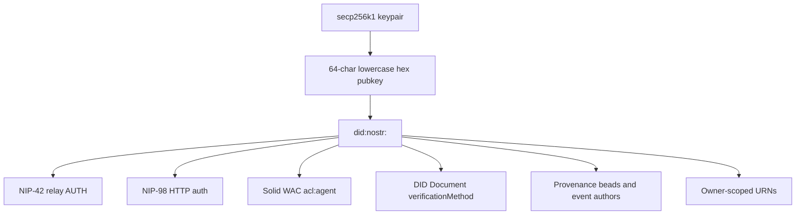

# DID:Nostr Identity Spine

**Status:** Docs-only synthesis
**Date:** 2026-05-20

The VisionFlow ecosystem uses `did:nostr:<hex-pubkey>` as the shared identity primitive for humans, agents, servers, workers, and relays.

## Canonical Form

| Field | Rule |
|---|---|
| Curve | secp256k1 |
| Public key form | 32-byte x-only pubkey |
| Text form | 64 lowercase hex characters |
| DID form | `did:nostr:<hex-pubkey>` |
| Nostr wire form | Nostr event pubkey and optional NIP-19 `npub` at UI/wire edges |

The hex form is the canonical internal representation. `npub` is an encoding boundary, not the source of truth.

## Verification Surfaces

## Expected DID Document Services

Docs across the sibling projects describe a Tier-3 style DID document that should advertise:

| Service | Purpose |
|---|---|
| `#solid-pod` | Preferred Solid pod / LDP storage endpoint |
| `#nostr-relay` | Preferred relay inbox/outbox endpoint |
| `#webid` | Solid WebID URL or cross-verification link |

## Current Risks From Docs

| Risk | Source in docs |
|---|---|
| Multiple DID/Nostr resolver implementations | VisionClaw PRD-015 cross-substrate overlap analysis |
| Relay endpoint not always advertised or externally reachable | VisionClaw PRD-010 forum and agentbox surface notes |
| NIP-98 replay protection differs by substrate | VisionClaw PRD-014 and PRD-015 |
| NIP-26 delegation is not uniformly wired | VisionClaw PRD-010/014 deferred work |
| Cloudflare Workers and native pod tiers verify independently | nostr-rust-forum ADR-093 |

## Compatibility Checklist

Each substrate that claims mesh participation should document:

| Check | Required value |
|---|---|
| Canonical public key form | 64 lowercase x-only hex |
| DID method | `did:nostr` |
| Relay write auth | NIP-42 |
| HTTP auth | NIP-98 with replay protection |
| DID document verification suite | One ecosystem-wide suite string |
| Relay service endpoint | Externally reachable URL when in federated mode |
| Pod service endpoint | LDP root URL |
| Delegation support | NIP-26 verifier status |
| Event envelope | IS-Envelope version and schema hash |

