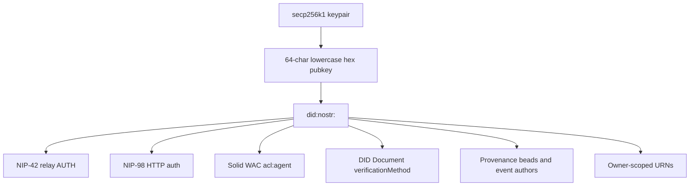

# DID:Nostr Identity Spine

**Status:** Docs-only synthesis; carries one normative clause — the COM-13 agent-disclosure norm below
**Date:** 2026-05-20 (disclosure norm added 2026-07-08)

The VisionFlow ecosystem uses `did:nostr:<hex-pubkey>` as the shared identity primitive for humans, agents, servers, workers, and relays.

## Agent Disclosure Norm (COM-13) — normative

Everything else in this document is descriptive. This section is not: it is the
canon's binding disclosure norm, stated in RFC 2119 terms (MUST / MUST NOT). It is
the contract the forum's disclosure badge and VisionClaw's `did:nostr` keying
implement and cite. It discharges COM-13 (register gap F2: *agents indistinguishable
from humans*).

**MUST — interaction-time disclosure.** An agent participating in any governed
surface MUST publish its `did:nostr` and be resolvable to the human or organisation
that authorised it, at interaction time, before its contribution is acted upon. A
surface that renders an agent-authored item without that disclosure is
non-conformant.

**MUST — author-render disclosure.** An agent MUST be identifiable *as an agent* at
every author-render surface — every place a human reads an agent-authored item:
message body, quoted reply, thread view, pinned item, topic list, notification,
event card, headset nameplate, desktop graph node. The disclosure MUST name the
authorising principal (the human or organisation the agent acts for). A surface
that renders an agent-authored item indistinguishably from a human-authored one is
non-conformant, even when the item is otherwise valid.

**MUST — registry-sourced, not self-asserted.** The agent flag and its authorising
principal MUST be resolved from an authoritative registry keyed by `did:nostr`, not
inferred from a display name, an avatar or the message text. An unregistered
`did:nostr` presenting itself as an agent, or a registered agent rendered without
its disclosure, is non-conformant.

**MUST NOT — silent degradation.** A surface that cannot resolve the registry MUST
fail closed for the agent flag: it withholds the item or marks its provenance
unverified. It MUST NOT render an agent-authored item as human-authored because the
lookup was unavailable.

### Reference implementation (integrated)

The forum's shipped `GET /api/agents/disclosure` is the reference implementation of
this norm and is at `integrated`. It is a public, active-only projection of the
agent registry keyed by `did:nostr`, each entry naming the authorising principal;
the forum's `AgentBadge` consumes it and is mounted at every author-render surface
(census-verified across the message body, quoted message, thread view, pinned
messages, topic list and event card). VisionClaw's COM-14 `did:nostr` keying of
agent nodes is the second consumer, carrying the same identity to the desktop node
nameplate and the headset surface.

A conformant substrate cites this clause as its disclosure contract and resolves the
agent flag and authorising principal from a `did:nostr`-keyed registry of this
shape. This canon clause is authored here (`standalone`); the norm reaches
`integrated` when both the forum and VisionClaw cite it by name — the forum's
endpoint and VisionClaw's keying are the two substrates that carry it.

## Canonical Form

| Field | Rule |
|---|---|
| Curve | secp256k1 |
| Public key form | 32-byte x-only pubkey |
| Text form | 64 lowercase hex characters |
| DID form | `did:nostr:<hex-pubkey>` |
| Nostr wire form | Nostr event pubkey and optional NIP-19 `npub` at UI/wire edges |

The hex form is the canonical internal representation. `npub` is an encoding boundary, not the source of truth.

## Verification Surfaces

## Expected DID Document Services

Docs across the sibling projects describe a Tier-3 style DID document that should advertise:

| Service | Purpose |
|---|---|
| `#solid-pod` | Preferred Solid pod / LDP storage endpoint |
| `#nostr-relay` | Preferred relay inbox/outbox endpoint |
| `#webid` | Solid WebID URL or cross-verification link |

## Current Risks From Docs

| Risk | Source in docs |
|---|---|
| Multiple DID/Nostr resolver implementations | VisionClaw PRD-015 cross-substrate overlap analysis |
| Relay endpoint not always advertised or externally reachable | VisionClaw PRD-010 forum and agentbox surface notes |
| NIP-98 replay protection differs by substrate | VisionClaw PRD-014 and PRD-015 |
| NIP-26 delegation is not uniformly wired | VisionClaw PRD-010/014 deferred work |
| Cloudflare Workers and native pod tiers verify independently | nostr-rust-forum ADR-093 |

## Compatibility Checklist

Each substrate that claims mesh participation should document:

| Check | Required value |
|---|---|
| Canonical public key form | 64 lowercase x-only hex |
| DID method | `did:nostr` |
| Relay write auth | NIP-42 |
| HTTP auth | NIP-98 with replay protection |
| DID document verification suite | One ecosystem-wide suite string |
| Relay service endpoint | Externally reachable URL when in federated mode |
| Pod service endpoint | LDP root URL |
| Delegation support | NIP-26 verifier status |
| Event envelope | IS-Envelope version and schema hash |

