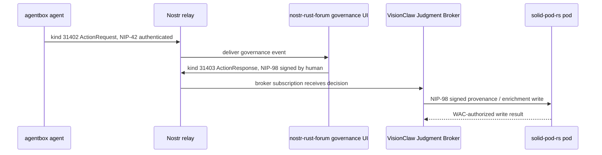

# Mesh Smoke Test

**Status:** Test plan and preflight
**Date:** 2026-05-22
**Last updated from:** Runtime research (2026-05-22)

This document defines the first end-to-end VisionFlow mesh smoke test. The local repository can run the preflight. The full smoke requires live sibling services, configured keys, and reachable relays.

## Preflight

```sh
scripts/mesh-smoke-preflight.sh
```

The preflight checks that the expected sibling repos/config files are present, inspects substrate readiness markers, and prints a summary table of mount status, mesh-readiness, and default mode per substrate.

## Current Substrate Readiness

Runtime research (2026-05-22) found the following status per substrate:

| Substrate | Default Mode | Implemented | Missing / TBD |
|---|---|---|---|
| **nostr-rust-forum** 3.0.0-rc11 | Federated (NIP-05 default) | Full kinds 31400-31405 in `crates/nostr-bbs-core/src/governance.rs`; NIP-42 relay gate | Relay mesh topology config not yet exercised end-to-end |
| **dreamlab-ai-website** | Federated (CF Workers relay fan-out) | Governance dashboard at `/governance` renders 31400-31405; NIP-98 signed responses | Peer relay list may be empty in default config |
| **agentbox** | Standalone | Embedded relay at `:7777` with pod-bridge; publishes/subscribes 31400-31405 via `mcp/nostr-bridge/relay-consumer.js`; federated/client modes available | Standalone default means relay is loopback-only without config change |
| **solid-pod-rs** alpha.15 | Standalone (native mesh, CORS, PSK admin) | NIP-98 verify at `auth::nip98::verify_schnorr_signature` | WAC + NIP-98 integration not exercised in cross-service smoke |
| **VisionClaw** | N/A (enrichment gating, BrokerActor on crashbug branch) | IS-Envelope spec owner (ADR-075); IRI parser for `did:nostr`; BrokerActor publishes 31400/31402 (not on main) | Judgment Broker is 65% implemented as a distributed system; VisionClaw owns enrichment gating |
| **Ontology bridge** | N/A (agentbox addon) | 10 MCP tools proxy SPARQL to VisionClaw Oxigraph | Not part of governance path; included for completeness |

## Full End-to-End Path



## Required Assertions

| Step | Assertion |
|---|---|
| Agent publish | Event signature verifies, `pubkey` matches registered agent DID |
| Relay gate | Relay requires NIP-42 for write and rejects unauthenticated publish |
| Forum render | Governance UI shows the action request from kind `31402` |
| Human response | kind `31403` is signed by the human key and references the request |
| Broker receive | VisionClaw records the decision without re-signing away original attribution |
| Pod write | NIP-98 request verifies, WAC grants access, provenance resource is persisted |
| Traceability | The final resource links agent DID, human DID, broker case, event IDs, and pod URI |

## Current Blockers To Confirm

| Blocker | Status (2026-05-22) | Why it matters |
|---|---|---|
| Default deployments may be standalone | **Partially resolved.** nostr-rust-forum and dreamlab-ai-website default to federated. agentbox defaults to standalone but supports federated/client modes via `agentbox.toml`. | The smoke needs reachable peer relays; agentbox requires explicit config change to participate. |
| agentbox relay exposure/config must be verified | **Confirmed standalone.** Embedded relay at `:7777` with pod-bridge exists. `federation.mode` in `agentbox.toml` controls exposure. Switch to `"client"` to join the mesh. | A loopback-only relay cannot participate in cross-service smoke without config change. |
| IS-Envelope schema owner must be pinned | **Resolved.** VisionClaw owns the IS-Envelope spec (ADR-075). IRI parser handles `did:nostr`. | Event payloads have one canonical contract owner. |
| NIP-26 delegation status must be explicit | **Open.** No runtime evidence of NIP-26 delegation support in any substrate. | Delegated agent actions need uniform verification across all substrates. |
| VisionClaw has no broker runtime | **Confirmed.** VisionClaw is a library with ADR-075 spec and IRI parsing but no standalone broker process. | The broker step in the sequence diagram requires a runtime host (agentbox or dedicated service). |
| NIP-98 cross-service verification untested | **New.** solid-pod-rs has `verify_schnorr_signature` but it has not been exercised against nostr-rust-forum or agentbox signatures in integration. | Pod writes depend on NIP-98 verification accepting signatures from all mesh participants. |

## Preflight Results

Record the output of `scripts/mesh-smoke-preflight.sh` here after each run.

```
Run date: ____-__-__
Runner:   ________________

<paste script output here>
```

### Interpretation Guide

| Symbol | Meaning |
|---|---|
| `OK` | File/marker found, substrate is mounted and has the expected artifact |
| `MISSING` | File/marker not found; substrate may not be mounted or artifact is absent |
| `standalone` | Substrate defaults to standalone mode (needs config change for mesh) |
| `federated` | Substrate defaults to federated mode (mesh-ready with peer config) |
| `n/a` | Substrate has no runtime mode (library or spec-only) |
