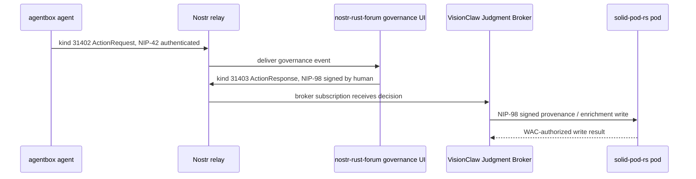

# Mesh Smoke Test

**Status:** Test plan and preflight
**Date:** 2026-05-20

This document defines the first end-to-end VisionFlow mesh smoke test. The local repository can run the preflight. The full smoke requires live sibling services, configured keys, and reachable relays.

## Preflight

```sh
scripts/mesh-smoke-preflight.sh
```

The preflight checks that the expected sibling docs/config files are present and reports whether current deployment config appears standalone or federated.

## Full End-to-End Path



## Required Assertions

| Step | Assertion |
|---|---|
| Agent publish | Event signature verifies, `pubkey` matches registered agent DID |
| Relay gate | Relay requires NIP-42 for write and rejects unauthenticated publish |
| Forum render | Governance UI shows the action request from kind `31402` |
| Human response | kind `31403` is signed by the human key and references the request |
| Broker receive | VisionClaw records the decision without re-signing away original attribution |
| Pod write | NIP-98 request verifies, WAC grants access, provenance resource is persisted |
| Traceability | The final resource links agent DID, human DID, broker case, event IDs, and pod URI |

## Current Blockers To Confirm

| Blocker | Why it matters |
|---|---|
| Default deployments may be standalone | The smoke needs reachable peer relays |
| agentbox relay exposure/config must be verified | A loopback-only relay cannot participate in cross-service smoke |
| IS-Envelope schema owner must be pinned | Event payloads need one canonical contract |
| NIP-26 delegation status must be explicit | Delegated agent actions need uniform verification |

