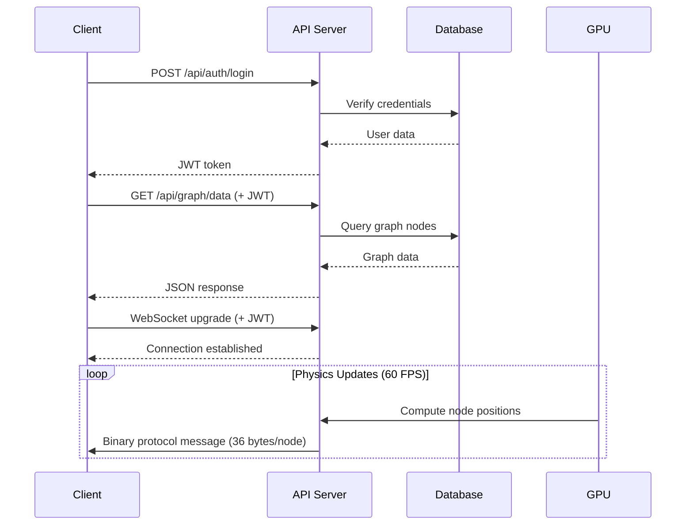

# Complete API Reference

**Version**: 2.0
**Base URL**: `http://localhost:9090/api`
**Last Updated**: December 18, 2025

This unified reference consolidates all VisionFlow API documentation including REST endpoints, WebSocket protocols, and binary communication formats.

---

## Table of Contents

1. [Authentication & Authorization](#authentication--authorization)
2. [REST API Endpoints](#rest-api-endpoints)
3. [WebSocket Protocols](#websocket-protocols)
4. [Binary Protocol Specification](#binary-protocol-specification)
5. [Error Responses](#error-responses)
6. [Rate Limiting](#rate-limiting)
7. [Versioning](#versioning)

---

## Authentication & Authorization

### JWT Authentication

VisionFlow uses JWT (JSON Web Tokens) for stateless authentication.

#### Login Endpoint

```http
POST /api/auth/login
Content-Type: application/json

{
  "email": "user@example.com",
  "password": "secure-password"
}
```

**Response**:
```json
{
  "success": true,
  "data": {
    "token": "eyJhbGciOiJIUzI1NiIsInR5cCI6IkpXVCJ9...",
    "user": {
      "id": "uuid",
      "email": "user@example.com",
      "role": "user"
    }
  }
}
```

#### Using JWT Tokens

Include in Authorization header:
```bash
curl -H "Authorization: Bearer YOUR-JWT-TOKEN" \
  http://localhost:9090/api/graph/data
```

#### API Keys

Generate API keys for programmatic access:
```bash
curl -X POST http://localhost:9090/api/auth/api-keys \
  -H "Authorization: Bearer YOUR-JWT-TOKEN"
```

Use with X-API-Key header:
```bash
curl -H "X-API-Key: YOUR-API-KEY" \
  http://localhost:9090/api/graph/data
```

### Nostr Authentication

Alternative authentication via Nostr protocol (NIP-98):

```typescript
// Client-side Nostr authentication
import { generatePrivateKey, getPublicKey, finishEvent } from 'nostr-tools';

const sk = generatePrivateKey();
const pk = getPublicKey(sk);

const authEvent = finishEvent({
  kind: 27235,
  created_at: Math.floor(Date.now() / 1000),
  tags: [
    ['u', 'https://visionflow.example.com/api/auth/nostr'],
    ['method', 'POST']
  ],
  content: ''
}, sk);

const response = await fetch('/api/auth/nostr', {
  method: 'POST',
  headers: { 'Content-Type': 'application/json' },
  body: JSON.stringify(authEvent)
});
```

### Token Expiration

| Token Type | Expiration | Refresh Method |
|------------|------------|----------------|
| JWT Access Token | 24 hours | `/auth/refresh` endpoint |
| Refresh Token | 30 days | Re-authenticate |
| API Keys | Never | Revoke and regenerate |

---

## REST API Endpoints

### Core Endpoints

#### Health Check

```http
GET /api/health
```

**Response**:
```json
{
  "status": "ok",
  "version": "0.1.0",
  "timestamp": "2025-12-18T12:00:00Z",
  "components": {
    "database": "healthy",
    "gpu": "healthy",
    "websocket": "healthy"
  }
}
```

#### Application Configuration

```http
GET /api/config
```

**Response**:
```json
{
  "version": "0.1.0",
  "features": {
    "ragflow": true,
    "perplexity": false,
    "openai": true,
    "gpu": true,
    "xr": true
  },
  "websocket": {
    "minUpdateRate": 16,
    "maxUpdateRate": 120,
    "protocol": "binary-v2"
  },
  "rendering": {
    "ambientLightIntensity": 0.5,
    "enableAmbientOcclusion": true,
    "backgroundColor": "#1a1a1a"
  }
}
```

### Graph Endpoints

#### Get Complete Graph

```http
GET /api/graph/data
Authorization: Bearer {token}
```

**Response**:
```json
{
  "nodes": [
    {
      "id": 1,
      "metadataId": "node-uuid",
      "label": "Example Node",
      "position": {"x": 0.0, "y": 0.0, "z": 0.0},
      "velocity": {"x": 0.0, "y": 0.0, "z": 0.0},
      "metadata": {
        "owl-class-iri": "http://example.org/Class",
        "file-source": "example.md"
      },
      "type": "concept",
      "size": 1.0,
      "color": "#3498db"
    }
  ],
  "edges": [
    {
      "source": 1,
      "target": 2,
      "relationshipType": "related-to",
      "weight": 1.0
    }
  ],
  "metadata": {...},
  "settlementState": {
    "isSettled": false,
    "kineticEnergy": 12.5
  }
}
```

#### Paginated Graph Data

```http
GET /api/graph/data/paginated?page=1&page-size=100
```

**Query Parameters**:
- `page` (integer): Page number (1-indexed)
- `page-size` (integer): Items per page (default: 100, max: 1000)
- `filter` (string, optional): Node type filter
- `sort` (string, optional): Sort field

**Response**:
```json
{
  "nodes": [...],
  "edges": [...],
  "pagination": {
    "currentPage": 1,
    "totalPages": 10,
    "totalItems": 1000,
    "pageSize": 100,
    "hasNext": true,
    "hasPrevious": false
  }
}
```

#### Update Graph

```http
POST /api/graph/update
Authorization: Bearer {token}
```

Triggers graph update from GitHub repository.

**Response**:
```json
{
  "success": true,
  "message": "Graph updated with 5 new files",
  "filesProcessed": 5,
  "nodesCreated": 12,
  "edgesCreated": 8
}
```

### Ontology Endpoints

#### Get Class Hierarchy

```http
GET /api/ontology/hierarchy?ontology-id=default&max-depth=5
```

**Query Parameters**:
- `ontology-id` (string, optional): Ontology identifier
- `max-depth` (integer, optional): Maximum traversal depth

**Response**:
```json
{
  "rootClasses": [
    "http://example.org/Person",
    "http://example.org/Organization"
  ],
  "hierarchy": {
    "http://example.org/Person": {
      "iri": "http://example.org/Person",
      "label": "Person",
      "parentIri": null,
      "childrenIris": [
        "http://example.org/Student",
        "http://example.org/Teacher"
      ],
      "nodeCount": 5,
      "depth": 0
    }
  }
}
```

#### Load Ontology

```http
POST /api/ontology/load
Content-Type: application/json
Authorization: Bearer {token}

{
  "source": "https://example.org/ontology.owl",
  "format": "rdf/xml",
  "validateImmediately": true
}
```

**Supported Formats**:
- `rdf/xml`
- `turtle`
- `n-triples`
- `json-ld`

**Response**:
```json
{
  "ontologyId": "ontology-uuid-123",
  "loadedAt": "2025-12-18T12:00:00Z",
  "axiomCount": 150,
  "loadingTimeMs": 450,
  "validationJobId": "job-uuid-456"
}
```

#### Validate Ontology

```http
POST /api/ontology/validate
Content-Type: application/json

{
  "ontologyId": "ontology-123",
  "mode": "full",
  "priority": 5,
  "enableWebsocketUpdates": true
}
```

**Validation Modes**:
- `quick`: Fast structural checks only
- `full`: Complete validation with reasoning
- `incremental`: Only validate changes

**Response**:
```json
{
  "jobId": "job-uuid-789",
  "status": "queued",
  "estimatedCompletion": "2025-12-18T12:00:30Z",
  "queuePosition": 1
}
```

### Physics Endpoints

#### Start/Stop Simulation

```http
POST /api/physics/start
POST /api/physics/stop
```

#### Get Simulation Status

```http
GET /api/physics/status
```

**Response**:
```json
{
  "isRunning": true,
  "isSettled": false,
  "stableFrameCount": 45,
  "kineticEnergy": 12.5,
  "fps": 60,
  "nodeCount": 150,
  "gpu": {
    "enabled": true,
    "utilization": 45,
    "memory": "400MB / 16GB"
  }
}
```

#### Update Physics Parameters

```http
POST /api/physics/parameters
Content-Type: application/json

{
  "gravity": 0.1,
  "charge": -30.0,
  "linkStrength": 0.5,
  "friction": 0.9,
  "theta": 0.8,
  "enableGPU": true
}
```

### Analytics Endpoints

#### Detect Communities

```http
POST /api/semantic/communities
Content-Type: application/json

{
  "algorithm": "louvain",
  "resolution": 1.0,
  "minSize": 5
}
```

**Supported Algorithms**:
- `louvain`: Louvain method (fast, hierarchical)
- `label-propagation`: Label propagation (very fast)
- `modularity`: Modularity optimization

**Response**:
```json
{
  "communities": [
    {
      "id": "community-1",
      "nodeIds": [1, 2, 3, 4],
      "density": 0.75,
      "size": 4
    }
  ],
  "modularity": 0.82,
  "count": 12
}
```

#### Compute Centrality

```http
POST /api/semantic/centrality
Content-Type: application/json

{
  "metric": "betweenness",
  "normalized": true,
  "nodeIds": [1, 2, 3]
}
```

**Supported Metrics**:
- `degree`: Node degree centrality
- `betweenness`: Betweenness centrality
- `closeness`: Closeness centrality
- `eigenvector`: Eigenvector centrality
- `pagerank`: PageRank algorithm

**Response**:
```json
{
  "results": [
    {
      "nodeId": 1,
      "score": 0.85,
      "rank": 1
    }
  ],
  "metric": "betweenness",
  "normalized": true
}
```

---

## WebSocket Protocols

### Connection Establishment

```typescript
// Binary protocol (recommended)
const ws = new WebSocket('ws://localhost:9090/ws?token=YOUR-JWT-TOKEN');
ws.binaryType = 'arraybuffer';

// Legacy JSON protocol (deprecated)
const wsJson = new WebSocket('ws://localhost:9090/ws?token=TOKEN&protocol=json');
```

### Message Types

#### Client → Server Messages (JSON)

##### Subscribe to Updates

```json
{
  "type": "subscribe_position_updates",
  "data": {
    "rate": 60,
    "nodeFilter": "all"
  }
}
```

##### Filter Update

```json
{
  "type": "filter_update",
  "data": {
    "quality": 0.5,
    "maxNodes": 10000,
    "types": ["concept", "entity"]
  }
}
```

#### Server → Client Messages (Binary)

See [Binary Protocol Specification](#binary-protocol-specification) for details.

---

## Binary Protocol Specification

### Protocol V2 (Current Standard)

**Wire Format**: 36 bytes per node

```
┌─────────┬────────────────────────────────────────────┐
│ Offset  │ Field (Type, Bytes)                        │
├─────────┼────────────────────────────────────────────┤
│ [0]     │ Protocol Version (u8) = 2                  │
├─────────┼────────────────────────────────────────────┤
│ [1-4]   │ Node ID (u32) with type flags             │
│ [5-8]   │ Position X (f32)                          │
│ [9-12]  │ Position Y (f32)                          │
│ [13-16] │ Position Z (f32)                          │
│ [17-20] │ Velocity X (f32)                          │
│ [21-24] │ Velocity Y (f32)                          │
│ [25-28] │ Velocity Z (f32)                          │
│ [29-32] │ SSSP Distance (f32)                       │
│ [33-36] │ SSSP Parent (i32)                         │
└─────────┴────────────────────────────────────────────┘
```

**Total Message Size**: 1 + (36 × node_count) bytes

### Field Specifications

| Field | Type | Bytes | Endianness | Range | Description |
|-------|------|-------|------------|-------|-------------|
| Version | u8 | 1 | N/A | 2 | Protocol version identifier |
| Node ID | u32 | 4 | Little | 0-1,073,741,823 | Bits 0-29: ID, Bits 30-31: Type flags |
| Position X/Y/Z | f32 | 12 | Little | -∞ to +∞ | 3D world coordinates |
| Velocity X/Y/Z | f32 | 12 | Little | -∞ to +∞ | Physics velocity (units/sec) |
| SSSP Distance | f32 | 4 | Little | 0.0 to +∞ | Shortest path distance |
| SSSP Parent | i32 | 4 | Little | -1 to max | Parent node in path tree |

### Node Type Flags

Encoded in high bits of Node ID field:

```rust
const AGENT_NODE_FLAG: u32 = 0x80000000;      // Bit 31
const KNOWLEDGE_NODE_FLAG: u32 = 0x40000000;  // Bit 30
const NODE_ID_MASK: u32 = 0x3FFFFFFF;         // Bits 0-29
```

**TypeScript Decoding**:
```typescript
const nodeIdRaw = view.getUint32(offset, true); // Little-endian
const actualId = nodeIdRaw & 0x3FFFFFFF;
const isAgent = (nodeIdRaw & 0x80000000) !== 0;
const isKnowledge = (nodeIdRaw & 0x40000000) !== 0;
```

### Protocol V3 (Analytics Extension)

Adds 12 bytes for machine learning analytics:

- **Cluster ID** (u32): K-means cluster assignment
- **Anomaly Score** (f32): LOF score (0.0-1.0)
- **Community ID** (u32): Louvain community

**Total Message Size**: 1 + (48 × node_count) bytes

### Performance Comparison

| Protocol | Message Size (100K nodes) | Parse Time | Bandwidth Savings |
|----------|---------------------------|------------|-------------------|
| Binary V2 | 3.6 MB | 0.8 ms | Baseline |
| Binary V3 | 4.8 MB | 1.1 ms | +33% size |
| JSON V1 (deprecated) | 18 MB | 12 ms | -80% (worse) |

---

## Error Responses

### Standard Error Format

```json
{
  "success": false,
  "error": {
    "code": "AP-E-001",
    "message": "Invalid request format",
    "details": [
      {
        "field": "name",
        "message": "Name is required",
        "constraint": "not-empty"
      }
    ],
    "timestamp": "2025-12-18T12:00:00Z",
    "traceId": "req-uuid-123"
  }
}
```

### Error Code System

**Format**: `[SYSTEM]-[SEVERITY]-[NUMBER]`

#### System Identifiers

- `AP`: API/Application Layer
- `DB`: Database Layer
- `GR`: Graph/Ontology Reasoning
- `GP`: GPU/Physics Computing
- `WS`: WebSocket/Network
- `AU`: Authentication/Authorization
- `ST`: Storage/File Management

#### Severity Levels

- `E`: Error (recoverable, operation failed)
- `F`: Fatal (unrecoverable, requires restart)
- `W`: Warning (degraded performance)
- `I`: Info (informational only)

#### Common Error Codes

| Code | Message | Resolution |
|------|---------|------------|
| `AP-E-001` | Invalid Request Format | Verify JSON syntax |
| `AP-E-101` | Missing Auth Token | Provide JWT token |
| `AP-E-102` | Invalid Token | Refresh authentication |
| `AP-E-201` | Resource Not Found | Verify resource ID |
| `DB-E-001` | Connection Failed | Check database status |
| `GR-E-101` | Reasoning Failed | Check ontology consistency |
| `GP-E-001` | No GPU Found | Use CPU fallback or install GPU |
| `WS-E-001` | Connection Refused | Check server is running |

### HTTP Status Codes

| Code | Meaning | Usage |
|------|---------|-------|
| 200 | OK | Successful request |
| 201 | Created | Resource created |
| 202 | Accepted | Async processing started |
| 400 | Bad Request | Invalid input |
| 401 | Unauthorized | Missing/invalid auth |
| 403 | Forbidden | Insufficient permissions |
| 404 | Not Found | Resource doesn't exist |
| 429 | Too Many Requests | Rate limit exceeded |
| 500 | Internal Server Error | Server error |
| 503 | Service Unavailable | Feature disabled |

---

## Rate Limiting

### Default Limits

| Endpoint Type | Limit | Window | Per |
|---------------|-------|--------|-----|
| Authentication | 10 requests | 1 minute | IP |
| REST API | 100 requests | 1 minute | IP |
| REST API (Authenticated) | 1000 requests | 1 hour | User |
| WebSocket Messages | 120 messages | 1 second | Connection |
| File Upload | 10 requests | 1 hour | User |

### Rate Limit Headers

```http
HTTP/1.1 200 OK
X-RateLimit-Limit: 100
X-RateLimit-Remaining: 95
X-RateLimit-Reset: 1702915200
```

### Rate Limit Exceeded Response

```json
{
  "success": false,
  "error": {
    "code": "AP-E-305",
    "message": "Rate limit exceeded",
    "details": {
      "limit": 100,
      "remaining": 0,
      "resetAt": "2025-12-18T12:30:00Z",
      "retryAfter": 45
    }
  }
}
```

---

## Versioning

### API Version Strategy

VisionFlow uses **URL-based versioning** for major changes:

```
/api/v1/graph/data    (Current: default)
/api/v2/graph/data    (Future breaking changes)
```

### Version Negotiation

**Header-based version selection**:
```http
GET /api/graph/data
Accept: application/vnd.visionflow.v1+json
```

### Version Lifecycle

| Version | Status | Support End | Notes |
|---------|--------|-------------|-------|
| v1 | Current | N/A | Default version |
| v2 | Planned | N/A | Breaking changes TBD |

### Protocol Versioning

Binary WebSocket protocol versions are negotiated automatically:
- Client sends supported versions
- Server selects highest common version
- Version byte in every binary message

---

---

---

## Related Documentation

- [Configuration Reference](CONFIGURATION_REFERENCE.md)
- [Error Reference and Troubleshooting](ERROR_REFERENCE.md)
- [WebSocket Binary Protocol Reference](websocket-protocol.md)
- [VisionFlow Binary WebSocket Protocol](protocols/binary-websocket.md)
- [WebSocket Binary Protocol - Complete System Documentation](../diagrams/infrastructure/websocket/binary-protocol-complete.md)

## Cross-Reference Matrix

### Related Documentation

| Topic | Documentation | Link |
|-------|---------------|------|
| Binary Protocol Details | Protocol Specification | [binary-websocket.md](./protocols/binary-websocket.md) |
| WebSocket Guide | WebSocket Documentation | [03-websocket.md](./api/03-websocket.md) |
| Error Codes | Error Reference | [error-codes.md](./error-codes.md) |
| Performance | Benchmarks | [performance-benchmarks.md](./performance-benchmarks.md) |
| Database Schema | Schema Reference | [database/schemas.md](./database/schemas.md) |
| Configuration | Config Reference | [CONFIGURATION_REFERENCE.md](./CONFIGURATION_REFERENCE.md) |

### API Interaction Diagrams



---

**API Reference Version**: 2.0
**VisionFlow Version**: v0.1.0
**Maintainer**: VisionFlow API Team
**Last Updated**: December 18, 2025
