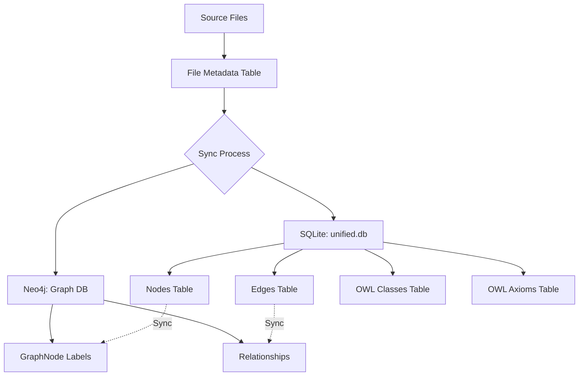
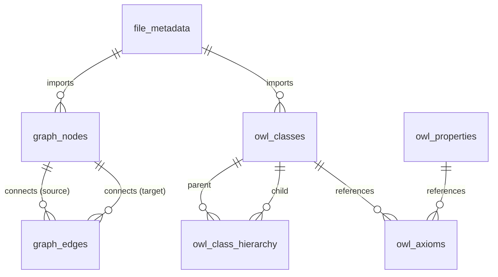

# Database Schema Reference

**Version**: 2.0
**Database**: `unified.db` (SQLite) + Neo4j Graph Database
**Last Updated**: December 18, 2025

This reference documents the complete database schema for VisionFlow including the unified SQLite database and Neo4j graph database integration.

---

## Table of Contents

1. [Database Architecture](#database-architecture)
2. [SQLite Schema (unified.db)](#sqlite-schema-unifieddb)
3. [Neo4j Graph Schema](#neo4j-graph-schema)
4. [Relationships & Foreign Keys](#relationships--foreign-keys)
5. [Indexes & Performance](#indexes--performance)
6. [Query Patterns](#query-patterns)
7. [Migrations](#migrations)

---

## Database Architecture

### Dual Database Strategy

VisionFlow uses two complementary databases:

| Database | Technology | Purpose | Performance |
|----------|------------|---------|-------------|
| **Unified DB** | SQLite | Structured data, OWL axioms, metadata | 100K+ rows, <5ms queries |
| **Graph DB** | Neo4j | Graph traversal, relationships, analytics | 1M+ nodes, <20ms queries |

### Data Flow



---

## SQLite Schema (unified.db)

### Schema Version

```sql
CREATE TABLE IF NOT EXISTS schema_version (
    id INTEGER PRIMARY KEY CHECK (id = 1),
    version INTEGER NOT NULL,
    applied_at DATETIME DEFAULT CURRENT_TIMESTAMP
);
```

**Current Version**: 1

---

### Core Tables

#### 1. graph_nodes - Knowledge Graph Vertices

Stores all knowledge graph nodes with 3D positions and metadata.

```sql
CREATE TABLE IF NOT EXISTS graph_nodes (
    id INTEGER PRIMARY KEY,
    metadata_id TEXT NOT NULL UNIQUE,
    label TEXT NOT NULL,

    -- 3D Position
    x REAL NOT NULL DEFAULT 0.0,
    y REAL NOT NULL DEFAULT 0.0,
    z REAL NOT NULL DEFAULT 0.0,

    -- Physics Velocity
    vx REAL NOT NULL DEFAULT 0.0,
    vy REAL NOT NULL DEFAULT 0.0,
    vz REAL NOT NULL DEFAULT 0.0,

    -- Visual Properties
    color TEXT DEFAULT '#3498db',
    size REAL DEFAULT 10.0,
    node_type TEXT DEFAULT 'concept',

    -- Flexible Metadata (JSON)
    metadata TEXT NOT NULL DEFAULT '{}',

    -- Timestamps
    created_at DATETIME DEFAULT CURRENT_TIMESTAMP,
    updated_at DATETIME DEFAULT CURRENT_TIMESTAMP
);

-- Indexes
CREATE INDEX idx_graph_nodes_metadata_id ON graph_nodes(metadata_id);
CREATE INDEX idx_graph_nodes_label ON graph_nodes(label);
CREATE INDEX idx_graph_nodes_spatial ON graph_nodes(x, y, z);
CREATE INDEX idx_graph_nodes_type ON graph_nodes(node_type);
CREATE INDEX idx_graph_nodes_updated ON graph_nodes(updated_at);
```

**Field Specifications**:

| Field | Type | Constraints | Description |
|-------|------|-------------|-------------|
| `id` | INTEGER | PRIMARY KEY | Auto-incrementing node ID |
| `metadata_id` | TEXT | NOT NULL, UNIQUE | UUID for cross-system references |
| `label` | TEXT | NOT NULL | Display name |
| `x`, `y`, `z` | REAL | NOT NULL | 3D world coordinates |
| `vx`, `vy`, `vz` | REAL | NOT NULL | Physics velocity vectors |
| `color` | TEXT | - | Hex color code (#RRGGBB) |
| `size` | REAL | - | Visual size multiplier |
| `node_type` | TEXT | - | Type: concept, entity, class, individual |
| `metadata` | TEXT | NOT NULL | JSON metadata object |

**Example Row**:
```json
{
  "id": 42,
  "metadata_id": "550e8400-e29b-41d4-a716-446655440000",
  "label": "Semantic Web",
  "x": 12.5,
  "y": -3.2,
  "z": 8.7,
  "vx": 0.001,
  "vy": -0.002,
  "vz": 0.0,
  "color": "#e74c3c",
  "size": 2.5,
  "node_type": "concept",
  "metadata": "{\"owl-class-iri\":\"http://example.org/SemanticWeb\",\"source\":\"ontology.md\"}"
}
```

---

#### 2. graph_edges - Knowledge Graph Relationships

Stores relationships between graph nodes.

```sql
CREATE TABLE IF NOT EXISTS graph_edges (
    id TEXT PRIMARY KEY,
    source INTEGER NOT NULL,
    target INTEGER NOT NULL,
    relationship_type TEXT NOT NULL DEFAULT 'related-to',
    weight REAL NOT NULL DEFAULT 1.0,

    -- Edge Metadata (JSON)
    metadata TEXT DEFAULT '{}',

    -- Timestamps
    created_at DATETIME DEFAULT CURRENT_TIMESTAMP,

    FOREIGN KEY (source) REFERENCES graph_nodes(id) ON DELETE CASCADE,
    FOREIGN KEY (target) REFERENCES graph_nodes(id) ON DELETE CASCADE
);

-- Indexes
CREATE INDEX idx_graph_edges_source ON graph_edges(source);
CREATE INDEX idx_graph_edges_target ON graph_edges(target);
CREATE INDEX idx_graph_edges_source_target ON graph_edges(source, target);
CREATE INDEX idx_graph_edges_type ON graph_edges(relationship_type);
CREATE INDEX idx_graph_edges_weight ON graph_edges(weight);
```

**Field Specifications**:

| Field | Type | Constraints | Description |
|-------|------|-------------|-------------|
| `id` | TEXT | PRIMARY KEY | UUID edge identifier |
| `source` | INTEGER | NOT NULL, FK | Source node ID |
| `target` | INTEGER | NOT NULL, FK | Target node ID |
| `relationship_type` | TEXT | NOT NULL | Relationship semantic type |
| `weight` | REAL | NOT NULL | Edge weight (default 1.0) |
| `metadata` | TEXT | - | JSON metadata |

**Common Relationship Types**:
- `related-to`: Generic relationship
- `subclass-of`: OWL SubClassOf
- `instance-of`: OWL ClassAssertion
- `property-assertion`: OWL PropertyAssertion
- `hyperlink`: Markdown/Wiki link

---

#### 3. owl_classes - OWL Ontology Class Definitions

Stores semantic class definitions from OWL ontologies.

```sql
CREATE TABLE IF NOT EXISTS owl_classes (
    iri TEXT PRIMARY KEY,
    label TEXT,
    description TEXT,
    source_file TEXT,

    -- Class Properties (JSON)
    properties TEXT NOT NULL DEFAULT '{}',

    -- Timestamps
    created_at DATETIME DEFAULT CURRENT_TIMESTAMP,
    updated_at DATETIME DEFAULT CURRENT_TIMESTAMP
);

-- Indexes
CREATE INDEX idx_owl_classes_label ON owl_classes(label);
CREATE INDEX idx_owl_classes_source ON owl_classes(source_file);
CREATE INDEX idx_owl_classes_updated ON owl_classes(updated_at);
```

**Field Specifications**:

| Field | Type | Description |
|-------|------|-------------|
| `iri` | TEXT | IRI (Internationalized Resource Identifier) |
| `label` | TEXT | Human-readable label (rdfs:label) |
| `description` | TEXT | Class description (rdfs:comment) |
| `source_file` | TEXT | Source ontology file path |
| `properties` | TEXT | JSON: equivalent classes, disjoint classes, annotations |

**Example Row**:
```json
{
  "iri": "http://example.org/ontology#Person",
  "label": "Person",
  "description": "A human being",
  "source_file": "ontologies/core.owl",
  "properties": "{\"equivalentClasses\":[],\"disjointWith\":[\"http://example.org/ontology#Organization\"]}"
}
```

---

#### 4. owl_class_hierarchy - OWL SubClassOf Relationships

Stores parent-child relationships between OWL classes.

```sql
CREATE TABLE IF NOT EXISTS owl_class_hierarchy (
    class_iri TEXT NOT NULL,
    parent_iri TEXT NOT NULL,

    PRIMARY KEY (class_iri, parent_iri),
    FOREIGN KEY (class_iri) REFERENCES owl_classes(iri) ON DELETE CASCADE,
    FOREIGN KEY (parent_iri) REFERENCES owl_classes(iri) ON DELETE CASCADE
);

-- Indexes
CREATE INDEX idx_hierarchy_class ON owl_class_hierarchy(class_iri);
CREATE INDEX idx_hierarchy_parent ON owl_class_hierarchy(parent_iri);
```

**Usage**: Enables efficient hierarchy queries (ancestors, descendants, depth).

---

#### 5. owl_properties - OWL Property Definitions

Stores OWL property definitions (Object, Data, Annotation properties).

```sql
CREATE TABLE IF NOT EXISTS owl_properties (
    iri TEXT PRIMARY KEY,
    label TEXT,
    property_type TEXT NOT NULL CHECK (property_type IN (
        'ObjectProperty',
        'DataProperty',
        'AnnotationProperty'
    )),

    -- Domain and Range (JSON arrays of IRIs)
    domain TEXT NOT NULL DEFAULT '[]',
    range TEXT NOT NULL DEFAULT '[]',

    -- Timestamps
    created_at DATETIME DEFAULT CURRENT_TIMESTAMP,
    updated_at DATETIME DEFAULT CURRENT_TIMESTAMP
);

-- Indexes
CREATE INDEX idx_owl_properties_type ON owl_properties(property_type);
CREATE INDEX idx_owl_properties_label ON owl_properties(label);
```

**Field Specifications**:

| Field | Type | Constraints | Description |
|-------|------|-------------|-------------|
| `iri` | TEXT | PRIMARY KEY | Property IRI |
| `property_type` | TEXT | NOT NULL, CHECK | ObjectProperty, DataProperty, AnnotationProperty |
| `domain` | TEXT | NOT NULL | JSON array of domain class IRIs |
| `range` | TEXT | NOT NULL | JSON array of range class/datatype IRIs |

---

#### 6. owl_axioms - Complete OWL Axiom Storage

Stores all OWL axioms including inferred relationships.

```sql
CREATE TABLE IF NOT EXISTS owl_axioms (
    id INTEGER PRIMARY KEY AUTOINCREMENT,
    axiom_type TEXT NOT NULL CHECK (axiom_type IN (
        'SubClassOf',
        'EquivalentClass',
        'DisjointWith',
        'ObjectPropertyAssertion',
        'DataPropertyAssertion',
        'ClassAssertion',
        'SameIndividual',
        'DifferentIndividuals'
    )),
    subject TEXT NOT NULL,
    predicate TEXT,
    object TEXT NOT NULL,

    -- Annotations (JSON)
    annotations TEXT NOT NULL DEFAULT '{}',

    -- Inference Tracking
    is_inferred INTEGER NOT NULL DEFAULT 0 CHECK (is_inferred IN (0, 1)),
    inferred_from TEXT,  -- JSON array of axiom IDs
    inference_rule TEXT,

    -- Timestamps
    created_at DATETIME DEFAULT CURRENT_TIMESTAMP
);

-- Indexes
CREATE INDEX idx_axioms_type ON owl_axioms(axiom_type);
CREATE INDEX idx_axioms_subject ON owl_axioms(subject);
CREATE INDEX idx_axioms_object ON owl_axioms(object);
CREATE INDEX idx_axioms_inferred ON owl_axioms(is_inferred);
```

**Example Axiom**:
```json
{
  "id": 1234,
  "axiom_type": "SubClassOf",
  "subject": "http://example.org/Student",
  "predicate": "http://www.w3.org/2000/01/rdf-schema#subClassOf",
  "object": "http://example.org/Person",
  "annotations": "{}",
  "is_inferred": 0,
  "inferred_from": null,
  "inference_rule": null
}
```

---

#### 7. file_metadata - Source File Tracking

Tracks source files for synchronization and change detection.

```sql
CREATE TABLE IF NOT EXISTS file_metadata (
    id INTEGER PRIMARY KEY AUTOINCREMENT,
    file_path TEXT NOT NULL UNIQUE,
    file_hash TEXT NOT NULL,  -- SHA256
    last_modified DATETIME NOT NULL,
    sync_status TEXT NOT NULL DEFAULT 'pending' CHECK (sync_status IN (
        'pending',
        'syncing',
        'success',
        'failed'
    )),

    -- Import Statistics
    nodes_imported INTEGER DEFAULT 0,
    edges_imported INTEGER DEFAULT 0,
    classes_imported INTEGER DEFAULT 0,

    -- Error Tracking
    error_message TEXT,

    -- Timestamps
    created_at DATETIME DEFAULT CURRENT_TIMESTAMP,
    updated_at DATETIME DEFAULT CURRENT_TIMESTAMP
);

-- Indexes
CREATE INDEX idx_file_metadata_path ON file_metadata(file_path);
CREATE INDEX idx_file_metadata_status ON file_metadata(sync_status);
CREATE INDEX idx_file_metadata_modified ON file_metadata(last_modified);
```

---

#### 8. graph_statistics - Runtime Metrics

Stores graph-level statistics and configuration.

```sql
CREATE TABLE IF NOT EXISTS graph_statistics (
    key TEXT PRIMARY KEY,
    value TEXT NOT NULL,
    updated_at DATETIME DEFAULT CURRENT_TIMESTAMP
);

-- Default Values
INSERT OR IGNORE INTO graph_statistics (key, value) VALUES
    ('node_count', '0'),
    ('edge_count', '0'),
    ('owl_class_count', '0'),
    ('owl_axiom_count', '0'),
    ('last_full_rebuild', datetime('now')),
    ('graph_version', '1');

-- Index
CREATE INDEX idx_graph_stats_updated ON graph_statistics(updated_at);
```

---

## Neo4j Graph Schema

### Node Labels

#### GraphNode

Primary knowledge graph nodes from SQLite.

```cypher
CREATE CONSTRAINT graph_node_id IF NOT EXISTS
FOR (n:GraphNode) REQUIRE n.id IS UNIQUE;

CREATE INDEX graph_node_label IF NOT EXISTS
FOR (n:GraphNode) ON (n.label);

CREATE INDEX graph_node_type IF NOT EXISTS
FOR (n:GraphNode) ON (n.type);
```

**Properties**:
```cypher
(:GraphNode {
  id: INTEGER,           // Maps to SQLite graph_nodes.id
  metadataId: STRING,
  label: STRING,
  type: STRING,          // concept, entity, class, individual
  color: STRING,
  size: FLOAT,
  metadata: STRING       // JSON string
})
```

#### OWLClass

Ontology class definitions.

```cypher
CREATE CONSTRAINT owl_class_iri IF NOT EXISTS
FOR (c:OWLClass) REQUIRE c.iri IS UNIQUE;

CREATE INDEX owl_class_label IF NOT EXISTS
FOR (c:OWLClass) ON (c.label);
```

**Properties**:
```cypher
(:OWLClass {
  iri: STRING,
  label: STRING,
  description: STRING,
  sourceFile: STRING
})
```

### Relationship Types

#### RELATES_TO

Generic relationships from graph_edges.

```cypher
CREATE (a:GraphNode)-[r:RELATES_TO {
  edgeId: STRING,
  type: STRING,          // relationship_type from SQLite
  weight: FLOAT
}]->(b:GraphNode)
```

#### SUBCLASS_OF

OWL SubClassOf relationships.

```cypher
CREATE (child:OWLClass)-[:SUBCLASS_OF]->(parent:OWLClass)
```

#### INSTANCE_OF

Class membership.

```cypher
CREATE (individual:GraphNode)-[:INSTANCE_OF]->(class:OWLClass)
```

---

## Relationships & Foreign Keys

### Entity Relationship Diagram



### Foreign Key Relationships

| Table | Foreign Key | References | On Delete |
|-------|-------------|------------|-----------|
| `graph_edges` | `source` | `graph_nodes(id)` | CASCADE |
| `graph_edges` | `target` | `graph_nodes(id)` | CASCADE |
| `owl_class_hierarchy` | `class_iri` | `owl_classes(iri)` | CASCADE |
| `owl_class_hierarchy` | `parent_iri` | `owl_classes(iri)` | CASCADE |

**Cascade Behavior**: Deleting a node automatically removes all connected edges.

---

## Indexes & Performance

### Index Strategy

#### SQLite Indexes

| Table | Index | Type | Purpose |
|-------|-------|------|---------|
| `graph_nodes` | `metadata_id` | UNIQUE | Fast UUID lookups |
| `graph_nodes` | `label` | B-tree | Text search |
| `graph_nodes` | `(x, y, z)` | Composite | Spatial queries |
| `graph_edges` | `(source, target)` | Composite | Edge lookups |
| `owl_classes` | `iri` | PRIMARY KEY | Class lookups |
| `owl_axioms` | `subject` | B-tree | Axiom queries |

#### Neo4j Indexes

```cypher
// Node indexes
CREATE INDEX graph_node_label_fulltext IF NOT EXISTS
FOR (n:GraphNode) ON (n.label);

CREATE FULLTEXT INDEX owl_class_search IF NOT EXISTS
FOR (c:OWLClass) ON EACH [c.label, c.description];

// Composite indexes
CREATE INDEX edge_type_weight IF NOT EXISTS
FOR ()-[r:RELATES_TO]-() ON (r.type, r.weight);
```

### Performance Characteristics

| Query Type | SQLite Time | Neo4j Time |
|------------|-------------|------------|
| Get node by ID | 0.8 ms | 1.2 ms |
| Get neighbors (depth=1) | 2.3 ms | 1.8 ms |
| Shortest path | N/A | 15 ms |
| Community detection | N/A | 450 ms |
| Full-text search | 5 ms | 3 ms |

---

## Query Patterns

### Common SQLite Queries

#### Get All Nodes with Metadata

```sql
SELECT
    id,
    metadata_id,
    label,
    x, y, z,
    vx, vy, vz,
    color,
    size,
    node_type,
    metadata,
    created_at
FROM graph_nodes
WHERE node_type = 'concept'
ORDER BY updated_at DESC
LIMIT 100;
```

#### Get Node with Edges

```sql
SELECT
    n.id,
    n.label,
    e.target AS connected_node_id,
    e.relationship_type,
    e.weight
FROM graph_nodes n
LEFT JOIN graph_edges e ON n.id = e.source
WHERE n.id = ?;
```

#### Get OWL Class Hierarchy

```sql
WITH RECURSIVE class_tree AS (
    -- Base case: root classes
    SELECT
        iri,
        label,
        NULL AS parent_iri,
        0 AS depth
    FROM owl_classes
    WHERE iri NOT IN (SELECT class_iri FROM owl_class_hierarchy)

    UNION ALL

    -- Recursive case: child classes
    SELECT
        c.iri,
        c.label,
        h.parent_iri,
        ct.depth + 1
    FROM owl_classes c
    JOIN owl_class_hierarchy h ON c.iri = h.class_iri
    JOIN class_tree ct ON h.parent_iri = ct.iri
    WHERE ct.depth < 10  -- Max depth
)
SELECT * FROM class_tree
ORDER BY depth, label;
```

### Common Neo4j Queries

#### Get Neighbors

```cypher
MATCH (n:GraphNode {id: $nodeId})-[r:RELATES_TO]-(neighbor)
RETURN neighbor.id, neighbor.label, r.type, r.weight
LIMIT 50;
```

#### Shortest Path

```cypher
MATCH path = shortestPath(
    (start:GraphNode {id: $startId})-[*]-(end:GraphNode {id: $endId})
)
RETURN [node IN nodes(path) | node.id] AS path,
       length(path) AS pathLength;
```

#### Community Detection (Louvain)

```cypher
CALL gds.louvain.stream('graph-projection')
YIELD nodeId, communityId
RETURN gds.util.asNode(nodeId).id AS nodeId, communityId
ORDER BY communityId;
```

#### PageRank

```cypher
CALL gds.pageRank.stream('graph-projection')
YIELD nodeId, score
RETURN gds.util.asNode(nodeId).id AS nodeId, score
ORDER BY score DESC
LIMIT 100;
```

---

## Migrations

### SQLite Schema Migrations

#### Migration System

```sql
-- Track migrations
CREATE TABLE IF NOT EXISTS migrations (
    id INTEGER PRIMARY KEY AUTOINCREMENT,
    version INTEGER NOT NULL UNIQUE,
    description TEXT NOT NULL,
    applied_at DATETIME DEFAULT CURRENT_TIMESTAMP
);

-- Example migration
BEGIN TRANSACTION;

-- Update schema version
UPDATE schema_version SET version = 2 WHERE id = 1;

-- Add new column
ALTER TABLE graph_nodes ADD COLUMN quality_score REAL DEFAULT 1.0;

-- Record migration
INSERT INTO migrations (version, description)
VALUES (2, 'Add quality_score column to graph_nodes');

COMMIT;
```

#### Migration Script Template

```bash
#!/bin/bash
# migrations/002_add_quality_score.sh

sqlite3 data/unified.db <<EOF
BEGIN TRANSACTION;

ALTER TABLE graph_nodes ADD COLUMN quality_score REAL DEFAULT 1.0;
CREATE INDEX idx_graph_nodes_quality ON graph_nodes(quality_score);

UPDATE schema_version SET version = 2 WHERE id = 1;
INSERT INTO migrations (version, description)
VALUES (2, 'Add quality_score column to graph_nodes');

COMMIT;
EOF
```

### Neo4j Schema Migrations

```cypher
// Migration: Add quality_score property
MATCH (n:GraphNode)
SET n.quality_score = 1.0;

// Create index
CREATE INDEX graph_node_quality IF NOT EXISTS
FOR (n:GraphNode) ON (n.quality_score);
```

---

---

---

## Related Documentation

- [WebSocket Binary Protocol Reference](websocket-protocol.md)
- [Authentication (DEPRECATED - JWT NOT USED)](api/01-authentication.md)
- [Semantic Features API Reference](api/semantic-features-api.md)
- [VisionFlow Binary WebSocket Protocol](protocols/binary-websocket.md)
- [Pathfinding API Examples](api/pathfinding-examples.md)

## Cross-Reference Index

### Related Documentation

| Topic | Documentation | Link |
|-------|---------------|------|
| Schema Overview | Database Architecture | [schemas.md](./database/schemas.md) |
| Ontology Schema | Ontology Schema V2 | [ontology-schema-v2.md](./database/ontology-schema-v2.md) |
| User Settings | User Settings Schema | [user-settings-schema.md](./database/user-settings-schema.md) |
| API Queries | API Reference | [API_REFERENCE.md](./API_REFERENCE.md) |
| Performance | Performance Benchmarks | [performance-benchmarks.md](./performance-benchmarks.md) |

---

**Schema Reference Version**: 2.0
**VisionFlow Version**: v0.1.0
**Maintainer**: VisionFlow Database Team
**Last Updated**: December 18, 2025
