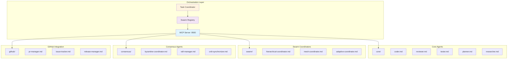
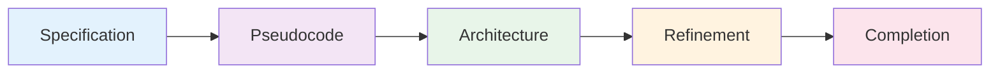

# Agent System Reference

[� Knowledge Base](../index.md) > [Reference](../index.md) > Agents

The VisionFlow agent system implements a sophisticated multi-agent architecture enabling autonomous AI workers to collaborate through various coordination patterns. Agents communicate via the Model Context Protocol (MCP) on TCP port 9500, providing distributed task execution, consensus-based decision-making, and specialised domain expertise.

## Table of Contents

1. [System Overview](#system-overview)
2. [Agent Categories](#agent-categories)
3. [Quick Navigation](#quick-navigation)
4. [Getting Started](#getting-started)
5. [Related Documentation](#related-documentation)

## System Overview

The agent system consists of autonomous workers with specialised capabilities that coordinate through:

- **MCP Protocol**: JSON-RPC 2.0 communication via TCP on port 9500
- **Swarm Patterns**: Hierarchical, mesh, and adaptive coordination topologies
- **Consensus Mechanisms**: Byzantine fault tolerance, Raft, and CRDT synchronisation
- **Task Distribution**: Capability-based matching and load balancing
- **Shared Memory**: Vector-based collaborative knowledge store

### Architecture Diagram



## Agent Categories

### Core Agents

Essential agents providing fundamental development capabilities.

**[Core Agents Documentation ’](./core/index.md)**

| Agent | Purpose | Capabilities |
|-------|---------|-------------|
| [Coder](./core/coder.md) | Code generation and implementation | Python, TypeScript, Rust, refactoring, testing |
| [Reviewer](./core/reviewer.md) | Code review and quality assurance | Security scanning, best practices, performance analysis |
| [Tester](./core/tester.md) | Test creation and validation | Unit, integration, E2E tests, coverage analysis |
| [Planner](./core/planner.md) | Task planning and coordination | Workflow management, task decomposition, scheduling |
| [Researcher](./core/researcher.md) | Information gathering and analysis | Web search, documentation analysis, knowledge synthesis |

### Swarm Coordination

Agents implementing multi-agent coordination patterns.

**[Swarm Coordination Documentation ’](./swarm/index.md)**

| Pattern | Topology | Best For |
|---------|----------|----------|
| [Hierarchical](./swarm/hierarchical-coordinator.md) | Tree-structured command hierarchy | Large projects, mission-critical systems |
| [Mesh](./swarm/mesh-coordinator.md) | Peer-to-peer full connectivity | Fault-tolerant distributed systems |
| [Adaptive](./swarm/adaptive-coordinator.md) | Dynamic topology adjustment | Variable workloads, self-optimising systems |

**Characteristics:**
- **Hierarchical**: Centralised control, clear reporting, efficient resource allocation
- **Mesh**: Democratic consensus, no single point of failure, emergent collaboration
- **Adaptive**: Performance-based scaling, task-specific optimisation, continuous learning

### Consensus Mechanisms

Distributed coordination and decision-making agents.

**[Consensus Agents Documentation ’](./consensus/index.md)**

| Mechanism | Algorithm | Fault Tolerance |
|-----------|-----------|-----------------|
| [Byzantine Coordinator](./consensus/byzantine-coordinator.md) | Byzantine fault tolerance | f failures in 3f+1 nodes |
| [Raft Manager](./consensus/raft-manager.md) | Raft consensus | Leader-based strong consistency |
| [CRDT Synchroniser](./consensus/crdt-synchronizer.md) | Conflict-free replicated data types | Eventual consistency without coordination |
| [Gossip Coordinator](./consensus/gossip-coordinator.md) | Epidemic information propagation | Scalable distributed updates |
| [Quorum Manager](./consensus/quorum-manager.md) | Majority-based voting | High availability with consistency |

**Supporting Agents:**
- [Performance Benchmarker](./consensus/performance-benchmarker.md) - Consensus algorithm performance testing
- [Security Manager](./consensus/security-manager.md) - Cryptographic security for distributed consensus

### GitHub Integration

Agents for GitHub workflow automation and repository management.

**[GitHub Integration Documentation ’](./github/index.md)**

**Core Capabilities:**
- [PR Manager](./github/pr-manager.md) - Pull request lifecycle management
- [Issue Tracker](./github/issue-tracker.md) - Issue management and automation
- [Release Manager](./github/release-manager.md) - Release coordination and deployment
- [Code Review Swarm](./github/code-review-swarm.md) - Automated collaborative code review
- [Repo Architect](./github/repo-architect.md) - Repository structure analysis and optimisation

**Multi-Repository:**
- [Multi-Repo Swarm](./github/multi-repo-swarm.md) - Coordinated cross-repository operations
- [Sync Coordinator](./github/sync-coordinator.md) - Cross-repository synchronisation
- [Project Board Sync](./github/project-board-sync.md) - GitHub Projects integration

**Automation:**
- [Workflow Automation](./github/workflow-automation.md) - GitHub Actions integration
- [Release Swarm](./github/release-swarm.md) - Coordinated multi-repository releases
- [GitHub Modes](./github/github-modes.md) - Operational modes for GitHub integration

### Optimisation Agents

Performance monitoring, load balancing, and system optimisation.

**[Optimisation Agents Documentation ’](./optimization/index.md)**

| Agent | Focus Area | Metrics |
|-------|-----------|---------|
| [Performance Monitor](./optimization/performance-monitor.md) | Real-time monitoring | Throughput, latency, resource utilisation |
| [Load Balancer](./optimization/load-balancer.md) | Traffic distribution | Workload distribution, capacity planning |
| [Topology Optimiser](./optimization/topology-optimizer.md) | Network topology | Communication efficiency, fault tolerance |
| [Resource Allocator](./optimization/resource-allocator.md) | Resource management | CPU, memory, GPU allocation |
| [Benchmark Suite](./optimization/benchmark-suite.md) | Performance testing | Comprehensive benchmarking, regression detection |

### SPARC Methodology

Systematic development methodology agents (Specification, Pseudocode, Architecture, Refinement, Completion).

**[SPARC Methodology Documentation ’](./sparc/index.md)**

**Development Phases:**
1. [Specification](./sparc/specification.md) - Requirements analysis and documentation
2. [Pseudocode](./sparc/pseudocode.md) - Algorithm design and logical flow
3. [Architecture](./sparc/architecture.md) - System design and structural planning
4. [Refinement](./sparc/refinement.md) - Implementation improvement and optimisation

**Workflow:**


### Agent Templates

Reusable templates for creating custom agents.

**[Agent Templates Documentation ’](./templates/index.md)**

**Core Templates:**
- [Automation Smart Agent](./templates/automation-smart-agent.md) - Intelligent automation patterns
- [Coordinator Swarm Init](./templates/coordinator-swarm-init.md) - Swarm initialisation
- [Memory Coordinator](./templates/memory-coordinator.md) - Shared memory management
- [Orchestrator Task](./templates/orchestrator-task.md) - Task orchestration patterns

**Specialised Templates:**
- [GitHub PR Manager](./templates/github-pr-manager.md) - Pull request management template
- [SPARC Coordinator](./templates/sparc-coordinator.md) - SPARC methodology coordination
- [Implementer SPARC Coder](./templates/implementer-sparc-coder.md) - SPARC implementation agent
- [Performance Analyser](./templates/performance-analyser.md) - Performance analysis template
- [Migration Plan](./templates/migration-plan.md) - System migration planning

## Quick Navigation

### By Use Case

**Software Development:**
- Planning: [Planner](./core/planner.md)
- Research: [Researcher](./core/researcher.md)
- Implementation: [Coder](./core/coder.md)
- Review: [Reviewer](./core/reviewer.md)
- Testing: [Tester](./core/tester.md)

**GitHub Workflows:**
- Pull Requests: [PR Manager](./github/pr-manager.md)
- Issues: [Issue Tracker](./github/issue-tracker.md)
- Releases: [Release Manager](./github/release-manager.md)
- Code Review: [Code Review Swarm](./github/code-review-swarm.md)

**System Optimisation:**
- Monitoring: [Performance Monitor](./optimization/performance-monitor.md)
- Load Balancing: [Load Balancer](./optimization/load-balancer.md)
- Benchmarking: [Benchmark Suite](./optimization/benchmark-suite.md)

**Distributed Coordination:**
- Byzantine Tolerance: [Byzantine Coordinator](./consensus/byzantine-coordinator.md)
- Strong Consistency: [Raft Manager](./consensus/raft-manager.md)
- Eventual Consistency: [CRDT Synchroniser](./consensus/crdt-synchronizer.md)

### By Coordination Pattern

**Centralised (Hierarchical):**
- [Hierarchical Coordinator](./swarm/hierarchical-coordinator.md)
- [SPARC Methodology](./sparc/index.md)

**Decentralised (Mesh):**
- [Mesh Coordinator](./swarm/mesh-coordinator.md)
- [Gossip Coordinator](./consensus/gossip-coordinator.md)

**Hybrid (Adaptive):**
- [Adaptive Coordinator](./swarm/adaptive-coordinator.md)
- [Performance Monitor](./optimization/performance-monitor.md)

## Getting Started

### Basic Agent Operations

```bash
# Initialise hierarchical swarm
mcp__claude-flow__swarm_init hierarchical --maxAgents=10

# Spawn coder agent
mcp__claude-flow__agent_spawn coder \
  --capabilities="python,typescript,rust"

# Orchestrate task
mcp__claude-flow__task_orchestrate \
  "Implement authentication service" \
  --strategy=sequential \
  --priority=high
```

### MCP Protocol Connection

```python
from visionflow import MCPClient

async def main():
    # Connect to MCP server on multi-agent-container:9500
    client = MCPClient(host="multi-agent-container", port=9500)
    await client.connect()

    # Spawn agent
    agent_id = await client.spawn_agent(
        agent_type="coder",
        swarm_id="swarm_123",
        config={"capabilities": ["python", "rust"]}
    )

    # Orchestrate task
    result = await client.orchestrate_task(
        swarm_id="swarm_123",
        task={
            "description": "Build REST API",
            "priority": "high"
        }
    )
```

### Common Workflows

#### 1. Software Development Pipeline

```yaml
workflow:
  - stage: research
    agent: researcher
    output: requirements.md

  - stage: architecture
    agent: planner
    input: requirements.md
    output: architecture.md

  - stage: implementation
    agent: coder
    input: architecture.md
    output: source_code/

  - stage: review
    agent: reviewer
    input: source_code/
    output: review_report.md

  - stage: testing
    agent: tester
    input: source_code/
    output: test_results.json
```

#### 2. Distributed Consensus

```typescript
// Byzantine fault-tolerant decision making
const consensus = new ByzantineConsensus({
  quorumSize: 7,  // 2f + 1 for f=3 failures
  agents: [
    'agent_1', 'agent_2', 'agent_3',
    'agent_4', 'agent_5', 'agent_6', 'agent_7'
  ]
});

const decision = await consensus.proposeDecision({
  type: 'deployment_approval',
  proposal: 'Deploy v2.0.0 to production',
  requiredVotes: 5
});
```

#### 3. GitHub Release Management

```bash
# Initialise release swarm
mcp__claude-flow__swarm_init hierarchical --maxAgents=5

# Spawn release manager
mcp__claude-flow__agent_spawn release-manager \
  --config='{"repos":["frontend","backend","api"]}'

# Coordinate release
mcp__claude-flow__task_orchestrate \
  "Release v2.0.0 across all repositories" \
  --strategy=parallel \
  --priority=high
```

## Related Documentation

### Conceptual Documentation
- [Agentic Workers Concept](../../concepts/agentic-workers.md) - Architectural overview and design principles
- [System Architecture](../../concepts/system-architecture.md) - Overall system design
- [GPU Compute](../../concepts/03-gpu-compute.md) - GPU-accelerated graph processing

### Practical Guides
- [Orchestrating Agents Guide](../../guides/orchestrating-agents.md) - Comprehensive orchestration tutorial
- [Using the GUI Sandbox](../../guides/03-using-the-gui-sandbox.md) - GUI integration with agents
- [Extending the System](../../guides/05-extending-the-system.md) - Creating custom agents

### API Reference
- [MCP Protocol Specification](../api/mcp-protocol.md) - JSON-RPC protocol details
- [Multi-Agent Docker Setup](../../../multi-agent-docker/README.md) - Container configuration

### Additional Resources
- [Agent Conventions](./conventions.md) - Naming conventions and standards
- [Base Template Generator](./base-template-generator.md) - Template creation utility
- [Migration Summary](./migration-summary.md) - Agent system migration guide

## File Naming Standards

All agent documentation follows kebab-case naming:

-  `hierarchical-coordinator.md`
-  `code-review-swarm.md`
-  `performance-benchmarker.md`
-  `HierarchicalCoordinator.md`
-  `code_review_swarm.md`

See [Agent Conventions](./conventions.md) for complete standards.

---

*Last updated: 2025-10-03*
