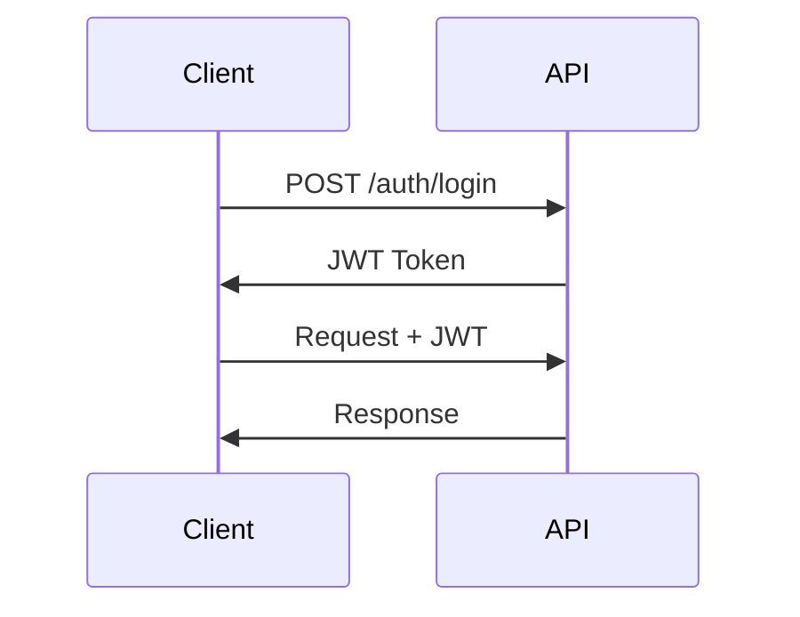

## ⚠️ DEPRECATION WARNING

**This document describes JWT authentication which is NOT used by VisionFlow.**

**Current Authentication**: VisionFlow uses the **Nostr protocol** (NIP-01, NIP-07) for decentralized authentication.

**For Current Documentation**, see:
- **Primary**: `/docs/guides/features/nostr-auth.md` - Nostr authentication implementation
- **Architecture**: `/docs/ARCHITECTURE_OVERVIEW.md` - Authentication section

---

## Historical Content Below (JWT - NOT IMPLEMENTED)

# Authentication

## Overview

VisionFlow API uses JWT (JSON Web Tokens) for authentication.

## Authentication Flow



## Login

**Endpoint**: `POST /api/auth/login`

**Request**:
```json
{
  "email": "user@example.com",
  "password": "password123"
}
```

**Response**:
```json
{
  "success": true,
  "data": {
    "token": "eyJhbGciOiJIUzI1NiIsInR5cCI6IkpXVCJ9...",
    "user": {
      "id": "uuid",
      "email": "user@example.com",
      "role": "user"
    }
  }
}
```

## Using Tokens

Include JWT in Authorization header:

```bash
curl -H "Authorization: Bearer YOUR-JWT-TOKEN" \
  http://localhost:9090/api/projects
```

## API Keys

Generate API keys for programmatic access:

```bash
curl -X POST http://localhost:9090/api/auth/api-keys \
  -H "Authorization: Bearer YOUR-JWT-TOKEN"
```

Use API keys:
```bash
curl -H "X-API-Key: YOUR-API-KEY" \
  http://localhost:9090/api/projects
```

## Token Expiration

- JWT tokens expire in 24 hours
- Refresh tokens expire in 30 days
- Use `/auth/refresh` to get new tokens

## Security Best Practices

1. Store tokens securely
2. Use HTTPS in production
3. Rotate API keys regularly
4. Never commit tokens to git
