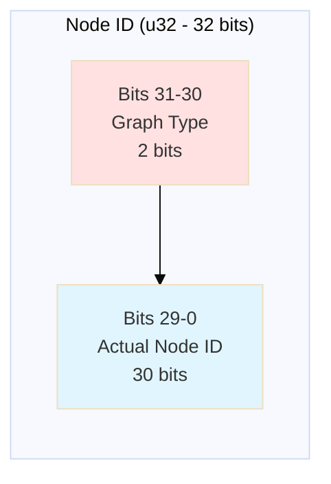
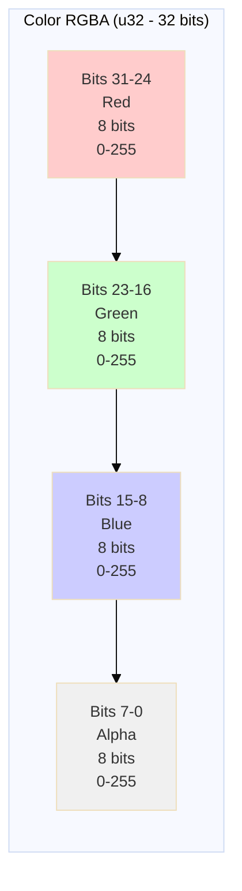

# Binary Protocol Specification V2

**Version:** 2.0
**Last Updated:** 2025-10-25
**Status:** Production

---

## Protocol Overview

VisionFlow uses a highly optimized **36-byte binary protocol** for real-time node position updates:

- **80% bandwidth reduction** vs JSON
- **60 FPS sustained** at 100k nodes
- **<10ms latency** for position updates
- **Prevents graph conflation** via node ID encoding

---

## Message Structure

### Node Update Message (0x01)

**Binary Wire Format (36 bytes total):**

| Offset | Size | Type | Field | Description |
|--------|------|------|-------|-------------|
| 0 | 1 | u8 | msg_type | 0x01 = NodeUpdate |
| 1 | 4 | u32 | node_id | Node identifier with graph bits |
| 5 | 4 | f32 | position_x | X coordinate (IEEE 754) |
| 9 | 4 | f32 | position_y | Y coordinate (IEEE 754) |
| 13 | 4 | f32 | position_z | Z coordinate (IEEE 754) |
| 17 | 4 | f32 | velocity_x | X velocity (IEEE 754) |
| 21 | 4 | f32 | velocity_y | Y velocity (IEEE 754) |
| 25 | 4 | f32 | velocity_z | Z velocity (IEEE 754) |
| 29 | 4 | u32 | color_rgba | Packed RGBA (8 bits each) |
| 33 | 1 | u8 | flags[0] | State and type flags |
| 34 | 1 | u8 | flags[1] | Node type (0-255) |
| 35 | 1 | u8 | flags[2] | Reserved |

**Total:** 36 bytes per message

---

## Node ID Encoding

**Bit Layout (32-bit u32):**



**Graph Type Flags (Bits 31-30):**
| Value | Binary | Graph Type | Description |
|-------|--------|------------|-------------|
| 0 | 00 | Knowledge | Local markdown files |
| 1 | 01 | Ontology | GitHub markdown files |
| 2 | 10 | Agent | Agent visualization nodes |
| 3 | 11 | Reserved | Future use |

### Example

```rust
let node_id: u32 = 0b01_000000000000000000000000011000000111001;

// Extract graph type (bits 31-30)
let graph_type = (node_id >> 30) & 0b11;  // Result: 1 (Ontology)

// Extract actual ID (bits 29-0)
let actual_id = node_id & 0x3FFFFFFF;     // Result: 12345
```

---

## Color Format (RGBA)

**Bit Layout (32-bit u32):**



| Bits | Channel | Range | Description |
|------|---------|-------|-------------|
| 31-24 | Red | 0-255 | Red color component |
| 23-16 | Green | 0-255 | Green color component |
| 15-8 | Blue | 0-255 | Blue color component |
| 7-0 | Alpha | 0-255 | Transparency (255=opaque) |

### Packing

```rust
let color: u32 = ((red as u32) << 24)
              | ((green as u32) << 16)
              | ((blue as u32) << 8)
              | (alpha as u32);
```

---

## Flags Structure

### Byte 33 (flags[0]) - State Flags

```
Bit 0: is_pinned     (manually positioned)
Bit 1: is_selected   (user has selected)
Bit 2: is_highlighted (search result or emphasis)
Bit 3: is_visible    (rendered or culled)
Bits 4-7: Reserved
```

### Byte 34 (flags[1]) - Node Type

```
Bits 0-7: Node type classification (0-255)
```

### Byte 35 (flags[2]) - Reserved

Reserved for future protocol extensions.

---

## TypeScript Implementation

### Parsing Function

```typescript
function parseBinaryNodeUpdate(buffer: ArrayBuffer): NodeUpdate {
  const view = new DataView(buffer);
  const msgType = view.getUint8(0);

  if (msgType !== 0x01) {
    throw new Error('Not a node update message');
  }

  const nodeId = view.getUint32(1, true);
  const graphType = (nodeId >> 30) & 0b11;
  const actualId = nodeId & 0x3FFFFFFF;

  return {
    graphType: ['knowledge', 'ontology', 'agent', 'reserved'][graphType],
    nodeId: actualId,
    position: {
      x: view.getFloat32(5, true),
      y: view.getFloat32(9, true),
      z: view.getFloat32(13, true),
    },
    velocity: {
      x: view.getFloat32(17, true),
      y: view.getFloat32(21, true),
      z: view.getFloat32(25, true),
    },
    color: {
      r: (view.getUint32(29, true) >> 24) & 0xFF,
      g: (view.getUint32(29, true) >> 16) & 0xFF,
      b: (view.getUint32(29, true) >> 8) & 0xFF,
      a: view.getUint32(29, true) & 0xFF,
    },
    isPinned: (view.getUint8(33) & 0b1) !== 0,
    isSelected: (view.getUint8(33) & 0b10) !== 0,
    isHighlighted: (view.getUint8(33) & 0b100) !== 0,
    isVisible: (view.getUint8(33) & 0b1000) !== 0,
    nodeType: view.getUint8(34),
  };
}
```

---

## Protocol Benefits

### Bandwidth Efficiency

```
JSON approach: ~200 bytes per node
Binary approach: 36 bytes per node
Reduction: 82% bandwidth savings

At 100k nodes, 60 FPS:
  JSON: 20 MB/s
  Binary: 3.6 MB/s
```

### Scalability

```
100k nodes at 60 FPS: 3.6 MB/s (17% of 100 Mbps)
Binary allows 5.5× more concurrent clients vs JSON
```

---

## Related Documentation

- **[WebSocket API](./websocket-api.md)** - Protocol usage
- **[REST API](./rest-api.md)** - Alternative HTTP interface
- **[API Overview](./README.md)** - API introduction

---

**Document Maintained By:** VisionFlow Protocol Team
**Last Review:** 2025-10-25
**Stability:** Stable - No breaking changes planned
