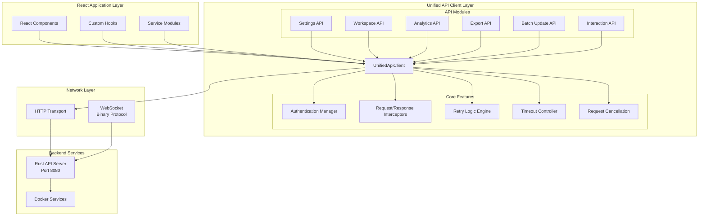
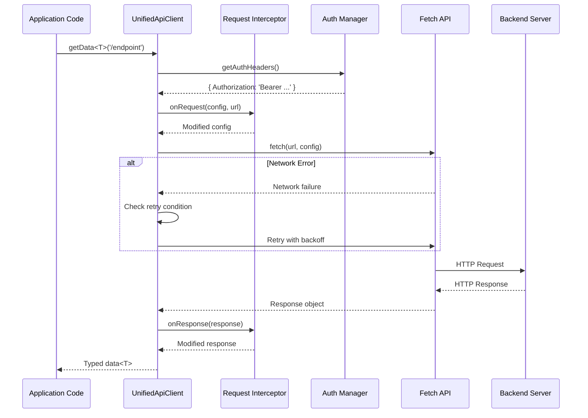

# Client API Reference

*[← Back to API Reference](../README.md)*

**Version**: 2.0.0
**Last Updated**: 2025-10-03
**Status**: ✅ Production

Complete reference documentation for VisionFlow's unified client API layer, providing type-safe, interceptor-enabled HTTP communication with automatic retry logic and authentication management.

## 📋 Table of Contents

1. [Overview](#overview)
2. [Architecture](#architecture)
3. [Getting Started](#getting-started)
4. [Core API Methods](#core-api-methods)
5. [Authentication](#authentication)
6. [Request Interceptors](#request-interceptors)
7. [Retry Logic](#retry-logic)
8. [Error Handling](#error-handling)
9. [TypeScript Integration](#typescript-integration)
10. [Migration Guide](#migration-guide)
11. [API Modules](#api-modules)
12. [Best Practices](#best-practices)

---

## Overview

The Unified API Client (`UnifiedApiClient`) is VisionFlow's centralised HTTP communication layer, replacing the previous fragmented patterns (`apiService.ts`, `client.ts`, direct `fetch` calls) with a single, consistent interface.

### Key Features

- **Centralised HTTP Methods**: All HTTP methods (GET, POST, PUT, DELETE, PATCH, HEAD, OPTIONS) with consistent interfaces
- **Authentication Management**: Built-in token management with automatic header injection
- **Request/Response Interceptors**: Configurable middleware for request/response processing
- **Retry Logic**: Automatic retry with exponential backoff for failed requests
- **Timeout Handling**: Configurable request timeouts with `AbortController` support
- **Type Safety**: Full TypeScript generics support for request/response types
- **Error Handling**: Comprehensive error handling with custom `ApiError` types
- **Request Cancellation**: Built-in support for cancelling pending requests
- **Debug Integration**: Works with existing debug logging infrastructure

### Benefits Over Previous Patterns

| Feature | Old (`apiService.ts`) | Old (`client.ts`) | New (Unified) |
|---------|----------------------|-------------------|---------------|
| Consistent Interface | ❌ | ❌ | ✅ |
| Automatic Retry | ❌ | ❌ | ✅ |
| Request Cancellation | ❌ | Limited | ✅ Full |
| Interceptors | ❌ | ❌ | ✅ |
| Type Safety | ⚠️ Partial | ⚠️ Partial | ✅ Full |
| Debug Integration | ⚠️ Manual | ⚠️ Manual | ✅ Automatic |
| Auth Management | ⚠️ Manual | ⚠️ Manual | ✅ Built-in |

---

## Architecture

### System Architecture



### Request Processing Flow



---

## Getting Started

### Installation

The Unified API Client is already included in VisionFlow's client codebase:

```typescript
import { unifiedApiClient } from './services/api/UnifiedApiClient';
```

### Basic Usage

#### Simple GET Request

```typescript
interface User {
  id: string;
  name: string;
  email: string;
}

// Fetch data with automatic type inference
const user = await unifiedApiClient.getData<User>('/api/users/123');
console.log(user.name); // Type-safe property access
```

#### Simple POST Request

```typescript
interface CreateUserPayload {
  name: string;
  email: string;
}

interface CreateUserResponse {
  id: string;
  createdAt: string;
}

const newUser = await unifiedApiClient.postData<CreateUserResponse>(
  '/api/users',
  {
    name: 'Alice',
    email: 'alice@example.com'
  }
);

console.log(`Created user ${newUser.id}`);
```

#### Full Response Access

```typescript
// Access status codes and headers
const response = await unifiedApiClient.get<User>('/api/users/123');

console.log(response.status);      // 200
console.log(response.statusText);  // "OK"
console.log(response.headers);     // Headers object
console.log(response.data);        // User object
```

---

## Core API Methods

### HTTP Methods

#### GET Request

```typescript
/**
 * Perform GET request and return full response
 */
async get<T = any>(
  url: string,
  options?: RequestOptions
): Promise<ApiResponse<T>>

/**
 * Perform GET request and return data only
 */
async getData<T = any>(
  url: string,
  options?: RequestOptions
): Promise<T>
```

**Example**:
```typescript
// Full response
const response = await unifiedApiClient.get<GraphData>('/api/graph');
console.log(response.status, response.data.nodes.length);

// Data only (shorthand)
const graphData = await unifiedApiClient.getData<GraphData>('/api/graph');
console.log(graphData.nodes.length);
```

#### POST Request

```typescript
/**
 * Perform POST request and return full response
 */
async post<T = any>(
  url: string,
  data?: any,
  options?: RequestOptions
): Promise<ApiResponse<T>>

/**
 * Perform POST request and return data only
 */
async postData<T = any>(
  url: string,
  data?: any,
  options?: RequestOptions
): Promise<T>
```

**Example**:
```typescript
interface NodeCreatePayload {
  label: string;
  metadata: Record<string, any>;
}

const newNode = await unifiedApiClient.postData<Node>(
  '/api/nodes',
  {
    label: 'Research Paper',
    metadata: { year: 2025 }
  }
);
```

#### PUT Request

```typescript
async put<T = any>(
  url: string,
  data?: any,
  options?: RequestOptions
): Promise<ApiResponse<T>>

async putData<T = any>(
  url: string,
  data?: any,
  options?: RequestOptions
): Promise<T>
```

#### DELETE Request

```typescript
async delete<T = any>(
  url: string,
  options?: RequestOptions
): Promise<ApiResponse<T>>

async deleteData<T = any>(
  url: string,
  options?: RequestOptions
): Promise<T>
```

#### PATCH Request

```typescript
async patch<T = any>(
  url: string,
  data?: any,
  options?: RequestOptions
): Promise<ApiResponse<T>>

async patchData<T = any>(
  url: string,
  data?: any,
  options?: RequestOptions
): Promise<T>
```

**Example**:
```typescript
// Partial update
const updatedNode = await unifiedApiClient.patchData<Node>(
  '/api/nodes/123',
  { metadata: { status: 'reviewed' } }
);
```

#### HEAD and OPTIONS

```typescript
async head(url: string, options?: RequestOptions): Promise<Response>
async options(url: string, options?: RequestOptions): Promise<Response>
```

---

## Authentication

### Setting Authentication Token

```typescript
/**
 * Set JWT authentication token
 * Automatically added to all subsequent requests as 'Authorization: Bearer <token>'
 */
unifiedApiClient.setAuthToken('eyJhbGciOiJIUzI1NiIsInR5cCI6IkpXVCJ9...');
```

### Removing Authentication

```typescript
/**
 * Remove authentication token from all requests
 */
unifiedApiClient.removeAuthToken();
```

### Per-Request Authentication Override

```typescript
// Skip authentication for public endpoint
const publicData = await unifiedApiClient.getData('/api/public/status', {
  skipAuth: true
});

// Custom headers override auth
const response = await unifiedApiClient.get('/api/admin/users', {
  headers: {
    'X-Admin-Token': 'admin-secret-token'
  }
});
```

### Authentication Flow Example

```typescript
import { unifiedApiClient } from './services/api/UnifiedApiClient';

// User login
async function login(email: string, password: string) {
  const authResponse = await unifiedApiClient.postData<{ token: string }>(
    '/api/auth/login',
    { email, password },
    { skipAuth: true } // Login doesn't require existing auth
  );

  // Set token for all future requests
  unifiedApiClient.setAuthToken(authResponse.token);

  // Store in localStorage for persistence
  localStorage.setItem('auth_token', authResponse.token);
}

// Application initialisation
function initializeApp() {
  const token = localStorage.getItem('auth_token');
  if (token) {
    unifiedApiClient.setAuthToken(token);
  }
}

// User logout
function logout() {
  unifiedApiClient.removeAuthToken();
  localStorage.removeItem('auth_token');
}
```

---

## Request Interceptors

### Setting Interceptors

```typescript
interface Interceptors {
  onRequest?: (config: RequestInit, url: string) => RequestInit | Promise<RequestInit>;
  onResponse?: (response: Response) => Response | Promise<Response>;
  onError?: (error: ApiError) => never;
}

unifiedApiClient.setInterceptors({
  onRequest: (config, url) => {
    console.log(`[API] Request: ${config.method} ${url}`);

    // Add custom headers
    config.headers = {
      ...config.headers,
      'X-Request-ID': crypto.randomUUID(),
      'X-Client-Version': '2.0.0'
    };

    return config;
  },

  onResponse: (response) => {
    console.log(`[API] Response: ${response.status} ${response.url}`);

    // Log slow requests
    const requestTime = performance.now(); // Track from onRequest
    if (requestTime > 1000) {
      console.warn(`[API] Slow request detected: ${requestTime}ms`);
    }

    return response;
  },

  onError: (error) => {
    console.error(`[API] Error: ${error.message}`, error);

    // Send to error tracking service
    if (window.errorTracker) {
      window.errorTracker.logError(error);
    }

    throw error;
  }
});
```

### Common Interceptor Patterns

#### Request Timing

```typescript
const requestTimings = new Map<string, number>();

unifiedApiClient.setInterceptors({
  onRequest: (config, url) => {
    const requestId = crypto.randomUUID();
    config.headers = {
      ...config.headers,
      'X-Request-ID': requestId
    };
    requestTimings.set(requestId, performance.now());
    return config;
  },

  onResponse: (response) => {
    const requestId = response.headers.get('X-Request-ID');
    if (requestId && requestTimings.has(requestId)) {
      const duration = performance.now() - requestTimings.get(requestId)!;
      console.log(`[Timing] ${response.url}: ${duration.toFixed(2)}ms`);
      requestTimings.delete(requestId);
    }
    return response;
  }
});
```

#### Global Error Handler

```typescript
unifiedApiClient.setInterceptors({
  onError: (error) => {
    // Show toast notification
    if (error.status === 401) {
      showToast('Session expired. Please log in again.');
      navigateToLogin();
    } else if (error.status >= 500) {
      showToast('Server error. Please try again later.');
    }

    throw error; // Re-throw for caller handling
  }
});
```

---

## Retry Logic

### Configuring Retry Behaviour

```typescript
interface RetryConfig {
  maxRetries: number;              // Maximum retry attempts (default: 3)
  retryDelay: number;              // Base delay in ms (default: 1000)
  retryCondition?: (error: ApiError, attempt: number) => boolean;
}

unifiedApiClient.setRetryConfig({
  maxRetries: 5,
  retryDelay: 2000,
  retryCondition: (error, attempt) => {
    // Retry on server errors (5xx)
    if (error.status >= 500 && error.status < 600) {
      return true;
    }

    // Retry on network errors
    if (error.message.includes('network')) {
      return true;
    }

    // Don't retry after 3 attempts for 429 (rate limit)
    if (error.status === 429 && attempt < 3) {
      return true;
    }

    return false;
  }
});
```

### Exponential Backoff

The retry system uses exponential backoff automatically:

```
Attempt 1: Base delay (e.g., 1000ms)
Attempt 2: Base delay × 2 (2000ms)
Attempt 3: Base delay × 4 (4000ms)
Attempt 4: Base delay × 8 (8000ms)
```

**Example with custom retry logic**:

```typescript
// Aggressive retry for critical operations
const criticalData = await unifiedApiClient.getData('/api/critical/data', {
  retryConfig: {
    maxRetries: 10,
    retryDelay: 500,
    retryCondition: (error, attempt) => {
      // Always retry network errors
      return error.status === 0 || error.status >= 500;
    }
  }
});
```

---

## Error Handling

### ApiError Structure

```typescript
class ApiError extends Error {
  status: number;           // HTTP status code (0 for network errors)
  statusText: string;       // HTTP status text
  data?: any;              // Response body (if available)
  url: string;             // Request URL
  method: string;          // HTTP method
}
```

### Error Handling Patterns

#### Basic Try-Catch

```typescript
try {
  const data = await unifiedApiClient.getData<User>('/api/users/123');
  console.log(data);
} catch (error) {
  if (error instanceof ApiError) {
    console.error(`API Error: ${error.status} - ${error.message}`);

    // Handle specific status codes
    switch (error.status) {
      case 404:
        console.log('User not found');
        break;
      case 403:
        console.log('Access denied');
        break;
      case 500:
        console.log('Server error');
        break;
      default:
        console.log('Unknown error');
    }
  } else {
    console.error('Unexpected error:', error);
  }
}
```

#### Error Boundary Integration

```typescript
// React Error Boundary-friendly wrapper
async function fetchUserSafely(userId: string): Promise<User | null> {
  try {
    return await unifiedApiClient.getData<User>(`/api/users/${userId}`);
  } catch (error) {
    if (error instanceof ApiError && error.status === 404) {
      return null; // User not found is acceptable
    }
    throw error; // Re-throw for Error Boundary
  }
}
```

#### Validation Errors

```typescript
interface ValidationError {
  field: string;
  message: string;
}

interface ValidationResponse {
  errors: ValidationError[];
}

try {
  await unifiedApiClient.postData('/api/users', userData);
} catch (error) {
  if (error instanceof ApiError && error.status === 422) {
    const validationErrors = error.data as ValidationResponse;
    validationErrors.errors.forEach(err => {
      console.error(`Field '${err.field}': ${err.message}`);
    });
  }
}
```

---

## TypeScript Integration

### Type-Safe Requests

```typescript
// Define request/response types
interface CreateNodeRequest {
  label: string;
  metadata?: Record<string, any>;
  parentId?: string;
}

interface NodeResponse {
  id: string;
  label: string;
  createdAt: string;
  metadata: Record<string, any>;
}

// Type-safe API call
const node = await unifiedApiClient.postData<NodeResponse, CreateNodeRequest>(
  '/api/nodes',
  {
    label: 'New Node',
    metadata: { category: 'research' }
  }
);

// TypeScript knows the shape of 'node'
console.log(node.id);        // ✅ string
console.log(node.createdAt); // ✅ string
console.log(node.invalid);   // ❌ TypeScript error
```

### Generic Wrappers

```typescript
// Create type-safe API wrapper
class UserApi {
  async getUser(userId: string): Promise<User> {
    return unifiedApiClient.getData<User>(`/api/users/${userId}`);
  }

  async createUser(data: CreateUserRequest): Promise<User> {
    return unifiedApiClient.postData<User>('/api/users', data);
  }

  async updateUser(userId: string, data: Partial<User>): Promise<User> {
    return unifiedApiClient.patchData<User>(`/api/users/${userId}`, data);
  }

  async deleteUser(userId: string): Promise<void> {
    await unifiedApiClient.deleteData(`/api/users/${userId}`);
  }
}

export const userApi = new UserApi();
```

---

## Migration Guide

### From `apiService.ts`

```typescript
// Old pattern
import { apiService } from './services/apiService';

const data = await apiService.get<T>('/endpoint');
await apiService.post('/endpoint', payload);

// New pattern
import { unifiedApiClient } from './services/api/UnifiedApiClient';

const data = await unifiedApiClient.getData<T>('/endpoint');
await unifiedApiClient.postData('/endpoint', payload);
```

### From `client.ts`

```typescript
// Old pattern (already similar interface)
import { apiClient } from './services/client';

const response = await apiClient.get('/endpoint');
const data = response.data;

// New pattern (same interface, better features)
import { unifiedApiClient } from './services/api/UnifiedApiClient';

const response = await unifiedApiClient.get('/endpoint');
const data = response.data;
```

### From Direct `fetch`

```typescript
// Old pattern
const response = await fetch('/api/endpoint', {
  method: 'POST',
  headers: {
    'Content-Type': 'application/json',
    'Authorization': `Bearer ${token}`
  },
  body: JSON.stringify(data)
});

if (!response.ok) {
  throw new Error(`HTTP error ${response.status}`);
}

const result = await response.json();

// New pattern
unifiedApiClient.setAuthToken(token);
const result = await unifiedApiClient.postData('/endpoint', data);
```

---

## API Modules

VisionFlow includes specialised API modules built on top of the Unified API Client:

### Settings API

```typescript
import { settingsApi } from './api/settingsApi';

// Debounced settings update
await settingsApi.updateSetting('theme', 'dark');

// Batch settings update
await settingsApi.updateSettings({
  theme: 'dark',
  language: 'en-GB',
  notifications: true
});

// Get all settings
const settings = await settingsApi.getSettings();
```

### Workspace API

```typescript
import { workspaceApi } from './api/workspaceApi';

// CRUD operations
const workspace = await workspaceApi.createWorkspace({
  name: 'Research Project',
  description: 'Multi-agent research workspace'
});

await workspaceApi.updateWorkspace(workspace.id, { name: 'Updated Name' });
const allWorkspaces = await workspaceApi.listWorkspaces();
await workspaceApi.deleteWorkspace(workspace.id);
```

### Batch Update API

```typescript
import { batchUpdateApi } from './api/batchUpdateApi';

// Batch node updates
await batchUpdateApi.batchUpdateNodes([
  { id: 'node1', metadata: { status: 'reviewed' } },
  { id: 'node2', metadata: { status: 'reviewed' } },
  { id: 'node3', metadata: { status: 'reviewed' } }
]);

// Batch edge creation
await batchUpdateApi.batchCreateEdges([
  { source: 'node1', target: 'node2', label: 'relates_to' },
  { source: 'node2', target: 'node3', label: 'depends_on' }
]);
```

### Analytics API

```typescript
import { analyticsApi } from './api/analyticsApi';

// GPU-accelerated analytics
const clusteringResult = await analyticsApi.runClustering({
  algorithm: 'louvain',
  resolution: 1.0
});

const shortestPath = await analyticsApi.findShortestPath('node1', 'node2');

const centrality = await analyticsApi.calculateCentrality('betweenness');
```

### Export API

```typescript
import { exportApi } from './api/exportApi';

// Export graph in various formats
const graphJson = await exportApi.exportGraph('json');
const graphGexf = await exportApi.exportGraph('gexf');
const graphCytoscape = await exportApi.exportGraph('cytoscape');

// Export with filters
const filteredGraph = await exportApi.exportGraph('json', {
  nodeFilter: (node) => node.metadata.category === 'research',
  edgeFilter: (edge) => edge.weight > 0.5
});
```

---

## Best Practices

### 1. Use Type-Safe Wrappers

Create domain-specific API modules rather than calling `unifiedApiClient` directly throughout your codebase:

```typescript
// ✅ Good: Encapsulated API module
// graphApi.ts
export const graphApi = {
  getGraph: () => unifiedApiClient.getData<Graph>('/api/graph'),
  createNode: (data: NodeData) => unifiedApiClient.postData<Node>('/api/nodes', data),
  updateNode: (id: string, data: Partial<NodeData>) =>
    unifiedApiClient.patchData<Node>(`/api/nodes/${id}`, data)
};

// Usage
import { graphApi } from './api/graphApi';
const graph = await graphApi.getGraph();

// ❌ Bad: Direct client usage everywhere
import { unifiedApiClient } from './services/api/UnifiedApiClient';
const graph = await unifiedApiClient.getData('/api/graph'); // No types, scattered
```

### 2. Handle Errors Appropriately

```typescript
// ✅ Good: Specific error handling
try {
  const data = await graphApi.getGraph();
} catch (error) {
  if (error instanceof ApiError) {
    if (error.status === 404) {
      return emptyGraph; // Acceptable fallback
    }
    logger.error('Failed to fetch graph', error);
  }
  throw error; // Re-throw unexpected errors
}

// ❌ Bad: Silent failures
try {
  const data = await graphApi.getGraph();
} catch {
  return {}; // Data loss, no logging
}
```

### 3. Configure Retry for Critical Operations

```typescript
// ✅ Good: Retry configuration for critical data
const criticalData = await unifiedApiClient.getData('/api/critical/state', {
  retryConfig: {
    maxRetries: 5,
    retryDelay: 1000,
    retryCondition: (error) => error.status >= 500 || error.status === 0
  }
});

// ❌ Bad: No retry for critical operations
const criticalData = await unifiedApiClient.getData('/api/critical/state');
```

### 4. Use Interceptors for Cross-Cutting Concerns

```typescript
// ✅ Good: Centralised logging, timing, error tracking
unifiedApiClient.setInterceptors({
  onRequest: addRequestTimestamp,
  onResponse: logResponseTime,
  onError: sendToErrorTracker
});

// ❌ Bad: Manual logging in every API call
await unifiedApiClient.getData('/api/endpoint');
console.log('Request completed'); // Scattered, inconsistent
```

### 5. Cancel Pending Requests on Component Unmount

```typescript
// ✅ Good: Cleanup in React effect
useEffect(() => {
  let cancelled = false;

  async function fetchData() {
    try {
      const data = await graphApi.getGraph();
      if (!cancelled) {
        setGraphData(data);
      }
    } catch (error) {
      if (!cancelled) {
        handleError(error);
      }
    }
  }

  fetchData();

  return () => {
    cancelled = true;
    unifiedApiClient.cancelRequests(); // Cancel all pending
  };
}, []);

// ❌ Bad: No cleanup, potential memory leaks
useEffect(() => {
  graphApi.getGraph().then(setGraphData);
}, []); // Missing cleanup
```

---

## Next Steps

- See [WebSocket API Reference](../reference/api/websocket-api.md) for real-time communication
- See [Analytics API Guide](../../guides/analytics-api.md) for GPU-accelerated graph algorithms
- See [Authentication Guide](../../guides/authentication.md) for secure API access patterns

---

*[← Back to API Reference](../README.md) | [WebSocket API →](../reference/api/websocket-api.md)*
