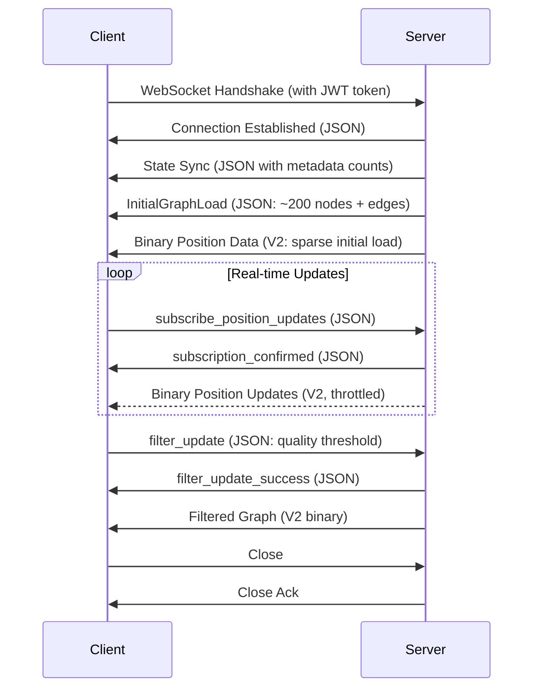

# WebSocket API Endpoints

Real-time communication endpoints for VisionFlow graph updates.

---

## Connection

### Establishing Connection

```typescript
// Binary protocol (recommended)
const ws = new WebSocket('ws://localhost:9090/ws?token=YOUR-JWT-TOKEN');
ws.binaryType = 'arraybuffer';

// Legacy JSON protocol (deprecated)
const wsJson = new WebSocket('ws://localhost:9090/ws?token=TOKEN&protocol=json');
```

### Connection Parameters

| Parameter | Type | Required | Description |
|-----------|------|----------|-------------|
| `token` | string | Yes | JWT authentication token |
| `protocol` | string | No | Protocol version: `binary-v2` (default), `json` |

### Authentication

```bash
# Obtain JWT token
curl -X POST http://localhost:9090/api/auth/login \
  -H "Content-Type: application/json" \
  -d '{"username": "user", "password": "pass"}'

# Response: {"token": "eyJhbGciOiJIUzI1NiIsInR5cCI6IkpXVCJ9..."}

# Connect with token
const ws = new WebSocket('ws://localhost:9090/ws?token=eyJhbGci...');
```

---

## JSON Message Types

### Client to Server

#### Subscribe to Position Updates

```json
{
  "type": "subscribe_position_updates",
  "data": {
    "rate": 60,
    "nodeFilter": "all",
    "protocol": "binary-v2"
  }
}
```

#### Filter Update

```json
{
  "type": "filter_update",
  "data": {
    "quality": 0.7,
    "maxNodes": 10000,
    "types": ["concept", "entity", "class"]
  }
}
```

#### Heartbeat (Keep-alive)

```json
{
  "type": "heartbeat",
  "timestamp": 1702915200000
}
```

### Server to Client

#### Subscription Confirmed

```json
{
  "type": "subscription_confirmed",
  "data": {
    "rate": 60,
    "protocol": "binary-v2",
    "nodeCount": 50000
  }
}
```

#### State Sync

```json
{
  "type": "state_sync",
  "data": {
    "nodes": 50000,
    "edges": 120000,
    "graphType": "knowledge-graph",
    "timestamp": 1702915200000
  }
}
```

---

## WebSocket Message Flow

### Connection Lifecycle



### Initial Load Strategy

**Problem**: Full graph loads (>100K nodes) overwhelm clients.

**Solution**: Sparse initial load with client-driven expansion:
1. Server sends top 200 nodes (sorted by quality score)
2. Client renders fast initial view
3. Client requests more via filter settings (`filter_update` message)
4. Server sends incremental batches matching filter criteria

---

## Client Implementation

### TypeScript WebSocket Wrapper

```typescript
class VisionFlowWebSocket {
    private ws: WebSocket;
    private protocol: 'binary' | 'json';

    constructor(url: string, token: string, protocol: 'binary' | 'json' = 'binary') {
        this.protocol = protocol;
        const protocolParam = protocol === 'json' ? '&protocol=json' : '';
        this.ws = new WebSocket(`${url}?token=${token}${protocolParam}`);

        if (protocol === 'binary') {
            this.ws.binaryType = 'arraybuffer';
        }

        this.setupHandlers();
    }

    private setupHandlers() {
        this.ws.onopen = () => console.log('Connected (protocol:', this.protocol + ')');
        this.ws.onerror = (err) => console.error('WebSocket error:', err);
        this.ws.onclose = (event) => {
            console.log('Disconnected:', event.code, event.reason);
            this.reconnect();
        };

        this.ws.onmessage = (event) => {
            if (this.protocol === 'binary') {
                this.handleBinaryMessage(event.data as ArrayBuffer);
            } else {
                this.handleJsonMessage(JSON.parse(event.data));
            }
        };
    }

    private handleBinaryMessage(buffer: ArrayBuffer) {
        const parser = new BinaryProtocolParser(buffer);
        const updates = parser.parseNodeUpdates();
        this.onNodeUpdates(updates);
    }

    private handleJsonMessage(message: any) {
        // Legacy JSON handling
    }

    private reconnect() {
        setTimeout(() => {
            console.log('Reconnecting...');
            this.ws = new WebSocket(this.ws.url);
            this.setupHandlers();
        }, 1000);
    }
}
```

### React Three Fiber Example

```typescript
import { useEffect, useRef } from 'react';
import { useThree } from '@react-three/fiber';

export function usePhysicsStream() {
    const wsRef = useRef<VisionFlowWebSocket | null>(null);
    const nodesRef = useRef<Map<number, THREE.Mesh>>(new Map());

    useEffect(() => {
        wsRef.current = new VisionFlowWebSocket(
            'ws://localhost:9090/ws',
            localStorage.getItem('jwt-token')!,
            'binary'
        );

        wsRef.current.onNodeUpdates = (updates) => {
            updates.forEach(update => {
                const mesh = nodesRef.current.get(update.id);
                if (mesh) {
                    mesh.position.set(...update.position);
                    // Optional: Use velocity for motion blur
                    mesh.userData.velocity = update.velocity;
                }
            });
        };

        return () => wsRef.current?.close();
    }, []);

    return { ws: wsRef.current, nodes: nodesRef.current };
}
```

---

## Performance

### Benchmarks (100k nodes @ 60 FPS)

| Metric | Binary V2 | JSON V1 | Improvement |
|--------|-----------|---------|-------------|
| **Message Size** | 3.6 MB | 18 MB | 80% smaller |
| **Parse Time** | 0.8 ms | 12 ms | 15x faster |
| **Network Latency** | <10 ms | 45 ms | 4.5x faster |
| **CPU Usage** | 5% | 28% | 5.6x lower |
| **Memory Allocation** | 3.6 MB | 22 MB | 84% less |

**Hardware**: Client @ Chrome 120, RTX 4080, 1Gbps LAN

### Optimization Tips

1. **Use Binary Protocol**: Always prefer binary for real-time updates
2. **Batch Updates**: Server sends 16ms batches (60 FPS)
3. **Typed Arrays**: Zero-copy parsing with `DataView`
4. **WebSocket Compression**: Enable `permessage-deflate` for 2x compression
5. **Connection Pooling**: Reuse WebSocket connections

---

## Automatic Reconnection

```typescript
class WebSocketClient {
  private reconnectAttempts = 0;
  private maxReconnectAttempts = 10;
  private reconnectDelay = 1000; // 1 second

  onDisconnect() {
    if (this.reconnectAttempts < this.maxReconnectAttempts) {
      setTimeout(() => {
        this.connect();
        this.reconnectAttempts++;
      }, this.reconnectDelay * Math.pow(2, this.reconnectAttempts));
    } else {
      this.showFatalError("Unable to reconnect to server");
    }
  }
}
```

---

## Related Documentation

- [Binary Protocol Specification](../protocols/websocket-binary-v2.md)
- [REST API Reference](./rest-api.md)
- [Error Codes Reference](../error-codes.md)

---

**Last Updated**: January 29, 2025
**Maintainer**: VisionFlow Documentation Team
