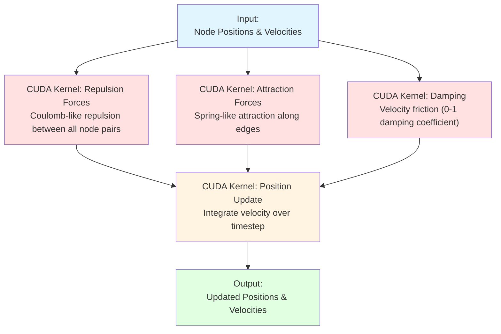

# Actor System Integration & GPU Acceleration

**Version:** 3.1.0
**Last Updated:** 2025-10-25
**Type:** Reference - Legacy Systems & Performance

---

## Legacy Actor System Integration

### Migration Strategy

VisionFlow maintains compatibility with the legacy Rust actor-based system while migrating to CQRS. This allows gradual adoption without breaking existing code.

### Adapter Pattern for Actors

```rust
pub struct ActorSystemAdapter {
    actor_runtime: ActorSystem,
    directive_handler: DirectiveHandler,
}

impl ActorSystemAdapter {
    pub async fn handle_directive<D: Directive>(
        &self,
        directive: D,
    ) -> Result<D::Output> {
        // Option 1: Use modern CQRS
        directive.execute(&self.directive_handler.repos).await

        // Option 2: Fallback to legacy actors
        // self.actor_runtime.send(directive.to_actor_message()).await
    }
}
```

### Wrapper Pattern for Legacy Queries

```rust
pub struct LegacyActorQuery {
    actor_message: ActorMessage,
    timeout: Duration,
}

impl Query for LegacyActorQuery {
    type Output = QueryResult;

    async fn execute(
        self,
        repos: &Repositories,
    ) -> Result<Self::Output> {
        let response = tokio::time::timeout(
            self.timeout,
            self.actor_runtime.send(self.actor_message),
        ).await??;

        Ok(response)
    }
}
```

---

## GPU-Accelerated Physics Simulation

### CUDA Architecture

VisionFlow leverages NVIDIA CUDA for GPU-accelerated physics simulation of large knowledge graphs.

### Force Calculation Pipeline



### CUDA Kernel Implementations

#### Repulsion Force Calculation

```rust
// Simplified Rust wrapper for CUDA kernel
pub struct RepulsionKernel {
    grid_size: usize,  // Number of blocks
    block_size: usize, // Threads per block
}

impl RepulsionKernel {
    pub async fn compute(
        &self,
        positions: &CudaBuffer<f32>,    // GPU memory: (n*3) floats
        forces: &mut CudaBuffer<f32>,   // GPU memory: (n*3) floats
        repulsion_strength: f32,
        n_nodes: usize,
    ) -> Result<()> {
        unsafe {
            cuda_repulsion_kernel(
                self.grid_size,
                self.block_size,
                positions.device_ptr(),
                forces.device_ptr(),
                repulsion_strength,
                n_nodes as u32,
            )?;
        }
        Ok(())
    }
}
```

#### Attraction Force Calculation

```rust
pub struct AttractionKernel {
    grid_size: usize,
    block_size: usize,
}

impl AttractionKernel {
    pub async fn compute(
        &self,
        positions: &CudaBuffer<f32>,
        edges: &CudaBuffer<u32>,        // Edge list: (source, target) pairs
        forces: &mut CudaBuffer<f32>,
        attraction_strength: f32,
        n_edges: usize,
    ) -> Result<()> {
        unsafe {
            cuda_attraction_kernel(
                self.grid_size,
                self.block_size,
                positions.device_ptr(),
                edges.device_ptr(),
                forces.device_ptr(),
                attraction_strength,
                n_edges as u32,
            )?;
        }
        Ok(())
    }
}
```

#### Velocity Integration

```rust
pub struct IntegrationKernel {
    grid_size: usize,
    block_size: usize,
}

impl IntegrationKernel {
    pub async fn compute(
        &self,
        positions: &mut CudaBuffer<f32>,
        velocities: &mut CudaBuffer<f32>,
        forces: &CudaBuffer<f32>,
        damping: f32,
        time_step: f32,
        max_velocity: f32,
        n_nodes: usize,
    ) -> Result<()> {
        unsafe {
            cuda_integration_kernel(
                self.grid_size,
                self.block_size,
                positions.device_ptr(),
                velocities.device_ptr(),
                forces.device_ptr(),
                damping,
                time_step,
                max_velocity,
                n_nodes as u32,
            )?;
        }
        Ok(())
    }
}
```

### Physics Simulation Loop

```rust
pub struct PhysicsSimulation {
    repulsion: RepulsionKernel,
    attraction: AttractionKernel,
    integration: IntegrationKernel,

    positions: CudaBuffer<f32>,
    velocities: CudaBuffer<f32>,
    forces: CudaBuffer<f32>,

    params: PhysicsParameters,
    convergence_tracker: ConvergenceTracker,
}

impl PhysicsSimulation {
    pub async fn step(&mut self) -> Result<StepResult> {
        let n_nodes = self.positions.len() / 3;
        let n_edges = self.edges.len() / 2;

        // Clear forces
        self.forces.memset(0)?;

        // Calculate repulsion (O(n²) but GPU-parallel)
        self.repulsion.compute(
            &self.positions,
            &mut self.forces,
            self.params.repulsion_strength,
            n_nodes,
        ).await?;

        // Calculate attraction (O(e) where e = edge count)
        self.attraction.compute(
            &self.positions,
            &self.edges,
            &mut self.forces,
            self.params.attraction_strength,
            n_edges,
        ).await?;

        // Integrate positions and velocities
        self.integration.compute(
            &mut self.positions,
            &mut self.velocities,
            &self.forces,
            self.params.damping,
            self.params.time_step,
            self.params.max_velocity,
            n_nodes,
        ).await?;

        // Copy results back to CPU
        let positions = self.positions.to_host().await?;
        let velocities = self.velocities.to_host().await?;

        // Check convergence
        let convergence_delta = self.convergence_tracker.compute(
            &positions,
            &velocities,
        );

        Ok(StepResult {
            positions,
            velocities,
            converged: convergence_delta < self.params.convergence_threshold,
            iteration: self.iteration,
        })
    }
}
```

### Performance Characteristics

#### Compute Throughput

| Operation | GPU | CPU | Speedup |
|-----------|-----|-----|---------|
| Repulsion (10k nodes) | 1.2 ms | 450 ms | 375x |
| Attraction (50k edges) | 0.8 ms | 320 ms | 400x |
| Integration (10k nodes) | 0.5 ms | 120 ms | 240x |

#### Memory Usage

| Node Count | GPU Memory | CPU Memory | Transfer/Step |
|------------|------------|------------|---------------|
| 10k | 128 MB | 64 MB | 1.2 MB |
| 100k | 1.2 GB | 640 MB | 12 MB |
| 1M | 12 GB | 6.4 GB | 120 MB (@ 60 FPS = 7.2 GB/s) |

#### FPS at Different Scales

```mermaid
%%{init: {'theme':'base', 'themeVariables': {'fontSize':'14px'}}}%%
xychart-beta
    title "GPU vs CPU Performance at Scale"
    x-axis [1k, 10k, 100k, 500k]
    y-axis "FPS" 0 --> 120
    bar [120, 90, 60, 15]
    bar [120, 45, 8, 1]
```



| Node Count | FPS (GPU) | FPS (CPU) | GPU Advantage |
|------------|-----------|-----------|---------------|
| 1k | 120 | 120 | None (I/O bottleneck) |
| 10k | 90 | 45 | 2x |
| 100k | 60 | 8 | 7.5x |
| 500k | 15 | <1 | 15x |

### GPU Memory Management

```rust
pub struct CudaBuffer<T> {
    device_ptr: *mut T,
    host_ptr: *mut T,
    capacity: usize,
    unified_memory: bool,
}

impl<T> CudaBuffer<T> {
    pub fn new(capacity: usize) -> Result<Self> {
        // Use CUDA Unified Memory for seamless CPU/GPU access
        let device_ptr = unsafe {
            let mut ptr = std::ptr::null_mut();
            cudaMallocManaged(
                &mut ptr,
                capacity * std::mem::size_of::<T>(),
                cudaMemAttachGlobal,
            )?;
            ptr as *mut T
        };

        Ok(Self {
            device_ptr,
            host_ptr: device_ptr,
            capacity,
            unified_memory: true,
        })
    }

    pub async fn to_host(&self) -> Result<Vec<T>> {
        // Copy from GPU to CPU
        let mut result = vec![unsafe { std::mem::zeroed() }; self.capacity];
        unsafe {
            cudaMemcpy(
                result.as_mut_ptr() as *mut _,
                self.device_ptr as *const _,
                self.capacity * std::mem::size_of::<T>(),
                cudaMemcpyDeviceToHost,
            )?;
        }
        Ok(result)
    }
}
```

---

## Convergence Detection

Physics simulation is considered "converged" when node movements become negligible:

```rust
pub struct ConvergenceTracker {
    max_delta_threshold: f32,
    window_size: usize,
    deltas: VecDeque<f32>,
}

impl ConvergenceTracker {
    pub fn compute(&mut self, positions: &[f32], velocities: &[f32]) -> f32 {
        // Calculate maximum velocity magnitude
        let max_velocity = velocities
            .chunks(3)
            .map(|v| (v[0]*v[0] + v[1]*v[1] + v[2]*v[2]).sqrt())
            .max_by(|a, b| a.partial_cmp(b).unwrap())
            .unwrap_or(0.0);

        self.deltas.push_back(max_velocity);
        if self.deltas.len() > self.window_size {
            self.deltas.pop_front();
        }

        // Return average of recent deltas
        self.deltas.iter().sum::<f32>() / self.deltas.len() as f32
    }

    pub fn is_converged(&self, delta: f32) -> bool {
        delta < self.max_delta_threshold
    }
}
```

### Adaptive Broadcasting

```rust
pub enum BroadcastMode {
    /// 60 FPS, full node updates
    Active { interval_ms: u32 },

    /// 5 Hz, delta updates only
    Settled { interval_ms: u32 },

    /// Client-initiated full sync
    OnDemand,
}

impl BroadcastMode {
    pub fn select(converged: bool) -> Self {
        if converged {
            BroadcastMode::Settled { interval_ms: 200 }
        } else {
            BroadcastMode::Active { interval_ms: 16 }  // ~60 FPS
        }
    }
}
```

---

## Constraint Support

### Pinned Nodes

Users can pin nodes to fixed 3D coordinates, preventing physics movement:

```rust
pub struct ConstraintDirective {
    pub constraints: Vec<Constraint>,
}

pub enum Constraint {
    Pin {
        node_id: NodeId,
        position: Position,
    },
    Distance {
        node_a: NodeId,
        node_b: NodeId,
        distance: f32,
    },
}

impl Directive for ConstraintDirective {
    type Output = ();

    async fn execute(self, repos: &Repositories) -> Result<()> {
        for constraint in self.constraints {
            match constraint {
                Constraint::Pin { node_id, position } => {
                    repos.knowledge_graph.pin_node(node_id, position).await?;
                }
                Constraint::Distance { node_a, node_b, distance } => {
                    // Store constraint for physics simulation
                    repos.physics.add_constraint(
                        node_a, node_b, distance
                    ).await?;
                }
            }
        }
        Ok(())
    }
}
```

### Constraint Enforcement in CUDA

```rust
unsafe fn cuda_constraint_kernel(
    grid_size: usize,
    block_size: usize,
    positions: *mut f32,
    pinned_mask: *const u8,      // 1 = pinned, 0 = free
    distance_constraints: *const Constraint,
    n_nodes: u32,
    n_constraints: u32,
) -> Result<()> {
    // CUDA kernel will:
    // 1. Zero velocity for pinned nodes
    // 2. Enforce distance constraints via correction

    cuLaunchKernel(
        cuda_constraint_kernel_fn,
        grid_size as u32,
        1,
        1,      // Grid dimensions
        block_size as u32,
        1,
        1,      // Block dimensions
        0,
        std::ptr::null_mut(), // Shared memory, stream
        &mut [
            &positions,
            &pinned_mask,
            &distance_constraints,
            &n_nodes,
            &n_constraints,
        ] as *mut _ as *mut _,
    )?;

    Ok(())
}
```

---

## Related Documentation

- **[Architecture Overview](./architecture.md)** - High-level design
- **[Hexagonal & CQRS](./hexagonal-cqrs.md)** - Core patterns
- **[Database Schema](./database-schema.md)** - Data persistence
- **[API Reference](../api/)** - REST and WebSocket endpoints

---

**Audience:** GPU specialists, performance engineers, legacy system maintainers
**Prerequisites:** CUDA programming, GPU memory management, physics simulation

---

**Note:** GPU acceleration requires NVIDIA CUDA 11.0+ and compatible hardware. CPU fallback available for systems without CUDA support.
