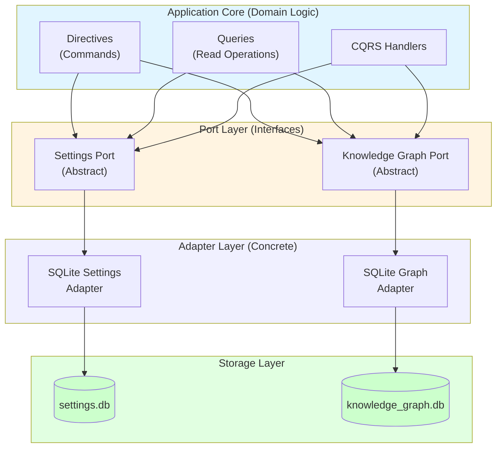

# Hexagonal Architecture & CQRS Implementation

**Version:** 3.1.0
**Last Updated:** 2025-10-25
**Type:** Reference - Technical Deep Dive

---

## Three-Database Architecture Details

### Settings Database (`data/settings.db`)

**Purpose:** Application configuration and user preferences

**Key Tables:**

```sql
CREATE TABLE settings (
    key TEXT PRIMARY KEY,
    value_string TEXT,
    value_integer INTEGER,
    value_float REAL,
    value_boolean INTEGER,
    value_json TEXT
);

CREATE TABLE physics_settings (
    profile_name TEXT PRIMARY KEY,
    time_step REAL DEFAULT 0.016,
    damping REAL DEFAULT 0.85,
    repulsion_strength REAL DEFAULT 500.0,
    attraction_strength REAL DEFAULT 0.01,
    max_velocity REAL DEFAULT 100.0,
    convergence_threshold REAL DEFAULT 0.001
);
```

**Access Patterns:**
- High read/write frequency
- Low data volume
- User-specific configurations

### Knowledge Graph Database (`data/knowledge_graph.db`)

**Purpose:** Main graph structure from local markdown files

**Key Tables:**

```sql
CREATE TABLE nodes (
    id INTEGER PRIMARY KEY,
    metadata_id TEXT,
    label TEXT NOT NULL,
    type TEXT,
    position_x REAL,
    position_y REAL,
    position_z REAL,
    velocity_x REAL,
    velocity_y REAL,
    velocity_z REAL,
    color_rgba INTEGER,
    is_pinned INTEGER,
    is_visible INTEGER,
    properties TEXT -- JSON
);

CREATE TABLE edges (
    id TEXT PRIMARY KEY,
    source_id INTEGER NOT NULL,
    target_id INTEGER NOT NULL,
    edge_type TEXT,
    weight REAL,
    FOREIGN KEY (source_id) REFERENCES nodes(id),
    FOREIGN KEY (target_id) REFERENCES nodes(id)
);
```

**Features:**
- WAL mode for concurrent access
- FOREIGN KEY constraints enforce referential integrity
- Indexes on frequently queried columns

### Ontology Database (`data/ontology.db`)

**Purpose:** Semantic web knowledge (OWL ontologies)

**Key Tables:**

```sql
CREATE TABLE owl_classes (
    iri TEXT PRIMARY KEY,
    label TEXT,
    description TEXT,
    parent_classes TEXT -- JSON array
);

CREATE TABLE owl_properties (
    iri TEXT PRIMARY KEY,
    label TEXT,
    property_type TEXT CHECK(property_type IN ('ObjectProperty', 'DataProperty', 'AnnotationProperty')),
    domain TEXT,
    range TEXT
);

CREATE TABLE owl_axioms (
    id INTEGER PRIMARY KEY AUTOINCREMENT,
    axiom_type TEXT,
    subject TEXT,
    object TEXT
);

CREATE TABLE inference_results (
    id INTEGER PRIMARY KEY AUTOINCREMENT,
    timestamp TEXT,
    inferred_axioms TEXT, -- JSON array
    inference_time_ms INTEGER
);
```

---

## Ports & Adapters Pattern

### Architecture Diagram



### Settings Port

```rust
pub trait SettingsRepository {
    async fn get_all(&self) -> Result<SettingsModel>;
    async fn get_setting(&self, path: &str) -> Result<SettingValue>;
    async fn update_setting(&self, path: &str, value: SettingValue) -> Result<()>;
    async fn get_physics_settings(&self, graph: &str) -> Result<PhysicsSettings>;
    async fn update_physics_settings(&self, graph: &str, settings: PhysicsSettings) -> Result<()>;
}

pub struct SqliteSettingsRepository {
    connection: Arc<Mutex<Connection>>,
}

impl SettingsRepository for SqliteSettingsRepository {
    // Concrete implementation using SQLite
}
```

### Knowledge Graph Port

```rust
pub trait KnowledgeGraphRepository {
    async fn get_full_graph(&self) -> Result<Graph>;
    async fn add_node(&self, node: Node) -> Result<NodeId>;
    async fn update_node(&self, id: NodeId, updates: NodeUpdates) -> Result<()>;
    async fn remove_node(&self, id: NodeId) -> Result<()>;
    async fn add_edge(&self, edge: Edge) -> Result<EdgeId>;
    async fn remove_edge(&self, id: EdgeId) -> Result<()>;
    async fn query_nodes(&self, filter: NodeFilter) -> Result<Vec<Node>>;
    async fn get_statistics(&self) -> Result<GraphStatistics>;
}

pub struct SqliteKnowledgeGraphRepository {
    connection: Arc<Mutex<Connection>>,
}

impl KnowledgeGraphRepository for SqliteKnowledgeGraphRepository {
    // Concrete SQLite implementation
}
```

---

## CQRS Pattern Implementation

### Directives (Write Operations)

Directives represent **commands** that modify application state:

#### AddNodeDirective

```rust
pub struct AddNodeDirective {
    pub label: String,
    pub node_type: Option<String>,
    pub metadata_id: Option<String>,
    pub position: Option<Position>,
    pub properties: Option<HashMap<String, Value>>,
}

impl Directive for AddNodeDirective {
    type Output = NodeId;

    async fn execute(
        self,
        repos: &Repositories,
    ) -> Result<Self::Output> {
        // Validation
        if self.label.is_empty() {
            return Err("Label cannot be empty".into());
        }

        // Persistence
        let node = Node {
            label: self.label,
            node_type: self.node_type,
            metadata_id: self.metadata_id,
            position: self.position.unwrap_or_default(),
            properties: self.properties.unwrap_or_default(),
        };

        repos.knowledge_graph.add_node(node).await
    }
}
```

#### UpdateNodeDirective

```rust
pub struct UpdateNodeDirective {
    pub node_id: NodeId,
    pub label: Option<String>,
    pub position: Option<Position>,
    pub properties: Option<HashMap<String, Value>>,
}

impl Directive for UpdateNodeDirective {
    type Output = ();

    async fn execute(
        self,
        repos: &Repositories,
    ) -> Result<Self::Output> {
        // Fetch existing node
        let node = repos.knowledge_graph.get_node(self.node_id).await?;

        // Apply updates
        let updates = NodeUpdates {
            label: self.label,
            position: self.position,
            properties: self.properties,
        };

        repos.knowledge_graph.update_node(self.node_id, updates).await
    }
}
```

#### SaveAllSettingsDirective

```rust
pub struct SaveAllSettingsDirective {
    pub settings: SettingsModel,
}

impl Directive for SaveAllSettingsDirective {
    type Output = ();

    async fn execute(
        self,
        repos: &Repositories,
    ) -> Result<Self::Output> {
        // Validate settings structure
        self.settings.validate()?;

        // Save to database
        for (key, value) in self.settings.flatten() {
            repos.settings.update_setting(&key, value).await?;
        }

        Ok(())
    }
}
```

### Queries (Read Operations)

Queries are **read operations** optimized for performance:

#### GetGraphQuery

```rust
pub struct GetGraphQuery;

impl Query for GetGraphQuery {
    type Output = Graph;

    async fn execute(
        self,
        repos: &Repositories,
    ) -> Result<Self::Output> {
        // Can leverage caching, projections, etc.
        repos.knowledge_graph.get_full_graph().await
    }
}
```

#### GetSettingQuery

```rust
pub struct GetSettingQuery {
    pub path: String,
}

impl Query for GetSettingQuery {
    type Output = SettingValue;

    async fn execute(
        self,
        repos: &Repositories,
    ) -> Result<Self::Output> {
        repos.settings.get_setting(&self.path).await
    }
}
```

#### QueryNodesQuery

```rust
pub struct QueryNodesQuery {
    pub filter: NodeFilter,
    pub limit: Option<usize>,
    pub offset: Option<usize>,
}

impl Query for QueryNodesQuery {
    type Output = Vec<Node>;

    async fn execute(
        self,
        repos: &Repositories,
    ) -> Result<Self::Output> {
        repos.knowledge_graph.query_nodes(self.filter).await
    }
}
```

---

## HTTP API Architecture

### REST Endpoints Implementation

```rust
#[post("/api/graph/node")]
async fn add_node(
    body: Json<AddNodeRequest>,
    repos: web::Data<Repositories>,
) -> Result<Json<AddNodeResponse>> {
    let directive = AddNodeDirective {
        label: body.label.clone(),
        node_type: body.node_type.clone(),
        metadata_id: body.metadata_id.clone(),
        position: body.position.clone(),
        properties: body.properties.clone(),
    };

    let node_id = directive.execute(&repos).await?;

    Ok(Json(AddNodeResponse { node_id }))
}

#[get("/api/graph")]
async fn get_graph(
    repos: web::Data<Repositories>,
) -> Result<Json<Graph>> {
    let query = GetGraphQuery;
    let graph = query.execute(&repos).await?;

    Ok(Json(graph))
}
```

### Request/Response Models

```rust
#[derive(Serialize, Deserialize)]
pub struct AddNodeRequest {
    pub label: String,
    pub node_type: Option<String>,
    pub metadata_id: Option<String>,
    pub position: Option<Position>,
    pub properties: Option<HashMap<String, Value>>,
}

#[derive(Serialize, Deserialize)]
pub struct AddNodeResponse {
    pub node_id: NodeId,
}

#[derive(Serialize, Deserialize)]
pub struct Graph {
    pub nodes: Vec<Node>,
    pub edges: Vec<Edge>,
    pub statistics: GraphStatistics,
}
```

---

## WebSocket Binary Protocol (V2)

### 36-Byte Node Update Format

**Binary Wire Format:**

| Offset | Size | Type | Field | Description |
|--------|------|------|-------|-------------|
| 0 | 1 | u8 | msg_type | 0x01 = NodeUpdate |
| 1 | 4 | u32 | node_id | Node identifier |
| 5 | 4 | f32 | position_x | X coordinate |
| 9 | 4 | f32 | position_y | Y coordinate |
| 13 | 4 | f32 | position_z | Z coordinate |
| 17 | 4 | f32 | velocity_x | X velocity |
| 21 | 4 | f32 | velocity_y | Y velocity |
| 25 | 4 | f32 | velocity_z | Z velocity |
| 29 | 4 | u32 | color_rgba | Packed RGBA |
| 33 | 3 | u8[3] | flags | State flags |

### Client-Side Parsing (TypeScript)

```typescript
function parseBinaryNodeUpdate(buffer: ArrayBuffer): NodeUpdate {
  const view = new DataView(buffer);
  const msgType = view.getUint8(0);

  if (msgType !== 0x01) {
    throw new Error('Not a node update message');
  }

  const nodeId = view.getUint32(1, true);
  const graphType = (nodeId >> 30) & 0b11;
  const actualId = nodeId & 0x3FFFFFFF;

  return {
    graphType: ['knowledge', 'ontology', 'agent', 'reserved'][graphType],
    nodeId: actualId,
    position: {
      x: view.getFloat32(5, true),
      y: view.getFloat32(9, true),
      z: view.getFloat32(13, true),
    },
    velocity: {
      x: view.getFloat32(17, true),
      y: view.getFloat32(21, true),
      z: view.getFloat32(25, true),
    },
    color: {
      r: (view.getUint32(29, true) >> 24) & 0xFF,
      g: (view.getUint32(29, true) >> 16) & 0xFF,
      b: (view.getUint32(29, true) >> 8) & 0xFF,
      a: view.getUint32(29, true) & 0xFF,
    },
    isPinned: (view.getUint8(33) & 0b1) !== 0,
    isSelected: (view.getUint8(33) & 0b10) !== 0,
    isHighlighted: (view.getUint8(33) & 0b100) !== 0,
    isVisible: (view.getUint8(33) & 0b1000) !== 0,
    nodeType: view.getUint8(34),
  };
}
```

### Bandwidth Characteristics

- **36 bytes per node update**
- **60 FPS at 100k nodes = 3.6 MB/s**
- **JSON equivalent = ~200 bytes per node = 20 MB/s**
- **Reduction: 82% bandwidth savings**

---

## Ontology API Implementation

### Add OWL Class

```rust
pub struct AddOwlClassDirective {
    pub iri: String,
    pub label: String,
    pub description: Option<String>,
    pub parent_classes: Vec<String>,
    pub properties: HashMap<String, Value>,
}

impl Directive for AddOwlClassDirective {
    type Output = String; // Returns IRI

    async fn execute(
        self,
        repos: &Repositories,
    ) -> Result<Self::Output> {
        // Validation
        if !self.iri.starts_with("http://") && !self.iri.starts_with("https://") {
            return Err("IRI must be valid URI".into());
        }

        // Store in ontology database
        repos.ontology.add_class(OwlClass {
            iri: self.iri.clone(),
            label: self.label,
            description: self.description,
            parent_classes: self.parent_classes,
        }).await?;

        Ok(self.iri)
    }
}
```

### Run Inference

```rust
pub struct RunInferenceDirective {
    pub reasoner: String,
    pub options: InferenceOptions,
}

impl Directive for RunInferenceDirective {
    type Output = InferenceResult;

    async fn execute(
        self,
        repos: &Repositories,
    ) -> Result<Self::Output> {
        // Call reasoner (e.g., whelk-rs)
        let result = inference::run_reasoner(
            &self.reasoner,
            repos.ontology,
            &self.options,
        ).await?;

        // Store results
        repos.ontology.save_inference_result(&result).await?;

        Ok(result)
    }
}
```

---

## Performance Optimizations

### SQLite Configuration

```rust
conn.execute_batch("
    PRAGMA journal_mode = WAL;      // Write-Ahead Logging
    PRAGMA synchronous = NORMAL;    // Balanced safety/speed
    PRAGMA cache_size = 10000;      // Larger page cache
    PRAGMA foreign_keys = ON;       // Enforce constraints
    PRAGMA temp_store = MEMORY;     // Temp tables in RAM
")?;
```

### Prepared Statement Caching

```rust
// rusqlite automatically caches prepared statements
let mut stmt = conn.prepare_cached(
    "SELECT * FROM nodes WHERE id = ?"
)?;

let nodes = stmt.query_map([node_id], |row| {
    // Parse node...
})?;
```

### Batch Operations

```rust
let tx = conn.transaction()?;

for node in nodes {
    tx.execute(
        "INSERT INTO nodes (label, type) VALUES (?, ?)",
        params![node.label, node.node_type],
    )?;
}

tx.commit()?; // Single atomic write
```

---

## Related Documentation

- **[Architecture Overview](./architecture.md)** - High-level principles
- **[Actor System Integration](./actor-system.md)** - Legacy compatibility
- **[Database Schema](./database-schema.md)** - Schema details
- **[API Reference](../api/)** - REST and WebSocket specs

---

**Audience:** Backend engineers, architects
**Complexity:** High - Requires understanding of CQRS, hexagonal architecture, and Rust async/await
