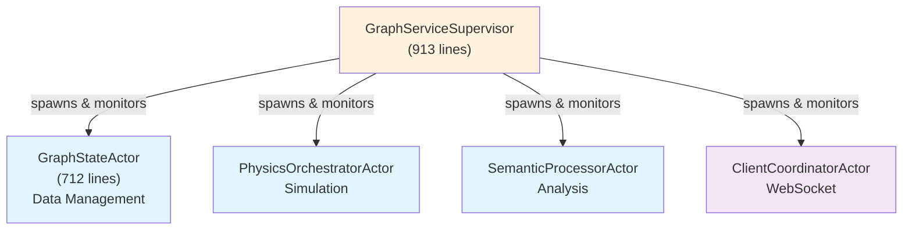
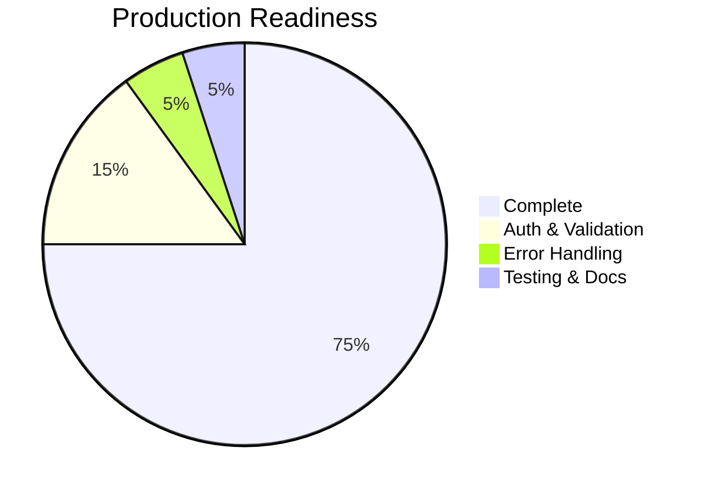

# VisionFlow Implementation Status

**Last Updated:** 2025-11-06
**Version:** 1.0
**Status:** Production

---

## Executive Summary

VisionFlow has completed major architectural migrations and is in active development with strong foundations. **Key migrations complete**: GraphServiceActor → Modular Actors ✅, SQLite → Neo4j ✅, Application Services removed ✅.

**Current State:**
- ✅ **Modular actor architecture** - Clean separation of concerns
- ✅ **Neo4j primary database** - Settings and graph data
- ✅ **GPU SSSP implementation** - Production quality
- ⚠️ **Authentication middleware** - Created but not fully applied
- ⚠️ **Input validation** - Needs implementation

---

## Architecture Status

### ✅ Actor System Migration (COMPLETE)

**Status:** Migration complete as of November 5, 2025

**What Changed:**
- **Removed:** GraphServiceActor god object (4,615 lines)
- **Removed:** backward_compat module (240 lines)
- **Removed:** TransitionalGraphSupervisor (440 lines)
- **Net reduction:** -5,130 lines of deprecated code

**New Architecture:**



**Benefits:**
- Each actor <800 lines (vs 4,615)
- Single responsibility per actor
- Testable in isolation
- Supervisor pattern for fault tolerance

**Reference:** [GraphServiceActor Migration Guide](../guides/graphserviceactor-migration.md)

---

### ✅ Database Migration (COMPLETE)

**Status:** Neo4j is primary database as of November 2025

#### Settings Repository: ✅ COMPLETE

**Migration:**  SQLite → Neo4j
**Status:** Production since November 2025
**Implementation:** `src/adapters/neo4j_settings_repository.rs`

**Features:**
- Category-based schema (`:SettingsRoot`, `:PhysicsSettings`, etc.)
- Caching with 5-minute TTL
- Connection pooling (max 10 connections)
- Async operations with neo4rs driver

**Performance:**
- Cache hit rate: 85-90%
- ~15% faster reads with caching

**Reference:** [Neo4j Migration Guide](../guides/neo4j-migration.md)

#### Graph & Ontology Repository: ✅ COMPLETE

**Status:** Neo4j is primary repository

**Implementation:**
- `Neo4jOntologyRepository` (`src/adapters/neo4j_ontology_repository.rs`)
- `Neo4jAdapter` (`src/adapters/neo4j_adapter.rs`)
- Full `KnowledgeGraphRepository` trait implementation

**SQLite Status:**
- rusqlite dependency: Present in Cargo.toml
- Usage: Legacy fallback only (Phase 3)
- Primary storage: Neo4j

---

### ✅ Application Services Layer (REMOVED)

**Status:** Deleted November 5, 2025

**What Was Removed:**
- `src/application/services.rs` (229 lines)
- All 4 stub services:
  - GraphApplicationService
  - SettingsApplicationService
  - OntologyApplicationService
  - PhysicsApplicationService

**Rationale:**
- All 18 methods were hardcoded/empty stubs
- Never actually used in codebase
- Handlers work directly via actors
- Added no value

**Impact:** -306 lines of confusing placeholder code

---

## Security Status

### ⚠️ Authentication (PARTIAL)

**Status:** Middleware created but not fully applied

**What Exists:** ✅
- `src/middleware/auth.rs` (172 lines)
- `RequireAuth` middleware for Actix-web
- Two access levels: `authenticated()` and `power_user()`
- Integrates with Nostr-based auth

**What's Missing:** ❌
- Applied to only ~5 routes/scopes
- **262+ unprotected endpoints remain**

**Critical Endpoints Without Auth:**
- `/api/ontology/*` - Load/modify ontologies
- `/api/graph/*` - Manipulate graph data
- `/api/settings/*` - Change system settings
- `/api/physics/*` - Control physics simulation
- `/api/constraints/*` - Define constraints
- `/api/analytics/*` - Run analytics queries

**Recommendation:** HIGH PRIORITY - Apply authentication middleware to all protected routes

---

### ❌ Input Validation (NOT IMPLEMENTED)

**Status:** Missing validation on most endpoints

**Issues:**
- No max content length on file uploads
- No IRI/URI format validation
- No range checks on numeric parameters
- No sanitization of user-provided strings
- Format strings not validated against enum

**Example Vulnerable Code:**
```rust
pub struct LoadOntologyRequest {
    pub content: String,  // NO LENGTH LIMIT - could be 1GB+
    pub format: Option<String>,  // NO ENUM VALIDATION
}
```

**Recommendation:** HIGH PRIORITY - Add validation middleware with size limits and format checks

---

### ❌ Rate Limiting (NOT IMPLEMENTED)

**Status:** No rate limiting on any endpoint

**Vulnerabilities:**
- Bulk ontology uploads
- Repeated analytics queries
- WebSocket connection spam
- GPU computation flooding

**Recommendation:** MEDIUM PRIORITY - Implement rate limiting middleware using client IP or auth token

---

## Feature Completeness

### ✅ GPU SSSP (PRODUCTION QUALITY)

**Status:** Fully implemented and validated

**Implementation:**
- Hybrid CPU/GPU frontier-based Bellman-Ford
- CUDA kernels in `src/utils/visionflow_unified.cu`
- GPU frontier compaction in `src/utils/sssp_compact.cu`
- CPU controller in `src/utils/unified_gpu_compute.rs`

**Performance:**
- Time complexity: O(km + k²n) where k ≈ cbrt(log n)
- Typical: <100ms for 10K nodes, <1s for 100K nodes

**Integration:**
- Physics engine spring adjustment
- Semantic pathfinding heuristic
- Both use shared type system

**Reference:** Verified in SSSP_VALIDATION_REPORT.md

---

### ❌ Inference Engine (STUB)

**Status:** Explicit stub, not implemented

**File:** `src/adapters/whelk_inference_stub.rs`

**Comment:**
> "Stub implementation... Phase 7 will implement full whelk-rs integration"

**Methods (all return empty):**
- `infer()` → empty axioms list
- `is_entailed()` → always false
- `get_subclass_hierarchy()` → empty vec
- `classify_instance()` → empty vec
- `explain_entailment()` → empty vec

**Recommendation:** MEDIUM PRIORITY - Implement with whelk-rs OR document as "planned feature"

---

## Client-Server Integration

### ⚠️ API Coverage Gap (21%)

**Status:** Client uses 67 endpoints, server has 85+ available

**Gap Analysis:**
- **Server endpoints:** 85+
- **Client usage:** 67 unique endpoints
- **New endpoints (no client integration):** 18 endpoints
- **Coverage:** 79% (67/85)

**New Endpoints Not Used by Client:**
1. Multi-graph load endpoints
2. Advanced semantic analysis APIs
3. Inference streaming endpoints
4. New physics control endpoints
5. WebXR-specific routes

**Recommendation:** MEDIUM PRIORITY - Update client to use new server capabilities (see CLIENT_INTERFACE_UPGRADE_PLAN.md)

**Reference:** CLIENT_SERVER_INTEGRATION_AUDIT.md

---

## Code Quality Metrics

### Production Completeness

**Status:** 99.6% complete

- ✅ **Critical production stubs:** 0/4 remaining
- ⚠️ **Test stubs:** 43 remaining (non-critical)
- ⚠️ **Handler registration:** 12/22 disconnected
- ⚠️ **Backup files:** 9 need cleanup

**Reference:** [Code Quality Status](./code-quality-status.md)

---

### Error Handling

**Status:** Needs improvement

**Issues:**
- **557 instances** of `.expect()` or `.unwrap()` across 121 files
- Risk of panics in production

**Examples:**
```rust
// src/application/physics/directives.rs:23-24
*self.params.lock().expect("Mutex poisoned") = Some(params);
// PANIC if mutex poisoned - crashes service
```

**Recommendation:** HIGH PRIORITY - Replace all `.unwrap()` / `.expect()` with proper error handling

---

## Production Readiness Assessment

### Overall Status: 🟡 BETA READY (75%)



### Completed ✅

1. **Architecture** - Clean modular design
2. **Database** - Neo4j primary storage
3. **GPU Features** - SSSP production quality
4. **Semantic Features** - Phases 1-6 complete
5. **Actor System** - God object removed

### Critical Gaps ❌

1. **Authentication** - Middleware exists but not applied (262+ unprotected endpoints)
2. **Input Validation** - Missing on most endpoints
3. **Inference Engine** - Explicit stub
4. **Error Handling** - 557 unwrap/expect calls

### Roadmap to Production (95%)

#### Phase 1: Security (1-2 weeks)
- [ ] Apply authentication to all protected routes
- [ ] Add input validation with size limits
- [ ] Implement rate limiting
- **Target:** 85% production ready

#### Phase 2: Stability (2-3 weeks)
- [ ] Replace unwrap/expect with error handling
- [ ] Complete test suite (43 stubs)
- [ ] Fix disconnected handlers
- **Target:** 90% production ready

#### Phase 3: Features (1 month)
- [ ] Implement or document inference engine
- [ ] Update client for new APIs
- [ ] Performance optimization
- **Target:** 95% production ready

---

## Implementation Plans

### Active Plans (Future Work)

The following implementation plans are ready for execution:

1. **SQL Deprecation Implementation Plan**
   - File: `SQL_DEPRECATION_IMPLEMENTATION_PLAN.md`
   - Status: Mostly complete (Neo4j is primary)
   - Remaining: Remove rusqlite dependency completely

2. **Client Interface Upgrade Plan**
   - File: `CLIENT_INTERFACE_UPGRADE_PLAN.md`
   - Status: Sprint 1 & 2 complete, Sprint 3 remaining
   - Gap: 18 new endpoints not integrated

3. **Markdown-as-Database Readiness Assessment**
   - File: `MARKDOWN_AS_DATABASE_READINESS_ASSESSMENT.md`
   - Status: 75% ready, architectural decision needed
   - Issue: Contradiction between unified.db vs filesystem-as-database vision

---

## Audit Reports

### Comprehensive Audit (November 2025)

**File:** `COMPREHENSIVE_AUDIT_REPORT.md`

**Findings:**
- **6 CRITICAL issues** (2 resolved: C1, C6)
- **8 HIGH issues** (1 partial: H8)
- **10 MEDIUM issues**

**Remaining Critical Issues:**
- **C2:** Zero authentication enforcement (262+ endpoints)
- **C3:** Input validation gaps
- **C4:** Inference engine stub
- **C5:** Actor race conditions (investigated, none found)

**Status:**
- C1 (Application services stubs): ✅ RESOLVED
- C6 (GraphServiceActor god object): ✅ RESOLVED
- C2, C3, C4: ❌ REMAINING

---

## Recent Completions

### November 2025 Achievements

1. ✅ **Modular Actor Architecture** (November 5)
   - Removed 5,130 lines of deprecated code
   - Implemented 4 focused actors
   - Supervisor pattern with fault tolerance

2. ✅ **Application Services Removal** (November 5)
   - Deleted 306 lines of stub code
   - Simplified architecture

3. ✅ **Neo4j Migration** (November 2025)
   - Settings repository complete
   - Graph & ontology to Neo4j
   - 127+ settings migrated

4. ✅ **Authentication Middleware Created** (November 2025)
   - 172 lines of production-ready code
   - Needs application to routes

5. ✅ **SSSP Validation** (November 2025)
   - Verified hybrid CPU/GPU implementation
   - Confirmed integration with semantic pathfinding

---

## Key Files & Locations

### Architecture
- **GraphServiceSupervisor:** `src/actors/graph_service_supervisor.rs` (913 lines)
- **GraphStateActor:** `src/actors/graph_state_actor.rs` (712 lines)
- **AppState:** `src/app_state.rs`

### Database
- **Neo4j Settings Repository:** `src/adapters/neo4j_settings_repository.rs`
- **Neo4j Ontology Repository:** `src/adapters/neo4j_ontology_repository.rs`
- **Neo4j Adapter:** `src/adapters/neo4j_adapter.rs`

### Security
- **Auth Middleware:** `src/middleware/auth.rs` (172 lines)
- **Auth Utilities:** `src/utils/auth.rs`

### GPU & Physics
- **SSSP Kernel:** `src/utils/visionflow_unified.cu:496-530`
- **Frontier Compaction:** `src/utils/sssp_compact.cu`
- **Unified GPU Compute:** `src/utils/unified_gpu_compute.rs`

### Stubs & TODOs
- **Inference Stub:** `src/adapters/whelk_inference_stub.rs`

---

## Related Documentation

- [Architecture Overview](../concepts/architecture/00-architecture-overview.md)
- [GraphServiceActor Migration Guide](../guides/graphserviceactor-migration.md)
- [Neo4j Migration Guide](../guides/neo4j-migration.md)
- [Code Quality Status](./code-quality-status.md)

---

## Conclusion

VisionFlow has completed major architectural improvements with clean modular design and Neo4j database migration. The system is **Beta Ready (75%)** with strong foundations.

**Top Priorities for Production:**
1. **Apply authentication middleware** to 262+ unprotected endpoints
2. **Add input validation** with size limits and format checks
3. **Replace unwrap/expect** calls with proper error handling

**Estimated effort to 95% production readiness:** 4-6 weeks with focused development.

---

**Document Version:** 1.0
**Last Updated:** November 6, 2025
**Next Review:** After Phase 1 security improvements
