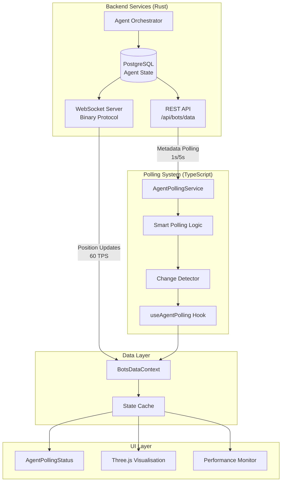
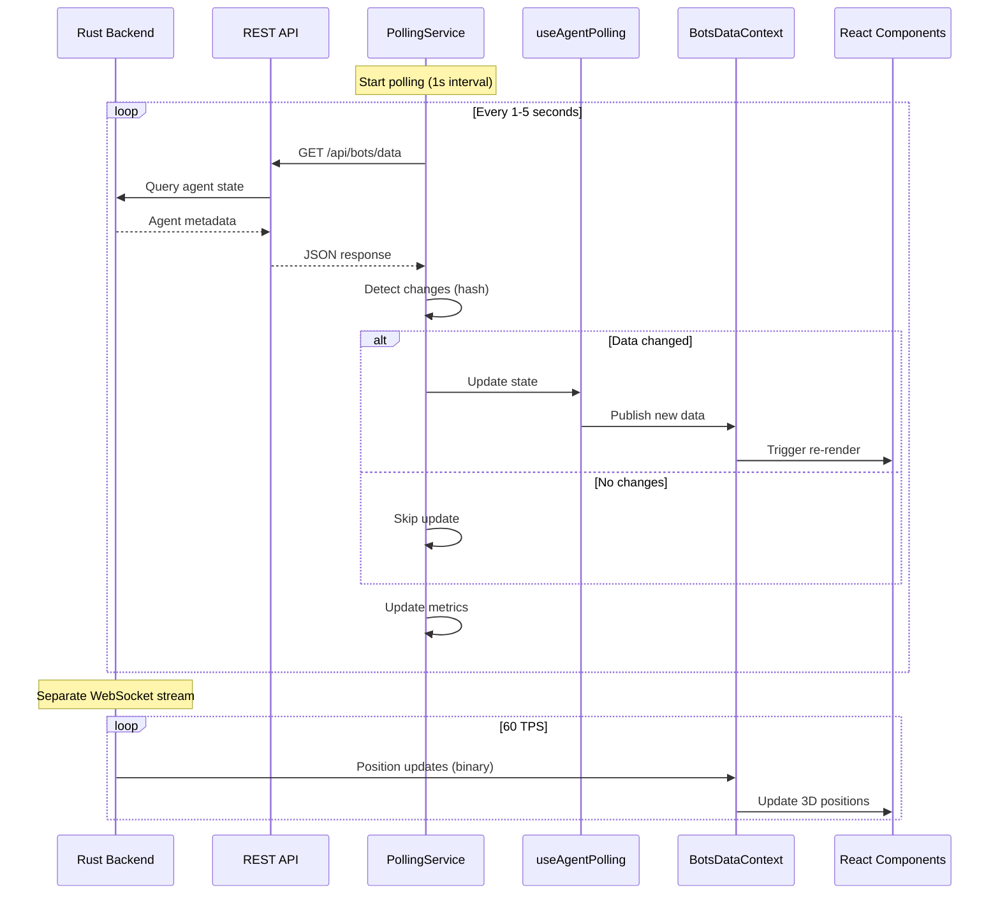
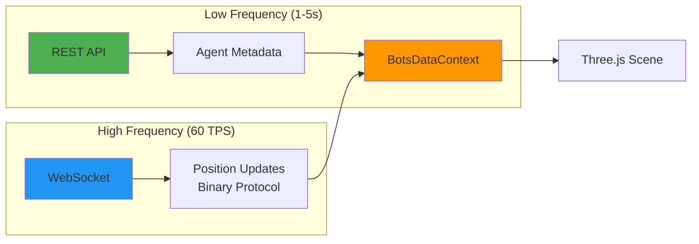

# Agent Swarm Polling System Reference

*[← Back to Reference](README.md)*

**Version**: 2.0.0
**Last Updated**: 2025-10-03
**Status**: ✅ Production

Complete reference documentation for VisionFlow's agent swarm polling system, providing real-time updates of agent metadata and positions through a hybrid REST/WebSocket architecture.

## 📋 Table of Contents

1. [Overview](#overview)
2. [Architecture](#architecture)
3. [Core Components](#core-components)
4. [Configuration](#configuration)
5. [Smart Polling](#smart-polling)
6. [Performance Optimisation](#performance-optimisation)
7. [3D Visualisation Integration](#3d-visualisation-integration)
8. [API Reference](#api-reference)
9. [React Integration](#react-integration)
10. [Best Practices](#best-practices)

---

## Overview

The Agent Swarm Polling System provides real-time synchronisation between the Rust backend's multi-agent system and the React frontend's 3D visualisation layer. It combines REST API polling for metadata with WebSocket binary updates for high-frequency position data.

### Key Features

- **Configurable Polling Intervals**: Active (1s) and idle (5s) modes with custom presets
- **Smart Activity Detection**: Automatically adjusts polling frequency based on system activity
- **Efficient State Management**: Change detection prevents unnecessary re-renders
- **Position Interpolation**: Smooth transitions for 3D visualisation
- **Performance Monitoring**: Real-time metrics tracking and reporting
- **Error Resilience**: Exponential backoff and automatic retry logic
- **Memory Efficiency**: Map-based storage with O(1) lookups

### Use Cases

- **Multi-Agent Visualisation**: Real-time 3D graph of agent swarm
- **Performance Monitoring**: Live metrics dashboard
- **Agent Health Tracking**: Active/idle/failed agent detection
- **Task Orchestration**: Monitor task queue and completion rates

---

## Architecture

### System Overview



### Data Flow



---

## Core Components

### AgentPollingService

Core service managing polling lifecycle, configuration, and data fetching.

**Location**: `client/src/features/bots/services/AgentPollingService.ts`

```typescript
import { AgentPollingService } from './services/AgentPollingService';

const pollingService = new AgentPollingService({
  activePollingInterval: 1000,   // Active mode: 1s
  idlePollingInterval: 5000,     // Idle mode: 5s
  enableSmartPolling: true,      // Auto-adjust based on activity
  maxRetries: 3,                 // Retry failed requests
  retryDelay: 1000              // Base delay for exponential backoff
});

// Start polling
pollingService.start();

// Manual poll
await pollingService.pollNow();

// Stop polling
pollingService.stop();
```

### useAgentPolling Hook

React hook providing efficient state management and change detection.

**Location**: `client/src/features/bots/hooks/useAgentPolling.ts`

```typescript
import { useAgentPolling } from './hooks/useAgentPolling';

function AgentDashboard() {
  const {
    agents,          // Map<string, Agent>
    edges,           // Edge[]
    metadata,        // SystemMetadata
    isPolling,       // boolean
    error,           // Error | null
    pollNow,         // () => Promise<void>
    metrics          // PollingMetrics
  } = useAgentPolling({
    enabled: true,
    config: {
      activePollingInterval: 1000,
      idlePollingInterval: 5000,
      enableSmartPolling: true
    }
  });

  return (
    <div>
      <h2>Active Agents: {metadata?.activeAgents || 0}</h2>
      <ul>
        {Array.from(agents.values()).map(agent => (
          <li key={agent.id}>{agent.label} - {agent.status}</li>
        ))}
      </ul>
    </div>
  );
}
```

### AgentPollingStatus Component

UI component displaying real-time polling status and controls.

**Location**: `client/src/features/bots/components/AgentPollingStatus.tsx`

```typescript
import { AgentPollingStatus } from './components/AgentPollingStatus';

function App() {
  return (
    <>
      <YourMainUI />
      <AgentPollingStatus
        showMetrics={true}
        showControls={true}
        position="bottom-right"
      />
    </>
  );
}
```

### BotsDataContext

Central data provider integrating REST polling and WebSocket binary updates.

**Location**: `client/src/contexts/BotsDataContext.tsx`

```typescript
import { useBotsData } from './contexts/BotsDataContext';

function GraphVisualisation() {
  const {
    agents,
    edges,
    metadata,
    isConnected,
    lastUpdate
  } = useBotsData();

  return (
    <ThreeJSCanvas>
      {Array.from(agents.values()).map(agent => (
        <AgentNode key={agent.id} agent={agent} />
      ))}
    </ThreeJSCanvas>
  );
}
```

---

## Configuration

### Polling Intervals

#### Active Mode (High Frequency)

Used when system activity is high (many active agents, pending tasks, recent changes).

```typescript
const activeConfig = {
  activePollingInterval: 1000,  // Poll every 1 second
  enableSmartPolling: true
};
```

**Triggers for Active Mode**:
- More than 20% of agents active
- Pending tasks in queue
- Data changes in last 30 seconds
- Manual "pollNow" calls

#### Idle Mode (Low Frequency)

Used when system is idle or stable.

```typescript
const idleConfig = {
  idlePollingInterval: 5000,   // Poll every 5 seconds
  enableSmartPolling: true
};
```

**Triggers for Idle Mode**:
- Fewer than 20% agents active
- No pending tasks
- No data changes in last 30 seconds

### Polling Presets

Pre-configured polling strategies for common use cases.

```typescript
import { POLLING_PRESETS } from './config/pollingConfig';

// Real-time mode (500ms active / 2s idle)
agentPollingService.configure(POLLING_PRESETS.realtime);

// Standard mode (1s active / 5s idle) - DEFAULT
agentPollingService.configure(POLLING_PRESETS.standard);

// Performance mode (2s active / 10s idle)
agentPollingService.configure(POLLING_PRESETS.performance);

// Custom configuration
agentPollingService.configure({
  activePollingInterval: 750,
  idlePollingInterval: 3000,
  enableSmartPolling: true,
  maxRetries: 5,
  retryDelay: 2000
});
```

### Configuration Types

```typescript
interface PollingConfig {
  /** Polling interval when system is active (ms) */
  activePollingInterval: number;

  /** Polling interval when system is idle (ms) */
  idlePollingInterval: number;

  /** Enable automatic switching between active/idle */
  enableSmartPolling: boolean;

  /** Maximum retry attempts for failed requests */
  maxRetries?: number;

  /** Base delay for exponential backoff (ms) */
  retryDelay?: number;

  /** Timeout for each polling request (ms) */
  requestTimeout?: number;
}
```

---

## Smart Polling

### Activity Detection

Smart polling automatically adjusts polling frequency based on system activity.

#### Activity Metrics

```typescript
interface ActivityMetrics {
  activeAgentRatio: number;      // Percentage of active agents
  hasPendingTasks: boolean;      // Tasks in queue
  recentDataChanges: boolean;    // Changes in last 30s
  userInteraction: boolean;      // Recent UI interaction
}
```

#### Activity Thresholds

```typescript
const ACTIVITY_THRESHOLDS = {
  ACTIVE_AGENT_RATIO: 0.20,      // 20% agents active
  RECENT_CHANGE_WINDOW_MS: 30000, // 30 seconds
  IDLE_TIMEOUT_MS: 60000         // 1 minute
};
```

### Change Detection

Efficient hash-based comparison to detect actual data changes.

```typescript
import { hashData } from './utils/hashUtils';

// In AgentPollingService
private detectChanges(newData: BotsData): boolean {
  const newHash = hashData(newData);
  const changed = this.lastDataHash !== newHash;

  if (changed) {
    this.lastDataHash = newHash;
    this.lastChangeTime = Date.now();
  }

  return changed;
}
```

**Benefits**:
- Prevents unnecessary React re-renders
- Reduces CPU usage during stable periods
- Maintains 60 FPS in 3D visualisation

---

## Performance Optimisation

### Memory Efficiency

#### Map-Based Storage

```typescript
// ✅ Efficient: O(1) lookups
const agents = new Map<string, Agent>();
const agent = agents.get('agent-123');  // Instant

// ❌ Inefficient: O(n) lookups
const agentsArray = agents.find(a => a.id === 'agent-123'); // Linear search
```

#### Limited History

```typescript
interface PollingMetrics {
  totalPolls: number;
  successfulPolls: number;
  failedPolls: number;
  averageDuration: number;
  lastPollTime: number;

  // Keep only last 100 durations for rolling average
  recentDurations: number[];  // max length: 100
}
```

### Render Optimisation

#### Change Detection in React

```typescript
// In useAgentPolling.ts
const [agents, setAgents] = useState<Map<string, Agent>>(new Map());

// Only update if data actually changed
useEffect(() => {
  const handleUpdate = (newData: BotsData) => {
    if (detectChanges(newData)) {
      setAgents(new Map(newData.nodes.map(n => [n.metadata_id, n])));
    }
  };

  pollingService.on('data', handleUpdate);
  return () => pollingService.off('data', handleUpdate);
}, []);
```

#### Batched Updates

```typescript
// Batch multiple state updates
unstable_batchedUpdates(() => {
  setAgents(newAgents);
  setEdges(newEdges);
  setMetadata(newMetadata);
});
```

### Network Optimisation

#### Exponential Backoff

```typescript
private async retryWithBackoff(
  attempt: number,
  maxRetries: number,
  baseDelay: number
): Promise<void> {
  if (attempt >= maxRetries) {
    throw new Error('Max retries exceeded');
  }

  const delay = baseDelay * Math.pow(2, attempt);
  await sleep(delay);
}
```

**Retry Delays**:
- Attempt 1: 1000ms
- Attempt 2: 2000ms
- Attempt 3: 4000ms
- Attempt 4: 8000ms

#### Request Deduplication

```typescript
private pendingRequest: Promise<BotsData> | null = null;

async pollNow(): Promise<BotsData> {
  // Prevent duplicate concurrent requests
  if (this.pendingRequest) {
    return this.pendingRequest;
  }

  this.pendingRequest = this.fetchData();
  const result = await this.pendingRequest;
  this.pendingRequest = null;

  return result;
}
```

---

## 3D Visualisation Integration

### Position Interpolation

Smooth transitions between position updates for fluid animations.

```typescript
// In BotsVisualizationFixed.tsx
import { Vector3 } from 'three';

function lerpVector3(current: Vector3, target: Vector3, alpha: number): void {
  current.x += (target.x - current.x) * alpha;
  current.y += (target.y - current.y) * alpha;
  current.z += (target.z - current.z) * alpha;
}

// Update loop (60 FPS)
useFrame(() => {
  agents.forEach(agent => {
    const targetPosition = agent.data.position;
    lerpVector3(agent.mesh.position, targetPosition, 0.15);  // 15% interpolation
  });
});
```

**Interpolation Factor** (alpha):
- **0.05**: Very smooth, slow response
- **0.15**: Balanced (default)
- **0.30**: Responsive, slight jitter
- **1.00**: Instant (no interpolation)

### Hybrid Data Flow



**Data Types by Channel**:

| Data Type | Channel | Frequency | Size |
|-----------|---------|-----------|------|
| Agent Metadata | REST | 1-5s | ~5KB |
| Position Updates | WebSocket | 60 TPS | 34 bytes |
| Health/Status | REST | 1-5s | Included |
| Task Queue | REST | 1-5s | Included |

---

## API Reference

### REST Endpoint

#### GET /api/bots/data

Returns complete agent swarm state including nodes, edges, and system metadata.

**Request**:
```http
GET /api/bots/data HTTP/1.1
Host: localhost:8080
Authorization: Bearer <token>
```

**Response** (200 OK):
```json
{
  "nodes": [
    {
      "id": 1,
      "metadata_id": "agent-123",
      "label": "Coder Agent",
      "node_type": "coder",
      "data": {
        "position": { "x": 10.5, "y": 5.2, "z": -3.1 },
        "velocity": { "x": 0.1, "y": 0.0, "z": -0.05 }
      },
      "metadata": {
        "agent_type": "coder",
        "status": "active",
        "health": "95",
        "cpu_usage": "45.2",
        "memory_usage": "62.1",
        "tokens": "1523",
        "current_task": "Refactor authentication module"
      }
    }
  ],
  "edges": [
    {
      "id": "edge-1",
      "source": 1,
      "target": 2,
      "weight": 0.8,
      "label": "communicates_with"
    }
  ],
  "metadata": {
    "total_agents": 5,
    "active_agents": 3,
    "idle_agents": 2,
    "failed_agents": 0,
    "total_tasks": 10,
    "completed_tasks": 7,
    "pending_tasks": 3,
    "average_health": 92.5,
    "timestamp": "2025-10-03T10:30:45.123Z"
  }
}
```

### TypeScript Types

```typescript
interface BotsData {
  nodes: AgentNode[];
  edges: AgentEdge[];
  metadata: SystemMetadata;
}

interface AgentNode {
  id: number;
  metadata_id: string;
  label: string;
  node_type: string;
  data: {
    position: Vector3D;
    velocity: Vector3D;
  };
  metadata: {
    agent_type: string;
    status: 'active' | 'idle' | 'failed';
    health: string;           // Percentage as string
    cpu_usage: string;        // Percentage as string
    memory_usage: string;     // Percentage as string
    tokens: string;           // Token count as string
    current_task?: string;
  };
}

interface AgentEdge {
  id: string;
  source: number;
  target: number;
  weight: number;
  label?: string;
}

interface SystemMetadata {
  total_agents: number;
  active_agents: number;
  idle_agents: number;
  failed_agents: number;
  total_tasks: number;
  completed_tasks: number;
  pending_tasks: number;
  average_health: number;
  timestamp: string;
}

interface Vector3D {
  x: number;
  y: number;
  z: number;
}
```

---

## React Integration

### Basic Hook Usage

```typescript
import { useAgentPolling } from './hooks/useAgentPolling';

function AgentMonitor() {
  const {
    agents,
    edges,
    metadata,
    isPolling,
    error,
    pollNow,
    metrics
  } = useAgentPolling({ enabled: true });

  if (error) {
    return <ErrorDisplay error={error} onRetry={pollNow} />;
  }

  return (
    <div>
      <h2>System Overview</h2>
      <p>Total Agents: {metadata?.total_agents}</p>
      <p>Active: {metadata?.active_agents}</p>
      <p>Tasks: {metadata?.pending_tasks}/{metadata?.total_tasks}</p>

      <h3>Agents</h3>
      <ul>
        {Array.from(agents.values()).map(agent => (
          <AgentCard key={agent.metadata_id} agent={agent} />
        ))}
      </ul>

      <PollingMetrics metrics={metrics} />
    </div>
  );
}
```

### Context Provider Pattern

```typescript
// BotsDataProvider.tsx
import { BotsDataProvider } from './contexts/BotsDataContext';

function App() {
  return (
    <BotsDataProvider>
      <YourAppComponents />
    </BotsDataProvider>
  );
}

// Consuming components
import { useBotsData } from './contexts/BotsDataContext';

function AgentList() {
  const { agents } = useBotsData();

  return (
    <ul>
      {Array.from(agents.values()).map(agent => (
        <li key={agent.metadata_id}>{agent.label}</li>
      ))}
    </ul>
  );
}
```

---

## Best Practices

### 1. Use Smart Polling

```typescript
// ✅ Good: Smart polling adjusts automatically
const { agents } = useAgentPolling({
  enabled: true,
  config: {
    activePollingInterval: 1000,
    idlePollingInterval: 5000,
    enableSmartPolling: true  // Automatic adjustment
  }
});

// ❌ Bad: Fixed interval wastes resources
const { agents } = useAgentPolling({
  enabled: true,
  config: {
    activePollingInterval: 500,  // Always high frequency
    enableSmartPolling: false
  }
});
```

### 2. Handle Errors Gracefully

```typescript
// ✅ Good: Error handling with retry
const { error, pollNow } = useAgentPolling({ enabled: true });

if (error) {
  return (
    <ErrorBoundary
      error={error}
      onRetry={pollNow}
      fallback={<CachedDataView />}
    />
  );
}

// ❌ Bad: Silent failure
const { error } = useAgentPolling({ enabled: true });
// No error handling
```

### 3. Monitor Performance

```typescript
// ✅ Good: Track metrics
const { metrics } = useAgentPolling({ enabled: true });

useEffect(() => {
  if (metrics.averageDuration > 1000) {
    console.warn('Slow polling detected:', metrics.averageDuration);
  }
}, [metrics.averageDuration]);

// ❌ Bad: No performance monitoring
const { agents } = useAgentPolling({ enabled: true });
// Metrics ignored
```

### 4. Clean Up on Unmount

```typescript
// ✅ Good: Automatic cleanup
function MyComponent() {
  const polling = useAgentPolling({ enabled: true });

  // Hook handles cleanup automatically
  return <div>{/* Component UI */}</div>;
}

// ❌ Bad: Manual service without cleanup
function MyComponent() {
  const service = new AgentPollingService(config);
  service.start();

  // Missing cleanup on unmount - memory leak!
  return <div>{/* Component UI */}</div>;
}
```

---

## Next Steps

- See [WebSocket API Reference](api/websocket-api.md) for binary position updates
- See [System Architecture](../concepts/system-architecture.md) for 3D rendering integration details
- See [GPU Compute Architecture](../concepts/gpu-compute.md) for performance optimization and tuning

---

*[← Back to Reference](README.md) | [Client API →](api/client-api.md)*
