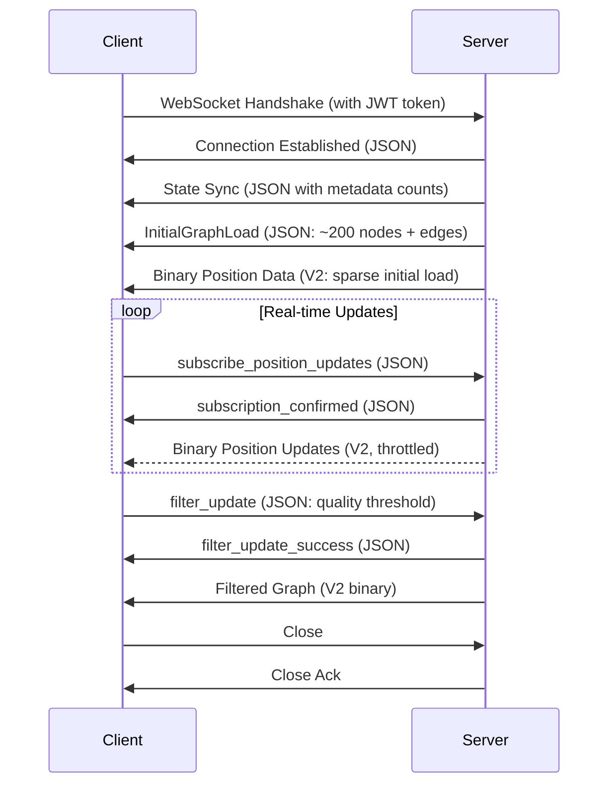

# VisionFlow Binary WebSocket Protocol

⚠️ **Documentation Updated: December 2025**

**Previous version incorrectly described a 36-byte format with mass/charge fields. This document now reflects the actual implementation with three protocol versions (V1/V2/V3) and accurate field layouts.**

---

## Overview

VisionFlow uses a **hybrid JSON + Binary protocol** for WebSocket communication:
- **JSON messages**: Control flow, authentication, initial loads, metadata
- **Binary messages**: High-frequency position streaming (V1/V2/V3)

The binary protocol achieves **~80% bandwidth reduction** compared to pure JSON for large graphs while maintaining sub-10ms latency.

---

## Message Type Overview

| Type | Format | Usage |
|------|--------|-------|
| **Control Messages** | JSON | Authentication, filter updates, state sync |
| **Initial Graph Load** | JSON | Nodes + edges + metadata on connect |
| **Position Updates** | Binary (V1/V2/V3) | Real-time position streaming |
| **Position Snapshots** | Binary (V2/V3) | Full state sync on request |

---

## Binary Protocol Versions

### Version Detection

Server sends protocol version as first byte of binary messages:

```
[0] = Protocol Version (u8)
[1..N] = Payload (version-specific)
```

| Version | Byte Size | Status | Use Case |
|---------|-----------|--------|----------|
| **V1** | 34 bytes/node | DEPRECATED | Legacy clients, node IDs ≤ 16383 |
| **V2** | 36 bytes/node | **CURRENT** | Production, full u32 node IDs |
| **V3** | 48 bytes/node | STABLE | Analytics extension (clustering, anomaly detection) |
| **V4** | 16 bytes/change | EXPERIMENTAL | Delta encoding (60-80% bandwidth reduction) |

---

## Protocol V2 (Current Standard)

### Wire Format: 36 Bytes Per Node

> **See detailed byte layout diagram:** [Binary Protocol Complete - Position Update V2](../diagrams/infrastructure/websocket/binary-protocol-complete.md#3-position-update-v2-21-bytes-per-node)

**Summary:**
- Protocol Version (u8) = 2 at offset [0]
- Node ID (u32) with type flags at [1-4]
- Position X/Y/Z (3×f32) at [5-16]
- Velocity X/Y/Z (3×f32) at [17-28]
- SSSP Distance (f32) at [29-32]
- SSSP Parent (i32) at [33-36]

Total Message Size = 1 + (36 * node_count) bytes

### Field Specifications

| Field | Type | Bytes | Endianness | Description |
|-------|------|-------|------------|-------------|
| **Node ID** | u32 | 4 | Little | Bits 0-29: ID (0 to 1,073,741,823)<br>Bits 30-31: Type flags (see below) |
| **Position X/Y/Z** | f32 | 12 | Little | 3D world coordinates (arbitrary units) |
| **Velocity X/Y/Z** | f32 | 12 | Little | Physics velocity (units/sec) |
| **SSSP Distance** | f32 | 4 | Little | Single-source shortest path distance (default: `f32::INFINITY`) |
| **SSSP Parent** | i32 | 4 | Little | Parent node in SSSP tree (default: `-1`) |

### Node Type Flags (u32 ID Field)

Server encodes node types in the high bits of the node ID:

```rust
// Flag constants (bits 30-31)
const AGENT_NODE_FLAG: u32 = 0x80000000;      // Bit 31
const KNOWLEDGE_NODE_FLAG: u32 = 0x40000000;  // Bit 30
const NODE_ID_MASK: u32 = 0x3FFFFFFF;         // Bits 0-29

// Ontology type flags (bits 26-28, only for GraphType::Ontology)
const ONTOLOGY_CLASS_FLAG: u32 = 0x04000000;      // Bit 26
const ONTOLOGY_INDIVIDUAL_FLAG: u32 = 0x08000000; // Bit 27
const ONTOLOGY_PROPERTY_FLAG: u32 = 0x10000000;   // Bit 28
```

**Client decoding example:**
```typescript
const nodeIdRaw = view.getUint32(offset, true); // Little-endian
const actualId = nodeIdRaw & 0x3FFFFFFF;
const isAgent = (nodeIdRaw & 0x80000000) !== 0;
const isKnowledge = (nodeIdRaw & 0x40000000) !== 0;
```

---

## Protocol V1 (Legacy, Deprecated)

### Wire Format: 34 Bytes Per Node

**⚠️ BUG:** Only supports node IDs 0-16383 (14 bits). IDs > 16383 get truncated!

> **See detailed byte layout diagram:** [Binary Protocol Complete - Protocol V1 Legacy](../diagrams/infrastructure/websocket/binary-protocol-complete.md#protocol-versions)

**Summary:**
- Protocol Version (u8) = 1 at offset [0]
- Node ID (u16) with type flags at [1-2]
- Position X/Y/Z (3×f32) at [3-14]
- Velocity X/Y/Z (3×f32) at [15-26]
- SSSP Distance (f32) at [27-30]
- SSSP Parent (i32) at [31-34]

Total Message Size = 1 + (34 * node_count) bytes

**Migration Note:** V1 is automatically used only when all node IDs ≤ 16383. Otherwise, server upgrades to V2.

---

## Protocol V3 (Analytics Extension)

### Wire Format: 48 Bytes Per Node

Extends V2 with machine learning analytics fields:

> **See detailed analytics extension diagram:** [Binary Protocol Complete - Agent State Messages](../diagrams/infrastructure/websocket/binary-protocol-complete.md#binary-message-formats)

**Summary:**
- Protocol Version (u8) = 3 at offset [0]
- V2 Fields (Node ID, Pos, Vel, SSSP) at [1-36]
- Cluster ID (u32, K-means) at [37-40]
- Anomaly Score (f32, LOF 0.0-1.0) at [41-44]
- Community ID (u32, Louvain) at [45-48]

Total Message Size = 1 + (48 * node_count) bytes

**Additional Fields:**

| Field | Type | Description |
|-------|------|-------------|
| **Cluster ID** | u32 | K-means cluster assignment (0 = unassigned) |
| **Anomaly Score** | f32 | LOF (Local Outlier Factor) score: 0.0 = normal, 1.0 = anomaly |
| **Community ID** | u32 | Louvain community detection (0 = unassigned) |

---

## Protocol V4 (Delta Encoding - Experimental)

### Motivation

Full state updates send redundant data for static nodes. Delta encoding achieves **60-80% bandwidth reduction** by only sending changes.

### Wire Format: 16 Bytes Per Changed Node

```
┌─────────┬────────────────────────────────────────────┐
│ Offset  │ Field (Type, Bytes)                        │
├─────────┼────────────────────────────────────────────┤
│ [0]     │ Protocol Version (u8) = 4                  │ Header
├─────────┼────────────────────────────────────────────┤
│ [1-4]   │ Node ID (u32) with type flags             │ Per Change
│ [5]     │ Change Flags (u8, bit field)              │ (16 bytes)
│ [6-8]   │ Padding (3 bytes, reserved)               │
│ [9-10]  │ Delta Position X (i16, scaled)            │
│ [11-12] │ Delta Position Y (i16, scaled)            │
│ [13-14] │ Delta Position Z (i16, scaled)            │
│ [15-16] │ Delta Velocity X (i16, scaled)            │
│ [17-18] │ Delta Velocity Y (i16, scaled)            │
│ [19-20] │ Delta Velocity Z (i16, scaled)            │
└─────────┴────────────────────────────────────────────┘

Total Message Size = 1 + (16 * changed_node_count) bytes
```

### Delta Encoding Details

**Change Flags (bit field):**
```rust
const DELTA_POSITION_CHANGED: u8 = 0x01;
const DELTA_VELOCITY_CHANGED: u8 = 0x02;
```

**Scale Factor:** 100.0 (converts f32 to i16 with 0.01 precision)

**Resync Interval:** Frame 0 and every 60 frames send full V2 state

---

## Client Protocol Extensions

The TypeScript client (`BinaryWebSocketProtocol.ts`) implements a **header-based protocol** for additional message types:

### Message Header (4-5 bytes)

> **See message header structure:** [Binary Protocol Complete - Message Header](../diagrams/infrastructure/websocket/binary-protocol-complete.md#1-message-header-all-messages)

**Summary:**
- Byte [0]: Message Type (u8)
- Byte [1]: Protocol Version (u8)
- Bytes [2-3]: Payload Length (u16 LE)
- Byte [4]: Graph Type Flag (u8)* (*Only for GRAPH_UPDATE)
```

### Message Types

| Type | Code | Description |
|------|------|-------------|
| GRAPH_UPDATE | 0x01 | Graph topology changes |
| VOICE_DATA | 0x02 | Voice communication |
| POSITION_UPDATE | 0x10 | Client-side position changes |
| AGENT_STATE_FULL | 0x20 | Full agent state (health, CPU, memory) |
| CONTROL_BITS | 0x30 | Control flags |
| HEARTBEAT | 0x33 | Keep-alive ping |
| VOICE_CHUNK | 0x40 | Chunked voice data |
| ERROR | 0xFF | Error response |

---

## Server Implementation (Rust)

### Encoding Example (V2)

```rust
use crate::utils::binary_protocol;

// Encode nodes with type flags
let nodes: Vec<(u32, BinaryNodeData)> = vec![
    (1, BinaryNodeData { node_id: 1, x: 0.0, y: 0.0, z: 0.0, vx: 0.0, vy: 0.0, vz: 0.0 }),
    (2, BinaryNodeData { node_id: 2, x: 1.0, y: 1.0, z: 1.0, vx: 0.0, vy: 0.0, vz: 0.0 }),
];
let agent_ids = vec![2]; // Node 2 is an agent
let knowledge_ids = vec![1]; // Node 1 is knowledge

let binary_data = binary_protocol::encode_node_data_with_types(
    &nodes,
    &agent_ids,
    &knowledge_ids
);

// Send via WebSocket
ctx.binary(binary_data);
```

### Decoding Example (V2)

```rust
match binary_protocol::decode_node_data(&data) {
    Ok(nodes) => {
        for (node_id, node_data) in nodes {
            let actual_id = binary_protocol::get_actual_node_id(node_id);
            let is_agent = binary_protocol::is_agent_node(node_id);

            println!("Node {}: pos=[{:.3}, {:.3}, {:.3}], agent={}",
                actual_id, node_data.x, node_data.y, node_data.z, is_agent);
        }
    }
    Err(e) => eprintln!("Decode error: {}", e),
}
```

---

## Client Implementation (TypeScript)

### Decoding Example (V2)

```typescript
import { binaryProtocol, PROTOCOL_V2 } from './BinaryWebSocketProtocol';

ws.onmessage = (event) => {
    if (event.data instanceof ArrayBuffer) {
        const view = new DataView(event.data);
        const version = view.getUint8(0);

        if (version === PROTOCOL_V2) {
            const nodeCount = (event.data.byteLength - 1) / 36;

            for (let i = 0; i < nodeCount; i++) {
                const offset = 1 + (i * 36); // +1 for version byte

                const nodeIdRaw = view.getUint32(offset, true);
                const actualId = nodeIdRaw & 0x3FFFFFFF;
                const isAgent = (nodeIdRaw & 0x80000000) !== 0;

                const position = {
                    x: view.getFloat32(offset + 4, true),
                    y: view.getFloat32(offset + 8, true),
                    z: view.getFloat32(offset + 12, true),
                };

                const velocity = {
                    x: view.getFloat32(offset + 16, true),
                    y: view.getFloat32(offset + 20, true),
                    z: view.getFloat32(offset + 24, true),
                };

                updateNodeInScene(actualId, position, velocity, isAgent);
            }
        }
    }
};
```

---

## WebSocket Message Flow

### Connection Lifecycle



### Initial Load Strategy

**Problem:** Full graph loads (>100K nodes) overwhelm clients.

**Solution:** Sparse initial load with client-driven expansion:
1. Server sends top 200 nodes (sorted by quality score)
2. Client renders fast initial view
3. Client requests more via filter settings (`filter_update` message)
4. Server sends incremental batches matching filter criteria

---

## Performance Characteristics

### Bandwidth Comparison (100K nodes)

| Protocol | Message Size | vs JSON | Latency (1Gbps) |
|----------|--------------|---------|-----------------|
| JSON | 18 MB | - | 144 ms |
| Binary V1 | 3.4 MB | 81% smaller | 27 ms |
| Binary V2 | 3.6 MB | 80% smaller | 29 ms |
| Binary V3 | 4.8 MB | 73% smaller | 38 ms |
| Binary V4 (delta) | 0.7-1.4 MB | 92-96% smaller | 5-11 ms |

### CPU Overhead (per frame, 100K nodes)

| Operation | V2 Time | V4 Delta Time |
|-----------|---------|---------------|
| Server Encode | 1.2 ms | 3.5 ms (first frame), 0.4 ms (delta) |
| Client Decode | 0.8 ms | 0.2 ms (delta) |

**Hardware:** Ryzen 9 5950X, Chrome 120

---

## Version Negotiation

### Automatic Protocol Selection

Server automatically selects protocol version based on graph characteristics:

```rust
pub fn needs_v2_protocol(nodes: &[(u32, BinaryNodeData)]) -> bool {
    nodes.iter().any(|(node_id, _)| {
        let actual_id = get_actual_node_id(*node_id);
        actual_id > 0x3FFF // 16383
    })
}
```

**Decision logic:**
1. If any node ID > 16383 → **V2 required**
2. If analytics requested → **V3**
3. If delta encoding enabled → **V4**
4. Otherwise → **V2 (default)**

---

## Known Limitations

### Protocol V1
- ❌ **Critical Bug:** Node IDs > 16383 get truncated to 14 bits, causing ID collisions
- ❌ Only supports 16,384 unique nodes per graph type
- ⚠️ **Recommendation:** Migrate to V2 immediately

### Protocol V2
- ✅ Supports 1,073,741,823 unique node IDs
- ✅ Production-stable since Nov 2025
- ⚠️ No compression (use `permessage-deflate` for 2-3x savings)

### Protocol V3
- ✅ Analytics fields populated by backend ML pipeline
- ⚠️ Requires clustering/anomaly detection modules enabled
- ⚠️ 33% larger than V2 (trade-off for richer data)

### Protocol V4
- ⚠️ Experimental (not production-ready)
- ❌ Requires client state tracking (complex)
- ❌ Resync every 60 frames adds latency spikes

---

## Future Improvements

### Planned for 2026

1. **Compression Protocol (V5)**
   - Zstandard dictionary compression
   - Estimated 5-10x bandwidth reduction vs V2
   - GPU-accelerated decode on client

2. **Adaptive Delta Encoding**
   - Dynamic resync intervals based on motion
   - Hybrid V2/V4 switching per-node

3. **Multi-Stream Multiplexing**
   - Separate WebSocket streams for:
     - High-frequency position updates (V4)
     - Low-frequency metadata (JSON)
     - Voice/analytics (V3)

4. **QUIC Migration**
   - Replace WebSocket with HTTP/3 QUIC
   - 0-RTT connection resumption
   - Better loss recovery

---

## Historical Context

### Why Multiple Versions?

**V1 (2024):** Initial binary protocol, quickly hit 16383 node limit on large graphs.

**V2 (Nov 2025):** Emergency fix for node ID truncation bug. Expanded to u32 IDs, added ontology type flags.

**V3 (Dec 2025):** Analytics team needed clustering/anomaly data for visualization. Extended V2 with 12 bytes.

**V4 (2026):** Delta encoding experiment to reduce bandwidth for mostly-static graphs (ontologies, knowledge bases).

### Why SSSP Fields?

SSSP (Single-Source Shortest Path) fields enable:
- Graph exploration UI (highlight paths from selected node)
- Distance-based filtering (show nodes within N hops)
- Centrality visualization (color by distance from root)

Default values (`INFINITY`, `-1`) mean "not yet computed" or "no parent."

---

## Error Handling

### Invalid Message Size

```typescript
if (buffer.byteLength < 1) {
    throw new Error('Empty binary message');
}

const version = view.getUint8(0);
const expectedSize = version === 2 ? 36 : version === 3 ? 48 : 34;
const payloadSize = buffer.byteLength - 1;

if (payloadSize % expectedSize !== 0) {
    console.error(`Invalid V${version} message: ${payloadSize} bytes (expected multiple of ${expectedSize})`);
    return;
}
```

### Malformed Data

```typescript
if (!isFinite(position.x) || !isFinite(position.y) || !isFinite(position.z)) {
    console.warn(`Node ${actualId} has invalid position: NaN or Infinity`);
    return; // Skip this node
}
```

### Version Mismatch

```typescript
const supportedVersions = [2, 3]; // V1 deprecated
if (!supportedVersions.includes(version)) {
    throw new Error(`Unsupported protocol version: ${version}`);
}
```

---

## Security Considerations

1. **Authentication**
   - All WebSocket connections require valid JWT token (query string or `authenticate` message)
   - Tokens validated via Nostr NIP-98 signatures

2. **Rate Limiting**
   - 60 binary updates/second per client IP
   - Enforced by `WEBSOCKET_RATE_LIMITER` in `socket_flow_handler.rs`

3. **Buffer Overflow Protection**
   - Client validates message size before parsing
   - Server rejects messages > 100MB

4. **Data Validation**
   - Server validates all f32 fields are finite
   - Node IDs checked against database before sending

---

## Testing

### Unit Tests (Rust)

```bash
cd project
cargo test binary_protocol
```

**Key tests:**
- `test_wire_format_size`: Validates V1=34, V2=36, V3=48
- `test_encode_decode_roundtrip`: Ensures lossless V2 encode/decode
- `test_large_node_id_no_truncation`: Verifies V2 handles IDs > 16383
- `test_v1_backwards_compatibility`: Legacy V1 decode still works

### Integration Tests (TypeScript)

```bash
cd client
npm test -- BinaryWebSocketProtocol.test.ts
```

---

## References

- **Server Code:** `src/utils/binary_protocol.rs`
- **Client Code:** `client/src/services/BinaryWebSocketProtocol.ts`
- **WebSocket Handler:** `src/handlers/socket_flow_handler.rs`
- **Analytics Pipeline:** `src/services/analytics_service.rs` (V3 fields)

---

**Specification Version:** 3.0 (Accurate)
**Last Verified:** December 2, 2025
**Implementation:** VisionFlow Server v0.1.0+
**Maintainer:** VisionFlow Core Team
