# Legacy Knowledge Graph - Architecture Diagrams

## System Overview

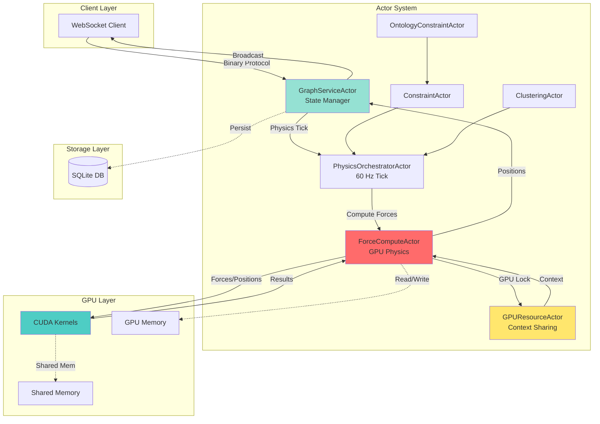

## GPU Kernel Pipeline

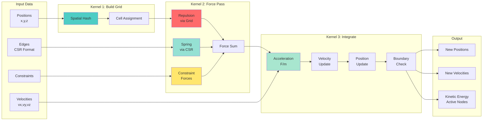

## Clustering Pipeline

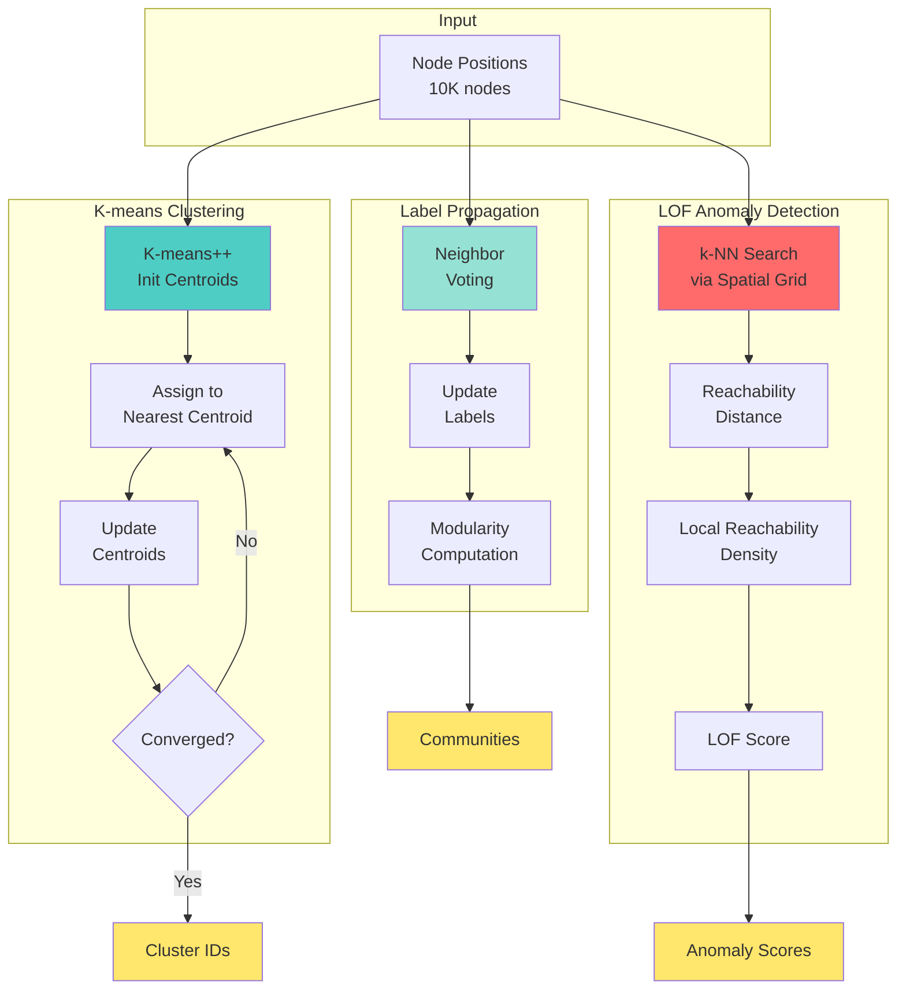

## SSSP Hybrid Architecture

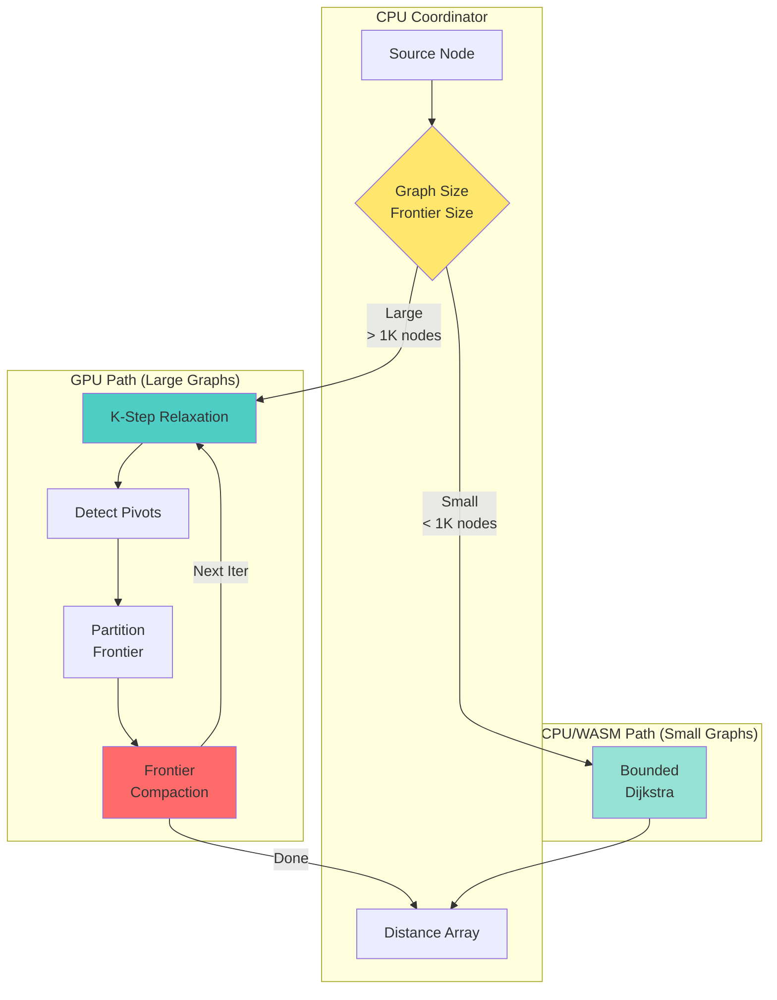

## Constraint Application Flow

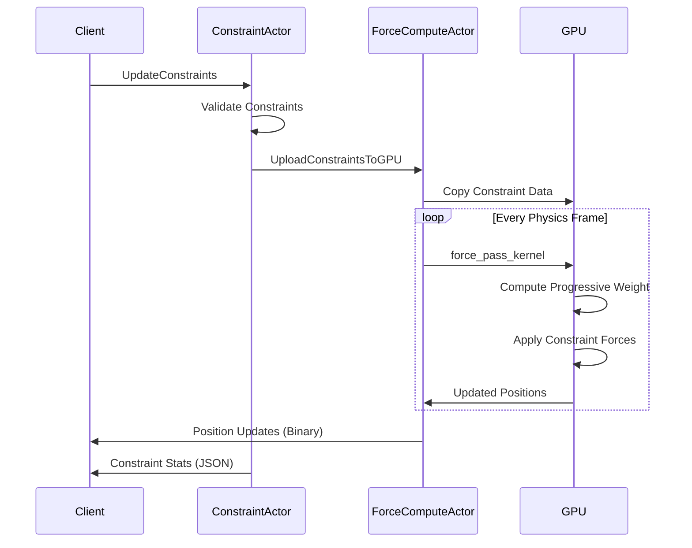

## Adaptive Throttling Logic

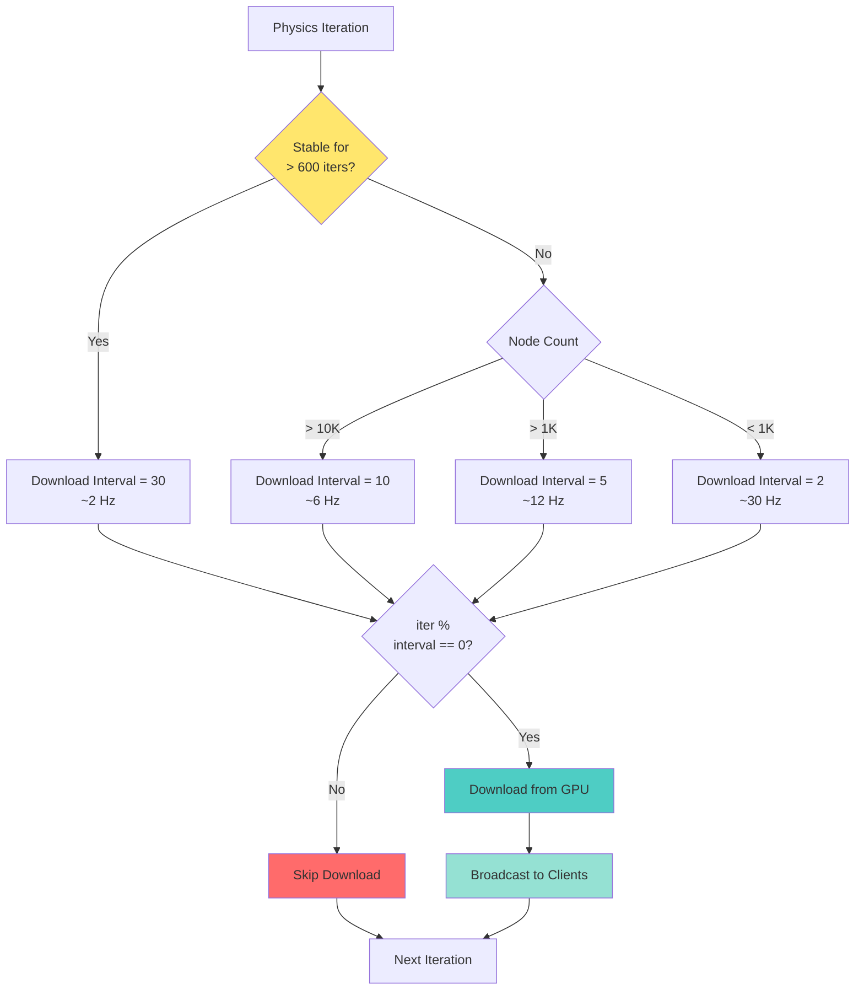

## Stability Gate Decision

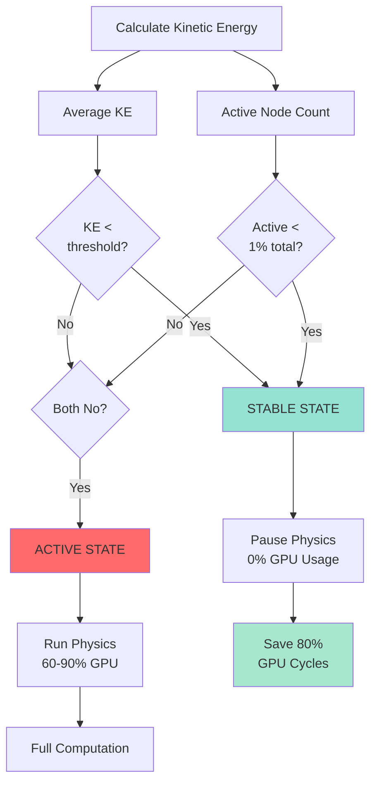

## Database Schema Relationships

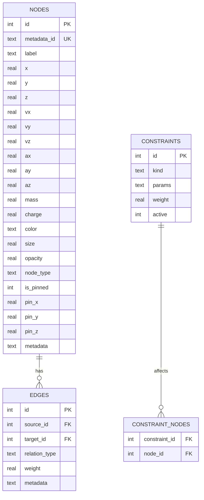

## Memory Layout

```mermaid
graph TB
    subgraph "GPU Memory (~1.2 MB for 10K nodes)"
        subgraph "Node Arrays"
            POS_X[pos_x: 40 KB]
            POS_Y[pos_y: 40 KB]
            POS_Z[pos_z: 40 KB]
            VEL_X[vel_x: 40 KB]
            VEL_Y[vel_y: 40 KB]
            VEL_Z[vel_z: 40 KB]
            MASS[mass: 40 KB]
            CHARGE[charge: 40 KB]
        end

        subgraph "Edge Arrays (CSR)"
            ROW[row_offsets: 40 KB]
            COL[col_indices: 200 KB]
            WEIGHT[weights: 200 KB]
        end

        subgraph "Spatial Grid"
            GRID_KEY[grid_keys: 40 KB]
            CELL_START[cell_start: 100 KB]
            CELL_END[cell_end: 100 KB]
        end

        subgraph "Constraints"
            CONS_DATA[constraint_data: ~10 KB]
        end
    end

    TOTAL[Total: ~1.2 MB] --> POS_X
    TOTAL --> ROW
    TOTAL --> GRID_KEY
    TOTAL --> CONS_DATA

    style TOTAL fill:#ffe66d
    style POS_X fill:#4ecdc4
    style ROW fill:#95e1d3
    style GRID_KEY fill:#ff6b6b
```

## Performance Scaling

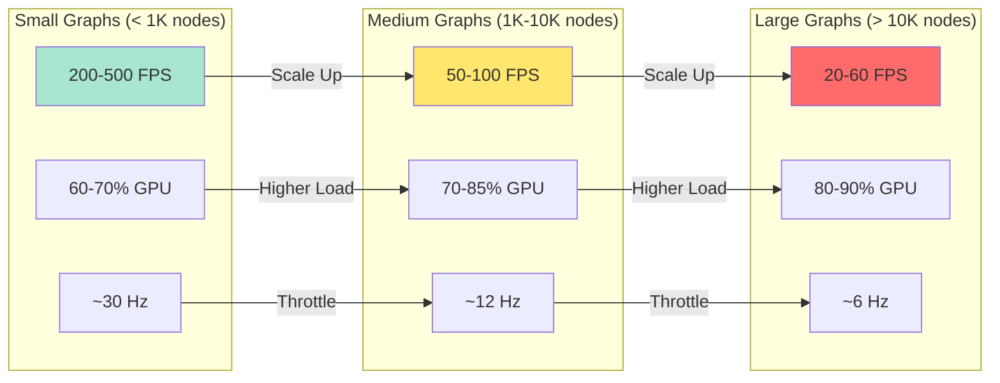

## Concurrency Model

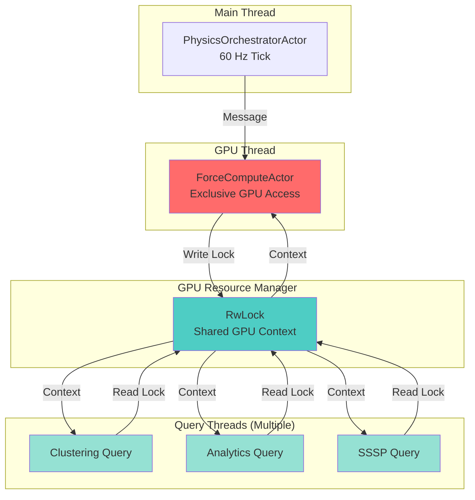

---

## Notes

These diagrams visualize the key architectural patterns found in the legacy knowledge graph system. They serve as reference for understanding data flow, concurrency, and performance characteristics during migration.

**See Also**:
- Full Analysis: `Legacy-Knowledge-Graph-System-Analysis.md`
- Executive Summary: `EXECUTIVE-SUMMARY.md`
