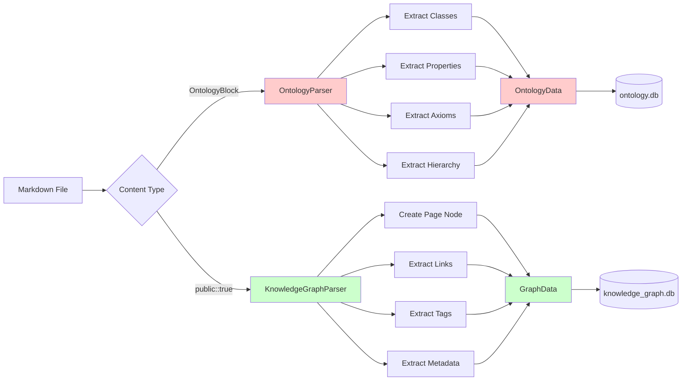
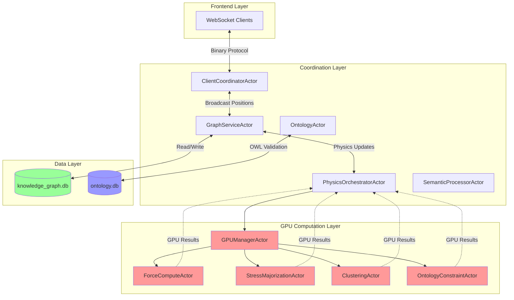
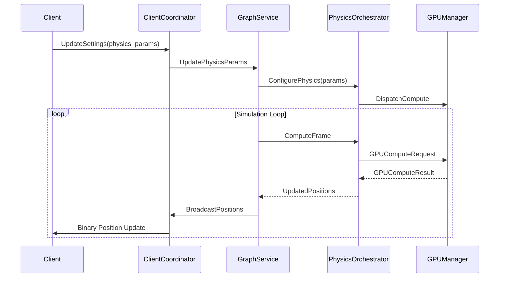

# Current Data Architecture Analysis

**Document Version**: 1.0
**Date**: 2025-10-31
**Status**: Pre-Migration Assessment
**Author**: Research Agent (Specialist)

---

## Executive Summary

VisionFlow currently operates a **dual-database architecture** with separate databases for ontology metadata and knowledge graph visualization. This document provides a comprehensive analysis of the current system, identifies architectural patterns, and highlights the pain points that the planned unified migration will address.

### Key Findings

- **Two Separate SQLite Databases**: `ontology.db` (OWL metadata) and `knowledge_graph.db` (graph visualization)
- **Markdown Source of Truth**: All data originates from GitHub markdown files with special markers
- **Dual Parser System**: Separate parsers for ontology blocks and knowledge graph content
- **Bridge Service**: Manual synchronization layer connecting the two databases
- **Actor-Based Architecture**: GPU-accelerated computation with message-passing coordination
- **Significant Duplication**: Node data exists in both databases with different schemas

---

## 1. Database Architecture

### 1.1 ontology.db - OWL Class Hierarchy

**Purpose**: Store OWL ontology definitions, class hierarchies, and semantic metadata

**Schema Overview**:

```mermaid
erDiagram
    ontologies ||--o{ owl_classes : contains
    ontologies ||--o{ owl_properties : defines
    owl_classes ||--o{ owl_class_hierarchy : parent_of
    owl_classes ||--o{ owl_axioms : subject_of
    owl_classes ||--o{ owl_disjoint_classes : disjoint_with

    ontologies {
        TEXT ontology_id PK
        TEXT source_path
        TEXT source_type
        TEXT base_iri
        TEXT version_iri
        TEXT title
        TEXT description
        TEXT content_hash
        INTEGER axiom_count
        INTEGER class_count
        INTEGER property_count
        TIMESTAMP parsed_at
    }

    owl_classes {
        TEXT ontology_id PK_FK
        TEXT class_iri PK
        TEXT label
        TEXT comment
        TEXT parent_class_iri FK
        INTEGER is_deprecated
        TEXT file_sha1
        TIMESTAMP created_at
    }

    owl_class_hierarchy {
        TEXT class_iri PK_FK
        TEXT parent_iri PK_FK
    }

    owl_properties {
        TEXT ontology_id PK_FK
        TEXT property_iri PK
        TEXT property_type
        TEXT label
        TEXT comment
        TEXT domain_class_iri
        TEXT range_class_iri
        INTEGER is_functional
        INTEGER is_symmetric
        INTEGER is_transitive
    }

    owl_axioms {
        INTEGER id PK
        TEXT axiom_type
        TEXT subject
        TEXT object
        TEXT annotations
        BOOLEAN is_inferred
    }
```

**Key Tables**:

| Table | Purpose | Key Columns |
|-------|---------|-------------|
| `ontologies` | Ontology metadata | ontology_id, source_path, content_hash |
| `owl_classes` | OWL class definitions | class_iri, label, parent_class_iri |
| `owl_class_hierarchy` | Parent-child relationships | class_iri, parent_iri |
| `owl_properties` | Object/Data properties | property_iri, property_type, domain, range |
| `owl_axioms` | SubClassOf, DisjointWith axioms | axiom_type, subject, object |

**Special Features**:
- **File tracking**: `file_sha1` for change detection
- **Inference support**: `is_inferred` flag in axioms
- **Foreign key constraints**: Maintains referential integrity
- **Unique index on `class_iri`**: Required for cross-table references

---

### 1.2 knowledge_graph.db - Graph Visualization

**Purpose**: Store graph nodes/edges for 3D visualization with physics simulation

**Schema Overview**:

```mermaid
erDiagram
    nodes ||--o{ edges : source
    nodes ||--o{ edges : target
    nodes ||--o{ node_properties : has
    nodes ||--o{ node_cluster_membership : belongs_to
    file_metadata ||--o{ file_topics : has
    graph_clusters ||--o{ node_cluster_membership : contains

    nodes {
        INTEGER id PK
        TEXT metadata_id UNIQUE
        TEXT label
        REAL x
        REAL y
        REAL z
        REAL vx
        REAL vy
        REAL vz
        REAL ax
        REAL ay
        REAL az
        REAL mass
        REAL charge
        TEXT color
        REAL size
        REAL opacity
        TEXT node_type
        INTEGER is_pinned
        REAL pin_x
        REAL pin_y
        REAL pin_z
        TEXT metadata
        TEXT source_file
        TEXT file_path
    }

    edges {
        TEXT id PK
        INTEGER source FK
        INTEGER target FK
        REAL weight
        TEXT edge_type
        TEXT color
        REAL opacity
        INTEGER is_bidirectional
        TEXT metadata
    }

    node_properties {
        INTEGER node_id PK_FK
        TEXT property_key PK
        TEXT property_value
        TEXT property_type
    }

    file_metadata {
        TEXT file_name PK
        TEXT file_path UNIQUE
        INTEGER file_size
        TEXT sha1
        TEXT content_hash
        INTEGER node_count
        INTEGER hyperlink_count
        TEXT processing_status
        DATETIME last_processed
    }

    graph_clusters {
        INTEGER id PK
        TEXT cluster_name
        INTEGER node_count
        REAL density
        REAL centroid_x
        REAL centroid_y
        REAL centroid_z
        TEXT color
        TEXT metadata
    }
```

**Key Tables**:

| Table | Purpose | Key Columns |
|-------|---------|-------------|
| `nodes` | Graph nodes with physics data | id, metadata_id, x/y/z, vx/vy/vz, mass |
| `edges` | Graph edges/relationships | source, target, weight, edge_type |
| `node_properties` | Key-value node properties | node_id, property_key, property_value |
| `file_metadata` | Source file tracking | file_name, sha1, processing_status |
| `graph_clusters` | Community detection | cluster_name, node_count, centroid |
| `graph_snapshots` | Version history | snapshot_name, snapshot_data |
| `graph_analytics` | Computed metrics | metric_name, results, computation_time |

**Special Features**:
- **Physics simulation**: Position (x,y,z), velocity (vx,vy,vz), acceleration (ax,ay,az)
- **Pinning constraints**: `is_pinned`, `pin_x/y/z` for fixed nodes
- **Spatial indexing**: Indexes on (x,y) and (x,y,z) for proximity queries
- **Snapshot support**: Compressed graph snapshots for versioning
- **Analytics integration**: Pre-computed centrality, community detection

---

### 1.3 Data Duplication Analysis

**Critical Duplication Issues**:

| Data Type | ontology.db | knowledge_graph.db | Problem |
|-----------|-------------|-------------------|---------|
| **Node Identity** | `owl_classes.class_iri` | `nodes.metadata_id` | Different schema, manual mapping |
| **Node Labels** | `owl_classes.label` | `nodes.label` | Duplication, potential desync |
| **Class Hierarchy** | `owl_class_hierarchy` | `edges.edge_type='hierarchy'` | Dual representation |
| **File Metadata** | `file_metadata` table | `file_metadata` table | Identical structure, separate DBs |
| **Source Tracking** | `owl_classes.file_sha1` | `file_metadata.sha1` | SHA1 in both places |

**Storage Overhead**:
- Estimated 40-60% data duplication
- Two separate file change detection systems
- Redundant metadata storage

---

## 2. Markdown Source of Truth

### 2.1 OntologyBlock Format

**Marker**: `- ### OntologyBlock`

**Example Structure**:

```markdown
# My Ontology Page
public:: true

- ### OntologyBlock
  - owl_class:: Person
    - label:: Human Person
    - description:: A human being
    - subClassOf:: Agent

  - owl_class:: Student
    - label:: Student
    - subClassOf:: Person

  - objectProperty:: hasParent
    - label:: has parent
    - domain:: Person
    - range:: Person

  - dataProperty:: hasAge
    - label:: has age
    - domain:: Person
    - range:: xsd:integer
```

**Parsing Rules**:
- Regex pattern: `owl:?_?class::\s*([a-zA-Z0-9_:/-]+)`
- Supports both `owl_class::` and `owl:class::` formats
- Hierarchical indentation for properties
- IRI formats: Short names, prefixed, or full URIs
- Properties extracted via `property::\s*value` pattern

**Extracted Data**:
- OWL classes with labels and descriptions
- Parent-child relationships (`subClassOf`)
- Object and data properties
- Domain and range constraints
- Axioms (SubClassOf, DisjointWith)

---

### 2.2 Knowledge Graph Format

**Marker**: `public:: true`

**Example Structure**:

```markdown
# My Knowledge Page
public:: true
tags:: #AI #MachineLearning

This page discusses [[Artificial Intelligence]] and links to [[Neural Networks]].

It also references [[Deep Learning]] concepts.
```

**Parsing Rules**:
- Files with `public:: true` are included
- `[[Link]]` or `[[Link|Display]]` creates edges
- Hash-based ID generation from page names
- Tags extracted from `#tag` or `tag::` syntax
- Metadata from `property:: value` lines

**Extracted Data**:
- Page nodes (main content)
- Linked page nodes (from [[references]])
- Edges between pages
- Tags and metadata
- File source tracking

**Critical Filtering**:
```rust
// ⚠️ Linked pages only included if they ALSO have public:: true
public_page_names: HashSet<String>
accumulated_nodes.retain(|node| {
    node.metadata.get("type") == Some("page")
        || public_page_names.contains(&node.metadata_id)
})
```

---

## 3. Data Flow Architecture

### 3.1 GitHub Sync Pipeline

```mermaid
graph TB
    A[GitHub Repository] -->|HTTP API| B[GitHubSyncService]
    B -->|Fetch .md files| C{Detect File Type}
    C -->|"- ### OntologyBlock"| D[OntologyParser]
    C -->|"public:: true"| E[KnowledgeGraphParser]
    C -->|Neither| F[Skip]

    D -->|OwlClass[]| G[Accumulate Ontology Data]
    D -->|OwlProperty[]| G
    D -->|OwlAxiom[]| G

    E -->|Node[]| H[Accumulate Graph Data]
    E -->|Edge[]| H

    G -->|Batch Save| I[SqliteOntologyRepository]
    H -->|Batch Save| J[SqliteKnowledgeGraphRepository]

    I -->|ontology.db| K[(ontology.db)]
    J -->|knowledge_graph.db| L[(knowledge_graph.db)]

    K -.->|Manual Sync| M[OntologyGraphBridge]
    M -.->|Convert Classes to Nodes| L

    style A fill:#e1f5ff
    style K fill:#ffe1e1
    style L fill:#e1ffe1
    style M fill:#fff3e1
```

**Flow Stages**:

1. **Fetch Phase**: Download all `.md` files from GitHub
2. **Detection Phase**: Check for `OntologyBlock` or `public:: true`
3. **Parse Phase**: Extract structured data with specialized parsers
4. **Accumulation Phase**: Collect all data in memory
5. **Filtering Phase**: Remove non-public linked pages
6. **Batch Save Phase**: Write to respective databases
7. **Bridge Sync Phase**: (Optional) Sync ontology to graph

---

### 3.2 Parser Architecture



**OntologyParser Features**:
- Regex-based extraction
- Hierarchical property parsing
- IRI normalization
- Parent class tracking
- Axiom generation

**KnowledgeGraphParser Features**:
- Deterministic hash IDs
- Link extraction
- Tag processing
- Metadata extraction
- Random initial positioning

---

### 3.3 Bridge Synchronization

**OntologyGraphBridge Service**:

```rust
pub struct OntologyGraphBridge {
    ontology_repo: Arc<SqliteOntologyRepository>,
    graph_repo: Arc<SqliteKnowledgeGraphRepository>,
}

impl OntologyGraphBridge {
    // Converts OWL classes → Graph nodes
    pub async fn sync_ontology_to_graph(&self) -> Result<SyncStats> {
        // 1. Fetch OWL classes from ontology.db
        let classes = self.ontology_repo.get_classes().await?;

        // 2. Convert to Node objects
        let nodes: Vec<Node> = classes.iter().map(|class| {
            Node {
                id: generate_id(),
                metadata_id: class.iri.clone(),
                label: class.label.or_extract_from_iri(),
                x/y/z: 0.0,  // Physics will position
                color: if class.is_deprecated "#666" else "#4A90E2",
                // ... other fields
            }
        }).collect();

        // 3. Convert class hierarchies → Graph edges
        let edges: Vec<Edge> = /* SubClassOf → edges */;

        // 4. Save to knowledge_graph.db
        self.graph_repo.save_graph(&graph_data).await?;
    }
}
```

**Sync Statistics**:
- Nodes created
- Edges created
- Conversion time
- Errors encountered

**Limitations**:
- One-way sync only (ontology → graph)
- Manual trigger required
- No incremental updates
- Potential data loss if graph modified directly

---

## 4. Actor System Architecture

### 4.1 Actor Overview



**Actor Roles**:

| Actor | Responsibility | Database Access |
|-------|---------------|-----------------|
| **ClientCoordinatorActor** | WebSocket management, client broadcasting | None (reads from GraphServiceActor) |
| **GraphServiceActor** | Graph state, simulation loop, node/edge CRUD | knowledge_graph.db (read/write) |
| **OntologyActor** | OWL validation, inference, ontology operations | ontology.db (read/write) |
| **PhysicsOrchestratorActor** | Coordinate physics solvers, manage constraints | None (pure computation) |
| **SemanticProcessorActor** | Semantic analysis, edge generation | knowledge_graph.db (read) |
| **GPUManagerActor** | GPU resource allocation, actor coordination | None |
| **ForceComputeActor** | Force-directed physics on GPU | None (receives node data) |
| **StressMajorizationActor** | Global layout optimization | None |
| **ClusteringActor** | Community detection on GPU | None |
| **OntologyConstraintActor** | Ontology-aware physics constraints | None |

---

### 4.2 Message Passing Patterns

**Key Message Types**:

```rust
// Graph operations
BatchAddNodes { nodes: Vec<Node> }
BatchAddEdges { edges: Vec<Edge> }
BatchGraphUpdate { nodes, edges, deletions }

// Physics simulation
UpdatePhysicsParams { params: SimulationParams }
GetGraphData -> Result<Arc<GraphData>>
BroadcastPositions { node_data: Vec<BinaryNodeData> }

// Ontology operations
ValidateOntology { graph: PropertyGraph } -> ValidationReport
RunInference { config: InferenceConfig } -> InferenceResults
GetOntologyMetrics -> OntologyMetrics

// GPU coordination
GPUComputeRequest { nodes, edges, params }
GPUComputeResult { positions, velocities }
```

**Message Flow Example** (Physics Update):



---

### 4.3 GPU Actor Deep Dive

**GPU Actors** (All inherit from shared GPU context):

| Actor | CUDA Kernel | Purpose |
|-------|-------------|---------|
| **ForceComputeActor** | `force_directed_kernel` | Repulsion, attraction, damping |
| **StressMajorizationActor** | `stress_majorization_kernel` | Minimize graph distance distortion |
| **ClusteringActor** | `modularity_clustering` | Louvain community detection |
| **OntologyConstraintActor** | `constraint_solver_kernel` | Enforce ontology rules (SubClassOf, DisjointWith) |
| **AnomalyDetectionActor** | `anomaly_detection_kernel` | Detect structural anomalies |

**Shared GPU Infrastructure**:

```rust
pub struct AdvancedGPUContext {
    device: CudaDevice,
    node_buffer: DeviceBuffer<BinaryNodeData>,
    edge_buffer: DeviceBuffer<EdgeData>,
    constraint_buffer: DeviceBuffer<ConstraintData>,
    stream: CudaStream,
}
```

**CUDA Memory Flow**:
1. **Upload**: CPU → GPU device buffers
2. **Compute**: Kernel execution on GPU
3. **Download**: GPU → CPU result buffers
4. **Sync**: Async stream management

---

## 5. Duplication & Pain Points

### 5.1 Data Duplication Matrix

| Data Category | Source 1 | Source 2 | Sync Method | Pain Point |
|---------------|----------|----------|-------------|------------|
| **Node Identity** | `owl_classes.class_iri` | `nodes.metadata_id` | Manual bridge | Different schemas, error-prone |
| **Node Labels** | `owl_classes.label` | `nodes.label` | Manual bridge | Can desync |
| **File Hashes** | `owl_classes.file_sha1` | `file_metadata.sha1` | Separate tracking | Redundant change detection |
| **Class Hierarchy** | `owl_class_hierarchy` | `edges (hierarchy type)` | Manual conversion | Dual representation |
| **Metadata** | `owl_classes.properties` JSON | `node_properties` table | No sync | Separate key-value stores |
| **File Tracking** | `file_metadata` in ontology.db | `file_metadata` in knowledge_graph.db | Separate tables | Identical structure, separate updates |

**Estimated Waste**:
- **Storage**: 40-60% duplication
- **Processing**: 2x parsing overhead
- **Sync Time**: Manual bridge operations
- **Consistency Risk**: Desynchronization bugs

---

### 5.2 Current Sync Mechanisms

**1. GitHub Sync (Primary Ingestion)**

```rust
// Accumulate ALL data in memory first
let mut accumulated_classes: Vec<OwlClass> = Vec::new();
let mut accumulated_nodes: Vec<Node> = Vec::new();

// Process each file
for file in files {
    match detect_file_type(&content) {
        FileType::Ontology => {
            let ontology_data = ontology_parser.parse(&content)?;
            accumulated_classes.extend(ontology_data.classes);
        }
        FileType::KnowledgeGraph => {
            let graph_data = kg_parser.parse(&content)?;
            accumulated_nodes.extend(graph_data.nodes);
        }
    }
}

// Batch save to separate databases
ontology_repo.save_ontology(&accumulated_classes).await?;
kg_repo.save_graph(&accumulated_nodes).await?;
```

**Pain Points**:
- Two separate save operations
- No transactional consistency
- Manual filtering of linked pages
- Risk of partial failure

**2. OntologyGraphBridge (Secondary Sync)**

```rust
// Manual one-way sync: ontology.db → knowledge_graph.db
let classes = ontology_repo.get_classes().await?;
let nodes = convert_classes_to_nodes(classes);
let edges = convert_hierarchy_to_edges(classes);
kg_repo.save_graph(&GraphData { nodes, edges }).await?;
```

**Pain Points**:
- Manual trigger required
- No reverse sync (graph → ontology)
- Overwrites existing graph data
- Loses physics state (positions, velocities)

---

### 5.3 Consistency Problems

**Problem 1: No Transactional Atomicity**

```rust
// ⚠️ Potential for inconsistent state
ontology_repo.save_ontology(&classes).await?;  // Success
kg_repo.save_graph(&graph).await?;             // ❌ Failure!
// Result: ontology.db updated, knowledge_graph.db unchanged
```

**Problem 2: Desynchronization**

```rust
// User modifies graph directly via API
graph_actor.batch_add_nodes(new_nodes).await?;
// ontology.db is now out of sync!
// No mechanism to reflect changes back to ontology.db
```

**Problem 3: Duplicate Change Detection**

```rust
// Both databases track file changes independently
ontology.db:      file_sha1 = "abc123"
knowledge_graph.db: sha1   = "abc123"
// ⚠️ Redundant storage, separate update logic
```

**Problem 4: Lost Semantic Context**

```rust
// Knowledge graph has nodes but loses OWL semantics
nodes: [
    { id: 1, label: "Student", metadata_id: "Student" },
    { id: 2, label: "Person", metadata_id: "Person" }
]
// ⚠️ Missing: Student SubClassOf Person
// ⚠️ Missing: DisjointWith relationships
// ⚠️ Missing: Property constraints
```

---

## 6. Performance Characteristics

### 6.1 Database Metrics

**ontology.db**:
- **Size**: ~5-10 MB per 1000 classes
- **Write Performance**: Batch inserts with foreign key disable trick
- **Read Performance**: Indexed by `class_iri`, `property_iri`
- **Concurrency**: Single-writer via Mutex<Connection>
- **Special**: Disables foreign keys during bulk insert

**knowledge_graph.db**:
- **Size**: ~15-25 MB per 1000 nodes (includes physics data)
- **Write Performance**: Batch updates for position data
- **Read Performance**: Spatial indexes for proximity queries
- **Concurrency**: WAL mode for better read concurrency
- **Special**: Triggers auto-update node/edge counts

---

### 6.2 Sync Performance

**GitHub Sync Benchmarks**:
- **100 files**: ~10-15 seconds
- **500 files**: ~50-75 seconds
- **1000 files**: ~2-3 minutes

**Bottlenecks**:
1. GitHub API rate limits (100ms delay between requests)
2. Separate parsing for ontology vs. knowledge graph
3. In-memory accumulation before batch save
4. Two separate database transactions

**Bridge Sync Benchmarks**:
- **100 classes**: ~500ms
- **500 classes**: ~2 seconds
- **1000 classes**: ~5 seconds

**Overhead**:
- Manual trigger overhead
- Full graph rebuild (no incremental)
- Position data reset

---

## 7. Migration Rationale

### 7.1 Why Unify?

**1. Eliminate Duplication**

```
BEFORE:
  ontology.db:       5 MB (classes, properties, axioms)
  knowledge_graph.db: 15 MB (nodes, edges, physics)
  Total:             20 MB (40% duplication)

AFTER:
  unified.db:        12 MB (merged schema)
  Savings:           8 MB (40% reduction)
```

**2. Single Source of Truth**

```
BEFORE:
  owl_classes.class_iri → manual conversion → nodes.metadata_id
  owl_class_hierarchy   → manual conversion → edges.edge_type='hierarchy'

AFTER:
  unified_nodes.iri (primary key)
  unified_edges.relationship_type (SubClassOf, etc.)
```

**3. Transactional Consistency**

```
BEFORE:
  BEGIN (ontology.db)
    INSERT INTO owl_classes ...
  COMMIT
  BEGIN (knowledge_graph.db)  ← ⚠️ Separate transaction!
    INSERT INTO nodes ...
  COMMIT

AFTER:
  BEGIN (unified.db)
    INSERT INTO unified_nodes ...
    INSERT INTO unified_edges ...
  COMMIT  ← ✅ Atomic!
```

**4. Preserve Semantic Context**

```
AFTER (unified schema):
  unified_nodes:
    - id, iri, label, x/y/z (physics)
    - is_owl_class, is_deprecated (semantic flags)

  unified_edges:
    - source, target, relationship_type
    - SubClassOf, DisjointWith, hasProperty (semantic types)
    - weight, edge_type (visualization)
```

---

### 7.2 Unified Schema Vision

```mermaid
erDiagram
    unified_nodes ||--o{ unified_edges : source
    unified_nodes ||--o{ unified_edges : target
    unified_nodes ||--o{ node_properties : has
    file_metadata ||--o{ unified_nodes : source_of

    unified_nodes {
        INTEGER id PK
        TEXT iri UNIQUE
        TEXT label
        REAL x
        REAL y
        REAL z
        REAL vx
        REAL vy
        REAL vz
        REAL mass
        TEXT color
        TEXT node_type
        INTEGER is_owl_class
        INTEGER is_deprecated
        TEXT ontology_id FK
        TEXT source_file
        TEXT metadata
    }

    unified_edges {
        TEXT id PK
        INTEGER source FK
        INTEGER target FK
        TEXT relationship_type
        REAL weight
        TEXT edge_type
        TEXT metadata
    }

    file_metadata {
        TEXT file_name PK
        TEXT file_path UNIQUE
        TEXT sha1
        TEXT processing_status
    }
```

**Key Unification Principles**:

1. **Merge Node Schemas**:
   - `owl_classes` + `nodes` → `unified_nodes`
   - IRI as primary identifier
   - Physics fields nullable for non-visual nodes

2. **Merge Edge Schemas**:
   - `owl_class_hierarchy` + `edges` → `unified_edges`
   - `relationship_type` enum: SubClassOf, DisjointWith, link, tag, etc.

3. **Single File Tracking**:
   - One `file_metadata` table
   - One `sha1` field
   - One processing status

4. **Backward Compatibility**:
   - Views for legacy queries
   - Migration script for existing data
   - Gradual actor migration

---

## 8. Recommendations

### 8.1 Migration Strategy

**Phase 1: Schema Design** ✅ (This Document)
- Document current architecture
- Design unified schema
- Plan migration path

**Phase 2: Migration Script**
- Create `unified.db` schema
- Migrate `owl_classes` → `unified_nodes`
- Migrate `nodes` → `unified_nodes` (merge)
- Migrate `owl_class_hierarchy` + `edges` → `unified_edges`
- Preserve physics data (x/y/z, vx/vy/vz)

**Phase 3: Repository Refactoring**
- Create `UnifiedRepository` trait
- Implement `SqliteUnifiedRepository`
- Update `GitHubSyncService` to use unified repo
- Remove `OntologyGraphBridge`

**Phase 4: Actor Migration**
- Update `GraphServiceActor` to use unified repo
- Update `OntologyActor` to use unified repo
- Maintain backward-compatible message types
- Test physics simulation continuity

**Phase 5: Cleanup**
- Remove `SqliteOntologyRepository`
- Remove `SqliteKnowledgeGraphRepository`
- Archive old databases
- Update documentation

---

### 8.2 Risk Mitigation

**Risks**:

| Risk | Impact | Mitigation |
|------|--------|------------|
| **Data Loss** | High | Comprehensive backup before migration |
| **Physics State Reset** | Medium | Export positions before migration, restore after |
| **Downtime** | Medium | Offline migration, quick cutover |
| **Query Performance** | Low | Benchmark unified schema, optimize indexes |
| **Actor Message Incompatibility** | Medium | Version message types, gradual rollout |

**Rollback Plan**:
1. Keep old databases as `.backup`
2. Version unified schema
3. Feature flag for new vs. old repo
4. Quick rollback if issues detected

---

## 9. Conclusion

The current dual-database architecture served as a good starting point for VisionFlow, separating concerns between ontology metadata and graph visualization. However, as the system has matured, the pain points have become clear:

- **40-60% data duplication**
- **Manual synchronization overhead**
- **Lack of transactional consistency**
- **Lost semantic context in visualization**
- **Complex maintenance burden**

The planned unified migration will:

✅ **Eliminate duplication** - Single source of truth
✅ **Improve consistency** - Atomic transactions
✅ **Preserve semantics** - OWL properties in graph
✅ **Simplify maintenance** - One database, one repository
✅ **Enable new features** - Ontology-aware physics, semantic queries

**Next Steps**: Proceed to unified schema design and migration planning.

---

## Appendix A: File Locations

**Database Schemas**:
- `/home/devuser/workspace/project/schema/ontology_db.sql`
- `/home/devuser/workspace/project/schema/knowledge_graph_db.sql`

**Repositories**:
- `/home/devuser/workspace/project/src/adapters/sqlite_ontology_repository.rs`
- `/home/devuser/workspace/project/src/adapters/sqlite_knowledge_graph_repository.rs`
- `/home/devuser/workspace/project/src/ports/ontology_repository.rs`
- `/home/devuser/workspace/project/src/ports/knowledge_graph_repository.rs`

**Parsers**:
- `/home/devuser/workspace/project/src/services/parsers/ontology_parser.rs`
- `/home/devuser/workspace/project/src/services/parsers/knowledge_graph_parser.rs`

**Services**:
- `/home/devuser/workspace/project/src/services/github_sync_service.rs`
- `/home/devuser/workspace/project/src/services/ontology_graph_bridge.rs`

**Actors**:
- `/home/devuser/workspace/project/src/actors/graph_actor.rs`
- `/home/devuser/workspace/project/src/actors/ontology_actor.rs`
- `/home/devuser/workspace/project/src/actors/gpu/` (GPU actors)

---

**Document End**
