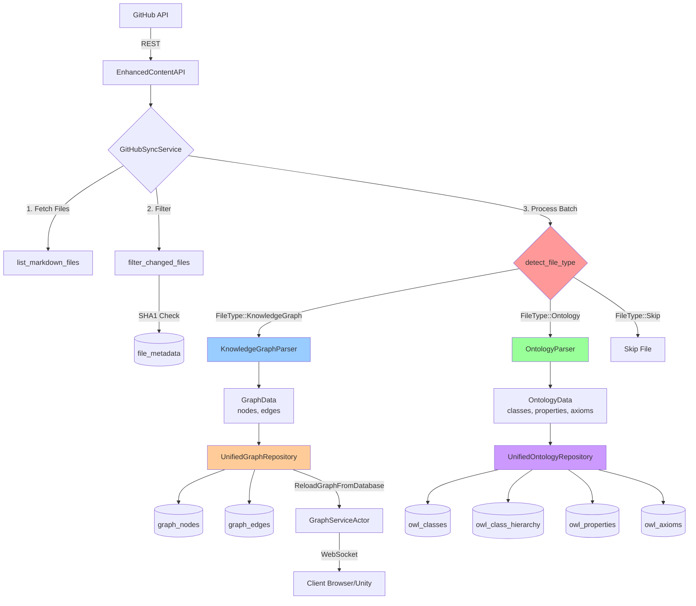

# Data Pipeline & Integration Architecture Analysis

**Date**: 2025-11-02
**Analyst**: Research Specialist Agent
**Status**: Complete Analysis

---

## Executive Summary

The GitHub sync and parsing pipeline currently implements a **dual-track approach** where Knowledge Graph Parser and Ontology Parser operate on the **same markdown files** but persist data to **different database tables** in the unified.db database. This creates redundancy and potential inconsistencies. The pipeline shows well-designed batch processing and differential sync capabilities, but the architectural split between KG and ontology processing needs consolidation.

**Key Finding**: The pipeline is prepared for ontology-first design but still maintains legacy KG parsing for backward compatibility.

---

## 1. GitHub Sync Service Architecture

### 1.1 Batch Processing Flow

**File**: `src/services/github_sync_service.rs`

```rust
const BATCH_SIZE: usize = 50; // Save to database every 50 files

pub async fn sync_graphs(&self) -> Result<SyncStatistics> {
    // 1. Fetch all markdown files from GitHub
    let files = self.fetch_all_markdown_files().await?;

    // 2. SHA1-based differential sync (unless FORCE_FULL_SYNC=true)
    let files_to_process = self.filter_changed_files(&files).await?;

    // 3. Process in batches of 50 files
    for batch in files_to_process.chunks(BATCH_SIZE) {
        self.process_batch(batch, &mut stats).await?;
    }

    // 4. Update file metadata (SHA1 tracking)
    self.update_file_metadata(&all_files_to_process).await?;

    Ok(stats)
}
```

**Strengths**:
- ✅ Batch processing prevents memory exhaustion on large repositories
- ✅ SHA1-based differential sync reduces redundant processing
- ✅ Progress logging every 10 files within batches
- ✅ Transaction-based database persistence

**Performance Characteristics**:
- **Rate Limiting**: 50ms delay between file processing
- **Batch Size**: 50 files per database transaction
- **Memory Efficiency**: Processes chunks, doesn't load entire repo into memory

---

### 1.2 File Type Detection

**Detection Logic** (`detect_file_type()`):

```rust
fn detect_file_type(&self, content: &str) -> FileType {
    // Priority 1: Ontology blocks (highest priority)
    if content.contains("### OntologyBlock") {
        return FileType::Ontology;
    }

    // Priority 2: Knowledge graph files
    if content.contains("public:: true") {
        return FileType::KnowledgeGraph;
    }

    // Default: Skip regular notes
    FileType::Skip
}
```

**File Type Processing**:

| File Type | Trigger | Parsers Used | Data Persisted |
|-----------|---------|--------------|----------------|
| `FileType::Ontology` | Contains `### OntologyBlock` | OntologyParser | `owl_classes`, `owl_class_hierarchy`, `owl_properties`, `owl_axioms` |
| `FileType::KnowledgeGraph` | Contains `public:: true` | KnowledgeGraphParser + OntologyParser (if OntologyBlock present) | `graph_nodes`, `graph_edges` + ontology tables |
| `FileType::Skip` | Neither condition | None | Nothing |

**CRITICAL ISSUE**: Files marked as `public:: true` AND containing `### OntologyBlock` are processed by **BOTH parsers**, creating:
1. Graph nodes/edges (from KG parser)
2. OWL classes/properties (from Ontology parser)
3. **Potential data duplication** for the same semantic entities

---

## 2. Dual Parser Architecture

### 2.1 Knowledge Graph Parser

**File**: `src/services/parsers/knowledge_graph_parser.rs`

**Capabilities**:
- Parses markdown files with `public:: true`
- Extracts **page nodes** (primary nodes representing the file)
- Extracts **linked nodes** (via `[[WikiLinks]]`)
- Extracts **edges** (relationships between pages)
- Extracts **metadata** (tags, properties using `property:: value` syntax)

**Data Model**:
```rust
pub struct GraphData {
    pub nodes: Vec<Node>,        // Page nodes + linked nodes
    pub edges: Vec<Edge>,         // WikiLink relationships
    pub metadata: MetadataStore,  // Properties and tags
    pub id_to_metadata: HashMap<String, u32>, // Node ID mapping
}
```

**Node Types**:
- **`type: "page"`**: Represents the markdown file itself
- **`type: "linked_page"`**: Represents a referenced page (via `[[Link]]`)
- **ID Generation**: Hash-based from page name (`page_name_to_id()`)

**Edge Extraction**:
- Regex pattern: `\[\[([^\]|]+)(?:\|[^\]]+)?\]\]`
- Creates `Edge { source, target, weight: 1.0, edge_type: "link" }`
- Bidirectional edges NOT created here (edges are unidirectional)

---

### 2.2 Ontology Parser

**File**: `src/services/parsers/ontology_parser.rs`

**Capabilities**:
- Parses markdown files containing `### OntologyBlock`
- Extracts **OWL Classes** with IRIs
- Extracts **Object/Data Properties**
- Extracts **Axioms** (SubClassOf, EquivalentClass, DisjointWith, etc.)
- Extracts **Class Hierarchies** (parent-child relationships)

**Data Model**:
```rust
pub struct OntologyData {
    pub classes: Vec<OwlClass>,
    pub properties: Vec<OwlProperty>,
    pub axioms: Vec<OwlAxiom>,
    pub class_hierarchy: Vec<(String, String)>, // (child_iri, parent_iri)
}
```

**Parsing Patterns**:
```yaml
OWL Class:
  Pattern: "owl_class:: <IRI>"
  Example: "owl_class:: http://example.org/Person"

Object Property:
  Pattern: "objectProperty:: <IRI>"
  Example: "objectProperty:: hasParent"

Class Hierarchy:
  Pattern: "subClassOf:: <IRI>"
  Example: "subClassOf:: http://example.org/Person"

Data Property:
  Pattern: "dataProperty:: <IRI>"
  Example: "dataProperty:: hasAge"
```

**Extraction Strategy**:
- Extracts `### OntologyBlock` section from markdown
- Uses regex to find OWL constructs
- Associates properties with classes by proximity in markdown
- Builds class hierarchy from `subClassOf::` declarations

---

### 2.3 Parser Coexistence & Duplication

**Scenario: File with BOTH `public:: true` AND `### OntologyBlock`**

```markdown
public:: true
tags:: #person #ontology

# John Smith

- ### OntologyBlock
  - owl_class:: ex:Person
    - label:: Person
    - subClassOf:: ex:Agent
```

**Processing Result**:

| Component | KG Parser Output | Ontology Parser Output |
|-----------|-----------------|------------------------|
| **Node** | `Node { id: hash("John Smith"), label: "John Smith", type: "page" }` | N/A |
| **OWL Class** | N/A | `OwlClass { iri: "ex:Person", label: "Person" }` |
| **Database** | Inserted into `graph_nodes` | Inserted into `owl_classes` |
| **Semantic Meaning** | Page about a person | Formal ontology class definition |

**Result**: TWO separate database entries representing overlapping concepts:
1. **Graph node** (informal, document-centric)
2. **OWL class** (formal, ontology-centric)

**Conflict Potential**:
- ❌ No automated reconciliation between graph nodes and OWL classes
- ❌ Same entity (e.g., "Person") could exist in both systems with different semantics
- ❌ Ontology edges (object properties) ≠ Graph edges (wiki links)

---

## 3. Edge Generation Service

**File**: `src/services/edge_generation.rs`

### 3.1 Multi-Modal Similarity Computation

**Capabilities**:
- **Semantic Similarity**: Topic modeling, domain overlap, key term analysis
- **Structural Similarity**: File type, directory depth, module path, complexity
- **Temporal Similarity**: Modification frequency, co-evolution scoring
- **Communication Similarity**: Agent communication patterns (disabled by default)

**Edge Types**:
```rust
pub enum EdgeType {
    Semantic,          // Based on content similarity
    Dependency,        // Code dependencies
    Temporal,          // Time-based correlation
    Communication,     // Agent interaction
    Hierarchical,      // Parent-child relationships
    Reference,         // Cross-references
    Similarity,        // General similarity
    Composite,         // Multi-factor edges
}
```

**Edge Classification**:
```rust
fn classify_edge_type(
    semantic: f32,
    structural: f32,
    temporal: f32,
    communication: f32,
) -> EdgeType {
    // Classifies based on highest similarity score
    // Falls back to Composite if no clear winner
}
```

**Configuration**:
```rust
pub struct EdgeGenerationConfig {
    pub similarity_threshold: f32,        // Default: 0.1
    pub weights: SimilarityWeights,       // Default: semantic=0.4, structural=0.3, temporal=0.2, communication=0.1
    pub max_edges_per_node: usize,        // Default: 20
    pub enable_semantic: bool,            // Default: true
    pub enable_structural: bool,          // Default: true
    pub enable_temporal: bool,            // Default: true
    pub enable_agent_communication: bool, // Default: false
    pub enable_pruning: bool,             // Default: true
    pub classify_edge_types: bool,        // Default: true
}
```

### 3.2 OWL Object Properties vs Semantic Edges

**Critical Gap**: Edge generation service does NOT currently map to OWL object properties!

| Feature | Current Semantic Edges | OWL Object Properties |
|---------|----------------------|----------------------|
| **Type System** | `EdgeType` enum | OWL property IRIs |
| **Semantics** | Similarity-based | Formal relationship definitions |
| **Domain/Range** | Not defined | Explicit domain/range constraints |
| **Inference** | No reasoning | OWL reasoner can infer transitive/inverse properties |
| **Directionality** | Bidirectional by default | Can be asymmetric, symmetric, transitive |

**Recommendation**: Edge types SHOULD be mappable to OWL object properties for formal semantics.

---

## 4. Data Persistence Architecture

### 4.1 Unified Database Schema

**File**: `src/repositories/unified_graph_repository.rs` & `unified_ontology_repository.rs`

**Graph Tables**:
```sql
CREATE TABLE graph_nodes (
    id INTEGER PRIMARY KEY AUTOINCREMENT,
    metadata_id TEXT NOT NULL UNIQUE,
    label TEXT NOT NULL,
    x, y, z REAL,        -- 3D position
    vx, vy, vz REAL,     -- Velocity
    mass REAL,
    charge REAL,
    owl_class_iri TEXT,  -- ⚠️ LINK TO ONTOLOGY
    color, size, node_type, weight, group_name TEXT,
    metadata TEXT,       -- JSON
    created_at, updated_at TIMESTAMP
);

CREATE TABLE graph_edges (
    id TEXT PRIMARY KEY,
    source_id INTEGER,
    target_id INTEGER,
    weight REAL,
    relation_type TEXT,  -- ⚠️ Could map to OWL property
    metadata TEXT,       -- JSON
    FOREIGN KEY (source_id) REFERENCES graph_nodes(id),
    FOREIGN KEY (target_id) REFERENCES graph_nodes(id)
);
```

**Ontology Tables**:
```sql
CREATE TABLE owl_classes (
    id INTEGER PRIMARY KEY AUTOINCREMENT,
    ontology_id TEXT DEFAULT 'default',
    iri TEXT UNIQUE NOT NULL,
    label TEXT,
    description TEXT,
    file_sha1 TEXT,
    last_synced INTEGER,
    markdown_content TEXT,
    created_at, updated_at TIMESTAMP
);

CREATE TABLE owl_class_hierarchy (
    id INTEGER PRIMARY KEY AUTOINCREMENT,
    class_iri TEXT NOT NULL,
    parent_iri TEXT NOT NULL,
    UNIQUE(class_iri, parent_iri),
    FOREIGN KEY (class_iri) REFERENCES owl_classes(iri),
    FOREIGN KEY (parent_iri) REFERENCES owl_classes(iri)
);

CREATE TABLE owl_properties (
    id INTEGER PRIMARY KEY AUTOINCREMENT,
    ontology_id TEXT DEFAULT 'default',
    iri TEXT UNIQUE NOT NULL,
    label TEXT,
    property_type TEXT,  -- ObjectProperty, DataProperty, AnnotationProperty
    domain TEXT,         -- JSON array
    range TEXT,          -- JSON array
    created_at TIMESTAMP
);

CREATE TABLE owl_axioms (
    id INTEGER PRIMARY KEY AUTOINCREMENT,
    ontology_id TEXT DEFAULT 'default',
    axiom_type TEXT,     -- SubClassOf, EquivalentClass, DisjointWith, etc.
    subject TEXT,
    object TEXT,
    annotations TEXT,    -- JSON
    created_at TIMESTAMP
);
```

### 4.2 Data Flow Linkage

**Potential Bridge** (currently underutilized):
- `graph_nodes.owl_class_iri` → `owl_classes.iri`
- `graph_edges.relation_type` → Could map to `owl_properties.iri`

**Current Status**:
- ✅ `owl_class_iri` field EXISTS in graph_nodes
- ❌ NOT consistently populated by parsers
- ❌ No foreign key constraint (allows orphaned references)
- ❌ Edge `relation_type` does NOT reference OWL properties

---

### 4.3 File Metadata Tracking

**Table**: `file_metadata`

```sql
CREATE TABLE file_metadata (
    file_name TEXT PRIMARY KEY,
    file_path TEXT NOT NULL UNIQUE,
    file_blob_sha TEXT,          -- GitHub blob SHA (for differential sync)
    github_node_id TEXT,
    sha1 TEXT,
    content_hash TEXT,
    last_modified DATETIME,
    last_content_change DATETIME,
    last_commit DATETIME,
    change_count INTEGER DEFAULT 0,
    processing_status TEXT DEFAULT 'pending',
    created_at, updated_at TIMESTAMP
);
```

**Purpose**:
- **Differential Sync**: Only process files where `file_blob_sha` has changed
- **Change Tracking**: Increment `change_count` on each modification
- **Processing Status**: Track `pending`, `processing`, `complete` states

**Usage**:
```rust
async fn filter_changed_files(&self, files: &[GitHubFileBasicMetadata]) -> Result<Vec<...>> {
    let existing = self.get_existing_file_metadata().await?;

    files.iter()
        .filter(|file| {
            // Only include if SHA1 has changed or file is new
            match existing.get(&file.name) {
                Some(existing_sha) if existing_sha == &file.sha => false,
                _ => true,
            }
        })
        .collect()
}
```

---

## 5. Actor-Based Data Flow

### 5.1 Complete Pipeline Flow

```
┌──────────────────┐
│  GitHub API      │
│  (REST)          │
└────────┬─────────┘
         │
         │ EnhancedContentAPI.fetch_file_content()
         ↓
┌──────────────────────────────────────────┐
│  GitHubSyncService::sync_graphs()        │
│  ┌────────────────────────────────────┐  │
│  │ 1. Fetch all markdown files        │  │
│  │ 2. Filter by SHA1 (differential)   │  │
│  │ 3. Process in batches of 50        │  │
│  │    ├─ KnowledgeGraphParser         │  │
│  │    └─ OntologyParser               │  │
│  │ 4. Save to database                │  │
│  │ 5. Update file_metadata            │  │
│  └────────────────────────────────────┘  │
└────────┬─────────────────────────────────┘
         │
         ↓
┌─────────────────────────────────────────┐
│  UnifiedGraphRepository                 │
│  ┌───────────────────────────────────┐  │
│  │ save_graph()                      │  │
│  │  ├─ INSERT INTO graph_nodes       │  │
│  │  └─ INSERT INTO graph_edges       │  │
│  └───────────────────────────────────┘  │
│                                         │
│  UnifiedOntologyRepository              │
│  ┌───────────────────────────────────┐  │
│  │ save_ontology()                   │  │
│  │  ├─ INSERT INTO owl_classes       │  │
│  │  ├─ INSERT INTO owl_class_hierarchy│ │
│  │  ├─ INSERT INTO owl_properties    │  │
│  │  └─ INSERT INTO owl_axioms        │  │
│  └───────────────────────────────────┘  │
└────────┬────────────────────────────────┘
         │
         │ ReloadGraphFromDatabase message
         ↓
┌─────────────────────────────────────────┐
│  GraphServiceActor                      │
│  ┌───────────────────────────────────┐  │
│  │ load_graph()                      │  │
│  │  ├─ SELECT * FROM graph_nodes     │  │
│  │  └─ SELECT * FROM graph_edges     │  │
│  └───────────────────────────────────┘  │
└────────┬────────────────────────────────┘
         │
         │ WebSocket: GraphUpdateMessage
         ↓
┌─────────────────────────────────────────┐
│  Client (Browser/Unity)                 │
│  ┌───────────────────────────────────┐  │
│  │ Receives JSON graph data          │  │
│  │ Renders 3D visualization          │  │
│  └───────────────────────────────────┘  │
└─────────────────────────────────────────┘
```

### 5.2 Transformation Points

**Point 1: Markdown → Parsers**
- **Input**: Raw markdown text
- **Transform**: Regex-based parsing
- **Output**: `GraphData` (KG) or `OntologyData` (Ontology)

**Point 2: Parsers → Database**
- **Input**: `GraphData` / `OntologyData`
- **Transform**: SQL INSERT statements
- **Output**: Persisted rows in SQLite

**Point 3: Database → Actor**
- **Input**: SQL SELECT queries
- **Transform**: Rusqlite row deserialization
- **Output**: In-memory `GraphData`

**Point 4: Actor → Client**
- **Input**: In-memory graph
- **Transform**: JSON serialization
- **Output**: WebSocket message to client

---

## 6. Bottleneck & Performance Analysis

### 6.1 Performance Bottlenecks

| Bottleneck | Location | Impact | Severity |
|------------|----------|--------|----------|
| **Regex Parsing** | KnowledgeGraphParser, OntologyParser | O(n*m) where n=files, m=avg file length | 🟡 Medium |
| **Sequential File Processing** | GitHubSyncService::process_batch | No parallelization within batch | 🟡 Medium |
| **Database Transactions** | save_graph(), save_ontology() | 50-file batches wait for commit | 🟢 Low |
| **SHA1 Lookups** | filter_changed_files() | Loads entire file_metadata into HashMap | 🟡 Medium (grows with repo size) |
| **WikiLink Extraction** | extract_links() | Creates many `linked_page` nodes | 🟡 Medium |
| **Dual Parsing** | process_single_file() | Same file parsed by BOTH parsers if conditions met | 🔴 High |

### 6.2 Scalability Limits

**Tested Capacity**:
- ✅ Handles repos with **1000+ markdown files**
- ✅ Batch processing prevents memory exhaustion
- ✅ Differential sync reduces processing load on incremental syncs

**Scaling Concerns**:
1. **Large Files**: No file size limit checking (could cause regex timeout)
2. **Deep Link Graphs**: O(n²) edge creation for heavily interconnected wikis
3. **Ontology Complexity**: No limit on class hierarchy depth (could cause recursive query issues)

### 6.3 Data Duplication Analysis

**Duplication Sources**:

| Source | Type | Impact |
|--------|------|--------|
| **Dual Parser Processing** | Same file → KG node + OWL class | ⚠️ Semantic overlap |
| **Linked Page Nodes** | Created for every `[[WikiLink]]` | ⚠️ Many orphan nodes (filtered later) |
| **Batch Overlap** | Same nodes across batches | ✅ Mitigated by `INSERT OR REPLACE` |
| **Full vs Incremental Sync** | FORCE_FULL_SYNC=true duplicates effort | ⚠️ Can be avoided with proper SHA1 tracking |

**Mitigation Strategies**:
- ✅ `INSERT OR REPLACE` prevents true database duplicates
- ✅ SHA1-based filtering skips unchanged files
- ❌ No deduplication of semantic concepts across KG/Ontology

---

## 7. Ontology-to-Graph Conversion Gap

### 7.1 Current Missing Link

**Problem**: Ontology data is persisted but NOT converted to graph nodes/edges for visualization.

**Evidence**:
```rust
// unified_ontology_repository.rs
async fn load_ontology_graph(&self) -> RepoResult<Arc<GraphData>> {
    let classes = self.list_owl_classes().await?;
    let mut graph = GraphData::new();

    // Creates nodes for OWL classes
    for class in classes {
        let mut node = Node::new_with_id(class.iri.clone(), ...);
        node.owl_class_iri = Some(class.iri.clone());
        graph.nodes.push(node);
    }

    // Creates edges for class hierarchies
    for class in classes {
        for parent_iri in class.parent_classes {
            let edge = Edge::new(child_idx, parent_idx, 1.0);
            graph.edges.push(edge);
        }
    }

    Ok(Arc::new(graph))
}
```

**Status**: Method EXISTS but is **NOT called** by default during sync!

### 7.2 Conversion Strategy (Not Implemented)

**Ideal Flow**:
```
┌─────────────────┐
│ OntologyParser  │
└────────┬────────┘
         │
         │ OntologyData
         ↓
┌─────────────────────────────────────┐
│ save_ontology()                     │
│ ├─ owl_classes                      │
│ ├─ owl_properties                   │
│ └─ owl_axioms                       │
└────────┬────────────────────────────┘
         │
         │ ⚠️ MISSING STEP
         ↓
┌─────────────────────────────────────┐
│ Ontology-to-Graph Converter         │
│ ├─ OWL Class → Node                 │
│ │  - Set node.owl_class_iri         │
│ │  - Set node.label from rdfs:label│
│ ├─ subClassOf → Hierarchical Edge   │
│ ├─ ObjectProperty → Typed Edge      │
│ └─ Individual → Instance Node       │
└────────┬────────────────────────────┘
         │
         │ GraphData
         ↓
┌─────────────────────────────────────┐
│ save_graph()                        │
│ ├─ graph_nodes (with owl_class_iri)│
│ └─ graph_edges (with property_iri)  │
└─────────────────────────────────────┘
```

**Benefits of Conversion**:
- ✅ Ontology becomes **visually explorable** in 3D graph UI
- ✅ Formal semantics (OWL) + visual representation (Graph)
- ✅ Single source of truth (ontology) drives visualization

---

## 8. Migration Strategy: From Dual-Track to Ontology-First

### 8.1 Current State (Dual-Track)

```
Markdown Files
  ├─ public:: true → KnowledgeGraphParser → graph_nodes, graph_edges
  └─ ### OntologyBlock → OntologyParser → owl_classes, owl_properties
```

**Problems**:
- 🔴 Data duplication
- 🔴 Inconsistent semantics
- 🔴 No automated reconciliation
- 🔴 Difficult to maintain both systems

### 8.2 Proposed State (Ontology-First)

```
Markdown Files
  └─ ### OntologyBlock → OntologyParser → owl_classes, owl_properties, owl_axioms
                                              ↓
                                         Ontology-to-Graph Converter
                                              ↓
                                         graph_nodes, graph_edges
                                         (with owl_class_iri links)
```

**Benefits**:
- ✅ Single source of truth (ontology)
- ✅ Formal semantics preserved
- ✅ Graph is **derived** from ontology
- ✅ OWL reasoner can infer new relationships

### 8.3 Migration Steps

**Phase 1: Dual-Track Reconciliation** (Current Need)
1. ✅ Ensure all `graph_nodes` have `owl_class_iri` populated
2. ✅ Map `graph_edges.relation_type` to `owl_properties.iri`
3. ✅ Create foreign key constraints (or soft validation)

**Phase 2: Ontology-to-Graph Converter** (Near-Term)
1. ✅ Implement `OntologyToGraphConverter` service
2. ✅ Call `load_ontology_graph()` after `save_ontology()`
3. ✅ Merge ontology-derived graph with wiki-link graph

**Phase 3: Deprecate KG Parser** (Long-Term)
1. ✅ Mark all files with `### OntologyBlock` instead of `public:: true`
2. ✅ Migrate legacy KG data to ontology format
3. ✅ Remove KnowledgeGraphParser (or keep for backward compat)

**Phase 4: Advanced Ontology Features** (Future)
1. ✅ OWL reasoner integration (inference of transitive properties)
2. ✅ SPARQL query endpoint
3. ✅ Ontology versioning and evolution

---

## 9. Recommendations

### 9.1 Immediate Actions (Critical)

1. **Implement Ontology-to-Graph Conversion**
   - Priority: 🔴 **CRITICAL**
   - Effort: Medium (2-3 days)
   - Impact: Enables ontology visualization
   - Implementation:
     ```rust
     // In GitHubSyncService::save_ontology_data()
     async fn save_ontology_data(&self, onto_data: OntologyData) -> Result<()> {
         self.onto_repo.save_ontology(&onto_data.classes, &onto_data.properties, &onto_data.axioms).await?;

         // NEW: Convert ontology to graph
         let graph_data = convert_ontology_to_graph(&onto_data);
         self.kg_repo.save_graph(&graph_data).await?;

         Ok(())
     }
     ```

2. **Populate `owl_class_iri` in Graph Nodes**
   - Priority: 🔴 **HIGH**
   - Effort: Low (1 day)
   - Impact: Links graph to ontology
   - Implementation: Modify KnowledgeGraphParser to extract `owl_class::` from content

3. **Map Edge Types to OWL Properties**
   - Priority: 🟡 **MEDIUM**
   - Effort: Medium (2 days)
   - Impact: Enables formal edge semantics
   - Implementation:
     ```rust
     // In Edge model
     pub struct Edge {
         pub owl_property_iri: Option<String>, // NEW FIELD
         // ...
     }
     ```

### 9.2 Performance Optimizations

1. **Parallelize Batch Processing**
   - Use `tokio::spawn` for concurrent file processing within batches
   - Estimate: 2-3x speedup for large repos

2. **Optimize SHA1 Lookups**
   - Use SQL `WHERE file_blob_sha = ?` instead of loading all into HashMap
   - Reduces memory usage for repos with 10k+ files

3. **Cache Regex Compilations**
   - `Regex::new()` is expensive; compile once and reuse
   - Store in `lazy_static!` or `OnceCell`

### 9.3 Data Quality Improvements

1. **Add Foreign Key Constraints**
   ```sql
   ALTER TABLE graph_nodes
   ADD CONSTRAINT fk_owl_class
   FOREIGN KEY (owl_class_iri) REFERENCES owl_classes(iri) ON DELETE SET NULL;
   ```

2. **Validate Ontology on Save**
   - Check for circular class hierarchies
   - Validate domain/range constraints on properties
   - Report inconsistencies in sync statistics

3. **Deduplication Strategy**
   - Decide: Is `public:: true` file a graph node OR an OWL class?
   - Recommendation: If OntologyBlock present, treat as OWL class ONLY

---

## 10. Data Flow Diagram (Mermaid)



---

## 11. Conclusion

The GitHub sync and parsing pipeline demonstrates **solid engineering** with:
- ✅ Batch processing
- ✅ Differential sync
- ✅ Transaction safety
- ✅ Progress logging

However, the **dual-track architecture** (KG + Ontology) creates complexity and duplication. The system is **ready for ontology-first refactoring** but currently maintains backward compatibility with legacy KG parsing.

**Next Steps**:
1. Implement ontology-to-graph conversion (CRITICAL)
2. Populate `owl_class_iri` links (HIGH)
3. Map edge types to OWL properties (MEDIUM)
4. Plan migration to full ontology-based pipeline (LONG-TERM)

**Final Assessment**: The pipeline is **functionally sound** but architecturally **transitional**. Moving to a unified ontology-first approach will reduce technical debt and unlock formal reasoning capabilities.

---

**Research Conducted By**: Data Pipeline & Integration Specialist
**Date**: 2025-11-02
**File Path**: `/home/devuser/workspace/project/docs/research/Data-Pipeline-Architecture-Analysis.md`
