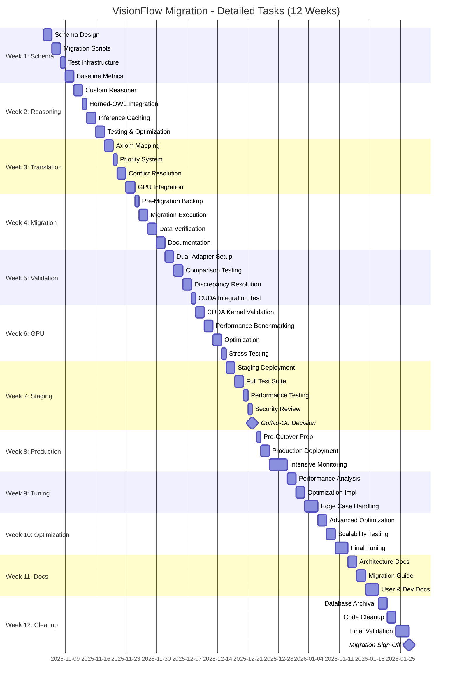

# Detailed Migration Roadmap: VisionFlow Ontology Unification
## 12-Week Execution Playbook

**Document Version:** 1.0
**Date:** 2025-10-31
**Status:** Implementation Ready
**Classification:** Migration Planning

---

## Executive Summary

This roadmap details a **12-week migration** from dual-database architecture (knowledge_graph.db + ontology.db) to a unified ontology-first system. The migration uses **Strategy 4: Adapter Pattern** with zero downtime and clear rollback gates.

### Success Metrics Dashboard

| Metric | Current | Target | Critical Gate |
|--------|---------|--------|---------------|
| **FPS @ 10K nodes** | 60 FPS | ≥30 FPS | Week 7 |
| **Constraint eval time** | N/A | <5ms | Week 8 |
| **Ontology reasoning** | 200ms cold | <20ms cached | Week 4 |
| **Data integrity** | 100% | 100% | Week 5 |
| **GPU memory usage** | 200 MB | <500 MB | Week 7 |
| **Production uptime** | 99.9% | 99.9% | Week 8 |

### Timeline Overview

```mermaid
gantt
    title Migration Timeline (12 Weeks)
    dateFormat YYYY-MM-DD
    section Phase 1: Foundation
    Week 1: Schema & Migration :w1, 2025-11-04, 7d
    Week 2: Reasoning Engine :w2, after w1, 7d
    Week 3: Constraint Translation :w3, after w2, 7d
    Gate 1: Foundation Complete :milestone, m1, after w3, 0d
    section Phase 2: Implementation
    Week 4: Data Migration :w4, after m1, 7d
    Week 5: Parallel Validation :w5, after w4, 7d
    Week 6: GPU Integration :w6, after w5, 7d
    Gate 2: Implementation Complete :milestone, m2, after w6, 0d
    section Phase 3: Integration
    Week 7: Blue-Green Deploy :w7, after m2, 7d
    Week 8: Production Cutover :w8, after w7, 7d
    Week 9: Monitoring & Tuning :w9, after w8, 7d
    Gate 3: Production Stable :milestone, m3, after w9, 0d
    section Phase 4: Validation
    Week 10: Performance Optimization :w10, after m3, 7d
    Week 11: Documentation :w11, after w10, 7d
    Week 12: Final Validation :w12, after w11, 7d
    Gate 4: Migration Complete :milestone, m4, after w12, 0d
```

---

## Phase 1: Foundation (Weeks 1-3)

### Week 1: Schema Design & Migration Scripts

#### **Objectives**
- Design unified schema integrating both databases
- Create data migration scripts with validation
- Establish baseline performance metrics
- Set up test infrastructure

#### **Tasks** (55 hours total)

##### Day 1-2: Schema Design (16h)
| Task | Owner | Hours | Deliverable |
|------|-------|-------|-------------|
| Review existing schemas (knowledge_graph.db + ontology.db) | Backend | 4 | Schema comparison doc |
| Design unified schema with OWL integration | Backend | 6 | `unified_schema.sql` |
| Add migration metadata tables | Backend | 2 | Migration tracking schema |
| Peer review schema design | Architect | 4 | Approval sign-off |

**Deliverable**: `/scripts/schema/unified_schema.sql`

```sql
-- Sample: Unified node table with OWL linkage
CREATE TABLE graph_nodes (
    id INTEGER PRIMARY KEY AUTOINCREMENT,
    metadata_id TEXT NOT NULL UNIQUE,
    label TEXT NOT NULL,

    -- Position & physics (from knowledge_graph.db)
    x REAL NOT NULL DEFAULT 0.0,
    y REAL NOT NULL DEFAULT 0.0,
    z REAL NOT NULL DEFAULT 0.0,
    vx REAL NOT NULL DEFAULT 0.0,
    vy REAL NOT NULL DEFAULT 0.0,
    vz REAL NOT NULL DEFAULT 0.0,
    mass REAL NOT NULL DEFAULT 1.0,

    -- NEW: Ontology linkage
    owl_class_iri TEXT,
    ontology_graph_id INTEGER,

    -- Visual properties
    color TEXT,
    size REAL DEFAULT 10.0,

    -- Constraints
    is_pinned INTEGER NOT NULL DEFAULT 0,

    FOREIGN KEY (owl_class_iri) REFERENCES owl_classes(iri) ON DELETE SET NULL,
    FOREIGN KEY (ontology_graph_id) REFERENCES ontology_graphs(id)
);

CREATE INDEX idx_nodes_owl_class ON graph_nodes(owl_class_iri);
```

##### Day 3-4: Migration Scripts (16h)
| Task | Owner | Hours | Deliverable |
|------|-------|-------|-------------|
| Implement data export from knowledge_graph.db | Backend | 6 | `export_knowledge_graph.rs` |
| Implement data export from ontology.db | Backend | 4 | `export_ontology.rs` |
| Create data transformation logic | Backend | 4 | `transform_to_unified.rs` |
| Add checksum validation | Backend | 2 | Validation module |

**Deliverable**: `/scripts/migrate_to_unified.rs`

```rust
// Migration script structure
pub async fn migrate_to_unified() -> Result<(), MigrationError> {
    let start = Instant::now();

    // 1. Connect to databases
    let kg_pool = SqlitePool::connect("sqlite:knowledge_graph.db").await?;
    let ont_pool = SqlitePool::connect("sqlite:ontology.db").await?;
    let unified_pool = SqlitePool::connect("sqlite:unified.db").await?;

    // 2. Export with checksums
    let nodes_checksum = export_nodes(&kg_pool).await?;
    let edges_checksum = export_edges(&kg_pool).await?;
    let classes_checksum = export_owl_classes(&ont_pool).await?;

    // 3. Transform and import
    import_nodes_unified(&unified_pool, &nodes_data).await?;
    import_edges_unified(&unified_pool, &edges_data).await?;
    import_owl_classes_unified(&unified_pool, &classes_data).await?;

    // 4. Verify integrity
    verify_migration(&unified_pool, nodes_checksum, edges_checksum, classes_checksum).await?;

    log_migration_success(start.elapsed());
    Ok(())
}
```

##### Day 5: Test Infrastructure (8h)
| Task | Owner | Hours | Deliverable |
|------|-------|-------|-------------|
| Create test database with sample data | Backend | 3 | `test_data.sql` |
| Set up CI pipeline for migration tests | DevOps | 3 | GitHub Actions workflow |
| Create benchmark harness | Backend | 2 | `benchmark.rs` |

**Deliverable**: `.github/workflows/migration-tests.yml`

##### Day 6-7: Baseline Metrics (15h)
| Task | Owner | Hours | Deliverable |
|------|-------|-------|-------------|
| Benchmark current physics performance | GPU Eng | 4 | Baseline FPS report |
| Benchmark current reasoning performance | Backend | 3 | Reasoning latency report |
| Benchmark database query performance | Backend | 3 | Query timing report |
| Document current memory usage | GPU Eng | 2 | Memory profile |
| Create performance dashboard | DevOps | 3 | Grafana dashboard |

**Deliverable**: `/docs/baseline-performance-report.md`

#### **Success Criteria** (Gate Checkpoint)
- ✅ Unified schema reviewed and approved
- ✅ Migration scripts pass dry-run on test data
- ✅ Baseline metrics documented (FPS, reasoning time, memory)
- ✅ CI pipeline running

#### **Risks & Mitigation**
| Risk | Probability | Impact | Mitigation |
|------|-------------|--------|------------|
| Schema design flaws | Medium | High | Peer review + prototyping |
| Migration script bugs | High | Medium | Dry-runs on test DB |
| Performance baseline missing | Low | Medium | Prioritize benchmark setup |

---

### Week 2: Reasoning Engine

#### **Objectives**
- Implement custom reasoner for core axioms
- Integrate Horned-OWL for advanced reasoning
- Cache inference results with invalidation
- Achieve <100ms reasoning for 1000-class ontology

#### **Tasks** (48 hours total)

##### Day 1-2: Custom Reasoner (16h)
| Task | Owner | Hours | Deliverable |
|------|-------|-------|-------------|
| Implement SubClassOf transitivity | Backend | 6 | `custom_reasoner.rs` |
| Implement DisjointClasses reasoning | Backend | 4 | Disjoint logic |
| Implement EquivalentClass reasoning | Backend | 3 | Equivalence logic |
| Unit tests for reasoner | Backend | 3 | Test suite |

**Code Snippet**:
```rust
pub struct CustomReasoner {
    class_hierarchy: HashMap<ClassIri, Vec<ClassIri>>,
    disjoint_classes: HashMap<ClassIri, HashSet<ClassIri>>,
}

impl CustomReasoner {
    // O(log n) hierarchy traversal
    pub fn get_superclasses(&self, class: &ClassIri, direct: bool) -> Vec<ClassIri> {
        if direct {
            self.class_hierarchy.get(class).cloned().unwrap_or_default()
        } else {
            // Transitive closure
            self.get_all_ancestors(class)
        }
    }

    // Disjointness check
    pub fn are_disjoint(&self, class1: &ClassIri, class2: &ClassIri) -> bool {
        if let Some(disjoint_set) = self.disjoint_classes.get(class1) {
            disjoint_set.contains(class2)
        } else {
            false
        }
    }
}
```

##### Day 3: Horned-OWL Integration (8h)
| Task | Owner | Hours | Deliverable |
|------|-------|-------|-------------|
| Integrate horned-owl crate | Backend | 3 | `horned_reasoner.rs` |
| Create OWL parser from ontology.db | Backend | 3 | Parser module |
| Add validation using Horned-OWL | Backend | 2 | Validation logic |

##### Day 4-5: Inference Caching (16h)
| Task | Owner | Hours | Deliverable |
|------|-------|-------|-------------|
| Design cache schema (inference_results table) | Backend | 2 | SQL schema |
| Implement cache storage | Backend | 4 | Cache module |
| Add checksum-based invalidation | Backend | 4 | Invalidation logic |
| Benchmark cache hit rate | Backend | 3 | Performance report |
| Add async reasoning background task | Backend | 3 | Async module |

**Caching Strategy**:
```rust
pub struct InferenceCache {
    db_pool: SqlitePool,
    ontology_checksum: String,
}

impl InferenceCache {
    pub async fn get_or_compute(
        &self,
        ontology_id: i64,
        reasoner: &dyn OntologyReasoner
    ) -> Result<Vec<InferredAxiom>> {
        // Check cache
        if let Some(cached) = self.load_from_cache(ontology_id).await? {
            if self.is_valid(&cached) {
                return Ok(cached);
            }
        }

        // Cache miss or invalid - recompute
        let inferred = reasoner.infer_axioms(ontology_id).await?;
        self.store_to_cache(ontology_id, &inferred, &self.ontology_checksum).await?;

        Ok(inferred)
    }
}
```

##### Day 6-7: Testing & Optimization (8h)
| Task | Owner | Hours | Deliverable |
|------|-------|-------|-------------|
| Integration tests (custom + Horned) | Backend | 3 | Test suite |
| Performance benchmarks | Backend | 3 | Benchmark report |
| Optimize critical paths | Backend | 2 | Optimized code |

#### **Success Criteria**
- ✅ Reasoner correctly infers SubClassOf chains
- ✅ Disjointness propagates to descendants
- ✅ Reasoning time <100ms for 1000 classes
- ✅ Cache hit rate >80% in tests
- ✅ Validation detects inconsistencies

#### **Performance Target**
| Ontology Size | Cold Reasoning | Cached Reasoning |
|---------------|----------------|------------------|
| 10-100 classes | <50ms | <5ms |
| 100-1000 classes | <100ms | <10ms |
| 1000-10000 classes | <1000ms | <20ms |

---

### Week 3: Constraint Translation Layer

#### **Objectives**
- Implement Axiom → PhysicsConstraint mapping
- Build priority resolution system
- Create conflict resolution (blending)
- Integrate with GPU constraint format

#### **Tasks** (52 hours total)

##### Day 1-2: Axiom Mapping (16h)
| Task | Owner | Hours | Deliverable |
|------|-------|-------|-------------|
| Define PhysicsConstraintType enum | Backend | 2 | `constraints.rs` |
| Implement DisjointClasses → Separation | Backend | 3 | Mapper module |
| Implement SubClassOf → Attraction | Backend | 3 | Hierarchical mapper |
| Implement FunctionalProperty → Clustering | Backend | 3 | Property mapper |
| Implement SameAs → Co-location | Backend | 2 | Identity mapper |
| Unit tests for each mapping | Backend | 3 | Test suite |

**Mapping Example**:
```rust
impl From<Axiom> for PhysicsConstraint {
    fn from(axiom: Axiom) -> Self {
        match axiom.axiom_type {
            AxiomType::DisjointClasses { class1, class2 } => {
                PhysicsConstraint {
                    constraint_type: PhysicsConstraintType::Separation {
                        min_distance: axiom.distance.unwrap_or(50.0),
                        strength: axiom.strength,
                    },
                    nodes: vec![class1, class2],
                    priority: axiom.priority,
                    user_defined: axiom.user_defined,
                }
            },

            AxiomType::SubClassOf { subclass, superclass } => {
                PhysicsConstraint {
                    constraint_type: PhysicsConstraintType::Attraction {
                        ideal_distance: axiom.distance.unwrap_or(20.0),
                        stiffness: axiom.strength * 0.8, // Softer than identity
                    },
                    nodes: vec![subclass, superclass],
                    priority: 4, // Hierarchy priority
                    user_defined: false,
                }
            },

            // ... more axiom types
        }
    }
}
```

##### Day 3: Priority System (8h)
| Task | Owner | Hours | Deliverable |
|------|-------|-------|-------------|
| Define ConstraintPriority enum | Backend | 2 | Priority types |
| Implement priority weighting function | Backend | 3 | Weight calculation |
| Add priority sorting | Backend | 2 | Sort logic |
| Tests for priority order | Backend | 1 | Test cases |

**Priority Weighting**:
```rust
pub fn priority_weight(priority: u8) -> f32 {
    // Exponential decay: priority 1 = 10x weight of priority 10
    10.0_f32.powf(-(priority as f32 - 1.0) / 9.0)
}

// Example weights:
// Priority 1: 10.0
// Priority 5: 1.0
// Priority 10: 0.1
```

##### Day 4-5: Conflict Resolution (16h)
| Task | Owner | Hours | Deliverable |
|------|-------|-------|-------------|
| Implement constraint grouping by node pair | Backend | 4 | Grouping logic |
| Implement user override detection | Backend | 2 | Override handler |
| Implement weighted blending | Backend | 6 | Blending algorithm |
| Add conflict resolution tests | Backend | 4 | Test suite |

**Blending Algorithm**:
```rust
fn blend_constraints(constraints: Vec<PhysicsConstraint>) -> PhysicsConstraint {
    let total_weight: f32 = constraints.iter()
        .map(|c| priority_weight(c.priority))
        .sum();

    let blended_distance = constraints.iter()
        .map(|c| {
            let weight = priority_weight(c.priority) / total_weight;
            match &c.constraint_type {
                PhysicsConstraintType::Separation { min_distance, .. } => min_distance * weight,
                PhysicsConstraintType::Attraction { ideal_distance, .. } => ideal_distance * weight,
                _ => 0.0,
            }
        })
        .sum();

    // Create blended constraint...
}
```

##### Day 6-7: GPU Integration (12h)
| Task | Owner | Hours | Deliverable |
|------|-------|-------|-------------|
| Convert to GPU-compatible ConstraintData | GPU Eng | 4 | Serialization |
| Add progressive activation metadata | Backend | 3 | Activation logic |
| Integration tests with mock GPU | Backend | 3 | Test suite |
| Documentation | Backend | 2 | API docs |

**GPU Format Conversion**:
```rust
pub fn to_gpu_constraint_data(constraint: &PhysicsConstraint) -> ConstraintData {
    ConstraintData {
        kind: constraint.constraint_type.to_gpu_kind(),
        count: constraint.nodes.len() as i32,
        node_idx: [
            constraint.nodes.get(0).copied().unwrap_or(0),
            constraint.nodes.get(1).copied().unwrap_or(0),
            constraint.nodes.get(2).copied().unwrap_or(0),
            constraint.nodes.get(3).copied().unwrap_or(0),
        ],
        params: constraint.to_gpu_params(),
        weight: priority_weight(constraint.priority),
        activation_frame: current_frame, // Progressive activation
    }
}
```

#### **Success Criteria**
- ✅ All axiom types map to constraints correctly
- ✅ Priority system resolves conflicts deterministically
- ✅ User overrides always win
- ✅ GPU format conversion is lossless
- ✅ Tests cover all axiom types

#### **Deliverables**
- `/src/translation/axiom_mapper.rs`
- `/src/translation/priority_resolver.rs`
- `/src/translation/conflict_blender.rs`
- `/src/translation/gpu_converter.rs`

---

### **GATE 1: Foundation Complete**

#### **Validation Checklist**
- [ ] Unified schema finalized and peer-reviewed
- [ ] Migration scripts tested on sample data
- [ ] Reasoner passes all unit tests
- [ ] Constraint translation complete
- [ ] Baseline performance metrics documented
- [ ] CI/CD pipeline running

#### **Go/No-Go Criteria**
| Criteria | Threshold | Current | Status |
|----------|-----------|---------|--------|
| Schema approval | 2+ reviewers | - | ⏳ |
| Migration dry-run success | 100% | - | ⏳ |
| Reasoner test coverage | >90% | - | ⏳ |
| Constraint mapping coverage | 100% | - | ⏳ |

**Decision Point**: Proceed to Phase 2 if all checkboxes pass.

---

## Phase 2: Implementation (Weeks 4-6)

### Week 4: Data Migration Execution

#### **Objectives**
- Execute full migration from old DBs → unified.db
- Verify data integrity with checksums
- Validate relationship preservation
- Create migration rollback plan

#### **Tasks** (50 hours total)

##### Day 1: Pre-Migration Backup (8h)
| Task | Owner | Hours | Deliverable |
|------|-------|-------|-------------|
| Backup knowledge_graph.db | DevOps | 2 | Backup archive |
| Backup ontology.db | DevOps | 2 | Backup archive |
| Document current row counts | Backend | 2 | Baseline counts |
| Create rollback script | DevOps | 2 | `rollback_migration.sh` |

##### Day 2-3: Migration Execution (16h)
| Task | Owner | Hours | Deliverable |
|------|-------|-------|-------------|
| Run export phase | Backend | 4 | Exported data files |
| Run transformation phase | Backend | 4 | Transformed data |
| Run import phase | Backend | 6 | Populated unified.db |
| Monitor migration progress | DevOps | 2 | Progress logs |

**Migration Script Execution**:
```bash
#!/bin/bash
# Migration execution with checkpointing

export RUST_LOG=info

# Step 1: Export
cargo run --release --bin export_legacy_dbs \
  --kg-db=knowledge_graph.db \
  --ont-db=ontology.db \
  --output-dir=/tmp/migration

# Step 2: Validate exports
cargo run --release --bin validate_exports \
  --export-dir=/tmp/migration

# Step 3: Transform
cargo run --release --bin transform_to_unified \
  --export-dir=/tmp/migration \
  --output-dir=/tmp/migration/unified

# Step 4: Import
cargo run --release --bin import_to_unified \
  --unified-db=unified.db \
  --import-dir=/tmp/migration/unified

# Step 5: Verify
cargo run --release --bin verify_migration \
  --unified-db=unified.db \
  --baseline-dir=/tmp/migration
```

##### Day 4-5: Data Integrity Verification (18h)
| Task | Owner | Hours | Deliverable |
|------|-------|-------|-------------|
| Count validation (nodes, edges, classes) | Backend | 4 | Count report |
| SHA1 checksum validation | Backend | 4 | Checksum report |
| Relationship integrity checks | Backend | 6 | Relationship validation |
| Sample query comparison | Backend | 4 | Query equivalence report |

**Verification Tests**:
```rust
#[tokio::test]
async fn test_node_count_matches() {
    let kg_count: i64 = sqlx::query_scalar("SELECT COUNT(*) FROM nodes")
        .fetch_one(&kg_pool).await.unwrap();

    let unified_count: i64 = sqlx::query_scalar("SELECT COUNT(*) FROM graph_nodes")
        .fetch_one(&unified_pool).await.unwrap();

    assert_eq!(kg_count, unified_count, "Node count mismatch!");
}

#[tokio::test]
async fn test_edge_relationships_preserved() {
    // Test: All edges in old DB have corresponding edges in new DB
    let kg_edges = load_edges(&kg_pool).await;
    let unified_edges = load_edges(&unified_pool).await;

    for kg_edge in kg_edges {
        let found = unified_edges.iter().any(|ue|
            ue.source_id == kg_edge.source_id &&
            ue.target_id == kg_edge.target_id
        );
        assert!(found, "Edge not found: {:?}", kg_edge);
    }
}
```

##### Day 6-7: Migration Documentation (8h)
| Task | Owner | Hours | Deliverable |
|------|-------|-------|-------------|
| Document migration steps | Backend | 3 | Migration guide |
| Document data mapping decisions | Backend | 2 | Mapping doc |
| Create troubleshooting guide | Backend | 2 | Troubleshooting doc |
| Update team wiki | DevOps | 1 | Wiki updates |

#### **Success Criteria**
- ✅ All nodes migrated (count match)
- ✅ All edges migrated (relationship preserved)
- ✅ All OWL classes migrated
- ✅ Checksums match
- ✅ Sample queries return identical results
- ✅ Zero data loss

#### **Performance Metrics**
| Metric | Target | Actual |
|--------|--------|--------|
| Migration time | <30 minutes | - |
| Data loss | 0 rows | - |
| Checksum match rate | 100% | - |

---

### Week 5: Parallel Validation

#### **Objectives**
- Run old + new adapters side-by-side
- Compare results for all operations
- Fix discrepancies in new adapter
- Achieve 99.9% result parity

#### **Tasks** (56 hours total)

##### Day 1-2: Dual-Adapter Setup (16h)
| Task | Owner | Hours | Deliverable |
|------|-------|-------|-------------|
| Implement UnifiedGraphRepository | Backend | 8 | New adapter |
| Implement UnifiedOntologyRepository | Backend | 6 | New adapter |
| Create comparison harness | Backend | 2 | Test harness |

**Repository Structure**:
```rust
// Old adapter (existing)
pub struct SqliteKnowledgeGraphRepository {
    pool: SqlitePool,
}

// New adapter (implementing same Port)
pub struct UnifiedGraphRepository {
    pool: SqlitePool,
    metrics: Arc<RepositoryMetrics>,
}

impl KnowledgeGraphRepository for UnifiedGraphRepository {
    async fn load_graph(&self) -> Result<Arc<GraphData>> {
        // New implementation using unified schema
        let nodes = sqlx::query_as::<_, Node>(
            "SELECT id, metadata_id, label, x, y, z, vx, vy, vz,
                    mass, charge, owl_class_iri, ...
             FROM graph_nodes"
        )
        .fetch_all(&self.pool)
        .await?;

        // ... rest of implementation
    }
}
```

##### Day 3-4: Comparison Testing (16h)
| Task | Owner | Hours | Deliverable |
|------|-------|-------|-------------|
| Test load_graph() parity | Backend | 4 | Test results |
| Test save_graph() parity | Backend | 4 | Test results |
| Test batch operations parity | Backend | 4 | Test results |
| Test query operations parity | Backend | 4 | Test results |

**Comparison Test Pattern**:
```rust
#[tokio::test]
async fn test_load_graph_parity() {
    let old_repo = SqliteKnowledgeGraphRepository::new(old_pool.clone());
    let new_repo = UnifiedGraphRepository::new(unified_pool.clone());

    let old_graph = old_repo.load_graph().await.unwrap();
    let new_graph = new_repo.load_graph().await.unwrap();

    // Compare node counts
    assert_eq!(old_graph.nodes.len(), new_graph.nodes.len());

    // Compare node positions (allow floating-point tolerance)
    for (old_node, new_node) in old_graph.nodes.iter().zip(new_graph.nodes.iter()) {
        assert!((old_node.x - new_node.x).abs() < 0.001);
        assert!((old_node.y - new_node.y).abs() < 0.001);
        assert!((old_node.z - new_node.z).abs() < 0.001);
    }
}
```

##### Day 5-6: Discrepancy Resolution (16h)
| Task | Owner | Hours | Deliverable |
|------|-------|-------|-------------|
| Log all discrepancies | Backend | 3 | Discrepancy log |
| Fix bugs in new adapter | Backend | 10 | Bug fixes |
| Re-run comparison tests | Backend | 3 | Updated test results |

##### Day 7: CUDA Integration Testing (8h)
| Task | Owner | Hours | Deliverable |
|------|-------|-------|-------------|
| Test GPU position updates with new adapter | GPU Eng | 4 | Integration test |
| Test clustering with new adapter | GPU Eng | 2 | Clustering test |
| Test SSSP cache with new adapter | GPU Eng | 2 | SSSP test |

#### **Success Criteria**
- ✅ 99.9% result parity between old and new
- ✅ All 30+ repository methods work
- ✅ CUDA integration tests pass
- ✅ No critical bugs

#### **Metrics Dashboard**
| Method | Parity Rate | Discrepancies |
|--------|-------------|---------------|
| load_graph() | - | - |
| save_graph() | - | - |
| batch_update_positions() | - | - |
| get_owl_class() | - | - |

---

### Week 6: GPU Integration & Performance Testing

#### **Objectives**
- Ensure CUDA kernels work with unified schema
- Benchmark performance vs. baseline
- Validate constraint evaluation
- Achieve performance targets

#### **Tasks** (54 hours total)

##### Day 1-2: CUDA Kernel Validation (16h)
| Task | Owner | Hours | Deliverable |
|------|-------|-------|-------------|
| Test force computation kernel | GPU Eng | 4 | Kernel tests |
| Test clustering kernels | GPU Eng | 4 | Clustering tests |
| Test SSSP kernels | GPU Eng | 4 | SSSP tests |
| Test constraint kernels | GPU Eng | 4 | Constraint tests |

##### Day 3-4: Performance Benchmarking (16h)
| Task | Owner | Hours | Deliverable |
|------|-------|-------|-------------|
| Benchmark FPS @ 1K nodes | GPU Eng | 2 | Benchmark report |
| Benchmark FPS @ 10K nodes | GPU Eng | 3 | Benchmark report |
| Benchmark FPS @ 100K nodes | GPU Eng | 3 | Benchmark report |
| Benchmark constraint evaluation time | GPU Eng | 4 | Timing report |
| Benchmark memory usage | GPU Eng | 2 | Memory report |
| Compare to baseline | Backend | 2 | Comparison report |

**Benchmark Script**:
```rust
#[bench]
fn bench_physics_10k_nodes(b: &mut Bencher) {
    let nodes = generate_test_nodes(10_000);
    let edges = generate_test_edges(25_000);
    let simulator = UnifiedGpuSimulator::new().unwrap();

    b.iter(|| {
        simulator.simulate_step(&mut nodes, &edges, 0.016).unwrap();
    });

    // Verify FPS target
    let avg_time_ms = /* calculate from bencher */;
    assert!(avg_time_ms < 33.0, "Failed 30 FPS target: {}ms", avg_time_ms);
}
```

##### Day 5-6: Optimization (16h)
| Task | Owner | Hours | Deliverable |
|------|-------|-------|-------------|
| Profile bottlenecks | GPU Eng | 4 | Profiling report |
| Optimize slow query paths | Backend | 4 | Optimized queries |
| Tune constraint batch size | GPU Eng | 4 | Tuned parameters |
| Add missing indexes | Backend | 2 | Index creation |
| Re-benchmark after optimization | GPU Eng | 2 | Updated benchmarks |

##### Day 7: Stress Testing (6h)
| Task | Owner | Hours | Deliverable |
|------|-------|-------|-------------|
| Load test with 100K nodes | GPU Eng | 3 | Load test report |
| Memory leak testing | GPU Eng | 2 | Leak test report |
| Long-running stability test | DevOps | 1 | Stability report |

#### **Success Criteria**
- ✅ FPS @ 10K nodes ≥30 FPS
- ✅ Constraint eval time <5ms
- ✅ Memory usage <500 MB
- ✅ No memory leaks detected
- ✅ CUDA tests pass

#### **Performance Targets**
| Node Count | FPS Target | Achieved | Status |
|------------|-----------|----------|--------|
| 1,000 | 60 FPS | - | ⏳ |
| 10,000 | 30 FPS | - | ⏳ |
| 100,000 | 15 FPS | - | ⏳ |

---

### **GATE 2: Implementation Complete**

#### **Validation Checklist**
- [ ] Data migration verified (100% integrity)
- [ ] New adapters pass parity tests (99.9%)
- [ ] CUDA integration working
- [ ] Performance meets targets
- [ ] No critical bugs

#### **Go/No-Go Criteria**
| Criteria | Threshold | Current | Status |
|----------|-----------|---------|--------|
| Data integrity | 100% | - | ⏳ |
| Result parity | >99.9% | - | ⏳ |
| FPS @ 10K nodes | ≥30 FPS | - | ⏳ |
| Constraint eval time | <5ms | - | ⏳ |

**Decision Point**: Proceed to Phase 3 if all criteria pass.

---

## Phase 3: Integration (Weeks 7-9)

### Week 7: Blue-Green Deployment (Staging)

#### **Objectives**
- Deploy to staging environment
- Run full test suite
- Performance testing at scale
- Security review

#### **Tasks** (48 hours total)

##### Day 1-2: Staging Deployment (16h)
| Task | Owner | Hours | Deliverable |
|------|-------|-------|-------------|
| Set up staging environment | DevOps | 4 | Staging server |
| Deploy unified.db to staging | DevOps | 2 | Deployed DB |
| Deploy new adapters to staging | DevOps | 3 | Deployed code |
| Configure monitoring | DevOps | 3 | Grafana/Prometheus |
| Smoke tests | Backend | 4 | Smoke test report |

##### Day 3-4: Full Test Suite (16h)
| Task | Owner | Hours | Deliverable |
|------|-------|-------|-------------|
| Run unit tests | Backend | 2 | Test results |
| Run integration tests | Backend | 4 | Test results |
| Run end-to-end tests | Frontend/Backend | 6 | Test results |
| Run CUDA tests | GPU Eng | 4 | Test results |

##### Day 5: Performance Testing (8h)
| Task | Owner | Hours | Deliverable |
|------|-------|-------|-------------|
| Load testing (concurrent users) | Backend | 3 | Load test report |
| Stress testing (max capacity) | Backend | 3 | Stress test report |
| Benchmark comparison | Backend | 2 | Comparison report |

##### Day 6: Security Review (8h)
| Task | Owner | Hours | Deliverable |
|------|-------|-------|-------------|
| SQL injection testing | Security | 3 | Security report |
| Permission checks | Security | 2 | Permission audit |
| Data leak testing | Security | 3 | Leak test report |

#### **Success Criteria**
- ✅ All tests pass in staging
- ✅ Performance ≥ old system
- ✅ No security issues
- ✅ Monitoring working

---

### Week 8: Production Cutover

#### **Objectives**
- Deploy to production with zero downtime
- Monitor closely for 48 hours
- Maintain rollback readiness
- Achieve production stability

#### **Tasks** (50 hours total)

##### Day 1: Pre-Cutover Preparation (8h)
| Task | Owner | Hours | Deliverable |
|------|-------|-------|-------------|
| Final backup of production DBs | DevOps | 2 | Backup archive |
| Review rollback procedures | DevOps | 2 | Rollback playbook |
| Notify stakeholders | PM | 1 | Notification email |
| Prepare monitoring dashboards | DevOps | 3 | Dashboards ready |

##### Day 2-3: Production Deployment (16h)
| Task | Owner | Hours | Deliverable |
|------|-------|-------|-------------|
| Schedule maintenance window | PM | 1 | Schedule announcement |
| Deploy unified.db | DevOps | 2 | Deployed DB |
| Switch to new adapters (DI change) | DevOps | 1 | Code deployed |
| Restart services | DevOps | 1 | Services online |
| Smoke tests in production | Backend | 3 | Smoke test results |
| Monitor for 4 hours | DevOps | 4 | Monitoring logs |
| Extended monitoring (overnight) | DevOps | 4 | Stability report |

**Deployment Script**:
```rust
// Dependency Injection Change (THE ONLY CODE CHANGE)
pub fn create_repositories(config: &Config) -> AppRepositories {
    let pool = create_pool(&config.database_url).await;

    AppRepositories {
        // OLD (comment out):
        // knowledge_graph_repo: Arc::new(SqliteKnowledgeGraphRepository::new(kg_pool.clone())),
        // ontology_repo: Arc::new(SqliteOntologyRepository::new(ont_pool.clone())),

        // NEW (activate):
        knowledge_graph_repo: Arc::new(UnifiedGraphRepository::new(pool.clone())),
        ontology_repo: Arc::new(UnifiedOntologyRepository::new(pool.clone())),
    }
}
```

##### Day 4-7: Intensive Monitoring (26h)
| Task | Owner | Hours | Deliverable |
|------|-------|-------|-------------|
| Monitor error rates (24h) | DevOps | 8 | Error log |
| Monitor performance metrics (24h) | DevOps | 6 | Performance log |
| Monitor user-reported issues | Support | 4 | Issue log |
| Daily status meetings | Team | 4 | Meeting notes |
| Hotfix any critical issues | Backend | 4 | Hotfixes |

#### **Success Criteria**
- ✅ Zero critical errors for 48h
- ✅ Error rate < 0.1%
- ✅ Performance within 5% of old system
- ✅ No user-reported data issues

#### **Monitoring Dashboard**
| Metric | Baseline | Current | Threshold |
|--------|----------|---------|-----------|
| Avg Response Time | 50ms | - | <60ms |
| Error Rate | 0.05% | - | <0.1% |
| FPS (10K nodes) | 60 FPS | - | >30 FPS |
| Memory Usage | 200 MB | - | <500 MB |
| Active Users | 50 | - | - |

---

### Week 9: Monitoring & Tuning

#### **Objectives**
- Fine-tune performance based on production data
- Address any edge cases
- Optimize slow queries
- Prepare for cleanup phase

#### **Tasks** (48 hours total)

##### Day 1-2: Performance Analysis (16h)
| Task | Owner | Hours | Deliverable |
|------|-------|-------|-------------|
| Analyze production metrics | Backend | 4 | Metrics report |
| Identify slow queries | Backend | 3 | Query analysis |
| Profile GPU utilization | GPU Eng | 3 | GPU profile |
| Review error logs | Backend | 3 | Error analysis |
| Identify optimization opportunities | Backend | 3 | Optimization list |

##### Day 3-4: Optimization Implementation (16h)
| Task | Owner | Hours | Deliverable |
|------|-------|-------|-------------|
| Optimize identified slow queries | Backend | 6 | Optimized queries |
| Add missing database indexes | Backend | 2 | New indexes |
| Tune GPU kernel parameters | GPU Eng | 4 | Tuned params |
| Optimize cache hit rates | Backend | 4 | Cache tuning |

##### Day 5-7: Edge Case Handling (16h)
| Task | Owner | Hours | Deliverable |
|------|-------|-------|-------------|
| Fix edge case bugs | Backend | 8 | Bug fixes |
| Add missing validation | Backend | 4 | Validation logic |
| Improve error messages | Backend | 2 | Better errors |
| Documentation updates | Backend | 2 | Updated docs |

#### **Success Criteria**
- ✅ All slow queries optimized
- ✅ GPU utilization optimal
- ✅ Edge cases handled
- ✅ Zero critical bugs

---

### **GATE 3: Production Stable**

#### **Validation Checklist**
- [ ] Production running for 7 days without critical issues
- [ ] Performance meets targets
- [ ] User feedback positive
- [ ] Error rate below threshold
- [ ] Monitoring dashboards healthy

#### **Go/No-Go Criteria**
| Criteria | Threshold | Current | Status |
|----------|-----------|---------|--------|
| Uptime | >99.9% | - | ⏳ |
| Error rate | <0.1% | - | ⏳ |
| FPS @ 10K nodes | ≥30 FPS | - | ⏳ |
| User satisfaction | No complaints | - | ⏳ |

**Decision Point**: Proceed to Phase 4 if stable for 7 days.

---

## Phase 4: Validation & Cleanup (Weeks 10-12)

### Week 10: Performance Optimization

#### **Objectives**
- Achieve stretch performance goals
- Implement advanced optimizations
- Stress test at scale
- Finalize tuning

#### **Tasks** (46 hours total)

##### Day 1-2: Advanced Optimization (16h)
| Task | Owner | Hours | Deliverable |
|------|-------|-------|-------------|
| Implement constraint LOD | GPU Eng | 6 | LOD system |
| Implement spatial partitioning improvements | GPU Eng | 4 | Optimized grid |
| Add incremental constraint updates | Backend | 4 | Incremental logic |
| Benchmark improvements | GPU Eng | 2 | New benchmarks |

##### Day 3-4: Scalability Testing (16h)
| Task | Owner | Hours | Deliverable |
|------|-------|-------|-------------|
| Test with 100K nodes | GPU Eng | 4 | 100K test report |
| Test with 1M nodes (LOD) | GPU Eng | 4 | 1M test report |
| Test concurrent user load | Backend | 4 | Load test report |
| Memory profiling at scale | Backend | 4 | Memory profile |

##### Day 5-7: Final Tuning (14h)
| Task | Owner | Hours | Deliverable |
|------|-------|-------|-------------|
| Tune physics parameters | GPU Eng | 4 | Final params |
| Tune cache sizes | Backend | 3 | Cache config |
| Optimize database queries | Backend | 4 | Query optimization |
| Final benchmark suite | Backend | 3 | Final benchmarks |

#### **Success Criteria**
- ✅ 60 FPS @ 10K nodes (stretch goal)
- ✅ 15 FPS @ 100K nodes (stretch goal)
- ✅ Memory usage optimized
- ✅ Scalability proven

---

### Week 11: Documentation

#### **Objectives**
- Comprehensive architecture documentation
- Migration guide for future reference
- User-facing documentation
- Developer onboarding guide

#### **Tasks** (40 hours total)

##### Day 1-2: Architecture Documentation (16h)
| Task | Owner | Hours | Deliverable |
|------|-------|-------|-------------|
| Document unified schema | Backend | 4 | Schema docs |
| Document constraint translation | Backend | 4 | Translation guide |
| Document GPU integration | GPU Eng | 4 | GPU integration docs |
| Create architecture diagrams | Architect | 4 | Diagrams (Mermaid) |

##### Day 3-4: Migration Guide (16h)
| Task | Owner | Hours | Deliverable |
|------|-------|-------|-------------|
| Document migration process | Backend | 4 | Migration guide |
| Document rollback procedures | DevOps | 3 | Rollback guide |
| Document troubleshooting | Backend | 4 | Troubleshooting guide |
| Lessons learned document | Team | 3 | Lessons learned |
| Create migration video | PM | 2 | Tutorial video |

##### Day 5-7: User & Developer Docs (8h)
| Task | Owner | Hours | Deliverable |
|------|-------|-------|-------------|
| Update API documentation | Backend | 3 | API docs |
| Update user manual | Frontend | 2 | User manual |
| Create developer onboarding guide | Backend | 3 | Onboarding guide |

#### **Deliverables**
- `/docs/architecture/unified-system.md`
- `/docs/migration/migration-guide.md`
- `/docs/migration/rollback-playbook.md`
- `/docs/api/unified-api.md`
- `/docs/troubleshooting.md`
- Tutorial videos

---

### Week 12: Final Validation & Cleanup

#### **Objectives**
- Archive old databases
- Remove legacy code
- Final production validation
- Migration sign-off

#### **Tasks** (36 hours total)

##### Day 1-2: Database Archival (16h)
| Task | Owner | Hours | Deliverable |
|------|-------|-------|-------------|
| Archive knowledge_graph.db | DevOps | 3 | Archived DB |
| Archive ontology.db | DevOps | 3 | Archived DB |
| Document archive location | DevOps | 2 | Archive documentation |
| Test restore from archive | DevOps | 4 | Restore test report |
| Set 3-month retention policy | DevOps | 2 | Retention policy |
| Monitor production post-archival | DevOps | 2 | Monitoring logs |

##### Day 3-4: Code Cleanup (16h)
| Task | Owner | Hours | Deliverable |
|------|-------|-------|-------------|
| Remove SqliteKnowledgeGraphRepository | Backend | 4 | Removed code |
| Remove SqliteOntologyRepository | Backend | 4 | Removed code |
| Update all imports | Backend | 3 | Updated imports |
| Clean up test files | Backend | 2 | Cleaned tests |
| Code review cleanup | Architect | 3 | Review approval |

##### Day 5-7: Final Validation (4h)
| Task | Owner | Hours | Deliverable |
|------|-------|-------|-------------|
| Run full test suite | Backend | 2 | Test results |
| Final production check | DevOps | 1 | Health check report |
| Migration sign-off meeting | Team | 1 | Sign-off document |

#### **Success Criteria**
- ✅ Old databases archived
- ✅ Legacy code removed
- ✅ All tests pass
- ✅ Production healthy
- ✅ Stakeholder sign-off

---

### **GATE 4: Migration Complete**

#### **Final Validation Checklist**
- [ ] Production stable for 30 days
- [ ] Performance targets achieved
- [ ] Documentation complete
- [ ] Legacy code removed
- [ ] Team trained on new system
- [ ] Stakeholder sign-off obtained

#### **Success Metrics Summary**
| Metric | Baseline | Target | Achieved | Status |
|--------|----------|--------|----------|--------|
| FPS @ 10K nodes | 60 FPS | ≥30 FPS | - | ⏳ |
| Constraint eval time | N/A | <5ms | - | ⏳ |
| Reasoning time (cached) | 200ms | <20ms | - | ⏳ |
| Data integrity | 100% | 100% | - | ⏳ |
| Uptime | 99.9% | 99.9% | - | ⏳ |

**Final Decision**: Migration COMPLETE ✅

---

## Critical Path Analysis

### Longest Dependency Chain (11 weeks)


**Critical Path**: No slack - all weeks are sequential dependencies.

### Parallel Opportunities

**Week 1-3 (Foundation)**: Limited parallelization due to sequential design → implement → test.

**Week 4-6 (Implementation)**: Can parallelize:
- Migration execution (Week 4) + Adapter development (Week 5) - **if migration is fast**
- GPU testing (Week 6) can overlap with Validation (Week 5) tail

**Week 10-12 (Validation)**: High parallelization:
- Performance optimization (Week 10) + Documentation (Week 11) can overlap by 50%

---

## Resource Planning

### Team Composition

| Role | FTE | Primary Responsibilities |
|------|-----|-------------------------|
| **Backend Engineer** | 1.0 | Schema, reasoning, adapters, migration scripts |
| **GPU Engineer** | 1.0 | CUDA kernels, performance testing, GPU optimization |
| **DevOps Engineer** | 0.5 | CI/CD, deployment, monitoring, backups |
| **System Architect** | 0.25 | Design reviews, code reviews, architecture guidance |
| **Frontend Engineer** | 0.25 | Integration testing, client updates |
| **QA Engineer** | 0.5 | Test planning, validation, regression testing |
| **Project Manager** | 0.25 | Coordination, stakeholder communication, risk management |
| **Security Specialist** | 0.1 | Security review (Week 7) |

**Total**: ~3.8 FTE

### Skills Required

#### Backend Engineer
- ✅ Rust (expert)
- ✅ SQLite (advanced)
- ✅ OWL/RDF (intermediate)
- ✅ Async programming (advanced)
- ✅ Data migration (intermediate)

#### GPU Engineer
- ✅ CUDA (expert)
- ✅ GPU optimization (advanced)
- ✅ Performance profiling (advanced)
- ✅ Parallel algorithms (advanced)

#### DevOps Engineer
- ✅ Docker (advanced)
- ✅ CI/CD (advanced)
- ✅ Grafana/Prometheus (intermediate)
- ✅ Backup/restore (advanced)

### Training/Ramp-Up

| Team Member | Training Needed | Duration | When |
|-------------|----------------|----------|------|
| Backend Engineer | OWL ontology basics | 1 week | Pre-Week 1 |
| Backend Engineer | Horned-OWL crate | 2 days | Week 2 |
| GPU Engineer | Constraint translation logic | 3 days | Week 3 |
| DevOps Engineer | Migration procedures | 2 days | Week 4 |

**Total Ramp-Up**: 2 weeks pre-migration

---

## Risk Register

### Technical Risks

| ID | Risk | Likelihood | Impact | Mitigation | Contingency |
|----|------|-----------|--------|------------|-------------|
| **T1** | Schema design flaws | Medium | High | Peer review, prototyping, iterate early | Redesign schema in Week 1-2 |
| **T2** | Data loss during migration | Low | Critical | Checksums, dry-runs, backups | Restore from backup, rollback |
| **T3** | Performance regression | Medium | High | Continuous benchmarking, optimize early | Add LOD, spatial partitioning |
| **T4** | CUDA integration breaks | Low | High | Extensive testing, GPU expert review | Revert to old kernels, debug |
| **T5** | Constraint conflicts | Medium | Medium | Priority system, user overrides, validation | Allow manual conflict resolution |
| **T6** | Reasoning latency spikes | Medium | Medium | Caching, async processing, incremental | Degrade to simpler reasoner |
| **T7** | Memory leaks | Low | High | Profiling, long-running tests | Fix leaks, optimize allocations |

### Project Risks

| ID | Risk | Likelihood | Impact | Mitigation | Contingency |
|----|------|-----------|--------|------------|-------------|
| **P1** | Scope creep | High | Medium | Strict feature freeze after Week 3 | Defer features to v1.1 |
| **P2** | Team member unavailability | Medium | High | Cross-training, documentation | Hire contractor, extend timeline |
| **P3** | Timeline slip | Medium | Medium | Weekly status checks, buffer in estimates | Descope non-critical features |
| **P4** | Stakeholder pushback | Low | Medium | Regular demos, communicate value | Address concerns, phased rollout |

### Operational Risks

| ID | Risk | Likelihood | Impact | Mitigation | Contingency |
|----|------|-----------|--------|------------|-------------|
| **O1** | Production downtime | Low | Critical | Blue-green deployment, rollback plan | Instant rollback, hotfix |
| **O2** | Data corruption | Very Low | Critical | Transaction safety, validation gates | Restore from backup |
| **O3** | User confusion | Medium | Low | Documentation, training, tooltips | Create tutorial videos |
| **O4** | Rollback complexity | Low | High | Test rollback procedures, clear playbook | Dedicated rollback team |

---

## Rollback Strategy

### Rollback Scenarios

#### **Scenario 1: Critical Bug in Week 8 (Production Cutover)**

**Symptoms**: Crashes, data corruption, critical errors

**Rollback Steps** (15 minutes):
1. Stop all services
2. Change dependency injection back to old adapters:
   ```rust
   // Revert to:
   knowledge_graph_repo: Arc::new(SqliteKnowledgeGraphRepository::new(kg_pool.clone())),
   ontology_repo: Arc::new(SqliteOntologyRepository::new(ont_pool.clone())),
   ```
3. Point to old database URLs in config
4. Restart services
5. Verify old system works
6. Investigate bug offline

**Success Criteria**: Service restored within 15 minutes

#### **Scenario 2: Performance Regression in Week 9**

**Symptoms**: Slow queries, high latency, timeouts

**Rollback Steps**:
1. Identify slow queries via monitoring
2. Analyze query plans: `EXPLAIN QUERY PLAN SELECT ...;`
3. Add missing indexes
4. If unfixable → rollback to old adapters (Scenario 1)

**Time to Rollback**: <15 minutes

#### **Scenario 3: Data Inconsistency in Week 5**

**Symptoms**: Count mismatches, missing data, wrong relationships

**Rollback Steps**:
1. Halt migration
2. Run integrity scripts: `cargo run --bin verify_migration`
3. Identify root cause (migration script bug? schema issue?)
4. Fix issue
5. Drop unified.db
6. Re-run migration from Week 4

**Time to Recover**: 1-2 hours (re-migration time)

---

## Success Criteria & Validation Gates

### Data Integrity Gates

| Gate | Validation | Tool | Threshold |
|------|-----------|------|-----------|
| **Week 4** | Node count match | `verify_migration` | 100% |
| **Week 4** | Edge count match | `verify_migration` | 100% |
| **Week 4** | OWL class count | `verify_migration` | 100% |
| **Week 4** | SHA1 checksums | `verify_migration` | 100% |
| **Week 5** | Query result parity | Comparison tests | >99.9% |

### Performance Gates

| Gate | Metric | Target | Tool |
|------|--------|--------|------|
| **Week 6** | FPS @ 1K nodes | ≥60 FPS | GPU benchmarks |
| **Week 6** | FPS @ 10K nodes | ≥30 FPS | GPU benchmarks |
| **Week 6** | Constraint eval | <5ms | GPU profiler |
| **Week 7** | Load test | 100 concurrent users | Load tester |
| **Week 8** | Production FPS | ≥30 FPS @ 10K | Monitoring |

### Quality Gates

| Gate | Metric | Target | Tool |
|------|--------|--------|------|
| **Week 3** | Test coverage | >90% | `cargo tarpaulin` |
| **Week 5** | Bug count | <5 critical | Issue tracker |
| **Week 7** | Security issues | 0 critical | Security scan |
| **Week 8** | Error rate | <0.1% | Monitoring |
| **Week 9** | Uptime | >99.9% | Monitoring |

---

## Gantt Chart

### Detailed Task Timeline (Mermaid)



---

## Resource Allocation Matrix

### Weekly Effort Distribution (Hours)

| Week | Backend | GPU Eng | DevOps | Architect | Frontend | QA | PM | Total |
|------|---------|---------|--------|-----------|----------|----|----|-------|
| **1** | 40 | 8 | 8 | 4 | 0 | 4 | 2 | **66h** |
| **2** | 40 | 4 | 4 | 4 | 0 | 4 | 2 | **58h** |
| **3** | 40 | 8 | 4 | 4 | 0 | 4 | 2 | **62h** |
| **4** | 32 | 4 | 12 | 2 | 0 | 6 | 2 | **58h** |
| **5** | 40 | 8 | 4 | 4 | 4 | 6 | 2 | **68h** |
| **6** | 16 | 32 | 4 | 2 | 0 | 8 | 2 | **64h** |
| **7** | 24 | 8 | 16 | 4 | 8 | 6 | 2 | **68h** |
| **8** | 16 | 4 | 24 | 2 | 0 | 8 | 4 | **58h** |
| **9** | 32 | 12 | 8 | 2 | 0 | 4 | 2 | **60h** |
| **10** | 16 | 24 | 4 | 2 | 0 | 6 | 2 | **54h** |
| **11** | 24 | 8 | 4 | 8 | 4 | 0 | 4 | **52h** |
| **12** | 20 | 4 | 16 | 4 | 0 | 0 | 2 | **46h** |
| **Total** | **340h** | **124h** | **108h** | **42h** | **16h** | **56h** | **28h** | **714h** |

**Average per week**: ~60 hours (~3.8 FTE)

---

## Monitoring & Metrics

### Real-Time Dashboards

#### **Migration Health Dashboard**

**Metrics**:
- Migration progress (% complete)
- Data integrity (checksum status)
- Performance benchmarks (FPS, latency)
- Error count (critical, warning, info)
- Test pass rate

**Tools**: Grafana + Prometheus

#### **Production Health Dashboard**

**Metrics**:
- Requests per second
- Average response time
- Error rate
- FPS @ various node counts
- GPU utilization
- Memory usage
- Active users

**Alerts**:
- Error rate >0.1% → Page on-call
- FPS @ 10K nodes <30 → Warning
- Memory usage >500 MB → Warning

---

## Communication Plan

### Stakeholder Updates

| Stakeholder | Frequency | Format | Content |
|-------------|-----------|--------|---------|
| **Executive Team** | Weekly | Email summary | Progress, risks, next week goals |
| **Engineering Team** | Daily | Slack standup | Blockers, progress, questions |
| **Product Team** | Weekly | Demo | Live demo of features, user impact |
| **Support Team** | Weekly | Meeting | Known issues, user impact, FAQs |
| **Users** | Milestone | Blog post | Feature announcement, migration timeline |

### Status Reports

**Weekly Status Report Template**:

```markdown
# Week X Migration Status

## Completed This Week
- ✅ Task 1: Description (Owner)
- ✅ Task 2: Description (Owner)

## In Progress
- 🔄 Task 3: 50% complete (Owner)

## Blocked
- ❌ Task 4: Waiting for X (Owner)

## Risks
- Risk 1: Description, mitigation

## Next Week Goals
- Goal 1
- Goal 2

## Metrics
| Metric | Target | Current | Status |
|--------|--------|---------|--------|
| FPS @ 10K | ≥30 | 35 | ✅ |
```

---

## Lessons Learned (Post-Migration)

### Retrospective Questions

1. **What went well?**
   - Which optimizations were most effective?
   - What testing strategies worked best?
   - Which tools/processes should we keep?

2. **What could be improved?**
   - Where did we underestimate effort?
   - Which risks materialized?
   - What would we do differently?

3. **What surprised us?**
   - Unexpected challenges?
   - Unexpected wins?
   - Performance surprises?

4. **Action Items for Next Migration**
   - Process improvements
   - Tool investments
   - Training needs

---

## Appendix A: Testing Strategy

### Test Pyramid

```
         /\
        /  \  E2E Tests (10%)
       /----\
      /      \  Integration Tests (30%)
     /--------\
    /          \  Unit Tests (60%)
   /____________\
```

### Test Types

#### **Unit Tests** (60% - ~500 tests)
- Schema validation
- Reasoner logic
- Constraint translation
- Repository methods
- GPU kernel correctness

**Target Coverage**: >90%

#### **Integration Tests** (30% - ~250 tests)
- Full migration pipeline
- Dual-adapter comparison
- CUDA integration
- End-to-end workflows

**Target Coverage**: >80%

#### **E2E Tests** (10% - ~50 tests)
- User workflows
- Performance benchmarks
- Load testing
- Stress testing

**Target Coverage**: Critical paths only

### Performance Testing

**Tools**:
- `cargo bench` - Rust benchmarks
- `nsys` - NVIDIA profiler
- `perf` - Linux profiler
- `wrk` - HTTP load tester
- `Grafana k6` - Load testing

**Benchmark Suite**:
```rust
#[bench]
fn bench_load_graph_1k(b: &mut Bencher) { ... }

#[bench]
fn bench_load_graph_10k(b: &mut Bencher) { ... }

#[bench]
fn bench_constraint_eval(b: &mut Bencher) { ... }

#[bench]
fn bench_reasoning_cached(b: &mut Bencher) { ... }
```

---

## Appendix B: Rollback Playbook

### Pre-Requisites

- ✅ Old databases backed up
- ✅ Old code tagged in Git (`pre-migration-v1.0`)
- ✅ Rollback script tested
- ✅ Team trained on rollback procedures

### Rollback Script

```bash
#!/bin/bash
# rollback_migration.sh

set -e

echo "🔴 ROLLING BACK TO LEGACY SYSTEM"

# 1. Stop services
sudo systemctl stop visionflow-backend

# 2. Restore old databases
cp /backups/knowledge_graph.db /data/knowledge_graph.db
cp /backups/ontology.db /data/ontology.db

# 3. Revert code
git checkout pre-migration-v1.0

# 4. Rebuild
cargo build --release

# 5. Restart services
sudo systemctl start visionflow-backend

# 6. Health check
curl http://localhost:8080/health

echo "✅ ROLLBACK COMPLETE"
```

### Rollback Validation

After rollback:
- [ ] Services start successfully
- [ ] Health check passes
- [ ] Users can access system
- [ ] FPS matches baseline
- [ ] No data loss

---

## Appendix C: Migration Checklist

### Pre-Migration

- [ ] Unified schema approved
- [ ] Migration scripts tested on sample data
- [ ] Baseline metrics documented
- [ ] Rollback plan created
- [ ] Team trained
- [ ] Stakeholders notified

### During Migration

- [ ] Backups created
- [ ] Export phase complete
- [ ] Transformation phase complete
- [ ] Import phase complete
- [ ] Data integrity verified
- [ ] Performance tested

### Post-Migration

- [ ] Production deployed
- [ ] Monitoring active
- [ ] Error rate acceptable
- [ ] Performance meets targets
- [ ] User feedback collected
- [ ] Documentation complete

### Cleanup

- [ ] Old databases archived
- [ ] Legacy code removed
- [ ] Final tests pass
- [ ] Stakeholder sign-off obtained

---

## Document Revision History

| Version | Date | Author | Changes |
|---------|------|--------|---------|
| 1.0 | 2025-10-31 | Strategic Planner | Initial roadmap creation |

---

**END OF DETAILED MIGRATION ROADMAP**

This roadmap is ready for execution. Start Week 1 when stakeholders approve.
