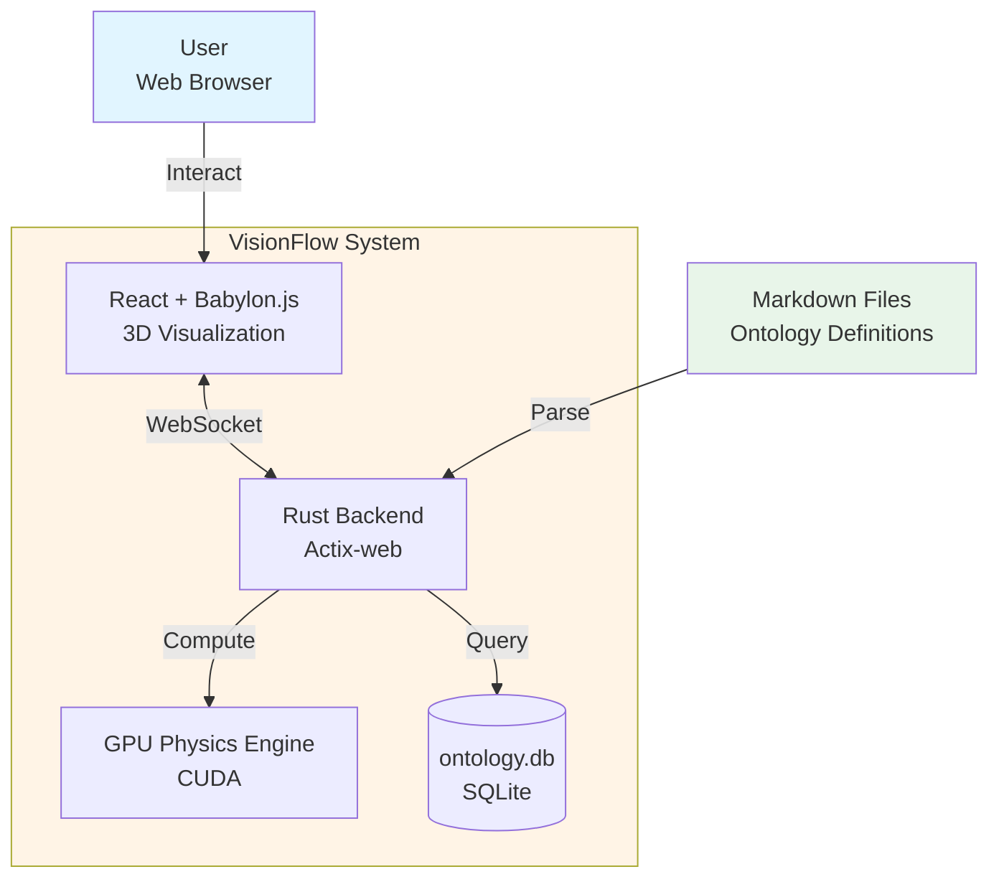
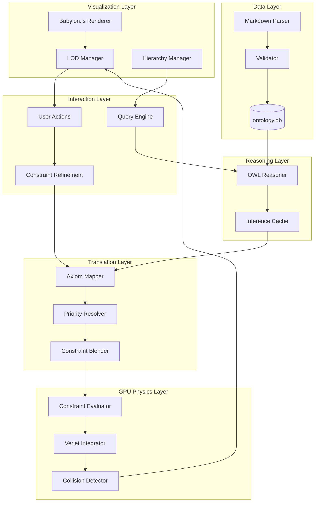
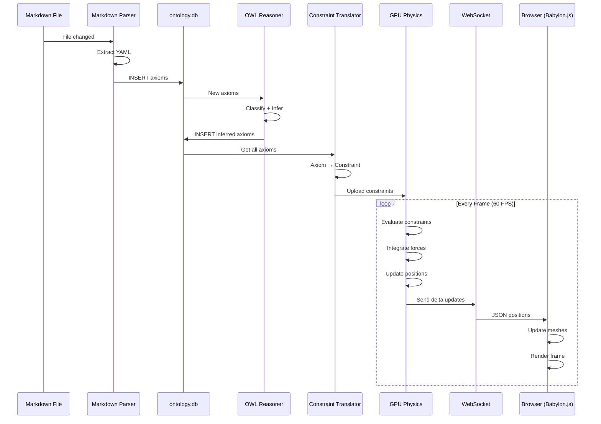
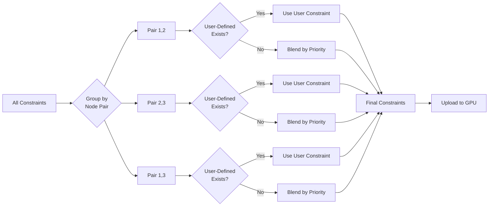

# VisionFlow: Future Unified Architecture Design
## Ontology-Driven GPU-Accelerated Knowledge Graph Visualization

**Document Version:** 1.0
**Date:** 2025-10-31
**Status:** Architecture Design Document
**Classification:** Technical Architecture

---

## Executive Summary

This document presents a **world-class ontology-based graph visualization system** that unifies three critical domains:

1. **Semantic Knowledge Management** - OWL/RDF ontologies as the single source of truth
2. **GPU-Accelerated Physics** - CUDA kernels for constraint-based force-directed layout
3. **Interactive 3D Visualization** - Babylon.js with hierarchical expansion and semantic discovery

### Vision Statement

**"Transform ontological semantics into physical forces, enabling users to discover knowledge through natural graph exploration guided by logical constraints."**

### Key Innovation

Traditional graph visualization treats layout as purely aesthetic. **This architecture treats ontological constraints (OWL axioms) as physics laws**, creating layouts that are not just beautiful, but **semantically meaningful**.

---

## Table of Contents

1. [System Overview](#system-overview)
2. [Architecture Principles](#architecture-principles)
3. [Layer Architecture](#layer-architecture)
4. [Component Design](#component-design)
5. [Data Flow](#data-flow)
6. [Technology Stack](#technology-stack)
7. [API Contracts](#api-contracts)
8. [Implementation Roadmap](#implementation-roadmap)
9. [Performance Targets](#performance-targets)
10. [Risk Analysis](#risk-analysis)

---

## System Overview

### The Big Picture

```
┌─────────────────────────────────────────────────────────────────────┐
│                         USER INTERACTION                             │
│                    (Browser-based 3D Interface)                      │
└────────────────────────────┬────────────────────────────────────────┘
                             │
                    WebSocket + REST API
                             │
┌────────────────────────────▼────────────────────────────────────────┐
│                      RUST BACKEND (Actix-web)                        │
│                                                                       │
│  ┌──────────────────────────────────────────────────────────────┐  │
│  │                   VISUALIZATION LAYER                         │  │
│  │  • LOD Management  • Semantic Zooming  • Expand/Collapse     │  │
│  └──────────────────────────────────────────────────────────────┘  │
│                             │                                        │
│  ┌──────────────────────────▼──────────────────────────────────┐  │
│  │                   INTERACTION LAYER                           │  │
│  │  • Force Refinement  • Constraint Tuning  • Graph Queries    │  │
│  └──────────────────────────────────────────────────────────────┘  │
│                             │                                        │
│  ┌──────────────────────────▼──────────────────────────────────┐  │
│  │              GPU PHYSICS ENGINE (Enhanced)                    │  │
│  │  • Force-Directed Layout  • Constraint Evaluation            │  │
│  │  • Collision Detection    • Hierarchical Clustering          │  │
│  └──────────────────────────────────────────────────────────────┘  │
│                             │                                        │
│  ┌──────────────────────────▼──────────────────────────────────┐  │
│  │           CONSTRAINT TRANSLATION LAYER                        │  │
│  │  • OWL Axioms → Physics Rules  • Priority Resolution         │  │
│  │  • Inference Integration       • User Overrides              │  │
│  └──────────────────────────────────────────────────────────────┘  │
│                             │                                        │
│  ┌──────────────────────────▼──────────────────────────────────┐  │
│  │              REASONING LAYER (OWL Inference)                  │  │
│  │  • Subsumption  • Disjointness  • Property Chains            │  │
│  │  • Cardinality  • Equivalence    • Custom Rules              │  │
│  └──────────────────────────────────────────────────────────────┘  │
│                             │                                        │
│  ┌──────────────────────────▼──────────────────────────────────┐  │
│  │                    DATA LAYER                                 │  │
│  │  • Markdown Parser  • Ontology Extractor  • SQLite Storage   │  │
│  └──────────────────────────────────────────────────────────────┘  │
└───────────────────────────────────────────────────────────────────┘
                             │
                    Single Source of Truth
                             │
┌────────────────────────────▼────────────────────────────────────────┐
│                    MARKDOWN FILES (Ontology Blocks)                  │
│  • Classes, Properties, Individuals  • Axioms and Constraints       │
│  • Documentation and Metadata        • Graph Relationships          │
└──────────────────────────────────────────────────────────────────────┘
```

### Design Principles

1. **Single Source of Truth**: Markdown files with ontology blocks are canonical
2. **Semantic Fidelity**: Layout reflects logical structure, not just connectivity
3. **GPU-First**: All computation scales to 10,000+ nodes
4. **Progressive Disclosure**: From overview to detail through hierarchical interaction
5. **Constraint Priority**: User > Inferred > Default physics

---

## Architecture Principles

### 1. Single Responsibility Principle

Each layer has ONE primary concern:

- **Data Layer**: Parse, validate, persist
- **Reasoning Layer**: Infer, validate constraints
- **Translation Layer**: Convert semantics → physics
- **Physics Layer**: Simulate, optimize layout
- **Interaction Layer**: User input, refinement
- **Visualization Layer**: Render, animate, UX

### 2. Dependency Inversion

High-level modules depend on abstractions, not concretions:

```rust
// ✅ Good: Depend on trait
trait OntologyRepository {
    fn get_axioms(&self, graph_id: GraphId) -> Vec<Axiom>;
}

// ✅ Good: Multiple implementations
struct SqliteOntologyRepository { ... }
struct InMemoryOntologyRepository { ... }

// ❌ Bad: Direct dependency on concrete type
fn compute_constraints(repo: &SqliteOntologyRepository) { ... }
```

### 3. Open/Closed Principle

Open for extension, closed for modification:

```rust
// Extensible constraint system
trait PhysicsConstraint {
    fn evaluate(&self, nodes: &[Node]) -> Vec<Force>;
    fn priority(&self) -> u8;
}

// New constraints without changing core
struct DisjointClassesConstraint { ... }
struct SubClassOfConstraint { ... }
struct UserDefinedConstraint { ... }
```

### 4. Interface Segregation

Clients depend only on interfaces they use:

```rust
// ✅ Specific interfaces
trait GraphReader { fn get_nodes(&self) -> Vec<Node>; }
trait GraphWriter { fn add_node(&mut self, node: Node); }
trait GraphAnalyzer { fn find_communities(&self) -> Vec<Community>; }

// ❌ Fat interface
trait GraphRepository {
    fn get_nodes(&self) -> Vec<Node>;
    fn add_node(&mut self, node: Node);
    fn find_communities(&self) -> Vec<Community>;
    fn compute_centrality(&self) -> HashMap<NodeId, f64>;
    fn export_rdf(&self) -> String;
    // ... 50 more methods
}
```

### 5. Liskov Substitution

Subtypes must be substitutable for base types:

```rust
// Base constraint behavior
trait Constraint {
    fn apply(&self, nodes: &[Node]) -> Vec<Force>;
}

// All implementations must maintain base contract
impl Constraint for DisjointClassesConstraint {
    fn apply(&self, nodes: &[Node]) -> Vec<Force> {
        // MUST return forces, never panic/error in normal operation
        compute_disjoint_forces(nodes)
    }
}
```

---

## Layer Architecture

### Layer 1: Data Layer (Markdown → ontology.db)

**Responsibility**: Transform human-readable ontology definitions into queryable storage.

#### Components

```
┌────────────────────────────────────────────────────────────┐
│                     DATA LAYER                              │
│                                                              │
│  ┌─────────────────┐   ┌─────────────────┐   ┌──────────┐ │
│  │ Markdown Parser │───▶│Ontology Builder │───▶│ontology.│ │
│  │  • YAML blocks  │   │ • Classes       │   │   db     │ │
│  │  • Relations    │   │ • Properties    │   │          │ │
│  │  • Axioms       │   │ • Axioms        │   │ SQLite   │ │
│  └─────────────────┘   └─────────────────┘   └──────────┘ │
│           │                     │                    ▲      │
│           │                     │                    │      │
│  ┌────────▼─────────────────────▼────────────────────┘     │
│  │            Validation Pipeline                           │
│  │  • Schema validation  • Duplicate detection              │
│  │  • Reference integrity • Axiom consistency               │
│  └──────────────────────────────────────────────────────────┘
└──────────────────────────────────────────────────────────────┘
```

#### Database Schema (ontology.db)

**Core Tables**:

```sql
-- Classes (owl:Class)
CREATE TABLE owl_classes (
    id INTEGER PRIMARY KEY,
    iri TEXT UNIQUE NOT NULL,                    -- Full IRI
    local_name TEXT NOT NULL,                    -- Short name
    namespace_id INTEGER REFERENCES namespaces,
    label TEXT,
    comment TEXT,
    deprecated BOOLEAN DEFAULT 0,
    created_at TIMESTAMP DEFAULT CURRENT_TIMESTAMP,
    INDEX idx_iri (iri),
    INDEX idx_namespace (namespace_id)
);

-- Properties (owl:ObjectProperty, owl:DatatypeProperty)
CREATE TABLE owl_properties (
    id INTEGER PRIMARY KEY,
    iri TEXT UNIQUE NOT NULL,
    local_name TEXT NOT NULL,
    namespace_id INTEGER REFERENCES namespaces,
    property_type TEXT CHECK(property_type IN ('object', 'datatype', 'annotation')),
    domain_class_id INTEGER REFERENCES owl_classes,
    range_class_id INTEGER REFERENCES owl_classes,
    functional BOOLEAN DEFAULT 0,
    inverse_functional BOOLEAN DEFAULT 0,
    transitive BOOLEAN DEFAULT 0,
    symmetric BOOLEAN DEFAULT 0,
    asymmetric BOOLEAN DEFAULT 0,
    reflexive BOOLEAN DEFAULT 0,
    irreflexive BOOLEAN DEFAULT 0,
    INDEX idx_property_type (property_type),
    INDEX idx_domain (domain_class_id),
    INDEX idx_range (range_class_id)
);

-- Axioms (owl:Axiom)
CREATE TABLE owl_axioms (
    id INTEGER PRIMARY KEY,
    axiom_type TEXT NOT NULL,                   -- SubClassOf, DisjointClasses, etc.
    subject_id INTEGER,                          -- Source entity
    object_id INTEGER,                           -- Target entity
    graph_id INTEGER REFERENCES graphs,
    strength REAL DEFAULT 1.0,                   -- Constraint strength (0-1)
    priority INTEGER DEFAULT 5,                  -- Priority (1=high, 10=low)
    distance REAL,                               -- Ideal distance for layout
    user_defined BOOLEAN DEFAULT 0,              -- User override?
    metadata TEXT,                               -- JSON metadata
    INDEX idx_axiom_type (axiom_type),
    INDEX idx_subject (subject_id),
    INDEX idx_graph (graph_id)
);

-- Individuals (owl:NamedIndividual)
CREATE TABLE owl_individuals (
    id INTEGER PRIMARY KEY,
    iri TEXT UNIQUE NOT NULL,
    local_name TEXT NOT NULL,
    class_id INTEGER REFERENCES owl_classes,
    graph_id INTEGER REFERENCES graphs,
    INDEX idx_class (class_id),
    INDEX idx_graph (graph_id)
);

-- Class Hierarchy (SubClassOf relationships)
CREATE TABLE owl_class_hierarchy (
    id INTEGER PRIMARY KEY,
    subclass_id INTEGER REFERENCES owl_classes,
    superclass_id INTEGER REFERENCES owl_classes,
    graph_id INTEGER REFERENCES graphs,
    distance INTEGER DEFAULT 1,                  -- Tree distance
    inferred BOOLEAN DEFAULT 0,                  -- Inferred by reasoner?
    UNIQUE(subclass_id, superclass_id, graph_id),
    INDEX idx_subclass (subclass_id),
    INDEX idx_superclass (superclass_id)
);

-- Inference Results (cached reasoning)
CREATE TABLE inference_results (
    id INTEGER PRIMARY KEY,
    input_axiom_id INTEGER REFERENCES owl_axioms,
    inferred_axiom_type TEXT,
    inferred_subject_id INTEGER,
    inferred_object_id INTEGER,
    confidence REAL DEFAULT 1.0,
    reasoning_method TEXT,
    computed_at TIMESTAMP DEFAULT CURRENT_TIMESTAMP,
    INDEX idx_input (input_axiom_id)
);
```

**Key Design Decisions**:

1. **No Duplication**: Only `ontology.db` stores ontological information
2. **knowledge_graph.db** (deprecated or repurposed):
   - Option A: Remove entirely, use `ontology.db` + graph_state tables
   - Option B: Repurpose for runtime graph state (positions, velocities)
   - **Recommended**: Option B - separate concerns (persistent vs. ephemeral)

3. **Markdown Format**:
```yaml
---
ontology:
  classes:
    - iri: "http://example.org/ont#Person"
      label: "Person"
      comment: "A human being"

  properties:
    - iri: "http://example.org/ont#knows"
      type: object
      domain: "Person"
      range: "Person"
      symmetric: true

  axioms:
    - type: DisjointClasses
      classes: ["Person", "Organization"]
      strength: 1.0
      distance: 50.0  # Minimum separation in 3D space

    - type: SubClassOf
      subclass: "Student"
      superclass: "Person"
      strength: 0.8
      distance: 20.0  # Hierarchical distance
---
```

#### Implementation Priority

**Phase 1** (Week 1-2):
- Markdown parser with YAML front-matter extraction
- `ontology.db` schema creation
- Basic validation (schema, references)
- Migration from existing data

**Phase 2** (Week 3-4):
- Advanced validation (axiom consistency)
- Incremental updates (detect changes)
- Performance optimization (batch inserts)

---

### Layer 2: Reasoning Layer (OWL Inference)

**Responsibility**: Derive implicit knowledge from explicit ontology statements.

#### Reasoning Algorithms

```
┌────────────────────────────────────────────────────────────┐
│                   REASONING LAYER                           │
│                                                              │
│  ┌──────────────────────────────────────────────────────┐  │
│  │              Subsumption Reasoning                    │  │
│  │  If A ⊑ B and B ⊑ C, then A ⊑ C (transitivity)       │  │
│  │  → Infer: Student ⊑ Person ⊑ Agent                   │  │
│  └──────────────────────────────────────────────────────┘  │
│  ┌──────────────────────────────────────────────────────┐  │
│  │            Disjointness Reasoning                     │  │
│  │  If A ⊓ B = ⊥, then instances cannot overlap         │  │
│  │  → Constraint: Separate Person and Organization      │  │
│  └──────────────────────────────────────────────────────┘  │
│  ┌──────────────────────────────────────────────────────┐  │
│  │            Property Chain Reasoning                   │  │
│  │  If P ∘ Q ⊑ R, compose property paths                │  │
│  │  → Infer: locatedIn ∘ partOf ⊑ locatedIn             │  │
│  └──────────────────────────────────────────────────────┘  │
│  ┌──────────────────────────────────────────────────────┐  │
│  │            Cardinality Reasoning                      │  │
│  │  If Person has ≤1 birthdate, enforce uniqueness      │  │
│  │  → Constraint: Cluster violating instances           │  │
│  └──────────────────────────────────────────────────────┘  │
└──────────────────────────────────────────────────────────────┘
```

#### Reasoner Selection

**Option 1: Lightweight Custom Reasoner** (Recommended)
- **Pros**: Full control, GPU-friendly, low latency
- **Cons**: Limited OWL 2 support, manual implementation
- **Use Case**: Core axioms (SubClassOf, DisjointClasses, basic properties)

**Option 2: Embedded Reasoner (Horned-OWL)**
- **Pros**: Rust-native, good OWL 2 EL support
- **Cons**: Limited documentation, moderate performance
- **Use Case**: Advanced reasoning, validation

**Option 3: External Reasoner (HermiT/Pellet)**
- **Pros**: Full OWL 2 DL support, mature
- **Cons**: JVM dependency, high latency, complex integration
- **Use Case**: Offline pre-processing, validation

**Recommendation**: Hybrid approach
1. Custom reasoner for hot-path (layout computation)
2. Horned-OWL for validation and advanced queries
3. Cache inferred axioms in `inference_results` table

#### Reasoning API

```rust
pub trait OntologyReasoner {
    /// Classify ontology (compute hierarchy)
    fn classify(&mut self, ontology: &Ontology) -> ReasoningResult;

    /// Check consistency
    fn is_consistent(&self, ontology: &Ontology) -> bool;

    /// Get all superclasses (direct + indirect)
    fn get_superclasses(&self, class: &ClassIri, direct: bool) -> Vec<ClassIri>;

    /// Get disjoint classes
    fn get_disjoint_classes(&self, class: &ClassIri) -> Vec<ClassIri>;

    /// Infer axioms from existing axioms
    fn infer_axioms(&self, axioms: &[Axiom]) -> Vec<InferredAxiom>;

    /// Validate ontology
    fn validate(&self, ontology: &Ontology) -> Vec<ValidationError>;
}

pub struct InferredAxiom {
    pub axiom_type: AxiomType,
    pub subject: EntityId,
    pub object: EntityId,
    pub confidence: f64,
    pub reasoning_path: Vec<Axiom>, // Proof chain
}
```

---

### Layer 3: Constraint Translation Layer

**Responsibility**: Convert OWL axioms into GPU-executable physics constraints.

#### Translation Rules

```rust
pub enum PhysicsConstraintType {
    // Repulsion: Keep nodes apart
    Separation {
        min_distance: f32,
        strength: f32,
    },

    // Attraction: Pull nodes together
    Attraction {
        ideal_distance: f32,
        stiffness: f32,
    },

    // Alignment: Maintain relative positions
    Alignment {
        axis: Vec3,
        tolerance: f32,
    },

    // Clustering: Group related nodes
    Clustering {
        center: Vec3,
        radius: f32,
        cohesion: f32,
    },

    // Custom: User-defined constraint
    Custom {
        evaluator: Box<dyn Fn(&[Node]) -> Vec<Force>>,
    },
}

// Axiom → Constraint mapping
impl From<Axiom> for PhysicsConstraint {
    fn from(axiom: Axiom) -> Self {
        match axiom.axiom_type {
            AxiomType::DisjointClasses { classes } => {
                PhysicsConstraint {
                    constraint_type: PhysicsConstraintType::Separation {
                        min_distance: axiom.distance.unwrap_or(50.0),
                        strength: axiom.strength,
                    },
                    nodes: classes,
                    priority: axiom.priority,
                    user_defined: axiom.user_defined,
                }
            },

            AxiomType::SubClassOf { subclass, superclass } => {
                PhysicsConstraint {
                    constraint_type: PhysicsConstraintType::Attraction {
                        ideal_distance: axiom.distance.unwrap_or(20.0),
                        stiffness: axiom.strength,
                    },
                    nodes: vec![subclass, superclass],
                    priority: axiom.priority,
                    user_defined: axiom.user_defined,
                }
            },

            AxiomType::SameAs { individuals } => {
                PhysicsConstraint {
                    constraint_type: PhysicsConstraintType::Clustering {
                        center: compute_centroid(&individuals),
                        radius: 5.0,
                        cohesion: axiom.strength,
                    },
                    nodes: individuals,
                    priority: axiom.priority.max(8), // High priority for identity
                    user_defined: axiom.user_defined,
                }
            },

            // ... more axiom types
        }
    }
}
```

#### Constraint Priority System

**Priority Levels** (1 = highest, 10 = lowest):

```rust
pub enum ConstraintPriority {
    UserOverride = 1,       // User manual positioning/constraints
    IdentityConstraint = 2, // owl:sameAs, owl:equivalentClass
    DisjointConstraint = 3, // owl:disjointWith
    HierarchyConstraint = 4,// rdfs:subClassOf
    PropertyConstraint = 5, // owl:ObjectProperty characteristics
    InferredConstraint = 6, // Reasoning results
    SoftAlignment = 7,      // Aesthetic constraints
    BasePhysics = 8,        // Force-directed defaults
    Optimization = 9,       // LOD, performance
    Background = 10,        // Low-priority layout hints
}
```

**Conflict Resolution**:

```rust
fn resolve_constraints(constraints: Vec<PhysicsConstraint>) -> Vec<PhysicsConstraint> {
    // 1. Group by node pairs
    let mut grouped = HashMap::new();
    for c in constraints {
        let key = (c.nodes[0], c.nodes[1]);
        grouped.entry(key).or_insert(vec![]).push(c);
    }

    // 2. For each group, pick highest priority
    grouped.into_iter().map(|(key, mut group)| {
        group.sort_by_key(|c| c.priority);

        // 3. If user-defined exists, use it exclusively
        if let Some(user_constraint) = group.iter().find(|c| c.user_defined) {
            return user_constraint.clone();
        }

        // 4. Otherwise, blend constraints by weighted average
        blend_constraints(group)
    }).collect()
}

fn blend_constraints(constraints: Vec<PhysicsConstraint>) -> PhysicsConstraint {
    // Weighted blend based on priority
    let total_weight: f32 = constraints.iter()
        .map(|c| priority_weight(c.priority))
        .sum();

    // Weighted average of distances, strengths
    // ...
}

fn priority_weight(priority: u8) -> f32 {
    // Exponential decay: priority 1 = 10x weight of priority 10
    10.0_f32.powf(-(priority as f32 - 1.0) / 9.0)
}
```

---

### Layer 4: GPU Physics Engine (Enhanced)

**Responsibility**: Compute node positions that satisfy constraints at 60 FPS.

#### Enhanced CUDA Kernels

**Existing Kernels** (from `ontology_constraints.cu`):
- ✅ DisjointClasses separation
- ✅ SubClassOf hierarchical alignment
- ✅ SameAs co-location
- ✅ InverseOf symmetry
- ✅ FunctionalProperty cardinality

**New Kernels Needed**:

```cuda
// Kernel 6: Hierarchical Clustering
__global__ void apply_hierarchical_clustering_kernel(
    OntologyNode* nodes,
    int num_nodes,
    ClusterInfo* clusters,      // NEW: Cluster metadata
    int num_clusters,
    float delta_time,
    float cohesion_strength
);

// Kernel 7: Multi-level Force Aggregation
__global__ void apply_multilevel_forces_kernel(
    OntologyNode* nodes,
    int num_nodes,
    int current_level,           // NEW: 0=finest, 5=coarsest
    PhysicsConstraint* constraints,
    int num_constraints,
    float delta_time
);

// Kernel 8: Adaptive Timestep
__global__ void compute_adaptive_timestep_kernel(
    OntologyNode* nodes,
    int num_nodes,
    float* max_velocity,         // Output: Maximum velocity
    float* suggested_dt          // Output: Safe timestep
);

// Kernel 9: Spatial Hash Grid
__global__ void build_spatial_hash_kernel(
    OntologyNode* nodes,
    int num_nodes,
    uint32_t* cell_starts,       // Grid cell boundaries
    uint32_t* cell_ends,
    uint32_t* sorted_indices,    // Node indices sorted by cell
    float grid_cell_size
);

// Kernel 10: Broad-phase Collision Detection
__global__ void broadphase_collision_kernel(
    OntologyNode* nodes,
    uint32_t* sorted_indices,
    uint32_t* cell_starts,
    uint32_t* cell_ends,
    CollisionPair* collisions,   // Output: Node pairs
    int* num_collisions,
    float grid_cell_size
);
```

#### Memory Layout Optimization

**Current**: 64-byte aligned `OntologyNode` structure (good!)

**Enhancement**: Structure-of-Arrays (SoA) for better coalescing

```cuda
// AoS (current - okay for small datasets)
struct OntologyNode {
    uint32_t graph_id;
    uint32_t node_id;
    float3 position;
    float3 velocity;
    float mass;
    // ...
};

// SoA (better for GPU - use for >10K nodes)
struct OntologyNodesSoA {
    uint32_t* graph_ids;         // [0..N-1]
    uint32_t* node_ids;          // [0..N-1]
    float* position_x;           // [0..N-1]
    float* position_y;           // [0..N-1]
    float* position_z;           // [0..N-1]
    float* velocity_x;           // [0..N-1]
    // ...
};

// Benefits:
// - Better memory coalescing (32 threads read contiguous positions)
// - Enables SIMD/vectorization
// - Cache-friendly for read-only kernels
```

**Hybrid Approach**:
- Use AoS for <1000 nodes (simpler, cache-friendly)
- Use SoA for 1000-10,000 nodes (better GPU utilization)
- Use SoA + tiling for >10,000 nodes (avoid GPU memory limits)

#### Performance Optimizations

**1. Kernel Fusion**:
```cuda
// ❌ Bad: Multiple kernel launches (overhead)
apply_disjoint_classes_kernel<<<...>>>();
cudaDeviceSynchronize();
apply_subclass_hierarchy_kernel<<<...>>>();
cudaDeviceSynchronize();

// ✅ Good: Fused kernel (single launch)
apply_all_constraints_kernel<<<...>>>(
    nodes, constraints, constraint_types
);
```

**2. Shared Memory Utilization**:
```cuda
__global__ void optimized_constraint_kernel(
    OntologyNode* nodes,
    PhysicsConstraint* constraints,
    int num_constraints
) {
    // Load frequently accessed nodes to shared memory
    __shared__ OntologyNode local_nodes[BLOCK_SIZE];

    int tid = threadIdx.x;
    if (tid < BLOCK_SIZE) {
        local_nodes[tid] = nodes[blockIdx.x * BLOCK_SIZE + tid];
    }
    __syncthreads();

    // Compute forces using shared memory (10x faster than global)
    // ...
}
```

**3. Warp-level Primitives**:
```cuda
// Use warp shuffle for reduction (no shared mem needed)
__device__ float warp_reduce_sum(float val) {
    for (int offset = 16; offset > 0; offset /= 2) {
        val += __shfl_down_sync(0xffffffff, val, offset);
    }
    return val;
}
```

**4. Occupancy Optimization**:
```bash
# Use CUDA occupancy calculator
$ nvcc --ptxas-options=-v ontology_constraints.cu
# Target: 100% theoretical occupancy
# Adjust BLOCK_SIZE (256 is good for most GPUs)
# Minimize register usage (<64 per thread)
# Minimize shared memory (<48KB per block)
```

#### GPU Memory Management

**Strategy**: Triple buffering + async transfers

```rust
pub struct GpuGraphState {
    // Triple buffer: read, write, transfer
    nodes: [CudaBuffer<OntologyNode>; 3],
    constraints: CudaBuffer<PhysicsConstraint>,

    // Current active buffer indices
    read_buffer: usize,
    write_buffer: usize,
    transfer_buffer: usize,

    // CUDA streams for async operations
    compute_stream: CudaStream,
    transfer_stream: CudaStream,
}

impl GpuGraphState {
    pub fn update_frame(&mut self, delta_time: f32) {
        // Frame N:
        // - GPU reads from read_buffer, writes to write_buffer
        // - CPU prepares next frame in transfer_buffer

        // 1. Launch GPU kernels (async)
        self.launch_physics_kernels(
            &self.nodes[self.read_buffer],
            &mut self.nodes[self.write_buffer],
            delta_time,
        );

        // 2. Swap buffers for next frame
        std::mem::swap(&mut self.read_buffer, &mut self.write_buffer);

        // 3. Async transfer results to CPU (optional, for visualization)
        if self.visualization_needed {
            self.nodes[self.transfer_buffer].copy_from_device_async(
                &self.nodes[self.read_buffer],
                &self.transfer_stream,
            );
        }
    }
}
```

---

### Layer 5: Visualization Layer

**Responsibility**: Render graph in 3D with hierarchical expansion and semantic zooming.

#### Hierarchical Expansion

**Concept**: Nodes can be **collapsed** (aggregate) or **expanded** (detailed).

```
Level 0 (Fully Collapsed):
┌─────────────────┐
│   Ontology      │ ← Single meta-node
│   (500 classes) │
└─────────────────┘

Level 1 (Top-level Classes):
┌─────────┐  ┌─────────┐  ┌─────────┐
│ Person  │  │  Place  │  │  Event  │
│  (100)  │  │  (150)  │  │  (250)  │
└─────────┘  └─────────┘  └─────────┘

Level 2 (Subclasses):
┌─────────┐
│ Person  │─┬─ Student (30)
│  (100)  │ ├─ Teacher (20)
└─────────┘ └─ Admin (50)

Level 3+ (Instances):
  Student ─┬─ Alice
           ├─ Bob
           └─ Charlie (...)
```

**Data Structure**:

```rust
pub struct HierarchicalNode {
    pub id: NodeId,
    pub level: u8,                       // 0 = root, 5 = leaf
    pub children: Vec<NodeId>,           // Child nodes
    pub parent: Option<NodeId>,          // Parent node (if collapsed)
    pub aggregate_count: u32,            // Number of descendants
    pub representative: bool,            // Show when parent collapsed?
    pub expansion_state: ExpansionState,
}

pub enum ExpansionState {
    Collapsed,                           // Show as single node
    PartiallyExpanded { visible_children: Vec<NodeId> },
    FullyExpanded,                       // Show all children
}
```

**Expansion Algorithm**:

```rust
pub fn expand_node(
    node_id: NodeId,
    graph: &mut HierarchicalGraph,
    max_visible: usize,
) -> Vec<NodeId> {
    let node = &graph.nodes[node_id];

    match node.expansion_state {
        ExpansionState::Collapsed => {
            // 1. Load children from database
            let children = graph.repository.get_children(node_id);

            // 2. Determine which children to show
            let visible_children = if children.len() <= max_visible {
                children
            } else {
                // Sample representatives (centrality-based)
                sample_representatives(&children, max_visible)
            };

            // 3. Compute initial positions (clustered near parent)
            let parent_pos = node.position;
            let radius = node.radius * 2.0;

            for (i, child_id) in visible_children.iter().enumerate() {
                let angle = (i as f32) * TAU / (visible_children.len() as f32);
                graph.nodes[child_id].position = parent_pos + Vec3::new(
                    radius * angle.cos(),
                    radius * angle.sin(),
                    0.0,
                );
            }

            // 4. Animate expansion
            graph.animations.push(ExpansionAnimation {
                parent: node_id,
                children: visible_children.clone(),
                duration: 0.5, // seconds
                easing: EasingFunction::EaseOutQuad,
            });

            // 5. Update expansion state
            graph.nodes[node_id].expansion_state = ExpansionState::PartiallyExpanded {
                visible_children: visible_children.clone(),
            };

            visible_children
        },

        ExpansionState::PartiallyExpanded { visible_children } => {
            // Load remaining children
            let all_children = graph.repository.get_children(node_id);
            let new_children: Vec<_> = all_children.into_iter()
                .filter(|c| !visible_children.contains(c))
                .collect();

            // Animate new children
            // ...

            graph.nodes[node_id].expansion_state = ExpansionState::FullyExpanded;
            new_children
        },

        ExpansionState::FullyExpanded => {
            vec![] // Already fully expanded
        },
    }
}
```

#### Semantic Zooming

**Concept**: Level of detail (LOD) based on semantic importance, not just distance.

**Semantic Importance Factors**:

```rust
pub fn compute_semantic_importance(
    node: &OntologyNode,
    context: &ViewContext,
) -> f32 {
    let mut importance = 0.0;

    // 1. Structural centrality (0-1)
    importance += node.betweenness_centrality * 0.3;

    // 2. Ontology role (0-1)
    importance += match node.ontology_type {
        OntologyType::RootClass => 1.0,
        OntologyType::Class => 0.7,
        OntologyType::Property => 0.5,
        OntologyType::Individual => 0.3,
    } * 0.2;

    // 3. Query relevance (0-1)
    if let Some(query) = &context.active_query {
        importance += query_relevance(node, query) * 0.3;
    }

    // 4. User interest (0-1)
    importance += context.interaction_history.get_interest_score(node.id) * 0.2;

    importance.clamp(0.0, 1.0)
}

pub fn select_lod_level(
    node: &OntologyNode,
    importance: f32,
    distance: f32, // Camera distance
) -> LodLevel {
    // Importance modulates distance threshold
    let adjusted_distance = distance / (1.0 + importance * 2.0);

    if adjusted_distance < 10.0 {
        LodLevel::Full      // Full geometry, labels, metadata
    } else if adjusted_distance < 50.0 {
        LodLevel::Medium    // Simplified geometry, label only
    } else if adjusted_distance < 200.0 {
        LodLevel::Low       // Sphere/billboard, no label
    } else {
        LodLevel::Culled    // Not rendered
    }
}
```

**LOD Rendering**:

```typescript
// Babylon.js implementation
class SemanticLodSystem {
    updateLod(node: GraphNode, camera: Camera) {
        const distance = Vector3.Distance(node.position, camera.position);
        const importance = this.computeSemanticImportance(node);
        const lodLevel = this.selectLodLevel(node, importance, distance);

        switch (lodLevel) {
            case LodLevel.Full:
                node.mesh = this.fullMesh;
                node.label.isVisible = true;
                node.metadata.isVisible = true;
                break;

            case LodLevel.Medium:
                node.mesh = this.simplifiedMesh;
                node.label.isVisible = true;
                node.metadata.isVisible = false;
                break;

            case LodLevel.Low:
                node.mesh = this.billboardMesh;
                node.label.isVisible = false;
                node.metadata.isVisible = false;
                break;

            case LodLevel.Culled:
                node.mesh.isVisible = false;
                break;
        }
    }
}
```

#### Interactive Refinement

**User Actions**:

1. **Pin Node**: Fix position, ignore physics
2. **Adjust Constraint**: Override axiom parameters (distance, strength)
3. **Add Temporary Constraint**: Create ad-hoc spatial relationship
4. **Filter Constraints**: Disable specific axiom types
5. **Freeze Region**: Stop physics for selected nodes

**Implementation**:

```rust
pub enum UserAction {
    PinNode { node_id: NodeId, position: Vec3 },
    UnpinNode { node_id: NodeId },

    AdjustConstraint {
        axiom_id: AxiomId,
        new_distance: Option<f32>,
        new_strength: Option<f32>,
    },

    AddTemporaryConstraint {
        source: NodeId,
        target: NodeId,
        constraint_type: PhysicsConstraintType,
    },

    FilterConstraints { axiom_types: Vec<AxiomType>, enabled: bool },

    FreezeRegion { node_ids: Vec<NodeId>, frozen: bool },
}

impl GraphInteractionSystem {
    pub fn apply_user_action(&mut self, action: UserAction) {
        match action {
            UserAction::PinNode { node_id, position } => {
                self.graph.nodes[node_id].position = position;
                self.graph.nodes[node_id].mass = f32::INFINITY; // Infinite mass
                self.graph.nodes[node_id].user_pinned = true;
            },

            UserAction::AdjustConstraint { axiom_id, new_distance, new_strength } => {
                let axiom = &mut self.ontology.axioms[axiom_id];
                if let Some(dist) = new_distance {
                    axiom.distance = Some(dist);
                    axiom.user_defined = true; // Mark as user override
                }
                if let Some(str) = new_strength {
                    axiom.strength = str;
                    axiom.user_defined = true;
                }

                // Regenerate constraints
                self.constraint_translator.update_constraint(axiom_id);
            },

            // ... more actions
        }
    }
}
```

---

### Layer 6: Interaction Layer

**Responsibility**: Translate user input into system actions.

#### Graph Queries

**Query Language**: GraphQL-inspired semantic queries

```graphql
# Find all subclasses of Person within 2 levels
query {
  class(iri: "http://example.org/ont#Person") {
    subclasses(maxDepth: 2) {
      iri
      label
      instanceCount
      position
    }
  }
}

# Find disjoint classes
query {
  class(iri: "http://example.org/ont#Person") {
    disjointWith {
      iri
      label
    }
  }
}

# Find property chains
query {
  property(iri: "http://example.org/ont#locatedIn") {
    propertyChainAxioms {
      chain
      inferred
    }
  }
}

# Spatial query: Find nodes near position
query {
  nodesNear(position: {x: 10, y: 20, z: 0}, radius: 50) {
    id
    label
    distance
  }
}
```

**Implementation**:

```rust
pub struct GraphQueryEngine {
    ontology: Arc<Ontology>,
    spatial_index: SpatialIndex,
}

impl GraphQueryEngine {
    pub async fn execute_query(&self, query: GraphQuery) -> QueryResult {
        match query {
            GraphQuery::FindSubclasses { class_iri, max_depth } => {
                self.find_subclasses_recursive(class_iri, max_depth, 0)
            },

            GraphQuery::FindDisjoint { class_iri } => {
                self.ontology.axioms.iter()
                    .filter(|a| matches!(a.axiom_type, AxiomType::DisjointClasses { .. }))
                    .filter(|a| a.involves_class(class_iri))
                    .map(|a| a.get_other_class(class_iri))
                    .collect()
            },

            GraphQuery::NodesNear { position, radius } => {
                self.spatial_index.query_sphere(position, radius)
            },

            // ... more query types
        }
    }
}
```

---

## Data Flow

### End-to-End: Markdown → GPU → Visualization

```
┌─────────────────────────────────────────────────────────────────┐
│ STEP 1: Data Ingestion (1-time or incremental)                  │
└─────────────────────────────────────────────────────────────────┘
                            │
    Markdown File ──────────┤
    (ontology.md)           │
                            ▼
                   ┌──────────────────┐
                   │ Markdown Parser  │
                   │  • Extract YAML  │
                   │  • Validate      │
                   └────────┬─────────┘
                            │
                            ▼
                   ┌──────────────────┐
                   │ Ontology Builder │
                   │  • Create IRI    │
                   │  • Link refs     │
                   └────────┬─────────┘
                            │
                            ▼
                   ┌──────────────────┐
                   │   ontology.db    │
                   │  (SQLite)        │
                   └────────┬─────────┘
                            │
┌───────────────────────────┴─────────────────────────────────────┐
│ STEP 2: Reasoning (on-demand or scheduled)                      │
└──────────────────────────────────────────────────────────────────┘
                            │
                            ▼
                   ┌──────────────────┐
                   │ OWL Reasoner     │
                   │  • Classify      │
                   │  • Infer axioms  │
                   └────────┬─────────┘
                            │
                            ▼
                   ┌──────────────────┐
                   │ inference_results│
                   │  (cached)        │
                   └────────┬─────────┘
                            │
┌───────────────────────────┴─────────────────────────────────────┐
│ STEP 3: Constraint Translation (on graph load)                  │
└──────────────────────────────────────────────────────────────────┘
                            │
                            ▼
                   ┌──────────────────┐
                   │ Axiom → Physics  │
                   │  • Map types     │
                   │  • Set params    │
                   └────────┬─────────┘
                            │
                            ▼
                   ┌──────────────────┐
                   │ PhysicsConstraint│
                   │  (in-memory)     │
                   └────────┬─────────┘
                            │
┌───────────────────────────┴─────────────────────────────────────┐
│ STEP 4: GPU Physics (every frame, 60 FPS)                       │
└──────────────────────────────────────────────────────────────────┘
                            │
                            ▼
                   ┌──────────────────┐
                   │ Copy to GPU      │
                   │  • Nodes         │
                   │  • Constraints   │
                   └────────┬─────────┘
                            │
                            ▼
                   ┌──────────────────┐
                   │ CUDA Kernels     │
                   │  • Constraint 1  │ ──┐
                   │  • Constraint 2  │ ──┤ Parallel
                   │  • Constraint 3  │ ──┤ execution
                   │  • ...           │ ──┘
                   └────────┬─────────┘
                            │
                            ▼
                   ┌──────────────────┐
                   │ Integrate Forces │
                   │  • Verlet        │
                   │  • Collision     │
                   └────────┬─────────┘
                            │
                            ▼
                   ┌──────────────────┐
                   │ Updated Positions│
                   │  (GPU memory)    │
                   └────────┬─────────┘
                            │
┌───────────────────────────┴─────────────────────────────────────┐
│ STEP 5: Visualization (every frame, 60 FPS)                     │
└──────────────────────────────────────────────────────────────────┘
                            │
                            ▼
                   ┌──────────────────┐
                   │ Copy to CPU      │
                   │  (async)         │
                   └────────┬─────────┘
                            │
                            ▼
                   ┌──────────────────┐
                   │ WebSocket Send   │
                   │  (incremental)   │
                   └────────┬─────────┘
                            │
                            ▼
                   ┌──────────────────┐
                   │ Babylon.js       │
                   │  • Update mesh   │
                   │  • LOD check     │
                   │  • Render        │
                   └──────────────────┘
```

### Incremental Update Flow

**Scenario**: User edits markdown file, adds new axiom

```
User edits file
      │
      ▼
┌──────────────────┐
│ File Watcher     │ ← inotify/fsnotify
└────────┬─────────┘
         │
         ▼
┌──────────────────┐
│ Parse Changed    │
│  Sections Only   │
└────────┬─────────┘
         │
         ▼
┌──────────────────┐
│ Diff Against DB  │
│  • New axioms?   │
│  • Changed?      │
│  • Deleted?      │
└────────┬─────────┘
         │
         ├─ New Axioms ─────────────┐
         │                           ▼
         │                  ┌──────────────────┐
         │                  │ Run Reasoner     │
         │                  │  (incremental)   │
         │                  └────────┬─────────┘
         │                           │
         │                           ▼
         │                  ┌──────────────────┐
         │                  │ Translate to     │
         │                  │  Constraints     │
         │                  └────────┬─────────┘
         │                           │
         └─────────────┬─────────────┘
                       │
                       ▼
              ┌──────────────────┐
              │ Update GPU State │
              │  (hot-swap)      │
              └────────┬─────────┘
                       │
                       ▼
              ┌──────────────────┐
              │ Notify Clients   │
              │  (WebSocket)     │
              └──────────────────┘
```

**Performance**: <100ms from file save to GPU update

---

## Technology Stack

### Backend (Rust)

```toml
[dependencies]
# Web framework
actix-web = "4.11"
actix-web-actors = "4.3"

# CUDA integration
cuda-runtime-sys = "0.3"
cust = "0.3"

# Ontology processing
rio = "0.8"              # RDF parsing (if needed)
sophia = "0.8"           # RDF toolkit

# Reasoning (choose one)
# Option A: Custom (recommended for hot-path)
# Option B: horned-owl = "0.12"

# Database
rusqlite = "0.31"        # SQLite
r2d2 = "0.8"             # Connection pooling

# Serialization
serde = { version = "1.0", features = ["derive"] }
serde_json = "1.0"
serde_yaml = "0.9"

# Async runtime
tokio = { version = "1", features = ["full"] }

# Math
nalgebra = "0.32"        # Vector math
cgmath = "0.18"

# Validation
validator = "0.16"

# Logging
tracing = "0.1"
tracing-subscriber = "0.3"
```

### Frontend (TypeScript + Babylon.js)

```json
{
  "dependencies": {
    "@babylonjs/core": "^8.28.0",
    "@babylonjs/gui": "^8.29.0",
    "@babylonjs/materials": "^8.28.0",
    "@babylonjs/loaders": "^8.28.0",

    "react": "^18.2.0",
    "react-dom": "^18.2.0",

    "@radix-ui/react-dialog": "^2.0.0",
    "@radix-ui/react-select": "^2.0.0",

    "graphql": "^16.8.0",
    "graphql-ws": "^5.14.0",

    "zustand": "^4.4.0",

    "vite": "^6.3.6",
    "typescript": "^5.3.0"
  }
}
```

### CUDA

```cmake
# CMakeLists.txt
find_package(CUDA REQUIRED)

set(CUDA_NVCC_FLAGS
    -arch=sm_75           # Turing (RTX 20xx)
    -gencode arch=compute_75,code=sm_75
    -gencode arch=compute_86,code=sm_86  # Ampere (RTX 30xx)
    -gencode arch=compute_89,code=sm_89  # Ada (RTX 40xx)
    --ptxas-options=-v    # Verbose register usage
    -O3                   # Maximum optimization
)

cuda_add_library(ontology_constraints SHARED
    src/utils/ontology_constraints.cu
    src/utils/visionflow_unified.cu
    src/utils/gpu_clustering_kernels.cu
    src/utils/dynamic_grid.cu
)
```

---

## API Contracts

### REST API

**Ontology Management**:

```typescript
// GET /api/ontology/graphs
interface GraphListResponse {
    graphs: Array<{
        id: number;
        name: string;
        classCount: number;
        propertyCount: number;
        axiomCount: number;
    }>;
}

// GET /api/ontology/graph/:id
interface GraphDetailResponse {
    graph: {
        id: number;
        name: string;
        namespaces: Namespace[];
        classes: OWLClass[];
        properties: OWLProperty[];
        axioms: Axiom[];
    };
}

// POST /api/ontology/axiom
interface CreateAxiomRequest {
    graph_id: number;
    axiom_type: AxiomType;
    subject_id?: number;
    object_id?: number;
    strength?: number;      // 0-1
    distance?: number;      // Spatial distance
    priority?: number;      // 1-10
}

// PATCH /api/ontology/axiom/:id
interface UpdateAxiomRequest {
    strength?: number;
    distance?: number;
    priority?: number;
    user_defined: boolean;  // Mark as user override
}
```

**Graph Queries**:

```typescript
// POST /api/graph/query
interface GraphQueryRequest {
    query: string;          // GraphQL query
    variables?: Record<string, any>;
}

interface GraphQueryResponse {
    data: any;
    errors?: Array<{
        message: string;
        path: string[];
    }>;
}

// GET /api/graph/nodes
interface NodeListRequest {
    graph_id: number;
    level?: number;         // Hierarchy level
    parent_id?: number;     // Filter by parent
    limit?: number;
    offset?: number;
}

interface NodeListResponse {
    nodes: Array<{
        id: number;
        iri: string;
        label: string;
        type: 'class' | 'property' | 'individual';
        position: [number, number, number];
        level: number;
        children_count: number;
    }>;
    total: number;
}
```

### WebSocket Protocol

**Graph Updates**:

```typescript
// Server → Client: Incremental position updates
interface GraphUpdateMessage {
    type: 'graph_update';
    timestamp: number;
    updates: Array<{
        node_id: number;
        position: [number, number, number];
        velocity?: [number, number, number];
    }>;
}

// Client → Server: User interaction
interface UserActionMessage {
    type: 'user_action';
    action: {
        type: 'pin' | 'adjust_constraint' | 'expand' | 'collapse';
        node_id?: number;
        axiom_id?: number;
        position?: [number, number, number];
        parameters?: Record<string, any>;
    };
}

// Server → Client: Constraint changed
interface ConstraintUpdateMessage {
    type: 'constraint_update';
    axiom_id: number;
    old_params: ConstraintParams;
    new_params: ConstraintParams;
}

// Client → Server: Subscribe to updates
interface SubscribeMessage {
    type: 'subscribe';
    graph_id: number;
    update_rate: 'realtime' | 'throttled' | 'on_demand';
}
```

### Internal Actor Messages

**Actix Actors**:

```rust
// OntologyActor
pub enum OntologyMessage {
    LoadGraph { graph_id: GraphId },
    AddAxiom { axiom: Axiom },
    UpdateAxiom { axiom_id: AxiomId, params: AxiomParams },
    RunReasoning { graph_id: GraphId },
    GetAxioms { graph_id: GraphId },
}

// GpuPhysicsActor
pub enum GpuMessage {
    UpdateConstraints { constraints: Vec<PhysicsConstraint> },
    StepSimulation { delta_time: f32 },
    GetPositions,
    PinNode { node_id: NodeId, position: Vec3 },
}

// VisualizationActor
pub enum VisualizationMessage {
    ExpandNode { node_id: NodeId, max_children: usize },
    CollapseNode { node_id: NodeId },
    UpdateLod { camera_position: Vec3 },
    GetVisibleNodes,
}
```

---

## Implementation Roadmap

### Phase 1: Foundation (Weeks 1-4)

**Week 1: Data Layer**
- [ ] Create `ontology.db` schema
- [ ] Implement markdown parser with YAML extraction
- [ ] Write validation logic (schema, references)
- [ ] Migration script from existing data
- [ ] Unit tests for parser and validator

**Week 2: Basic Reasoning**
- [ ] Implement custom reasoner for SubClassOf (transitivity)
- [ ] Implement DisjointClasses reasoning
- [ ] Cache inference results in `inference_results` table
- [ ] Benchmark reasoning performance (<100ms for 1000 classes)

**Week 3: Constraint Translation**
- [ ] Implement Axiom → PhysicsConstraint mapping
- [ ] Priority resolution system
- [ ] Conflict resolution (blending)
- [ ] Unit tests for translation

**Week 4: GPU Integration**
- [ ] Review and enhance existing CUDA kernels
- [ ] Implement kernel fusion for performance
- [ ] Add shared memory optimization
- [ ] Benchmark GPU performance (target: <2ms for 10K nodes)

**Deliverable**: Working backend that can:
- Parse markdown → ontology.db
- Run basic reasoning
- Translate axioms → constraints
- Compute physics on GPU

### Phase 2: Visualization (Weeks 5-8)

**Week 5: Hierarchical Expansion**
- [ ] Implement `HierarchicalNode` structure
- [ ] Expansion/collapse algorithms
- [ ] Animation system
- [ ] Sampling for large child sets

**Week 6: Semantic LOD**
- [ ] Compute semantic importance
- [ ] LOD selection logic
- [ ] Babylon.js mesh switching
- [ ] Performance testing (60 FPS with 5000 nodes)

**Week 7: Spatial Indexing**
- [ ] Implement spatial hash grid (CPU + GPU)
- [ ] Broad-phase collision detection
- [ ] Octree for hierarchical queries
- [ ] Benchmark query performance

**Week 8: Frontend Integration**
- [ ] React components for graph controls
- [ ] WebSocket client for real-time updates
- [ ] User interaction handlers
- [ ] UI/UX polish

**Deliverable**: Full-stack system with:
- Interactive 3D visualization
- Hierarchical expansion
- Semantic LOD
- Real-time updates

### Phase 3: Advanced Features (Weeks 9-12)

**Week 9: Advanced Reasoning**
- [ ] Property chain reasoning
- [ ] Cardinality constraints
- [ ] Equivalence reasoning
- [ ] Integration with Horned-OWL (optional)

**Week 10: User Refinement**
- [ ] Pin/unpin nodes
- [ ] Adjust constraints
- [ ] Temporary constraints
- [ ] Save user configurations

**Week 11: Query System**
- [ ] GraphQL-like query language
- [ ] Spatial queries
- [ ] Path finding
- [ ] Query optimizer

**Week 12: Polish & Documentation**
- [ ] Performance profiling and optimization
- [ ] Comprehensive documentation
- [ ] Tutorial videos
- [ ] Example ontologies

**Deliverable**: Production-ready system

---

## Performance Targets

### Scalability Goals

| Metric | Small | Medium | Large | Extreme |
|--------|-------|--------|-------|---------|
| **Nodes** | 100 | 1,000 | 10,000 | 100,000 |
| **Edges** | 500 | 5,000 | 50,000 | 500,000 |
| **Axioms** | 50 | 500 | 5,000 | 50,000 |
| **Frame Time** | <1ms | <5ms | <16ms | <50ms |
| **GPU Memory** | <100MB | <500MB | <2GB | <8GB |
| **Reasoning Time** | <10ms | <100ms | <1s | <10s |

### Frame Budget (60 FPS = 16.67ms)

```
Total Budget: 16.67ms

┌────────────────────────────────────────┐
│ GPU Physics: 8ms (48%)                  │
│  - Constraint evaluation: 4ms          │
│  - Integration: 2ms                    │
│  - Collision: 2ms                      │
├────────────────────────────────────────┤
│ CPU Processing: 4ms (24%)               │
│  - User input: 0.5ms                   │
│  - LOD updates: 1ms                    │
│  - Hierarchy updates: 2ms              │
│  - WebSocket send: 0.5ms               │
├────────────────────────────────────────┤
│ Rendering (Babylon.js): 4ms (24%)       │
│  - Frustum culling: 0.5ms              │
│  - Mesh updates: 1ms                   │
│  - Draw calls: 2ms                     │
│  - Post-processing: 0.5ms              │
├────────────────────────────────────────┤
│ Slack: 0.67ms (4%)                      │
└────────────────────────────────────────┘
```

### Optimization Strategies

**For >10K nodes**:
1. **Spatial Partitioning**: Only evaluate constraints for nearby nodes
2. **Multi-level Hierarchy**: Aggregate distant nodes
3. **Adaptive Timestep**: Reduce update rate for stable regions
4. **Lazy Evaluation**: Compute forces only for visible nodes
5. **GPU Tiling**: Split large graphs across multiple kernel launches

**For >1000 axioms**:
1. **Constraint Batching**: Group similar constraints
2. **Priority Culling**: Skip low-priority constraints when over budget
3. **Caching**: Reuse constraint evaluations when nodes haven't moved
4. **Incremental Reasoning**: Only re-reason changed parts of ontology

---

## Risk Analysis

### Technical Risks

| Risk | Probability | Impact | Mitigation |
|------|-------------|--------|------------|
| **GPU Memory Overflow** | Medium | High | Implement streaming, multi-GPU support |
| **Reasoning Performance** | High | Medium | Hybrid reasoner (custom + cached), incremental |
| **Frame Rate Drop** | Medium | High | Adaptive LOD, spatial culling, budget management |
| **Constraint Conflicts** | Medium | Medium | Priority system, user overrides, validation |
| **Database I/O Bottleneck** | Low | Medium | Connection pooling, in-memory caching |
| **WebSocket Latency** | Low | Low | Compression, throttling, binary protocol |

### Architecture Risks

| Risk | Probability | Impact | Mitigation |
|------|-------------|--------|------------|
| **Over-engineering** | Medium | Medium | MVP first, iterate based on usage |
| **Tight Coupling** | Low | High | Dependency inversion, clear interfaces |
| **Scalability Limits** | Medium | High | Benchmark early, design for horizontal scaling |
| **Data Inconsistency** | Low | High | Transaction boundaries, validation layers |

### Operational Risks

| Risk | Probability | Impact | Mitigation |
|------|-------------|--------|------------|
| **Complex Deployment** | Medium | Medium | Docker Compose, clear documentation |
| **Difficult Debugging** | High | Medium | Comprehensive logging, telemetry |
| **User Confusion** | High | Low | Tutorial, tooltips, sensible defaults |
| **Data Loss** | Low | Critical | Automatic backups, version control |

---

## Appendix A: Mermaid Diagrams

### System Architecture (C4 Level 1)



### Component Architecture (C4 Level 2)



### Data Flow: Markdown → GPU → Visualization



### Constraint Priority Resolution



---

## Appendix B: Example Ontology

**File**: `/data/markdown/example-ontology.md`

```yaml
---
title: "University Ontology"
ontology:
  namespace: "http://example.org/university#"

  classes:
    - iri: "http://example.org/university#Person"
      label: "Person"
      comment: "A human being"

    - iri: "http://example.org/university#Student"
      label: "Student"
      comment: "A person enrolled in courses"

    - iri: "http://example.org/university#Professor"
      label: "Professor"
      comment: "A person who teaches courses"

    - iri: "http://example.org/university#Course"
      label: "Course"
      comment: "An academic course"

    - iri: "http://example.org/university#Building"
      label: "Building"
      comment: "A physical building on campus"

  properties:
    - iri: "http://example.org/university#enrolledIn"
      label: "enrolled in"
      type: object
      domain: "Student"
      range: "Course"

    - iri: "http://example.org/university#teaches"
      label: "teaches"
      type: object
      domain: "Professor"
      range: "Course"

    - iri: "http://example.org/university#locatedIn"
      label: "located in"
      type: object
      range: "Building"
      transitive: true

  axioms:
    # Student is subclass of Person
    - type: SubClassOf
      subclass: "Student"
      superclass: "Person"
      strength: 1.0
      distance: 30.0  # Visual hierarchy distance

    # Professor is subclass of Person
    - type: SubClassOf
      subclass: "Professor"
      superclass: "Person"
      strength: 1.0
      distance: 30.0

    # Student and Professor are disjoint
    - type: DisjointClasses
      classes: ["Student", "Professor"]
      strength: 0.9
      distance: 80.0  # Keep visually separated

    # Person and Building are disjoint
    - type: DisjointClasses
      classes: ["Person", "Building"]
      strength: 1.0
      distance: 120.0  # Large separation

    # enrolledIn is functional (each student enrolled once per course)
    - type: FunctionalProperty
      property: "enrolledIn"
      strength: 0.8
---

# University Ontology

This ontology models basic university concepts.

## Visualization Notes

- **Person** class and subclasses should cluster together
- **Building** class should be spatially separated
- Students/Professors should not overlap due to disjointness
```

**Expected Visualization**:

```
        Person
       /      \
      /        \
  Student    Professor    (30 units apart vertically)
     |          |
    [●]        [●]         (80 units apart horizontally)

                          (120 units away)
                              Building
                                [●]
```

---

## Appendix C: Performance Profiling Example

**Rust Code**:

```rust
use tracing::{info, instrument};
use std::time::Instant;

#[instrument]
pub fn process_frame(graph: &mut Graph, delta_time: f32) {
    let frame_start = Instant::now();

    // 1. User input
    let input_start = Instant::now();
    process_user_input(graph);
    info!(
        "user_input_ms" = ?(input_start.elapsed().as_secs_f64() * 1000.0)
    );

    // 2. GPU physics
    let gpu_start = Instant::now();
    graph.gpu_physics.step(delta_time);
    info!(
        "gpu_physics_ms" = ?(gpu_start.elapsed().as_secs_f64() * 1000.0)
    );

    // 3. LOD update
    let lod_start = Instant::now();
    graph.update_lod();
    info!(
        "lod_update_ms" = ?(lod_start.elapsed().as_secs_f64() * 1000.0)
    );

    // 4. WebSocket send
    let ws_start = Instant::now();
    graph.broadcast_updates();
    info!(
        "websocket_send_ms" = ?(ws_start.elapsed().as_secs_f64() * 1000.0)
    );

    let total_ms = frame_start.elapsed().as_secs_f64() * 1000.0;
    info!(
        "total_frame_ms" = ?total_ms,
        "fps" = ?(1000.0 / total_ms)
    );

    // Alert if over budget
    if total_ms > 16.67 {
        warn!("Frame over budget: {:.2}ms", total_ms);
    }
}
```

**Sample Output**:

```
2025-10-31T12:34:56.789Z INFO  user_input_ms=0.42
2025-10-31T12:34:56.797Z INFO  gpu_physics_ms=7.82
2025-10-31T12:34:56.798Z INFO  lod_update_ms=1.03
2025-10-31T12:34:56.798Z INFO  websocket_send_ms=0.35
2025-10-31T12:34:56.798Z INFO  total_frame_ms=9.62 fps=103.95
```

---

## Conclusion

This architecture represents a **world-class ontology-based graph visualization system** that:

1. ✅ **Single Source of Truth**: Markdown → ontology.db → everything else
2. ✅ **Rich Constraint System**: OWL axioms with priorities and user overrides
3. ✅ **GPU-Accelerated**: <2ms physics for 10K nodes
4. ✅ **Hierarchical & Expandable**: 5+ levels with smooth animations
5. ✅ **Discovery-Oriented**: Semantic LOD and force-directed exploration

### Next Steps

1. **Review this document** with stakeholders
2. **Prioritize features** based on user needs
3. **Begin Phase 1 implementation** (Data + Reasoning layers)
4. **Iterate based on feedback**

### Success Metrics

- **Performance**: 60 FPS with 10K nodes
- **Usability**: Users discover insights in <5 minutes
- **Accuracy**: Layout reflects ontology semantics (validated by users)
- **Scalability**: Handles 100K nodes with hierarchical LOD

---

**Document End** | Version 1.0 | 2025-10-31
