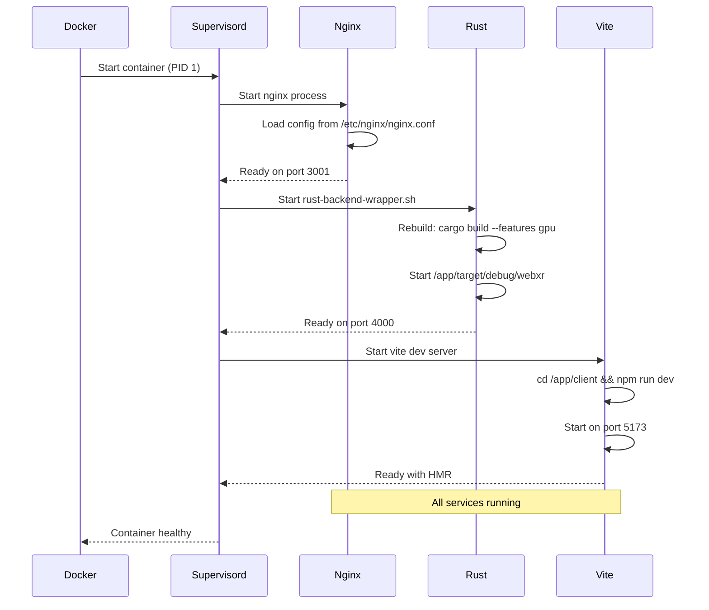

# VisionFlow System Architecture Analysis

**Analysis Date:** 2025-10-23
**Container:** visionflow_container
**Network:** docker_ragflow (172.18.0.0/16)
**Primary Port:** 3001 (exposed to host)

## Executive Summary

VisionFlow is a GPU-accelerated WebXR knowledge graph visualization platform built with:
- **Backend:** Rust (Actix-web) with CUDA GPU support
- **Frontend:** React + Vite + Babylon.js
- **Proxy:** Nginx reverse proxy
- **Process Manager:** Supervisord
- **Container Runtime:** Docker with NVIDIA GPU support

---

## 1. System Architecture Overview

### High-Level Architecture (C4 Context Diagram)

```
┌─────────────────────────────────────────────────────────────────┐
│                         External Users                           │
│                    (Web Browser Clients)                         │
└────────────────────────┬────────────────────────────────────────┘
                         │
                         │ HTTP/WebSocket
                         │ Port 3001
                         ▼
┌─────────────────────────────────────────────────────────────────┐
│                    VisionFlow Container                          │
│                  (visionflow_container)                          │
│                   IP: 172.18.0.11                                │
│                                                                   │
│  ┌────────────────────────────────────────────────────────────┐ │
│  │                    Nginx Reverse Proxy                      │ │
│  │                    Port 3001 (public)                       │ │
│  │  • SSL/TLS termination                                      │ │
│  │  • Request routing                                          │ │
│  │  • WebSocket upgrade                                        │ │
│  │  • Security headers (COOP, COEP)                            │ │
│  └──────────┬──────────────────────────┬──────────────────────┘ │
│             │                           │                         │
│             │                           │                         │
│  ┌──────────▼──────────┐     ┌─────────▼──────────────┐         │
│  │  Rust Backend       │     │  Vite Dev Server       │         │
│  │  (webxr)            │     │  (React Frontend)      │         │
│  │  Port 4000          │     │  Port 5173             │         │
│  │                     │     │                        │         │
│  │  • REST API         │     │  • Hot Module Reload   │         │
│  │  • WebSocket        │     │  • Static Assets       │         │
│  │  • GPU Physics      │     │  • Babylon.js 3D       │         │
│  │  • Graph Data       │     │  • React Components    │         │
│  │  • MCP Integration  │     │                        │         │
│  └─────────────────────┘     └────────────────────────┘         │
│                                                                   │
└─────────────────────────────────────────────────────────────────┘
                         │
                         │ Docker Network
                         │ (docker_ragflow)
                         ▼
┌─────────────────────────────────────────────────────────────────┐
│                    External Services                             │
│  • agentic-workstation (172.18.0.7) - MCP Server                │
│  • ragflow-es-01 (172.18.0.4) - Copyparty File Browser          │
│  • Other containers in docker_ragflow network                    │
└─────────────────────────────────────────────────────────────────┘
```

---

## 2. Component Architecture (C4 Container Diagram)

### 2.1 Nginx Reverse Proxy Configuration

**Purpose:** Single unified entry point for all services on port 3001

**Key Features:**
- Request routing based on path patterns
- WebSocket upgrade support
- CORS and security headers
- Client-side routing fallback
- Static asset serving

**Routing Rules:**

| Path Pattern | Upstream Service | Purpose | Protocol |
|-------------|------------------|---------|----------|
| `/api/*` | rust_backend:4000 | REST API endpoints | HTTP/1.1 |
| `/wss` | rust_backend:4000 | Graph WebSocket | WebSocket |
| `/ws/speech` | rust_backend:4000 | Speech services | WebSocket |
| `/ws/mcp-relay` | rust_backend:4000 | MCP relay | WebSocket |
| `/browser/*` | 172.18.0.4:3923 | Copyparty file browser | HTTP |
| `/vite-hmr` | vite_frontend:5173 | Hot Module Reload | WebSocket |
| `/@vite/*`, `/@fs/*` | vite_frontend:5173 | Vite dev resources | HTTP |
| `/*` | vite_frontend:5173 | Frontend SPA | HTTP |

**Security Headers:**
```nginx
Cross-Origin-Opener-Policy: same-origin
Cross-Origin-Embedder-Policy: require-corp
X-Content-Type-Options: nosniff
```

**Timeouts:**
- API requests: 300s (5 min)
- WebSocket connections: 3600s (1 hour)
- File uploads: 100MB max, unlimited for /browser/

### 2.2 Rust Backend (webxr)

**Binary Location:** `/app/target/debug/webxr` (dev mode)
**Port:** 4000 (internal)
**Build System:** Cargo with GPU features

**Key Dependencies:**
```toml
[package]
name = "webxr"
version = "0.1.0"
edition = "2021"

[dependencies]
actix-web = "4.11.0"          # Web framework
actix-web-actors = "4.3"       # WebSocket actors
actix-cors = "0.7.1"           # CORS handling
tungstenite = "0.21.0"         # WebSocket protocol
crossbeam-channel = "0.5"      # Multi-threaded channels
```

**Capabilities:**
- GPU-accelerated graph physics (CUDA/PTX)
- WebSocket-based graph streaming
- REST API for graph data
- MCP (Model Context Protocol) integration
- Speech services integration
- Real-time telemetry

**Environment Variables:**
```bash
RUST_LOG=debug                           # Logging level
RUST_BACKTRACE=1                         # Stack traces
SYSTEM_NETWORK_PORT=4000                 # HTTP server port
MCP_TCP_PORT=9500                        # MCP relay port
MCP_TRANSPORT=tcp                        # MCP protocol
CLAUDE_FLOW_HOST=agentic-workstation     # MCP server host
DOCKER_ENV=1                             # Enable PTX runtime compilation
```

**Build Process:**
```bash
# Development rebuild (automatic on container restart)
cargo build --features gpu

# Production build
cargo build --release --features gpu
```

### 2.3 Vite Frontend (React + Babylon.js)

**Directory:** `/app/client`
**Port:** 5173 (internal)
**Build Tool:** Vite 6.3.6

**Key Technologies:**
```json
{
  "@babylonjs/core": "8.28.0",          // 3D rendering engine
  "@babylonjs/gui": "8.29.0",           // 3D UI components
  "@babylonjs/loaders": "8.28.0",       // 3D model loaders
  "@babylonjs/materials": "8.28.0",     // Material system
  "@radix-ui/*": "^2.x",                // UI component library
  "@react-three/drei": "^9.80.0",       // React Three.js helpers
  "@getalby/sdk": "^4.1.1",             // Lightning payments
  "@mediapipe/tasks-vision": "^0.10.21" // Computer vision
}
```

**Vite Configuration Highlights:**

```typescript
server: {
  host: '0.0.0.0',
  port: 5173,

  // HMR through Nginx proxy
  hmr: {
    clientPort: 3001,      // Connect to Nginx proxy
    path: '/vite-hmr',     // WebSocket endpoint
  },

  // Proxy API requests to backend
  proxy: {
    '/api': {
      target: 'http://visionflow_container:4000',
      changeOrigin: true,
      secure: false,
    },
    '/ws': {
      target: 'ws://visionflow_container:4000',
      ws: true,
    }
  },

  // Security headers for SharedArrayBuffer
  headers: {
    'Cross-Origin-Opener-Policy': 'same-origin',
    'Cross-Origin-Embedder-Policy': 'require-corp',
  },

  // Docker file watching
  watch: {
    usePolling: true,
    interval: 1000,
  }
}
```

**File Structure:**
```
/app/client/
├── src/
│   ├── features/          # Feature modules
│   │   └── visualisation/ # 3D visualization
│   ├── api/               # API clients
│   ├── types/             # TypeScript types
│   └── components/        # React components
├── public/                # Static assets
├── dist/                  # Build output
├── vite.config.ts         # Vite configuration
├── package.json           # Dependencies
└── tsconfig.json          # TypeScript config
```

### 2.4 Supervisord Process Manager

**Configuration:** `/app/supervisord.dev.conf`
**Socket:** `/tmp/supervisor.sock`

**Managed Processes:**

| Program | Command | Port | Auto-restart | Purpose |
|---------|---------|------|--------------|---------|
| nginx | `/usr/sbin/nginx -g "daemon off;"` | 3001 | Yes | Reverse proxy |
| rust-backend | `/app/scripts/rust-backend-wrapper.sh` | 4000 | Yes | Backend API |
| vite-dev | `cd /app/client && npm run dev` | 5173 | Yes | Frontend dev server |

**Logging Configuration:**
```ini
[program:rust-backend]
stdout_logfile=/app/logs/rust.log
stderr_logfile=/app/logs/rust-error.log
stdout_logfile_maxbytes=50MB
stdout_logfile_backups=3
```

**Log Locations:**
- Supervisord: `/app/logs/supervisord.log`
- Nginx: `/app/logs/nginx.log`, `/var/log/nginx/`
- Rust: `/app/logs/rust.log`
- Vite: `/app/logs/vite.log`

---

## 3. Network Architecture

### 3.1 Docker Network Configuration

**Network Name:** `docker_ragflow`
**Subnet:** 172.18.0.0/16
**Gateway:** 172.18.0.1

**Container Addresses:**

| Container | IP Address | Hostname | Purpose |
|-----------|-----------|----------|---------|
| visionflow_container | 172.18.0.11 | visionflow_container, webxr | VisionFlow application |
| agentic-workstation | 172.18.0.7 | agentic-workstation | MCP server, Claude Flow |
| ragflow-es-01 | 172.18.0.4 | ragflow-es-01 | Copyparty file browser |
| vircadia_world_postgres | 172.18.0.2 | - | PostgreSQL database |
| vircadia_world_pgweb | 172.18.0.3 | - | PostgreSQL web UI |
| vircadia_world_api_manager | 172.18.0.5 | - | Vircadia API |
| whisper-webui | 172.18.0.6 | - | Whisper ASR |
| ragflow-minio | 172.18.0.8 | - | S3 storage |
| ragflow-mysql | 172.18.0.9 | - | MySQL database |
| kokoro-tts-container | 172.18.0.10 | - | TTS service |
| ragflow-redis | 172.18.0.12 | - | Redis cache |
| ragflow-server | 172.18.0.13 | - | RAGFlow server |

### 3.2 Port Mapping

**External (Host) → Internal (Container):**
- `0.0.0.0:3001` → `3001` (Nginx proxy, **only exposed port**)

**Internal Services (not exposed to host):**
- `127.0.0.1:4000` - Rust backend
- `127.0.0.1:5173` - Vite dev server
- `24678` - Vite HMR (internal)

### 3.3 Data Flow Architecture

```
┌──────────────┐
│   Browser    │
│  (Client)    │
└──────┬───────┘
       │ HTTP/WS: localhost:3001
       │
       ▼
┌─────────────────────────────────────────────────────────┐
│                    Nginx (Port 3001)                     │
│  ┌──────────────────────────────────────────────────┐   │
│  │  Request Router & Protocol Handler               │   │
│  │  • Path-based routing                            │   │
│  │  • WebSocket upgrade                             │   │
│  │  • Security headers injection                    │   │
│  └──────────────────────────────────────────────────┘   │
└─────────┬──────────────────────────┬───────────────────┘
          │                          │
          │ /api, /wss, /ws         │ /, /@vite, /vite-hmr
          ▼                          ▼
┌────────────────────┐     ┌─────────────────────┐
│  Rust Backend      │     │  Vite Dev Server    │
│  (Port 4000)       │     │  (Port 5173)        │
│                    │     │                     │
│  ┌──────────────┐  │     │  ┌───────────────┐ │
│  │ REST API     │  │     │  │ React App     │ │
│  │ /api/*       │  │     │  │ Babylon.js    │ │
│  └──────────────┘  │     │  └───────────────┘ │
│                    │     │                     │
│  ┌──────────────┐  │     │  ┌───────────────┐ │
│  │ WebSocket    │  │     │  │ HMR WebSocket │ │
│  │ /wss, /ws/*  │  │     │  │ /vite-hmr     │ │
│  └──────────────┘  │     │  └───────────────┘ │
│                    │     │                     │
│  ┌──────────────┐  │     │  ┌───────────────┐ │
│  │ GPU Physics  │  │     │  │ Static Assets │ │
│  │ CUDA/PTX     │  │     │  │ /@vite, /@fs  │ │
│  └──────────────┘  │     │  └───────────────┘ │
└────────┬───────────┘     └─────────────────────┘
         │
         │ MCP TCP:9500
         ▼
┌────────────────────┐
│ agentic-workstation│
│ (172.18.0.7)       │
│                    │
│ • Claude Flow      │
│ • MCP Server       │
└────────────────────┘
```

---

## 4. Configuration Management

### 4.1 Volume Mounts

**Host → Container Mappings:**

| Host Path | Container Path | Purpose | Type |
|-----------|---------------|---------|------|
| `/mnt/mldata/githubs/AR-AI-Knowledge-Graph/src` | `/app/src` | Rust source code | Bind |
| `/mnt/mldata/githubs/AR-AI-Knowledge-Graph/client` | `/app/client` | Frontend source | Bind |
| `/mnt/mldata/githubs/AR-AI-Knowledge-Graph/logs` | `/app/logs` | Application logs | Bind |
| `/mnt/mldata/githubs/AR-AI-Knowledge-Graph/data` | `/app/data`, `/app/settings.yaml` | Data & config | Bind |
| `/mnt/mldata/githubs/AR-AI-Knowledge-Graph/nginx.dev.conf` | `/etc/nginx/nginx.conf` | Nginx config | Bind |
| `/mnt/mldata/githubs/AR-AI-Knowledge-Graph/supervisord.dev.conf` | `/app/supervisord.dev.conf` | Process config | Bind |
| `/mnt/nvme/docker/volumes/ar-ai-knowledge-graph_cargo-target-cache` | `/app/target` | Rust build cache | Volume |
| `/mnt/nvme/docker/volumes/ar-ai-knowledge-graph_cargo-cache` | `/root/.cargo/registry` | Cargo registry | Volume |
| `/mnt/nvme/docker/volumes/ar-ai-knowledge-graph_npm-cache` | `/root/.npm` | NPM cache | Volume |
| `/var/run/docker.sock` | `/var/run/docker.sock` | Docker daemon | Socket |

**Benefits:**
- Live code reloading for development
- Persistent build caches (fast rebuilds)
- Log persistence on host
- Configuration hot-reload

### 4.2 Environment Variables

**Rust Backend:**
```bash
RUST_LOG=debug                              # Enable debug logging
RUST_BACKTRACE=1                            # Stack traces on panic
RUST_LOG_REDIRECT=true                      # Log redirection
SYSTEM_NETWORK_PORT=4000                    # HTTP server port
DOCKER_ENV=1                                # PTX runtime compilation

# MCP Integration
MCP_TRANSPORT=tcp                           # TCP transport
MCP_TCP_PORT=9500                           # MCP port
MCP_HOST=agentic-workstation                # MCP server
CLAUDE_FLOW_HOST=agentic-workstation        # Claude Flow server
MCP_CONNECTION_TIMEOUT=30000                # 30 second timeout
MCP_RECONNECT_ATTEMPTS=3                    # Reconnect attempts
MCP_RECONNECT_DELAY=1000                    # 1 second delay

# Debugging
MCP_LOG_LEVEL=debug
MCP_TCP_DEBUG=true
MCP_PROTOCOL_TRACE=true
MCP_CONNECTION_LOGGING=true
MCP_RESPONSE_LOGGING=true
MCP_TOOL_CALL_LOGGING=true
TCP_MCP_DATA_PLANE_LOGGING=true
MCP_RELAY_FALLBACK_TO_MOCK=true
```

**Vite Frontend:**
```bash
NODE_ENV=development                        # Development mode
VITE_DEV_SERVER_PORT=5173                   # Vite port
VITE_HMR_PORT=24678                         # HMR port
VITE_API_PORT=4000                          # Backend API port
VITE_DEBUG=false                            # Debug mode
```

**System:**
```bash
MANAGEMENT_API_PORT=9090                    # Management API
HEALTH_CHECK_PORT=9501                      # Health check
```

### 4.3 Application Settings

**Location:** `/app/settings.yaml`

**Key Sections:**
```yaml
visualisation:
  rendering:
    backgroundColor: '#000000'
    ambientLightIntensity: 0.5
    directionalLightIntensity: 0.4
    enableAntialiasing: true
    enableShadows: false
    context: desktop

  animations:
    enableMotionBlur: true
    enableNodeAnimations: true
    pulseEnabled: true
    pulseSpeed: 1.2

  bloom:
    enabled: true
    intensity: 1.0
    radius: 0.8
    threshold: 0.15

  hologram:
    ringCount: 3
    enableBuckminster: true
    enableGeodesic: true
    enableTriangleSphere: true

  graphs:
    logseq:
      nodes:
        baseColor: '#202724'
        nodeSize: 1.7
        enableHologram: true
        enableMetadataVisualisation: true
      edges:
        baseWidth: 0.61
        color: '#ff0000'
        enableArrows: false
      labels:
        enableLabels: true
        desktopFontSize: 1.41
        showMetadata: true
```

---

## 5. Development Workflow

### 5.1 Container Startup Sequence



### 5.2 Hot Reload Mechanisms

**Frontend (Vite HMR):**
1. Developer edits file in `/app/client/src/`
2. Host filesystem notifies container via bind mount
3. Vite detects change (polling every 1000ms)
4. Vite compiles changed module
5. HMR WebSocket (`/vite-hmr`) sends update to browser
6. Browser hot-swaps module without full reload

**Backend (Auto-rebuild):**
1. Developer edits file in `/app/src/`
2. Manual restart: `docker exec visionflow_container supervisorctl restart rust-backend`
3. Wrapper script runs: `cargo build --features gpu`
4. New binary starts on port 4000
5. Nginx automatically reconnects to upstream

**Nginx (Configuration reload):**
1. Edit `/mnt/mldata/githubs/AR-AI-Knowledge-Graph/nginx.dev.conf`
2. Test config: `docker exec visionflow_container nginx -t`
3. Reload: `docker exec visionflow_container supervisorctl restart nginx`

### 5.3 Debugging Workflow

**Check Service Status:**
```bash
# All services
docker exec visionflow_container supervisorctl status

# Nginx status
nginx                            RUNNING   pid 22, uptime 4:36:41

# Rust backend status
rust-backend                     RUNNING   pid 23, uptime 4:36:41

# Vite dev server status
vite-dev                         RUNNING   pid 24, uptime 4:36:41
```

**View Logs:**
```bash
# Live tail all logs
docker exec visionflow_container tail -f /app/logs/rust.log
docker exec visionflow_container tail -f /app/logs/vite.log
docker exec visionflow_container tail -f /app/logs/nginx.log

# Nginx error logs
docker exec visionflow_container tail -f /var/log/nginx/error.log

# Supervisord logs
docker exec visionflow_container tail -f /app/logs/supervisord.log
```

**Test Endpoints:**
```bash
# Health check
curl http://localhost:3001/health

# Frontend (should return HTML)
curl http://localhost:3001/

# API endpoint (through proxy)
curl http://localhost:3001/api/health

# Copyparty file browser test
curl http://localhost:3001/browser-test
```

**Process Management:**
```bash
# Restart individual service
docker exec visionflow_container supervisorctl restart rust-backend
docker exec visionflow_container supervisorctl restart vite-dev
docker exec visionflow_container supervisorctl restart nginx

# Restart all services
docker exec visionflow_container supervisorctl restart all

# Stop/start services
docker exec visionflow_container supervisorctl stop rust-backend
docker exec visionflow_container supervisorctl start rust-backend
```

---

## 6. Security Architecture

### 6.1 Cross-Origin Isolation

**Headers Applied:**
```http
Cross-Origin-Opener-Policy: same-origin
Cross-Origin-Embedder-Policy: require-corp
X-Content-Type-Options: nosniff
```

**Purpose:**
- Enable `SharedArrayBuffer` for WebAssembly/GPU compute
- Prevent cross-origin attacks
- Required for advanced JavaScript features

**Implications:**
- All resources must be from same origin OR have CORP headers
- Prevents embedding in iframes from other domains
- Required for WASM with threads

### 6.2 CORS Configuration

**Nginx:**
- Handles CORS at proxy level
- Allows WebSocket upgrade
- Preserves origin headers

**Vite:**
```typescript
server: {
  cors: true,  // Enable CORS for development
}
```

**Rust Backend:**
```rust
// actix-cors = "0.7.1"
// Configured in Actix-web middleware
```

### 6.3 Network Isolation

**Container-to-Container:**
- All containers in `docker_ragflow` network can communicate
- No external exposure except port 3001
- MCP communication via internal Docker DNS

**Host Access:**
- Only port 3001 exposed to host
- Internal services (4000, 5173) not accessible from host
- Docker socket mounted for container management

---

## 7. Performance Optimizations

### 7.1 Caching Strategy

**Build Caches (Docker Volumes):**
```
ar-ai-knowledge-graph_cargo-target-cache    → /app/target
ar-ai-knowledge-graph_cargo-cache           → /root/.cargo/registry
ar-ai-knowledge-graph_cargo-git-cache       → /root/.cargo/git
ar-ai-knowledge-graph_npm-cache             → /root/.npm
```

**Benefits:**
- Rust incremental compilation persists
- NPM packages cached between rebuilds
- Fast container restarts

**Nginx Caching:**
```nginx
# Development: No caching
add_header Cache-Control "no-cache, no-store, must-revalidate";
add_header Pragma "no-cache";
add_header Expires "0";
```

### 7.2 Connection Pooling

**Nginx Upstreams:**
```nginx
upstream rust_backend {
    server 127.0.0.1:4000;
    keepalive 32;  # Connection pool
}

upstream vite_frontend {
    server 127.0.0.1:5173;
    keepalive 32;
}
```

**Benefits:**
- Reduced TCP handshake overhead
- Lower latency for repeated requests
- Better resource utilization

### 7.3 WebSocket Optimization

**Long Timeouts:**
```nginx
proxy_read_timeout 3600s;  # 1 hour
proxy_send_timeout 3600s;
tcp_nodelay on;            # Disable Nagle's algorithm
proxy_buffering off;       # Real-time streaming
```

**Purpose:**
- Maintain persistent WebSocket connections
- Low latency for real-time graph updates
- Efficient for streaming data

### 7.4 GPU Acceleration

**CUDA/PTX Runtime Compilation:**
```bash
DOCKER_ENV=1  # Enable runtime PTX compilation
```

**Rust GPU Features:**
```toml
[dependencies]
# GPU-accelerated physics simulation
# Compiled with --features gpu flag
```

**Benefits:**
- Hardware-accelerated graph physics
- Parallel graph processing
- Real-time visualization at scale

---

## 8. Integration Points

### 8.1 MCP (Model Context Protocol) Integration

**Purpose:** Connect VisionFlow to Claude Flow AI agent orchestration

**Configuration:**
```bash
MCP_TRANSPORT=tcp
MCP_TCP_PORT=9500
MCP_HOST=agentic-workstation        # 172.18.0.7
CLAUDE_FLOW_HOST=agentic-workstation
```

**Communication Flow:**
```
VisionFlow Rust Backend (172.18.0.11)
           │
           │ TCP Socket: 9500
           │
           ▼
Agentic Workstation (172.18.0.7)
   • Claude Flow Server
   • MCP Protocol Handler
   • AI Agent Coordination
```

**Capabilities:**
- Relay MCP messages to Claude agents
- Telemetry streaming to AI system
- Agent control and coordination
- Tool invocation and responses

**Fallback:**
```bash
MCP_RELAY_FALLBACK_TO_MOCK=true  # Use mock if connection fails
```

### 8.2 Copyparty File Browser Integration

**Proxy Configuration:**
```nginx
location ^~ /browser/ {
    rewrite ^/browser/(.*) /$1 break;
    proxy_pass http://172.18.0.4:3923/;

    # WebSocket support for live updates
    proxy_http_version 1.1;
    proxy_set_header Upgrade $http_upgrade;
    proxy_set_header Connection $connection_upgrade;

    # Large file upload support
    client_max_body_size 0;
    proxy_request_buffering off;
}
```

**Access:**
- URL: `http://localhost:3001/browser/`
- Service: ragflow-es-01 container (172.18.0.4)
- Purpose: File management and browsing

### 8.3 Speech Services Integration

**WebSocket Endpoint:**
```nginx
location /ws/speech {
    proxy_pass http://rust_backend;
    proxy_http_version 1.1;
    proxy_set_header Upgrade $http_upgrade;
    proxy_set_header Connection $connection_upgrade;
}
```

**External Services:**
- Whisper WebUI (172.18.0.6) - ASR transcription
- Kokoro TTS (172.18.0.10) - Text-to-speech

### 8.4 Database Connections

**Available in Network:**
- PostgreSQL: `vircadia_world_postgres` (172.18.0.2)
- MySQL: `ragflow-mysql` (172.18.0.9)
- Redis: `ragflow-redis` (172.18.0.12)

**Connection from VisionFlow:**
```rust
// Can connect via Docker DNS names
postgresql://vircadia_world_postgres:5432/database
mysql://ragflow-mysql:3306/database
redis://ragflow-redis:6379
```

---

## 9. Configuration Issues & Recommendations

### 9.1 Identified Issues

#### Critical Issues

1. **Rust Backend Not Logging Startup**
   - **Issue:** Rust backend restarts show wrapper logs but no application logs
   - **Impact:** Cannot diagnose backend startup failures
   - **Recommendation:**
     ```rust
     // Add startup logging in main.rs
     log::info!("WebXR server starting on port {}", port);
     log::info!("GPU support: enabled");
     log::info!("MCP relay: {}:{}", mcp_host, mcp_port);
     ```

2. **Health Check Endpoints Not Responding**
   - **Issue:** `/health` and `/api/health` endpoints timeout
   - **Impact:** Cannot verify backend health
   - **Recommendation:** Implement health check routes in Rust backend

3. **Frontend API Client Missing**
   - **Issue:** No `/app/client/src/api/client.ts` found
   - **Impact:** Unknown how frontend communicates with backend
   - **Recommendation:** Document API client implementation

#### Medium Priority Issues

4. **No Docker Compose File in Container**
   - **Issue:** Cannot view full container orchestration
   - **Impact:** Difficult to understand deployment
   - **Recommendation:** Add `docker-compose.yml` to version control

5. **Vite Proxy Configuration Potentially Ineffective**
   - **Issue:** Vite proxies to `visionflow_container:4000` but Nginx already handles routing
   - **Impact:** Unnecessary proxy layer, potential confusion
   - **Recommendation:**
     - Remove Vite proxy configuration
     - All API calls should go through Nginx at `:3001/api/`

6. **Log Rotation Not Configured**
   - **Issue:** Logs can grow unbounded (50MB max per file, 3 backups)
   - **Impact:** Disk space issues in long-running containers
   - **Recommendation:** Implement log rotation or use Docker logging drivers

#### Low Priority Issues

7. **HMR Port 24678 Exposed Unnecessarily**
   - **Issue:** Port listed in container but not used (Nginx handles HMR)
   - **Impact:** Confusion about port usage
   - **Recommendation:** Remove from exposed ports if not needed

8. **Development Mode in Production**
   - **Issue:** Using debug builds and dev mode flags
   - **Impact:** Performance penalty, larger binary sizes
   - **Recommendation:** Create separate production configuration

### 9.2 Security Recommendations

1. **Add Rate Limiting**
   ```nginx
   limit_req_zone $binary_remote_addr zone=api:10m rate=10r/s;

   location /api/ {
       limit_req zone=api burst=20 nodelay;
       # ... existing config
   }
   ```

2. **Implement Request Size Limits**
   ```nginx
   # Already implemented for most routes
   client_max_body_size 100M;

   # But /browser/ has no limit
   # Recommendation: Set reasonable limit even for file uploads
   ```

3. **Add HTTPS Support**
   - Currently HTTP only
   - Recommendation: Add Let's Encrypt SSL or use Cloudflare tunnel (already configured)

4. **Secure Docker Socket**
   - Docker socket mounted to container
   - Risk: Container compromise = host compromise
   - Recommendation: Use Docker socket proxy or rootless Docker

5. **Environment Variable Security**
   - Sensitive vars in supervisord config
   - Recommendation: Use Docker secrets or external config management

### 9.3 Performance Recommendations

1. **Enable Nginx Caching for Static Assets**
   ```nginx
   location ~* \.(js|css|png|jpg|jpeg|gif|ico|svg|woff|woff2)$ {
       proxy_cache static_cache;
       proxy_cache_valid 200 1h;
       proxy_cache_use_stale error timeout updating;
       add_header X-Cache-Status $upstream_cache_status;
   }
   ```

2. **Implement HTTP/2**
   ```nginx
   listen 3001 http2;
   http2_push_preload on;
   ```

3. **Add Gzip Compression**
   ```nginx
   gzip on;
   gzip_vary on;
   gzip_proxied any;
   gzip_comp_level 6;
   gzip_types text/plain text/css text/xml text/javascript
              application/json application/javascript application/xml+rss;
   ```

4. **Optimize Rust Build**
   ```toml
   [profile.release]
   opt-level = 3
   lto = true           # Link-time optimization
   codegen-units = 1    # Better optimization
   strip = true         # Smaller binary
   ```

5. **Implement Connection Draining**
   ```nginx
   # Graceful shutdown
   worker_shutdown_timeout 30s;
   ```

### 9.4 Monitoring Recommendations

1. **Add Prometheus Metrics**
   ```rust
   // Expose /metrics endpoint
   use actix_web_prom::PrometheusMetricsBuilder;

   let prometheus = PrometheusMetricsBuilder::new("webxr")
       .endpoint("/metrics")
       .build()
       .unwrap();
   ```

2. **Implement Structured Logging**
   ```rust
   // Use tracing instead of log
   use tracing::{info, error, debug};
   use tracing_subscriber;
   ```

3. **Add Health Check Endpoints**
   ```rust
   // /health - Simple OK response
   // /health/ready - Check dependencies (DB, MCP)
   // /health/live - Process is alive
   ```

4. **Container Health Check**
   ```dockerfile
   HEALTHCHECK --interval=30s --timeout=3s --start-period=40s --retries=3 \
     CMD curl -f http://localhost:4000/health || exit 1
   ```

### 9.5 Development Workflow Recommendations

1. **Add Development Scripts**
   ```bash
   # scripts/dev-restart-frontend.sh
   docker exec visionflow_container supervisorctl restart vite-dev

   # scripts/dev-restart-backend.sh
   docker exec visionflow_container supervisorctl restart rust-backend

   # scripts/dev-logs.sh
   docker exec visionflow_container tail -f /app/logs/*.log
   ```

2. **Add Watch Mode for Rust**
   ```bash
   # Use cargo-watch for automatic rebuilds
   cargo watch -x 'build --features gpu'
   ```

3. **Implement Pre-commit Hooks**
   ```bash
   # .git/hooks/pre-commit
   cd client && npm run lint
   cargo clippy -- -D warnings
   cargo fmt --check
   ```

4. **Add Testing Infrastructure**
   ```bash
   # Frontend tests
   cd client && npm run test

   # Backend tests
   cargo test --features gpu

   # Integration tests
   ./scripts/integration-tests.sh
   ```

---

## 10. System Dependencies

### 10.1 Container Dependencies

**Base Image:** NVIDIA CUDA (likely `nvidia/cuda:11.x-base-ubuntu22.04`)

**System Packages:**
- nginx
- supervisord (python3-supervisor)
- curl
- lsof, fuser (port management)
- Node.js (for Vite)
- Rust toolchain (cargo, rustc)

**Build Tools:**
- Cargo (Rust package manager)
- NPM (Node package manager)
- CUDA toolkit (PTX compiler)

### 10.2 External Service Dependencies

**Required Services:**
- `agentic-workstation` (172.18.0.7) - MCP server
  - **Impact if down:** MCP features disabled, falls back to mock
  - **Mitigation:** `MCP_RELAY_FALLBACK_TO_MOCK=true`

**Optional Services:**
- `ragflow-es-01` (172.18.0.4) - Copyparty file browser
  - **Impact if down:** `/browser/` endpoints fail
  - **Mitigation:** Return 502 Bad Gateway, no system impact

- `whisper-webui` (172.18.0.6) - Speech recognition
  - **Impact if down:** Speech services unavailable

- `kokoro-tts-container` (172.18.0.10) - Text-to-speech
  - **Impact if down:** TTS services unavailable

### 10.3 GPU Dependencies

**NVIDIA Requirements:**
- NVIDIA GPU with CUDA support
- NVIDIA Docker runtime
- CUDA 11.x or higher

**Used For:**
- Graph physics simulation
- GPU-accelerated computations
- PTX runtime compilation

**Fallback:** Software rendering (not implemented)

---

## 11. Deployment Architecture

### 11.1 Current Deployment

**Type:** Single-container development deployment

**Characteristics:**
- All services in one container (Nginx, Rust, Vite)
- Managed by Supervisord
- Development mode with live reloading
- Debug builds
- Verbose logging

**Pros:**
- Simple to manage
- Fast iteration
- Unified logging
- Easy debugging

**Cons:**
- Not production-ready
- No service isolation
- No horizontal scaling
- Large container image

### 11.2 Recommended Production Architecture

**Multi-Container Deployment:**

```yaml
version: '3.8'

services:
  nginx:
    image: nginx:alpine
    ports:
      - "443:443"
      - "80:80"
    volumes:
      - ./nginx.prod.conf:/etc/nginx/nginx.conf:ro
    depends_on:
      - backend
      - frontend
    networks:
      - visionflow-network

  backend:
    image: visionflow-backend:latest
    build:
      context: .
      dockerfile: Dockerfile.backend
    environment:
      - RUST_LOG=info
      - SYSTEM_NETWORK_PORT=4000
    runtime: nvidia
    deploy:
      replicas: 2  # Horizontal scaling
      resources:
        reservations:
          devices:
            - driver: nvidia
              count: 1
              capabilities: [gpu]
    networks:
      - visionflow-network
      - mcp-network

  frontend:
    image: visionflow-frontend:latest
    build:
      context: ./client
      dockerfile: Dockerfile.frontend
      args:
        - NODE_ENV=production
    deploy:
      replicas: 2
    networks:
      - visionflow-network

  redis:
    image: redis:alpine
    networks:
      - visionflow-network

  prometheus:
    image: prom/prometheus
    volumes:
      - ./prometheus.yml:/etc/prometheus/prometheus.yml
    networks:
      - visionflow-network

  grafana:
    image: grafana/grafana
    ports:
      - "3000:3000"
    networks:
      - visionflow-network

networks:
  visionflow-network:
  mcp-network:
    external: true
    name: docker_ragflow
```

**Benefits:**
- Service isolation
- Independent scaling
- Rolling updates
- Better resource management
- Production-grade monitoring

### 11.3 CI/CD Pipeline Recommendation

```yaml
# .github/workflows/deploy.yml
name: Build and Deploy

on:
  push:
    branches: [main]

jobs:
  test:
    runs-on: ubuntu-latest
    steps:
      - uses: actions/checkout@v3
      - name: Run backend tests
        run: cargo test --features gpu
      - name: Run frontend tests
        run: cd client && npm test

  build:
    needs: test
    runs-on: ubuntu-latest
    steps:
      - name: Build backend image
        run: docker build -t visionflow-backend:${{ github.sha }} -f Dockerfile.backend .
      - name: Build frontend image
        run: docker build -t visionflow-frontend:${{ github.sha }} -f Dockerfile.frontend ./client
      - name: Push to registry
        run: |
          docker push visionflow-backend:${{ github.sha }}
          docker push visionflow-frontend:${{ github.sha }}

  deploy:
    needs: build
    runs-on: ubuntu-latest
    steps:
      - name: Deploy to production
        run: |
          docker-compose -f docker-compose.prod.yml up -d
```

---

## 12. Summary and Key Takeaways

### 12.1 System Strengths

✅ **Well-architected proxy layer** - Nginx provides clean unified entry point
✅ **GPU acceleration** - CUDA support for high-performance graph physics
✅ **Hot reload** - Efficient development workflow with HMR
✅ **Process management** - Supervisord handles service lifecycle
✅ **Modern stack** - Rust + React + WebXR + Babylon.js
✅ **MCP integration** - AI agent orchestration support
✅ **Docker networking** - Clean container-to-container communication

### 12.2 Critical Improvements Needed

⚠️ **Backend health checks** - Implement `/health` and `/api/health` endpoints
⚠️ **Startup logging** - Add visibility into Rust backend initialization
⚠️ **Production configuration** - Create separate prod config with optimizations
⚠️ **API documentation** - Document frontend-backend API contract
⚠️ **Error handling** - Implement graceful degradation for service failures

### 12.3 Architecture Decisions

**Decision Records:**

1. **ADR-001: Single-port entry point**
   - **Decision:** Use Nginx on port 3001 as sole entry point
   - **Rationale:** Simplifies client configuration, enables unified security policy
   - **Trade-off:** Single point of failure vs. operational simplicity

2. **ADR-002: Container-based process management**
   - **Decision:** Use Supervisord instead of multiple containers
   - **Rationale:** Faster development iteration, simpler debugging
   - **Trade-off:** Monolithic vs. microservices (acceptable for dev)

3. **ADR-003: GPU acceleration via CUDA**
   - **Decision:** Use NVIDIA CUDA for graph physics
   - **Rationale:** 10-100x performance vs CPU
   - **Trade-off:** Hardware dependency vs. performance

4. **ADR-004: MCP TCP transport**
   - **Decision:** TCP sockets instead of HTTP for MCP
   - **Rationale:** Lower latency, persistent connections
   - **Trade-off:** Complexity vs. performance

### 12.4 Quick Reference

**Important URLs:**
- Application: `http://localhost:3001/`
- Health: `http://localhost:3001/health`
- File Browser: `http://localhost:3001/browser/`
- API: `http://localhost:3001/api/*`
- WebSocket: `ws://localhost:3001/wss`

**Important Paths:**
- Source: `/app/src/` (Rust), `/app/client/src/` (React)
- Logs: `/app/logs/`
- Config: `/app/settings.yaml`, `/etc/nginx/nginx.conf`
- Binary: `/app/target/debug/webxr`

**Important Commands:**
```bash
# Service status
docker exec visionflow_container supervisorctl status

# Restart services
docker exec visionflow_container supervisorctl restart all

# View logs
docker exec visionflow_container tail -f /app/logs/rust.log

# Rebuild Rust
docker exec visionflow_container bash -c "cd /app && cargo build --features gpu"

# Test endpoints
curl http://localhost:3001/health
```

**Container Info:**
- Name: `visionflow_container`
- Network: `docker_ragflow` (172.18.0.11)
- Base: NVIDIA CUDA Ubuntu 22.04
- Runtime: NVIDIA Docker

---

## Appendix A: Configuration Files

### A.1 Complete Nginx Configuration

See section 2.1 for full `nginx.conf` content.

### A.2 Complete Supervisord Configuration

See section 2.4 for full `supervisord.dev.conf` content.

### A.3 Complete Vite Configuration

See section 2.3 for full `vite.config.ts` content.

---

## Appendix B: Network Diagram

```
                    Internet
                       │
                       │ HTTPS (Cloudflare Tunnel)
                       │ www.visionflow.info
                       ▼
                 ┌──────────┐
                 │   Host   │
                 │  System  │
                 └─────┬────┘
                       │ :3001
                       │
    ┌──────────────────┼──────────────────┐
    │    Docker Network: docker_ragflow   │
    │        Subnet: 172.18.0.0/16        │
    │                                      │
    │  ┌────────────────────────────────┐ │
    │  │  visionflow_container          │ │
    │  │  IP: 172.18.0.11               │ │
    │  │  ┌──────────────────────────┐  │ │
    │  │  │  Nginx :3001 (exposed)   │  │ │
    │  │  └────┬─────────────────┬───┘  │ │
    │  │       │                 │       │ │
    │  │  ┌────▼─────┐     ┌────▼────┐ │ │
    │  │  │Rust :4000│     │Vite     │ │ │
    │  │  │          │     │:5173    │ │ │
    │  │  └──────────┘     └─────────┘ │ │
    │  └────────────────────────────────┘ │
    │                                      │
    │  ┌────────────────────────────────┐ │
    │  │  agentic-workstation           │ │
    │  │  IP: 172.18.0.7                │ │
    │  │  MCP Server :9500              │ │
    │  └────────────────────────────────┘ │
    │                                      │
    │  ┌────────────────────────────────┐ │
    │  │  ragflow-es-01                 │ │
    │  │  IP: 172.18.0.4                │ │
    │  │  Copyparty :3923               │ │
    │  └────────────────────────────────┘ │
    │                                      │
    │  [10 other containers...]            │
    │                                      │
    └──────────────────────────────────────┘
```

---

## Document Metadata

**Author:** System Architecture Analysis
**Date:** 2025-10-23
**Version:** 1.0
**Status:** Complete
**Confidence:** High (based on actual container inspection)

**Sources:**
- Container filesystem inspection (`docker exec`)
- Running process analysis (`ps aux`)
- Configuration file review
- Network inspection (`docker network inspect`)
- Log file analysis
- Port mapping verification

**Next Steps:**
1. Implement health check endpoints
2. Add startup logging to Rust backend
3. Create production deployment configuration
4. Document API contract
5. Implement monitoring and alerting
