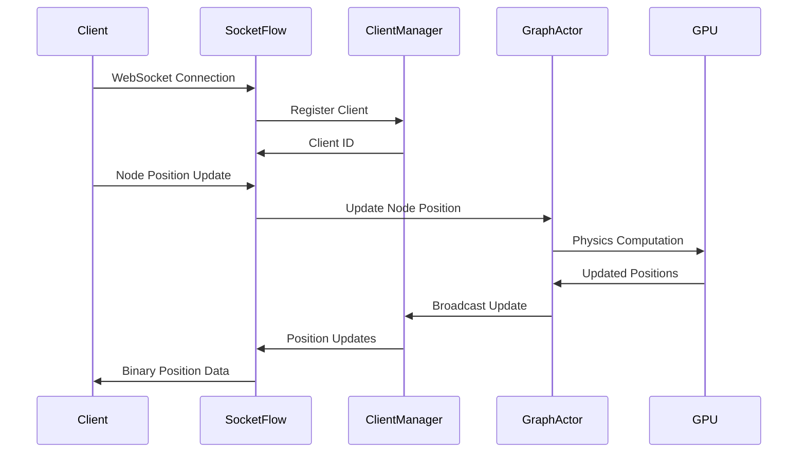
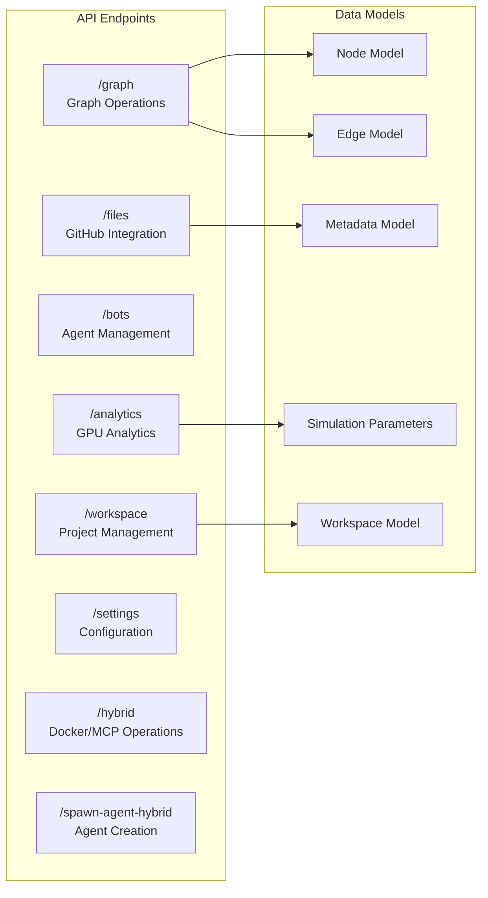
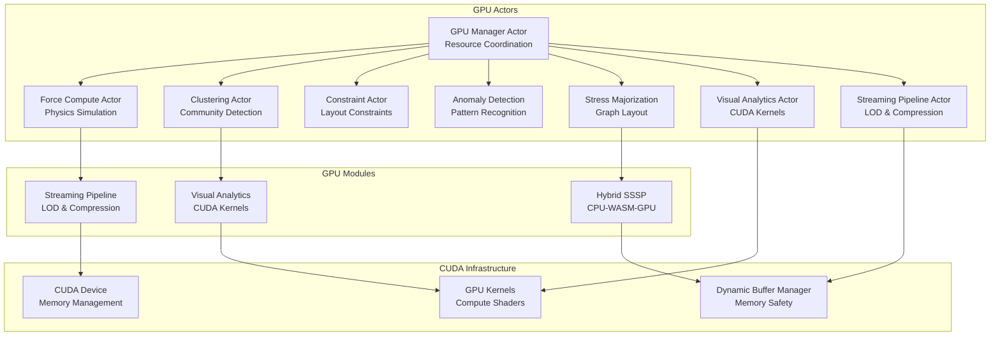

# Rust Server Architecture

This document outlines the comprehensive architecture of the WebXR/VisionFlow Rust server, detailing all major components, data flows, and integration points.

## High-Level System Overview

```mermaid
graph TB
    %% Client Layer
    Client[Web Clients<br/>Unity/Browser]

    %% Entry Point
    Main[main.rs<br/>HTTP Server Entry Point]

    %% Core Server Infrastructure
    subgraph "HTTP Server Layer"
        HttpServer[Actix HTTP Server<br/>:8080]
        Middleware[CORS + Logger + Compression<br/>Error Recovery Middleware]
        Router[Route Configuration]
    end

    %% Application State
    AppState[AppState<br/>Centralized State Management]

    %% Actor System
    subgraph "Actor System (Actix)"
        GraphActor[GraphServiceActor<br/>Graph Management]
        GPUManager[GPUManagerActor<br/>GPU Resource Management]
        ClientManager[ClientManagerActor<br/>WebSocket Connections]
        SettingsActor[SettingsActor<br/>Configuration Management]
        ProtectedSettingsActor[ProtectedSettingsActor<br/>Secure Configuration]
        MetadataActor[MetadataActor<br/>File Metadata Storage]
        WorkspaceActor[WorkspaceActor<br/>Project Management]
        ClaudeFlowActor[ClaudeFlowActor<br/>MCP Integration]
        FileSearchActor[FileSearchActor<br/>Content Search]
        CacheActor[CacheActor<br/>Memory Caching]
        TaskOrchestratorActor[TaskOrchestratorActor<br/>Agent Tasks]
        HybridAgentActor[HybridAgentActor<br/>Docker/MCP Spawning]
        DockerHiveMindActor[DockerHiveMindActor<br/>Container Orchestration]
    end

    %% WebSocket Handlers
    subgraph "WebSocket Layer"
        SocketFlow[Socket Flow Handler<br/>Real-time Graph Updates]
        SpeechWS[Speech WebSocket<br/>Voice Commands]
        MCPRelay[MCP Relay WebSocket<br/>Multi-Agent Communication]
        HealthWS[Health WebSocket<br/>System Monitoring]
    end

    %% REST API Handlers
    subgraph "REST API Layer"
        APIHandler[API Handler<br/>/api routes]
        GraphAPI[Graph API<br/>CRUD operations]
        FilesAPI[Files API<br/>GitHub integration]
        BotsAPI[Bots API<br/>Agent orchestration]
        HybridAPI[Hybrid API<br/>Docker/MCP Spawning]
        SpawnAPI[Spawn Agent API<br/>Agent Creation]
        AnalyticsAPI[Analytics API<br/>GPU computations]
        WorkspaceAPI[Workspace API<br/>Project management]
    end

    %% GPU Subsystem
    subgraph "GPU Computation Layer"
        GPUCompute[GPU Compute Actors]
        ForceComputeActor[Force Compute Actor<br/>Physics Simulation]
        ClusteringActor[Clustering Actor<br/>Community Detection]
        ConstraintActor[Constraint Actor<br/>Layout Constraints]
        AnomalyDetectionActor[Anomaly Detection Actor<br/>Pattern Recognition]
        StressMajorizationActor[Stress Majorization<br/>Graph Layout]
        VisualAnalyticsActor[Visual Analytics Actor<br/>CUDA Kernels]
        StreamingPipelineActor[Streaming Pipeline Actor<br/>LOD & Compression]
    end

    %% Data Storage
    subgraph "Data Layer"
        FileStorage[File System Storage<br/>Metadata & Graph Data]
        MemoryStore[In-Memory Store<br/>Active Graph State]
        CUDA[CUDA GPU Memory<br/>Compute Buffers]
    end

    %% External Services
    subgraph "External Integrations"
        GitHub[GitHub API<br/>Content Fetching]
        Docker[Docker Services<br/>Multi-Agent Containers]
        ClaudeFlowCLI[Claude Flow CLI<br/>npx claude-flow]
        MCP[MCP Servers<br/>TCP :9500]
        Nostr[Nostr Protocol<br/>Decentralized Identity]
        RAGFlow[RAGFlow API<br/>Chat Integration]
        Speech[Speech Services<br/>Voice Processing]
    end

    %% Connections
    Client --> HttpServer
    HttpServer --> Middleware
    Middleware --> Router
    Router --> AppState

    AppState --> GraphActor
    AppState --> GPUManager
    AppState --> ClientManager
    AppState --> SettingsActor
    AppState --> ProtectedSettingsActor
    AppState --> MetadataActor
    AppState --> WorkspaceActor
    AppState --> ClaudeFlowActor
    AppState --> FileSearchActor
    AppState --> CacheActor
    AppState --> TaskOrchestratorActor
    AppState --> HybridAgentActor
    AppState --> DockerHiveMindActor

    Router --> SocketFlow
    Router --> SpeechWS
    Router --> MCPRelay
    Router --> HealthWS

    Router --> APIHandler
    APIHandler --> GraphAPI
    APIHandler --> FilesAPI
    APIHandler --> BotsAPI
    APIHandler --> AnalyticsAPI
    APIHandler --> WorkspaceAPI
    APIHandler --> HybridAPI
    APIHandler --> SpawnAPI

    GPUManager --> GPUCompute
    GPUCompute --> ForceComputeActor
    GPUCompute --> ClusteringActor
    GPUCompute --> ConstraintActor
    GPUCompute --> AnomalyDetectionActor
    GPUCompute --> StressMajorizationActor
    GPUCompute --> VisualAnalyticsActor
    GPUCompute --> StreamingPipelineActor

    GraphActor --> MemoryStore
    MetadataActor --> FileStorage
    GPUCompute --> CUDA

    FilesAPI --> GitHub
    ClaudeFlowActor --> MCP
    ClaudeFlowActor --> Docker
    HybridAgentActor --> Docker
    HybridAgentActor --> ClaudeFlowCLI
    DockerHiveMindActor --> Docker
    AppState --> Nostr
    AppState --> RAGFlow
    AppState --> Speech
```



## Component Deep Dive

### 1. Entry Point & Server Infrastructure

**main.rs** serves as the application entry point and handles:
- Environment configuration loading
- Service initialization (GitHub, RAGFlow, Speech, Nostr)
- Actor system startup
- HTTP server configuration with middleware
- Signal handling for graceful shutdown

**Key Features:**
- Advanced logging with telemetry
- Docker-aware configuration
- Background GitHub synchronization
- Error recovery middleware
- Multi-worker server setup (4 workers)

### 2. Actor System Architecture

The server uses Actix actors for concurrent, message-driven processing:

#### GraphServiceActor
- **Purpose**: Central graph state management and physics simulation
- **Responsibilities**:
  - Graph CRUD operations (nodes, edges, metadata)
  - Physics simulation coordination
  - GPU compute orchestration
  - Real-time client synchronization
- **Key Messages**: `BuildGraphFromMetadata`, `UpdateNodePosition`, `StartSimulation`

#### GPUManagerActor
- **Purpose**: Modular GPU resource management
- **Sub-actors**: ForceComputeActor, ClusteringActor, ConstraintActor, AnomalyDetectionActor, StressMajorizationActor, VisualAnalyticsActor, StreamingPipelineActor
- **Responsibilities**:
  - CUDA device management
  - GPU memory allocation
  - Compute task distribution
  - Performance monitoring
  - Specialized GPU actor coordination

#### ClientManagerActor
- **Purpose**: WebSocket connection management
- **Responsibilities**:
  - Connection lifecycle management
  - Real-time broadcast coordination
  - Rate limiting and validation
  - Client state synchronization

#### Other Key Actors
- **SettingsActor**: Configuration management with real-time updates
- **ProtectedSettingsActor**: Secure configuration with encryption
- **MetadataActor**: File metadata and search functionality
- **WorkspaceActor**: Project and workspace management
- **ClaudeFlowActor**: MCP/multi-agent communication via TCP
- **FileSearchActor**: Content indexing and search capabilities
- **CacheActor**: In-memory caching for performance optimization
- **TaskOrchestratorActor**: Agent task coordination and scheduling
- **HybridAgentActor**: Docker/MCP hybrid agent spawning
- **DockerHiveMindActor**: Container orchestration and management

### 3. WebSocket Communication Layer

#### Socket Flow Handler (/wss)


**Features:**
- Binary protocol for efficient data transfer
- Rate limiting and validation
- Motion deadband filtering
- Dynamic update rates based on activity
- Heartbeat/ping-pong for connection health

#### Specialized WebSocket Endpoints
- **Speech WebSocket** (/ws/speech): Voice command processing
- **MCP Relay** (/ws/mcp-relay): Multi-agent communication bridge
- **Health Monitor** (/ws/hybrid-health): System status streaming
- **Agent Task Updates** (/ws/agent-tasks): Real-time agent task status
- **Docker Events** (/ws/docker-events): Container lifecycle events
- **Cache Updates** (/ws/cache-updates): Cache invalidation notifications

### 4. REST API Architecture

#### Core API Structure (/api)


### 5. GPU Computation Architecture

#### GPU Module Structure


#### Key GPU Features
- **Safety First**: Comprehensive bounds checking and error handling
- **Streaming Pipeline**: Level-of-detail and delta compression for real-time updates
- **Hybrid Processing**: CPU-WASM-GPU coordination for optimal performance
- **Memory Management**: Dynamic buffer allocation with safety guarantees

### 6. Data Models

#### Core Graph Models
```rust
// Node representation with physics properties
pub struct Node {
    pub id: u32,
    pub position: Vec3Data,      // x, y, z coordinates
    pub velocity: Vec3Data,      // physics velocity
    pub mass: f32,              // physics mass
    pub metadata: NodeMetadata, // content, tags, relationships
}

// Edge representation with weight and constraints
pub struct Edge {
    pub source: u32,
    pub target: u32,
    pub weight: f32,
    pub edge_type: EdgeType,
    pub constraints: Option<EdgeConstraints>,
}

// Simulation parameters for physics
pub struct SimulationParams {
    pub time_step: f32,
    pub damping: f32,
    pub spring_constant: f32,
    pub repulsion_strength: f32,
    pub center_attraction: f32,
}
```

### 7. External Integration Points

#### GitHub Integration
- **Content Fetching**: Automatic markdown file discovery and processing
- **Background Sync**: Non-blocking repository synchronization
- **Metadata Extraction**: File content analysis and graph generation

#### MCP (Model Context Protocol) & Docker Integration
- **TCP Connection**: Port 9500 for multi-agent communication
- **Docker Integration**: Container orchestration and service discovery
- **Agent Coordination**: Distributed processing coordination
- **Hybrid Spawning**: Docker containers + claude-flow CLI integration
- **DockerHiveMind**: Orchestration system for container management
- **Spawn Agent Hybrid**: Combined Docker/MCP agent creation endpoint

#### Service Integrations
- **RAGFlow**: Chat and conversation management
- **Nostr**: Decentralized identity and authentication
- **Speech Services**: Voice command processing and TTS
- **Docker Services**: Container-based agent execution

### 8. Binary Protocol Specification

#### WebSocket Binary Messages
```rust
// Binary node position update (34 bytes)
#[repr(C)]
pub struct BinaryNodeData {
    pub node_id: u32,      // 4 bytes - node identifier
    pub x: f32,           // 4 bytes - x coordinate
    pub y: f32,           // 4 bytes - y coordinate
    pub z: f32,           // 4 bytes - z coordinate
    pub velocity_x: f32,  // 4 bytes - x velocity
    pub velocity_y: f32,  // 4 bytes - y velocity
    pub velocity_z: f32,  // 4 bytes - z velocity
    pub mass: f32,        // 4 bytes - node mass
    pub timestamp: u64,   // 8 bytes - update timestamp
    pub flags: u16,       // 2 bytes - status flags
}

// Ping/Pong for connection health
#[repr(C)]
pub struct PingMessage {
    pub timestamp: u64,   // 8 bytes - microsecond timestamp
}
```

### 9. Configuration Management

#### Settings Architecture
- **AppFullSettings**: Complete server configuration (YAML-based)
- **Runtime Updates**: Dynamic configuration changes via SettingsActor
- **Client Synchronization**: Real-time settings distribution
- **Environment Override**: Docker and development environment support

### 10. DockerHiveMind Orchestration System

#### Hybrid Agent Spawning Architecture
The server implements a sophisticated hybrid spawning system that combines Docker containers with MCP protocol communication:

```mermaid
graph TB
    subgraph "Hybrid Agent Spawning"
        SpawnEndpoint[/spawn-agent-hybrid<br/>REST Endpoint]
        HybridAgentActor[HybridAgentActor<br/>Spawning Coordinator]
        DockerHiveMind[DockerHiveMindActor<br/>Container Orchestrator]
        TaskOrchestrator[TaskOrchestratorActor<br/>Task Manager]
    end

    subgraph "Execution Environments"
        DockerContainer[Docker Container<br/>Isolated Agent Runtime]
        ClaudeFlowCLI[Claude Flow CLI<br/>npx claude-flow]
        MCPServer[MCP Server<br/>TCP :9500]
    end

    subgraph "Communication Layer"
        AgentTaskWS[Agent Task WebSocket<br/>/ws/agent-tasks]
        DockerEventsWS[Docker Events WebSocket<br/>/ws/docker-events]
        MCPRelay[MCP Relay<br/>/ws/mcp-relay]
    end

    SpawnEndpoint --> HybridAgentActor
    HybridAgentActor --> DockerHiveMind
    HybridAgentActor --> TaskOrchestrator

    DockerHiveMind --> DockerContainer
    HybridAgentActor --> ClaudeFlowCLI

    DockerContainer --> MCPServer
    ClaudeFlowCLI --> MCPServer

    TaskOrchestrator --> AgentTaskWS
    DockerHiveMind --> DockerEventsWS
    MCPServer --> MCPRelay
```

#### Key Features
- **Container Lifecycle Management**: Automatic Docker container creation, monitoring, and cleanup
- **Multi-Protocol Communication**: Seamless Docker + MCP + WebSocket integration
- **Resource Allocation**: Dynamic resource assignment and scaling
- **Fault Tolerance**: Container health monitoring and automatic restart
- **Real-time Monitoring**: Live status updates through WebSocket streams

#### Spawn Agent Hybrid Endpoint
**POST /api/spawn-agent-hybrid**
```json
{
  "agent_type": "researcher|coder|analyst|optimizer",
  "task_description": "Task to be performed",
  "docker_config": {
    "image": "agent-runtime:latest",
    "resources": {
      "cpu": "1.0",
      "memory": "512MB"
    }
  },
  "mcp_config": {
    "server_port": 9500,
    "protocol_version": "2024-11-05"
  },
  "coordination_hooks": true
}
```

**Response:**
```json
{
  "agent_id": "agent_12345",
  "container_id": "docker_67890",
  "mcp_endpoint": "tcp://localhost:9500",
  "websocket_channels": [
    "/ws/agent-tasks/agent_12345",
    "/ws/docker-events/docker_67890"
  ],
  "status": "spawning|running|completed|failed"
}
```

### 11. Error Handling & Recovery

#### Fault Tolerance Features
- **Circuit Breaker**: Network resilience patterns
- **Graceful Degradation**: Service fallback mechanisms
- **Error Recovery Middleware**: Automatic error handling and logging
- **Health Monitoring**: Comprehensive system health tracking
- **Graceful Shutdown**: Clean resource cleanup on termination
- **Container Recovery**: Automatic Docker container restart on failure
- **MCP Reconnection**: Resilient TCP connection management

## Performance & Scalability

### Key Performance Features
1. **Multi-Worker Architecture**: 4 worker threads for HTTP handling
2. **Actor-Based Concurrency**: Message-driven parallel processing
3. **GPU Acceleration**: CUDA-based physics and analytics computation
4. **Binary WebSocket Protocol**: Minimal bandwidth usage
5. **Delta Compression**: Only send changed data to clients
6. **Rate Limiting**: Prevent client abuse and ensure fair resource allocation
7. **Memory Safety**: Rust's ownership model + additional bounds checking

### Scalability Considerations
- **Horizontal Scaling**: Actor system supports distributed deployment
- **GPU Resource Management**: Dynamic allocation and deallocation
- **Connection Pooling**: Efficient client connection management
- **Background Processing**: Non-blocking operations for heavy tasks

## Development & Deployment

### Key Development Features
- **Comprehensive Logging**: Debug, info, and telemetry logging
- **Hot Configuration Reload**: Runtime settings updates
- **Docker Integration**: Container-aware service discovery
- **Test Coverage**: Integration and unit tests for critical paths
- **Memory Profiling**: GPU and system memory monitoring

This architecture provides a robust, scalable foundation for real-time graph visualization with GPU-accelerated physics, multi-agent coordination, and comprehensive external service integration.