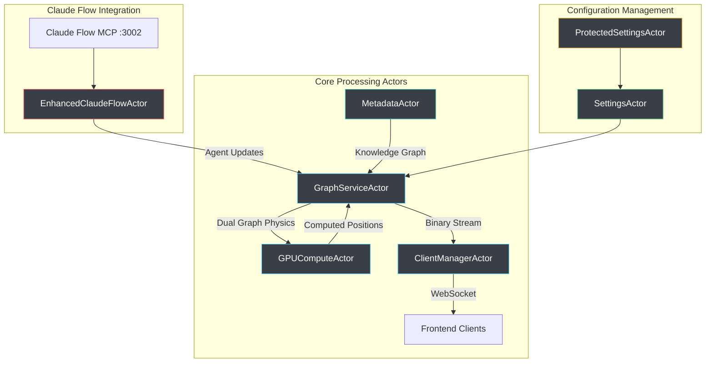
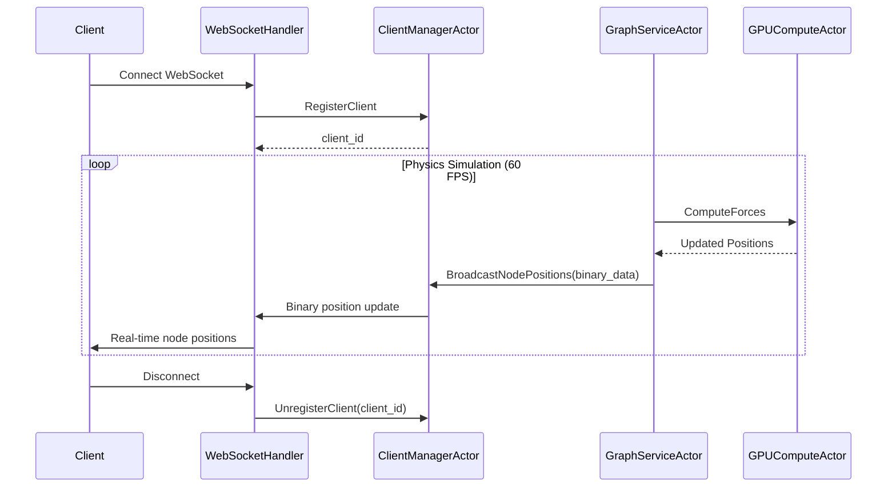
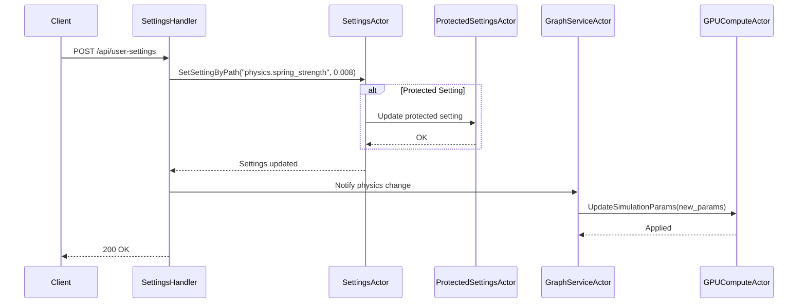
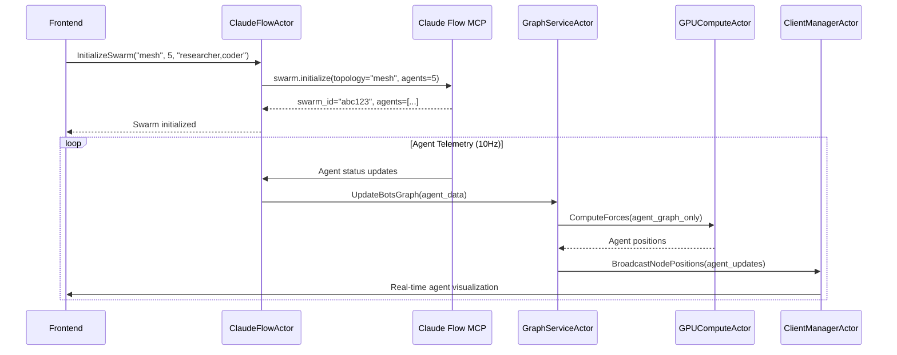

# Actor System Architecture

## Overview

VisionFlow uses the Actix actor system to orchestrate AI agent swarms and dual graph visualization with real-time streaming of Claude Flow MCP telemetry and GPU-accelerated physics simulation for 100,000+ nodes at 60 FPS.

## Actor Architecture

The actor system implements a message-passing design with direct MCP integration for agent swarm orchestration:



## Core Actors

### GraphServiceActor

**Location**: `src/actors/graph_actor.rs`

Central hub for dual graph management (knowledge graph + agent swarm).

**Responsibilities**:
- Maintains separate buffers for knowledge nodes and agent nodes
- Applies type flags to node IDs (bit 31 for agents, bit 30 for knowledge)
- Coordinates GPU physics simulation for both graph types
- Merges updates from ClaudeFlowActor (agents) and MetadataActor (knowledge)
- Streams differential position updates at 60 FPS via binary protocol

**Key Messages**:
```rust
// Core graph operations
pub struct GetGraphData; // -> Result<GraphData, String>
pub struct UpdateGraphData { pub graph_data: GraphData }
pub struct BuildGraphFromMetadata { pub metadata: MetadataStore }

// Real-time updates
pub struct UpdateNodePosition { pub node_id: u32, pub position: Vec3, pub velocity: Vec3 }
pub struct UpdateNodePositions { pub positions: Vec<(u32, BinaryNodeData)> }

// Node/Edge management
pub struct AddNode { pub node: Node }
pub struct RemoveNode { pub node_id: u32 }
pub struct AddEdge { pub edge: Edge }
pub struct RemoveEdge { pub edge_id: String }

// Physics control
pub struct SimulationStep; // -> Result<(), String>
pub struct StartSimulation; // -> Result<(), String>
pub struct StopSimulation; // -> Result<(), String>

// Advanced physics
pub struct UpdateAdvancedParams { pub params: AdvancedParams }
pub struct UpdateConstraints { pub constraint_data: Value }
pub struct TriggerStressMajorization;
pub struct RegenerateSemanticConstraints;
```

### GPUComputeActor

**Location**: `src/actors/gpu_compute_actor.rs`

NVIDIA CUDA-accelerated physics engine for massive graph visualization.

**Responsibilities**:
- Unified CUDA kernel execution with multiple compute modes
- Dual graph physics with independent parameters per graph type
- Force-directed layout with stress majorization and constraint satisfaction
- Visual analytics mode for pattern detection and clustering
- Real-time performance: 60-120 FPS for 100K+ nodes with graceful CPU fallback

**Key Messages**:
```rust
// Initialization and configuration
pub struct InitializeGPU { pub graph: GraphData }
pub struct UpdateGPUGraphData { pub graph: GraphData }
pub struct UpdateSimulationParams { pub params: SimulationParams }
pub struct SetComputeMode { pub mode: ComputeMode }

// Physics execution
pub struct ComputeForces; // -> Result<(), String>
pub struct GetNodeData; // -> Result<Vec<BinaryNodeData>, String>

// Advanced physics modes
pub struct UpdatePhysicsParams { pub graph_type: GraphType, pub params: SimulationParams }
pub struct UpdateForceParams { 
    pub repulsion: f32, pub attraction: f32, pub damping: f32,
    pub temperature: f32, pub spring: f32, pub gravity: f32,
    pub time_step: f32, pub max_velocity: f32 
}

// Status and diagnostics
pub struct GetGPUStatus; // -> GPUStatus
pub struct GetPhysicsStats; // -> Result<PhysicsStats, String>

// Position synchronization
pub struct RequestPositionSnapshot { 
    pub include_knowledge_graph: bool,
    pub include_agent_graph: bool 
}
```

**Compute Modes**:
```rust
pub enum ComputeMode {
    Basic = 0,         // Basic force-directed layout
    DualGraph = 1,     // Dual graph (knowledge + agent)
    Constraints = 2,   // With constraint satisfaction
    VisualAnalytics = 3, // Advanced visual analytics
}
```

### ClientManagerActor

**Location**: `src/actors/client_manager_actor.rs`

WebSocket client connection management and real-time broadcasting.

**Responsibilities**:
- Tracks active WebSocket client connections
- Broadcasts binary position updates to all connected clients
- Manages client registration and cleanup on disconnection
- Handles binary protocol encoding for efficient network transfer
- Connection pooling with automatic garbage collection

**Key Messages**:
```rust
// Client lifecycle
pub struct RegisterClient { 
    pub addr: Addr<SocketFlowServer> 
} // -> Result<usize, String> (returns client_id)

pub struct UnregisterClient { pub client_id: usize }
pub struct GetClientCount; // -> Result<usize, String>

// Broadcasting
pub struct BroadcastNodePositions { pub positions: Vec<u8> }
pub struct BroadcastMessage { pub message: String }

// Individual client messaging
pub struct SendToClientBinary(pub Vec<u8>);
pub struct SendToClientText(pub String);
```

### SettingsActor

**Location**: `src/actors/settings_actor.rs`

Application configuration management with hot-reload capability.

**Responsibilities**:
- Stores and manages `AppFullSettings` configuration
- Handles dynamic settings updates from API endpoints
- Provides path-based setting access and modification
- Validates configuration changes before applying
- Integrates with file-based settings persistence

**Key Messages**:
```rust
// Settings access
pub struct GetSettings; // -> Result<AppFullSettings, String>
pub struct UpdateSettings { pub settings: AppFullSettings }

// Path-based access (supports nested fields like "physics.spring_strength")
pub struct GetSettingByPath { pub path: String } // -> Result<Value, String>
pub struct SetSettingByPath { pub path: String, pub value: Value }
```

### MetadataActor

**Location**: `src/actors/metadata_actor.rs`

Knowledge graph metadata and file relationship management.

**Responsibilities**:
- Loads and manages file metadata from JSON persistence
- Monitors file system changes for automatic graph updates
- Provides metadata for graph node construction
- Handles metadata refresh and cache invalidation
- Stores node-to-file mappings and relationships

**Key Messages**:
```rust
// Metadata operations
pub struct GetMetadata; // -> Result<MetadataStore, String>
pub struct UpdateMetadata { pub metadata: MetadataStore }
pub struct RefreshMetadata; // -> Result<(), String>
```

### ProtectedSettingsActor

**Location**: `src/actors/protected_settings_actor.rs`

Secure credential management and user authentication.

**Responsibilities**:
- Stores sensitive configuration (API keys, secrets)
- Manages Nostr-based user authentication and sessions
- Provides controlled access to protected settings per user
- Handles session token validation and cleanup
- Integrates with feature-based access control system

**Key Messages**:
```rust
// User management
pub struct GetUser { pub pubkey: String } // -> Result<NostrUser, String>
pub struct GetApiKeys { pub user_pubkey: String } // -> Result<ApiKeys, String>
pub struct UpdateUserApiKeys { pub user_pubkey: String, pub api_keys: ApiKeys }

// Session management
pub struct ValidateClientToken { pub token: String } // -> Result<bool, String>
pub struct StoreClientToken { pub token: String, pub user_data: NostrUser }
pub struct CleanupExpiredTokens;

// Settings persistence
pub struct MergeSettings { pub new_settings: ProtectedSettings }
pub struct SaveSettings; // -> Result<(), String>
```

### EnhancedClaudeFlowActor

**Location**: `src/actors/claude_flow_actor_enhanced.rs`

Direct integration with Claude Flow MCP for real-time agent orchestration.

**Responsibilities**:
- Maintains persistent WebSocket connection to Claude Flow MCP (port 3002)
- Streams agent telemetry at 10Hz with automatic reconnection
- Handles swarm initialization via JSON-RPC protocol
- NO mock data generation - only real Claude Flow agent data
- Exponential backoff reconnection strategy on connection loss

**Key Messages**:
```rust
// Swarm management
pub struct InitializeSwarm { 
    pub topology: String, pub max_agents: u32, pub strategy: String,
    pub enable_neural: bool, pub agent_types: Vec<String>,
    pub custom_prompt: Option<String>
}

// Agent operations
pub struct SpawnAgent { 
    pub agent_type: String, pub name: String, 
    pub capabilities: Vec<String>, pub swarm_id: Option<String>
}

// Real-time data
pub struct GetAgentTelemetry; // -> Result<Vec<AgentStatus>, String>
pub struct GetSwarmStatus; // -> Result<SwarmStatus, String>
pub struct GetAgentMetrics; // -> Result<Vec<AgentMetrics>, String>

// Graph updates
pub struct UpdateBotsGraph { pub agents: Vec<AgentStatus> }
pub struct GetBotsGraphData; // -> Result<GraphData, String>

// Advanced orchestration
pub struct TaskOrchestrate { 
    pub task_id: String, pub task_type: String,
    pub assigned_agents: Vec<String>, pub priority: u8
}
pub struct SwarmMonitor; // -> Result<SwarmMonitorData, String>
pub struct TopologyOptimize { 
    pub current_topology: String,
    pub performance_metrics: HashMap<String, f32>
}

// Connection management
pub struct PollSwarmData;
pub struct PollSystemMetrics;
pub struct RetryMCPConnection;
pub struct GetCachedAgentStatuses; // -> Result<Vec<AgentStatus>, String>
```

**MCP Integration Methods**:
```rust
// JSON-RPC methods called on Claude Flow MCP
// agent.spawn - Create new agent
// swarm.initialize - Initialize swarm topology  
// telemetry.subscribe - Stream metrics at 100ms intervals
// task.assign - Assign task to specific agent
// swarm.status - Get current swarm health
// agent.metrics - Retrieve performance data
```

## Message Flow Patterns

### Client Connection and Graph Updates



### Settings Update Flow



### Claude Flow Agent Integration



## Actor Implementation Patterns

### Actor Initialization

Actors are initialized in dependency order during application startup:

```rust
// src/app_state.rs - Actor initialization sequence
let client_manager = ClientManagerActor::new().start();
let settings_actor = SettingsActor::new(settings_data.clone()).start();
let metadata_actor = MetadataActor::new().start();
let protected_settings_actor = ProtectedSettingsActor::new().start();

let gpu_compute = GPUComputeActor::new(simulation_params).start();
let graph_service = GraphServiceActor::new(
    client_manager.clone(),
    Some(gpu_compute.clone()),
    settings_actor.clone(),
    metadata_actor.clone()
).start();

// Claude Flow integration
let claude_flow_actor = EnhancedClaudeFlowActor::new().start();
```

### Message Handler Implementation

Standard pattern for implementing message handlers:

```rust
impl Handler<GetGraphData> for GraphServiceActor {
    type Result = Result<GraphData, String>;

    fn handle(&mut self, _: GetGraphData, _: &mut Self::Context) -> Self::Result {
        Ok(self.graph_data.clone())
    }
}

impl Handler<ComputeForces> for GPUComputeActor {
    type Result = Result<(), String>;

    fn handle(&mut self, _: ComputeForces, _: &mut Self::Context) -> Self::Result {
        match self.compute_iteration() {
            Ok(_) => {
                self.iteration_count += 1;
                Ok(())
            }
            Err(e) => {
                warn!("GPU compute failed: {}, falling back to CPU", e);
                self.cpu_fallback_compute()
            }
        }
    }
}
```

### Async Communication Patterns

```rust
// Synchronous request-response
let graph_data = graph_actor.send(GetGraphData).await??;

// Fire-and-forget messaging  
client_manager.do_send(BroadcastNodePositions { positions });

// Error handling with fallbacks
match gpu_compute.send(ComputeForces).await? {
    Ok(_) => info!("GPU compute successful"),
    Err(e) => {
        warn!("GPU failed: {}, using CPU fallback", e);
        self.cpu_physics_step();
    }
}
```

## Performance Characteristics

### Message Processing Metrics

| Actor | Messages/sec | Latency | Memory Usage |
|-------|--------------|---------|--------------|
| GraphServiceActor | 120 | 8ms | 50-200 MB |
| GPUComputeActor | 60-120 | 16ms | 1-2 GB GPU |
| ClientManagerActor | 6000+ | <1ms | 10-50 MB |
| SettingsActor | 10-50 | <1ms | <5 MB |
| MetadataActor | 1-10 | 5ms | 10-100 MB |
| ClaudeFlowActor | 10 | 50ms | 20-50 MB |

### Scalability Limits

- **GraphServiceActor**: Handles 100K+ nodes efficiently
- **ClientManagerActor**: Supports 1000+ concurrent WebSocket connections
- **GPUComputeActor**: Limited by GPU memory (typically 2-8GB)
- **Settings/Metadata**: No practical limits for typical usage

## Advanced Features

### Actor Supervision & Recovery

```rust
impl Actor for GraphServiceActor {
    type Context = Context<Self>;
    
    fn started(&mut self, ctx: &mut Self::Context) {
        info!("GraphServiceActor started, beginning physics simulation");
        self.start_simulation_loop(ctx);
    }
    
    fn stopped(&mut self, _ctx: &mut Self::Context) {
        warn!("GraphServiceActor stopped - supervisor will restart");
    }
}
```

### Message Queue Management

- **Backpressure handling**: Automatic mailbox size management
- **Priority messaging**: Critical messages processed first
- **Batch processing**: Multiple position updates bundled for efficiency
- **Dead letter handling**: Failed messages logged for debugging

### Memory Safety & Leak Prevention

- **Reference counting**: Automatic cleanup via `Arc<>`
- **Weak references**: Break circular dependencies where needed
- **Message lifecycle**: Messages automatically dropped after processing
- **Resource monitoring**: Built-in memory usage tracking

## Best Practices

1. **Message Design**: Keep messages small and focused on single operations
2. **Error Handling**: All messages return `Result<T, String>` for consistent error propagation
3. **State Encapsulation**: Actors own their state; no shared mutable references
4. **Async Operations**: Use `AsyncContext` for long-running background tasks
5. **Supervision**: Actors automatically restart on failure with exponential backoff
6. **Resource Management**: Proper cleanup in actor `stopped()` methods

## Testing Actor Systems

```rust
#[actix_rt::test]
async fn test_graph_service_actor() {
    let client_manager = ClientManagerActor::new().start();
    let gpu_compute = GPUComputeActor::new(default_params()).start();
    let actor = GraphServiceActor::new(client_manager, Some(gpu_compute)).start();
    
    // Test message handling
    let result = actor.send(GetGraphData).await.unwrap();
    assert!(result.is_ok());
    
    // Test state updates
    let test_node = Node { id: 1, /* ... */ };
    let result = actor.send(AddNode { node: test_node }).await.unwrap();
    assert!(result.is_ok());
}
```

## Related Documentation

- **[Server Architecture](architecture.md)** - Overall system design and initialization
- **[GPU Compute](gpu-compute.md)** - CUDA kernel implementation details
- **[Binary Protocol](../api/binary-protocol.md)** - Efficient WebSocket communication
- **[MCP Integration](../architecture/mcp-integration.md)** - Claude Flow orchestrator connection
- **[Physics Engine](physics-engine.md)** - Force-directed algorithms and dual graph physics