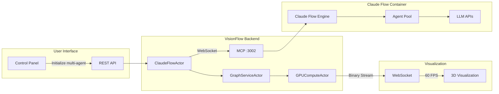

# Multi Agent Orchestration

## Overview

VisionFlow orchestrates AI Multi Agents through direct integration with Claude Flow's Model Context Protocol (MCP). This enables spawning, coordinating, and visualizing autonomous AI agents working collaboratively on complex tasks.

## Architecture



## multi-agent Topologies

### Mesh Topology
All agents can communicate freely. Best for collaborative problem-solving.

```rust
multi-agentTopology::Mesh {
    connectivity: 1.0,  // Full connectivity
    max_hops: 1,        // Direct communication
}
```

### Hierarchical Topology
Structured command chain with coordinators and specialists.

```rust
multi-agentTopology::Hierarchical {
    levels: 3,
    fanout: 4,  // Each coordinator manages 4 agents
}
```

### Star Topology
Central coordinator with peripheral specialists.

```rust
multi-agentTopology::Star {
    coordinator: "agent-001",
    specialists: vec!["agent-002", "agent-003", ...],
}
```

### Ring Topology
Sequential processing pipeline.

```rust
multi-agentTopology::Ring {
    agents: vec!["researcher", "architect", "coder", "tester"],
    bidirectional: false,
}
```

## Agent Types

### Coordinator
Orchestrates the multi-agent and delegates tasks.

**Capabilities**:
- Task decomposition
- Resource allocation
- Progress monitoring
- Result aggregation

**Node Visualization**:
- Color: Purple (#8B5CF6)
- Size: 2x standard
- Icon: Crown

### Researcher
Gathers information and analyzes requirements.

**Capabilities**:
- Web search
- Document analysis
- Knowledge synthesis
- Requirement extraction

**Node Visualization**:
- Color: Blue (#3B82F6)
- Size: 1.5x standard
- Icon: Magnifying glass

### Coder
Implements solutions and writes code.

**Capabilities**:
- Code generation
- API development
- Database design
- Integration work

**Node Visualization**:
- Color: Green (#10B981)
- Size: Standard
- Icon: Code brackets

### Architect
Designs system architecture and patterns.

**Capabilities**:
- System design
- Pattern selection
- Component architecture
- Technology decisions

**Node Visualization**:
- Color: Orange (#F97316)
- Size: 1.5x standard
- Icon: Blueprint

### Tester
Validates implementations and quality.

**Capabilities**:
- Unit testing
- Integration testing
- Performance testing
- Bug detection

**Node Visualization**:
- Color: Red (#EF4444)
- Size: Standard
- Icon: Checkmark

## multi-agent Initialization

### REST Endpoint

```http
POST /api/bots/initialize-multi-agent
```

### Request Payload

```json
{
  "topology": "mesh",
  "maxAgents": 10,
  "agentTypes": [
    "coordinator",
    "researcher",
    "coder",
    "architect",
    "tester"
  ],
  "customPrompt": "Build a REST API with authentication and database integration",
  "strategy": "adaptive",
  "enableNeural": true
}
```

### Actor Message Flow

```rust
// 1. REST handler receives request
let multi-agent_config = initializeMultiAgentRequest { ... };

// 2. Send to ClaudeFlowActor
claude_flow_actor.send(initializeMultiAgent {
    config: multi-agent_config,
}).await?;

// 3. ClaudeFlowActor sends MCP request
let mcp_request = json!({
    "jsonrpc": "2.0",
    "method": "multi-agent.initialize",
    "params": {
        "topology": config.topology,
        "agents": config.agent_types,
        "task": config.custom_prompt,
    }
});

// 4. Stream telemetry updates
websocket.send(json!({
    "jsonrpc": "2.0",
    "method": "telemetry.subscribe",
    "params": {
        "events": ["agent.*"],
        "interval_ms": 100,  // 10Hz
    }
}));
```

## Telemetry Processing

### Data Flow

1. **MCP Event** (100ms intervals)
```json
{
  "type": "agent.status",
  "data": {
    "agent_id": "agent-001",
    "status": "active",
    "cpu_usage": 45.2,
    "memory_usage": 128.5,
    "tokens_used": 1523
  }
}
```

2. **Graph Update**
```rust
impl ClaudeFlowActor {
    fn process_telemetry(&mut self, event: MCPEvent) {
        // Convert to graph node
        let node = BinaryNodeData {
            id: hash_agent_id(&event.agent_id) | AGENT_FLAG,
            position: self.calculate_position(&event),
            velocity: Vec3::ZERO,
            metadata: AgentMetadata {
                agent_type: event.agent_type,
                status: event.status,
                metrics: event.metrics,
            },
        };

        // Send to graph service
        self.graph_service.do_send(UpdateAgentNode { node });
    }
}
```

3. **Binary Encoding** (28 bytes per agent)
```
[Agent ID: u32] [Position: 3xf32] [Velocity: 3xf32]
0x80000001      10.0, 20.0, 30.0   0.1, 0.2, 0.3
```

## Task Assignment

### Dynamic Task Distribution

```rust
pub struct TaskAssignment {
    pub agent_id: String,
    pub task: Task,
    pub priority: u8,
    pub dependencies: Vec<String>,
    pub timeout: Duration,
}

impl ClaudeFlowActor {
    async fn assign_task(&mut self, assignment: TaskAssignment) {
        let request = json!({
            "jsonrpc": "2.0",
            "method": "task.assign",
            "params": {
                "agent_id": assignment.agent_id,
                "task": {
                    "description": assignment.task.description,
                    "type": assignment.task.task_type,
                    "priority": assignment.priority,
                },
            }
        });

        self.mcp_client.send(request).await?;
    }
}
```

## Performance Optimization

### Batched Updates
Agent updates are batched to reduce message overhead:

```rust
const BATCH_SIZE: usize = 50;
const BATCH_TIMEOUT: Duration = Duration::from_millis(100);

let mut update_batch = Vec::with_capacity(BATCH_SIZE);
let mut last_flush = Instant::now();

// Batch updates until size or timeout reached
if update_batch.len() >= BATCH_SIZE ||
   last_flush.elapsed() > BATCH_TIMEOUT {
    flush_updates(update_batch);
    update_batch.clear();
    last_flush = Instant::now();
}
```

### Differential Streaming
Only changed agent states are transmitted:

```rust
fn should_send_update(old: &AgentState, new: &AgentState) -> bool {
    const POSITION_THRESHOLD: f32 = 0.1;
    const STATUS_CHANGE: bool = true;

    (new.position - old.position).length() > POSITION_THRESHOLD ||
    new.status != old.status ||
    new.active_task != old.active_task
}
```

## Monitoring & Debugging

### Health Metrics

```rust
pub struct multi-agentHealth {
    pub total_agents: usize,
    pub active_agents: usize,
    pub tasks_completed: usize,
    pub tasks_pending: usize,
    pub average_cpu: f32,
    pub total_tokens: usize,
    pub error_rate: f32,
}
```

### Debug Logging

Enable detailed multi-agent logging:

```bash
RUST_LOG=webxr::actors::claude_flow_actor=debug cargo run
```

### Common Issues

| Issue | Cause | Solution |
|-------|-------|----------|
| No agents spawning | MCP disconnected | Check Claude Flow container |
| Laggy visualization | Too many agents | Reduce max agents to 20 |
| Agents idle | No task assigned | Verify customPrompt is set |
| Connection drops | Network issues | Check Docker network config |

## Example multi-agent Tasks

### Simple Development Task
```json
{
  "customPrompt": "Create a hello world REST API",
  "maxAgents": 3,
  "agentTypes": ["coordinator", "coder", "tester"]
}
```

### Complex System Design
```json
{
  "customPrompt": "Design and implement a microservices e-commerce platform with authentication, inventory, and payment processing",
  "maxAgents": 15,
  "agentTypes": ["coordinator", "architect", "researcher", "coder", "coder", "coder", "tester", "reviewer"],
  "topology": "hierarchical"
}
```

### Research & Analysis
```json
{
  "customPrompt": "Analyze the codebase and create comprehensive documentation with architectural diagrams",
  "maxAgents": 8,
  "agentTypes": ["coordinator", "researcher", "researcher", "architect", "documenter"],
  "topology": "mesh"
}
```

## Security Considerations

1. **MCP Isolation**: MCP connection only from backend, never exposed to frontend
2. **Rate Limiting**: Max 10 multi-agents per minute, 50 agents per multi-agent
3. **Resource Limits**: CPU and memory caps per agent
4. **Task Validation**: Sanitize customPrompt to prevent injection
5. **Token Limits**: Max 4000 tokens per agent response

## See Also

- [ClaudeFlowActor](actors.md#claudeflowactor-primary)
- [MCP Integration](../architecture/mcp-integration.md)
- [Binary Protocol](../api/binary-protocol.md)
- [Quick Start Guide](../quick-start.md#spawning-your-first-ai-agent-multi-agent)