# Server Architecture

## Overview

VisionFlow's backend is an actor-based system built in Rust using the Actix framework. It is designed for high-performance, real-time graph visualization and computation. The architecture is centered around a message-passing model that eliminates lock contention and enables a high degree of concurrency.

Key architectural pillars include:
- **Actor-Based Concurrency**: State is managed by independent actors that communicate via asynchronous messages, avoiding shared-memory pitfalls like `Arc<RwLock<T>>`.
- **Unified GPU Compute**: A single, powerful CUDA kernel (`visionflow_unified.cu`) handles all GPU-accelerated tasks, from physics simulations to graph analytics.
- **TCP-Only MCP Integration**: A resilient TCP client (`ClaudeFlowActorTcp`) communicates with the MCP server for agent control, featuring robust error handling and connection management.
- **Modular Services**: New features like ontology validation and semantic analysis are encapsulated in dedicated services and actors, integrating cleanly into the existing data flow.

## Core Components & Data Flow

The system is composed of several specialized actors that collaborate to process data and serve it to clients.

```mermaid
graph TD
    subgraph "External Inputs"
        MCP["🤖 Claude Flow MCP (TCP)"]
        API["🌠REST API Clients"]
        FS["📄 File System (Metadata)"]
    end

    subgraph "Core Actor System"
        CFT[ClaudeFlowActorTcp]
        GSA[GraphServiceActor]
        GCA[GPUComputeActor]
        OA[OntologyActor]
        SA[SemanticAnalyzer]
    end

    subgraph "Services"
        OVS[OwlValidatorService]
        AEG[AdvancedEdgeGenerator]
        SMS[StressMajorizationSolver]
    end

    subgraph "Outputs"
        CMA[ClientManagerActor] --> WS["📡 WebSocket Clients"]
    end

    MCP -- "Line-delimited JSON-RPC" --> CFT
    API -- "HTTP Requests" --> GSA
    FS -- "File Events" --> GSA

    CFT -- "Agent Telemetry" --> GSA
    
    GSA -- "Orchestrates" --> SA
    GSA -- "Orchestrates" --> SMS
    GSA -- "ValidateGraph" --> OA
    GSA -- "PerformGPUClustering, etc." --> GCA

    OA -- "Uses" --> OVS
    SA -- "Uses" --> AEG

    GCA -- "UnifiedGPUCompute Engine" --> GCA
    
    GSA -- "Broadcast Updates" --> CMA

    style GSA fill:#3A3F47,stroke:#61DAFB,color:#FFFFFF
    style GCA fill:#3A3F47,stroke:#76B900,color:#FFFFFF
    style CFT fill:#3A3F47,stroke:#F56565,color:#FFFFFF
    style OA fill:#3A3F47,stroke:#D69E2E,color:#FFFFFF
    style SA fill:#3A3F47,stroke:#9F7AEA,color:#FFFFFF
```

### Data Flow Explained

1.  **Inputs**: The system receives data from three primary sources:
    *   **Claude Flow MCP**: The `ClaudeFlowActorTcp` maintains a persistent TCP connection to the MCP server, receiving agent telemetry and control messages.
    *   **REST API**: Clients can interact with the graph, run analytics, and manage settings through a standard HTTP API, handled primarily by the `GraphServiceActor`.
    *   **File System**: The `GraphServiceActor` monitors the file system for changes to the knowledge graph's source files.

2.  **Orchestration (`GraphServiceActor`)**: The `GraphServiceActor` is the central hub. It manages the dual graph (knowledge vs. agent) and orchestrates all major operations. It delegates tasks to specialized actors and services:
    *   It sends compute-heavy tasks like clustering and physics calculations to the `GPUComputeActor`.
    *   It requests graph validation from the `OntologyActor`.
    *   It uses the `SemanticAnalyzer` to enrich the graph and the `StressMajorizationSolver` for layout optimization.

3.  **Specialized Actors & Services**:
    *   **`GPUComputeActor`**: Manages the `UnifiedGPUCompute` engine, executing various compute modes as requested.
    *   **`OntologyActor`**: Provides an asynchronous interface to the `OwlValidatorService`, which performs formal OWL/RDF validation and reasoning.
    *   **`SemanticAnalyzer`**: A service that extracts features, generates semantic edges, and creates layout constraints.

4.  **Output**: The `GraphServiceActor` sends the final, computed graph state to the `ClientManagerActor`, which then broadcasts the updates to all connected WebSocket clients.

## Actor-Based State Management

The server avoids traditional shared-state concurrency models. Instead of wrapping data in `Arc<RwLock<T>>`, each piece of state is "owned" by a single actor. To read or modify state, other actors must send a message and `await` a response.

This approach provides several key benefits:
-   **No Lock Contention**: Eliminates performance bottlenecks and deadlocks associated with shared locks.
-   **Clear Ownership**: State ownership is unambiguous, simplifying the design and reducing bugs.
-   **Fault Isolation**: If an actor panics, its state is lost, but it does not corrupt the state of other actors. The supervisor can restart it cleanly.
-   **Asynchronous by Default**: The entire system is built on non-blocking communication, ensuring that no single task can hold up the entire server.