# Server Architecture

## Overview

VisionFlow uses a modern Rust actor-based architecture powered by Actix for high-performance real-time graph visualisation. The system handles GPU-accelerated physics simulation for 100,000+ nodes while maintaining 60 FPS performance through efficient message passing and parallel computation.

## Core Architecture

### Application State (AppState)

The `AppState` struct serves as the central coordinator, holding actor addresses for distributed state management. This eliminates lock contention and enables true parallelism.

```rust
// src/app_state.rs - Current implementation
pub struct AppState {
    // Core Actor Addresses - Message Passing Architecture
    pub graph_service_addr: Addr<GraphServiceActor>,
    pub gpu_compute_addr: Option<Addr<GPUComputeActor>>,
    pub settings_addr: Addr<SettingsActor>,
    pub protected_settings_addr: Addr<ProtectedSettingsActor>,
    pub metadata_addr: Addr<MetadataActor>,
    pub client_manager_addr: Addr<ClientManagerActor>,

    // External Service Integrations (Arc-wrapped for thread safety)
    pub github_client: Arc<GitHubClient>,
    pub content_api: Arc<ContentAPI>,
    pub perplexity_service: Option<Arc<PerplexityService>>,
    pub ragflow_service: Option<Arc<RAGFlowService>>,
    pub speech_service: Option<Arc<SpeechService>>,
    pub nostr_service: Option<web::Data<NostrService>>,

    // Configuration & Access Control
    pub feature_access: web::Data<FeatureAccess>,
    pub ragflow_session_id: String,
    pub active_connections: Arc<AtomicUsize>,

    // Claude Flow MCP Integration
    pub claude_flow_addr: Option<Addr<ClaudeFlowActorTcp>>,
    pub bots_client: Arc<BotsClient>,
}
```

### Actor System Overview

The architecture implements a distributed actor model where each major component runs as an independent actor:

- **GraphServiceActor**: Manages dual graph physics (knowledge + agents)
- **GPUComputeActor**: Handles CUDA-accelerated computations
- **ClientManagerActor**: WebSocket client connection management
- **SettingsActor**: Application configuration management
- **MetadataActor**: Knowledge graph metadata and file relationships
- **ProtectedSettingsActor**: Secure API key and user data management
- **EnhancedClaudeFlowActor**: MCP integration for Multi Agent orchestration

## System Initialization

### Bootstrap Process

The application follows a structured initialisation sequence in `main.rs`:

1. **Settings Loading**: Load `AppFullSettings` from YAML and environment variables
2. **Logging Initialization**: Configure structured logging based on settings
3. **Actor System Startup**: Initialize all actors in dependency order
4. **Service Integration**: Set up external services (GitHub, AI providers)
5. **Graph Initialization**: Build initial graph from metadata
6. **GPU Compute Setup**: Initialize CUDA kernels with graceful CPU fallback
7. **HTTP Server Launch**: Start Actix web server with configured routes

```rust
// main.rs - Initialization sequence
let settings = AppFullSettings::new()?;
let settings_data = web::Data::new(Arc::new(RwLock::new(settings)));

// Initialize core actors
let client_manager = ClientManagerActor::new().start();
let settings_actor = SettingsActor::new(settings_data.clone()).start();
let metadata_actor = MetadataActor::new().start();
let gpu_compute = GPUComputeActor::new(params).start();
let graph_service = GraphServiceActor::new(
    client_manager.clone(),
    Some(gpu_compute.clone())
).start();

let app_state = AppState::new(
    /* actors and services */
).await?;
```

### Component Initialization Details

**Actor System**:
- **Graph Service Actor**: Manages dual graph physics simulation, handles both knowledge graph and Multi Agent data
- **GPU Compute Actor**: CUDA kernel execution with automatic CPU fallback on initialisation failure
- **Client Manager Actor**: WebSocket connection pool for real-time updates
- **Settings Actor**: Thread-safe configuration management with hot-reload capability
- **Metadata Actor**: File system monitoring and graph metadata management
- **Protected Settings Actor**: Secure storage for API keys and user credentials

**External Services**:
- **GitHub Integration**: Repository content fetching and synchronisation
- **RAGFlow Service**: AI chat capabilities with streaming responses
- **Speech Service**: STT/TTS processing with multiple provider support
- **Perplexity Service**: Enhanced search and query capabilities
- **Nostr Service**: Decentralized authentication and identity management

**Claude Flow Integration**:
- **MCP Connection**: Direct TCP connection to Claude Flow orchestrator on port 9500
- **Multi Agent Management**: Real-time agent spawning, task distribution, and telemetry
- **Binary Protocol**: Efficient agent state streaming at 10Hz

## Message Passing Architecture

### Actor Communication Model

The system uses Actix's message passing for all inter-component communication, eliminating traditional locking mechanisms:

```rust
// Message-based state access patterns

// Synchronous request-response
let graph_data = app_state.graph_service_addr
    .send(GetGraphData)
    .await??;

// Asynchronous fire-and-forget
app_state.client_manager_addr
    .do_send(BroadcastNodePositions { positions });

// Settings updates with validation
let result = app_state.settings_addr
    .send(SetSettingByPath {
        path: "physics.spring_strength".to_string(),
        value: json!(0.005),
    }).await?;
```

### Concurrency Benefits

1. **Lock-Free Architecture**: No `Arc<RwLock<T>>` contention
2. **Parallel Processing**: Actors process messages concurrently
3. **Fault Isolation**: Actor failures don't crash the entire system
4. **Hot-Reloading**: Settings and configuration updates without restarts
5. **Scalability**: Message queues automatically handle load balancing

## Core System Components

### Graph Processing Pipeline


### Real-Time Data Flow

**Knowledge Graph Pipeline**:
1. File system changes detected by `MetadataActor`
2. Metadata updates sent to `GraphServiceActor`
3. Graph structure recalculated with GPU physics
4. Position updates broadcast to clients at 60 FPS

**Multi Agent Pipeline**:
1. Claude Flow MCP streams agent telemetry at 10Hz
2. `EnhancedClaudeFlowActor` processes agent state changes
3. Agent positions calculated with separate physics parameters
4. Dual graph (knowledge + agents) rendered simultaneously

### Performance Characteristics

| Component | Throughput | Latency | Scalability |
|-----------|------------|---------|-------------|
| Graph Physics | 60 FPS | 16ms | 100K+ nodes |
| MCP Telemetry | 10 Hz | 50ms | 50+ agents |
| WebSocket Updates | 60 FPS | <10ms | 100+ clients |
| Binary Protocol | 1.2 MB/s | <5ms | Unlimited |
| Settings Updates | Real-time | <1ms | Hot-reload |

## Error Handling & Resilience

### Actor Supervision

Actix provides built-in supervision for actor lifecycle management:

```rust
// Actors automatically restart on failure
impl Actor for GraphServiceActor {
    type Context = Context<Self>;

    fn started(&mut self, ctx: &mut Self::Context) {
        info!("GraphServiceActor started");
        // Start physics simulation loop
        self.start_simulation_loop(ctx);
    }

    fn stopped(&mut self, _ctx: &mut Self::Context) {
        info!("GraphServiceActor stopped - will restart");
    }
}
```

### Graceful Degradation

**GPU Compute Fallbacks**:
- CUDA initialisation failure → CPU physics computation
- Kernel compilation error → Simple force-directed layout
- GPU memory exhaustion → Reduced node count with notification

**Service Degradation**:
- Claude Flow MCP disconnection → Mock agent data generation
- GitHub API rate limits → Cached metadata serving
- AI service failures → Graceful error messages to clients

### Error Propagation

```rust
// Consistent error handling across actors
#[derive(Message)]
#[rtype(result = "Result<GraphData, String>")]
pub struct GetGraphData;

// All actor messages return Result<T, String> for uniform error handling
impl Handler<GetGraphData> for GraphServiceActor {
    type Result = Result<GraphData, String>;

    fn handle(&mut self, _: GetGraphData, _: &mut Self::Context) -> Self::Result {
        Ok(self.graph_data.clone())
    }
}
```

## Advanced Features

### Hot Configuration Reloading

```rust
// Settings can be updated without server restart
POST /api/user-settings
{
  "physics": {
    "spring_strength": 0.008,
    "repulsion": 75.0
  }
}

// Changes propagated immediately to GPU compute
app_state.gpu_compute_addr.send(UpdateSimulationParams {
    params: new_physics_params
}).await?;
```

### Memory Management

**GPU Memory**:
- Automatic memory pooling for CUDA buffers
- Dynamic resizing based on node count
- Memory pressure detection with automatic cleanup

**Actor Memory**:
- Message queue backpressure handling
- Automatic mailbox size management
- Memory leak detection in development builds

### Monitoring & Observability

```rust
// Built-in performance metrics
GET /api/health/physics
{
  "gpu_initialized": true,
  "frame_rate": 60.0,
  "node_count": 45234,
  "edge_count": 89567,
  "memory_usage_mb": 1247.5,
  "iteration_count": 234567
}
```

## Dual Graph System

VisionFlow implements a sophisticated dual graph architecture that simultaneously handles knowledge graphs and Multi Agents with independent physics parameters.

### Unified Processing Pipeline

```mermaid
graph TB
    subgraph "Input Sources"
        MD["📄 Markdown Files"]
        GH["🐙 GitHub Repos"]
        MCP["🤖 Claude Flow MCP"]
        USER["👤 User Actions"]
    end

    subgraph "Actor Processing Layer"
        MA["📊 MetadataActor"]
        CFA["🧠 ClaudeFlowActor"]
        GSA["🌐 GraphServiceActor"]
        GCA["⚡ GPUComputeActor"]
        CMA["📡 ClientManagerActor"]
    end

    subgraph "Dual Graph Types"
        KG["📚 Knowledge Graph<br/>60 FPS Physics"]
        AG["🤖 Multi Agent<br/>10 Hz Telemetry"]
    end

    subgraph "Real-time Output"
        WS["🔗 WebSocket Clients"]
        BIN["📦 Binary Protocol"]
        JSON["📋 JSON API"]
    end

    MD --> MA
    GH --> MA
    MCP --> CFA
    USER --> GSA

    MA --> |"Metadata Updates"| GSA
    CFA --> |"Agent Telemetry"| GSA
    GSA --> |"Physics Data"| GCA
    GCA --> |"Computed Positions"| GSA
    GSA --> |"Graph Updates"| CMA

    GSA --> KG
    GSA --> AG

    CMA --> WS
    CMA --> BIN
    CMA --> JSON

    style MA fill:#2D3748,stroke:#4FD1C7,color:#FFFFFF
    style CFA fill:#2D3748,stroke:#F56565,color:#FFFFFF
    style GSA fill:#2D3748,stroke:#63B3ED,color:#FFFFFF
    style GCA fill:#2D3748,stroke:#68D391,color:#FFFFFF
    style CMA fill:#2D3748,stroke:#D69E2E,color:#FFFFFF
```



### Performance Optimization Strategies

**GPU-Accelerated Physics**:
- Unified CUDA kernel handling 100,000+ nodes at 60 FPS
- Automatic CPU fallback with graceful degradation
- Memory-efficient Structure of Arrays (SoA) layout
- Dynamic compute mode switching (Basic, DualGraph, VisualAnalytics)

**Message Passing Optimizations**:
- Actor mailbox prioritization for critical path operations
- Batched position updates to reduce WebSocket overhead
- Binary protocol for efficient client communication
- Zero-copy memory transfers where possible

**Caching & Persistence**:
- Multi-level graph data caching (L1: Actor, L2: Redis)
- Incremental metadata persistence with change detection
- Hot-swappable configuration without service interruption
- Background precomputation of expensive operations

**Network Optimization**:
- WebSocket connection pooling with automatic cleanup
- Compression for large graph data transfers
- Client-side prediction to reduce perceived latency
- Adaptive update rates based on client performance

## Service Architecture

### Modern Actor-Based Services

The service layer has been completely reimagined around Actix actors for maximum concurrency and fault tolerance:

**Core Actor Services**:
1. **GraphServiceActor**: Dual graph physics simulation and real-time updates
2. **GPUComputeActor**: CUDA kernel execution with unified compute pipeline
3. **ClientManagerActor**: WebSocket connection management and broadcasting
4. **MetadataActor**: File system monitoring and knowledge graph metadata
5. **SettingsActor**: Configuration management with hot-reload capability
6. **ProtectedSettingsActor**: Secure credential and API key management
7. **EnhancedClaudeFlowActor**: MCP integration for Multi Agent orchestration

**External Integration Services**:
- **GitHub Service**: Repository synchronisation and content fetching
- **RAGFlow Service**: AI chat with streaming response support
- **Speech Service**: Multi-provider STT/TTS processing
- **Perplexity Service**: Enhanced search and research capabilities
- **Nostr Service**: Decentralized identity and authentication

### Actor Message Flow - Claude Flow Integration

The enhanced system provides real-time integration with Claude Flow MCP for Multi Agent management:

```mermaid
sequenceDiagram
    participant Client as "Frontend Client"
    participant WS as "WebSocket Handler"
    participant CMA as "ClientManagerActor"
    participant GSA as "GraphServiceActor"
    participant CFA as "ClaudeFlowActor"
    participant MCP as "Claude Flow MCP"
    participant GCA as "GPUComputeActor"

    Client->>WS: Connect WebSocket
    WS->>CMA: RegisterClient
    CMA-->>WS: client_id

    Client->>WS: Initialize multi-agent Request
    WS->>CFA: initializeMultiAgent
    CFA->>MCP: multi-agent.init(topology, agents)
    MCP-->>CFA: multi-agent_id, agent_list
    CFA-->>WS: multi-agent Created

    loop Agent Telemetry (10Hz)
        MCP->>CFA: Agent Status Updates
        CFA->>GSA: UpdateBotsGraph
        GSA->>GCA: ComputeForces(agent_graph)
        GCA-->>GSA: Updated Positions
        GSA->>CMA: BroadcastNodePositions
        CMA->>WS: Binary Position Data
        WS->>Client: Real-time Agent Updates
    end

    loop Knowledge Graph (60Hz)
        GSA->>GCA: ComputeForces(knowledge_graph)
        GCA-->>GSA: Updated Positions
        GSA->>CMA: BroadcastNodePositions
        CMA->>WS: Binary Position Data
        WS->>Client: Real-time Knowledge Updates
    end

    style Client fill:#2D3748,stroke:#63B3ED,color:#FFFFFF
    style CFA fill:#2D3748,stroke:#F56565,color:#FFFFFF
    style GSA fill:#2D3748,stroke:#68D391,color:#FFFFFF
    style GCA fill:#2D3748,stroke:#D69E2E,color:#FFFFFF
    style MCP fill:#2D3748,stroke:#9F7AEA,color:#FFFFFF
```

## Performance Benchmarks

| Component | Metric | Target | Actual |
|-----------|--------|--------|---------|
| Graph Physics | Frame Rate | 60 FPS | 60-120 FPS |
| Node Capacity | Max Nodes | 100K | 100K+ |
| Agent Telemetry | Update Rate | 10 Hz | 10 Hz |
| WebSocket Latency | Round Trip | <10ms | ~5ms |
| Binary Protocol | Throughput | 10 MB/s | ~12 MB/s |
| Memory Usage | GPU VRAM | <2GB | ~1.2GB |
| CPU Utilization | Multi-core | <50% | ~30% |
| MCP Connection | Latency | <100ms | ~50ms |

## Related Documentation

For detailed information about specific components:

- **[Actor System](./actors.md)** - Detailed actor implementations and message definitions
- **[GPU Compute](./gpu-compute.md)** - CUDA kernel architecture and performance optimisation
- **[Physics Engine](./physics-engine.md)** - Force-directed algorithms and dual graph physics
- **[Request Handlers](./handlers.md)** - HTTP/WebSocket API endpoints and routing
- **[Services](./services.md)** - External integrations and business logic
- **[Types & Models](./types.md)** - Data structures and message definitions
- **[Binary Protocol](../api/websocket-protocols.md)** - Efficient client-server communication
- **[MCP Integration](./mcp-integration.md)** - Claude Flow orchestrator connection