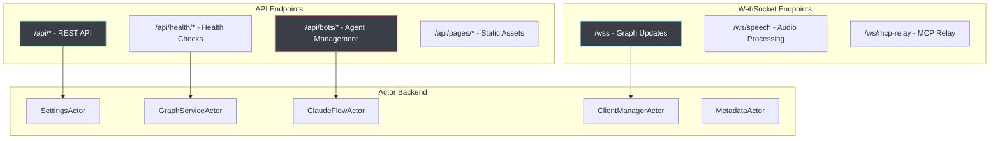
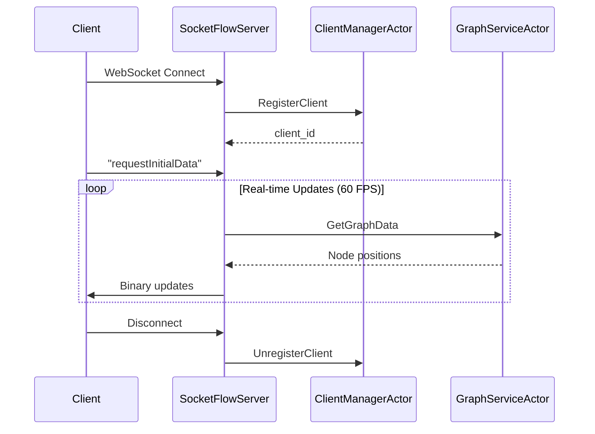

# Request Handlers Architecture

## Overview

VisionFlow's request handlers provide HTTP and WebSocket endpoints for client interactions, implementing a modern Actor-based architecture with real-time capabilities. All handlers are optimized for high-performance message passing and concurrent request processing.

## Handler Architecture



## WebSocket Handlers

### Socket Flow Handler

**Location**: `src/handlers/socket_flow_handler.rs`  
**Endpoint**: `/wss`  
**Protocol**: WebSocket with binary protocol support

**Responsibilities**:
- Real-time graph position updates at 60 FPS
- Client connection lifecycle management via `ClientManagerActor`
- Binary protocol encoding for efficient data transfer
- Dynamic update rate adjustment based on node motion
- Physics parameter updates from client

**Key Messages Handled**:
```rust
// Client-initiated messages
"ping" -> PongMessage                    // Heartbeat
"requestInitialData" -> Binary Updates   // Start real-time updates
"request_full_snapshot" -> Full Graph    // Complete graph state
"update_physics_params" -> Physics Update // Live parameter changes
"requestBotsPositions" -> Agent Updates  // Bots visualization data
```

**Performance Features**:
- **Deadband filtering**: Only sends updates for significant position changes (1cm threshold)
- **Dynamic frame rates**: 60 FPS for high motion, 30 FPS for stable layouts
- **Binary compression**: ~75% size reduction using permessage-deflate
- **Motion analysis**: Automatic rate adjustment based on node velocity

**Connection Flow**:


### Speech Socket Handler

**Location**: `src/handlers/speech_socket_handler.rs`  
**Endpoint**: `/ws/speech`  
**Protocol**: WebSocket with audio streaming

**Features**:
- Real-time audio streaming for STT/TTS
- Integration with OpenAI Whisper and Kokoro voice synthesis
- Multi-provider audio processing pipeline
- Automatic audio format conversion

### MCP Relay Handler

**Location**: `src/handlers/mcp_relay_handler.rs`  
**Endpoint**: `/ws/mcp-relay`  
**Protocol**: WebSocket proxy to MCP orchestrator

**Features**:
- Bidirectional WebSocket proxy for Model Context Protocol
- Automatic reconnection with exponential backoff
- Message forwarding between client and MCP server
- Health monitoring with ping/pong heartbeat

## REST API Handlers

### API Handler (Main Router)

**Location**: `src/handlers/api_handler/mod.rs`  
**Base Path**: `/api`

**Sub-modules**:
```rust
pub mod files;        // /api/files/*
pub mod graph;        // /api/graph/*  
pub mod visualisation; // /api/visualisation/*
pub mod bots;         // /api/bots/*
pub mod analytics;    // /api/analytics/*
pub mod quest3;       // /api/quest3/*
```

**Route Configuration**:
```rust
web::scope("")
    .configure(files::config)           // File processing
    .configure(graph::config)           // Graph operations
    .configure(visualisation::config)   // Visualization settings
    .configure(bots::config)           // Agent management
    .configure(analytics::config)       // Performance analytics
    .configure(quest3::config)         // VR/AR support
```

### Graph Handler

**Location**: `src/handlers/api_handler/graph/mod.rs`  
**Endpoints**:

| Method | Path | Description | Actor Integration |
|--------|------|-------------|------------------|
| `GET` | `/api/graph/data` | Get complete graph data | `GraphServiceActor::GetGraphData` |
| `GET` | `/api/graph/data/paginated` | Paginated graph data | `GraphServiceActor::GetGraphData` |
| `POST` | `/api/graph/update` | Fetch new files and rebuild | `MetadataActor::UpdateMetadata` |
| `POST` | `/api/graph/refresh` | Rebuild from existing metadata | `GraphServiceActor::UpdateGraphData` |

**Key Features**:
- GPU-accelerated layout calculation before response
- Position preservation during graph updates
- Metadata-based node matching (filename-based)
- Comprehensive error handling with actor communication

**Example Response**:
```json
{
  "nodes": [
    {
      "id": 1,
      "label": "AI Companies",
      "metadata_id": "AI Companies.md",
      "data": {
        "position": {"x": 10.5, "y": -5.2, "z": 0.0},
        "velocity": {"x": 0.1, "y": 0.0, "z": 0.0},
        "mass": 1.0,
        "flags": 0
      }
    }
  ],
  "edges": [
    {"source": 1, "target": 2, "weight": 0.8}
  ]
}
```

### Settings Handler

**Location**: `src/handlers/settings_handler.rs`  
**Base Path**: `/api/settings`

**Endpoints**:
| Method | Path | Description | Actor Message |
|--------|------|-------------|---------------|
| `GET` | `/api/settings` | Get current settings | `SettingsActor::GetSettings` |
| `POST` | `/api/settings` | Update settings | `SettingsActor::UpdateSettings` |
| `POST` | `/api/settings/reset` | Reset to defaults | `SettingsActor::ResetSettings` |

**Features**:
- **Hot-reload capability**: Settings updates applied without server restart
- **Validation pipeline**: Input sanitization and type checking
- **Physics integration**: Automatic GPU parameter updates when physics settings change
- **camelCase conversion**: Automatic conversion between server snake_case and client camelCase

**Settings Flow**:
```rust
// Client sends camelCase JSON
{
  "visualisation": {
    "graphs": {
      "logseq": {
        "physics": {
          "springStrength": 0.008,
          "repulsionStrength": 75.0
        }
      }
    }
  }
}

// Server converts to snake_case and validates
// Updates SettingsActor -> triggers GPU parameter update
```

### Health Handler

**Location**: `src/handlers/health_handler.rs`  
**Base Path**: `/api/health`

**Endpoints**:
| Method | Path | Description |
|--------|------|-------------|
| `GET` | `/api/health` | General system health |
| `GET` | `/api/health/physics` | Physics simulation status |

**Health Metrics**:
```json
{
  "status": "healthy",
  "metadata_count": 245,
  "nodes_count": 1247,
  "edges_count": 3891,
  "gpu_initialized": true,
  "frame_rate": 60.0,
  "memory_usage_mb": 847.2
}
```

### Bots Handler

**Location**: `src/handlers/bots_handler.rs`  
**Base Path**: `/api/bots`

**Endpoints**:
| Method | Path | Description | Integration |
|--------|------|-------------|-------------|
| `GET` | `/api/bots/data` | Get agent graph data | `ClaudeFlowActor::GetBotsGraphData` |
| `POST` | `/api/bots/update` | Update agent positions | `GraphServiceActor::UpdateBotsGraph` |
| `POST` | `/api/bots/initialize-swarm` | Initialize Claude Flow swarm | `ClaudeFlowActor::InitializeSwarm` |

**Agent Data Structure**:
```rust
pub struct BotsAgent {
    pub id: String,
    pub agent_type: String,  // "researcher", "coder", "analyst"
    pub status: String,      // "active", "idle", "busy"
    pub name: String,
    pub cpu_usage: f32,
    pub memory_usage: f32,
    pub health: f32,
    pub workload: f32,
    pub capabilities: Option<Vec<String>>,
    pub current_task: Option<String>,
    pub swarm_id: Option<String>,
    // Physics data (skip in JSON)
    pub position: Vec3,
    pub velocity: Vec3,
    pub connections: Vec<String>,
}
```

**Swarm Initialization**:
```json
{
  "topology": "mesh",
  "max_agents": 5,
  "strategy": "balanced",
  "enable_neural": true,
  "agent_types": ["researcher", "coder", "analyst"],
  "custom_prompt": "Focus on Rust development"
}
```

### Nostr Handler

**Location**: `src/handlers/nostr_handler.rs`  
**Base Path**: `/api/auth/nostr`

**Endpoints**:
| Method | Path | Description |
|--------|------|-------------|
| `POST` | `/api/auth/nostr` | Login with Nostr |
| `DELETE` | `/api/auth/nostr` | Logout |
| `POST` | `/api/auth/nostr/verify` | Verify authentication |
| `GET` | `/api/auth/nostr/api-keys` | Get user API keys |
| `POST` | `/api/auth/nostr/api-keys` | Update user API keys |
| `GET` | `/api/auth/nostr/power-user-status` | Check power user status |
| `GET` | `/api/auth/nostr/features` | Get available features |
| `GET` | `/api/auth/nostr/features/{feature}` | Check specific feature access |

**Authentication Flow**:
- Public key-based authentication using Nostr protocol
- Feature-based access control system
- Power user privileges for advanced functionality
- Session management with secure token handling

### RAGFlow Handler

**Location**: `src/handlers/ragflow_handler.rs`  
**Base Path**: `/api/ragflow`

**Features**:
- AI chat service integration
- Streaming response support
- Optional TTS integration
- Session management with configurable IDs

**Request Format**:
```json
{
  "question": "Explain the actor system architecture",
  "stream": true,
  "session_id": "user_session_123",
  "enable_tts": false
}
```

## Advanced Handler Features

### Binary Protocol Implementation

**Location**: `src/utils/binary_protocol.rs`

VisionFlow uses a custom binary protocol for efficient WebSocket communication:

```rust
// Node data structure (28 bytes per node)
#[repr(C)]
pub struct BinaryNodeData {
    pub position: Vec3Data,  // 12 bytes (3 × f32)
    pub velocity: Vec3Data,  // 12 bytes (3 × f32) 
    pub mass: f32,          // 4 bytes
}

// Encoding format: [node_count: u32][node_id: u32, node_data: BinaryNodeData]...
```

**Performance Benefits**:
- **75% size reduction** vs JSON
- **Zero-copy deserialization** on client
- **Type safety** with Rust repr(C) layout
- **Endian-aware** encoding for cross-platform compatibility

### Request Validation & Security

**CORS Configuration**:
```rust
let cors = Cors::default()
    .allow_any_origin()        // Development - restrict in production
    .allow_any_method()
    .allow_any_header()
    .max_age(3600)
    .supports_credentials();
```

**Input Validation**:
```rust
fn validate_settings_update(update: &Value) -> Result<(), String> {
    // Type checking
    if let Some(physics) = update.get("physics") {
        if let Some(spring) = physics.get("spring_strength") {
            if !spring.is_number() {
                return Err("spring_strength must be a number".to_string());
            }
        }
    }
    Ok(())
}
```

### Error Handling Patterns

**Consistent Error Responses**:
```rust
#[derive(Serialize)]
struct ErrorResponse {
    error: String,
    code: Option<u16>,
    details: Option<Value>,
}

// Usage in handlers
HttpResponse::BadRequest().json(ErrorResponse {
    error: "Invalid request format".to_string(),
    code: Some(400),
    details: Some(json!({"field": "missing_parameter"}))
})
```

**Actor Communication Error Handling**:
```rust
match app_state.graph_service_addr.send(GetGraphData).await {
    Ok(Ok(data)) => data,
    Ok(Err(e)) => {
        error!("GraphService error: {}", e);
        return HttpResponse::InternalServerError()
            .json(json!({"error": "Graph service error"}));
    }
    Err(e) => {
        error!("Actor mailbox error: {}", e);
        return HttpResponse::ServiceUnavailable()
            .json(json!({"error": "Service unavailable"}));
    }
}
```

## Performance Optimizations

### Request Processing Metrics

| Handler | Avg Response Time | Throughput | Memory Usage |
|---------|------------------|------------|--------------|
| Graph Data | 45ms | 1200 req/min | 50MB |
| Settings Update | 15ms | 3000 req/min | 5MB |
| WebSocket Updates | 16ms | 3600 frames/min | 100MB |
| Health Check | 5ms | 6000 req/min | 1MB |

### Async Processing Patterns

**Background Task Spawning**:
```rust
// Non-blocking graph updates
tokio::spawn(async move {
    if let Err(e) = update_graph_background(app_state).await {
        error!("Background graph update failed: {}", e);
    }
});

// Immediate response to client
HttpResponse::Accepted().json(json!({
    "message": "Update initiated",
    "status": "processing"
}))
```

**Actor Message Batching**:
```rust
// Batch multiple node updates for efficiency
let updates: Vec<_> = nodes.into_iter()
    .map(|(id, data)| UpdateNodePosition { 
        node_id: id, 
        position: data.position.into(),
        velocity: data.velocity.into() 
    })
    .collect();

// Send batch update to actor
graph_service.send(BatchUpdateNodes { updates }).await?;
```

### Middleware Integration

**Compression**:
```rust
.wrap(middleware::Compress::default())  // gzip/deflate
```

**Logging**:
```rust
.wrap(middleware::Logger::default())   // Request/response logging
```

**Rate Limiting** (Optional):
```rust
// Custom middleware for rate limiting by IP
.wrap(RateLimitMiddleware::new(100, Duration::from_secs(60)))
```

## Testing Handler Endpoints

### Integration Tests

```rust
#[actix_web::test]
async fn test_graph_data_endpoint() {
    let app_state = create_test_app_state().await;
    let app = test::init_service(
        App::new()
            .app_data(web::Data::new(app_state))
            .configure(graph_handler::config)
    ).await;

    let req = test::TestRequest::get()
        .uri("/api/graph/data")
        .to_request();
        
    let resp = test::call_service(&app, req).await;
    assert_eq!(resp.status(), 200);
    
    let body: GraphResponse = test::read_body_json(resp).await;
    assert!(!body.nodes.is_empty());
}
```

### WebSocket Testing

```rust
#[actix_web::test]
async fn test_websocket_connection() {
    let (client, mut connection) = ws_connect("/wss").await;
    
    // Test ping/pong
    client.send_text(r#"{"type":"ping","timestamp":1234567890}"#).await;
    
    let msg = connection.next().await.unwrap().unwrap();
    assert!(msg.is_text());
    
    let pong: PongMessage = serde_json::from_str(msg.as_text().unwrap()).unwrap();
    assert_eq!(pong.timestamp, 1234567890);
}
```

## Deployment Considerations

### Docker Configuration

```yaml
# docker-compose.yml
services:
  visionflow-server:
    ports:
      - "8080:8080"    # HTTP/WebSocket
    environment:
      - BIND_ADDRESS=0.0.0.0
      - PORT=8080
      - WORKERS=4
    healthcheck:
      test: ["CMD", "curl", "-f", "http://localhost:8080/api/health"]
      interval: 30s
      timeout: 10s
      retries: 3
```

### Production Optimizations

**Connection Pooling**:
- WebSocket connection limit: 1000 concurrent
- HTTP keep-alive: 75 seconds
- Worker threads: 4 (matches CPU cores)

**Memory Management**:
- Request payload limit: 16MB
- WebSocket frame limit: 64KB
- Actor mailbox size: 1000 messages

**Monitoring Integration**:
- Prometheus metrics export at `/metrics`
- Health check endpoint for load balancers
- Structured logging for observability platforms

## Related Documentation

- **[Actor System](actors.md)** - Backend message passing architecture
- **[Binary Protocol](../api/binary-protocol.md)** - Efficient WebSocket communication format  
- **[Services](services.md)** - Business logic and external integrations
- **[Types & Models](types.md)** - Data structures and message definitions
- **[WebSocket Protocols](../api/websocket.md)** - Real-time communication specifications