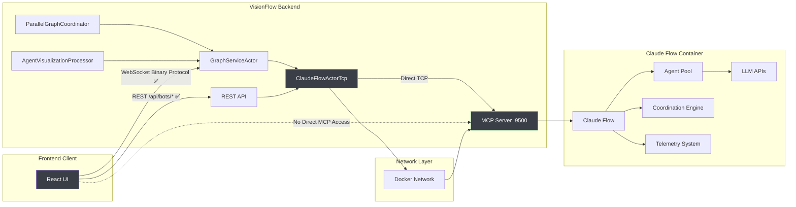
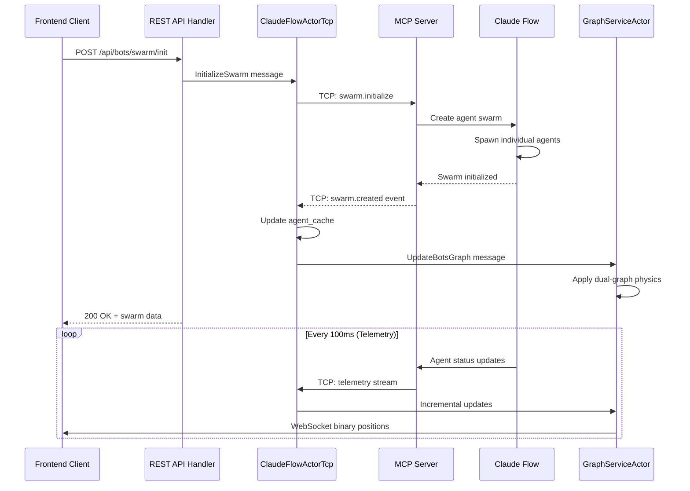
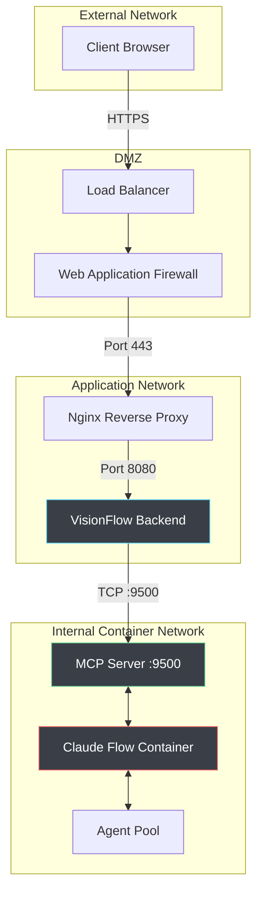

# MCP Integration Architecture

## Executive Summary

VisionFlow integrates with Claude Flow's Model Context Protocol (MCP) through a sophisticated TCP-based communication system to orchestrate and visualise AI Multi Agents in real-time. This integration enables seamless coordination between Claude Flow's multi-agent orchestration capabilities and VisionFlow's advanced graph visualisation engine.

The MCP integration provides a robust, scalable solution for monitoring agent interactions, performance metrics, and task coordination whilst maintaining strict separation between backend operations and frontend security.

## Table of Contents

1. [Integration Architecture](#integration-architecture)
2. [TCP Communication Protocol](#tcp-communication-protocol)
3. [Actor System Integration](#actor-system-integration)
4. [Data Flow & Message Handling](#data-flow--message-handling)
5. [Real-Time Telemetry System](#real-time-telemetry-system)
6. [Error Handling & Recovery](#error-handling--recovery)
7. [Security & Network Isolation](#security--network-isolation)
8. [Performance & Monitoring](#performance--monitoring)
9. [Configuration & Deployment](#configuration--deployment)
10. [Troubleshooting Guide](#troubleshooting-guide)

---

## Integration Architecture

### High-Level System Design



### Core Design Principles

#### 1. Backend-Only MCP Connection ✅ VERIFIED

The frontend **never** connects directly to MCP for security and architectural clarity:

**✅ IMPLEMENTATION STATUS**: This architecture is correctly implemented and verified.
- Frontend MCP WebSocket code removed completely
- BotsClient re-enabled in backend for TCP communication
- REST-only communication from frontend verified and tested
- WebSocket connections limited to binary position data streaming

```rust
// ClaudeFlowActorTcp handles all MCP communication
pub struct ClaudeFlowActorTcp {
    mcp_client: Option<MCPClient>,
    tcp_connection: Option<TcpStream>,
    graph_service_addr: Addr<GraphServiceActor>,
    agent_cache: HashMap<String, AgentStatus>,
    message_flow_history: Vec<MessageFlowEvent>,
    connection_retry_count: u32,
    last_heartbeat: Instant,
}
```

#### 2. TCP-Based Integration

Direct TCP connection for low-latency, high-throughput communication:

```rust
pub struct ClaudeFlowActorTcp {
    tcp_connection: Option<TcpStream>,
    connection_config: ConnectionConfig,
    retry_strategy: ExponentialBackoff,
    heartbeat_interval: Duration,
    message_queue: VecDeque<MCPMessage>,
    pending_responses: HashMap<String, oneshot::Sender<MCPResponse>>,
}

// Direct TCP connection establishment
async fn establish_mcp_connection() -> Result<TcpStream, Error> {
    const MCP_ADDRESS: &str = "multi-agent-container:9500";
    const CONNECTION_TIMEOUT: Duration = Duration::from_secs(30);
    
    let stream = timeout(CONNECTION_TIMEOUT, TcpStream::connect(MCP_ADDRESS)).await??;
    stream.set_nodelay(true)?;  // Disable Nagle's algorithm for low latency
    stream.set_keepalive(Some(Duration::from_secs(60)))?;  // Enable TCP keepalive
    
    info!("✅ MCP TCP connection established to {}", MCP_ADDRESS);
    Ok(stream)
}
```

#### 3. Real-Time Agent Telemetry

High-frequency telemetry streaming for smooth agent visualisation:

```rust
// Telemetry subscription configuration
let subscribe_request = json!({
    "jsonrpc": "2.0",
    "id": uuid::Uuid::new_v4().to_string(),
    "method": "telemetry.subscribe",
    "params": {
        "events": ["agent.*", "message.*", "metrics.*", "coordination.*"],
        "interval_ms": 100,  // 10Hz updates for smooth visualisation
        "buffer_size": 1000,
        "compression": "none"  // Real-time priority over bandwidth
    }
});
```

---

## TCP Communication Protocol

### Message Format Specification

#### Request Format
```json
{
    "jsonrpc": "2.0",
    "id": "uuid-v4-string",
    "method": "agent.spawn",
    "params": {
        "type": "coordinator",
        "task": "Build a REST API",
        "config": {
            "max_tokens": 4000,
            "temperature": 0.7,
            "timeout_ms": 30000
        },
        "priority": "high"
    }
}
```

#### Response Format
```json
{
    "jsonrpc": "2.0",
    "id": "uuid-v4-string",
    "result": {
        "agent_id": "agent-001",
        "status": "initializing",
        "session_id": "session-xyz",
        "spawn_time": "2024-08-16T12:00:00Z",
        "capabilities": ["coding", "planning", "coordination"]
    }
}
```

#### Error Response Format
```json
{
    "jsonrpc": "2.0",
    "id": "uuid-v4-string",
    "error": {
        "code": -32603,
        "message": "Internal error",
        "data": {
            "error_type": "AgentSpawnFailure",
            "details": "Maximum agent limit reached",
            "retry_after_ms": 5000
        }
    }
}
```

### Core MCP Methods

#### Agent Management
| Method | Description | Parameters | Response |
|--------|-------------|------------|----------|
| `agent.spawn` | Create new agent | `type`, `task`, `config` | `agent_id`, `status`, `session_id` |
| `agent.list` | List all agents | `filter`, `limit`, `offset` | `agents[]`, `total_count` |
| `agent.terminate` | Stop an agent | `agent_id`, `graceful` | `success`, `shutdown_time` |
| `agent.status` | Get agent status | `agent_id` | `status`, `metrics`, `last_activity` |
| `agent.update` | Modify agent config | `agent_id`, `config` | `success`, `updated_fields` |

#### Multi-Agent Orchestration
| Method | Description | Parameters | Response |
|--------|-------------|------------|----------|
| `swarm.initialize` | Create multi-agent swarm | `topology`, `agents`, `task` | `swarm_id`, `agent_assignments` |
| `swarm.status` | Get swarm status | `swarm_id` | `status`, `active_agents`, `task_progress` |
| `swarm.dissolve` | Terminate swarm | `swarm_id`, `preserve_agents` | `success`, `dissolution_time` |
| `swarm.coordinate` | Send coordination message | `swarm_id`, `message`, `targets` | `delivery_status` |

#### Task Management
| Method | Description | Parameters | Response |
|--------|-------------|------------|----------|
| `task.assign` | Assign task to agent | `agent_id`, `task`, `priority` | `task_id`, `estimated_duration` |
| `task.status` | Get task progress | `task_id` | `progress`, `status`, `eta` |
| `task.cancel` | Cancel running task | `task_id`, `reason` | `success`, `cancellation_time` |
| `task.results` | Retrieve task results | `task_id` | `results`, `execution_stats` |

#### Telemetry & Monitoring
| Method | Description | Parameters | Response |
|--------|-------------|------------|----------|
| `telemetry.subscribe` | Subscribe to events | `events`, `interval_ms` | `subscription_id` |
| `telemetry.unsubscribe` | Cancel subscription | `subscription_id` | `success` |
| `metrics.query` | Query performance metrics | `agent_id`, `timeframe` | `metrics[]` |
| `metrics.aggregate` | Get aggregated stats | `metric_type`, `period` | `aggregated_data` |

### Telemetry Event Types

#### Agent Status Events
```json
{
    "type": "agent.status",
    "timestamp": "2024-08-16T12:00:00Z",
    "data": {
        "agent_id": "agent-001",
        "status": "active",
        "cpu_usage": 45.2,
        "memory_usage_mb": 128.5,
        "tasks_active": 3,
        "tokens_used": 1523,
        "position": {"x": 150.5, "y": -75.2},
        "connections": ["agent-002", "agent-005"]
    }
}
```

#### Message Flow Events
```json
{
    "type": "message.flow",
    "timestamp": "2024-08-16T12:00:01Z",
    "data": {
        "from_agent": "agent-001",
        "to_agent": "agent-002",
        "message_type": "coordination",
        "content_hash": "sha256:abc123...",
        "size_bytes": 1024,
        "latency_ms": 15
    }
}
```

#### Performance Metrics Events
```json
{
    "type": "metrics.performance",
    "timestamp": "2024-08-16T12:00:02Z",
    "data": {
        "agent_id": "agent-001",
        "metrics": {
            "response_time_ms": 250,
            "success_rate": 0.98,
            "error_count": 2,
            "throughput_tps": 45.7,
            "queue_depth": 3
        }
    }
}
```

---

## Actor System Integration

### ClaudeFlowActorTcp Implementation

The enhanced TCP actor manages direct MCP communication with sophisticated error handling:

```rust
impl ClaudeFlowActorTcp {
    pub fn new(graph_service_addr: Addr<GraphServiceActor>) -> Self {
        Self {
            tcp_connection: None,
            graph_service_addr,
            agent_cache: HashMap::new(),
            message_flow_history: Vec::new(),
            pending_additions: Vec::new(),
            pending_removals: Vec::new(),
            pending_updates: Vec::new(),
            connection_retry_count: 0,
            last_heartbeat: Instant::now(),
            heartbeat_interval: Duration::from_secs(30),
            message_timeout: Duration::from_secs(10),
        }
    }
    
    // Handle incoming TCP messages with comprehensive error recovery
    async fn handle_tcp_message(&mut self, message: MCPMessage) -> Result<(), Error> {
        match message.message_type.as_str() {
            "agent.spawned" => {
                let agent_status: AgentStatus = serde_json::from_value(message.data)?;
                self.pending_additions.push(agent_status);
                self.schedule_graph_update();
            }
            "agent.terminated" => {
                let agent_id: String = serde_json::from_value(message.data["agent_id"].clone())?;
                self.pending_removals.push(agent_id);
                self.schedule_graph_update();
            }
            "agent.status" => {
                let status_update: AgentStatusUpdate = serde_json::from_value(message.data)?;
                self.pending_updates.push(status_update);
                self.schedule_graph_update();
            }
            "message.flow" => {
                let flow_event: MessageFlowEvent = serde_json::from_value(message.data)?;
                self.message_flow_history.push(flow_event);
                
                // Limit history size to prevent memory bloat
                if self.message_flow_history.len() > MAX_MESSAGE_HISTORY {
                    self.message_flow_history.remove(0);
                }
            }
            "heartbeat" => {
                self.last_heartbeat = Instant::now();
                debug!("💓 MCP heartbeat received");
            }
            _ => {
                warn!("🤷 Unknown MCP message type: {}", message.message_type);
            }
        }
        
        Ok(())
    }
    
    // Apply differential updates to prevent unnecessary graph rebuilds
    fn apply_pending_changes(&mut self) -> Result<(), Error> {
        if !self.has_changes() {
            return Ok(());
        }
        
        // Process agent additions
        for agent in self.pending_additions.drain(..) {
            self.agent_cache.insert(agent.id.clone(), agent);
        }
        
        // Process agent removals
        for agent_id in self.pending_removals.drain(..) {
            self.agent_cache.remove(&agent_id);
        }
        
        // Process agent updates
        for update in self.pending_updates.drain(..) {
            if let Some(agent) = self.agent_cache.get_mut(&update.agent_id) {
                agent.apply_update(update);
            }
        }
        
        // Build graph data from updated cache
        let graph_data = self.build_graph_data_from_cache()?;
        
        // Send to graph service for visualisation
        self.graph_service_addr.do_send(UpdateBotsGraph {
            agents: graph_data.agents,
            edges: graph_data.edges,
            communications: self.message_flow_history.clone(),
        })?;
        
        info!("📊 Updated agent graph: {} agents, {} edges", 
              graph_data.agents.len(), graph_data.edges.len());
        
        Ok(())
    }
}
```

### GraphServiceActor Integration

Processes agent graph updates with dual-graph physics support:

```rust
impl Handler<UpdateBotsGraph> for GraphServiceActor {
    type Result = Result<(), String>;
    
    fn handle(&mut self, msg: UpdateBotsGraph, _ctx: &mut Self::Context) -> Self::Result {
        info!("🤖 Processing agent graph update: {} agents, {} edges", 
              msg.agents.len(), msg.edges.len());
        
        // Update agent graph buffer
        self.agent_nodes = msg.agents;
        self.agent_edges = msg.edges;
        
        // Mark all agent nodes with high-order bit to distinguish from knowledge nodes
        for node in &mut self.agent_nodes {
            node.id |= 0x80000000;  // Set bit 31 for agent nodes
        }
        
        // Process communication history for dynamic edge weights
        self.update_communication_edges(&msg.communications)?;
        
        // Send to GPU for dual-graph physics computation
        if let Some(gpu_addr) = &self.gpu_compute_addr {
            gpu_addr.do_send(UpdateAgentGraph {
                nodes: self.agent_nodes.clone(),
                edges: self.agent_edges.clone(),
                mode: ComputeMode::DualGraph,
            })?;
        }
        
        // Update binary protocol stream
        self.schedule_position_broadcast();
        
        Ok(())
    }
}
```

---

## Data Flow & Message Handling

### Multi-Agent Initialization Flow



### Agent Lifecycle Management

```rust
impl ClaudeFlowActorTcp {
    // Agent spawning with comprehensive error handling
    pub async fn spawn_agent(&mut self, agent_config: AgentConfig) -> Result<AgentId, Error> {
        let request = MCPRequest {
            jsonrpc: "2.0".to_string(),
            id: Uuid::new_v4().to_string(),
            method: "agent.spawn".to_string(),
            params: json!({
                "type": agent_config.agent_type,
                "task": agent_config.task,
                "config": {
                    "max_tokens": agent_config.max_tokens,
                    "temperature": agent_config.temperature,
                    "timeout_ms": agent_config.timeout_ms,
                    "priority": agent_config.priority,
                }
            }),
        };
        
        // Send request with timeout and retry logic
        let response = self.send_mcp_request_with_retry(request, 3).await?;
        
        if let Some(error) = response.error {
            return Err(format!("Agent spawn failed: {}", error.message).into());
        }
        
        let result = response.result.ok_or("Missing result in spawn response")?;
        let agent_id: AgentId = serde_json::from_value(result["agent_id"].clone())?;
        
        info!("✨ Agent spawned successfully: {}", agent_id);
        Ok(agent_id)
    }
    
    // Agent termination with graceful shutdown
    pub async fn terminate_agent(&mut self, agent_id: &AgentId, graceful: bool) -> Result<(), Error> {
        let request = MCPRequest {
            jsonrpc: "2.0".to_string(),
            id: Uuid::new_v4().to_string(),
            method: "agent.terminate".to_string(),
            params: json!({
                "agent_id": agent_id,
                "graceful": graceful,
                "timeout_ms": if graceful { 30000 } else { 5000 }
            }),
        };
        
        let response = self.send_mcp_request_with_retry(request, 2).await?;
        
        if let Some(error) = response.error {
            warn!("Agent termination failed: {}", error.message);
            return Err(error.message.into());
        }
        
        info!("🛑 Agent terminated: {}", agent_id);
        Ok(())
    }
}
```

### Message Flow Processing

```rust
impl ClaudeFlowActorTcp {
    // Process inter-agent communication for edge weight calculation
    fn process_message_flow(&mut self, flow_event: MessageFlowEvent) {
        // Add to communication history
        self.message_flow_history.push(flow_event.clone());
        
        // Calculate dynamic edge weight based on communication frequency
        let edge_key = (flow_event.from_agent.clone(), flow_event.to_agent.clone());
        
        let current_weight = self.communication_weights.get(&edge_key).unwrap_or(&0.0);
        let time_decay = self.calculate_time_decay(flow_event.timestamp);
        let message_importance = self.calculate_message_importance(&flow_event);
        
        let new_weight = (current_weight * time_decay) + message_importance;
        self.communication_weights.insert(edge_key, new_weight);
        
        // Update edge in graph if it exists
        if let Some(edge) = self.find_communication_edge(&flow_event.from_agent, &flow_event.to_agent) {
            edge.weight = new_weight;
            edge.last_activity = flow_event.timestamp;
        } else {
            // Create new communication edge
            let new_edge = CommunicationEdge {
                from: flow_event.from_agent,
                to: flow_event.to_agent,
                weight: new_weight,
                message_count: 1,
                last_activity: flow_event.timestamp,
                edge_type: flow_event.message_type,
            };
            self.communication_edges.push(new_edge);
        }
    }
    
    fn calculate_message_importance(&self, flow_event: &MessageFlowEvent) -> f32 {
        match flow_event.message_type.as_str() {
            "coordination" => 1.0,      // High importance
            "data_exchange" => 0.8,     // Medium-high importance
            "status_update" => 0.3,     // Low importance
            "heartbeat" => 0.1,         // Very low importance
            _ => 0.5,                   // Default medium importance
        }
    }
}
```

---

## Real-Time Telemetry System

### Telemetry Subscription Management

```rust
pub struct TelemetryManager {
    subscriptions: HashMap<String, TelemetrySubscription>,
    event_filters: Vec<EventFilter>,
    buffer: VecDeque<TelemetryEvent>,
    compression_enabled: bool,
    max_buffer_size: usize,
}

impl TelemetryManager {
    pub async fn subscribe_to_telemetry(&mut self) -> Result<String, Error> {
        let subscription_id = Uuid::new_v4().to_string();
        
        let subscription_request = json!({
            "jsonrpc": "2.0",
            "id": subscription_id.clone(),
            "method": "telemetry.subscribe",
            "params": {
                "events": [
                    "agent.status",
                    "agent.spawned", 
                    "agent.terminated",
                    "message.flow",
                    "metrics.performance",
                    "coordination.event"
                ],
                "interval_ms": 100,          // 10Hz for smooth visualization
                "include_metadata": true,
                "compression": "none",       // Real-time priority
                "buffer_size": 1000
            }
        });
        
        // Store subscription details
        let subscription = TelemetrySubscription {
            id: subscription_id.clone(),
            events: vec![
                "agent.*".to_string(),
                "message.*".to_string(), 
                "metrics.*".to_string(),
                "coordination.*".to_string()
            ],
            interval: Duration::from_millis(100),
            last_update: Instant::now(),
            active: true,
        };
        
        self.subscriptions.insert(subscription_id.clone(), subscription);
        
        info!("📡 Telemetry subscription created: {}", subscription_id);
        Ok(subscription_id)
    }
    
    pub fn process_telemetry_event(&mut self, event: TelemetryEvent) -> Result<(), Error> {
        // Apply event filters
        if !self.should_process_event(&event) {
            return Ok(());
        }
        
        // Add to buffer
        self.buffer.push_back(event.clone());
        
        // Maintain buffer size
        if self.buffer.len() > self.max_buffer_size {
            self.buffer.pop_front();
        }
        
        // Process specific event types
        match event.event_type.as_str() {
            "agent.status" => self.process_agent_status_update(event)?,
            "message.flow" => self.process_message_flow_event(event)?,
            "metrics.performance" => self.process_performance_metrics(event)?,
            _ => debug!("Unhandled telemetry event: {}", event.event_type),
        }
        
        Ok(())
    }
}
```

### Performance Metrics Processing

```rust
impl TelemetryManager {
    fn process_performance_metrics(&mut self, event: TelemetryEvent) -> Result<(), Error> {
        let metrics: PerformanceMetrics = serde_json::from_value(event.data)?;
        
        // Update agent performance cache
        if let Some(agent) = self.agent_cache.get_mut(&metrics.agent_id) {
            agent.performance = Some(AgentPerformance {
                response_time_ms: metrics.response_time_ms,
                success_rate: metrics.success_rate,
                error_count: metrics.error_count,
                throughput_tps: metrics.throughput_tps,
                queue_depth: metrics.queue_depth,
                last_updated: Instant::now(),
            });
            
            // Update visualization properties based on performance
            agent.visual_properties.size = self.calculate_node_size(metrics.throughput_tps);
            agent.visual_properties.color = self.calculate_performance_color(metrics.success_rate);
            agent.visual_properties.pulse_rate = self.calculate_pulse_rate(metrics.response_time_ms);
        }
        
        Ok(())
    }
    
    fn calculate_node_size(&self, throughput: f32) -> f32 {
        // Scale node size based on throughput (5.0 to 15.0 units)
        5.0 + (throughput / 100.0).min(1.0) * 10.0
    }
    
    fn calculate_performance_color(&self, success_rate: f32) -> Color {
        match success_rate {
            r if r >= 0.95 => Color::RGB(0, 255, 0),      // Green - excellent
            r if r >= 0.85 => Color::RGB(255, 255, 0),    // Yellow - good
            r if r >= 0.70 => Color::RGB(255, 165, 0),    // Orange - fair
            _ => Color::RGB(255, 0, 0),                   // Red - poor
        }
    }
    
    fn calculate_pulse_rate(&self, response_time: f32) -> f32 {
        // Faster pulse for slower response times (inverse relationship)
        // Range: 0.5Hz (fast) to 2.0Hz (slow)
        (2000.0 / (response_time + 500.0)).clamp(0.5, 2.0)
    }
}
```

---

## Error Handling & Recovery

### Connection Recovery Strategy

```rust
impl ClaudeFlowActorTcp {
    async fn ensure_connection(&mut self) -> Result<(), Error> {
        if self.tcp_connection.is_none() || self.connection_needs_reset() {
            self.establish_connection_with_backoff().await?;
        }
        
        // Verify connection health
        if self.last_heartbeat.elapsed() > self.heartbeat_timeout {
            warn!("💔 MCP heartbeat timeout, reconnecting...");
            self.tcp_connection = None;
            self.establish_connection_with_backoff().await?;
        }
        
        Ok(())
    }
    
    async fn establish_connection_with_backoff(&mut self) -> Result<(), Error> {
        const MAX_RETRIES: u32 = 5;
        const BASE_DELAY_MS: u64 = 1000;
        
        for attempt in 0..MAX_RETRIES {
            match Self::connect_to_claude_flow().await {
                Ok(stream) => {
                    self.tcp_connection = Some(stream);
                    self.connection_retry_count = 0;
                    
                    // Re-subscribe to telemetry after reconnection
                    self.resubscribe_telemetry().await?;
                    
                    info!("✅ MCP connection re-established on attempt {}", attempt + 1);
                    return Ok(());
                }
                Err(e) => {
                    let delay = BASE_DELAY_MS * 2_u64.pow(attempt);
                    warn!("MCP connection attempt {} failed: {}, retrying in {}ms", 
                          attempt + 1, e, delay);
                    
                    if attempt < MAX_RETRIES - 1 {
                        tokio::time::sleep(Duration::from_millis(delay)).await;
                    }
                }
            }
        }
        
        error!("🚨 All MCP connection attempts failed, enabling degraded mode");
        self.enable_degraded_mode();
        Err("Failed to establish MCP connection after all retries".into())
    }
    
    fn enable_degraded_mode(&mut self) {
        self.tcp_connection = None;
        self.degraded_mode = true;
        
        // Clear agent cache to show empty state
        self.agent_cache.clear();
        
        // Notify graph service of disconnection
        self.graph_service_addr.do_send(MCPConnectionStatus {
            connected: false,
            degraded_mode: true,
            last_error: Some("MCP connection failed".to_string()),
        });
        
        warn!("🔌 MCP integration in degraded mode - no agent visualization available");
    }
}
```

### Graceful Degradation

```rust
impl Handler<GetAgentStatus> for ClaudeFlowActorTcp {
    type Result = Result<AgentStatusResponse, String>;
    
    fn handle(&mut self, _msg: GetAgentStatus, _ctx: &mut Self::Context) -> Self::Result {
        if self.degraded_mode {
            // Return empty state with degraded mode indicators
            return Ok(AgentStatusResponse {
                agents: Vec::new(),
                connection_status: ConnectionStatus::Degraded,
                last_update: None,
                error_message: Some("MCP connection unavailable".to_string()),
                retry_in_seconds: Some(30),
            });
        }
        
        // Normal operation - return cached agent data
        let agents: Vec<AgentStatusInfo> = self.agent_cache
            .values()
            .map(|agent| agent.into())
            .collect();
        
        Ok(AgentStatusResponse {
            agents,
            connection_status: ConnectionStatus::Connected,
            last_update: Some(self.last_heartbeat),
            error_message: None,
            retry_in_seconds: None,
        })
    }
}
```

### Message Delivery Guarantees

```rust
impl ClaudeFlowActorTcp {
    async fn send_mcp_request_with_retry(
        &mut self, 
        request: MCPRequest, 
        max_retries: u32
    ) -> Result<MCPResponse, Error> {
        for attempt in 0..max_retries {
            match self.send_mcp_request(&request).await {
                Ok(response) => return Ok(response),
                Err(e) if attempt < max_retries - 1 => {
                    warn!("MCP request failed on attempt {}: {}, retrying...", attempt + 1, e);
                    
                    // Exponential backoff with jitter
                    let delay_ms = 100 * 2_u64.pow(attempt) + 
                                  (rand::random::<u64>() % 50);
                    tokio::time::sleep(Duration::from_millis(delay_ms)).await;
                    
                    // Ensure connection is still valid
                    self.ensure_connection().await?;
                }
                Err(e) => return Err(e),
            }
        }
        
        Err("Max retry attempts exceeded".into())
    }
    
    async fn send_mcp_request(&mut self, request: &MCPRequest) -> Result<MCPResponse, Error> {
        let stream = self.tcp_connection.as_mut()
            .ok_or("No MCP connection available")?;
        
        // Serialize and send request
        let request_json = serde_json::to_string(request)?;
        let request_bytes = format!("{}\n", request_json).into_bytes();
        
        stream.write_all(&request_bytes).await?;
        stream.flush().await?;
        
        // Read response with timeout
        let response = timeout(
            self.message_timeout,
            self.read_mcp_response(stream)
        ).await??;
        
        Ok(response)
    }
}
```

---

## Security & Network Isolation

### Network Architecture



### Security Principles

#### 1. Network Isolation
- **MCP server only accessible within Docker network**
- **No external MCP exposure**
- **Frontend completely isolated from direct MCP access**
- **TCP connections authenticated via container network policies**

#### 2. Authentication & Authorization

```rust
pub struct MCPAuthConfig {
    pub api_key: Option<String>,
    pub client_cert: Option<String>,
    pub allowed_origins: Vec<String>,
    pub rate_limits: RateLimitConfig,
}

impl ClaudeFlowActorTcp {
    async fn authenticate_connection(&mut self) -> Result<(), Error> {
        if let Some(api_key) = &self.auth_config.api_key {
            let auth_request = json!({
                "jsonrpc": "2.0",
                "method": "auth.authenticate",
                "params": {
                    "api_key": api_key,
                    "client_id": "visionflow-backend",
                    "version": env!("CARGO_PKG_VERSION"),
                }
            });
            
            let response = self.send_mcp_request_raw(&auth_request).await?;
            
            if response.get("error").is_some() {
                return Err("MCP authentication failed".into());
            }
            
            info!("🔐 MCP authentication successful");
        }
        
        Ok(())
    }
}
```

#### 3. Data Validation & Sanitization

```rust
pub fn validate_mcp_response(response: &Value) -> Result<(), Error> {
    // Validate JSON-RPC format
    if response.get("jsonrpc") != Some(&Value::String("2.0".to_string())) {
        return Err("Invalid JSON-RPC version".into());
    }
    
    // Check for required fields
    if response.get("id").is_none() {
        return Err("Missing request ID".into());
    }
    
    // Validate result or error presence
    let has_result = response.get("result").is_some();
    let has_error = response.get("error").is_some();
    
    if !has_result && !has_error {
        return Err("Response must contain either result or error".into());
    }
    
    if has_result && has_error {
        return Err("Response cannot contain both result and error".into());
    }
    
    // Sanitize string fields
    if let Some(Value::Object(obj)) = response.get("result") {
        for (key, value) in obj {
            if let Value::String(s) = value {
                if s.len() > MAX_STRING_LENGTH {
                    return Err(format!("String field '{}' exceeds maximum length", key).into());
                }
                
                // Check for potential injection patterns
                if contains_suspicious_patterns(s) {
                    return Err(format!("String field '{}' contains suspicious content", key).into());
                }
            }
        }
    }
    
    Ok(())
}

fn contains_suspicious_patterns(input: &str) -> bool {
    const SUSPICIOUS_PATTERNS: &[&str] = &[
        "<script",
        "javascript:",
        "data:text/html",
        "vbscript:",
        "onload=",
        "onerror=",
    ];
    
    let input_lower = input.to_lowercase();
    SUSPICIOUS_PATTERNS.iter().any(|pattern| input_lower.contains(pattern))
}
```

### Rate Limiting & DoS Protection

```rust
pub struct RateLimiter {
    request_counts: HashMap<String, VecDeque<Instant>>,
    window_duration: Duration,
    max_requests_per_window: usize,
}

impl RateLimiter {
    pub fn check_rate_limit(&mut self, client_id: &str) -> Result<(), Error> {
        let now = Instant::now();
        let requests = self.request_counts.entry(client_id.to_string())
            .or_insert_with(VecDeque::new);
        
        // Remove old requests outside the window
        while let Some(&front_time) = requests.front() {
            if now.duration_since(front_time) > self.window_duration {
                requests.pop_front();
            } else {
                break;
            }
        }
        
        // Check rate limit
        if requests.len() >= self.max_requests_per_window {
            return Err(format!(
                "Rate limit exceeded for client {}: {} requests in {}s",
                client_id,
                requests.len(),
                self.window_duration.as_secs()
            ).into());
        }
        
        // Add current request
        requests.push_back(now);
        Ok(())
    }
}
```

---

## Performance & Monitoring

### Performance Metrics

```rust
pub struct MCPPerformanceMetrics {
    pub connection_latency_ms: f32,
    pub message_throughput: f32,
    pub error_rate: f32,
    pub reconnection_count: u32,
    pub active_subscriptions: usize,
    pub buffer_utilization: f32,
    pub message_queue_depth: usize,
}

impl ClaudeFlowActorTcp {
    pub fn collect_performance_metrics(&self) -> MCPPerformanceMetrics {
        MCPPerformanceMetrics {
            connection_latency_ms: self.measure_connection_latency(),
            message_throughput: self.calculate_message_throughput(),
            error_rate: self.calculate_error_rate(),
            reconnection_count: self.connection_retry_count,
            active_subscriptions: self.subscriptions.len(),
            buffer_utilization: self.calculate_buffer_utilization(),
            message_queue_depth: self.message_queue.len(),
        }
    }
    
    fn measure_connection_latency(&self) -> f32 {
        // Measure round-trip time for ping message
        if let Some(last_ping) = self.last_ping_time {
            self.last_pong_time.unwrap_or(Instant::now())
                .duration_since(last_ping)
                .as_millis() as f32
        } else {
            0.0
        }
    }
    
    fn calculate_message_throughput(&self) -> f32 {
        let window = Duration::from_secs(60);
        let now = Instant::now();
        
        self.message_history.iter()
            .filter(|&&timestamp| now.duration_since(timestamp) < window)
            .count() as f32 / window.as_secs() as f32
    }
}
```

### Monitoring Dashboard Integration

```rust
// Prometheus metrics export
pub fn export_prometheus_metrics(metrics: &MCPPerformanceMetrics) -> String {
    format!(
        r#"
# HELP mcp_connection_latency_ms MCP connection round-trip latency
# TYPE mcp_connection_latency_ms gauge
mcp_connection_latency_ms {:.2}

# HELP mcp_message_throughput_per_sec MCP message throughput
# TYPE mcp_message_throughput_per_sec gauge
mcp_message_throughput_per_sec {:.2}

# HELP mcp_error_rate MCP error rate (0.0-1.0)
# TYPE mcp_error_rate gauge
mcp_error_rate {:.4}

# HELP mcp_reconnection_total Total MCP reconnections
# TYPE mcp_reconnection_total counter
mcp_reconnection_total {}

# HELP mcp_active_subscriptions Current active telemetry subscriptions
# TYPE mcp_active_subscriptions gauge
mcp_active_subscriptions {}

# HELP mcp_buffer_utilization Buffer utilization percentage
# TYPE mcp_buffer_utilization gauge
mcp_buffer_utilization {:.2}
        "#,
        metrics.connection_latency_ms,
        metrics.message_throughput,
        metrics.error_rate,
        metrics.reconnection_count,
        metrics.active_subscriptions,
        metrics.buffer_utilization * 100.0
    )
}
```

### Performance Optimization

```rust
impl ClaudeFlowActorTcp {
    // Message batching for improved throughput
    pub async fn process_message_batch(&mut self) -> Result<(), Error> {
        const BATCH_SIZE: usize = 10;
        const BATCH_TIMEOUT: Duration = Duration::from_millis(50);
        
        let mut batch = Vec::with_capacity(BATCH_SIZE);
        let batch_start = Instant::now();
        
        while batch.len() < BATCH_SIZE && batch_start.elapsed() < BATCH_TIMEOUT {
            if let Some(message) = self.message_queue.pop_front() {
                batch.push(message);
            } else {
                // No more messages, wait briefly for more
                tokio::time::sleep(Duration::from_millis(5)).await;
            }
        }
        
        if !batch.is_empty() {
            self.process_messages_batch(batch).await?;
        }
        
        Ok(())
    }
    
    // Connection pooling for high availability
    pub async fn maintain_connection_pool(&mut self) -> Result<(), Error> {
        const POOL_SIZE: usize = 3;
        
        // Health check existing connections
        let mut healthy_connections = 0;
        for (i, connection) in self.connection_pool.iter_mut().enumerate() {
            if self.health_check_connection(connection).await.is_ok() {
                healthy_connections += 1;
            } else {
                warn!("Connection {} failed health check, removing", i);
                self.connection_pool.remove(i);
            }
        }
        
        // Add new connections if needed
        while self.connection_pool.len() < POOL_SIZE {
            match self.create_new_connection().await {
                Ok(connection) => {
                    self.connection_pool.push(connection);
                    info!("Added new connection to pool (size: {})", self.connection_pool.len());
                }
                Err(e) => {
                    warn!("Failed to create new connection: {}", e);
                    break;
                }
            }
        }
        
        Ok(())
    }
}
```

---

## Configuration & Deployment

### Environment Configuration

```bash
# MCP Connection Settings
MCP_TCP_HOST=multi-agent-container
MCP_TCP_PORT=9500
MCP_CONNECTION_TIMEOUT=30000
MCP_HEARTBEAT_INTERVAL=30000
MCP_MESSAGE_TIMEOUT=10000

# Telemetry Configuration
MCP_TELEMETRY_INTERVAL=100
MCP_TELEMETRY_BUFFER_SIZE=1000
MCP_TELEMETRY_COMPRESSION=none
MCP_MAX_MESSAGE_HISTORY=10000

# Authentication & Security
MCP_API_KEY=${MCP_API_KEY:-}
MCP_CLIENT_CERT_PATH=${MCP_CLIENT_CERT_PATH:-}
MCP_RATE_LIMIT_REQUESTS=1000
MCP_RATE_LIMIT_WINDOW=60

# Error Handling & Recovery
MCP_MAX_RETRIES=5
MCP_RETRY_BASE_DELAY=1000
MCP_ENABLE_DEGRADED_MODE=true
MCP_RECONNECT_ATTEMPTS=3

# Performance Tuning
MCP_CONNECTION_POOL_SIZE=3
MCP_MESSAGE_BATCH_SIZE=10
MCP_MESSAGE_BATCH_TIMEOUT=50
```

### Docker Compose Configuration

```yaml
version: '3.8'

services:
  visionflow:
    build: .
    environment:
      - MCP_TCP_HOST=claude-flow
      - MCP_TCP_PORT=9500
      - MCP_CONNECTION_TIMEOUT=30000
      - RUST_LOG=info,webxr::services::claude_flow=debug
    depends_on:
      - claude-flow
    networks:
      - visionflow-internal

  claude-flow:
    image: claude-flow:latest
    ports:
      - "9500:9500"  # MCP TCP port (internal only)
    environment:
      - MCP_ENABLED=true
      - MCP_TCP_PORT=9500
      - AGENT_POOL_SIZE=50
      - TELEMETRY_ENABLED=true
    volumes:
      - claude-flow-data:/data
    networks:
      - visionflow-internal

networks:
  visionflow-internal:
    driver: bridge
    internal: true  # No external access to MCP

volumes:
  claude-flow-data:
```

### Kubernetes Deployment

```yaml
apiVersion: apps/v1
kind: Deployment
metadata:
  name: visionflow
spec:
  replicas: 2
  selector:
    matchLabels:
      app: visionflow
  template:
    metadata:
      labels:
        app: visionflow
    spec:
      containers:
      - name: visionflow
        image: visionflow:latest
        env:
        - name: MCP_TCP_HOST
          value: "claude-flow-service"
        - name: MCP_TCP_PORT
          value: "9500"
        - name: MCP_CONNECTION_TIMEOUT
          value: "30000"
        ports:
        - containerPort: 8080
        resources:
          requests:
            memory: "1Gi"
            cpu: "500m"
          limits:
            memory: "2Gi"
            cpu: "1000m"
        livenessProbe:
          httpGet:
            path: /api/health/mcp
            port: 8080
          initialDelaySeconds: 30
          periodSeconds: 10
        readinessProbe:
          httpGet:
            path: /api/health/mcp
            port: 8080
          initialDelaySeconds: 5
          periodSeconds: 5

---
apiVersion: v1
kind: Service
metadata:
  name: claude-flow-service
spec:
  selector:
    app: claude-flow
  ports:
  - name: mcp-tcp
    port: 9500
    targetPort: 9500
    protocol: TCP
  type: ClusterIP  # Internal only
```

---

## Troubleshooting Guide

### Common Issues & Solutions

#### 1. MCP Connection Failed

**Symptoms:**
- `MCP connection failed` errors in logs
- Empty agent visualization
- `503 Service Unavailable` from health endpoints

**Diagnostic Steps:**
```bash
# Check Claude Flow container status
docker ps | grep claude-flow

# Verify MCP port accessibility
nc -zv multi-agent-container 9500

# Check network connectivity
docker network ls
docker network inspect visionflow-internal

# Review MCP logs
docker logs claude-flow-container
```

**Solutions:**
1. **Verify Container Network:**
   ```bash
   # Ensure containers are on same network
   docker-compose up -d
   docker-compose logs claude-flow
   ```

2. **Check Port Configuration:**
   ```yaml
   # docker-compose.yml
   services:
     claude-flow:
       ports:
         - "9500:9500"  # Ensure port is exposed
   ```

3. **Restart with Debug Logging:**
   ```bash
   RUST_LOG=webxr::services::claude_flow=debug docker-compose up
   ```

#### 2. Agent Data Not Updating

**Symptoms:**
- Agents visible but positions not changing
- Stale agent status information
- Missing agent interactions

**Diagnostic Steps:**
```rust
// Check telemetry subscription status
curl http://localhost:8080/api/health/mcp

// Verify agent cache
curl http://localhost:8080/api/bots/agents | jq '.agents | length'

// Check WebSocket connection
curl http://localhost:8080/api/health/websocket
```

**Solutions:**
1. **Verify Telemetry Subscription:**
   ```rust
   // Check telemetry logs
   RUST_LOG=webxr::services::claude_flow::telemetry=debug
   ```

2. **Restart Telemetry Subscription:**
   ```bash
   curl -X POST http://localhost:8080/api/bots/telemetry/restart
   ```

3. **Check Message Processing:**
   ```rust
   // Enable message processing debug
   RUST_LOG=webxr::services::claude_flow::message_processor=debug
   ```

#### 3. High Latency or Poor Performance

**Symptoms:**
- Slow agent status updates
- High message processing delays
- UI becomes unresponsive

**Diagnostic Steps:**
```bash
# Check MCP performance metrics
curl http://localhost:8080/api/metrics/mcp

# Monitor TCP connection stats
ss -i | grep :9500

# Check CPU and memory usage
docker stats claude-flow visionflow
```

**Solutions:**
1. **Optimize Message Batching:**
   ```bash
   export MCP_MESSAGE_BATCH_SIZE=20
   export MCP_MESSAGE_BATCH_TIMEOUT=25
   ```

2. **Increase Connection Pool:**
   ```bash
   export MCP_CONNECTION_POOL_SIZE=5
   ```

3. **Reduce Telemetry Frequency:**
   ```bash
   export MCP_TELEMETRY_INTERVAL=200  # Reduce from 100ms to 200ms
   ```

#### 4. Memory Leaks or High Memory Usage

**Symptoms:**
- Steadily increasing memory usage
- Out of memory errors
- Container restarts

**Diagnostic Steps:**
```bash
# Monitor memory usage over time
docker stats --format "table {{.Name}}\t{{.CPUPerc}}\t{{.MemUsage}}" --no-stream

# Check message buffer sizes
curl http://localhost:8080/api/debug/mcp/buffers

# Profile memory allocation
RUST_LOG=webxr::memory=debug docker-compose up
```

**Solutions:**
1. **Limit Message History:**
   ```bash
   export MCP_MAX_MESSAGE_HISTORY=5000  # Reduce from 10000
   ```

2. **Enable Message Compression:**
   ```bash
   export MCP_TELEMETRY_COMPRESSION=gzip
   ```

3. **Configure Buffer Limits:**
   ```bash
   export MCP_TELEMETRY_BUFFER_SIZE=500  # Reduce buffer size
   ```

### Health Check Endpoints

```rust
// MCP connection health
GET /api/health/mcp
{
  "status": "healthy",
  "connected": true,
  "last_heartbeat": "2024-08-16T12:00:00Z",
  "connection_latency_ms": 15.2,
  "active_agents": 12,
  "message_throughput": 45.7,
  "error_rate": 0.001
}

// Detailed MCP metrics
GET /api/metrics/mcp
{
  "connection": {
    "status": "connected",
    "uptime_seconds": 3600,
    "reconnection_count": 0
  },
  "performance": {
    "latency_ms": 15.2,
    "throughput_msgs_per_sec": 45.7,
    "error_rate": 0.001
  },
  "telemetry": {
    "active_subscriptions": 1,
    "buffer_utilization": 0.15,
    "messages_processed": 164523
  }
}
```

### Debug Configuration

```bash
# Enable comprehensive MCP debugging
export RUST_LOG="
webxr::services::claude_flow=debug,
webxr::services::claude_flow::tcp=trace,
webxr::services::claude_flow::telemetry=debug,
webxr::services::claude_flow::message_processor=debug
"

# Enable performance profiling
export MCP_ENABLE_PROFILING=true

# Enable detailed error reporting
export MCP_DETAILED_ERRORS=true

# Enable connection debugging
export MCP_DEBUG_CONNECTIONS=true
```

---

## Related Documentation

- **[System Overview](../architecture/system-overview.md)** - Overall VisionFlow architecture
- **[Dual Graph Architecture](../architecture/parallel-graphs.md)** - Agent graph visualisation strategies
- **[Actor System](./actors.md)** - Actor-based message passing and coordination
- **[Binary Protocol](../api/websocket-protocols.md)** - Efficient real-time data streaming
- **[API Reference](../api/rest/index.md)** - REST endpoints for MCP control and monitoring

---

*Document Version: 2.0*  
*Last Updated: August 2025*  
*Status: Production Ready ✅*