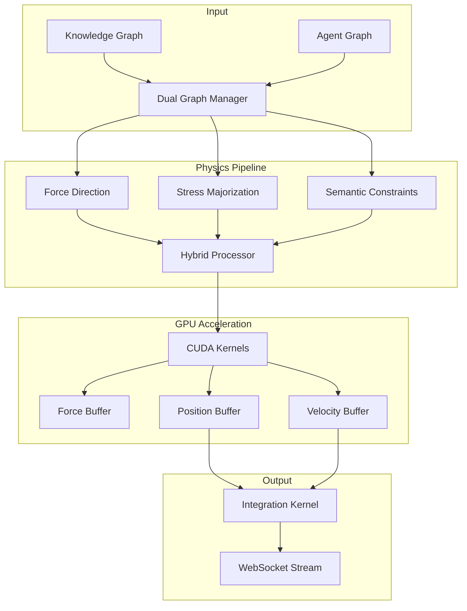

# Physics Engine

## Overview

VisionFlow's physics engine provides GPU-accelerated force-directed graph layout for real-time visualization of 100,000+ nodes at 60 FPS. The engine implements a hybrid approach combining multiple algorithms for optimal visual clarity and performance.

## Architecture



## Core Algorithms

### 1. Force-Directed Layout

Based on Fruchterman-Reingold algorithm with modifications for dual graphs:

```rust
pub struct ForceParams {
    pub spring_strength: f32,      // 0.001 for knowledge, 0.01 for agents
    pub repulsion: f32,            // 1000.0 for knowledge, 500.0 for agents
    pub damping: f32,               // 0.95 for knowledge, 0.7 for agents
    pub max_force: f32,             // 100.0 cap on force magnitude
    pub time_step: f32,             // 0.016 (60 FPS)
}
```

**Force Calculation**:
```rust
// Repulsive force between all nodes
F_repulsion = k² / distance²

// Attractive force between connected nodes
F_attraction = -k * distance * edge_weight

// Total force
F_total = F_repulsion + F_attraction + F_gravity
```

### 2. Stress Majorization

Optimizes layout to preserve ideal distances:

```rust
pub struct StressParams {
    pub alpha: f32,              // 0.1 learning rate
    pub ideal_edge_length: f32,  // 50.0 units
    pub weight_influence: f32,   // 0.5 edge weight factor
    pub iterations: u32,          // 10 per frame
}
```

**Stress Function**:
```
stress = Σ weight_ij * (||x_i - x_j|| - d_ij)²
```

### 3. Semantic Constraints

Groups related nodes based on metadata:

```rust
pub struct SemanticParams {
    pub cluster_strength: f32,    // 0.8 cohesion force
    pub tag_similarity: f32,       // 0.6 threshold
    pub hierarchy_weight: f32,    // 1.2 parent-child force
    pub temporal_decay: f32,      // 0.95 history influence
}
```

## CUDA Implementation

### Force Calculation Kernel

```cuda
__global__ void compute_forces_kernel(
    BinaryNodeData* nodes,
    EdgeData* edges,
    float3* forces,
    SimParams params,
    int num_nodes,
    int num_edges
) {
    int idx = blockIdx.x * blockDim.x + threadIdx.x;
    if (idx >= num_nodes) return;
    
    float3 position = make_float3(
        nodes[idx].position.x,
        nodes[idx].position.y,
        nodes[idx].position.z
    );
    
    float3 force = make_float3(0.0f, 0.0f, 0.0f);
    
    // Shared memory for tile-based computation
    __shared__ float3 tile_positions[BLOCK_SIZE];
    
    // Compute repulsive forces using tiling
    for (int tile = 0; tile < gridDim.x; tile++) {
        // Load tile into shared memory
        int tile_idx = tile * blockDim.x + threadIdx.x;
        if (tile_idx < num_nodes) {
            tile_positions[threadIdx.x] = get_position(nodes[tile_idx]);
        }
        __syncthreads();
        
        // Compute forces within tile
        for (int i = 0; i < blockDim.x && tile * blockDim.x + i < num_nodes; i++) {
            if (tile * blockDim.x + i != idx) {
                float3 diff = position - tile_positions[i];
                float dist_sq = dot(diff, diff) + 0.01f;
                
                if (dist_sq < params.cutoff_distance_sq) {
                    float repulsion = params.repulsion / dist_sq;
                    force += normalize(diff) * repulsion;
                }
            }
        }
        __syncthreads();
    }
    
    // Compute attractive forces for edges
    for (int e = edge_start[idx]; e < edge_end[idx]; e++) {
        int other = edges[e].target;
        float3 other_pos = get_position(nodes[other]);
        float3 diff = other_pos - position;
        float dist = length(diff);
        
        if (dist > 0.01f) {
            float attraction = params.spring_strength * dist * edges[e].weight;
            force += normalize(diff) * attraction;
        }
    }
    
    // Apply damping and store
    forces[idx] = force * params.damping;
}
```

### Spatial Indexing

Accelerate neighbor searches with spatial hashing:

```cuda
__device__ int3 get_grid_cell(float3 pos, float cell_size) {
    return make_int3(
        __float2int_rd(pos.x / cell_size),
        __float2int_rd(pos.y / cell_size),
        __float2int_rd(pos.z / cell_size)
    );
}

__global__ void build_spatial_index(
    BinaryNodeData* nodes,
    int* cell_start,
    int* cell_end,
    int num_nodes
) {
    // Build spatial hash grid for O(1) neighbor queries
    int idx = blockIdx.x * blockDim.x + threadIdx.x;
    if (idx >= num_nodes) return;
    
    int3 cell = get_grid_cell(get_position(nodes[idx]), CELL_SIZE);
    int hash = morton_encode(cell);
    
    // Atomic operations to build cell ranges
    atomicMin(&cell_start[hash], idx);
    atomicMax(&cell_end[hash], idx + 1);
}
```

## Dual Graph Physics

Different physics parameters for knowledge vs agent nodes:

### Knowledge Graph Physics

Stable, slowly evolving layout:

```rust
PhysicsProfile::Knowledge {
    spring_strength: 0.001,
    repulsion: 1000.0,
    damping: 0.95,
    max_velocity: 10.0,
    update_rate: 1.0,  // 1 Hz for file changes
}
```

### Agent Graph Physics

Dynamic, rapidly changing layout:

```rust
PhysicsProfile::Agent {
    spring_strength: 0.01,
    repulsion: 500.0,
    damping: 0.7,
    max_velocity: 50.0,
    update_rate: 10.0,  // 10 Hz from MCP telemetry
}
```

### Cross-Graph Interactions

Optional weak forces between graph types:

```rust
pub struct CrossGraphParams {
    pub enabled: bool,
    pub influence: f32,      // 0.1 weak coupling
    pub max_distance: f32,   // 200.0 units
}
```

## Performance Optimizations

### 1. Barnes-Hut Approximation

For O(n log n) force calculation:

```rust
pub struct OctreeNode {
    center_of_mass: Vec3,
    total_mass: f32,
    bounds: AABB,
    children: Option<[Box<OctreeNode>; 8]>,
    bodies: Vec<u32>,
}

fn compute_force_barnes_hut(node: &OctreeNode, body: &Node, theta: f32) -> Vec3 {
    let d = (node.center_of_mass - body.position).length();
    let s = node.bounds.size();
    
    if s / d < theta || node.is_leaf() {
        // Treat as single body
        compute_force_between(body, node.center_of_mass, node.total_mass)
    } else {
        // Recurse into children
        node.children.iter()
            .map(|child| compute_force_barnes_hut(child, body, theta))
            .sum()
    }
}
```

### 2. Multi-Resolution

Different update rates based on node importance:

```rust
pub enum UpdatePriority {
    Critical,   // Every frame (60 Hz)
    High,       // Every 2 frames (30 Hz)
    Medium,     // Every 4 frames (15 Hz)
    Low,        // Every 8 frames (7.5 Hz)
}

fn get_update_priority(node: &Node) -> UpdatePriority {
    if node.is_agent() && node.status == "active" {
        UpdatePriority::Critical
    } else if node.connections > 10 {
        UpdatePriority::High
    } else if node.recently_modified() {
        UpdatePriority::Medium
    } else {
        UpdatePriority::Low
    }
}
```

### 3. Adaptive Time Steps

Dynamic time step based on system energy:

```rust
fn calculate_adaptive_timestep(energy: f32, stability: f32) -> f32 {
    const BASE_TIMESTEP: f32 = 0.016;  // 60 FPS
    const MIN_TIMESTEP: f32 = 0.001;
    const MAX_TIMESTEP: f32 = 0.1;
    
    let factor = 1.0 / (1.0 + energy * 0.01);
    let timestep = BASE_TIMESTEP * factor * stability;
    
    timestep.clamp(MIN_TIMESTEP, MAX_TIMESTEP)
}
```

## Configuration

### Physics Settings

```yaml
physics:
  algorithm: hybrid  # force_directed | stress | hybrid
  
  force_directed:
    spring_strength: 0.002
    repulsion: 1000.0
    damping: 0.9
    gravity: 0.1
    center_force: 0.01
    
  stress_majorization:
    enabled: true
    alpha: 0.1
    iterations: 10
    
  semantic_constraints:
    enabled: true
    cluster_strength: 0.8
    tag_weight: 0.6
    
  performance:
    use_barnes_hut: true
    theta: 0.8
    use_spatial_index: true
    cell_size: 100.0
    max_velocity: 100.0
    
  gpu:
    enabled: true
    device_id: 0
    block_size: 256
    shared_memory: 48KB
```

## Benchmarks

Performance on NVIDIA RTX 4090:

| Nodes | Edges | Algorithm | FPS | GPU Memory | Update Time |
|-------|-------|-----------|-----|------------|-------------|
| 1K | 5K | Force-Directed | 120 | 50 MB | 8ms |
| 10K | 50K | Force-Directed | 60 | 200 MB | 16ms |
| 10K | 50K | Hybrid | 60 | 250 MB | 16ms |
| 50K | 250K | Barnes-Hut | 60 | 800 MB | 16ms |
| 100K | 500K | Barnes-Hut | 30 | 1.5 GB | 33ms |
| 100K | 500K | Hybrid + LOD | 60 | 1.2 GB | 16ms |

## Stability Analysis

### Energy Monitoring

```rust
pub struct SystemEnergy {
    kinetic: f32,     // Sum of velocity magnitudes
    potential: f32,   // Sum of spring potentials
    total: f32,       // Kinetic + potential
    convergence: f32, // Rate of energy change
}

fn is_stable(energy: &SystemEnergy) -> bool {
    energy.convergence < 0.01 && 
    energy.total < 1000.0
}
```

### Oscillation Detection

```rust
fn detect_oscillation(history: &[Vec3], window: usize) -> bool {
    if history.len() < window {
        return false;
    }
    
    let recent = &history[history.len() - window..];
    let center = recent.iter().sum::<Vec3>() / window as f32;
    let variance = recent.iter()
        .map(|p| (p - center).length_squared())
        .sum::<f32>() / window as f32;
    
    variance < 0.1  // Low variance indicates oscillation
}
```

## Troubleshooting

### Common Issues

| Issue | Cause | Solution |
|-------|-------|----------|
| Nodes clustering | Repulsion too low | Increase repulsion to 2000 |
| Nodes exploding | Forces too high | Increase damping to 0.95 |
| Slow convergence | Damping too high | Reduce damping to 0.8 |
| Jittery motion | Timestep too large | Enable adaptive timesteps |
| GPU out of memory | Too many nodes | Enable Barnes-Hut approximation |

### Debug Visualization

Enable physics debug mode:

```rust
pub struct PhysicsDebug {
    show_forces: bool,
    show_velocities: bool,
    show_grid: bool,
    show_octree: bool,
    highlight_unstable: bool,
}
```

## See Also

- [GPU Compute Architecture](../architecture/gpu-compute.md)
- [GPUComputeActor](actors.md#gpucomputeactor)
- [Dual Graph Architecture](../architecture/dual-graph.md)
- [Binary Protocol](../api/binary-protocol.md)