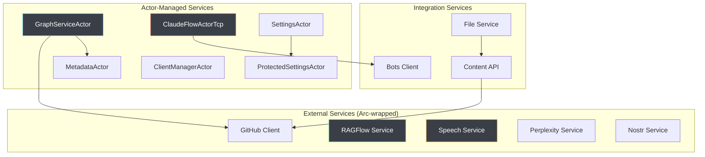

# Services Architecture

*[Server](../index.md)*

## Overview

The services layer provides core business logic, external integrations, and data processing capabilities. VisionFlow uses a hybrid architecture combining traditional services (Arc-wrapped) with actor-based state management for optimal performance and maintainability.

## Architecture Overview



## Core Service Categories

### 1. Actor-Based Services

Services implemented as Actix actors for maximum concurrency and fault tolerance.

#### GraphServiceActor
**Location**: `src/actors/graph_actor.rs`

**Responsibilities**:
- Dual graph physics simulation (knowledge + agents)
- Real-time position updates and broadcasting
- Graph structure management and validation
- Integration with GPU compute for acceleration

**Service Integration**:
```rust
impl GraphServiceActor {
    pub fn new(
        client_manager: Addr<ClientManagerActor>,
        gpu_compute: Option<Addr<GPUComputeActor>>,
        settings_actor: Addr<SettingsActor>,
        metadata_actor: Addr<MetadataActor>,
    ) -> Self {
        // Integrates multiple services for graph management
        Self {
            client_manager,
            gpu_compute,
            settings_actor,
            metadata_actor,
            graph_data: GraphData::default(),
            simulation_running: false,
        }
    }

    async fn update_from_metadata(&mut self) -> Result<(), String> {
        let metadata = self.metadata_actor.send(GetMetadata).await??;
        let new_graph = Self::build_graph_from_metadata(&metadata).await?;
        self.graph_data = new_graph;
        Ok(())
    }
}
```

#### EnhancedClaudeFlowActor
**Location**: `src/actors/claude_flow_actor_enhanced.rs`

**Responsibilities**:
- Real-time MCP integration with Claude Flow orchestrator
- Multi Agent management and telemetry streaming
- WebSocket connection management with automatic reconnection
- NO mock data - only real Claude Flow agent data

**MCP Integration**:
```rust
impl ClaudeFlowActorTcp {
    async fn connect_to_mcp(&mut self) -> Result<(), String> {
        let mcp_address = "localhost:9500";

        match self.websocket_client.connect(mcp_url).await {
            Ok(stream) => {
                info!("Connected to Claude Flow MCP on port 9500 (TCP)");
                self.start_telemetry_stream(stream).await;
                Ok(())
            }
            Err(e) => {
                warn!("MCP connection failed: {}, retrying...", e);
                Err(format!("MCP connection error: {}", e))
            }
        }
    }

    async fn initialize_multi-agent(&mut self, request: initializeMultiAgent) -> Result<multi-agentStatus, String> {
        let mcp_request = json!({
            "method": "multi-agent.initialize",
            "params": {
                "topology": request.topology,
                "max_agents": request.max_agents,
                "strategy": request.strategy,
                "agent_types": request.agent_types
            }
        });

        let response = self.send_mcp_request(mcp_request).await?;
        self.parse_multi-agent_response(response)
    }
}
```

### 2. External Integration Services

Traditional services wrapped in Arc for thread safety.

#### GitHub Service
**Location**: `src/services/github/mod.rs`

Provides GitHub repository integration for content synchronisation.

```rust
pub struct GitHubClient {
    client: reqwest::Client,
    config: GitHubConfig,
    rate_limiter: Arc<RwLock<RateLimiter>>,
}

impl GitHubClient {
    pub async fn new(
        config: GitHubConfig,
        settings: Arc<RwLock<AppFullSettings>>
    ) -> Result<Self, GitHubError> {
        let client = reqwest::Client::builder()
            .user_agent(&config.user_agent)
            .timeout(Duration::from_secs(30))
            .build()?;

        Ok(Self {
            client,
            config,
            rate_limiter: Arc::new(RwLock::new(RateLimiter::new())),
        })
    }

    pub async fn fetch_repository_content(&self) -> Result<Vec<ContentItem>, GitHubError> {
        let url = format!(
            "https://api.github.com/repos/{}/{}/contents/{}",
            self.config.owner, self.config.repo,
            self.config.base_path.as_deref().unwrap_or("")
        );

        let response = self.client.get(&url)
            .header("Authorization", format!("token {}", self.config.personal_access_token.as_ref().unwrap()))
            .send().await?;

        if response.status() == StatusCode::FORBIDDEN {
            return Err(GitHubError::RateLimit);
        }

        let items: Vec<ContentItem> = response.json().await?;
        Ok(items)
    }
}
```

**Content API Integration**:
```rust
pub struct ContentAPI {
    github_client: Arc<GitHubClient>,
}

impl ContentAPI {
    pub fn new(github_client: Arc<GitHubClient>) -> Self {
        Self { github_client }
    }

    pub async fn fetch_markdown_files(&self) -> Result<Vec<ProcessedFile>, ContentError> {
        let github_content = self.github_client.fetch_repository_content().await?;

        let mut processed_files = Vec::new();
        for item in github_content {
            if item.name.ends_with(".md") {
                let content = self.github_client.fetch_file_content(&item.download_url).await?;
                let processed = ProcessedFile {
                    name: item.name,
                    content,
                    size: item.size,
                    sha: item.sha,
                    last_modified: item.updated_at,
                };
                processed_files.push(processed);
            }
        }

        Ok(processed_files)
    }
}
```

#### RAGFlow Service
**Location**: `src/services/ragflow_service.rs`

AI chat service integration with streaming response support.

```rust
pub struct RAGFlowService {
    client: reqwest::Client,
    api_key: String,
    api_base_url: String,
}

impl RAGFlowService {
    pub async fn new(settings: Arc<RwLock<AppFullSettings>>) -> Result<Self, RAGFlowError> {
        let settings_read = settings.read().await;
        let ragflow_config = settings_read.ragflow.as_ref()
            .ok_or(RAGFlowError::ConfigMissing)?;

        let client = reqwest::Client::builder()
            .timeout(Duration::from_secs(60))
            .build()?;

        Ok(Self {
            client,
            api_key: ragflow_config.api_key.clone(),
            api_base_url: ragflow_config.api_base_url.clone(),
        })
    }

    pub async fn send_message(
        &self,
        request: RagflowChatRequest
    ) -> Result<RagflowChatResponse, RAGFlowError> {
        let url = format!("{}/api/v1/chat/completions", self.api_base_url);

        let payload = json!({
            "conversation_id": request.session_id.unwrap_or_else(|| "default".to_string()),
            "messages": [{"content": request.question}],
            "stream": request.stream.unwrap_or(false)
        });

        let response = self.client.post(&url)
            .header("Authorization", format!("Bearer {}", self.api_key))
            .json(&payload)
            .send().await?;

        if response.status().is_success() {
            let result: RagflowChatResponse = response.json().await?;
            Ok(result)
        } else {
            Err(RAGFlowError::RequestFailed(response.status()))
        }
    }

    pub async fn stream_message(
        &self,
        request: RagflowChatRequest
    ) -> Result<impl Stream<Item = Result<String, RAGFlowError>>, RAGFlowError> {
        // Streaming implementation for real-time responses
        let url = format!("{}/api/v1/chat/stream", self.api_base_url);

        let response = self.client.post(&url)
            .header("Authorization", format!("Bearer {}", self.api_key))
            .json(&request)
            .send().await?;

        let stream = response.bytes_stream()
            .map(|chunk| {
                chunk.map_err(RAGFlowError::from)
                    .and_then(|bytes| {
                        String::from_utf8(bytes.to_vec())
                            .map_err(|e| RAGFlowError::ParseError(e.to_string()))
                    })
            });

        Ok(stream)
    }
}
```

#### Speech Service
**Location**: `src/services/speech_service.rs`

Multi-provider STT/TTS processing with real-time audio streaming.

```rust
pub struct SpeechService {
    settings_addr: Addr<SettingsActor>,
    http_client: reqwest::Client,
    audio_broadcast_tx: broadcast::Sender<Vec<u8>>,
    command_tx: mpsc::Sender<SpeechCommand>,
}

impl SpeechService {
    pub fn new(
        settings_addr: Addr<SettingsActor>,
        audio_tx: broadcast::Sender<Vec<u8>>
    ) -> Self {
        let (command_tx, command_rx) = mpsc::channel(100);
        let client = reqwest::Client::new();

        let service = Self {
            settings_addr,
            http_client: client,
            audio_broadcast_tx: audio_tx,
            command_tx,
        };

        // Start background processing loop
        service.start_command_processor(command_rx);
        service
    }

    pub async fn process_stt_request(&self, audio_data: Vec<u8>) -> Result<String, SpeechError> {
        let settings = self.settings_addr.send(GetSettings).await??;

        match settings.openai.as_ref() {
            Some(openai_config) => {
                self.process_openai_stt(audio_data, &openai_config.api_key).await
            }
            None => Err(SpeechError::ConfigMissing("OpenAI API key".to_string()))
        }
    }

    async fn process_openai_stt(&self, audio_data: Vec<u8>, api_key: &str) -> Result<String, SpeechError> {
        let form = reqwest::multipart::Form::new()
            .part("file", reqwest::multipart::Part::bytes(audio_data)
                .file_name("audio.wav")
                .mime_str("audio/wav")?)
            .text("model", "whisper-1");

        let response = self.http_client
            .post("https://api.openai.com/v1/audio/transcriptions")
            .header("Authorization", format!("Bearer {}", api_key))
            .multipart(form)
            .send().await?;

        if response.status().is_success() {
            let result: serde_json::Value = response.json().await?;
            Ok(result["text"].as_str().unwrap_or("").to_string())
        } else {
            Err(SpeechError::APIError(response.status().to_string()))
        }
    }

    pub async fn process_tts_request(&self, text: String, options: TTSOptions) -> Result<(), SpeechError> {
        let audio_data = match options.provider {
            TTSProvider::OpenAI => self.process_openai_tts(text, options).await?,
            TTSProvider::Kokoro => self.process_kokoro_tts(text, options).await?,
        };

        // Broadcast audio to connected clients
        if let Err(e) = self.audio_broadcast_tx.send(audio_data) {
            warn!("Failed to broadcast TTS audio: {}", e);
        }

        Ok(())
    }
}
```

#### Perplexity Service
**Location**: `src/services/perplexity_service.rs`

Enhanced search and research capabilities.

```rust
pub struct PerplexityService {
    client: reqwest::Client,
    config: PerplexityConfig,
}

impl PerplexityService {
    pub fn new(config: PerplexityConfig) -> Self {
        let client = reqwest::Client::builder()
            .timeout(Duration::from_secs(30))
            .build()
            .unwrap();

        Self { client, config }
    }

    pub async fn query(&self, request: QueryRequest) -> Result<PerplexityResponse, PerplexityError> {
        let payload = json!({
            "model": request.model.unwrap_or_else(|| "pplx-7b-online".to_string()),
            "messages": [{"role": "user", "content": request.query}],
            "max_tokens": request.max_tokens.unwrap_or(1024),
            "temperature": request.temperature.unwrap_or(0.2)
        });

        let response = self.client
            .post("https://api.perplexity.ai/chat/completions")
            .header("Authorization", format!("Bearer {}", self.config.api_key))
            .json(&payload)
            .send().await?;

        if response.status().is_success() {
            let result: serde_json::Value = response.json().await?;
            let content = result["choices"][0]["message"]["content"]
                .as_str().unwrap_or("").to_string();

            Ok(PerplexityResponse {
                content,
                link: self.extract_source_link(&result),
            })
        } else {
            Err(PerplexityError::RequestFailed(response.status()))
        }
    }
}
```

#### Nostr Service
**Location**: `src/services/nostr_service.rs`

Decentralized authentication and identity management.

```rust
pub struct NostrService {
    config: NostrConfig,
    active_sessions: Arc<RwLock<HashMap<String, NostrSession>>>,
}

impl NostrService {
    pub fn new(config: NostrConfig) -> Self {
        Self {
            config,
            active_sessions: Arc::new(RwLock::new(HashMap::new())),
        }
    }

    pub async fn authenticate_user(&self, pubkey: &str, signature: &str) -> Result<NostrUser, NostrError> {
        // Verify signature against pubkey
        let is_valid = self.verify_signature(pubkey, signature)?;

        if is_valid {
            let user = NostrUser {
                pubkey: pubkey.to_string(),
                npub: self.pubkey_to_npub(pubkey)?,
                is_power_user: self.check_power_user_status(pubkey).await?,
                api_keys: None,
                user_settings_path: None,
            };

            // Store session
            let session_token = self.generate_session_token();
            self.store_session(session_token.clone(), pubkey.to_string()).await?;

            Ok(user)
        } else {
            Err(NostrError::InvalidSignature)
        }
    }

    async fn check_power_user_status(&self, pubkey: &str) -> Result<bool, NostrError> {
        // Check against configured power user list
        Ok(self.config.power_users.contains(pubkey))
    }
}
```

### 3. Integration Services

Services that bridge between different components.

#### File Service
**Location**: `src/services/file_service.rs`

Manages local file operations and orchestrates content fetching.

```rust
pub struct FileService;

impl FileService {
    pub async fn process_local_files(base_path: &str) -> Result<Vec<ProcessedFile>, FileServiceError> {
        let mut processed_files = Vec::new();
        let entries = tokio::fs::read_dir(base_path).await?;

        let mut entries = entries;
        while let Some(entry) = entries.next_entry().await? {
            let path = entry.path();
            if path.extension().and_then(|s| s.to_str()) == Some("md") {
                let content = tokio::fs::read_to_string(&path).await?;
                let metadata = entry.metadata().await?;

                processed_files.push(ProcessedFile {
                    name: path.file_name().unwrap().to_string_lossy().to_string(),
                    content,
                    size: metadata.len(),
                    sha: Self::calculate_sha1(&path).await?,
                    last_modified: metadata.modified()?.into(),
                });
            }
        }

        Ok(processed_files)
    }

    pub fn load_or_create_metadata() -> Result<MetadataStore, FileServiceError> {
        let metadata_path = "data/metadata/metadata.json";

        if Path::new(metadata_path).exists() {
            let content = std::fs::read_to_string(metadata_path)?;
            let metadata: MetadataStore = serde_json::from_str(&content)?;
            Ok(metadata)
        } else {
            // Create empty metadata store
            let empty_metadata = MetadataStore::new();
            Self::save_metadata(&empty_metadata)?;
            Ok(empty_metadata)
        }
    }

    pub fn save_metadata(metadata: &MetadataStore) -> Result<(), FileServiceError> {
        let metadata_path = "data/metadata/metadata.json";

        // Ensure directory exists
        if let Some(parent) = Path::new(metadata_path).parent() {
            std::fs::create_dir_all(parent)?;
        }

        let json = serde_json::to_string_pretty(metadata)?;
        std::fs::write(metadata_path, json)?;
        Ok(())
    }
}
```

#### Bots Client
**Location**: `src/services/bots_client.rs`

Handles Multi Agent orchestration data.

```rust
pub struct BotsClient {
    ws_client: Option<WebSocketStream<MaybeTlsStream<TcpStream>>>,
    reconnect_attempts: Arc<AtomicU32>,
}

impl BotsClient {
    pub fn new() -> Self {
        Self {
            ws_client: None,
            reconnect_attempts: Arc::new(AtomicU32::new(0)),
        }
    }

    pub async fn connect(&mut self, url: &str) -> Result<(), BotsClientError> {
        info!("Connecting to bots orchestrator at: {}", url);

        match connect_async(url).await {
            Ok((ws_stream, _)) => {
                self.ws_client = Some(ws_stream);
                self.reconnect_attempts.store(0, Ordering::Relaxed);
                info!("Successfully connected to bots orchestrator");
                Ok(())
            }
            Err(e) => {
                let attempts = self.reconnect_attempts.fetch_add(1, Ordering::Relaxed);
                warn!("Failed to connect to bots orchestrator (attempt {}): {}", attempts + 1, e);
                Err(BotsClientError::ConnectionFailed(e.to_string()))
            }
        }
    }

    pub async fn send_message(&mut self, message: serde_json::Value) -> Result<(), BotsClientError> {
        if let Some(ws) = &mut self.ws_client {
            let msg = Message::Text(message.to_string());
            ws.send(msg).await.map_err(|e| BotsClientError::SendFailed(e.to_string()))?;
            Ok(())
        } else {
            Err(BotsClientError::NotConnected)
        }
    }
}
```

## Service Communication Patterns

### Actor-Service Integration

Services communicate with actors through message passing:

```rust
// Example: GraphServiceActor using external services
impl Handler<UpdateFromGitHub> for GraphServiceActor {
    type Result = ResponseActFuture<Self, Result<(), String>>;

    fn handle(&mut self, _: UpdateFromGitHub, _: &mut Self::Context) -> Self::Result {
        let github_client = self.github_client.clone();
        let content_api = self.content_api.clone();

        Box::pin(async move {
            // Use external services
            let files = content_api.fetch_markdown_files().await
                .map_err(|e| format!("GitHub fetch failed: {}", e))?;

            // Process files and update graph
            let metadata = Self::process_files_to_metadata(files);
            self.update_graph_from_metadata(metadata).await?;

            Ok(())
        }.into_actor(self))
    }
}
```

### Service Error Propagation

Consistent error handling across all services:

```rust
// Unified error handling pattern
#[derive(Debug, thiserror::Error)]
pub enum ServiceError {
    #[error("IO error: {0}")]
    IO(#[from] std::io::Error),

    #[error("HTTP error: {0}")]
    HTTP(#[from] reqwest::Error),

    #[error("JSON parsing error: {0}")]
    JSON(#[from] serde_json::Error),

    #[error("Actor mailbox error: {0}")]
    ActorMailbox(#[from] MailboxError),

    #[error("Configuration error: {0}")]
    Config(String),

    #[error("External service error: {0}")]
    External(String),
}

// Each service implements From<ServiceSpecificError> for ServiceError
impl From<GitHubError> for ServiceError {
    fn from(err: GitHubError) -> Self {
        ServiceError::External(format!("GitHub: {}", err))
    }
}
```

## Performance Optimisation

### Service Caching

```rust
pub struct CachedService<T> {
    inner: Arc<T>,
    cache: Arc<RwLock<HashMap<String, (Instant, serde_json::Value)>>>,
    cache_ttl: Duration,
}

impl<T> CachedService<T> {
    pub fn new(service: T, cache_ttl: Duration) -> Self {
        Self {
            inner: Arc::new(service),
            cache: Arc::new(RwLock::new(HashMap::new())),
            cache_ttl,
        }
    }

    pub async fn cached_request<F, R>(&self, key: String, request: F) -> Result<R, ServiceError>
    where
        F: Future<Output = Result<R, ServiceError>>,
        R: Serialize + for<'de> Deserialize<'de>,
    {
        // Check cache first
        {
            let cache = self.cache.read().await;
            if let Some((timestamp, value)) = cache.get(&key) {
                if timestamp.elapsed() < self.cache_ttl {
                    return Ok(serde_json::from_value(value.clone())?);
                }
            }
        }

        // Execute request and cache result
        let result = request.await?;
        let serialized = serde_json::to_value(&result)?;

        {
            let mut cache = self.cache.write().await;
            cache.insert(key, (Instant::now(), serialized));
        }

        Ok(result)
    }
}
```

### Connection Pooling

```rust
pub struct ServicePool<T> {
    services: Vec<Arc<T>>,
    current_index: AtomicUsize,
}

impl<T> ServicePool<T> {
    pub fn new(services: Vec<T>) -> Self {
        Self {
            services: services.into_iter().map(Arc::new).collect(),
            current_index: AtomicUsize::new(0),
        }
    }

    pub fn get_service(&self) -> Arc<T> {
        let index = self.current_index.fetch_add(1, Ordering::Relaxed) % self.services.len();
        self.services[index].clone()
    }
}
```

## Service Configuration

Services are configured through the settings system:

```yaml
# settings.yaml
github:
  owner: "your-org"
  repo: "knowledge-base"
  branch: "main"
  personal_access_token: "${GITHUB_TOKEN}"
  base_path: "docs"
  user_agent: "VisionFlow/1.0"

ragflow:
  api_key: "${RAGFLOW_API_KEY}"
  api_base_url: "https://api.ragflow.io"
  timeout_seconds: 60

speech:
  openai:
    api_key: "${OPENAI_API_KEY}"
    model: "whisper-1"
  kokoro:
    enabled: true
    voice_id: "default"

perplexity:
  api_key: "${PERPLEXITY_API_KEY}"
  default_model: "pplx-7b-online"
  max_tokens: 1024

nostr:
  enabled: true
  power_users:
    - "npub1234..." # Add power user pubkeys
```

## Monitoring & Health Checks

```rust
// Health check implementation for each service
#[async_trait]
pub trait HealthCheck {
    async fn health_check(&self) -> HealthStatus;
}

impl HealthCheck for RAGFlowService {
    async fn health_check(&self) -> HealthStatus {
        match self.client.get(&format!("{}/health", self.api_base_url))
            .timeout(Duration::from_secs(5))
            .send().await
        {
            Ok(response) if response.status().is_success() => HealthStatus::Healthy,
            Ok(_) => HealthStatus::Degraded("Non-200 response".to_string()),
            Err(e) => HealthStatus::Unhealthy(e.to_string()),
        }
    }
}

// Aggregate health endpoint
pub async fn get_service_health(app_state: &AppState) -> ServiceHealthReport {
    let mut report = ServiceHealthReport::new();

    if let Some(ragflow) = &app_state.ragflow_service {
        report.ragflow = ragflow.health_check().await;
    }

    report.github = app_state.github_client.health_check().await;
    report.speech = app_state.speech_service.as_ref()
        .map(|s| s.health_check())
        .unwrap_or(HealthStatus::NotConfigured);

    report
}
```

## Error Recovery & Resilience

### Automatic Retry with Exponential Backoff

```rust
pub async fn retry_with_backoff<F, Fut, T, E>(
    mut operation: F,
    max_retries: u32,
    base_delay: Duration,
) -> Result<T, E>
where
    F: FnMut() -> Fut,
    Fut: Future<Output = Result<T, E>>,
    E: std::fmt::Debug,
{
    let mut delay = base_delay;

    for attempt in 0..=max_retries {
        match operation().await {
            Ok(result) => return Ok(result),
            Err(e) if attempt == max_retries => return Err(e),
            Err(e) => {
                warn!("Attempt {} failed: {:?}, retrying in {:?}", attempt + 1, e, delay);
                tokio::time::sleep(delay).await;
                delay = Duration::from_millis((delay.as_millis() as f64 * 1.5) as u64);
            }
        }
    }

    unreachable!()
}
```

### Circuit Breaker Pattern

```rust
pub struct CircuitBreaker {
    state: Arc<RwLock<CircuitBreakerState>>,
    failure_threshold: u32,
    recovery_timeout: Duration,
}

#[derive(Debug)]
enum CircuitBreakerState {
    Closed { failure_count: u32 },
    Open { last_failure: Instant },
    HalfOpen,
}

impl CircuitBreaker {
    pub async fn call<F, Fut, T, E>(&self, operation: F) -> Result<T, CircuitBreakerError<E>>
    where
        F: FnOnce() -> Fut,
        Fut: Future<Output = Result<T, E>>,
    {
        let can_proceed = {
            let mut state = self.state.write().await;
            match *state {
                CircuitBreakerState::Closed { .. } => true,
                CircuitBreakerState::Open { last_failure } => {
                    if last_failure.elapsed() > self.recovery_timeout {
                        *state = CircuitBreakerState::HalfOpen;
                        true
                    } else {
                        false
                    }
                }
                CircuitBreakerState::HalfOpen => true,
            }
        };

        if !can_proceed {
            return Err(CircuitBreakerError::Open);
        }

        match operation().await {
            Ok(result) => {
                let mut state = self.state.write().await;
                *state = CircuitBreakerState::Closed { failure_count: 0 };
                Ok(result)
            }
            Err(e) => {
                let mut state = self.state.write().await;
                match *state {
                    CircuitBreakerState::Closed { failure_count } => {
                        let new_count = failure_count + 1;
                        if new_count >= self.failure_threshold {
                            *state = CircuitBreakerState::Open {
                                last_failure: Instant::now()
                            };
                        } else {
                            *state = CircuitBreakerState::Closed {
                                failure_count: new_count
                            };
                        }
                    }
                    CircuitBreakerState::HalfOpen => {
                        *state = CircuitBreakerState::Open {
                            last_failure: Instant::now()
                        };
                    }
                    _ => {}
                }
                Err(CircuitBreakerError::ServiceError(e))
            }
        }
    }
}
```

## Related Documentation

- **[Actor System](actors.md)** - Actor-based service coordination
- **[Request Handlers](handlers.md)** - HTTP/WebSocket API endpoints
- **[Types & Models](types.md)** - Service data structures
- **[Configuration](config.md)** - Service configuration management
- **[External APIs](../api/)** - Integration specifications