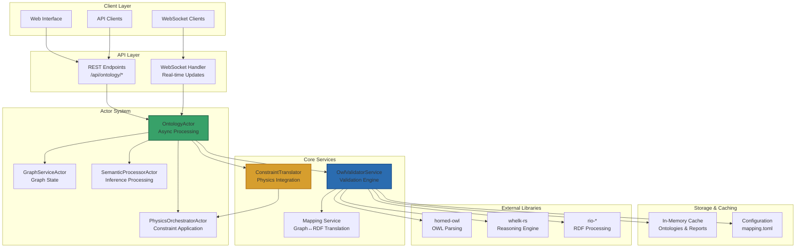
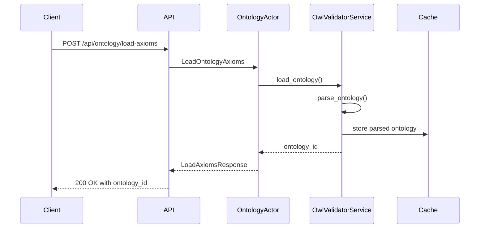
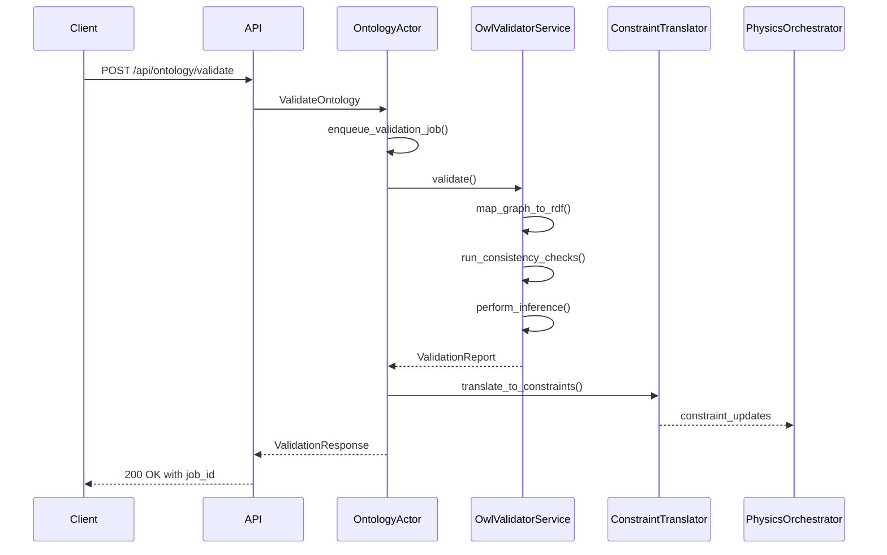
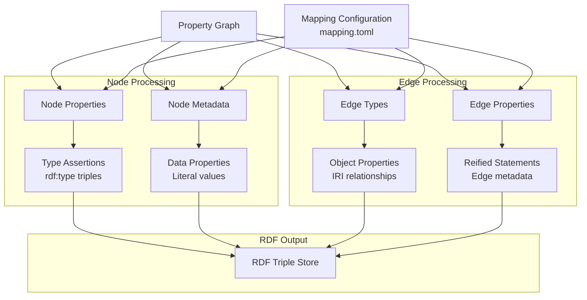

# Ontology System Overview

## Table of Contents
- [Introduction](#introduction)
- [System Architecture](#system-architecture)
- [Core Components](#core-components)
- [Data Flow](#data-flow)
- [Integration Points](#integration-points)
- [Feature Capabilities](#feature-capabilities)
- [Performance Characteristics](#performance-characteristics)
- [Technology Stack](#technology-stack)

## Introduction

The Ontology System provides a formal validation and logical inference layer for the WebXR knowledge graph, acting as a "truth engine." It combines the flexibility of property graphs with the formal rigor of OWL/RDF semantics to ensure logical consistency and enable automated knowledge discovery.

### Key Benefits

- **Logical Consistency**: Prevents inconsistencies through formal validation
- **Knowledge Discovery**: Infers new relationships from existing data and rules
- **Semantic Physics**: Translates logical constraints into physical forces for intuitive visualization
- **Data Quality**: Provides diagnostics and fixes for data integrity issues
- **Incremental Processing**: Supports efficient updates without full recomputation

## System Architecture



## Core Components

### 1. OntologyActor
**Location**: `src/actors/ontology_actor.rs`

The central coordinator for all ontology operations, handling:
- Asynchronous validation jobs with priority queuing
- Caching and incremental processing
- Actor communication and coordination
- Health monitoring and performance metrics

**Key Features**:
- Job queue with priority levels (Critical, High, Normal, Low)
- LRU cache for validation reports
- Backpressure handling for resource management
- Integration with physics and semantic processors

### 2. OwlValidatorService
**Location**: `src/services/owl_validator.rs`

The core validation engine that:
- Loads and parses OWL ontologies from various sources
- Maps property graphs to RDF triples
- Performs consistency checking and logical reasoning
- Generates comprehensive validation reports

**Validation Types**:
- **Domain/Range Validation**: Ensures properties are used correctly
- **Disjoint Class Checking**: Prevents logical contradictions
- **Cardinality Constraints**: Validates property usage limits
- **Inference Generation**: Discovers implicit relationships

### 3. Constraint Translator
**Location**: `src/physics/ontology_constraints.rs`

Bridges semantic logic and physics simulation by:
- Converting OWL axioms to physics constraints
- Translating inference results to dynamic forces
- Organizing constraints into logical groups
- Providing configurable constraint strengths

**Translation Mappings**:
| OWL Axiom | Physics Constraint | Visual Effect |
|-----------|-------------------|---------------|
| DisjointClasses(A,B) | Separation force | Push instances apart |
| SubClassOf(A,B) | Hierarchical alignment | Group A near B |
| InverseOf(P,Q) | Bidirectional edges | Symmetric relationships |
| SameAs(a,b) | Co-location force | Pull entities together |
| FunctionalProperty(P) | Cardinality boundaries | Limit connections |

### 4. API Handler
**Location**: `src/handlers/api_handler/ontology/mod.rs`

Provides comprehensive REST and WebSocket APIs for:
- Loading ontology axioms from files/URLs
- Configuring validation parameters
- Running validation jobs (quick/full/incremental)
- Retrieving reports and applying inferences
- Real-time progress updates

## Data Flow

### 1. Ontology Loading


### 2. Validation Process


### 3. Graph to RDF Mapping


## Integration Points

### Actor System Integration
The ontology system integrates seamlessly with the existing actor ecosystem:

- **GraphServiceActor**: Provides graph data for validation
- **PhysicsOrchestratorActor**: Receives ontology-derived constraints
- **SemanticProcessorActor**: Processes inference results
- **Message Bus**: Coordinates communication between actors

### Physics Engine Integration
Ontology constraints are translated into physics forces:

```rust
// Example constraint group generation
pub enum OntologyConstraintGroup {
    OntologySeparation,    // Disjoint classes
    OntologyAlignment,     // Hierarchical relationships
    OntologyBoundaries,    // Cardinality limits
    OntologyIdentity,      // Same-as relationships
}
```

### Feature Flag Integration
The system respects the analytics feature flag system:

```rust
pub struct FeatureFlags {
    pub ontology_validation: bool,
    // ... other flags
}
```

## Feature Capabilities

### Validation Modes

1. **Quick Validation** (< 100ms)
   - Basic consistency checks
   - Domain/range validation
   - Minimal inference

2. **Full Validation** (< 5s)
   - Complete consistency analysis
   - Full inference generation
   - Comprehensive reporting

3. **Incremental Validation** (< 50ms)
   - Delta-based updates
   - Cached intermediate results
   - Optimized for frequent changes

### Caching Strategy

The system employs multi-level caching:

- **Ontology Cache**: Parsed OWL structures with TTL
- **Validation Cache**: Reports keyed by graph signature
- **Node Type Cache**: Accelerated type lookups
- **Constraint Cache**: Pre-computed physics constraints

### Error Handling

Comprehensive error reporting with:
- Violation descriptions and locations
- Suggested fixes with examples
- Confidence scores for recommendations
- Actionable resolution steps

## Performance Characteristics

### Scalability Metrics
- **Small Graphs** (< 1k nodes): < 50ms validation
- **Medium Graphs** (1k-10k nodes): < 500ms validation
- **Large Graphs** (10k+ nodes): Background processing with progress updates

### Memory Usage
- **Base overhead**: ~50MB for reasoner components
- **Per-ontology**: ~5-20MB depending on axiom complexity
- **Cache overhead**: ~10KB per validation report
- **Constraint overhead**: ~1KB per generated constraint

### Optimization Features
- **Graph signatures**: Blake3 hashing for change detection
- **Incremental reasoning**: Delta processing for updates
- **Lazy loading**: On-demand ontology parsing
- **Background processing**: Non-blocking validation jobs

## Technology Stack

### Core Dependencies
- **horned-owl**: OWL parsing and manipulation
- **whelk-rs**: High-performance reasoning engine
- **rio-turtle**: RDF/Turtle format support
- **rio-api**: RDF processing abstractions
- **sophia**: Additional RDF handling utilities

### Optional Dependencies
- **oxigraph**: SPARQL query support (feature-gated)
- **blake3**: Fast hashing for signatures
- **dashmap**: Concurrent hash maps for caching

### Rust Ecosystem Integration
- **actix**: Actor system and web framework
- **tokio**: Async runtime for non-blocking operations
- **serde**: Serialization for API communication
- **chrono**: Timestamp handling for reports

## Configuration

The system uses a declarative mapping configuration in `mapping.toml`:

```toml
[global]
base_iri = "https://example.org/graph#"
default_class = "ex:Thing"

[classes.node_type]
"person" = "ex:Person"
"company" = "ex:Company"
"file" = "ex:File"

[properties.edge_type]
"employs" = "ex:employs"
"knows" = "foaf:knows"

[inverses]
"ex:employs" = "ex:worksFor"
"foaf:knows" = "foaf:knows"  # symmetric

[templates]
node_iri = "ex:node/{id}"
edge_iri = "ex:edge/{source}-{target}"
```

This mapping provides flexible translation between the property graph model and formal RDF semantics, enabling powerful reasoning while maintaining usability.