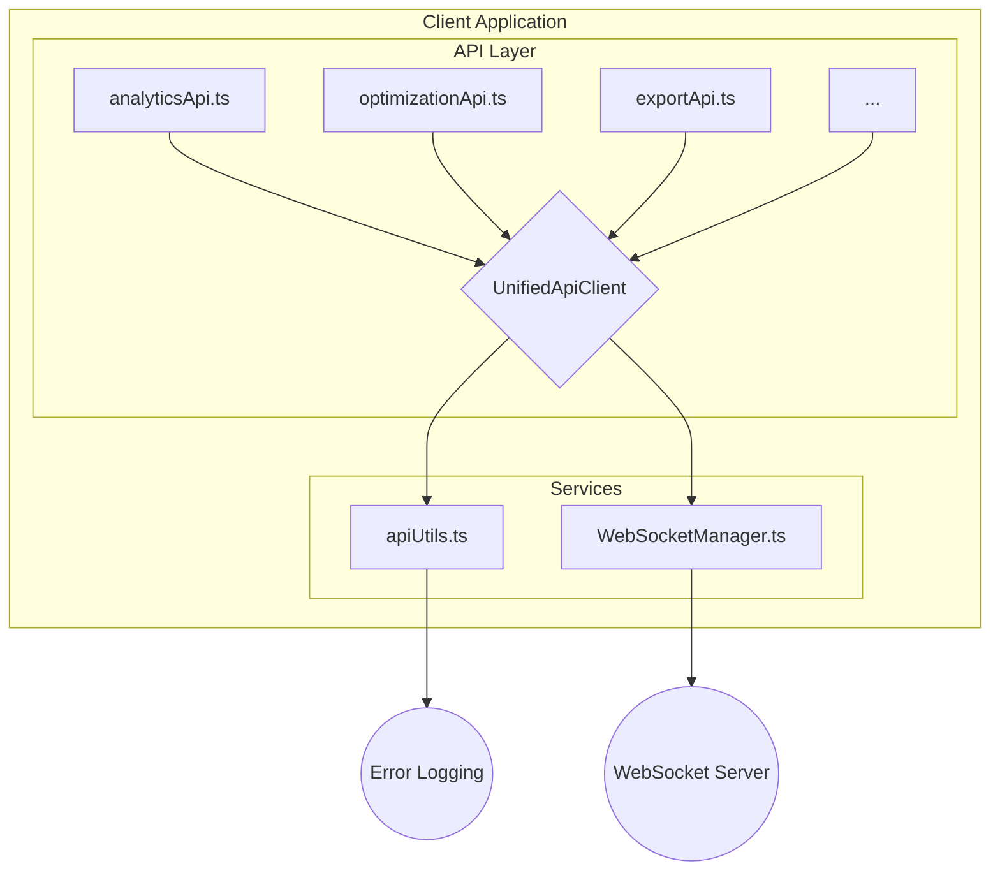

# Client Code Audit and Refactor Guide

This document outlines a high-level plan for a swarm of coding agents to audit and refactor the `client/` directory. The primary goals are to standardize API communication, address the disabled testing infrastructure, and perform a general code cleanup.

## Phase 1: API Layer Refactoring

**Goal**: Standardize and harden the client-side API layer by centralizing error handling and WebSocket logic.

### Task 1.1: Centralize API Error Handling

1.  **Create a new utility file** at `client/src/api/apiUtils.ts`.
2.  **Define a custom `ApiError` class** that extends the base `Error` class.
3.  **Create a `handleApiError` function** to centralize error logging and user notification.
4.  **Refactor all API clients** in `client/src/api/` to use this new utility, removing redundant `try/catch` blocks.

### Task 1.2: Consolidate WebSocket Logic

1.  **Create a new `WebSocketManager.ts`** in `client/src/services/` to manage all WebSocket connections, subscriptions, and message handling.
2.  **Refactor `analyticsApi.ts` and `optimizationApi.ts`** to use this new manager, removing duplicate WebSocket code.

### Target Architecture

## Phase 2: Security and Testing

**Goal**: Investigate and address the disabled testing infrastructure to improve code quality and reduce risk.

### Task 2.1: Investigate Disabled Testing

1.  **Locate and analyze the `SECURITY_ALERT.md` file** to understand the context of the "supply chain attack."
2.  **Based on the findings, propose a plan to re-enable testing** in a secure manner. This may involve:
    *   Upgrading vulnerable dependencies.
    *   Using a private npm registry.
    *   Implementing a more robust security scanning process.

## Phase 3: Code Cleanup and Modernization

**Goal**: Remove legacy code and ensure consistency across the codebase.

### Task 3.1: General Code Cleanup

1.  **Remove any `.backup` files** or large, commented-out blocks of code.
2.  **Investigate the use of both `@react-three/fiber` and `@babylonjs/core`** to determine if one can be deprecated.
3.  **Review the `services` directory** to ensure consistent use of the `UnifiedApiClient`.