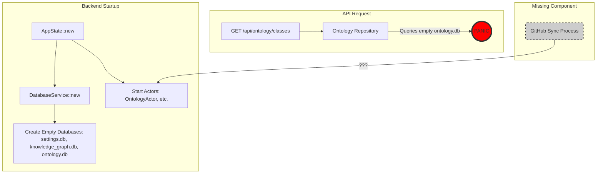
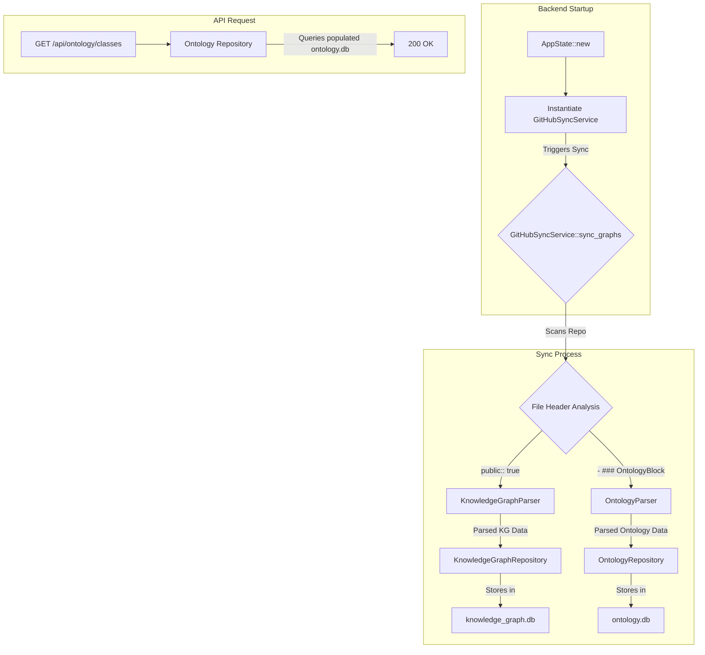

# Comprehensive Re-engineering Plan: VisionFlow Backend

**Version**: 1.0
**Date**: 2025-10-25
**Author**: Roo, Technical Leader

## 1. Executive Summary

This document outlines a comprehensive plan to re-engineer the VisionFlow backend to resolve critical stability, performance, and architectural issues. The backend is currently in a crash loop due to a series of interconnected problems stemming from an incomplete and flawed data ingestion pipeline, coupled with significant technical debt from previous development cycles.

The core problem is a failure to populate the `ontology.db` and `knowledge_graph.db` databases on startup, leading to panics and crashes when API endpoints are accessed. This is compounded by an incomplete migration to a CQRS pattern, the use of an outdated settings handler, and a severe performance bottleneck in the graph database.

This plan details a new, robust dual-graph ingestion architecture, a full todo list for implementation, a strategy for cleaning up technical debt, and a comprehensive validation plan to ensure the final system is stable, performant, and reliable.

## 2. Problem Context & History

The primary symptom has been the `rust-backend` process entering a `SIGKILL` crash loop, observed in `supervisord.log`. This manifested as "Empty reply from server" for most API endpoints.

### 2.1. Initial Investigations & Misleading Paths

Several investigations were conducted, revealing a complex web of issues:

1.  **Hypothesis 1: Nested Tokio Runtime (Partially Correct)**
    - **Finding**: The initial `SIGKILL` crashes were correctly attributed to creating a new Tokio `Runtime::new()` inside a `spawn_blocking` context, which is an illegal operation.
    - **Action Taken**: A fix was applied, replacing `Runtime::new()` with `Handle::current()` in the settings module.
    - **Outcome**: This fixed the `/api/config` endpoint but did not resolve the overall crash loop, indicating it was only one part of the problem. This partial fix introduced confusion, as it suggested the CQRS pattern itself was flawed.

2.  **Hypothesis 2: Incomplete CQRS Migration**
    - **Finding**: The codebase contains a mix of a modern CQRS pattern and a legacy actor-based system. The `/api/settings/*` endpoints were still using the old, buggy actor system.
    - **Tech Debt**: This dual system makes the codebase difficult to understand and maintain. The `execute_in_thread` wrapper was a workaround for the underlying async issues, adding another layer of complexity.

3.  **Hypothesis 3: Outdated Settings Handler**
    - **Finding**: The active `settings_handler.rs` (3532 lines) is a legacy, pre-CQRS version. A correct, modern CQRS version exists as `settings_handler.rs.cqrs_backup` (654 lines).
    - **Tech Debt**: The wrong file is being used in production, leading to architectural conflicts and unpredictable behavior.

### 2.2. The True Root Cause: A Missing Data Pipeline

The final and correct analysis revealed the core issue: **the application has no automated process to ingest data from GitHub into its databases on startup.**

- The `ontology.db` and `knowledge_graph.db` are created with the correct schema, but they remain **empty**.
- The crash occurs when an API endpoint triggers a repository method that panics when it queries an empty database (e.g., via `.unwrap()` or `.expect()`).
- The data ingestion is supposed to be triggered manually via an API call, a fact that was not documented and led to the crashes in a fresh environment.

Furthermore, the ingestion logic itself was found to be completely missing, and the initial understanding of a single data source was incorrect. There are **two distinct data sources** that need to be processed differently.

## 3. System Overview & Affected Components

The re-engineering process will touch multiple layers of the application.

### 3.1. Data Flow Diagram (Current, Broken State)



### 3.2. Key Files & Modules to be Modified or Created:

-   **New Services**:
    -   `src/services/github_sync_service.rs` (New)
    -   `src/services/parsers/knowledge_graph_parser.rs` (New)
    -   `src/services/parsers/ontology_parser.rs` (New)
-   **Core Application State**:
    -   `src/app_state.rs` (Integration of new service)
-   **GitHub API**:
    -   `src/services/github/content_enhanced.rs` (Enhancements for directory listing)
-   **Database Repositories (Code Hardening)**:
    -   `src/adapters/sqlite_ontology_repository.rs`
    -   `src/adapters/sqlite_knowledge_graph_repository.rs`
-   **API Handlers (Tech Debt Cleanup)**:
    -   `src/handlers/settings_handler.rs` (Replace with backup)
-   **Legacy Actors (Removal)**:
    -   `src/actors/optimized_settings_actor.rs`

## 4. Corrected Architecture: Dual-Graph Ingestion Pipeline

The new architecture will introduce a dedicated `GitHubSyncService` responsible for orchestrating the data ingestion process at startup.

### 4.1. Data Flow Diagram (Corrected State)



## 5. Full Re-engineering Todo List

This is the master checklist for the implementation phase.

### Phase 1: Implement Data Ingestion Pipeline

-   [ ] **Task 1.1**: Create new file `src/services/github_sync_service.rs`.
-   [ ] **Task 1.2**: Implement the `GitHubSyncService` struct and its `sync_graphs` orchestration logic.
-   [ ] **Task 1.3**: Create new directory `src/services/parsers/`.
-   [ ] **Task 1.4**: Create `src/services/parsers/knowledge_graph_parser.rs` and implement the parsing logic for `public:: true` files.
-   [ ] **Task 1.5**: Create `src/services/parsers/ontology_parser.rs` and implement the parsing logic for `- ### OntologyBlock` files.
-   [ ] **Task 1.6**: Modify `src/services/github/content_enhanced.rs` to add a function for recursively listing directory contents.
-   [ ] **Task 1.7**: Modify `src/app_state.rs` to instantiate `GitHubSyncService` and trigger `sync_graphs` on startup.

### Phase 2: Harden Database Repositories

-   [ ] **Task 2.1**: Refactor `src/adapters/sqlite_ontology_repository.rs` to remove all `.unwrap()` and `.expect()` calls, replacing them with `Result` propagation.
-   [ ] **Task 2.2**: Refactor `src/adapters/sqlite_knowledge_graph_repository.rs` to remove all `.unwrap()` and `.expect()` calls.

### Phase 3: Eliminate Technical Debt

-   [ ] **Task 3.1**: **Backup and Replace**:
    -   [ ] Copy `src/handlers/settings_handler.rs` to `src/handlers/settings_handler.rs.legacy_backup`.
    -   [ ] Copy `src/handlers/settings_handler.rs.cqrs_backup` to `src/handlers/settings_handler.rs`.
-   [ ] **Task 3.2**: **Remove Legacy Actor**:
    -   [ ] Delete the file `src/actors/optimized_settings_actor.rs`.
    -   [ ] Remove all references to `OptimizedSettingsActor` and `settings_addr` from `src/app_state.rs`.
-   [ ] **Task 3.3**: **Update API Handlers**:
    -   [ ] Search the codebase for any remaining usages of the legacy actor pattern (`state.settings_addr.send(...)`) and refactor them to use the CQRS pattern with the `SettingsRepository`.

### Phase 4: Resolve Performance Bottleneck

-   [ ] **Task 4.1**: Investigate the `load_graph` function in `src/adapters/sqlite_knowledge_graph_repository.rs`.
-   [ ] **Task 4.2**: Implement pagination or a streaming response for the `/api/graph/data` endpoint to handle large graphs without timing out.
-   [ ] **Task 4.3**: Add appropriate database indexes to `knowledge_graph.db` to optimize query performance.

## 6. Comprehensive Validation Plan

This plan must be executed in full after the re-engineering work is complete.

### Step 1: Full System Rebuild

use your docker management skill to rebuild, restart, and examine the docker containing webxr which is outside of this docker context in the host.
    ```
    - **Success Criteria**: The `rust-backend` starts and remains in a `RUNNING` state without entering a crash loop. Logs should indicate the successful completion of the GitHub sync process.

### Step 2: Database Verification

1.  **Access the Container**:
    ```bash
    docker exec -it visionflow_container /bin/bash
    ```
2.  **Install SQLite Client**:
    ```bash
    apt-get update && apt-get install -y sqlite3
    ```
3.  **Verify Knowledge Graph DB**:
    ```bash
    sqlite3 data/knowledge_graph.db "SELECT count(*) FROM nodes;"
    ```
    - **Success Criteria**: The command should return a number greater than zero.
4.  **Verify Ontology DB**:
    ```bash
    sqlite3 data/ontology.db "SELECT count(*) FROM owl_classes;"
    ```
    - **Success Criteria**: The command should return a number greater than zero.

### Step 3: API Endpoint Testing

- **Success Criteria**: All commands should return an HTTP `200 OK` status.

1.  **Health Endpoint**:
    ```bash
    curl -i http://localhost:4000/api/health
    ```
2.  **Config Endpoint**:
    ```bash
    curl -i http://localhost:4000/api/config
    ```
3.  **Ontology Endpoint**:
    ```bash
    curl -i http://localhost:4000/api/ontology/classes
    ```
4.  **Graph Data Endpoint**:
    ```bash
    curl -i --max-time 10 http://localhost:4000/api/graph/data
    ```
    - **Note**: This should now return within 10 seconds.
5.  **Settings Endpoint (Post-Refactor)**:
    ```bash
    curl -i http://localhost:4000/api/settings/path?path=version
    ```

you can also use the chrome devtools mcp local instance to open http://192.168.0.51:3001 checking the full end to end front end of the system against the back end logs

### Step 4: Settings Management System Verification

1.  **Verify Settings API**: Test the primary settings endpoints to ensure the new CQRS handler is working correctly.
2.  **UI Test (Manual)**: If a UI is connected, manually navigate to the settings page and attempt to change a setting. Verify that the change is persisted across a backend restart.