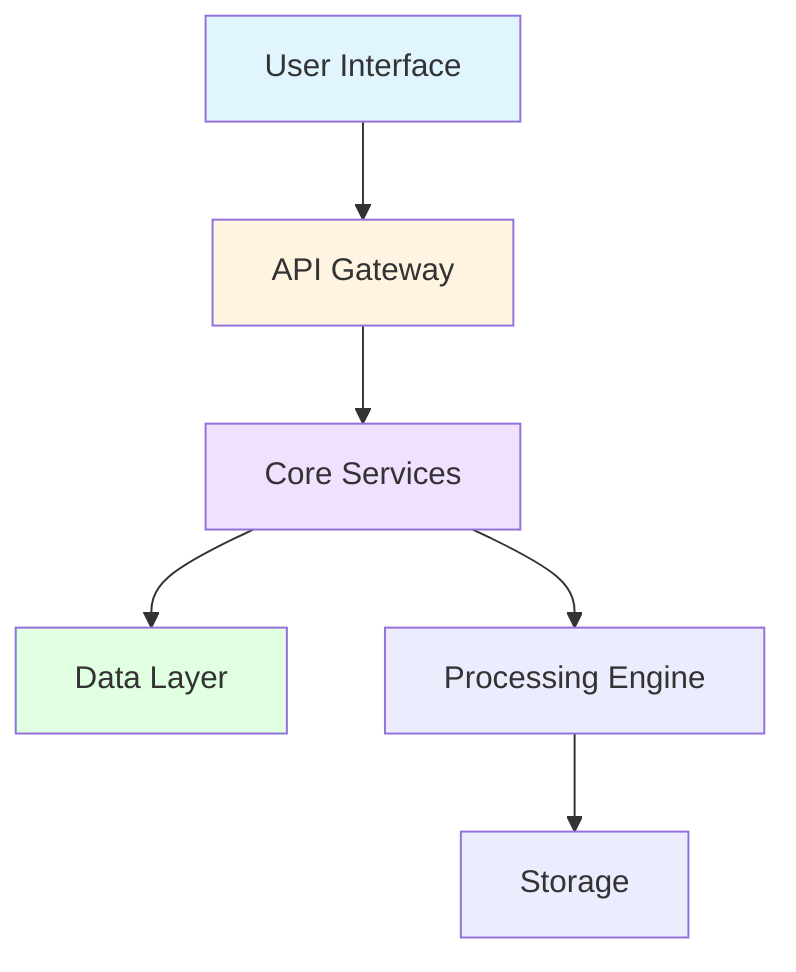

# Getting Started with VisionFlow

## Welcome to VisionFlow

VisionFlow is [brief description of what VisionFlow does and its primary purpose].

## Who Should Use This Guide

This guide is designed for:
- End users looking to get started quickly
- System administrators deploying VisionFlow
- Anyone new to VisionFlow's capabilities

## Prerequisites

Before you begin, ensure you have:
- **Operating System**: [Supported OS versions]
- **Hardware Requirements**:
  - CPU: [Minimum specifications]
  - RAM: [Minimum memory]
  - Storage: [Required disk space]
- **Software Dependencies**:
  - [Dependency 1]: Version X.X or higher
  - [Dependency 2]: Version Y.Y or higher
  - [Dependency 3]: Version Z.Z or higher

## Quick Start

### Option 1: Docker (Recommended)

The fastest way to get VisionFlow running:

```bash
# Pull the latest image
docker pull visionflow/visionflow:latest

# Run the container
docker run -d \
  --name visionflow \
  -p 8080:8080 \
  -p 9090:9090 \
  visionflow/visionflow:latest
```

Access VisionFlow at: `http://localhost:8080`

### Option 2: Manual Installation

For custom installations or development:

1. **Clone the Repository**
   ```bash
   git clone https://github.com/your-org/visionflow.git
   cd visionflow
   ```

2. **Install Dependencies**
   ```bash
   # [Package manager specific commands]
   npm install
   # or
   pip install -r requirements.txt
   ```

3. **Configure Environment**
   ```bash
   cp .env.example .env
   # Edit .env with your settings
   ```

4. **Start the Application**
   ```bash
   npm start
   # or
   python main.py
   ```

## First Steps After Installation

### 1. Access the Dashboard

Navigate to `http://localhost:8080` in your web browser.

### 2. Initial Configuration

Complete the setup wizard:
- [ ] Set administrator credentials
- [ ] Configure system settings
- [ ] Set up network connectivity
- [ ] Review security settings

### 3. Verify Installation

Run the health check:

```bash
curl http://localhost:8080/health
```

Expected response:
```json
{
  "status": "healthy",
  "version": "x.x.x",
  "uptime": "..."
}
```

## What's Next?

- **[Installation Guide](./02-installation.md)**: Detailed installation instructions
- **[Basic Usage](./03-basic-usage.md)**: Learn core features
- **[Features Overview](./04-features-overview.md)**: Explore all capabilities
- **[Troubleshooting](./05-troubleshooting.md)**: Common issues and solutions

## Getting Help

- **Documentation**: [Link to full documentation]
- **Community Forum**: [Forum URL]
- **Issue Tracker**: [GitHub Issues URL]
- **Support Email**: support@visionflow.example

## System Architecture Overview



## License

VisionFlow is released under [License Type]. See [LICENSE](../../LICENSE) for details.
