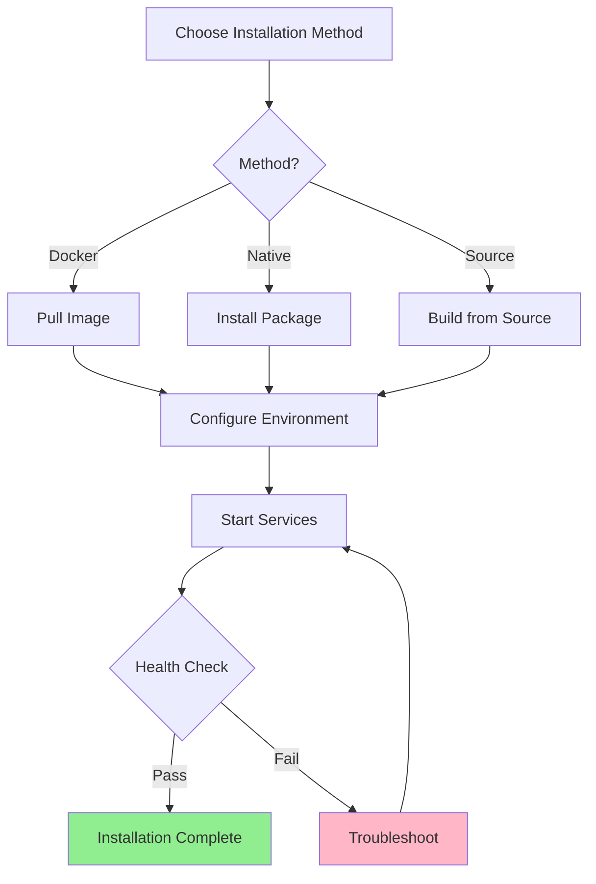

# Installation Guide

## Overview

This guide covers all installation methods for VisionFlow, from simple Docker deployments to advanced custom installations.

## System Requirements

### Minimum Requirements

| Component | Requirement |
|-----------|-------------|
| **CPU** | 2 cores, 2.0 GHz |
| **RAM** | 4 GB |
| **Storage** | 20 GB available space |
| **Network** | Broadband internet connection |
| **OS** | Ubuntu 20.04+, Debian 11+, CentOS 8+, macOS 11+, Windows 10+ |

### Recommended Requirements

| Component | Requirement |
|-----------|-------------|
| **CPU** | 4+ cores, 3.0 GHz |
| **RAM** | 8 GB+ |
| **Storage** | 50 GB+ SSD |
| **Network** | Gigabit ethernet |
| **GPU** | [Optional: for accelerated processing] |

## Installation Methods

### Method 1: Docker Installation (Recommended)

#### Prerequisites
- Docker 20.10+ installed
- Docker Compose 1.29+ installed

#### Installation Steps

1. **Create Project Directory**
   ```bash
   mkdir visionflow && cd visionflow
   ```

2. **Download Docker Compose File**
   ```bash
   curl -O https://raw.githubusercontent.com/your-org/visionflow/main/docker-compose.yml
   ```

3. **Create Environment File**
   ```bash
   cat > .env << EOF
   VISIONFLOW_PORT=8080
   VISIONFLOW_API_PORT=9090
   VISIONFLOW_LOG_LEVEL=info
   EOF
   ```

4. **Start Services**
   ```bash
   docker-compose up -d
   ```

5. **Verify Installation**
   ```bash
   docker-compose ps
   curl http://localhost:8080/health
   ```

### Method 2: Native Installation

#### Ubuntu/Debian

```bash
# Update package index
sudo apt update

# Install dependencies
sudo apt install -y [dependency-list]

# Download and install VisionFlow
wget https://releases.visionflow.example/visionflow-latest.deb
sudo dpkg -i visionflow-latest.deb

# Start service
sudo systemctl start visionflow
sudo systemctl enable visionflow
```

#### CentOS/RHEL

```bash
# Install dependencies
sudo yum install -y [dependency-list]

# Download and install VisionFlow
wget https://releases.visionflow.example/visionflow-latest.rpm
sudo rpm -i visionflow-latest.rpm

# Start service
sudo systemctl start visionflow
sudo systemctl enable visionflow
```

#### macOS

```bash
# Using Homebrew
brew tap visionflow/tap
brew install visionflow

# Start service
brew services start visionflow
```

#### Windows

1. Download installer from [releases page]
2. Run `visionflow-setup.exe`
3. Follow installation wizard
4. Start VisionFlow from Start Menu or Services

### Method 3: From Source

#### Prerequisites
- Git
- [Build tools specific to project]
- [Runtime dependencies]

#### Build Steps

```bash
# Clone repository
git clone https://github.com/your-org/visionflow.git
cd visionflow

# Install dependencies
npm install  # or pip install -r requirements.txt

# Build application
npm run build  # or python setup.py build

# Run tests
npm test  # or pytest

# Install
sudo npm install -g .  # or sudo python setup.py install
```

## Post-Installation Configuration

### 1. Configuration File

Edit the main configuration file at `/etc/visionflow/config.yml`:

```yaml
server:
  host: 0.0.0.0
  port: 8080

api:
  host: 0.0.0.0
  port: 9090

logging:
  level: info
  format: json

security:
  enable_auth: true
  session_timeout: 3600
```

### 2. Environment Variables

Set these environment variables for your installation:

```bash
export VISIONFLOW_HOME=/opt/visionflow
export VISIONFLOW_CONFIG=/etc/visionflow/config.yml
export VISIONFLOW_LOG_DIR=/var/log/visionflow
export VISIONFLOW_DATA_DIR=/var/lib/visionflow
```

### 3. Network Configuration

#### Firewall Rules

```bash
# Allow HTTP traffic
sudo ufw allow 8080/tcp

# Allow API traffic
sudo ufw allow 9090/tcp

# Apply rules
sudo ufw reload
```

#### Port Configuration

| Port | Service | Purpose |
|------|---------|---------|
| 8080 | Web UI | Main user interface |
| 9090 | API | REST API endpoint |
| 5901 | VNC | Remote desktop (optional) |
| [Additional ports] | [Services] | [Purposes] |

### 4. Database Setup

If using external database:

```bash
# PostgreSQL example
psql -U postgres -c "CREATE DATABASE visionflow;"
psql -U postgres -c "CREATE USER visionflow WITH PASSWORD 'your-password';"
psql -U postgres -c "GRANT ALL PRIVILEGES ON DATABASE visionflow TO visionflow;"

# Run migrations
visionflow db migrate
```

## Verification

### Health Check

```bash
# Check service status
sudo systemctl status visionflow

# Check HTTP endpoint
curl http://localhost:8080/health

# Check API endpoint
curl http://localhost:9090/api/status
```

### Expected Output

```json
{
  "status": "healthy",
  "version": "x.x.x",
  "components": {
    "database": "connected",
    "cache": "operational",
    "queue": "running"
  }
}
```

## Upgrading

### Docker Upgrade

```bash
docker-compose pull
docker-compose down
docker-compose up -d
```

### Native Upgrade

```bash
# Backup configuration
sudo cp /etc/visionflow/config.yml /etc/visionflow/config.yml.bak

# Upgrade package
sudo apt update && sudo apt upgrade visionflow  # Ubuntu/Debian
# or
sudo yum update visionflow  # CentOS/RHEL

# Restart service
sudo systemctl restart visionflow
```

## Uninstallation

### Docker

```bash
docker-compose down -v
rm -rf visionflow/
```

### Native

```bash
# Ubuntu/Debian
sudo apt remove --purge visionflow

# CentOS/RHEL
sudo yum remove visionflow

# Remove data (optional)
sudo rm -rf /var/lib/visionflow
sudo rm -rf /etc/visionflow
```

## Next Steps

- Configure [Basic Usage](./03-basic-usage.md)
- Explore [Features Overview](./04-features-overview.md)
- Review [Troubleshooting](./05-troubleshooting.md)

## Installation Flow Diagram


