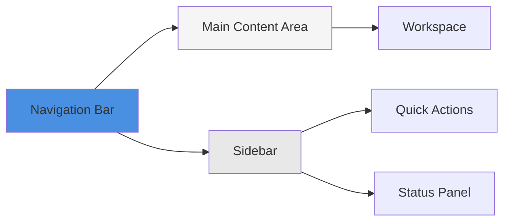
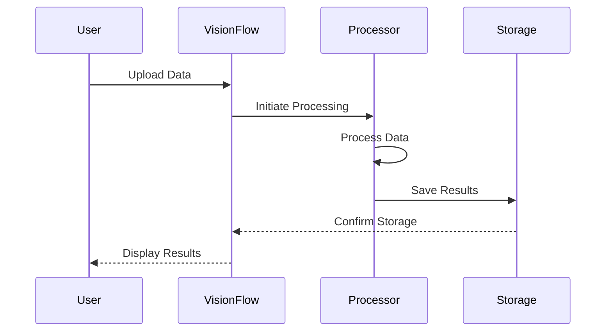
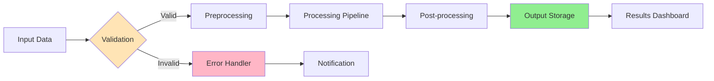

# Basic Usage Guide

## Introduction

This guide covers the fundamental operations and workflows in VisionFlow. By the end, you'll understand how to perform common tasks and navigate the interface effectively.

## Dashboard Overview

### Main Interface Components



1. **Navigation Bar**: Access to main features and settings
2. **Sidebar**: Quick actions and status information
3. **Main Content Area**: Your primary workspace
4. **Status Panel**: System status and notifications

### Navigation Structure

- **Home**: Overview and recent activity
- **Projects**: Manage your projects
- **Assets**: Resource management
- **Analytics**: Performance metrics
- **Settings**: Configuration options

## Core Workflows

### Workflow 1: Creating a New Project

1. **Navigate to Projects**
   - Click "Projects" in the navigation bar
   - Click "New Project" button

2. **Configure Project Settings**
   ```yaml
   Project Name: My First Project
   Description: [Project description]
   Type: [Select project type]
   Template: [Optional: Select template]
   ```

3. **Set Project Parameters**
   - Define input sources
   - Configure processing options
   - Set output destinations

4. **Review and Create**
   - Verify all settings
   - Click "Create Project"

### Workflow 2: Processing Data

#### Basic Processing Steps



1. **Upload Data**
   ```bash
   # Via CLI
   visionflow upload --file data.zip --project my-project

   # Via Web UI
   # Drag and drop files or click "Upload"
   ```

2. **Configure Processing**
   - Select processing pipeline
   - Set parameters
   - Choose output format

3. **Monitor Progress**
   - View real-time status
   - Check processing logs
   - Monitor resource usage

4. **Review Results**
   - Access processed data
   - Download outputs
   - Share results

### Workflow 3: Managing Assets

#### Asset Organization

```
/assets
  ├── /raw-data
  ├── /processed
  ├── /exports
  └── /templates
```

#### Asset Operations

**Upload Assets**
```bash
visionflow asset upload --path /local/file.dat --destination raw-data/
```

**List Assets**
```bash
visionflow asset list --filter "type:image"
```

**Download Assets**
```bash
visionflow asset download --id asset-12345 --output /local/path/
```

**Delete Assets**
```bash
visionflow asset delete --id asset-12345 --confirm
```

## Common Tasks

### Task 1: Monitoring System Status

#### System Health Dashboard

| Metric | Status | Value |
|--------|--------|-------|
| CPU Usage | 🟢 | 45% |
| Memory | 🟢 | 62% |
| Storage | 🟡 | 78% |
| Network | 🟢 | Active |
| Services | 🟢 | All Running |

#### Checking Status via CLI

```bash
# Overall system status
visionflow status

# Detailed component status
visionflow status --detailed

# Specific service status
visionflow status --service api
```

### Task 2: User Management

#### Creating Users

```bash
# Via CLI
visionflow user create \
  --username johndoe \
  --email john@example.com \
  --role user

# Via Web UI
Settings → Users → Add User
```

#### User Roles

| Role | Permissions |
|------|-------------|
| **Admin** | Full system access |
| **Operator** | Manage projects and data |
| **User** | View and use resources |
| **Guest** | Read-only access |

### Task 3: Configuring Integrations

#### Available Integrations

- Cloud Storage (S3, Azure Blob, GCS)
- Databases (PostgreSQL, MySQL, MongoDB)
- Message Queues (RabbitMQ, Kafka)
- Monitoring (Prometheus, Grafana)
- Authentication (LDAP, OAuth2, SAML)

#### Example: S3 Integration

```yaml
integrations:
  storage:
    type: s3
    config:
      bucket: my-visionflow-bucket
      region: us-east-1
      access_key: ${AWS_ACCESS_KEY}
      secret_key: ${AWS_SECRET_KEY}
```

## Keyboard Shortcuts

### Global Shortcuts

| Shortcut | Action |
|----------|--------|
| `Ctrl + K` | Command palette |
| `Ctrl + S` | Save current work |
| `Ctrl + /` | Show keyboard shortcuts |
| `Ctrl + B` | Toggle sidebar |
| `Ctrl + ,` | Open settings |

### Navigation Shortcuts

| Shortcut | Action |
|----------|--------|
| `Ctrl + 1` | Go to Home |
| `Ctrl + 2` | Go to Projects |
| `Ctrl + 3` | Go to Assets |
| `Ctrl + 4` | Go to Analytics |

## Best Practices

### 1. Project Organization

- Use descriptive project names
- Add detailed descriptions
- Tag projects appropriately
- Archive completed projects

### 2. Resource Management

- Monitor storage usage regularly
- Clean up unused assets
- Use compression for large files
- Implement retention policies

### 3. Performance Optimization

- Process data in batches
- Use appropriate quality settings
- Schedule heavy tasks during off-peak hours
- Monitor system metrics

### 4. Security

- Use strong passwords
- Enable two-factor authentication
- Review user permissions regularly
- Audit access logs

## Data Flow Example



## Troubleshooting Common Issues

### Issue: Upload Fails

**Symptoms**: Files don't upload or timeout

**Solutions**:
1. Check file size limits
2. Verify network connectivity
3. Check available storage
4. Review upload logs

### Issue: Slow Processing

**Symptoms**: Processing takes longer than expected

**Solutions**:
1. Check system resource usage
2. Reduce batch size
3. Optimize processing parameters
4. Schedule during off-peak hours

### Issue: Cannot Access Dashboard

**Symptoms**: Dashboard won't load

**Solutions**:
1. Clear browser cache
2. Check service status
3. Verify network connectivity
4. Review error logs

## Next Steps

- Explore [Features Overview](./04-features-overview.md)
- Learn about [Advanced Features]
- Review [Troubleshooting Guide](./05-troubleshooting.md)
- Check [FAQ](./06-faq.md)

## Quick Reference Card

```
┌─────────────────────────────────────────┐
│ VisionFlow Quick Reference              │
├─────────────────────────────────────────┤
│ Start Service:                          │
│   docker-compose up -d                  │
│                                         │
│ Access UI:                              │
│   http://localhost:8080                 │
│                                         │
│ Check Status:                           │
│   visionflow status                     │
│                                         │
│ View Logs:                              │
│   visionflow logs --tail 100            │
│                                         │
│ Get Help:                               │
│   visionflow help [command]             │
└─────────────────────────────────────────┘
```
