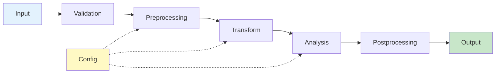
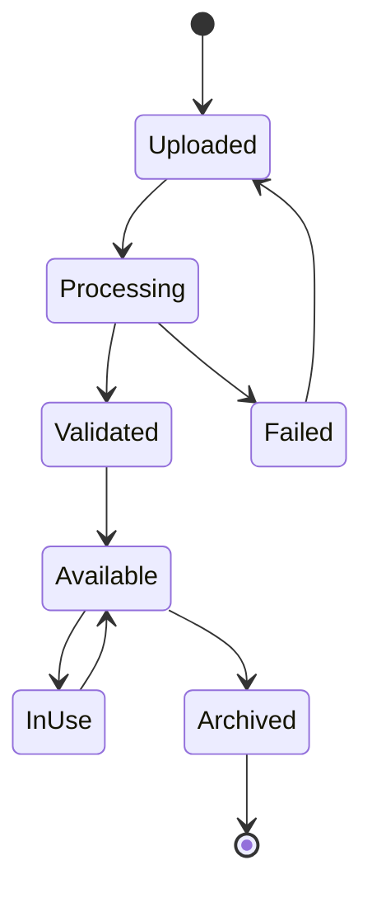
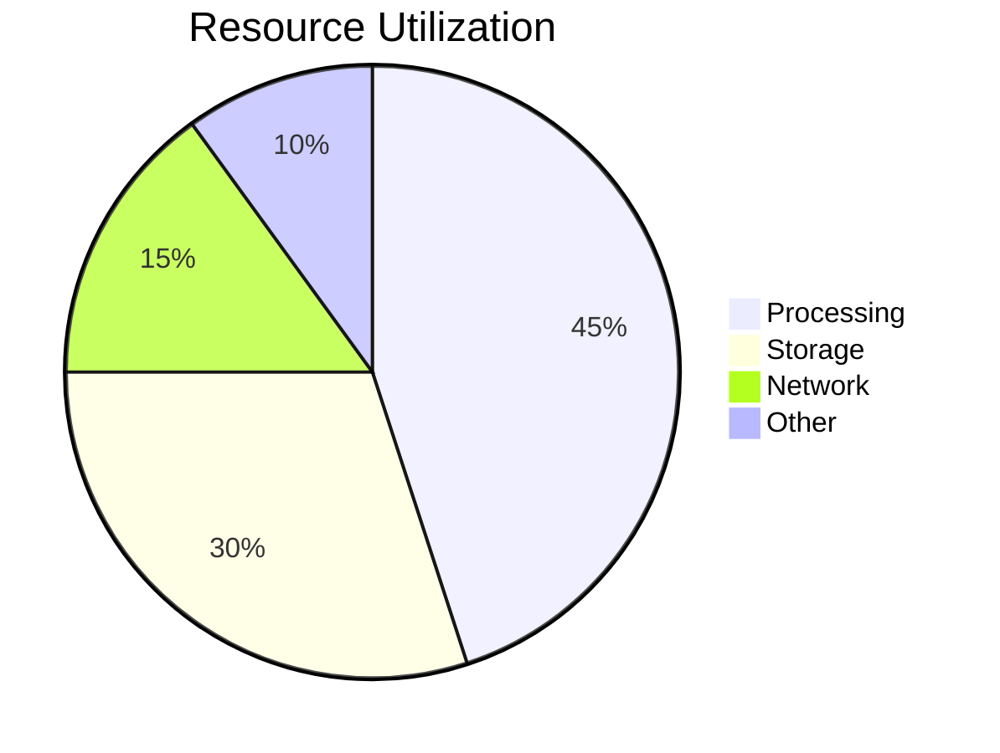
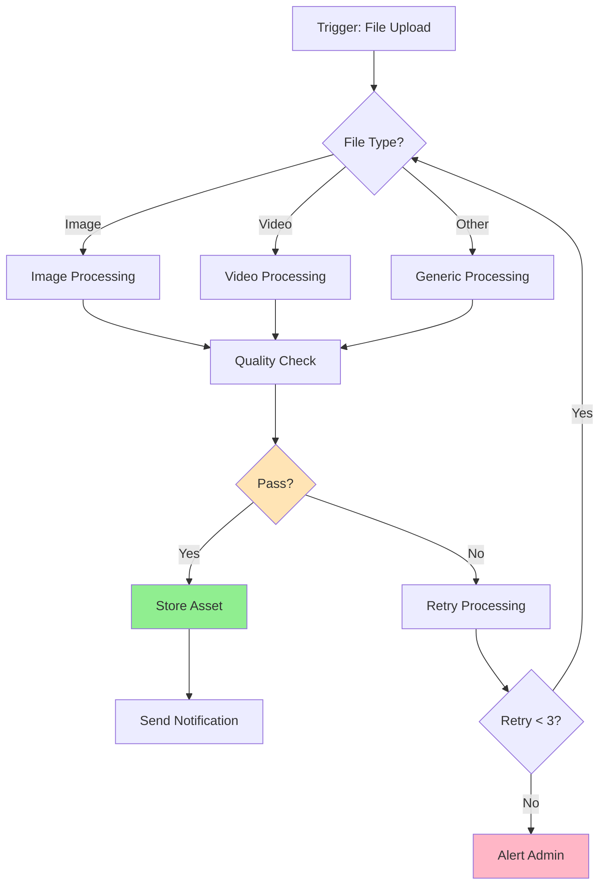
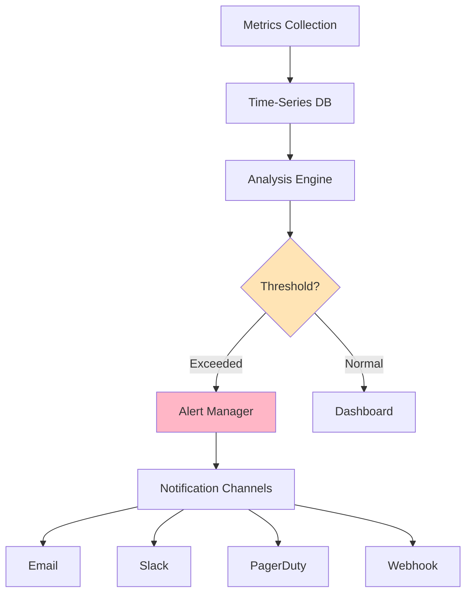
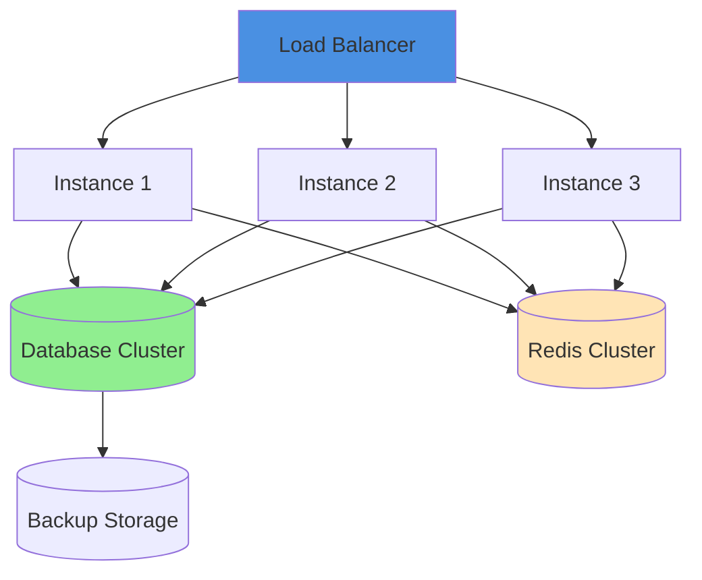

# Features Overview

## Introduction

VisionFlow provides a comprehensive suite of features designed for [primary use case]. This guide provides an overview of all major capabilities.

## Core Features

### 1. Data Processing Engine

**Description**: High-performance processing pipeline for [data type] with support for [capabilities].

**Key Capabilities**:
- ✅ Real-time processing
- ✅ Batch processing
- ✅ Distributed processing
- ✅ Custom pipeline creation
- ✅ Multi-format support

**Supported Formats**:
| Format | Input | Output | Notes |
|--------|-------|--------|-------|
| [Format 1] | ✅ | ✅ | Native support |
| [Format 2] | ✅ | ✅ | Requires plugin |
| [Format 3] | ✅ | ⚠️ | Beta support |

**Processing Pipeline Architecture**:



**Example Usage**:
```bash
visionflow process \
  --input data/raw/ \
  --output data/processed/ \
  --pipeline custom-pipeline \
  --config config/processing.yml
```

### 2. Asset Management System

**Description**: Centralized management for all project assets with versioning and metadata support.

**Features**:
- 📁 Hierarchical organization
- 🔍 Full-text search
- 🏷️ Tagging and categorization
- 📊 Usage analytics
- 🔄 Version control
- 🔐 Access control

**Asset Lifecycle**:



**Storage Tiers**:
| Tier | Access Speed | Cost | Use Case |
|------|-------------|------|----------|
| Hot | Immediate | High | Active projects |
| Warm | < 1 minute | Medium | Recent projects |
| Cold | < 1 hour | Low | Archived projects |
| Glacier | < 12 hours | Very Low | Long-term storage |

### 3. Analytics & Reporting

**Description**: Comprehensive analytics with customizable dashboards and automated reporting.

**Available Metrics**:
- Processing throughput
- Resource utilization
- Error rates
- User activity
- System performance
- Cost analysis

**Dashboard Types**:

1. **System Overview**
   - Real-time metrics
   - Resource usage
   - Service health
   - Alert summary

2. **Project Analytics**
   - Processing statistics
   - Asset usage
   - Timeline view
   - Cost breakdown

3. **User Activity**
   - Login patterns
   - Feature usage
   - Performance metrics
   - Access logs

**Sample Analytics Dashboard**:



### 4. Workflow Automation

**Description**: Create and automate complex workflows with visual builder and scripting support.

**Automation Capabilities**:
- 🔄 Scheduled tasks
- 📬 Event triggers
- 🔗 Chain operations
- 🎯 Conditional logic
- 🔔 Notifications
- 📝 Audit trails

**Workflow Example**:



**Workflow Configuration**:
```yaml
workflow:
  name: automated-processing
  trigger:
    type: file_upload
    path: /uploads/*

  steps:
    - name: validate
      type: validation
      config:
        schema: data-schema.json

    - name: process
      type: processing
      config:
        pipeline: standard-pipeline

    - name: notify
      type: notification
      config:
        channels: [email, slack]
        recipients: [admin@example.com]
```

### 5. Integration Framework

**Description**: Extensive integration capabilities with popular platforms and services.

**Integration Categories**:

#### Storage Integrations
- ☁️ AWS S3
- ☁️ Azure Blob Storage
- ☁️ Google Cloud Storage
- 💾 Local Storage
- 🌐 FTP/SFTP

#### Database Integrations
- 🐘 PostgreSQL
- 🐬 MySQL
- 🍃 MongoDB
- ⚡ Redis
- 📊 InfluxDB

#### Messaging Integrations
- 📨 RabbitMQ
- 📡 Apache Kafka
- 🔔 MQTT
- ⚡ Redis Pub/Sub

#### Authentication Integrations
- 🔐 LDAP/Active Directory
- 🔑 OAuth2
- 🎫 SAML
- 👤 Local Authentication

**Integration Configuration Example**:
```yaml
integrations:
  storage:
    primary:
      type: s3
      bucket: visionflow-data
      region: us-east-1

  database:
    primary:
      type: postgresql
      host: db.example.com
      port: 5432
      database: visionflow

  messaging:
    primary:
      type: rabbitmq
      host: mq.example.com
      exchange: visionflow-events
```

### 6. Security & Access Control

**Description**: Enterprise-grade security with role-based access control and audit logging.

**Security Features**:
- 🔒 TLS/SSL encryption
- 🔑 API key management
- 👥 Role-based access control (RBAC)
- 📝 Audit logging
- 🛡️ Input validation
- 🚫 Rate limiting

**Access Control Matrix**:

| Resource | Admin | Operator | User | Guest |
|----------|-------|----------|------|-------|
| System Config | ✅ | ❌ | ❌ | ❌ |
| User Management | ✅ | ⚠️ | ❌ | ❌ |
| Projects | ✅ | ✅ | ✅ | 👁️ |
| Assets | ✅ | ✅ | ✅ | 👁️ |
| Analytics | ✅ | ✅ | 👁️ | ❌ |
| API Access | ✅ | ✅ | ✅ | ❌ |

Legend: ✅ Full Access | ⚠️ Limited Access | 👁️ Read Only | ❌ No Access

### 7. Monitoring & Alerting

**Description**: Comprehensive monitoring with customizable alerts and notifications.

**Monitoring Components**:



**Alert Types**:
- 🚨 Critical: Immediate action required
- ⚠️ Warning: Attention needed
- ℹ️ Info: Status updates
- ✅ OK: Issue resolved

**Monitored Metrics**:
```yaml
metrics:
  system:
    - cpu_usage
    - memory_usage
    - disk_usage
    - network_traffic

  application:
    - request_rate
    - error_rate
    - response_time
    - queue_depth

  business:
    - processing_throughput
    - active_users
    - storage_growth
    - cost_per_operation
```

## Advanced Features

### 8. Machine Learning Integration

**Description**: Built-in support for ML models and training pipelines.

**Capabilities**:
- Model training
- Inference serving
- Model versioning
- A/B testing
- Performance monitoring

### 9. API & SDK

**Description**: RESTful API and SDKs for programmatic access.

**Available SDKs**:
- Python SDK
- JavaScript/TypeScript SDK
- Go SDK
- Java SDK
- CLI Tool

### 10. High Availability

**Description**: Production-ready HA configuration with automatic failover.

**HA Architecture**:



## Feature Comparison Matrix

| Feature | Community | Professional | Enterprise |
|---------|-----------|--------------|------------|
| Processing Engine | ✅ | ✅ | ✅ |
| Asset Management | ✅ | ✅ | ✅ |
| Basic Analytics | ✅ | ✅ | ✅ |
| Advanced Analytics | ❌ | ✅ | ✅ |
| Workflow Automation | Limited | ✅ | ✅ |
| Integrations | 5 | 20 | Unlimited |
| API Access | ✅ | ✅ | ✅ |
| HA Support | ❌ | ❌ | ✅ |
| ML Integration | ❌ | ⚠️ | ✅ |
| Support | Community | Email | 24/7 |

## Next Steps

- Learn [Basic Usage](./03-basic-usage.md)
- Check [Troubleshooting](./05-troubleshooting.md)
- Review [FAQ](./06-faq.md)
- Explore [API Documentation](../api/)
