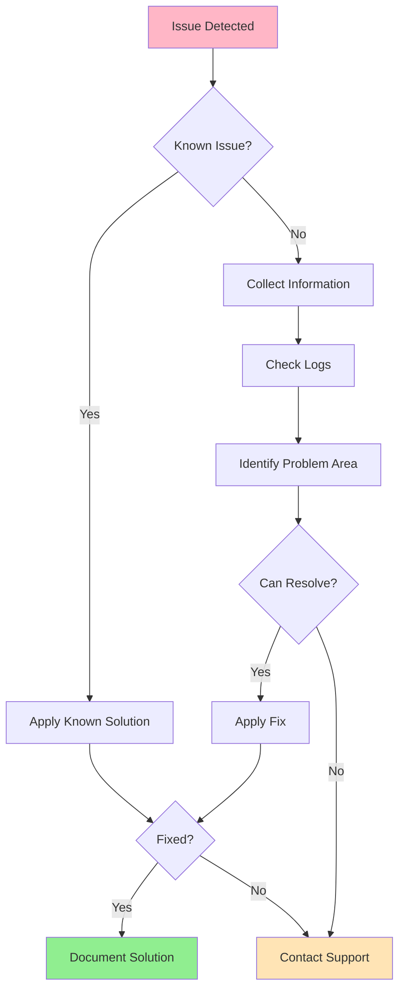
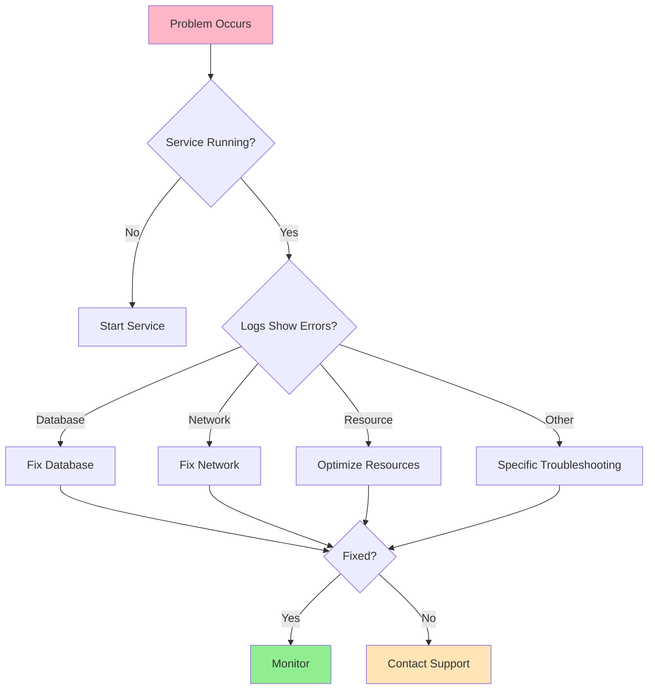

# Troubleshooting Guide

## Introduction

This guide helps you diagnose and resolve common issues with VisionFlow. Follow the troubleshooting steps systematically for best results.

## General Troubleshooting Process



## Quick Diagnostics

### Health Check Command

Run this first to identify obvious issues:

```bash
# Comprehensive health check
visionflow diagnose --full

# Quick health check
visionflow status --health

# Component-specific check
visionflow status --component [component-name]
```

### Log Collection

```bash
# Collect all logs
visionflow logs collect --output diagnostics.zip

# View recent errors
visionflow logs --level error --tail 100

# Follow logs in real-time
visionflow logs --follow
```

## Common Issues & Solutions

### Installation Issues

#### Issue 1: Installation Fails with Dependency Error

**Symptoms**:
```
Error: Unable to install package dependencies
Package X version Y.Y.Y not found
```

**Diagnosis**:
```bash
# Check package manager
which npm && npm --version
which pip && pip --version

# Check repository access
curl -I https://registry.npmjs.org/
```

**Solutions**:

1. **Update Package Manager**
   ```bash
   # NPM
   npm install -g npm@latest

   # Pip
   python -m pip install --upgrade pip
   ```

2. **Clear Cache**
   ```bash
   # NPM
   npm cache clean --force

   # Pip
   pip cache purge
   ```

3. **Use Alternative Registry**
   ```bash
   npm config set registry https://registry.npmjs.org/
   ```

#### Issue 2: Docker Container Won't Start

**Symptoms**:
```
Error: Container exits immediately after start
Container state: Exited (1)
```

**Diagnosis**:
```bash
# Check container logs
docker logs visionflow

# Inspect container
docker inspect visionflow

# Check resource availability
docker stats --no-stream
```

**Solutions**:

1. **Check Port Conflicts**
   ```bash
   # Linux/Mac
   sudo lsof -i :8080
   sudo lsof -i :9090

   # Windows
   netstat -ano | findstr :8080
   ```

2. **Verify Docker Resources**
   ```bash
   docker system df
   docker system prune  # If low on space
   ```

3. **Check Environment Variables**
   ```bash
   docker-compose config  # Validate configuration
   ```

### Runtime Issues

#### Issue 3: High CPU/Memory Usage

**Symptoms**:
- System slowdown
- Processing delays
- Out of memory errors

**Diagnosis**:
```bash
# Check resource usage
visionflow status --resources

# Identify resource-hungry processes
top -p $(pgrep -d',' visionflow)
```

**Solutions**:

1. **Optimize Processing**
   ```yaml
   # config/performance.yml
   processing:
     batch_size: 10  # Reduce from default
     max_concurrent: 2  # Limit parallelism
     memory_limit: 2GB
   ```

2. **Enable Resource Limits**
   ```bash
   # Docker
   docker update --memory 4g --cpus 2 visionflow
   ```

3. **Scale Resources**
   ```bash
   # Add more workers
   visionflow scale --workers 4
   ```

#### Issue 4: Database Connection Failures

**Symptoms**:
```
Error: Unable to connect to database
Connection timeout after 30 seconds
```

**Diagnosis**:
```bash
# Test database connectivity
nc -zv database-host 5432  # PostgreSQL
nc -zv database-host 3306  # MySQL

# Check credentials
visionflow config validate --database
```

**Solutions**:

1. **Verify Connection String**
   ```yaml
   database:
     host: localhost  # Check if correct
     port: 5432
     name: visionflow
     user: visionflow
     password: ${DB_PASSWORD}  # Check environment variable
   ```

2. **Check Database Status**
   ```bash
   # PostgreSQL
   sudo systemctl status postgresql

   # MySQL
   sudo systemctl status mysql
   ```

3. **Test Credentials**
   ```bash
   # PostgreSQL
   psql -h localhost -U visionflow -d visionflow -c "SELECT 1;"

   # MySQL
   mysql -h localhost -u visionflow -p -e "SELECT 1;"
   ```

#### Issue 5: Processing Failures

**Symptoms**:
- Jobs stuck in "Processing" state
- Jobs fail with unclear errors
- Inconsistent processing results

**Diagnosis**:
```bash
# Check job status
visionflow jobs list --status failed

# Get detailed job information
visionflow jobs inspect --id <job-id>

# Check processing queue
visionflow queue status
```

**Solutions**:

1. **Retry Failed Jobs**
   ```bash
   visionflow jobs retry --id <job-id>

   # Retry all failed jobs
   visionflow jobs retry --all-failed
   ```

2. **Clear Stuck Jobs**
   ```bash
   # Cancel stuck job
   visionflow jobs cancel --id <job-id>

   # Clear queue
   visionflow queue clear --confirm
   ```

3. **Adjust Processing Configuration**
   ```yaml
   processing:
     timeout: 3600  # Increase timeout
     retry_attempts: 3
     retry_delay: 60
   ```

### Network Issues

#### Issue 6: Unable to Access Web Interface

**Symptoms**:
- Browser shows "Connection refused"
- "This site can't be reached"
- Timeout errors

**Diagnosis**:
```bash
# Check if service is running
sudo systemctl status visionflow

# Check if port is listening
sudo netstat -tlnp | grep 8080

# Test local connectivity
curl http://localhost:8080/health
```

**Solutions**:

1. **Verify Service Status**
   ```bash
   sudo systemctl start visionflow
   sudo systemctl enable visionflow
   ```

2. **Check Firewall Rules**
   ```bash
   # Ubuntu/Debian
   sudo ufw status
   sudo ufw allow 8080/tcp

   # CentOS/RHEL
   sudo firewall-cmd --add-port=8080/tcp --permanent
   sudo firewall-cmd --reload
   ```

3. **Verify Binding Address**
   ```yaml
   # config.yml
   server:
     host: 0.0.0.0  # Not 127.0.0.1 for remote access
     port: 8080
   ```

#### Issue 7: API Connection Errors

**Symptoms**:
```
Error: API request failed with status 500
Connection reset by peer
```

**Diagnosis**:
```bash
# Test API endpoint
curl -v http://localhost:9090/api/status

# Check API logs
visionflow logs --component api --tail 50
```

**Solutions**:

1. **Verify API Configuration**
   ```yaml
   api:
     host: 0.0.0.0
     port: 9090
     timeout: 30
     max_connections: 100
   ```

2. **Check API Rate Limits**
   ```bash
   # Increase rate limits if needed
   visionflow config set api.rate_limit 1000
   ```

3. **Restart API Service**
   ```bash
   visionflow service restart api
   ```

### Data Issues

#### Issue 8: Upload Failures

**Symptoms**:
- Files fail to upload
- Upload progress stuck at percentage
- "413 Request Entity Too Large"

**Diagnosis**:
```bash
# Check storage space
df -h /var/lib/visionflow

# Check upload limits
visionflow config get upload.max_size
```

**Solutions**:

1. **Increase Upload Limits**
   ```yaml
   upload:
     max_size: 5GB  # Increase from default
     chunk_size: 10MB
     timeout: 3600
   ```

2. **Free Up Storage**
   ```bash
   # Clean up old files
   visionflow cleanup --older-than 30d

   # Remove temporary files
   visionflow cleanup --temp
   ```

3. **Use Chunked Upload**
   ```bash
   visionflow upload --file large-file.dat --chunked
   ```

#### Issue 9: Data Corruption

**Symptoms**:
- Processed data appears incorrect
- Checksum mismatches
- Unexpected file sizes

**Diagnosis**:
```bash
# Verify data integrity
visionflow verify --path /data/assets/

# Check for corruption
visionflow check --deep-scan
```

**Solutions**:

1. **Restore from Backup**
   ```bash
   visionflow restore --backup latest --path /data/assets/
   ```

2. **Reprocess Data**
   ```bash
   visionflow reprocess --input original-data/ --force
   ```

## Error Code Reference

| Code | Description | Action |
|------|-------------|--------|
| E1001 | Configuration error | Review config file |
| E1002 | Database connection failed | Check database status |
| E1003 | Authentication failed | Verify credentials |
| E2001 | Resource not found | Check resource path |
| E2002 | Permission denied | Review access rights |
| E3001 | Processing timeout | Increase timeout value |
| E3002 | Invalid input format | Verify input data |
| E4001 | Network error | Check connectivity |
| E5001 | Internal server error | Check logs, restart service |

## Log Analysis

### Log Locations

| Component | Log Path |
|-----------|----------|
| Main Application | `/var/log/visionflow/app.log` |
| API | `/var/log/visionflow/api.log` |
| Processing | `/var/log/visionflow/processing.log` |
| Database | `/var/log/visionflow/database.log` |
| System | `/var/log/visionflow/system.log` |

### Log Analysis Commands

```bash
# Find errors in last hour
grep -A 5 "ERROR" /var/log/visionflow/app.log | tail -100

# Count errors by type
grep "ERROR" /var/log/visionflow/app.log | \
  awk '{print $5}' | sort | uniq -c

# Monitor logs in real-time
tail -f /var/log/visionflow/*.log
```

### Common Log Patterns

**Database Connection Error**:
```
ERROR [database] Failed to connect: Connection refused
```
→ Check database service and credentials

**Out of Memory**:
```
ERROR [processing] Out of memory: Cannot allocate buffer
```
→ Reduce batch size or increase memory

**Permission Denied**:
```
ERROR [storage] Permission denied: /data/assets/file.dat
```
→ Fix file permissions

## Performance Tuning

### Performance Checklist

- [ ] System resources adequate (CPU, RAM, Storage)
- [ ] Database properly indexed
- [ ] Cache enabled and configured
- [ ] Resource limits appropriately set
- [ ] Concurrent processing optimized
- [ ] Network latency acceptable
- [ ] Storage I/O not bottlenecked

### Optimization Commands

```bash
# Optimize database
visionflow db optimize

# Rebuild indexes
visionflow db reindex

# Clear cache
visionflow cache clear

# Performance report
visionflow performance report --detailed
```

## Getting Additional Help

### Before Contacting Support

Collect this information:

1. **System Information**
   ```bash
   visionflow version
   visionflow diagnose --system-info > system-info.txt
   ```

2. **Logs**
   ```bash
   visionflow logs collect --output logs.zip
   ```

3. **Configuration**
   ```bash
   visionflow config export --sanitized > config.yml
   ```

### Support Channels

- **Documentation**: https://docs.visionflow.example
- **Community Forum**: https://community.visionflow.example
- **Issue Tracker**: https://github.com/org/visionflow/issues
- **Email Support**: support@visionflow.example
- **Emergency Hotline**: [For Enterprise customers]

### Creating a Support Ticket

Include:
- VisionFlow version
- Operating system and version
- Issue description
- Steps to reproduce
- Error messages
- Relevant logs
- What you've tried

## Preventive Maintenance

```bash
# Weekly maintenance
visionflow maintenance --weekly

# Monthly maintenance
visionflow maintenance --monthly

# Health monitoring
visionflow monitor --continuous --alert-threshold high
```

## Troubleshooting Decision Tree


