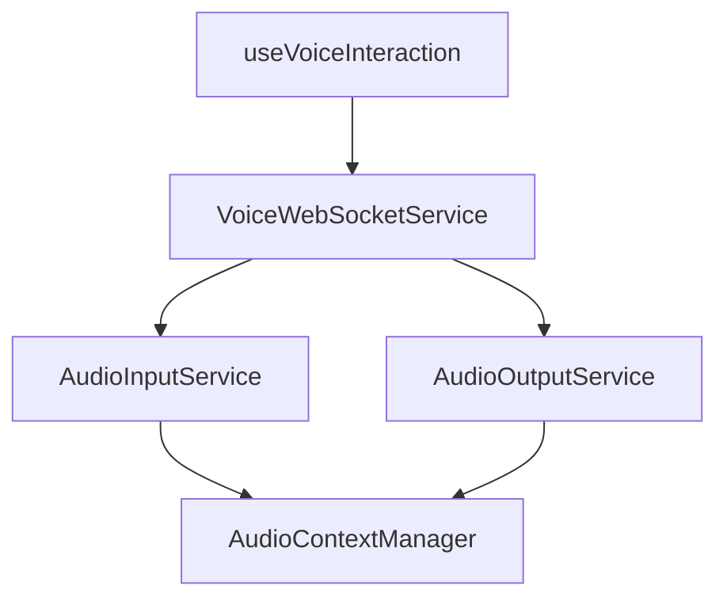

# Voice State Architecture Analysis

## Current Voice System Overview

The current voice system implements a comprehensive audio processing pipeline with multiple interaction patterns. This analysis identifies 3 distinct patterns currently being used and proposes a centralized architecture.

## Current Architecture Components

### Core Services Layer
```
AudioContextManager (Singleton)
├── AudioInputService (Singleton)
│   ├── MediaRecorder API
│   ├── Web Audio API (AnalyserNode, AudioWorkletNode)
│   └── Event-driven state management
├── AudioOutputService (Singleton)
│   ├── Audio queuing system
│   ├── Web Audio API playback
│   └── Volume/gain control
└── VoiceWebSocketService (Singleton)
    ├── Bidirectional WebSocket communication
    ├── STT/TTS request handling
    └── Audio streaming coordination
```

### UI Component Layer
```
Voice Components
├── AuthGatedVoiceButton (Authentication wrapper)
├── VoiceButton (Primary interaction)
├── VoiceIndicator (Status display)
├── VoiceStatusIndicator (Compact status)
└── useVoiceInteraction (React hook)
```

## Three Current Voice State Patterns Identified

### Pattern 1: Direct Service Access
**Files**: `VoiceButton.tsx`, `VoiceIndicator.tsx`, `VoiceStatusIndicator.tsx`

```typescript
// Direct singleton access in components
const voiceService = VoiceWebSocketService.getInstance();
const audioInput = voiceService.getAudioInput();

// Direct event listener setup
audioInput.on('audioLevel', handleAudioLevel);
voiceService.on('transcription', handleTranscription);
```

**Characteristics**:
- Components directly instantiate singleton services
- Manual event listener management
- Duplicated setup code across components
- No centralized state management

### Pattern 2: Hook-Based Abstraction
**Files**: `useVoiceInteraction.ts`, `VoiceButton.tsx` (partial usage)

```typescript
// Hook-based state management
const {
  isConnected,
  isListening,
  isSpeaking,
  transcription,
  startListening,
  stopListening,
  speak
} = useVoiceInteraction({
  onTranscription: handleTranscription,
  onError: handleError
});
```

**Characteristics**:
- Encapsulates service interactions
- Provides React-friendly state management
- Includes lifecycle management
- Single hook per component instance

### Pattern 3: Mixed Direct/Hook Pattern
**Files**: Components using both patterns simultaneously

```typescript
// Using hook for some functionality
const { isListening, toggleListening } = useVoiceInteraction();

// But also direct service access for others
useEffect(() => {
  const voiceService = VoiceWebSocketService.getInstance();
  const audioInput = voiceService.getAudioInput();
  audioInput.on('audioLevel', setAudioLevel);
}, []);
```

**Characteristics**:
- Inconsistent state management approach
- Potential for state synchronization issues
- Redundant service instantiations

## Current Service Architecture Analysis

### Singleton Pattern Implementation
- **AudioContextManager**: Manages shared Web Audio API context
- **AudioInputService**: Handles microphone access, recording, and processing
- **AudioOutputService**: Manages audio playback queue and Web Audio API output
- **VoiceWebSocketService**: Coordinates WebSocket communication for STT/TTS

### Service Interdependencies


### Settings Integration
Voice services integrate with the settings store for:
- Kokoro TTS configuration (voice, speed, format)
- Whisper STT configuration (model, language, temperature)
- Backend URL configuration
- Authentication settings

## Problems with Current Architecture

### 1. Inconsistent State Management
- Components use different patterns to access the same functionality
- Multiple sources of truth for voice state
- Event listeners scattered across components

### 2. Resource Management Issues
- No centralized cleanup strategy
- Potential memory leaks from orphaned event listeners
- Multiple components may compete for microphone access

### 3. Code Duplication
- Similar setup logic repeated across components
- Redundant error handling patterns
- Duplicated browser support checking

### 4. Testing Complexity
- Singleton services are difficult to mock
- No clear separation between business logic and UI concerns
- Components tightly coupled to service implementations

## Proposed Centralized Architecture

### Voice Context Provider Pattern

```typescript
interface VoiceContextState {
  // Connection state
  isConnected: boolean;
  isConnecting: boolean;
  connectionError: string | null;

  // Audio input state
  isListening: boolean;
  audioLevel: number;
  microphonePermission: 'granted' | 'denied' | 'prompt';

  // Audio output state
  isSpeaking: boolean;
  audioQueue: AudioQueueItem[];
  volume: number;

  // Transcription state
  transcription: string;
  partialTranscription: string;
  transcriptionHistory: TranscriptionResult[];

  // Settings state
  voiceSettings: VoiceSettings;

  // Browser support
  browserSupport: BrowserSupportInfo;
}

interface VoiceContextActions {
  // Connection management
  connect: () => Promise<void>;
  disconnect: () => Promise<void>;

  // Audio input control
  startListening: (options?: VoiceListenOptions) => Promise<void>;
  stopListening: () => void;
  toggleListening: () => Promise<void>;

  // Audio output control
  speak: (text: string, options?: TTSOptions) => Promise<void>;
  stopSpeaking: () => void;
  setVolume: (volume: number) => void;

  // Settings management
  updateVoiceSettings: (settings: Partial<VoiceSettings>) => void;

  // Utility functions
  requestMicrophonePermission: () => Promise<boolean>;
  clearTranscriptionHistory: () => void;
}
```

### Centralized Hook Architecture

```typescript
// Primary hook for voice functionality
export function useVoiceInteraction(options?: UseVoiceOptions): VoiceInteractionReturn;

// Specialized hooks for specific use cases
export function useVoiceConnection(): VoiceConnectionState;
export function useVoiceInput(): VoiceInputState;
export function useVoiceOutput(): VoiceOutputState;
export function useVoiceTranscription(): VoiceTranscriptionState;
export function useVoiceSettings(): VoiceSettingsState;

// Utility hooks
export function useAudioLevel(): number;
export function useVoicePermissions(): VoicePermissionState;
export function useVoiceBrowserSupport(): BrowserSupportInfo;
```

## Implementation Plan

### Phase 1: Context Provider Implementation
1. Create `VoiceContextProvider` with centralized state management
2. Implement service facade pattern to abstract singleton services
3. Add comprehensive error handling and recovery mechanisms
4. Create type-safe interfaces for all voice interactions

### Phase 2: Hook Consolidation
5. Refactor `useVoiceInteraction` to use context provider
6. Create specialized hooks for specific use cases
7. Implement proper cleanup and resource management
8. Add comprehensive testing suite

### Phase 3: Component Migration
9. Update all voice components to use new hook architecture
10. Remove direct service access patterns
11. Standardize error handling across components
12. Optimize performance and reduce re-renders

### Phase 4: Enhanced Features
13. Add voice command recognition system
14. Implement audio visualization components
15. Create voice profile management
16. Add advanced audio processing options

## Migration Strategy

### Backward Compatibility
- Keep existing services intact during migration
- Create adapter layer for existing direct service usage
- Gradual component-by-component migration
- Comprehensive testing at each migration step

### Breaking Changes
- Direct service access will be deprecated
- Event listener patterns will be replaced with React state
- Some method signatures may change for consistency

## Benefits of Centralized Architecture

### 1. Consistency
- Single pattern for all voice interactions
- Unified error handling strategy
- Consistent state management approach

### 2. Performance
- Reduced resource usage through centralized management
- Optimized re-rendering with React context
- Efficient event listener management

### 3. Maintainability
- Clear separation of concerns
- Easier testing and debugging
- Simplified component logic

### 4. Extensibility
- Easy to add new voice features
- Plugin architecture for voice processing
- Configurable voice interaction patterns

## Technical Specifications

### Service Layer Refactoring
- Convert singletons to injectable services
- Implement service registry pattern
- Add comprehensive logging and monitoring
- Create service health checking mechanisms

### State Management
- Use React Context for global voice state
- Implement optimistic updates for better UX
- Add state persistence for voice preferences
- Create state normalization for complex data structures

### Error Handling
- Centralized error reporting and recovery
- User-friendly error messages with suggested actions
- Automatic retry mechanisms for transient failures
- Graceful degradation when features are unavailable

This architecture provides a solid foundation for voice interactions while maintaining the flexibility to extend and enhance the system as requirements evolve.