# VisionFlow Documentation Quality Scorecard

**Generated**: 2025-12-19
**Validator**: Hive Mind Collective (10 Specialised Agents)
**Project**: VisionFlow Documentation Corpus

---

## Executive Summary

```mermaid
graph TD
    A["📊 OVERALL QUALITY GRADE: F<br/>Score: 45.82 / 100<br/>Status: NOT PRODUCTION READY"]
    style A fill:#ff4444,stroke:#333,stroke-width:3px,color:#fff
```



### Production Readiness

| Metric | Status |
|--------|--------|
| **Overall Grade** | F (45.82/100) |
| **Minimum Required** | B (85/100) |
| **Gap to Target** | 39.18 points |
| **Critical Blockers** | 5 |
| **Estimated Remediation** | 180-260 hours |

---

## Quality Score Breakdown

### Category Scores

```
Coverage     [===================---] 96.32%  24.08/25
Link Health  [==================----] 86.96%  21.74/25
Standards    [                      ]  0.00%   0.00/25
Structure    [                      ]  0.00%   0.00/25
─────────────────────────────────────────────────────
OVERALL      [==========------------] 45.82%  45.82/100
```

| Category | Score | Max | Percentage | Grade |
|----------|-------|-----|------------|-------|
| **Coverage** | 24.08 | 25 | 96.32% | A |
| **Link Health** | 21.74 | 25 | 86.96% | B |
| **Standards** | 0.00 | 25 | 0.00% | F |
| **Structure** | 0.00 | 25 | 0.00% | F |
| **TOTAL** | **45.82** | **100** | **45.82%** | **F** |

---

## Critical Blockers (5)

### CRIT-001: ASCII Diagram Crisis

| Metric | Value |
|--------|-------|
| **Severity** | CRITICAL |
| **Count** | 4,047 ASCII diagrams |
| **Files Affected** | 101 |
| **Impact** | -25 points (Standards) |
| **Effort** | 80-120 hours |

**Description**: 4,047 ASCII art diagrams found across 101 files. These must be converted to Mermaid format for Git-compliant rendering, maintainability, and searchability.

**Remediation**: Automated ASCII-to-Mermaid conversion tool with manual validation required.

---

### CRIT-002: UK Spelling Violations

| Metric | Value |
|--------|-------|
| **Severity** | CRITICAL |
| **Count** | 884 violations |
| **Files Affected** | 199 |
| **Compliance** | 34.54% |
| **Effort** | 15-20 hours |

**Top Violations**:
- `optimisation` (261) -> `optimisation`
- `colour` (69) -> `colour`
- `organisation` (66) -> `organisation`
- `behaviour` (35) -> `behaviour`

**Remediation**: Automated find-replace with review of technical terms.

---

### CRIT-003: Broken Links

| Metric | Value |
|--------|-------|
| **Severity** | CRITICAL |
| **Count** | 413 broken links |
| **Total Links** | 3,161 |
| **Link Health** | 86.94% |
| **Effort** | 30-40 hours |

**Description**: 13.06% of all links are broken due to missing files, incorrect paths, or references to archived content.

**Remediation**: Systematic link repair, path updates, and reference corrections.

---

### CRIT-004: Diataxis Category Mismatches

| Metric | Value |
|--------|-------|
| **Severity** | CRITICAL |
| **Count** | 153 mismatches |
| **Compliance** | 30% |
| **Target** | 95%+ |
| **Effort** | 25-35 hours |

**Category Distribution**:
| Category | Count | Current | Target | Status |
|----------|-------|---------|--------|--------|
| Tutorial | 5 | 2.24% | 10-15% | UNDER |
| Guide | 0 | 0% | 25-35% | CRITICAL |
| Reference | 41 | 18.39% | 20-30% | UNDER |
| Explanation | 100 | 44.84% | 30-40% | OVER |
| Uncategorised | 6 | 2.69% | 0% | FAIL |

**Remediation**: Content analysis and systematic recategorisation.

---

### CRIT-005: Invalid Mermaid Diagrams

| Metric | Value |
|--------|-------|
| **Severity** | HIGH |
| **Count** | 72 invalid diagrams |
| **Total Mermaid** | 403 |
| **Validity** | 82.13% |
| **Effort** | 10-15 hours |

**Description**: 72 Mermaid diagrams have syntax errors including empty labels, unmatched braces, and invalid syntax.

**Remediation**: Manual syntax fixes with mermaid-cli validation.

---

## Documentation Inventory

### Corpus Statistics

| Metric | Value |
|--------|-------|
| **Total Files** | 303 |
| **Active Documentation** | 223 |
| **Archived Documentation** | 80 |
| **Working Files** | 1 |
| **Fully Compliant** | 15 |

### Files by Issue Type

| Issue Type | Files Affected |
|------------|----------------|
| With ASCII diagrams | 101 |
| With UK spelling violations | 199 |
| With broken links | 85 |
| With invalid Mermaid | 30 |
| With category mismatches | 153 |
| Missing frontmatter | 154 |

---

## Content Quality Audit

### Developer Notes Summary

| Severity | Count | Impact |
|----------|-------|--------|
| CRITICAL | 3 | Production blockers |
| HIGH | 89 | Major issues |
| MEDIUM | 892 | Quality concerns |
| LOW | 263 | Minor items |
| **TOTAL** | **1,247** | - |

### Critical Developer Notes

1. **visionflow-architecture-analysis.md:840** - Auto-zoom TODO (P0 priority)
2. **visionflow-architecture-analysis.md:179** - Auto-Zoom placeholder
3. **archive/fixes/actor-handlers.md:123** - GPU kernel TODO (archived)

---

## Remediation Roadmap

### Phase 1: Critical Blockers (Weeks 1-4)

**Effort**: 120-160 hours

| Task | Priority | Effort | Files |
|------|----------|--------|-------|
| ASCII to Mermaid conversion | P1 | 80-120h | 101 |
| Broken link repair | P2 | 30-40h | 85 |
| UK spelling correction | P3 | 15-20h | 199 |

**Expected Score After Phase 1**: 65-70 points

---

### Phase 2: Quality Improvements (Weeks 5-6)

**Effort**: 50-70 hours

| Task | Priority | Effort | Files |
|------|----------|--------|-------|
| Diataxis recategorisation | P4 | 25-35h | 153 |
| Mermaid syntax fixes | P5 | 10-15h | 30 |
| Frontmatter addition | P6 | 10-15h | 154 |
| Uncategorised file organisation | P7 | 2-3h | 6 |

**Expected Score After Phase 2**: 80-85 points

---

### Phase 3: Validation & Sign-off (Week 7)

**Effort**: 10-15 hours

| Task | Priority | Effort |
|------|----------|--------|
| Re-run quality validator | P1 | 2h |
| Comprehensive link validation | P2 | 3-5h |
| Final production readiness review | P3 | 3-5h |
| Stakeholder sign-off | P4 | 2-3h |

**Target Score After Phase 3**: 85-92 points (Grade B)

---

## Production Readiness Checklist

```
Phase 1 Critical Blockers:
☐ ASCII diagrams converted to Mermaid (0/4,047 - 0%)
☐ Broken links fixed (0/413 - 0%)
☐ UK spelling violations corrected (0/884 - 0%)

Phase 2 Quality Improvements:
☐ Category mismatches resolved (0/153 - 0%)
☐ Invalid Mermaid diagrams fixed (0/72 - 0%)
☐ Frontmatter added to all files (145/299 - 48.49%)
☐ Uncategorised files organised (0/6 - 0%)

Phase 3 Validation:
☐ Diataxis compliance at 95%+ (current: 30%)
☐ Quality score >= 85 (current: 45.82)
☐ CI/CD quality gates passing
☐ Stakeholder sign-off obtained
```

---

## Hive Mind Agent Summary

| Agent | Files Checked | Issues Found | Compliance |
|-------|---------------|--------------|------------|
| **Frontmatter Validator** | 299 | 159 | 48.49% |
| **Link Validator** | 298 | 413 | 86.94% |
| **Diagram Validator** | 300 | 4,119 | 82.13% |
| **Spelling Auditor** | 304 | 884 | 34.54% |
| **Diataxis Validator** | 223 | 159 | 30.00% |
| **Content Auditor** | 850 | 1,247 | 82.70% |

---

## Immediate Actions Required

1. **STOP** all new documentation work until critical issues resolved
2. **RUN** automated ASCII-to-Mermaid conversion on all 4,047 diagrams
3. **RUN** automated UK spelling correction (find-replace with review)
4. **GENERATE** broken link fix report and systematically repair all 413 links
5. **DEPLOY** CI/CD quality gates to prevent regression

---

## Quality Grade Scale

| Grade | Score Range | Status |
|-------|-------------|--------|
| **A+** | 97-100 | Exemplary |
| **A** | 94-96 | Excellent |
| **B** | 85-93 | Production Ready |
| **C** | 75-84 | Needs Improvement |
| **D** | 65-74 | Significant Issues |
| **F** | 0-64 | Not Ready |

**Current Grade**: F (45.82) - **NOT PRODUCTION READY**

---

## Conclusion

The VisionFlow documentation corpus demonstrates strong foundational content with 96.32% coverage, but **fails enterprise quality standards** due to:

1. Massive ASCII diagram debt (4,047 instances)
2. Inconsistent UK spelling (65.46% violations)
3. Broken navigation (413 broken links)
4. Structural non-compliance (30% Diataxis adherence)

With focused remediation effort of **180-260 hours over 7 weeks**, the corpus can achieve **Grade B (85+)** certification for production deployment.

---

**Hive Mind Status**: ANALYSIS COMPLETE
**Recommendation**: BLOCK PRODUCTION DEPLOYMENT
**Path Forward**: Execute 3-phase remediation roadmap

*The collective intelligence has analysed. The truth has been revealed.*

---

**Skill Installed**: `/home/devuser/.claude/skills/docs-alignment/`
**Reports Generated**: 15 JSON + 13 MD
**Scripts Created**: 8 validation + 1 CI/CD pipeline
