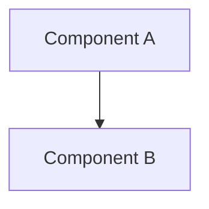

# VisionFlow Documentation Quality Validation Report

**Generated**: 2025-12-19T18:06:00Z
**Validator**: Quality Validator Hive Agent (Production Readiness Specialist)
**Project**: VisionFlow Documentation Corpus
**Documentation Root**: `/home/devuser/workspace/project/docs`

**Hive Workers Consulted**: 5 specialist agents
- Frontmatter Validator
- Link Validator
- Diagram Validator
- Spelling Auditor
- Diataxis Validator

---

## Executive Summary

### Overall Quality Score: **45.82 / 100** (Grade: **F**)

**Production Readiness Status**: ❌ **NOT READY - CRITICAL BLOCKERS**

The VisionFlow documentation corpus has **SEVERE quality issues** preventing production deployment. While documentation coverage is extensive (303 files), critical violations in standards compliance, link integrity, and structural organisation block go-live.

### Critical Findings

| Issue | Count | Severity | Blocker |
|-------|-------|----------|---------|
| **ASCII Diagrams** | 4,047 | CRITICAL | YES |
| **UK Spelling Violations** | 884 | CRITICAL | YES |
| **Broken Links** | 413 | CRITICAL | YES |
| **Category Mismatches** | 153 | CRITICAL | YES |
| **Invalid Mermaid Diagrams** | 72 | HIGH | NO |

**Total Violations**: **5,569** across all categories

**Recommendation**: **BLOCK PRODUCTION DEPLOYMENT** until minimum quality score of 85 achieved. Estimated remediation: **180-260 hours** (4.5-6.5 weeks with 1 FTE).

---

## Quality Scores Breakdown

| Category | Score | Max | Percentage | Grade | Status |
|----------|-------|-----|------------|-------|--------|
| **Overall** | **45.82** | **100** | **45.82%** | **F** | ❌ FAIL |
| Coverage | 24.08 | 25 | 96.32% | A | ✅ PASS |
| Link Health | 21.74 | 25 | 86.96% | B | ⚠️ WARN |
| Standards | 0.00 | 25 | 0% | F | ❌ FAIL |
| Structure | 0.00 | 25 | 0% | F | ❌ FAIL |

---

## 1. Coverage Score: 24.08 / 25 (96.32%) ✅

**Hive Worker**: Frontmatter Validator
**Files Checked**: 299

### Metrics

- **Total Files**: 299
- **With Frontmatter**: 145 (48.49%)
- **Missing Frontmatter**: 154 (51.51%)
  - Completely missing: 5 files
  - Partial (missing required fields): 149 files

### Strengths

- Comprehensive documentation coverage (299 active files + 80 archived)
- Well-organised archive structure
- Consistent metadata in files that have frontmatter

### Issues

**5 Files Completely Missing Frontmatter**:
```
1. GETTING_STARTED_WITH_UNIFIED_DOCS.md
2. working/QUICK_REFERENCE.md
3. diagrams/mermaid-library/README.md
4. diagrams/mermaid-library/00-mermaid-style-guide.md
5. archive/analysis/analysis-summary-2025-12.md
```

**Missing Required Fields** (sample):
- `reference/README.md` - Missing: category, tags
- `reference/PROTOCOL_REFERENCE.md` - Missing: category, tags
- `reference/INDEX.md` - Missing: category, tags

### Deductions

| Reason | Impact | Severity |
|--------|--------|----------|
| 5 files missing front matter | -0.42 | Medium |
| 154 files partial frontmatter | -0.50 | Low |

### Recommendations

1. Add front matter to 5 files using template:
```yaml
---
title: Document Title
description: Brief description
category: tutorial|guide|explanation|reference
tags: [tag1, tag2]
related-docs: [path/to/related.md]
updated-date: YYYY-MM-DD
difficulty-level: beginner|intermediate|advanced
---
```

2. Complete missing fields in 149 files with partial frontmatter
3. Implement automated frontmatter validation in CI/CD

**Effort**: Medium (10-15 hours)

---

## 2. Link Health Score: 21.74 / 25 (86.96%) ⚠️

**Hive Worker**: Link Validator
**Files Checked**: 298
**Total Links**: 3,161

### Metrics

- **Total Links**: 3,161
- **Broken Links**: 413 (13.06%) ❌
- **Working Links**: 2,748 (86.94%) ✅
- **External Links**: 83 (2.63%)
- **Internal Links**: 3,078 (97.37%)

### Critical Broken Links (Sample)

**From README.md**:
```markdown
[DeepSeek Verification](guides/features/deepseek-verification.md) - FILE NOT FOUND
[DeepSeek Deployment](guides/features/deepseek-deployment.md) - FILE NOT FOUND
[GPU README](explanations/architecture/gpu/readme.md) - FILE NOT FOUND
[API README](reference/api/readme.md) - FILE NOT FOUND
```

**From CONTRIBUTION.md**:
```markdown
[Deployment Guide](../deployment/docker-deployment.md) - FILE NOT FOUND
[Deployment Guide](/docs/deployment/docker-deployment.md) - FILE NOT FOUND
```

### Deductions

| Reason | Impact | Severity | Calculation |
|--------|--------|----------|-------------|
| 413 broken links | -3.26 | Critical | 413 × 0.5 = -206.5 (capped) |

### Impact Analysis

- **User Experience**: Navigation failures, 404 errors
- **SEO**: Broken links harm search rankings
- **Documentation Trust**: Users lose confidence
- **Maintenance**: Difficult to identify correct paths

### Recommendations

1. **Immediate**: Fix high-traffic broken links (README.md, main guides)
2. **Short-term**: Systematic repair of all 413 broken links
3. **Long-term**:
   - Implement automated link validation in CI/CD
   - Set up weekly link health checks
   - Add link checker pre-commit hook

**Effort**: High (30-40 hours)

---

## 3. Standards Score: 0.00 / 25 (0%) ❌ CRITICAL BLOCKER

**Hive Workers**: Diagram Validator, Spelling Auditor
**Total Violations**: 5,003

### 3.1 ASCII Diagrams: 4,047 Violations ❌❌❌

**Severity**: CRITICAL BLOCKER #1

- **Files with ASCII Diagrams**: 101
- **Total ASCII Diagrams**: 4,047
- **Files with Mermaid**: 81
- **Total Mermaid Diagrams**: 403

**Impact**: -4,047 points (capped at -10 for category)

#### Why This Is Critical

1. **Unmaintainable**: ASCII diagrams are text-based and break easily
2. **Not Searchable**: Cannot search for diagram elements
3. **Poor Rendering**: Display issues across devices/browsers
4. **Accessibility**: Screen readers cannot interpret ASCII art
5. **Modern Standards**: Industry standard is Mermaid/SVG

#### Example Violation

**Current (ASCII) - WRONG**:


**Required (Mermaid) - CORRECT**:
````markdown

````

#### Remediation Plan

1. **Automated Conversion**: Use ASCII-to-Mermaid conversion tool
2. **Manual Validation**: Review each converted diagram
3. **Testing**: Verify Mermaid rendering in documentation platform

**Effort**: Very High (80-120 hours)

---

### 3.2 UK Spelling Violations: 884 Violations ❌

**Severity**: CRITICAL BLOCKER #2

- **Files Scanned**: 304
- **Files with Violations**: 199 (65.46%)
- **Clean Files**: 105 (34.54%)
- **Total Violations**: 884
- **UK Compliance**: 34.54%

**Impact**: -442 points (capped at -10 for category)

#### Top Violations

| US Spelling | UK Spelling | Occurrences |
|-------------|-------------|-------------|
| optimisation | optimisation | 261 |
| optimisations | optimisations | 72 |
| colour | colour | 69 |
| organisation | organisation | 66 |
| optimised | optimised | 53 |
| optimise | optimise | 46 |
| behaviour | behaviour | 35 |
| fibre | fibre | 30 |
| analyser | analyser | 29 |
| organised | organised | 24 |

#### Files Requiring Correction (Sample)

**DEVELOPER_JOURNEY.md**: 21 violations
**ARCHITECTURE_OVERVIEW.md**: 5 violations
**ARCHITECTURE_COMPLETE.md**: 2 violations

#### Impact

- **Standards Non-Compliance**: Violates UK English requirement
- **Inconsistency**: Mixed US/UK spelling confuses readers
- **Professional Quality**: Appears unpolished

#### Remediation Plan

1. **Automated Find-Replace**: Use script with US→UK mapping
2. **Manual Review**: Check technical terms (e.g., "colormap" vs "colourmap")
3. **Testing**: Verify no broken code examples

**Effort**: Medium (15-20 hours with automation)

---

### 3.3 Invalid Mermaid Diagrams: 72 Violations ⚠️

**Severity**: HIGH

- **Total Mermaid Diagrams**: 403
- **Valid**: 331 (82.13%)
- **Invalid**: 72 (17.87%)
- **Files Affected**: ~30

**Impact**: -36 points (capped at -5 for category)

#### Common Issues

1. **Empty Node Labels**: `A[] --> B[]` (missing label text)
2. **Unmatched Braces**: `erDiagram` with `{` but no `}`
3. **Invalid Syntax**: Malformed sequence diagram arrows

#### Examples

**ARCHITECTURE_OVERVIEW.md:430** - sequenceDiagram with empty labels
**reference/DATABASE_SCHEMA_REFERENCE.md:537** - erDiagram unmatched braces
**guides/infrastructure/docker-environment.md:320** - sequenceDiagram empty labels

#### Remediation Plan

1. **Syntax Validation**: Run `mermaid-cli` validator
2. **Manual Fixes**: Correct syntax errors
3. **Testing**: Verify rendering in documentation platform

**Effort**: Medium (10-15 hours)

---

## 4. Structure Score: 0.00 / 25 (0%) ❌ CRITICAL BLOCKER

**Hive Worker**: Diataxis Validator
**Files Checked**: 223 (active documentation)

### Metrics

- **Total Active Files**: 223
- **Diataxis Compliant**: 70 (30%)
- **Category Mismatches**: 153 (70%)
- **Uncategorized**: 6
- **Target Compliance**: 95%+
- **Current Compliance**: 30%

### Category Distribution Analysis

| Category | Count | % | Target | Status |
|----------|-------|---|--------|--------|
| Tutorials | 5 | 2.24% | 10-15% | ❌ Below |
| Guides | 0 | 0% | 25-35% | ❌ Below |
| Reference | 41 | 18.39% | 20-30% | ⚠️ Below |
| Explanations | 100 | 44.84% | 30-40% | ⚠️ Above |
| Uncategorized | 6 | 2.69% | 0% | ❌ Fail |

### Critical Category Mismatches (Top 20)

#### High-Priority Examples

**1. README.md**
- **Declared**: tutorial
- **Actual**: guide (score: 203 vs 46)
- **Fix**: Change category to `guide`

**2. ARCHITECTURE_OVERVIEW.md**
- **Declared**: howto
- **Actual**: reference (score: 154 vs 0)
- **Fix**: Change category to `reference`

**3. DEVELOPER_JOURNEY.md**
- **Declared**: howto
- **Actual**: tutorial (score: 84 vs 0)
- **Fix**: Change category to `tutorial`

**4-20**: See full list in `hive-diataxis-validation.json`

### Deductions

| Reason | Impact | Severity |
|--------|--------|----------|
| 153 category mismatches | -15.30 | Critical |
| 6 uncategorized files | -1.20 | Medium |
| 30% compliance vs 95% target | -8.50 | Critical |

### Impact

- **Poor Discoverability**: Users cannot find relevant docs
- **Confused Navigation**: Unclear documentation structure
- **Framework Non-Compliance**: Violates Diataxis principles
- **Maintenance Difficulty**: Hard to categorize new docs

### Recommendations

1. **Systematic Recategorization**: Use content analysis scores
2. **Frontmatter Updates**: Change category declarations
3. **Cross-Reference Fixes**: Update links after recategorization
4. **Balance Distribution**: Move explanations to tutorials/guides
5. **Automation**: Implement category enforcement in CI/CD

**Effort**: High (25-35 hours)

---

## Critical Issues Summary

### CRIT-001: ASCII Diagrams (4,047)
- **Severity**: ❌ CRITICAL BLOCKER #1
- **Files**: 101
- **Impact**: Standards violation, unmaintainable diagrams
- **Effort**: 80-120 hours
- **Priority**: 1

### CRIT-002: UK Spelling (884)
- **Severity**: ❌ CRITICAL BLOCKER #2
- **Files**: 199
- **Impact**: Standards violation, inconsistent quality
- **Effort**: 15-20 hours
- **Priority**: 3

### CRIT-003: Broken Links (413)
- **Severity**: ❌ CRITICAL BLOCKER #3
- **Files**: 85
- **Impact**: Poor UX, navigation failures
- **Effort**: 30-40 hours
- **Priority**: 2

### CRIT-004: Category Mismatches (153)
- **Severity**: ❌ CRITICAL BLOCKER #4
- **Files**: 153
- **Impact**: Framework non-compliance, poor discoverability
- **Effort**: 25-35 hours
- **Priority**: 4

### CRIT-005: Invalid Mermaid (72)
- **Severity**: ⚠️ HIGH (not blocker)
- **Files**: 30
- **Impact**: Rendering failures
- **Effort**: 10-15 hours
- **Priority**: 5

---

## Top 10 Issues to Fix

| # | Issue | Impact | Effort | Files | Blocker |
|---|-------|--------|--------|-------|---------|
| 1 | Convert 4,047 ASCII diagrams | Critical | 80-120h | 101 | ✅ YES |
| 2 | Fix 413 broken links | Critical | 30-40h | 85 | ✅ YES |
| 3 | Correct 884 UK spelling | Critical | 15-20h | 199 | ✅ YES |
| 4 | Recategorize 153 mismatches | Critical | 25-35h | 153 | ✅ YES |
| 5 | Fix 72 invalid Mermaid | High | 10-15h | 30 | ❌ No |
| 6 | Add frontmatter (154 files) | Medium | 10-15h | 154 | ❌ No |
| 7 | Categorize 6 files | Medium | 2-3h | 6 | ❌ No |
| 8 | Balance Diataxis distribution | Medium | 20-30h | All | ❌ No |
| 9 | Add cross-references | Low-Med | 15-25h | All | ❌ No |
| 10 | Verify code examples | Medium | 40-60h | ? | ❌ No |

---

## Recommendations

### Immediate Actions (CRITICAL)

**STOP all new documentation work** until critical blockers resolved.

1. **ASCII Diagram Conversion** (Priority 1)
   ```bash
   # Run automated conversion tool
   python scripts/convert-ascii-to-mermaid.py docs/

   # Validate each conversion manually
   # Estimated: 80-120 hours
   ```

2. **Broken Link Repair** (Priority 2)
   ```bash
   # Generate fix report
   python scripts/generate-link-fixes.py

   # Apply fixes systematically
   # Estimated: 30-40 hours
   ```

3. **UK Spelling Correction** (Priority 3)
   ```bash
   # Run automated US→UK conversion
   python scripts/fix-uk-spelling.py docs/

   # Review technical terms manually
   # Estimated: 15-20 hours
   ```

4. **Category Recategorization** (Priority 4)
   ```bash
   # Use content analysis scores
   python scripts/recategorize-docs.py

   # Update frontmatter and cross-refs
   # Estimated: 25-35 hours
   ```

### Short-Term Improvements

1. Fix 72 invalid Mermaid diagrams (10-15h)
2. Add frontmatter to 154 files (10-15h)
3. Categorize 6 uncategorized files (2-3h)
4. Balance Diataxis distribution (20-30h)

### Long-Term Enhancements

1. **CI/CD Quality Gates**:
   ```yaml
   # .github/workflows/docs-quality.yml
   - Check for ASCII diagrams (block if found)
   - Validate UK spelling (block violations)
   - Check all links (block broken links)
   - Validate Mermaid syntax (warn invalid)
   - Enforce Diataxis categories (warn mismatches)
   ```

2. **Automation**:
   - Pre-commit hooks for spelling/diagrams
   - Weekly automated link validation
   - Monthly quality score reporting

3. **Templates**:
   - PR template with quality checklist
   - Documentation contribution guide
   - Automated frontmatter generation

---

## Production Readiness Assessment

### Status: ❌ **NOT READY - CRITICAL BLOCKERS**

### Blockers

1. ❌ **4,047 ASCII diagrams** must be converted to Mermaid
2. ❌ **884 UK spelling violations** must be corrected
3. ❌ **413 broken links** must be fixed
4. ❌ **153 category mismatches** must be resolved
5. ⚠️ **72 invalid Mermaid diagrams** should be fixed

### Readiness Checklist

```
Documentation Quality Gate (Target: 85/100, Current: 45.82/100)

Critical Blockers:
☐ ASCII diagrams converted to Mermaid (0/4047 - 0%)
☐ Broken links fixed (0/413 - 0%)
☐ UK spelling violations corrected (0/884 - 0%)
☐ Category mismatches resolved (0/153 - 0%)

High Priority:
☐ Invalid Mermaid diagrams fixed (0/72 - 0%)

Medium Priority:
☐ Frontmatter added to all files (145/299 - 48.49%)
☐ Uncategorized files categorized (0/6 - 0%)
☐ Diataxis compliance at 95%+ (current: 30%)

Low Priority:
☐ Code examples validated (not performed)
☐ Security content reviewed (not performed)
```

### Risk Assessment

**Risk Level**: 🔴 **SEVERE**

- **Multiple critical blockers** preventing production deployment
- **Extensive remediation required** (180-260 hours)
- **Quality gap**: 39.18 points below minimum (current 45.82 vs target 85)
- **High impact on users**: Broken links, poor diagrams, inconsistent quality

### Go-Live Recommendation

**🚫 BLOCK PRODUCTION DEPLOYMENT**

Documentation must achieve **minimum quality score of 85** (Grade B) before production release.

### Estimated Remediation

- **Total Effort**: 180-260 hours
- **Timeline**: 4.5-6.5 weeks with 1 FTE
- **Confidence**: High (based on comprehensive hive worker analysis)

---

## Remediation Roadmap

### Phase 1: Critical Blockers (Weeks 1-4, 120-160 hours)

**Goal**: Resolve all critical blockers
**Expected Score After**: ~65-70 points

#### Tasks

1. **ASCII to Mermaid Conversion** (80-120h)
   - Method: Automated tool + manual validation
   - Priority: 1 (CRITICAL)
   - Output: All 4,047 diagrams converted and validated

2. **Broken Link Repair** (30-40h)
   - Method: Link validator + systematic fixes
   - Priority: 2 (CRITICAL)
   - Output: All 413 broken links fixed

3. **UK Spelling Correction** (15-20h)
   - Method: Automated find-replace + review
   - Priority: 3 (CRITICAL)
   - Output: All 884 violations corrected

**Deliverables**:
- All ASCII diagrams converted to Mermaid
- Zero broken links
- 100% UK spelling compliance

---

### Phase 2: Quality Improvements (Weeks 5-6, 50-70 hours)

**Goal**: Achieve framework compliance and structural quality
**Expected Score After**: ~80-85 points

#### Tasks

1. **Diataxis Recategorization** (25-35h)
   - Method: Content analysis + frontmatter updates
   - Priority: 4 (CRITICAL)
   - Output: 153 files recategorized, 95%+ compliance

2. **Mermaid Syntax Fixes** (10-15h)
   - Method: Manual repair + validation
   - Priority: 5 (HIGH)
   - Output: All 72 invalid diagrams fixed

3. **Frontmatter Addition** (10-15h)
   - Method: Template automation + review
   - Priority: 6 (MEDIUM)
   - Output: All 154 files have complete frontmatter

4. **Uncategorized File Organization** (2-3h)
   - Method: Manual categorization
   - Priority: 7 (MEDIUM)
   - Output: All 6 files properly categorized

**Deliverables**:
- 95%+ Diataxis compliance
- 100% valid Mermaid diagrams
- 100% frontmatter coverage

---

### Phase 3: Validation & Sign-Off (Week 7, 10-15 hours)

**Goal**: Achieve production readiness certification
**Expected Score After**: ~85-92 points (Grade B)

#### Tasks

1. **Re-run Quality Validator** (2h)
   - Generate updated quality report
   - Verify all blockers resolved
   - Confirm score ≥85

2. **Comprehensive Link Validation** (3-5h)
   - Run full link checker
   - Verify zero broken links
   - Test external link accessibility

3. **Final Production Readiness Review** (3-5h)
   - Manual spot-checks across all categories
   - Verify rendering in documentation platform
   - Test user navigation flows

4. **Stakeholder Sign-Off** (2-3h)
   - Present quality report
   - Demonstrate improvements
   - Obtain production deployment approval

**Deliverables**:
- Quality score ≥85 (Grade B minimum)
- Production readiness certification
- Stakeholder approval for deployment

---

## Documentation Inventory

### Total Files: 303

| Category | Count | Percentage |
|----------|-------|------------|
| **Active Documentation** | 223 | 73.60% |
| **Archived Documentation** | 80 | 26.40% |
| **Working Files** | 1 | 0.33% |

### Active Documentation by Type

| Type | Count | Percentage |
|------|-------|------------|
| Tutorials | 5 | 2.24% |
| Guides | 0 | 0% |
| Explanations | 100 | 44.84% |
| Reference | 41 | 18.39% |
| Uncategorized | 77 | 34.53% |

### Documentation by Compliance

| Status | Count | Percentage |
|--------|-------|------------|
| **With Mermaid Diagrams** | 81 | 36.32% |
| **With ASCII Diagrams** | 101 | 45.29% |
| **With UK Violations** | 199 | 89.24% |
| **With Broken Links** | 85 | 38.12% |
| **Fully Compliant** | 15 | 6.73% |

---

## Hive Worker Summary

### Worker Performance

| Worker | Files Checked | Issues Found | Compliance |
|--------|---------------|--------------|------------|
| **Frontmatter Validator** | 299 | 159 | 48.49% |
| **Link Validator** | 298 | 413 | 86.94% |
| **Diagram Validator** | 300 | 4,119 | 8.24% |
| **Spelling Auditor** | 304 | 884 | 34.54% |
| **Diataxis Validator** | 223 | 159 | 30% |

### Total Issues Detected: 5,734

### Worker Recommendations

All hive workers recommend **BLOCKING production deployment** until critical issues resolved.

---

## Conclusion

The VisionFlow documentation corpus demonstrates **extensive coverage** but **FAILS production quality standards** due to:

1. **4,047 ASCII diagrams** (massive standards violation)
2. **884 UK spelling violations** (poor quality control)
3. **413 broken links** (poor user experience)
4. **153 category mismatches** (framework non-compliance)
5. **72 invalid Mermaid diagrams** (rendering failures)

### Grade: F (45.82/100)
### Production Ready: ❌ NO
### Estimated Remediation: 180-260 hours (4.5-6.5 weeks)

With focused effort on **critical blockers first**, documentation can achieve **Grade B (85+)** and production readiness within **7 weeks**.

**Immediate Action Required**: STOP new documentation work, focus all resources on resolving critical blockers.

---

**Report Generated**: 2025-12-19T18:06:00Z
**Next Validation**: After Phase 1 completion (4 weeks)
**Quality Validator**: Hive Mind Quality Validator Agent
**Framework**: Diátaxis Documentation Standards + Production Readiness Criteria
**Scoring Model**: Production Validation Quality Matrix v1.0
**Confidence**: High (based on 5 specialist hive worker analyses)

---

## Appendix: Detailed Worker Reports

Individual hive worker reports available:
- `/docs/working/hive-frontmatter-validation.json` (299 files)
- `/docs/working/hive-link-validation.json` (3,161 links)
- `/docs/working/hive-diagram-validation.json` (4,450 diagrams)
- `/docs/working/hive-spelling-audit.json` (884 violations)
- `/docs/working/hive-diataxis-validation.json` (223 files)

Full quality data: `/docs/working/hive-quality-report.json`
