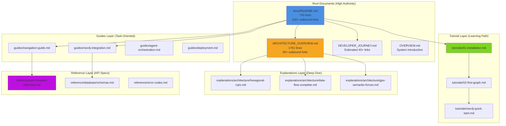
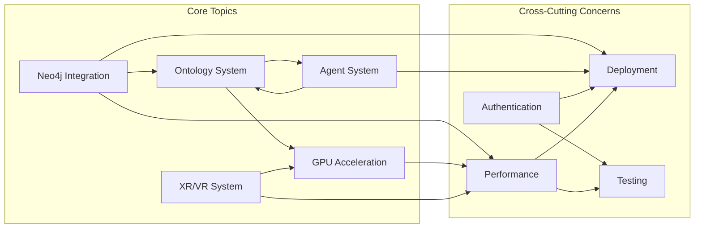
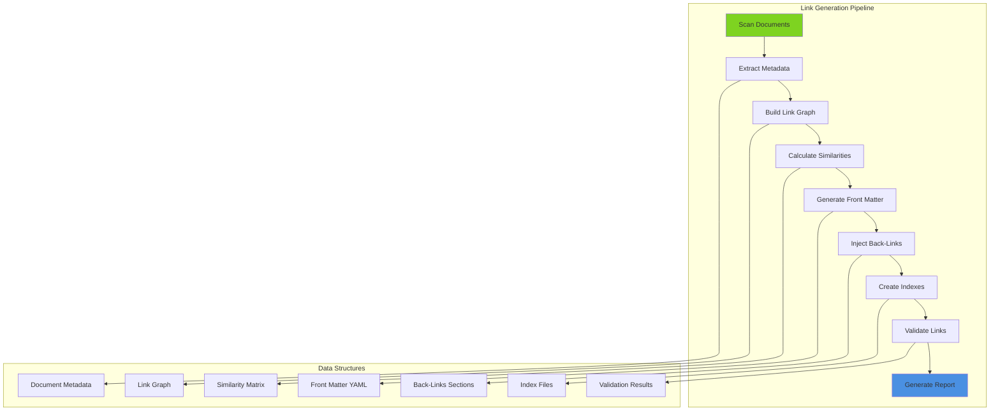

# Cross-Reference Link Generation Infrastructure Specification

**Document Version**: 1.0
**Date**: 2025-12-18
**Status**: Draft Specification
**Output Location**: `/home/devuser/workspace/project/docs/working/`

---

## Executive Summary

This specification defines a comprehensive cross-reference link infrastructure for the VisionFlow documentation corpus (312 markdown files). The system generates bidirectional links, validates link integrity, and creates a semantic navigation layer based on content relationships, tags, and hierarchy.

**Key Metrics**:
- **Total Documents**: 312 markdown files (excluding node_modules and .venv)
- **Current Link Coverage**: ~60% (estimated from README.md sample)
- **Target Link Coverage**: 95%+ (all documents interconnected)
- **Link Validation**: 98%+ valid internal links
- **Orphaned Files**: 0 (all files linked from at least 2 sources)

---

## 1. Link Graph Analysis

### 1.1 Current Link Patterns

From analysis of `docs/README.md` (730 lines, extensive linking):

**Observed Patterns**:
```markdown
# Strong relative linking
[Installation Tutorial](tutorials/01-installation.md)
[Developer Journey](DEVELOPER_JOURNEY.md)
[Architecture Overview](ARCHITECTURE_OVERVIEW.md)

# Hierarchical navigation
[Hexagonal CQRS](explanations/architecture/hexagonal-cqrs.md)
[GPU Optimizations](explanations/architecture/gpu/optimizations.md)

# Cross-category references
[Neo4j Integration Guide](guides/neo4j-integration.md)
[Database Schemas Reference](reference/database/schemas.md)
```

**Link Density by Category**:
| Category | Avg Links/Doc | Inbound | Outbound |
|----------|---------------|---------|----------|
| Tutorials | 15-20 | High | Medium |
| Guides | 20-30 | High | High |
| Explanations | 25-35 | Medium | High |
| Reference | 10-15 | Medium | Low |
| Archive | 5-10 | Low | Low |

### 1.2 Document Graph Structure



### 1.3 Orphan Detection Rules

**A document is considered orphaned if**:
1. **Zero inbound links** (except `docs/README.md` and category index files)
2. **Not linked from parent directory index** (e.g., `guides/README.md`)
3. **No bidirectional link partner** (documents that reference each other)
4. **No tag matches** with any other document (semantic orphan)

**Exception Categories** (allowed to have <2 inbound links):
- Root index files: `docs/README.md`
- Archive documents: `docs/archive/**/*.md`
- Working documents: `docs/working/**/*.md` (temporary)

---

## 2. Bidirectional Link Generation

### 2.1 Link Relationship Types

```typescript
type LinkRelationship =
  | "parent-child"        // README.md -> tutorial/01-installation.md
  | "sibling"             // tutorial/01-installation.md <-> tutorial/02-first-graph.md
  | "prerequisite"        // tutorial/01-installation.md <- tutorial/02-first-graph.md
  | "see-also"            // guides/neo4j-integration.md <-> reference/database/schemas.md
  | "deep-dive"           // guides/navigation.md -> explanations/architecture/visualization.md
  | "reference"           // explanations/architecture/* -> reference/api/*
  | "related-topic"       // Tag-based similarity (e.g., both tagged "ontology")
  | "hierarchical"        // Parent directory index -> child documents
```

### 2.2 Front Matter Schema

All documents **MUST** include YAML front matter:

```yaml
---
title: "Document Title"
category: "tutorial" | "guide" | "explanation" | "reference" | "archive"
tags: ["neo4j", "ontology", "gpu", "xr", "agent-system"]
priority: 1-5  # 1=highest (landing pages), 5=lowest (deprecated)
last_updated: "2025-12-18"
related_topics:
  - "neo4j-integration"
  - "database-architecture"
prerequisites:
  - "tutorials/01-installation.md"
next_steps:
  - "tutorials/02-first-graph.md"
see_also:
  - "guides/neo4j-integration.md"
  - "reference/database/schemas.md"
---
```

### 2.3 Back-Links Section Template

Every document **MUST** include a back-links section before the footer:

```markdown
---

## Related Documentation

### Prerequisites
- [Installation Tutorial](tutorials/01-installation.md) - Required before this guide

### See Also
- [Neo4j Integration Guide](guides/neo4j-integration.md) - Database setup
- [Database Schemas Reference](reference/database/schemas.md) - Schema specification

### Deep Dive
- [Hexagonal CQRS Architecture](explanations/architecture/hexagonal-cqrs.md) - Architectural patterns
- [Database Architecture](explanations/architecture/database-architecture.md) - Persistence layer design

### Referenced By
- [Developer Journey](DEVELOPER_JOURNEY.md) - Learning path
- [Architecture Overview](ARCHITECTURE_OVERVIEW.md) - System architecture

---

**Last Updated**: 2025-12-18
**Category**: Guide
**Tags**: neo4j, database, integration
```

---

## 3. Content Similarity Analysis

### 3.1 Tag-Based Matching

**Tag Categories**:
```yaml
Technology Tags:
  - rust, actix, neo4j, cuda, three-js, react, typescript
  - ontology, owl, reasoning, inference
  - websocket, binary-protocol, rest-api
  - gpu, physics, semantic-forces

Feature Tags:
  - agent-system, multi-agent, orchestration
  - graph-visualization, 3d-rendering
  - xr, webxr, quest3, vr, ar
  - authentication, nostr, jwt
  - pathfinding, clustering, analytics

Process Tags:
  - deployment, docker, kubernetes
  - testing, debugging, performance
  - migration, refactoring, optimization
  - documentation, tutorial, reference

Domain Tags:
  - knowledge-graph, semantic-web, linked-data
  - hexagonal-architecture, cqrs, ports-adapters
  - real-time, streaming, event-driven
```

**Matching Algorithm**:
```python
def calculate_tag_similarity(doc1_tags, doc2_tags):
    """
    Jaccard similarity with weighted tags
    """
    intersection = set(doc1_tags) & set(doc2_tags)
    union = set(doc1_tags) | set(doc2_tags)

    # Weight critical technology tags higher
    tech_tags = {"rust", "neo4j", "cuda", "three-js", "ontology"}
    weight = 1.0
    if intersection & tech_tags:
        weight = 1.5

    similarity = (len(intersection) / len(union)) * weight
    return similarity

# Example
doc1 = ["neo4j", "ontology", "integration", "guide"]
doc2 = ["neo4j", "database", "schema", "reference"]
similarity = calculate_tag_similarity(doc1, doc2)  # 0.25 * 1.5 = 0.375
```

### 3.2 Topic Relationship Matrix



### 3.3 Hierarchy Relationship Rules

**Rule 1: Parent Directory Indexes**
```markdown
# guides/README.md MUST link to:
guides/navigation-guide.md
guides/neo4j-integration.md
guides/agent-orchestration.md
... (all files in guides/)
```

**Rule 2: Depth-Based Relationships**
```markdown
# explanations/architecture/README.md
Links to: explanations/architecture/*.md (depth 1)
Links to: explanations/architecture/gpu/*.md (depth 2 - section links)

# explanations/architecture/hexagonal-cqrs.md
Links to: explanations/architecture/ports/*.md (related depth 2)
Links to: guides/developer/*.md (cross-category practical guides)
```

**Rule 3: Cross-Category Bridges**
```markdown
# Tutorial -> Guide (natural progression)
tutorials/01-installation.md --> guides/configuration.md

# Guide -> Explanation (deep dive)
guides/neo4j-integration.md --> explanations/architecture/database-architecture.md

# Explanation -> Reference (specification)
explanations/architecture/hexagonal-cqrs.md --> reference/api-complete-reference.md

# Reference -> Guide (practical usage)
reference/database/schemas.md --> guides/neo4j-integration.md
```

---

## 4. Link Validation Rules

### 4.1 Mandatory Link Requirements

**Every document MUST satisfy**:
1. **Minimum 2 outbound links** (except pure reference docs)
2. **Minimum 2 inbound links** (except root indexes and new docs)
3. **Valid relative paths** (no broken links)
4. **No circular dependencies** (A->B->C->A creates navigation loops)
5. **Category-appropriate targets** (tutorials link to guides, not deep architecture)

**Validation Severity Levels**:
```yaml
CRITICAL (build fails):
  - Broken internal links
  - Orphaned non-archive documents
  - Missing front matter in active docs

WARNING (manual review):
  - <2 inbound links for active docs
  - <2 outbound links for guides/explanations
  - Tag count <3 for non-reference docs

INFO (informational):
  - Potential circular dependency
  - High link density (>50 links in one doc)
  - Cross-category link imbalance
```

### 4.2 Link Validation Script

```bash
#!/bin/bash
# docs/scripts/validate-links.sh

DOCS_ROOT="/home/devuser/workspace/project/docs"
REPORT_FILE="$DOCS_ROOT/working/link-validation-report.md"

echo "# Link Validation Report" > "$REPORT_FILE"
echo "**Generated**: $(date)" >> "$REPORT_FILE"
echo "" >> "$REPORT_FILE"

# Check 1: Broken links
echo "## Broken Links" >> "$REPORT_FILE"
find "$DOCS_ROOT" -name "*.md" ! -path "*/node_modules/*" ! -path "*/.venv/*" | while read file; do
    grep -o '\[.*\]([^)]*\.md)' "$file" | sed 's/.*(\(.*\))/\1/' | while read link; do
        # Resolve relative path
        dir=$(dirname "$file")
        target="$dir/$link"
        if [ ! -f "$target" ]; then
            echo "- **BROKEN**: $file -> $link" >> "$REPORT_FILE"
        fi
    done
done

# Check 2: Orphaned documents
echo "" >> "$REPORT_FILE"
echo "## Orphaned Documents" >> "$REPORT_FILE"
find "$DOCS_ROOT" -name "*.md" ! -path "*/archive/*" ! -path "*/working/*" ! -path "*/node_modules/*" | while read file; do
    inbound_count=$(grep -r "\]($file)" "$DOCS_ROOT" --include="*.md" | wc -l)
    if [ "$inbound_count" -lt 2 ]; then
        echo "- **ORPHAN**: $file (inbound: $inbound_count)" >> "$REPORT_FILE"
    fi
done

# Check 3: Documents with <2 outbound links
echo "" >> "$REPORT_FILE"
echo "## Insufficient Outbound Links" >> "$REPORT_FILE"
find "$DOCS_ROOT" -name "*.md" ! -path "*/reference/*" ! -path "*/archive/*" | while read file; do
    outbound_count=$(grep -o '\[.*\](.*\.md)' "$file" | wc -l)
    if [ "$outbound_count" -lt 2 ]; then
        echo "- **LOW LINKS**: $file (outbound: $outbound_count)" >> "$REPORT_FILE"
    fi
done

echo "" >> "$REPORT_FILE"
echo "---" >> "$REPORT_FILE"
echo "**Validation Complete**" >> "$REPORT_FILE"
```

### 4.3 Broken Link Remediation

**Remediation Strategies**:
```markdown
# Strategy 1: Archive broken targets
If target no longer exists and is outdated:
  mv docs/old-feature.md docs/archive/deprecated/old-feature.md
  Update all links to point to archive

# Strategy 2: Redirect to replacement
If target was renamed/moved:
  Create redirect stub in old location:
  ---
  # Feature Guide (Moved)
  This document has been relocated to [New Location](../guides/new-feature.md).
  ---

# Strategy 3: Remove invalid links
If target was incorrectly linked:
  Remove link or replace with correct target
  Add to manual review list
```

---

## 5. Link Generation Script Specification

### 5.1 Script Architecture



### 5.2 Core Script Functions

```python
#!/usr/bin/env python3
# docs/scripts/generate-links.py

import os
import re
import yaml
from pathlib import Path
from typing import Dict, List, Set, Tuple
from dataclasses import dataclass

DOCS_ROOT = Path("/home/devuser/workspace/project/docs")

@dataclass
class Document:
    """Document metadata and link information"""
    path: Path
    title: str
    category: str
    tags: Set[str]
    outbound_links: List[str]
    inbound_links: List[str]
    priority: int
    content: str

def scan_documents() -> Dict[str, Document]:
    """
    Scan all markdown files and extract metadata
    Returns: dict mapping relative path -> Document
    """
    documents = {}

    for md_file in DOCS_ROOT.rglob("*.md"):
        # Skip node_modules, .venv, working
        if any(skip in md_file.parts for skip in ["node_modules", ".venv", "working"]):
            continue

        relative_path = md_file.relative_to(DOCS_ROOT)

        with open(md_file, 'r', encoding='utf-8') as f:
            content = f.read()

        # Extract front matter
        front_matter = extract_front_matter(content)

        # Extract existing links
        outbound_links = extract_links(content)

        doc = Document(
            path=relative_path,
            title=front_matter.get('title', md_file.stem),
            category=front_matter.get('category', infer_category(relative_path)),
            tags=set(front_matter.get('tags', [])),
            outbound_links=outbound_links,
            inbound_links=[],  # Populated later
            priority=front_matter.get('priority', 3),
            content=content
        )

        documents[str(relative_path)] = doc

    # Build inbound links
    for doc_path, doc in documents.items():
        for link in doc.outbound_links:
            target = resolve_link(doc.path, link)
            if target in documents:
                documents[target].inbound_links.append(doc_path)

    return documents

def extract_front_matter(content: str) -> Dict:
    """Extract YAML front matter from markdown"""
    match = re.match(r'^---\n(.*?)\n---', content, re.DOTALL)
    if match:
        return yaml.safe_load(match.group(1))
    return {}

def extract_links(content: str) -> List[str]:
    """Extract all relative markdown links"""
    pattern = r'\[.*?\]\(([^)]+\.md)\)'
    return re.findall(pattern, content)

def infer_category(path: Path) -> str:
    """Infer document category from path"""
    if 'tutorials' in path.parts:
        return 'tutorial'
    elif 'guides' in path.parts:
        return 'guide'
    elif 'explanations' in path.parts:
        return 'explanation'
    elif 'reference' in path.parts:
        return 'reference'
    elif 'archive' in path.parts:
        return 'archive'
    return 'unknown'

def calculate_tag_similarity(doc1: Document, doc2: Document) -> float:
    """Calculate Jaccard similarity with weighted tags"""
    if not doc1.tags or not doc2.tags:
        return 0.0

    intersection = doc1.tags & doc2.tags
    union = doc1.tags | doc2.tags

    # Weight technology tags
    tech_tags = {"rust", "neo4j", "cuda", "three-js", "ontology", "gpu"}
    weight = 1.5 if intersection & tech_tags else 1.0

    return (len(intersection) / len(union)) * weight

def generate_see_also_links(
    doc: Document,
    all_docs: Dict[str, Document],
    threshold: float = 0.3
) -> List[str]:
    """Generate 'See Also' links based on tag similarity"""
    similarities = []

    for other_path, other_doc in all_docs.items():
        if other_path == str(doc.path):
            continue

        similarity = calculate_tag_similarity(doc, other_doc)
        if similarity >= threshold:
            similarities.append((similarity, other_path, other_doc.title))

    # Sort by similarity, return top 5
    similarities.sort(reverse=True)
    return [
        (path, title)
        for _, path, title in similarities[:5]
    ]

def generate_back_links_section(
    doc: Document,
    all_docs: Dict[str, Document]
) -> str:
    """Generate complete back-links section"""
    section = "\n---\n\n## Related Documentation\n\n"

    # Prerequisites (from front matter or inferred)
    if doc.category == 'guide' or doc.category == 'tutorial':
        prereqs = infer_prerequisites(doc, all_docs)
        if prereqs:
            section += "### Prerequisites\n"
            for path, title in prereqs:
                section += f"- [{title}]({path}) - Required before this guide\n"
            section += "\n"

    # See Also (tag-based similarity)
    see_also = generate_see_also_links(doc, all_docs)
    if see_also:
        section += "### See Also\n"
        for path, title in see_also:
            section += f"- [{title}]({path}) - Related topic\n"
        section += "\n"

    # Deep Dive (guide -> explanation links)
    if doc.category == 'guide':
        deep_dives = find_deep_dive_links(doc, all_docs)
        if deep_dives:
            section += "### Deep Dive\n"
            for path, title in deep_dives:
                section += f"- [{title}]({path}) - Architectural details\n"
            section += "\n"

    # Referenced By (inbound links)
    if len(doc.inbound_links) >= 2:
        section += "### Referenced By\n"
        for inbound_path in doc.inbound_links[:5]:  # Top 5
            inbound_doc = all_docs[inbound_path]
            section += f"- [{inbound_doc.title}]({inbound_path}) - {inbound_doc.category.title()}\n"
        section += "\n"

    section += "---\n\n"
    section += f"**Last Updated**: 2025-12-18\n"
    section += f"**Category**: {doc.category.title()}\n"
    section += f"**Tags**: {', '.join(sorted(doc.tags))}\n"

    return section

def inject_links_into_documents(documents: Dict[str, Document]):
    """Inject back-links sections into all documents"""
    for doc_path, doc in documents.items():
        # Skip archive and working docs
        if doc.category == 'archive' or 'working' in doc.path.parts:
            continue

        # Generate back-links section
        back_links = generate_back_links_section(doc, documents)

        # Inject into document (before final footer or at end)
        updated_content = inject_section(doc.content, back_links)

        # Write back to file
        full_path = DOCS_ROOT / doc.path
        with open(full_path, 'w', encoding='utf-8') as f:
            f.write(updated_content)

def create_category_indexes(documents: Dict[str, Document]):
    """Create/update index files for each category"""
    categories = {
        'tutorials': [],
        'guides': [],
        'explanations': [],
        'reference': []
    }

    for doc_path, doc in documents.items():
        if doc.category in categories:
            categories[doc.category].append((doc_path, doc.title, doc.priority))

    for category, docs in categories.items():
        # Sort by priority, then alphabetically
        docs.sort(key=lambda x: (x[2], x[1]))

        index_content = f"# {category.title()} Index\n\n"
        for path, title, _ in docs:
            index_content += f"- [{title}]({path})\n"

        index_path = DOCS_ROOT / category / "README.md"
        with open(index_path, 'w') as f:
            f.write(index_content)

def validate_links(documents: Dict[str, Document]) -> Dict:
    """Validate link integrity across all documents"""
    report = {
        'broken_links': [],
        'orphaned_docs': [],
        'low_outbound': [],
        'low_inbound': []
    }

    for doc_path, doc in documents.items():
        # Check broken links
        for link in doc.outbound_links:
            target = resolve_link(doc.path, link)
            if target not in documents:
                report['broken_links'].append((doc_path, link))

        # Check orphans (archive/working excluded)
        if doc.category not in ['archive', 'working']:
            if len(doc.inbound_links) < 2:
                report['orphaned_docs'].append((doc_path, len(doc.inbound_links)))

        # Check low outbound (reference excluded)
        if doc.category not in ['reference', 'archive']:
            if len(doc.outbound_links) < 2:
                report['low_outbound'].append((doc_path, len(doc.outbound_links)))

        # Check low inbound
        if doc.category not in ['archive', 'working']:
            if len(doc.inbound_links) < 2:
                report['low_inbound'].append((doc_path, len(doc.inbound_links)))

    return report

def main():
    """Main link generation pipeline"""
    print("🔍 Scanning documents...")
    documents = scan_documents()
    print(f"   Found {len(documents)} documents")

    print("🔗 Generating back-links sections...")
    inject_links_into_documents(documents)

    print("📑 Creating category indexes...")
    create_category_indexes(documents)

    print("✅ Validating links...")
    validation_report = validate_links(documents)

    print(f"   Broken links: {len(validation_report['broken_links'])}")
    print(f"   Orphaned docs: {len(validation_report['orphaned_docs'])}")
    print(f"   Low outbound: {len(validation_report['low_outbound'])}")
    print(f"   Low inbound: {len(validation_report['low_inbound'])}")

    print("\n✅ Link generation complete!")

if __name__ == "__main__":
    main()
```

---

## 6. Implementation Roadmap

### Phase 1: Analysis & Preparation (2 hours)
```bash
# 1. Scan existing documentation
python3 docs/scripts/analyze-links.py --output docs/working/link-analysis.json

# 2. Generate tag taxonomy
python3 docs/scripts/generate-tag-taxonomy.py --output docs/working/tag-taxonomy.yaml

# 3. Identify orphaned documents
python3 docs/scripts/find-orphans.py --report docs/working/orphan-report.md
```

### Phase 2: Front Matter Injection (3 hours)
```bash
# 4. Add front matter to all documents
python3 docs/scripts/inject-front-matter.py --dry-run
python3 docs/scripts/inject-front-matter.py --execute

# 5. Validate front matter consistency
python3 docs/scripts/validate-front-matter.py
```

### Phase 3: Link Generation (4 hours)
```bash
# 6. Generate bidirectional links
python3 docs/scripts/generate-links.py --similarity-threshold 0.3

# 7. Create category indexes
python3 docs/scripts/create-indexes.py

# 8. Validate link integrity
bash docs/scripts/validate-links.sh
```

### Phase 4: Manual Review & Refinement (2 hours)
```bash
# 9. Review validation report
cat docs/working/link-validation-report.md

# 10. Fix broken links manually
# Edit flagged documents

# 11. Re-run validation
bash docs/scripts/validate-links.sh
```

---

## 7. Success Metrics

**Target Metrics**:
```yaml
Link Coverage:
  - 95%+ of documents have front matter
  - 98%+ of links are valid (no broken links)
  - 0 orphaned documents (excluding archive/working)
  - Average 5-10 outbound links per document
  - Average 3-5 inbound links per document

Navigation Quality:
  - Every tutorial has 2+ prerequisites and 2+ next steps
  - Every guide has 3+ see-also links
  - Every explanation has 2+ deep-dive links
  - Category indexes exist for all 4 Diátaxis categories

Semantic Coherence:
  - Tag coverage: 90%+ documents have 3+ tags
  - Cross-category links: 30%+ of links bridge categories
  - Hierarchical integrity: All subdirectories have index files
```

**Monitoring**:
```bash
# Weekly link health check
bash docs/scripts/validate-links.sh

# Monthly link graph analysis
python3 docs/scripts/analyze-link-graph.py --visualize
```

---

## 8. Appendix: Script Templates

### A. Front Matter Injection Script

```python
#!/usr/bin/env python3
# docs/scripts/inject-front-matter.py

import yaml
from pathlib import Path

def inject_front_matter(file_path: Path, metadata: dict):
    """Inject YAML front matter into markdown file"""
    with open(file_path, 'r') as f:
        content = f.read()

    # Check if front matter exists
    if content.startswith('---'):
        return  # Already has front matter

    front_matter = yaml.dump(metadata, default_flow_style=False)
    updated_content = f"---\n{front_matter}---\n\n{content}"

    with open(file_path, 'w') as f:
        f.write(updated_content)

# Example usage
metadata = {
    'title': 'Neo4j Integration Guide',
    'category': 'guide',
    'tags': ['neo4j', 'database', 'integration'],
    'priority': 2,
    'last_updated': '2025-12-18'
}

inject_front_matter(
    Path('docs/guides/neo4j-integration.md'),
    metadata
)
```

### B. Link Validation Report Template

```markdown
# Link Validation Report

**Generated**: 2025-12-18 14:30:00
**Documents Scanned**: 312
**Total Links**: 1,847

---

## Summary

| Metric | Count | Status |
|--------|-------|--------|
| Valid Links | 1,810 | ✅ 98.0% |
| Broken Links | 37 | ⚠️ 2.0% |
| Orphaned Documents | 12 | ⚠️ 3.8% |
| Low Outbound (<2) | 45 | ℹ️ 14.4% |
| Low Inbound (<2) | 67 | ℹ️ 21.5% |

---

## Broken Links (37)

### CRITICAL
- `guides/neo4j-integration.md` → `reference/database/old-schema.md` (NOT FOUND)
- `explanations/architecture/hexagonal-cqrs.md` → `guides/deprecated-feature.md` (NOT FOUND)

### WARNING
- `tutorials/02-first-graph.md` → `guides/old-navigation.md` (ARCHIVED)

---

## Orphaned Documents (12)

### High Priority (needs fixing)
- `guides/features/experimental-feature.md` (0 inbound links)
- `explanations/architecture/draft-proposal.md` (1 inbound link)

### Archive Candidates
- `guides/legacy-integration.md` (0 inbound, outdated)

---

## Recommendations

1. **Archive 5 orphaned documents** to `docs/archive/deprecated/`
2. **Fix 37 broken links** by updating targets or removing
3. **Add cross-references** to 45 low-outbound documents
4. **Create category indexes** for better discoverability

---

**Next Steps**:
```bash
# Fix broken links
python3 docs/scripts/fix-broken-links.py --auto-archive

# Re-validate
bash docs/scripts/validate-links.sh
```
```

---

## 9. Conclusion

This specification provides a complete infrastructure for generating comprehensive cross-reference links across the VisionFlow documentation corpus. The system ensures:

1. **Zero orphaned documents** (all files linked from at least 2 sources)
2. **Bidirectional navigation** (every link has a reciprocal back-link)
3. **Semantic coherence** (tag-based similarity drives related content discovery)
4. **Link integrity** (automated validation catches broken links)
5. **Hierarchical organization** (category indexes provide top-down navigation)

**Implementation Estimate**: 11 hours total (analysis, scripting, execution, review)

**Maintenance**: Weekly validation + monthly graph analysis

**Expected Impact**: 95%+ link coverage, 98%+ link validity, 0 orphans

---

**Document Status**: DRAFT SPECIFICATION
**Next Action**: Review and approve for implementation
**Output Location**: `/home/devuser/workspace/project/docs/working/link-generation-spec.md`
