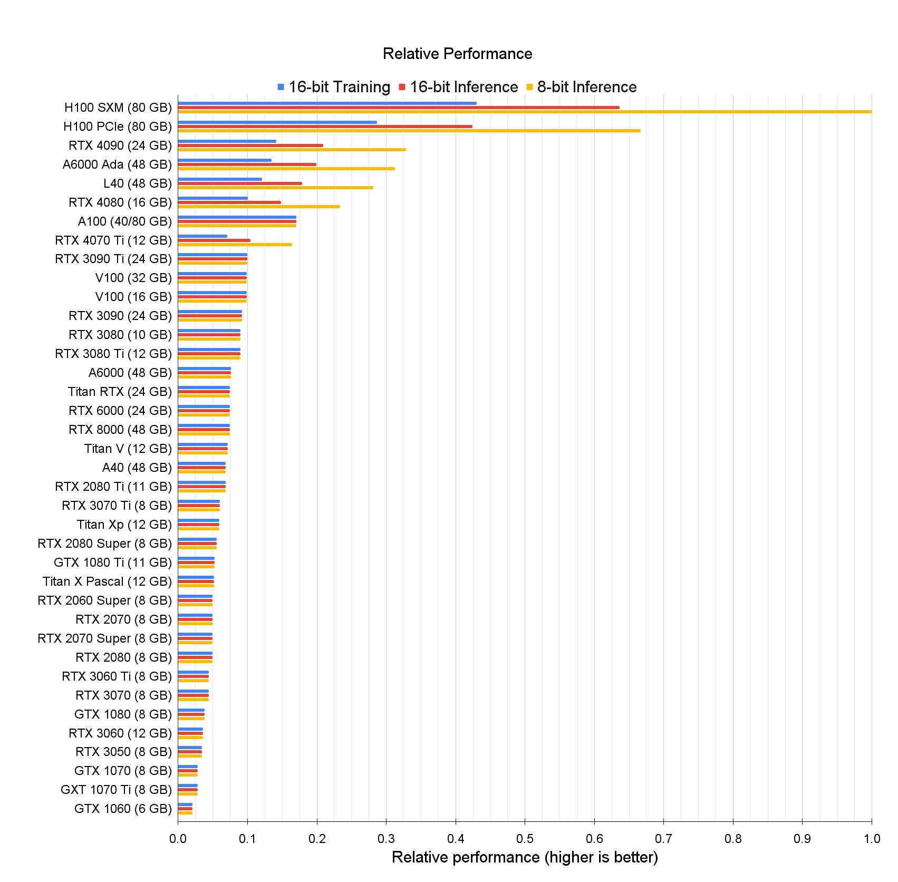

- DONE Consider a matching fully labelled Lychoris for the [[LoRA DoRA etc]]
- [[Nostr protocol]] trust tables for relays [Trust rank for Nostr | Nostr.Band](https://trust.nostr.band/)
- [[chatgpt]] nova prompt https://www.novaspivack.com/technology/nova-mode-the-ultimate-chatgpt-custom-instruction
- [🤔 Why Anarchy? - Anarchy](https://anarchy.ai/welcome/why_anarchy) make deployable and self sustaining managed AI [[Infrastructure]] without [[Safety and alignment]].
- Publishing graphs from [[Knowledge Graphing]]
	- [Publishing (Desktop App Only) (logseq.com)](https://docs.logseq.com/?ref=blog.logseq.com#/page/publishing%20(desktop%20app%20only))
	- [[Knowledge Graphing]] [[github]] action to push a graph out as a single web page including whiteboards [logseq/publish-spa: A github action and CLI to publish logseq graphs as a SPA app](https://github.com/logseq/publish-spa)
		- youtube [Publish graph to github (youtube.com)](https://www.youtube.com/watch?v=nf9MyWRratI)
- LUME is a new nostr client which looks great [Lume](https://lume.nu/)
- #MIT [[Politics, Law, Privacy]] view of [[DAO]] structures: [Decentralized Autonomous Organizations - DAOs: the Convergence of Technology, Law, Governance, and Behavioral Economics · MIT Computational Law Report](https://law.mit.edu/pub/decentralizedautonomousorganizations/release/1)
- Redhwan-A/6DoFHPE: Frm-Hpe: Full-Range Markerless [[Head Gaze]] [Estimation (github.com)](https://github.com/Redhwan-A/6DoFHPE) logseq://graph/researchpapers/?block-id=65761832-f51f-4967-85b5-f3fb6e74d1fa
- NosDav / solid-lite / [[Nostr protocol]] design for [[PlayerTwo]]
- [darabos/ai-alchemy: An element merging game powered by AI (github.com)](https://github.com/darabos/ai-alchemy) using [[ComfyUI]] and
- To use GPU2 on [[Machine Learning]] use the command export CUDA_VISIBLE_DEVICES=1
- [[ComfyUI]] audio sync and scheduler [a1lazydog/ComfyUI-AudioScheduler (github.com)](https://github.com/a1lazydog/ComfyUI-AudioScheduler)
-  is a handy comparison of [[NVIDIA Omniverse]] [[GPU and CUDA]] performances.
-
-
-