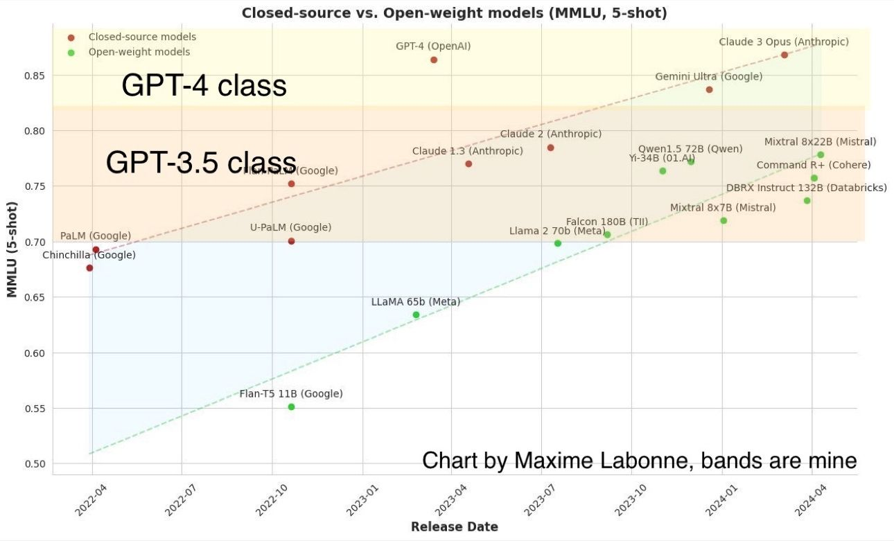

- [[Try to find and store the ontology chat sessions]] [[Metaverse Ontology]] [[SHOULD]]
- Make a 2D poster for the paper
- Make a diagram for the metaverse mycelium
	- Contract agents on the edge (assist human actors in setting up their preferences, tolerances, limit choices)
	- Scene agents (governance, FIFO, cryptography, warnings, reputation management, real time language translation, enforcement).
		- Constantly outputting up-to-date scene ontology reflecting the settings negotiated with the user base of the space (feeds transfer agents)
	- Transfer agents (translation, ingress, egress, web2?) reputation transfer and adaptation, token and money swaps (feeds legal edge agents)
		- Human and machine readable Linked-JSON automatic arbitration between end points, automatically translating as best effort between adjacent ontologied
		- Jurisdictional / Legal agents on the edge (provide continuous access to non private human readable transfer agent Linked-JSON)
- [[2404.08801] Megalodon: Efficient LLM Pretraining and Inference with Unlimited Context Length (arxiv.org)](https://arxiv.org/abs/2404.08801) [[Large language models]] [[Context Window]] [[Model Optimisation and Performance]]
- [First Look at Vertex AI Agent Builder | Google's AI Agent Playbook - YouTube](https://www.youtube.com/watch?v=55QTd3rO7zw) [[Google]] [[AI Agent System]]
- [Getting Started | Logseq Tips & Tricks (gitbook.io)](https://unofficial-logseq-docs.gitbook.io/unofficial-logseq-docs/general/getting-started) [[Logseq]] tips and tricks
- [tyllen on X: "Excited to introduce a new project I've been working on called Payman! Payman is an AI Agent tool that gives Agents the ability to pay people for tasks they cannot do themselves. While many people imagine a future where humans pay AI agents for services they want completed,… https://t.co/tyigiD0wit" / X (twitter.com)](https://twitter.com/0xTyllen/status/1779972538745106446) [[AI Agent System]]
- [API Reference - OpenAI API](https://platform.openai.com/docs/api-reference/batch/create) [[OpenAI]] cheaper batch jobs
- [Paper page - Ctrl-Adapter: An Efficient and Versatile Framework for Adapting Diverse Controls to Any Diffusion Model (huggingface.co)](https://huggingface.co/papers/2404.09967) [[Controlnet and similar]] but for any diffusion model in any domain
- [[Large language models]] [[Open Source]] [[Open Generative AI tools]] [[Proprietary Large Language Models]] comparison table
	- 
- UK government report of Foundation [[Large language models]]  [[SHOULD]]
- [[IPAdapter]] based [[style transfer]] for facial expressions tutorial [[Face Swap]] [Combine FaceID and Facial Expressions with IPAdapter & Controlnet - YouTube](https://www.youtube.com/watch?v=IlOOzmQZBzU&t=2s)
- [Vid2Avatar: 3D Avatar Reconstruction from Videos in the Wild via Self-supervised Scene Decomposition (moygcc.github.io)](https://moygcc.github.io/vid2avatar/) [[Human tracking and SLAM capture]] [[Humans, Avatars , Character]]
- [[Stable Video Diffusion]] tween workflow of some sort with workflow
	- [A to B tweens | ComfyUI Workflow (openart.ai)](https://openart.ai/workflows/weasel_thankful_16/a-to-b-tweens/pT73YKwZrPhblTKCMc0q)
	- [HASZD A to B tweens : r/comfyui (reddit.com)](https://www.reddit.com/r/comfyui/comments/1c5mt6w/haszd_a_to_b_tweens/)
- New LLM batch hits the web.
	- [Zamba — Zyphra](https://www.zyphra.com/zamba) [[State Space and Other Approaches]] [[Large language models]]
	- WizardLM-2 [[Large language models]] [[Mixture of Experts]] [[Open Source]] [[Open Generative AI tools]] excellent scores [[SHOULD]]
	- [Cheaper, Better, Faster, Stronger | Mistral AI | Frontier AI in your hands](https://mistral.ai/news/mixtral-8x22b/) [[Mistral and Mixtral]] [[Mixture of Experts]] 20B models is very performant. Instruct model released
- [[Metaverse as Markets]] [[Metaverse and Telecollaboration]] report [VR headset unit sales worldwide 2024 | Statista](https://www.statista.com/statistics/677096/vr-headsets-worldwide/) on VR headset market penetration
-
- [MultiModal RAG for Advanced Video Processing with LlamaIndex & LanceDB — LlamaIndex, Data Framework for LLM Applications](https://www.llamaindex.ai/blog/multimodal-rag-for-advanced-video-processing-with-llamaindex-lancedb-33be4804822e) [[Multimodal]] [[Knowledge Graphing]] [[AI Video]]
- Blackrock shilling [[Bitcoin]] training page [Investing with bitcoin: Insights for Starters | iShares-BlackRock](https://www.ishares.com/us/education/investing-with-bitcoin)
- Openagents [[AI Agent System]] first three in the wild [OpenAgents ⚡ on X: "Here's the first 3 agent plugins; will add to this list as more come in Soon you'll be able to pull in plugins like these to agentic workflows via the OpenAgents UI and chat with them like our other models Plugin authors will earn rev-share on any paid usage, without the… https://t.co/zjdoUzyycm" / X (twitter.com)](https://twitter.com/OpenAgentsInc/status/1780642250411679938)
- New electric Boston Dynamics [[Robot]] [An Electric New Era for Atlas | Boston Dynamics](https://bostondynamics.com/blog/electric-new-era-for-atlas/)
- [[Daily Log]]
	- DONE 10:00-11:30 Withington community hospital dermatology]