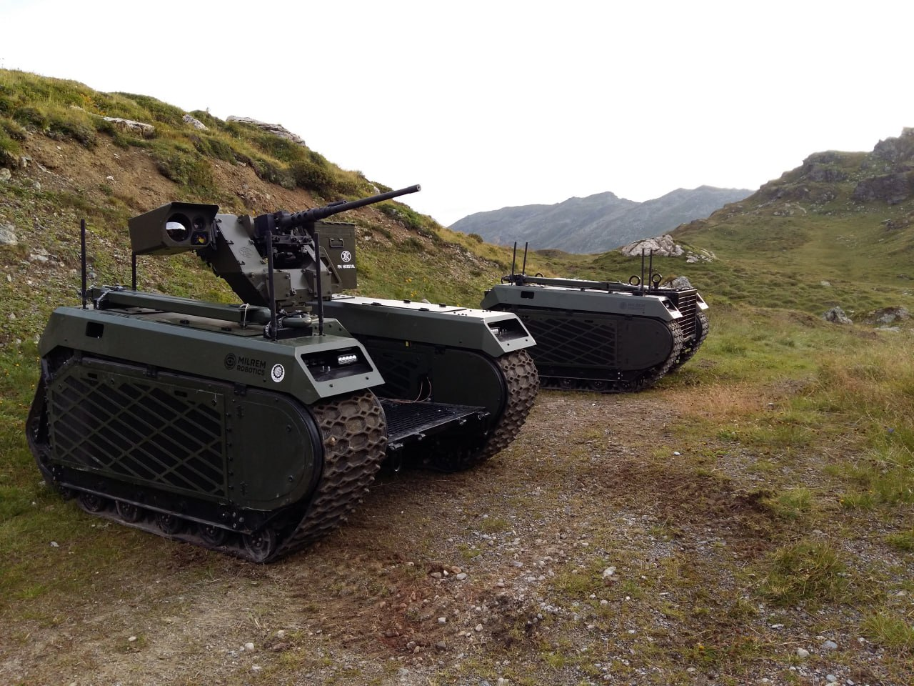

- [[Server Setup]]
- [[PEOPLE]] [[Melvin Carvalho]] [[AI Agent System]] [[Nostr protocol]] [melvincarvalho / Melvin Carvalho is on Nostr (npub.info)](https://npub.info/npub1melv683fw6n2mvhl5h6dhqd8mqfv3wmxnz4qph83ua4dk4006ezsrt5c24)
- [[Hardware and Edge]] [Introducing Trillium, sixth-generation TPUs | Google Cloud Blog](https://cloud.google.com/blog/products/compute/introducing-trillium-6th-gen-tpus?e=48754805&utm_campaign=66424ee1d00c6d00015f0f98&utm_content=6643ac0e89695500013c35ac&utm_medium=smarpshare&utm_source=linkedin)
- [CAT3D: Create Anything in 3D with Multi-View Diffusion Models](https://cat3d.github.io/) [[3D and 4D]]
-
- [AliceVision | Meshroom - 3D Reconstruction Software](https://alicevision.org/#meshroom) [[3D and 4D]] [[Open Source]]
- [Announcement: NostrAssets upgrades to Lnfi | by Lnfi Network (formerly NostrAssets) | May, 2024 | Medium](https://lnfinetwork.medium.com/announcement-nostrassets-upgrades-to-lnfi-f03b15a79372) [[Nostr protocol]]
- [HigherOrderCO/Bend: A massively parallel, high-level programming language (github.com)](https://github.com/HigherOrderCO/Bend) [[Distributed Computing]] [[WebDev and Consumer Tooling]]
- [Experimental Moondream WebGPU - a Hugging Face Space by Xenova](https://huggingface.co/spaces/Xenova/experimental-moondream-webgpu) [[Hardware and Edge]] [[Large language models]] [[WebDev and Consumer Tooling]]
- [[Machine Vision]] [[Virtual Production]] [Netflix/OpenVPCal (github.com)](https://github.com/Netflix/OpenVPCal)
- [[AI Defence Doc]]
- [OpenProject - Open Source Project Management Software](https://www.openproject.org/) [[Open Source]] [[Projects]]
- [Supreme Court Ruling Fuels Fears of Police Overreach Amidst Crime Drop and Increased Funding (citizenschronicle.org)](https://www.citizenschronicle.org/p/supreme-court-ruling-fuels-fears) [[Politics, Law, Privacy]]
- [Many-Shot In-Context Learning in Multimodal Foundation Models (arxiv.org)](https://arxiv.org/abs/2405.09798) [[few shot]] [[Training and fine tuning]] [[Large language models]] [[Prompt Engineering]]
- [llama-3-70b-instruct-gradient-1048k.Q4_K_M.gguf · crusoeai/Llama-3-70B-Instruct-Gradient-1048k-GGUF at main (huggingface.co)](https://huggingface.co/crusoeai/Llama-3-70B-Instruct-Gradient-1048k-GGUF/blob/main/llama-3-70b-instruct-gradient-1048k.Q4_K_M.gguf) [[Llama]] [[Context Window]]
- [Nervbox](https://nervbox.com/) [[Metaverse and Telecollaboration]]
- [Open VLM Leaderboard - a Hugging Face Space by opencompass](https://huggingface.co/spaces/opencompass/open_vlm_leaderboard) [[Evaluation benchmarks and leaderboards]] [[Multimodal]] [[Machine Vision]]
- [The AI doppelgänger experiment – Part 1: The training (substack.com)](https://julienposture.substack.com/p/the-ai-doppelganger-experiment-part) [[Training and fine tuning]] [[Politics, Law, Privacy]]
- [[Product Design]] [[Image Generation]] [[SHOULD]] conversation with testing [Finally Here: End-User UI for Building Your Own AI Image Editing Application! : r/comfyui (reddit.com)](https://www.reddit.com/r/comfyui/comments/1cv6b1d/finally_here_enduser_ui_for_building_your_own_ai/)
-
- [Creator of Smaug here, clearing up some misconceptions, AMA : r/LocalLLaMA (reddit.com)](https://www.reddit.com/r/LocalLLaMA/comments/1cvly7e/creator_of_smaug_here_clearing_up_some/) [[Large language models]] [[Smaug]]
- [‘Our Oppenheimer moment’ — In Ukraine, the robot wars have already begun – POLITICO](https://www.politico.eu/article/robots-coming-ukraine-testing-ground-ai-artificial-intelligence-powered-combat-war-russia/) [[Cyber Security and Military]]
	- 
- [Neuralhub](https://neuralhub.ai/) [[Courses and Training]] [[Neural Networks]]
- [Aadit Sheth on X: "This will change the software industry forever 🤯 You can record all the bugs in your app. Give the video to Gemini 1.5 Pro. It will identify and fix each bug (correctly in this case) AI is improving so fast. https://t.co/4CQc8TxhXN" / X](https://x.com/aaditsh/status/1791701997751779509) [[Coding support]] video based bug fixing
- [Indian Voters Are Being Bombarded With Millions of Deepfakes. Political Candidates Approve | WIRED](https://www.wired.com/story/indian-elections-ai-deepfakes/) [[Deepfakes and fraudulent content]] [[Politics, Law, Privacy]]
- [Uploaders | Nostrify](https://nostrify.dev/upload/) [[Nostr protocol]] [[Decentralised file storage]] [[Decentralised Web]]
- [[Safety and alignment]] [OpenAI's Safety Team Exodus: Ilya Departs, Leike Speaks Out, Altman Responds - Zvi Analyzes Fallout - "The Cognitive Revolution" | AI Builders, Researchers, and Live Player Analysis | Podcast on Spotify](https://open.spotify.com/episode/1DI2IG4M6A5VnwFlGlXqgi)
- [The AI-Powered Metaverse: Profound Privacy Risks and Dangers  (innotechtoday.com)](https://innotechtoday.com/the-ai-powered-metaverse-profound-privacy-risks-and-dangers/) [[Convergence]] [[Metaverse and Telecollaboration]] [[Artificial Intelligence]]
-
-
- [Unlock a new era of innovation with Windows Copilot Runtime and Copilot+ PCs - Windows Developer Blog](https://blogs.windows.com/windowsdeveloper/2024/05/21/unlock-a-new-era-of-innovation-with-windows-copilot-runtime-and-copilot-pcs/) [[Microsoft CoPilot]]
- [[OpenUSD]] https://www.linkedin.com/posts/m-mamdouh-vfx_vfxtuesdays-vfx-usd-activity-7198613768254164993-nd1J/?
- [Windows Recall sounds like a privacy nightmare – here's why I'm worried | TechRadar](https://www.techradar.com/computing/computing-security/windows-recall-sounds-like-a-privacy-nightmare-heres-why-im-worried) [[Microsoft CoPilot]] [[Politics, Law, Privacy]]
- [[Convergence]] [[Transformers]] [[Unreal]] https://www.linkedin.com/posts/simoninithomas_gamedev-gamedevelopment-indiegame-activity-7199071268157952000-YMT6/
- [[Anthropic Claude]] [Here’s what’s really going on inside an LLM’s neural network | Ars Technica](https://arstechnica.com/ai/2024/05/heres-whats-really-going-on-inside-an-llms-neural-network/) [[Large language models]] [[Neural Networks]]
	- [Scaling Monosemanticity: Extracting Interpretable Features from Claude 3 Sonnet (transformer-circuits.pub)](https://transformer-circuits.pub/2024/scaling-monosemanticity/index.html)
- [[AI Video]] [Slicedit (matankleiner.github.io)](https://matankleiner.github.io/slicedit/)
- [[Cyber Security and Military]] [[Politics, Law, Privacy]] [AI #65: I Spy With My AI - by Zvi Mowshowitz (substack.com)](https://thezvi.substack.com/p/ai-65-i-spy-with-my-ai)
- [[Rust]] [Welcome - 100 Exercises To Learn Rust (rust-exercises.com)](https://rust-exercises.com/)
- [[Hardware and Edge]] [OpenBMB/MiniCPM-V: MiniCPM-Llama3-V 2.5: A GPT-4V Level Multimodal LLM on Your Phone (github.com)](https://github.com/OpenBMB/MiniCPM-V)
- [AtomGS: Atomizing Gaussian Splatting for High-Fidelity Radiance Field (rongliu-leo.github.io)](https://rongliu-leo.github.io/AtomGS/) [[Neural 3D Generation]]
- [[OpenAI]] [[ChatGPT]] plateau of users [chat.openai.com traffic growth : r/ChatGPT (reddit.com)](https://www.reddit.com/r/ChatGPT/comments/1cyu0cd/chatopenaicom_traffic_growth/)
- [[2405.11831] SSAMBA: Self-Supervised Audio Representation Learning with Mamba State Space Model (arxiv.org)](https://arxiv.org/abs/2405.11831) [[Non transformer approaches]]
- [[2405.14866] Tele-Aloha: A Low-budget and High-authenticity Telepresence System Using Sparse RGB Cameras (arxiv.org)](https://arxiv.org/abs/2405.14866) [[Telethrone]] [[Metaverse and Telecollaboration]] [[SHOULD]]
- [1000: Ben Titzer | Microarch Club](https://microarch.club/episodes/1000/) [[WebDev and Consumer Tooling]]
- [[Convergence]] [Franklin Templeton adds AI and blockchain to metaverse ETF (etfstream.com)](https://www.etfstream.com/articles/franklin-templeton-adds-ai-and-blockchain-to-metaverse-etf)
- [How AI will solve XR’s biggest problem (onegiantleap.com)](https://www.insights.onegiantleap.com/how-ai-will-solve-xrs-biggest-problem//?utm_source=reddit&utm_medium=affiliate&utm_campaign=leap25#) [[Metaverse and Telecollaboration]] [[Artificial Intelligence]] [[Convergence]]
- [Paper page - Neural Directional Encoding for Efficient and Accurate View-Dependent Appearance Modeling (huggingface.co)](https://huggingface.co/papers/2405.14847) [[3D and 4D]] for shiney objects
- [Maxim Orlovsky: ‘RGB as the basis for a new legal system for a decentralized society’ (atlas21.com)](https://atlas21.com/maxim-orlovsky-rgb-as-the-basis-for-a-new-legal-system-for-a-decentralized-society/) [[RGB and Client Side Validation]] [[Could]]
- [Implementing a long-context RAG based on RAPTOR | by InfiniFlow | May, 2024 | Medium](https://medium.com/@infiniflowai/implementing-a-long-context-rag-based-on-raptor-0538a354ada3) [[Knowledge Graphing]]
- [lks-ai/anynode: A Node for ComfyUI that does what you ask it to do (github.com)](https://github.com/lks-ai/anynode) [[ComfyUI]] [[Coding support]] [[Large language models]]
-
- [[Prompt Engineering]] [Ask HN: What is your ChatGPT customization prompt? | Hacker News (ycombinator.com)](https://news.ycombinator.com/item?id=40474716)
- [NeRF-Casting](https://nerf-casting.github.io/) [[Neural 3D Generation]] with reflections
- [iyaja/llama-fs: A self-organizing file system with llama 3 (github.com)](https://github.com/iyaja/llama-fs) [[Llama]] filesystem [[Infrastructure]] [[MUST]]
-
-
-
-
-